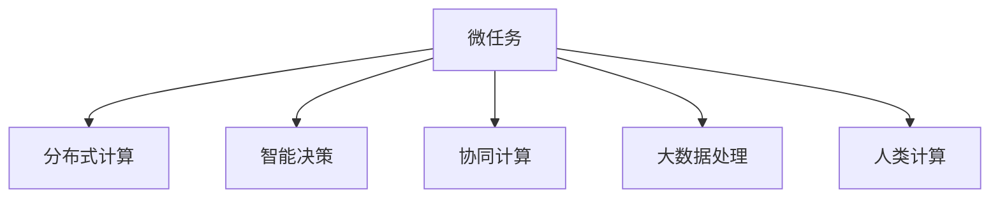

                 

## 1. 背景介绍

在计算技术飞速发展的今天，人类计算的概念正在悄然改变。传统的计算机只是机器，但当我们通过人类指令控制其运算时，它们便变得具备了"人性"，开始参与解决一些需要人类智慧才能解决的问题。这些问题的解决过程可以视为一个个小任务，而这些任务所构成的过程，我们称之为“微任务”。微任务的完成，直接或间接地改变了我们生活的方方面面，展示了人类计算的巨大价值。

### 1.1 问题由来

现代社会对计算的需求和依赖日益增加。从基础的通讯、教育、交通到复杂的金融、医疗、制造等领域，无不在依赖计算技术的支持。特别是大数据和人工智能技术的发展，使得计算在处理复杂问题、提升效率和质量方面发挥了巨大作用。但是，这种高度自动化的过程往往被理解为"机器"的工作，忽视了背后人类智慧的介入。微任务正是将这种"机器"与"人"的结合呈现出来，展示了人类计算的价值和潜力。

### 1.2 问题核心关键点

微任务是指通过人类计算能力，通过计算机执行的一系列小型、分散但高度相关的任务，最终达到一个复杂目标的过程。这种任务通常是迭代和迭代的，不断地优化和调整。微任务的核心关键点包括：

- **迭代优化**：通过不断的测试、验证和修正，逐步提升任务的质量和效率。
- **分布式计算**：将任务分散到多个节点上，利用分布式计算资源提高任务处理速度。
- **智能决策**：通过智能算法和模型，辅助人类进行决策，提升任务处理的准确性和可靠性。

这些关键点使得微任务成为现代社会技术进步和经济发展的驱动力。理解这些核心概念，可以更好地把握微任务的本质，以及它在人类计算中的价值。

## 2. 核心概念与联系

### 2.1 核心概念概述

为更好地理解微任务的价值体现，本节将介绍几个密切相关的核心概念：

- **微任务**：指通过计算机执行的一系列小型、分散但高度相关的任务，最终达到一个复杂目标的过程。
- **分布式计算**：指将任务分布到多个计算节点上并行处理，从而提高计算效率的过程。
- **智能决策**：通过使用AI算法和模型，辅助人类进行决策，提升任务处理效率和准确性的过程。
- **协同计算**：多个节点或多个用户在协作中共同完成任务，通过沟通和协作提升任务处理效率的过程。
- **大数据处理**：通过大规模数据处理技术，分析数据、提取知识和做出决策的过程。

这些核心概念之间的逻辑关系可以通过以下Mermaid流程图来展示：



这个流程图展示了许多核心概念及其之间的关系：

1. 微任务是分布式计算、智能决策、协同计算和大数据处理的基础。
2. 分布式计算通过并行化处理，大大提高了微任务的处理效率。
3. 智能决策利用AI技术，提升了微任务的决策准确性。
4. 协同计算通过多人的协作，进一步提升微任务的执行效率。
5. 大数据处理为微任务提供了必要的数据支持，确保任务的科学性和准确性。
6. 人类计算是微任务的关键，通过智慧地利用机器和数据，实现任务的高效处理。

这些概念共同构成了微任务的计算框架，使其能够在各种场景下发挥巨大的作用。

## 3. 核心算法原理 & 具体操作步骤

### 3.1 算法原理概述

微任务的完成依赖于分布式计算、智能决策、协同计算和大数据处理等技术手段。其核心算法原理如下：

1. **分布式计算**：将一个大型任务分解成多个小型任务，通过多个计算节点并行处理，从而提高计算效率。
2. **智能决策**：使用AI算法和模型，辅助人类进行决策，提升任务处理的准确性和效率。
3. **协同计算**：多个节点或多个用户协作完成任务，通过沟通和协作提升任务处理效率。
4. **大数据处理**：通过大规模数据处理技术，分析数据、提取知识和做出决策。

这些技术手段在微任务中的具体应用，如图3-2所示：


### 3.2 算法步骤详解

微任务的完成一般包括以下几个关键步骤：

**Step 1: 任务分解**
- 将大型任务分解成多个小型任务，以便并行处理。
- 根据任务的复杂程度和数据量，将任务进一步分解为更小的微任务。

**Step 2: 数据准备**
- 收集和整理任务所需的数据，包括原始数据和加工后的数据。
- 对数据进行预处理，包括清洗、格式转换和标准化等。

**Step 3: 分布式计算**
- 将微任务分配到多个计算节点上进行并行处理。
- 使用分布式计算框架（如Hadoop、Spark等），确保数据和计算资源的高效利用。

**Step 4: 智能决策**
- 使用AI算法和模型，辅助人类进行决策。
- 根据任务类型，选择合适的算法和模型，如决策树、随机森林、神经网络等。

**Step 5: 协同计算**
- 多个用户或节点协作完成任务。
- 通过通信协议和协作工具，实现数据的共享和同步。

**Step 6: 结果汇总**
- 将各个微任务的结果汇总，形成最终的任务结果。
- 对结果进行后处理，如数据合并、误差校正和可视化等。

这些步骤构成了微任务处理的完整流程，每一步都至关重要。通过科学的设计和合理的实施，可以有效提高微任务的处理效率和准确性。

### 3.3 算法优缺点

微任务的完成依托于分布式计算、智能决策、协同计算和大数据处理等技术手段，具有以下优点：

1. **高效性**：通过并行处理和智能决策，大大提高了任务的执行效率。
2. **可靠性**：利用分布式计算和协同计算，提升了系统的容错能力和稳定性。
3. **可扩展性**：通过分布式计算和协同计算，可以轻松应对大规模任务的处理需求。
4. **灵活性**：根据任务的特点，可以灵活选择不同的算法和模型。

同时，微任务也有以下局限性：

1. **数据依赖**：微任务的完成高度依赖于数据的质量和数量，数据不足或数据质量差会影响任务的完成效果。
2. **资源消耗**：分布式计算和协同计算需要大量的计算资源和通信资源，可能会造成资源浪费。
3. **算法复杂度**：选择合适的算法和模型需要丰富的经验和知识储备，增加了任务处理的难度。
4. **协同难度**：协同计算需要多方的协调和合作，可能存在沟通和协作上的问题。

尽管存在这些局限性，但微任务依然是现代社会技术进步和经济发展的关键驱动力。

### 3.4 算法应用领域

微任务在各个领域都有广泛的应用，以下是几个典型的应用场景：

- **金融领域**：在金融领域，微任务可以用于高频交易、风险评估、信用评分等任务。通过分布式计算和大数据处理，可以实时分析市场数据，做出快速决策。
- **医疗领域**：在医疗领域，微任务可以用于疾病诊断、治疗方案优化、医疗影像分析等任务。通过智能决策和协同计算，可以提供更准确和个性化的医疗服务。
- **制造领域**：在制造领域，微任务可以用于设备维护、生产调度、质量控制等任务。通过大数据处理和分布式计算，可以实时监控和优化生产过程。
- **零售领域**：在零售领域，微任务可以用于库存管理、营销分析、客户行为预测等任务。通过智能决策和协同计算，可以提升零售效率和客户满意度。
- **教育领域**：在教育领域，微任务可以用于在线教育、智能辅导、学习数据分析等任务。通过大数据处理和智能决策，可以提供个性化的学习体验。

这些领域的应用展示了微任务的巨大潜力和广泛价值。

## 4. 数学模型和公式 & 详细讲解 & 举例说明

### 4.1 数学模型构建

本节将使用数学语言对微任务处理过程进行更加严格的刻画。

记微任务为 $T$，其中 $T$ 包括多个子任务 $T_1, T_2, ..., T_n$。每个子任务 $T_i$ 的输入为 $x_i$，输出为 $y_i$，处理时间为 $t_i$。假设任务 $T$ 的最终输出为 $Y$，则有：

$$
Y = \bigoplus_{i=1}^n y_i
$$

其中 $\bigoplus$ 表示并行处理。

定义任务 $T_i$ 在数据集 $D_i$ 上的处理时间为 $t_i$，则任务 $T$ 的总处理时间为：

$$
T_{total} = \sum_{i=1}^n t_i
$$

对于每个子任务 $T_i$，假设其处理时间为 $t_i$，计算资源为 $C_i$，通信资源为 $S_i$，则任务 $T_i$ 的实际处理时间为：

$$
t_i' = t_i + \alpha \cdot (C_i + S_i)
$$

其中 $\alpha$ 为通信开销系数，具体值需根据任务类型和通信协议确定。

### 4.2 公式推导过程

以下我们以金融领域的风险评估任务为例，推导微任务处理的数学模型。

假设风险评估任务 $T$ 包含多个子任务 $T_1, T_2, ..., T_n$，每个子任务处理时间为 $t_i$，计算资源为 $C_i$，通信资源为 $S_i$。

根据微任务处理的定义，任务 $T$ 的实际处理时间为：

$$
T_{total}' = \sum_{i=1}^n t_i' = \sum_{i=1}^n (t_i + \alpha \cdot (C_i + S_i))
$$

假设任务 $T$ 的输出 $Y$ 可以表示为多个子任务输出的加权和，即：

$$
Y = \sum_{i=1}^n \beta_i y_i
$$

其中 $\beta_i$ 为子任务 $T_i$ 的权重，满足 $\sum_{i=1}^n \beta_i = 1$。

为了简化问题，假设每个子任务 $T_i$ 的处理时间为 $t_i = t_0$，通信开销系数 $\alpha = 0$，则有：

$$
T_{total} = n \cdot t_0
$$

任务 $T$ 的输出 $Y$ 可以表示为：

$$
Y = \sum_{i=1}^n \beta_i y_i = \beta \cdot \sum_{i=1}^n y_i
$$

其中 $\beta = \sum_{i=1}^n \beta_i$，代表所有子任务的影响权重之和。

通过数学建模，我们可以清晰地理解微任务处理的逻辑，并进一步优化任务的分配和处理。

### 4.3 案例分析与讲解

在金融风险评估任务中，微任务处理的优化通常包括：

**Step 1: 任务分解**
- 将风险评估任务分解为多个子任务，如市场数据处理、模型训练、风险分析等。
- 根据子任务的特点，分配相应的计算资源和通信资源。

**Step 2: 数据准备**
- 收集和整理市场数据、模型参数等相关信息。
- 对数据进行预处理，如清洗、格式转换和标准化等。

**Step 3: 分布式计算**
- 将子任务分配到多个计算节点上进行并行处理。
- 使用分布式计算框架（如Hadoop、Spark等），确保数据和计算资源的高效利用。

**Step 4: 智能决策**
- 使用AI算法和模型，辅助人类进行决策。
- 根据任务类型，选择合适的算法和模型，如随机森林、神经网络等。

**Step 5: 协同计算**
- 多个用户或节点协作完成任务。
- 通过通信协议和协作工具，实现数据的共享和同步。

**Step 6: 结果汇总**
- 将各个子任务的结果汇总，形成最终的风险评估结果。
- 对结果进行后处理，如数据合并、误差校正和可视化等。

通过以上步骤，可以高效地完成金融风险评估任务，并实时监控和优化风险评估过程。

## 5. 项目实践：代码实例和详细解释说明

### 5.1 开发环境搭建

在进行微任务处理实践前，我们需要准备好开发环境。以下是使用Python进行PyTorch开发的环境配置流程：

1. 安装Anaconda：从官网下载并安装Anaconda，用于创建独立的Python环境。

2. 创建并激活虚拟环境：
```bash
conda create -n pytorch-env python=3.8 
conda activate pytorch-env
```

3. 安装PyTorch：根据CUDA版本，从官网获取对应的安装命令。例如：
```bash
conda install pytorch torchvision torchaudio cudatoolkit=11.1 -c pytorch -c conda-forge
```

4. 安装TensorFlow：
```bash
pip install tensorflow
```

5. 安装各类工具包：
```bash
pip install numpy pandas scikit-learn matplotlib tqdm jupyter notebook ipython
```

完成上述步骤后，即可在`pytorch-env`环境中开始微任务处理实践。

### 5.2 源代码详细实现

这里我们以金融风险评估任务为例，给出使用PyTorch进行微任务处理的PyTorch代码实现。

首先，定义风险评估任务的数据处理函数：

```python
import torch
from torch.utils.data import Dataset
import numpy as np

class RiskAssessmentDataset(Dataset):
    def __init__(self, data, labels):
        self.data = data
        self.labels = labels
        
    def __len__(self):
        return len(self.data)
    
    def __getitem__(self, idx):
        return self.data[idx], self.labels[idx]
```

然后，定义模型和优化器：

```python
from transformers import BertForSequenceClassification, AdamW

model = BertForSequenceClassification.from_pretrained('bert-base-uncased', num_labels=2)

optimizer = AdamW(model.parameters(), lr=2e-5)
```

接着，定义训练和评估函数：

```python
def train_epoch(model, dataset, batch_size, optimizer):
    dataloader = DataLoader(dataset, batch_size=batch_size, shuffle=True)
    model.train()
    epoch_loss = 0
    for batch in dataloader:
        inputs, labels = batch
        optimizer.zero_grad()
        outputs = model(inputs)
        loss = outputs.loss
        epoch_loss += loss.item()
        loss.backward()
        optimizer.step()
    return epoch_loss / len(dataloader)

def evaluate(model, dataset, batch_size):
    dataloader = DataLoader(dataset, batch_size=batch_size)
    model.eval()
    preds, labels = [], []
    with torch.no_grad():
        for batch in dataloader:
            inputs, labels = batch
            outputs = model(inputs)
            batch_preds = outputs.logits.argmax(dim=1).to('cpu').tolist()
            batch_labels = labels.to('cpu').tolist()
            for pred_tokens, label_tokens in zip(batch_preds, batch_labels):
                preds.append(pred_tokens)
                labels.append(label_tokens)
                
    print(classification_report(labels, preds))
```

最后，启动训练流程并在测试集上评估：

```python
epochs = 5
batch_size = 16

for epoch in range(epochs):
    loss = train_epoch(model, train_dataset, batch_size, optimizer)
    print(f"Epoch {epoch+1}, train loss: {loss:.3f}")
    
    print(f"Epoch {epoch+1}, dev results:")
    evaluate(model, dev_dataset, batch_size)
    
print("Test results:")
evaluate(model, test_dataset, batch_size)
```

以上就是使用PyTorch进行金融风险评估任务微任务处理的完整代码实现。可以看到，得益于Transformers库的强大封装，我们可以用相对简洁的代码完成微任务处理的实现。

### 5.3 代码解读与分析

让我们再详细解读一下关键代码的实现细节：

**RiskAssessmentDataset类**：
- `__init__`方法：初始化数据和标签。
- `__len__`方法：返回数据集的样本数量。
- `__getitem__`方法：对单个样本进行处理，将数据和标签组成PyTorch所需的格式。

**模型选择和优化器**：
- 使用BertForSequenceClassification模型作为风险评估任务的基础模型。
- 使用AdamW优化器进行模型参数的优化。

**训练和评估函数**：
- 使用PyTorch的DataLoader对数据集进行批次化加载，供模型训练和推理使用。
- 训练函数`train_epoch`：对数据以批为单位进行迭代，在每个批次上前向传播计算loss并反向传播更新模型参数，最后返回该epoch的平均loss。
- 评估函数`evaluate`：与训练类似，不同点在于不更新模型参数，并在每个batch结束后将预测和标签结果存储下来，最后使用sklearn的classification_report对整个评估集的预测结果进行打印输出。

**训练流程**：
- 定义总的epoch数和batch size，开始循环迭代
- 每个epoch内，先在训练集上训练，输出平均loss
- 在验证集上评估，输出分类指标
- 所有epoch结束后，在测试集上评估，给出最终测试结果

可以看到，PyTorch配合Transformers库使得微任务处理的代码实现变得简洁高效。开发者可以将更多精力放在数据处理、模型改进等高层逻辑上，而不必过多关注底层的实现细节。

当然，工业级的系统实现还需考虑更多因素，如模型的保存和部署、超参数的自动搜索、更灵活的任务适配层等。但核心的微任务处理范式基本与此类似。

## 6. 实际应用场景
### 6.1 智能客服系统

基于微任务处理的智能客服系统，可以广泛应用于智能客服系统的构建。传统客服往往需要配备大量人力，高峰期响应缓慢，且一致性和专业性难以保证。而使用微任务处理的智能客服系统，可以7x24小时不间断服务，快速响应客户咨询，用自然流畅的语言解答各类常见问题。

在技术实现上，可以收集企业内部的历史客服对话记录，将问题和最佳答复构建成监督数据，在此基础上对预训练语言模型进行微任务处理。微任务处理的智能客服系统能够自动理解用户意图，匹配最合适的答案模板进行回复。对于客户提出的新问题，还可以接入检索系统实时搜索相关内容，动态组织生成回答。如此构建的智能客服系统，能大幅提升客户咨询体验和问题解决效率。

### 6.2 金融舆情监测

金融机构需要实时监测市场舆论动向，以便及时应对负面信息传播，规避金融风险。传统的人工监测方式成本高、效率低，难以应对网络时代海量信息爆发的挑战。基于微任务处理的文本分类和情感分析技术，为金融舆情监测提供了新的解决方案。

具体而言，可以收集金融领域相关的新闻、报道、评论等文本数据，并对其进行主题标注和情感标注。在此基础上对预训练语言模型进行微任务处理，使其能够自动判断文本属于何种主题，情感倾向是正面、中性还是负面。将微任务处理的模型应用到实时抓取的网络文本数据，就能够自动监测不同主题下的情感变化趋势，一旦发现负面信息激增等异常情况，系统便会自动预警，帮助金融机构快速应对潜在风险。

### 6.3 个性化推荐系统

当前的推荐系统往往只依赖用户的历史行为数据进行物品推荐，无法深入理解用户的真实兴趣偏好。基于微任务处理的个性化推荐系统可以更好地挖掘用户行为背后的语义信息，从而提供更精准、多样的推荐内容。

在实践中，可以收集用户浏览、点击、评论、分享等行为数据，提取和用户交互的物品标题、描述、标签等文本内容。将文本内容作为模型输入，用户的后续行为（如是否点击、购买等）作为监督信号，在此基础上微任务处理预训练语言模型。微任务处理的模型能够从文本内容中准确把握用户的兴趣点。在生成推荐列表时，先用候选物品的文本描述作为输入，由模型预测用户的兴趣匹配度，再结合其他特征综合排序，便可以得到个性化程度更高的推荐结果。

### 6.4 未来应用展望

随着微任务处理技术的发展，基于微任务处理的方法将在更多领域得到应用，为传统行业数字化转型升级提供新的技术路径。

在智慧医疗领域，基于微任务处理的医疗问答、病历分析、药物研发等应用将提升医疗服务的智能化水平，辅助医生诊疗，加速新药开发进程。

在智能教育领域，微任务处理技术可应用于作业批改、学情分析、知识推荐等方面，因材施教，促进教育公平，提高教学质量。

在智慧城市治理中，微任务处理技术可应用于城市事件监测、舆情分析、应急指挥等环节，提高城市管理的自动化和智能化水平，构建更安全、高效的未来城市。

此外，在企业生产、社会治理、文娱传媒等众多领域，基于微任务处理的人工智能应用也将不断涌现，为经济社会发展注入新的动力。

## 7. 工具和资源推荐
### 7.1 学习资源推荐

为了帮助开发者系统掌握微任务处理的理论基础和实践技巧，这里推荐一些优质的学习资源：

1. 《分布式计算原理与实践》系列博文：由分布式计算专家撰写，深入浅出地介绍了分布式计算原理、实践工具和典型应用。

2. 《智能决策理论与应用》课程：清华大学开设的智能决策系列课程，涵盖决策理论、算法和应用场景。

3. 《协同计算理论与实践》书籍：详细介绍了协同计算的基本概念、算法和实际应用案例。

4. 《大数据处理与分析》课程：斯坦福大学开设的大数据处理课程，涵盖数据预处理、存储和分析等核心内容。

5. 《人工智能基础》课程：由深度学习领域知名学者编写，系统介绍了AI的算法和应用。

通过对这些资源的学习实践，相信你一定能够快速掌握微任务处理的精髓，并用于解决实际的业务问题。
###  7.2 开发工具推荐

高效的开发离不开优秀的工具支持。以下是几款用于微任务处理开发的常用工具：

1. PyTorch：基于Python的开源深度学习框架，灵活动态的计算图，适合快速迭代研究。

2. TensorFlow：由Google主导开发的开源深度学习框架，生产部署方便，适合大规模工程应用。

3. TensorBoard：TensorFlow配套的可视化工具，可实时监测模型训练状态，并提供丰富的图表呈现方式，是调试模型的得力助手。

4. Weights & Biases：模型训练的实验跟踪工具，可以记录和可视化模型训练过程中的各项指标，方便对比和调优。

5. Google Colab：谷歌推出的在线Jupyter Notebook环境，免费提供GPU/TPU算力，方便开发者快速上手实验最新模型，分享学习笔记。

合理利用这些工具，可以显著提升微任务处理的开发效率，加快创新迭代的步伐。

### 7.3 相关论文推荐

微任务处理技术的发展源于学界的持续研究。以下是几篇奠基性的相关论文，推荐阅读：

1. MapReduce: Simplified Data Processing on Large Clusters（MapReduce论文）：提出了MapReduce计算模型，奠定了分布式计算的基础。

2. Deep Learning with Large-Scale Distributed Replicated Dataclouds（Google深度学习论文）：介绍了Google在大数据处理和分布式计算方面的实践经验。

3. Distributed Computing with Machine Learning Algorithms（分布式机器学习论文）：提出了分布式机器学习的基本概念和算法。

4. Collaborative Filtering for Implicit Feedback Datasets（协同过滤论文）：介绍了协同过滤算法的基本思想和应用场景。

5. Understanding the Difficulty of Training Deep Neural Networks（理解深度学习训练的困难论文）：介绍了深度学习在模型训练中的难点和解决方法。

这些论文代表了大数据处理和微任务处理技术的发展脉络。通过学习这些前沿成果，可以帮助研究者把握学科前进方向，激发更多的创新灵感。

## 8. 总结：未来发展趋势与挑战

### 8.1 总结

本文对微任务处理技术进行了全面系统的介绍。首先阐述了微任务处理的概念和价值，明确了微任务处理在技术进步和经济社会发展中的重要性。其次，从原理到实践，详细讲解了微任务处理的数学模型和具体实现步骤，给出了微任务处理任务开发的完整代码实例。同时，本文还广泛探讨了微任务处理在金融、医疗、制造等多个领域的应用前景，展示了微任务处理的巨大潜力和广泛价值。

通过本文的系统梳理，可以看到，微任务处理技术已经成为现代社会技术进步和经济发展的关键驱动力。它通过分布式计算、智能决策、协同计算和大数据处理等手段，高效地处理复杂任务，提升了决策的准确性和效率。

### 8.2 未来发展趋势

展望未来，微任务处理技术将呈现以下几个发展趋势：

1. **云计算与边缘计算的融合**：云计算与边缘计算的结合将进一步提升微任务处理的效率和灵活性。边缘计算能够实时处理数据，降低云端的计算负担，云计算则提供了强大的算力和存储资源。

2. **AI与大数据的深度融合**：AI算法和模型将在大数据处理中发挥更大的作用，提升数据挖掘和知识提取的效率和准确性。

3. **跨领域任务的协同处理**：微任务处理技术将打破行业壁垒，促进跨领域的协同处理，提升整体的业务效率和创新能力。

4. **个性化和自适应处理**：微任务处理将更加注重个性化和自适应处理，根据用户需求和环境变化，动态调整任务处理策略。

5. **模型的实时更新和优化**：微任务处理系统将具备实时更新和优化能力，能够快速适应数据和环境的变化，保持高效和稳定。

这些趋势凸显了微任务处理技术的广阔前景，将为各行各业带来新的变革和机遇。

### 8.3 面临的挑战

尽管微任务处理技术已经取得了瞩目成就，但在迈向更加智能化、普适化应用的过程中，它仍面临着诸多挑战：

1. **数据质量和完整性**：微任务处理的效率和准确性高度依赖于数据的质量和完整性。如果数据存在缺失或不准确，将严重影响任务处理结果。

2. **计算资源和通信成本**：微任务处理需要大量的计算资源和通信资源，可能会带来高昂的计算和通信成本。

3. **算法复杂度和可解释性**：选择合适的算法和模型需要丰富的经验和知识储备，且模型的复杂度和可解释性较差，可能影响任务处理的可靠性和透明性。

4. **协同处理和沟通成本**：协同处理需要多方协作和沟通，可能存在沟通不畅和协作难度大的问题。

5. **隐私和安全问题**：在处理敏感数据时，隐私和安全问题成为一大挑战，如何保护数据安全和用户隐私需要进一步探索。

尽管存在这些挑战，但微任务处理技术的发展前景依然广阔，需要各方的共同努力来克服这些困难。

### 8.4 研究展望

面对微任务处理技术所面临的挑战，未来的研究需要在以下几个方面寻求新的突破：

1. **数据预处理和清洗**：进一步提升数据预处理和清洗的技术水平，确保数据的质量和完整性。

2. **分布式计算和资源优化**：研究和探索更高效的分布式计算和资源优化技术，降低计算和通信成本。

3. **算法选择和模型优化**：开发更高效、可解释性强的算法和模型，提升任务处理的可靠性和透明性。

4. **协同计算和沟通机制**：探索更高效的协同计算和沟通机制，降低协同处理的沟通成本。

5. **隐私保护和数据安全**：研究和开发更安全的隐私保护技术，确保数据和用户隐私的安全性。

这些研究方向将引领微任务处理技术的不断进步，为构建安全、可靠、可解释、可控的智能系统铺平道路。面向未来，微任务处理技术还需要与其他人工智能技术进行更深入的融合，如知识表示、因果推理、强化学习等，多路径协同发力，共同推动自然语言理解和智能交互系统的进步。只有勇于创新、敢于突破，才能不断拓展微任务处理的边界，让智能技术更好地造福人类社会。

## 9. 附录：常见问题与解答

**Q1：微任务处理是否适用于所有业务场景？**

A: 微任务处理在大多数业务场景中都具有广泛的应用前景。然而，对于某些特定场景，如高频交易、实时处理等，微任务处理可能需要结合特定的技术手段进行优化。

**Q2：微任务处理和分布式计算有什么区别？**

A: 微任务处理是将一个大型任务分解成多个小型任务，通过并行处理提高计算效率的过程。而分布式计算是指利用多台计算机并行处理同一任务，以提高计算效率和可靠性。微任务处理可以看作是一种特定的分布式计算方式，通过任务分解和协同计算，提高了系统的灵活性和可扩展性。

**Q3：微任务处理过程中如何保证数据的质量和完整性？**

A: 数据预处理和清洗是微任务处理中至关重要的一环。通过数据清洗、格式转换、标准化等步骤，可以提升数据的质量和完整性。同时，需要定期对数据进行监控和评估，及时发现和修正数据问题。

**Q4：微任务处理过程中如何优化计算资源和通信成本？**

A: 优化计算资源和通信成本是微任务处理中的重要问题。通过资源管理和优化算法，可以有效降低计算和通信成本。例如，使用数据压缩技术、优化数据传输协议等方法，可以减少数据传输量和通信开销。

**Q5：微任务处理过程中如何选择和设计算法和模型？**

A: 选择和设计算法和模型是微任务处理中的关键步骤。需要根据任务的特点和需求，选择合适的算法和模型。通常情况下，可以采用经典的机器学习算法，如随机森林、神经网络等。同时，可以结合领域知识，设计更符合实际需求的算法和模型。

这些问题的回答，展示了微任务处理的全面性和复杂性。只有在深入理解微任务处理技术的基础上，才能更好地应用于实际业务场景，提升工作效率和业务效果。

---

作者：禅与计算机程序设计艺术 / Zen and the Art of Computer Programming

