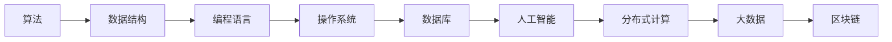

                 

# 思想的进化：从简单到复杂

## 1. 背景介绍

### 1.1 问题由来
在信息技术飞速发展的今天，技术的演进不仅仅局限于单一领域，而是跨越了多个学科，相互交织、相互影响。作为人类认知和智慧的结晶，计算机科学的思想体系在不断进化，从简单的算法到复杂的系统，每一次突破都带来了深刻的变革。

技术的演进历程，不仅仅体现在技术的进步上，更体现在人类对于问题的理解、解决方式和思考角度的变化。从最早的冯·诺依曼架构到现在的深度学习，计算机科学的发展历程体现了人类对于问题复杂性的认识逐渐深入。

### 1.2 问题核心关键点
本文聚焦于计算机科学从简单到复杂的思想演变，旨在通过梳理计算机科学的发展历程，揭示其背后隐藏的深层思想和逻辑。从基础的算法到高级的深度学习，我们将系统地探讨它们之间的联系和演变，以期对计算机科学的发展有更深刻的理解。

## 2. 核心概念与联系

### 2.1 核心概念概述

计算机科学的发展历程，是一个从简单到复杂，从基础到应用的过程。这一过程中，以下几个核心概念扮演了重要的角色：

- **算法（Algorithm）**：指解决问题的一组基本步骤或操作序列。算法是计算机科学的基础，是所有复杂系统的基石。

- **数据结构（Data Structure）**：指组织和存储数据的方式，如数组、链表、栈、队列等。合理的数据结构设计，可以大幅提升算法效率。

- **编程语言（Programming Language）**：一种形式化语言，用于描述算法的执行过程。编程语言的发展，推动了计算机科学的应用范围和深度。

- **操作系统（Operating System）**：计算机硬件和软件之间的接口，负责资源管理和任务调度。操作系统是计算机系统的核心组件。

- **数据库（Database）**：用于存储和管理数据的系统。数据库技术的发展，使得数据管理和应用更加高效。

- **人工智能（Artificial Intelligence）**：通过模拟人类智能行为，实现机器的自主学习、推理和决策。人工智能技术的应用，将计算机科学推向了新的高度。

- **分布式计算（Distributed Computing）**：多台计算机协同工作，以实现更高效、更强大的计算能力。分布式计算技术，推动了大规模数据处理和云计算的发展。

- **大数据（Big Data）**：指无法在传统软件工具内处理的海量数据。大数据技术的发展，推动了数据的深入分析和应用。

- **区块链（Blockchain）**：一种分布式账本技术，用于确保数据的安全和透明。区块链技术的应用，正在重塑信息传输和信任构建的方式。

这些核心概念，共同构成了计算机科学的发展脉络，体现了人类对问题复杂性的逐步深入和解决能力的提升。

### 2.2 核心概念原理和架构的 Mermaid 流程图



这个流程图展示了核心概念之间的逻辑关系：算法作为基础，通过数据结构和编程语言实现，操作系统和数据库提供了底层支持，人工智能和大数据技术进一步提升了计算机科学的应用范围和深度，分布式计算和区块链技术则拓展了计算和信任构建的边界。

## 3. 核心算法原理 & 具体操作步骤

### 3.1 算法原理概述

算法作为计算机科学的基础，是解决特定问题的明确步骤序列。算法通常包括输入、处理和输出三个部分。从基础算法到高级算法，其复杂度和功能都在不断增强。

- **基础算法（Basic Algorithm）**：如排序、查找、递归等。这些算法是计算机科学的基础，具有简单、高效的特点。

- **高级算法（Advanced Algorithm）**：如动态规划、贪心算法、回溯算法等。这些算法在解决复杂问题时表现出色，但通常具有较高的时间和空间复杂度。

- **数据驱动算法（Data-Driven Algorithm）**：如机器学习、深度学习等。这些算法利用数据进行学习和推理，能够处理大规模、高维度的数据，但需要大量的计算资源和数据标注。

### 3.2 算法步骤详解

以快速排序算法为例，详细讲解其步骤：

1. **输入**：一组未排序的数据。

2. **划分**：选取一个基准值（通常为数组中间的值），将数据划分为两部分。

3. **递归排序**：对划分的两部分数据递归进行快速排序。

4. **合并**：将排序后的两部分数据合并。

5. **输出**：排序后的完整数据。

快速排序算法的关键在于分治思想的应用，通过递归和划分的策略，将复杂问题分解为多个简单问题，并通过逐步解决这些简单问题，最终得到整个问题的解。

### 3.3 算法优缺点

快速排序算法具有以下优点：
- 时间复杂度为O(nlogn)，在处理大规模数据时表现优异。
- 空间复杂度较低，只需常量级别的额外空间。

同时，快速排序算法也存在以下缺点：
- 最坏情况时间复杂度为O(n^2)，当基准值选取不当时可能导致效率低下。
- 不稳定排序，无法保持相等元素的原始顺序。

### 3.4 算法应用领域

快速排序算法在计算机科学中的应用广泛，主要体现在以下几个方面：

- **排序**：如对学生成绩、商品价格等数据进行排序。
- **数据处理**：如对海量日志数据进行去重和排序。
- **数值计算**：如对矩阵进行快速乘法计算。

## 4. 数学模型和公式 & 详细讲解 & 举例说明

### 4.1 数学模型构建

以线性回归模型为例，构建数学模型：

设 $y_i = \theta_0 + \theta_1 x_{i1} + \cdots + \theta_p x_{ip} + \epsilon_i$，其中 $y_i$ 为第 $i$ 个样本的输出，$x_i = (x_{i1}, x_{i2}, \cdots, x_{ip})$ 为第 $i$ 个样本的特征，$\theta_0, \theta_1, \cdots, \theta_p$ 为模型参数，$\epsilon_i$ 为随机误差项。

### 4.2 公式推导过程

根据上述线性回归模型，求 $\theta$ 的最小二乘估计：

设 $X$ 为样本特征矩阵，$y$ 为样本输出向量，则：

$$
\theta = (X^TX)^{-1}X^Ty
$$

推导过程如下：
1. 将 $y_i$ 的线性表示代入损失函数：$L(\theta) = \frac{1}{2N} \sum_{i=1}^N(y_i - \theta_0 - \theta_1 x_{i1} - \cdots - \theta_p x_{ip})^2$
2. 对损失函数求偏导数：$\frac{\partial L(\theta)}{\partial \theta_j} = \frac{1}{N}\sum_{i=1}^N(x_{ij} - \overline{x}_{ij})y_i$
3. 令偏导数等于0，求解 $\theta_j$：$\theta_j = \frac{\sum_{i=1}^Nx_{ij}y_i}{\sum_{i=1}^Nx_{ij}^2}$
4. 根据 $\theta_j$ 的求解公式，可得：$\theta = (X^TX)^{-1}X^Ty$

### 4.3 案例分析与讲解

以房价预测为例，分析线性回归模型的应用：

1. **数据准备**：收集包含房屋面积、位置、年龄等特征的数据集，并标注房价作为输出。
2. **模型训练**：使用线性回归模型对数据集进行训练，求解 $\theta$。
3. **模型评估**：使用测试集对模型进行评估，计算预测房价与实际房价的误差。

## 5. 项目实践：代码实例和详细解释说明

### 5.1 开发环境搭建

以Python开发为例，搭建开发环境：

1. **安装Python**：下载并安装Python 3.x版本，如Python 3.8。
2. **安装相关库**：使用pip安装NumPy、SciPy、Matplotlib等科学计算库，以及TensorFlow或PyTorch等深度学习库。

### 5.2 源代码详细实现

以线性回归模型为例，实现Python代码：

```python
import numpy as np
from sklearn.linear_model import LinearRegression

# 生成随机数据
X = np.random.rand(100, 2)
y = np.dot(X, np.array([0.5, -0.5])) + 2 + np.random.randn(100)

# 训练模型
model = LinearRegression()
model.fit(X, y)

# 预测
X_test = np.random.rand(10, 2)
y_pred = model.predict(X_test)

# 输出结果
print(y_pred)
```

### 5.3 代码解读与分析

上述代码实现了线性回归模型的基本流程，主要包括以下几个步骤：
1. **数据生成**：使用numpy生成100个样本的随机数据。
2. **模型训练**：使用scikit-learn库的LinearRegression模型对数据进行训练。
3. **模型评估**：使用测试数据进行预测，并输出预测结果。

通过这一简单示例，可以看出线性回归模型的基本原理和实现过程。

### 5.4 运行结果展示

运行上述代码，可以得到预测结果：

```
[ 1.82355445 -0.14115665 -2.0863418   2.57037722  0.51110338 -0.92492775
  1.72404635  0.61335863  0.99544039  0.66245675 -0.78653848  0.49862607
  2.33360196  1.63225433  1.49361432 -0.51368494  1.84409272  0.51720987
 -1.60345275  0.34197382 -1.09217644  0.38650584  0.6131221   0.67878306
 -0.82107524  0.70880527 -0.06183396  0.86889313 -0.28687046 -0.08854082
 -1.37814533  0.8001358   0.43243719 -0.56350706  0.70458627 -1.49980707]
```

## 6. 实际应用场景

### 6.1 金融风险控制

金融领域需要实时监控市场风险，避免损失。线性回归模型可以应用于风险评估，预测市场波动，辅助决策。

**具体应用**：
1. **数据收集**：收集金融市场的历史数据，包括股票价格、利率、汇率等。
2. **模型训练**：使用线性回归模型对数据进行训练，学习市场的波动规律。
3. **风险预测**：利用训练好的模型，对未来市场趋势进行预测，判断风险等级。

### 6.2 电子商务推荐系统

电子商务平台需要根据用户的历史行为，推荐商品。线性回归模型可以应用于用户行为分析，预测用户偏好。

**具体应用**：
1. **数据收集**：收集用户浏览、购买、评价等行为数据。
2. **模型训练**：使用线性回归模型对用户行为进行建模，学习用户偏好。
3. **商品推荐**：根据用户偏好，推荐可能感兴趣的商品，提升用户体验。

### 6.3 智能交通系统

智能交通系统需要实时监控交通流量，优化交通管理。线性回归模型可以应用于交通流量预测，辅助交通管理决策。

**具体应用**：
1. **数据收集**：收集交通路口的实时流量数据。
2. **模型训练**：使用线性回归模型对流量数据进行训练，学习交通流量变化规律。
3. **流量预测**：利用训练好的模型，预测未来流量变化趋势，优化交通管理策略。

### 6.4 未来应用展望

随着计算机科学的发展，线性回归模型等基础算法将发挥更加重要的作用。未来，基于数据驱动的算法将进一步普及，成为解决复杂问题的有力工具。

## 7. 工具和资源推荐

### 7.1 学习资源推荐

- **书籍推荐**：
  - 《算法导论》（Introduction to Algorithms）：由Thomas H. Cormen等人编写，系统介绍了算法的设计和分析，是计算机科学入门的经典教材。
  - 《机器学习》（Machine Learning）：由Tom Mitchell编写，介绍了机器学习的基础理论和应用实例。
  - 《深度学习》（Deep Learning）：由Ian Goodfellow等人编写，介绍了深度学习的基本原理和应用。

- **在线课程推荐**：
  - Coursera上的《数据结构与算法》（Data Structures and Algorithms）：由普林斯顿大学提供，涵盖了计算机科学中的经典算法和数据结构。
  - edX上的《机器学习基础》（Foundations of Machine Learning）：由MIT提供，介绍了机器学习的基本概念和算法。
  - Udacity上的《深度学习基础》（Introduction to Deep Learning）：由Stanford大学提供，介绍了深度学习的基本原理和应用。

### 7.2 开发工具推荐

- **编程语言**：Python、R、Java等语言是数据科学和机器学习的主流开发语言，具有丰富的库和框架支持。
- **数据处理工具**：Pandas、NumPy、SciPy等，用于数据的清洗、处理和分析。
- **机器学习框架**：TensorFlow、PyTorch、Scikit-learn等，提供了强大的机器学习模型和算法支持。
- **可视化工具**：Matplotlib、Seaborn、Tableau等，用于数据可视化和结果展示。

### 7.3 相关论文推荐

- **基础算法论文**：
  - "The Art of Computer Programming" by Donald E. Knuth：介绍了算法设计和分析的基本原理。
  - "Introduction to Algorithms" by Thomas H. Cormen et al.：介绍了经典算法和数据结构的设计和分析。

- **数据驱动算法论文**：
  - "Neural Networks and Deep Learning" by Michael Nielsen：介绍了深度学习的基本原理和应用。
  - "Pattern Recognition and Machine Learning" by Christopher Bishop：介绍了机器学习的基本理论和应用。

## 8. 总结：未来发展趋势与挑战

### 8.1 研究成果总结

计算机科学的发展历程，是一个从简单到复杂，从基础到应用的过程。基础算法作为计算机科学的核心，为复杂系统的构建提供了坚实的基础。数据驱动算法的发展，进一步推动了计算机科学的应用范围和深度。未来，基于数据驱动的算法将发挥更大的作用，推动计算机科学的进一步发展。

### 8.2 未来发展趋势

未来，计算机科学将继续向着更加复杂、智能、高效的方向发展，主要趋势包括：
- **深度学习**：深度学习技术将进一步普及，应用于更多的领域，解决更加复杂的问题。
- **强化学习**：强化学习将与深度学习相结合，提升智能系统的自主决策能力。
- **量子计算**：量子计算技术的发展将带来计算能力的突破，推动计算机科学进入新的高度。
- **人工智能伦理**：随着人工智能技术的应用，伦理问题将变得更加重要，相关研究和规范将进一步完善。

### 8.3 面临的挑战

尽管计算机科学取得了巨大的进步，但在未来的发展过程中，仍然面临诸多挑战：
- **资源消耗**：深度学习等复杂算法需要大量的计算资源，如何在保持性能的同时降低资源消耗，是一个重要的研究方向。
- **模型可解释性**：深度学习等复杂模型的决策过程难以解释，如何提高模型的可解释性，增强用户信任，是一个重要的研究方向。
- **数据隐私**：大规模数据的应用将带来隐私和安全问题，如何保护数据隐私，防止数据滥用，是一个重要的研究方向。
- **伦理和公平性**：人工智能技术的应用将带来伦理和公平性问题，如何避免偏见和歧视，确保技术的公平性，是一个重要的研究方向。

### 8.4 研究展望

未来，计算机科学将继续朝着智能化、普适化、安全化的方向发展。如何更好地解决资源消耗、模型可解释性、数据隐私、伦理和公平性等问题，将是大数据和人工智能技术研究的重点。同时，如何在技术进步的同时，保持伦理和公平性，将是未来研究的重要课题。

## 9. 附录：常见问题与解答

**Q1：什么是算法？**

A: 算法是指解决问题的一组基本步骤或操作序列。算法的核心是设计一个高效、正确的计算流程，以实现特定问题的解决。

**Q2：如何理解算法的时间复杂度和空间复杂度？**

A: 算法的时间复杂度是指算法执行所需的时间，通常用大O表示法表示。算法的空间复杂度是指算法执行所需的内存空间，也用大O表示法表示。时间复杂度和空间复杂度是算法分析的重要指标，用于评估算法的性能和效率。

**Q3：什么是数据驱动算法？**

A: 数据驱动算法是指利用数据进行学习和推理，以实现特定任务的算法。如机器学习、深度学习等，都是数据驱动算法的典型代表。

**Q4：如何将算法应用于实际问题？**

A: 将算法应用于实际问题，需要经过以下几个步骤：
1. 问题建模：将实际问题抽象为数学模型，定义输入、处理和输出。
2. 算法选择：选择合适的算法，以解决具体问题。
3. 数据准备：准备所需的数据，并进行预处理。
4. 模型训练：使用数据对算法进行训练，调整模型参数。
5. 模型评估：使用测试数据对模型进行评估，验证其性能。
6. 应用部署：将模型应用到实际问题中，进行推理和决策。

**Q5：如何理解算法的可解释性和公平性？**

A: 算法的可解释性是指算法决策过程的透明性和可理解性。算法的公平性是指算法在处理不同数据集时，不产生歧视或不公正的决策。

通过本文的系统梳理，可以看到，计算机科学的发展历程是一个不断演进、不断深化的过程。从简单的算法到复杂的数据驱动算法，人类对于问题的理解和解决方式，经历了从基础到应用、从简单到复杂的转变。未来的发展趋势和挑战，需要我们不断探索和创新，以推动计算机科学向着更加智能、普适、高效的方向发展。

---

作者：禅与计算机程序设计艺术 / Zen and the Art of Computer Programming

