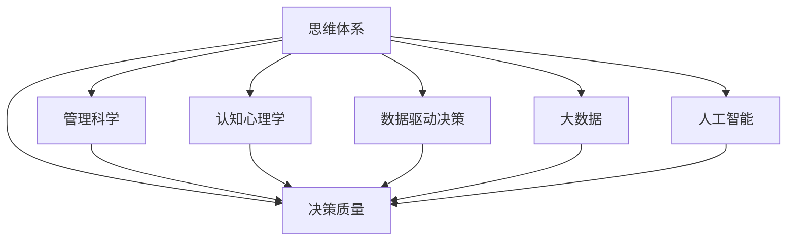

                 

# 思维体系与管理者决策质量的关系

> 关键词：思维体系,决策质量,管理科学,认知心理学,机器学习,数据驱动决策,大数据,人工智能

## 1. 背景介绍

### 1.1 问题由来

现代企业的竞争日益激烈，面对复杂多变的外部环境和内部资源，管理者需要做出各种关键决策，以确保企业的可持续发展。然而，由于信息的不完备、决策者的认知局限和外部环境的不确定性，管理者决策常常存在质量问题。如何才能提升决策质量，成为了企业管理中的一个重要课题。

### 1.2 问题核心关键点

决策质量的提升需要依赖于科学的管理思维体系，该体系通过系统化、规范化的方法，整合企业内外的各类信息，以辅助管理者做出高质量的决策。核心关键点包括：

1. **信息整合与分析**：如何高效获取、整合和分析相关数据，提取关键信息。
2. **决策模型与算法**：构建科学的决策模型和算法，辅助管理者进行定量和定性分析。
3. **认知心理学**：理解管理者的认知模式和决策心理，优化决策过程。
4. **数据驱动决策**：依赖大数据和机器学习技术，提升决策的准确性和时效性。
5. **组织与制度**：建立有效的组织结构和决策机制，保障决策过程的透明和公正。

## 2. 核心概念与联系

### 2.1 核心概念概述

为更好地理解管理者决策质量的提升路径，本节将介绍几个密切相关的核心概念：

- **思维体系**：指一套系统化、结构化的决策方法和工具，帮助管理者高效整合信息，进行科学决策。
- **决策质量**：指决策结果的有效性和可靠性，包括决策的正确性、及时性和可行性。
- **管理科学**：运用定量、定性方法，通过模型和算法辅助决策，以实现科学管理的目标。
- **认知心理学**：研究个体和群体在认知过程中的心理活动和决策行为，为理解和管理决策提供理论基础。
- **数据驱动决策**：依赖数据和机器学习算法，通过分析大量数据信息，辅助管理者进行决策。
- **大数据**：指规模巨大、来源广泛的数据集，通过数据分析和挖掘，提取有价值的信息和知识。
- **人工智能**：应用机器学习和深度学习算法，构建智能系统，提高决策的自动化和智能化水平。

这些核心概念之间的逻辑关系可以通过以下Mermaid流程图来展示：



这个流程图展示了几者之间的关系：

1. 思维体系通过整合管理科学、认知心理学、数据驱动决策、大数据和人工智能等方法，提升决策质量。
2. 管理科学通过模型和算法辅助决策，提高决策的准确性和效率。
3. 认知心理学研究决策者的心理活动，优化决策过程。
4. 数据驱动决策依赖大数据和机器学习，提升决策的信息完备性和及时性。
5. 大数据提供规模庞大的信息资源，帮助发现数据背后的规律。
6. 人工智能通过算法优化，提升决策的自动化和智能化水平。

## 3. 核心算法原理 & 具体操作步骤

### 3.1 算法原理概述

基于思维体系的管理者决策质量提升，主要涉及信息整合、决策模型、认知优化和大数据应用等关键算法原理。通过系统化的方法和工具，帮助管理者高效整合信息，构建科学的决策模型，优化认知心理，利用大数据和人工智能技术，提升决策质量。

### 3.2 算法步骤详解

**Step 1: 信息整合与分析**

1. **数据收集与清洗**：收集企业内外部的相关数据，包括财务数据、市场数据、员工数据等，进行数据清洗和预处理，确保数据质量和一致性。
2. **数据整合**：通过ETL工具进行数据整合，将不同来源的数据进行统一和标准化，构建统一的数据仓库。
3. **数据可视化**：使用数据可视化工具，如Tableau、PowerBI等，将数据转化为直观的图表和报告，辅助管理者进行数据分析和理解。

**Step 2: 决策模型与算法**

1. **构建决策模型**：根据决策目标和问题，选择合适的模型，如回归模型、分类模型、聚类模型等。
2. **数据预处理**：对数据进行归一化、降维、特征选择等预处理，提升模型效果。
3. **模型训练与评估**：使用训练数据对模型进行训练，通过验证集评估模型效果，选择最优模型。
4. **模型部署与应用**：将训练好的模型部署到实际应用中，实时进行决策支持。

**Step 3: 认知优化**

1. **认知模式分析**：使用认知心理学理论，分析管理者的认知模式和决策心理，识别出决策中的认知偏差和局限。
2. **决策支持系统**：构建决策支持系统，提供数据驱动的决策建议和预警，辅助管理者进行科学决策。
3. **决策模拟与测试**：使用模拟和测试方法，评估决策方案的可行性和效果，优化决策过程。

**Step 4: 数据驱动决策**

1. **数据挖掘与分析**：利用大数据和机器学习技术，从大量数据中挖掘有价值的信息和知识。
2. **实时数据分析**：使用实时数据分析工具，对动态变化的数据进行实时分析和处理，及时发现问题和机会。
3. **智能决策支持**：结合人工智能技术，构建智能决策支持系统，辅助管理者进行决策。

**Step 5: 大数据应用**

1. **数据采集与管理**：使用大数据技术，构建规模巨大的数据存储和管理系统，保障数据安全与可用性。
2. **数据处理与分析**：使用大数据处理和分析工具，对数据进行高效处理和分析，提取关键信息。
3. **数据可视化与应用**：利用数据可视化技术，将分析结果转化为直观的报告和图表，辅助管理者决策。

### 3.3 算法优缺点

基于思维体系的管理者决策质量提升方法，具有以下优点：

1. **系统性**：通过系统化的思维体系，能够整合多源数据，进行全面分析，提升决策的科学性。
2. **高效性**：依赖数据驱动和算法辅助，能够快速获取关键信息，进行决策支持。
3. **智能化**：结合人工智能技术，提升决策的自动化和智能化水平。
4. **可解释性**：数据驱动和算法模型的结果具有可解释性，便于管理者理解和决策。

同时，该方法也存在一些局限性：

1. **数据质量依赖**：依赖高质量的数据源和数据清洗方法，数据质量问题会影响决策结果。
2. **模型选择与调参**：模型选择和调参需要经验丰富的数据科学家，对数据科学家和模型的要求较高。
3. **认知局限**：认知心理学模型和决策支持系统无法完全消除管理者的认知偏差，决策过程中仍需人类干预。
4. **技术复杂度**：大数据和人工智能技术复杂度高，需要具备相应的技术能力和资源。
5. **成本投入**：需要大量的技术投入和资源支持，成本较高。

### 3.4 算法应用领域

基于思维体系的管理者决策质量提升方法，已在多个领域得到了广泛应用，包括但不限于：

1. **金融投资决策**：利用大数据和机器学习技术，构建风险评估模型，辅助投资决策。
2. **市场营销决策**：分析客户行为数据，构建客户画像，进行精准营销。
3. **人力资源管理**：通过员工数据和大数据分析，优化招聘和绩效管理。
4. **供应链管理**：整合供应链数据，进行需求预测和库存优化，提升供应链效率。
5. **产品研发决策**：利用市场和用户数据，进行产品设计和需求分析，提升产品竞争力。

## 4. 数学模型和公式 & 详细讲解 & 举例说明

### 4.1 数学模型构建

本节将使用数学语言对基于思维体系的管理者决策质量提升过程进行更加严格的刻画。

记决策目标为 $y$，决策变量为 $x$，相关的历史数据为 $\mathcal{D} = \{(x_i, y_i)\}_{i=1}^N$。

定义模型的损失函数为 $L(y, \hat{y})$，其中 $\hat{y}$ 为模型的预测结果。在实际应用中，常使用平方误差损失函数，即：

$$
L(y, \hat{y}) = \frac{1}{N} \sum_{i=1}^N (y_i - \hat{y}_i)^2
$$

通过最小化损失函数，优化模型的预测结果，以提高决策质量。

### 4.2 公式推导过程

假设模型为线性回归模型，即：

$$
\hat{y} = \theta_0 + \theta_1 x_1 + \cdots + \theta_n x_n
$$

其中 $\theta_0, \theta_1, \cdots, \theta_n$ 为模型的参数。根据最小二乘法的原理，模型参数的求解公式为：

$$
\theta = (\mathbf{X}^T \mathbf{X})^{-1} \mathbf{X}^T \mathbf{y}
$$

其中 $\mathbf{X}$ 为数据矩阵，$\mathbf{y}$ 为样本标签向量。

对于更复杂的非线性模型，如决策树、支持向量机等，需要通过交叉验证等方法选择最优模型，具体推导过程可以参考相关书籍和文献。

### 4.3 案例分析与讲解

**案例分析**：某金融公司希望通过大数据和机器学习技术，提升其投资决策的准确性。

1. **数据收集与清洗**：收集公司的历史交易数据、市场数据和宏观经济数据，进行数据清洗和预处理。
2. **数据整合**：构建统一的数据仓库，整合不同来源的数据。
3. **决策模型构建**：选择线性回归模型，使用历史数据训练模型，评估模型效果。
4. **模型部署与应用**：将训练好的模型部署到实时交易系统中，进行实时决策支持。
5. **决策效果评估**：通过回测和验证，评估模型的实际效果和投资收益。

## 5. 项目实践：代码实例和详细解释说明

### 5.1 开发环境搭建

在进行决策质量提升的实践前，我们需要准备好开发环境。以下是使用Python进行数据分析和机器学习开发的常见环境配置流程：

1. 安装Anaconda：从官网下载并安装Anaconda，用于创建独立的Python环境。

2. 创建并激活虚拟环境：
```bash
conda create -n myenv python=3.8 
conda activate myenv
```

3. 安装必要的Python库：
```bash
pip install numpy pandas scikit-learn matplotlib seaborn tensorflow pytorch
```

4. 安装数据可视化工具：
```bash
pip install matplotlib seaborn plotly
```

5. 安装机器学习库：
```bash
pip install scikit-learn
```

完成上述步骤后，即可在`myenv`环境中开始决策质量提升的开发实践。

### 5.2 源代码详细实现

下面我们以金融投资决策为例，给出使用Scikit-learn库进行数据预处理和模型训练的PyTorch代码实现。

```python
import pandas as pd
import numpy as np
from sklearn.model_selection import train_test_split
from sklearn.linear_model import LinearRegression
from sklearn.metrics import mean_squared_error

# 读取数据
data = pd.read_csv('financial_data.csv')

# 数据预处理
features = ['feature1', 'feature2', 'feature3', 'feature4']
labels = ['label']
X = data[features]
y = data[labels]

# 数据分割
X_train, X_test, y_train, y_test = train_test_split(X, y, test_size=0.2, random_state=42)

# 模型训练
model = LinearRegression()
model.fit(X_train, y_train)

# 模型评估
y_pred = model.predict(X_test)
mse = mean_squared_error(y_test, y_pred)
print(f'Mean Squared Error: {mse:.3f}')
```

### 5.3 代码解读与分析

**数据预处理**：

- `pd.read_csv`：使用Pandas库读取CSV格式的数据文件。
- `features`和`labels`：定义特征和标签列名。
- `train_test_split`：使用Scikit-learn库将数据分割为训练集和测试集，测试集占总数据集的20%。

**模型训练**：

- `LinearRegression`：定义线性回归模型。
- `model.fit`：使用训练集数据对模型进行训练，拟合参数。

**模型评估**：

- `y_pred`：使用训练好的模型对测试集进行预测。
- `mean_squared_error`：计算预测值与真实值之间的均方误差。

在实际应用中，还需要考虑模型的参数调优、交叉验证、特征选择等因素，以进一步提升模型的效果。

## 6. 实际应用场景

### 6.1 智能客服系统

智能客服系统利用大数据和机器学习技术，通过分析客户的历史行为和实时反馈，辅助客服人员进行智能答复，提升客户服务质量和满意度。

在技术实现上，可以收集客户的历史聊天记录、行为数据和反馈信息，构建客户画像，进行智能答复和问题解决。通过实时数据分析和机器学习模型，智能客服系统能够快速响应客户咨询，提供个性化的服务建议。

### 6.2 金融舆情监测

金融舆情监测通过大数据和机器学习技术，实时监测市场舆情，预测市场变化趋势，辅助金融机构进行风险管理和决策。

在实践应用中，可以收集社交媒体、新闻报道、市场评论等舆情数据，使用自然语言处理技术进行情感分析和主题分类，构建舆情指标体系，进行实时监测和预警。

### 6.3 个性化推荐系统

个性化推荐系统通过大数据和机器学习技术，分析用户的历史行为和偏好，推荐个性化的产品和服务，提升用户体验和满意度。

在技术实现上，可以收集用户的历史浏览、点击、购买等行为数据，使用协同过滤、内容推荐等算法，构建用户画像，进行个性化推荐。通过实时数据分析和机器学习模型，推荐系统能够动态调整推荐内容，提升推荐效果。

### 6.4 未来应用展望

随着大数据和人工智能技术的不断进步，基于思维体系的管理者决策质量提升方法将具有广阔的应用前景。未来，可以预见其在更多领域的应用，例如：

1. **医疗健康决策**：利用大数据和机器学习技术，构建医疗健康决策支持系统，辅助医生进行诊断和治疗决策。
2. **智能制造决策**：整合制造数据和生产流程，构建智能制造决策支持系统，提升生产效率和产品质量。
3. **环境保护决策**：利用大数据和机器学习技术，监测环境数据，评估环境变化趋势，辅助政府进行环境管理和决策。

## 7. 工具和资源推荐

### 7.1 学习资源推荐

为了帮助开发者系统掌握基于思维体系的管理者决策质量提升的理论基础和实践技巧，这里推荐一些优质的学习资源：

1. **《机器学习》（周志华）**：系统介绍机器学习的基本概念和算法，包括回归、分类、聚类等方法。
2. **《Python数据科学手册》（Jake VanderPlas）**：详细讲解Python在数据科学中的应用，包括数据分析、机器学习等。
3. **Coursera《机器学习基础》课程**：由斯坦福大学教授Andrew Ng主讲的机器学习课程，涵盖机器学习的基本原理和算法。
4. **Kaggle**：数据科学竞赛平台，提供大量真实数据和模型，供开发者学习和实践。
5. **GitHub**：开源代码托管平台，提供大量机器学习项目的源代码和文档，供开发者学习和参考。

通过对这些资源的学习实践，相信你一定能够快速掌握基于思维体系的管理者决策质量提升的精髓，并用于解决实际的决策问题。

### 7.2 开发工具推荐

高效的开发离不开优秀的工具支持。以下是几款用于数据分析和机器学习开发的常用工具：

1. **Jupyter Notebook**：开源的交互式计算环境，支持Python、R等语言，适合进行数据探索和模型调试。
2. **TensorBoard**：TensorFlow配套的可视化工具，可实时监测模型训练状态，提供丰富的图表呈现方式。
3. **Weights & Biases**：模型训练的实验跟踪工具，记录和可视化模型训练过程中的各项指标，方便对比和调优。
4. **Tableau**：数据可视化工具，支持大规模数据集的可视化，提供直观的图表和报告。
5. **PowerBI**：微软推出的数据可视化工具，支持多种数据源，提供丰富的图表和报告功能。

合理利用这些工具，可以显著提升决策质量提升任务的开发效率，加快创新迭代的步伐。

### 7.3 相关论文推荐

基于思维体系的管理者决策质量提升方法，近年来引起了学界的广泛关注。以下是几篇奠基性的相关论文，推荐阅读：

1. **《机器学习导论》（Tom Mitchell）**：系统介绍机器学习的基本概念和算法，为决策质量提升提供理论基础。
2. **《数据科学与人工智能》（Christopher B. Manning）**：详细讲解数据科学和人工智能技术在决策中的应用，涵盖大数据、机器学习等方法。
3. **《数据科学方法论》（Jerry C. Davis）**：介绍数据科学的方法论和技术，包括数据预处理、模型构建和评估等。
4. **《机器学习实战》（Peter Harrington）**：提供实际项目的机器学习解决方案，涵盖数据清洗、特征工程、模型选择等。
5. **《深度学习》（Ian Goodfellow）**：介绍深度学习的基本概念和算法，为决策质量提升提供先进的工具和技术。

这些论文代表了大数据和人工智能在决策质量提升领域的发展脉络。通过学习这些前沿成果，可以帮助研究者把握学科前进方向，激发更多的创新灵感。

## 8. 总结：未来发展趋势与挑战

### 8.1 研究成果总结

本文对基于思维体系的管理者决策质量提升方法进行了全面系统的介绍。首先阐述了决策质量的提升需要依赖于科学的管理思维体系，明确了决策质量提升的科学路径和关键方法。其次，从原理到实践，详细讲解了信息整合、决策模型、认知优化和大数据应用等关键算法原理，给出了具体的算法步骤和实际操作。同时，本文还广泛探讨了决策质量提升方法在智能客服、金融舆情、个性化推荐等多个行业领域的应用前景，展示了决策质量提升方法的巨大潜力。

通过本文的系统梳理，可以看到，基于思维体系的管理者决策质量提升方法在理论和实践中都具有重要意义，能够系统地整合信息，构建科学的决策模型，优化认知心理，利用大数据和人工智能技术，提升决策质量。未来，随着技术的不断进步，决策质量提升方法将广泛应用于更多领域，推动企业的智能化转型和创新发展。

### 8.2 未来发展趋势

展望未来，基于思维体系的管理者决策质量提升方法将呈现以下几个发展趋势：

1. **智能化程度提升**：通过引入更先进的算法和大数据技术，提升决策的智能化和自动化水平。
2. **实时化决策**：利用实时数据分析和流计算技术，提升决策的及时性和响应速度。
3. **跨领域融合**：将决策质量提升方法与其他领域的技术进行融合，如物联网、区块链等，推动跨领域的决策优化。
4. **多模态数据融合**：利用多模态数据融合技术，整合不同来源和类型的数据，提升决策的信息完备性和准确性。
5. **自适应决策**：引入自适应学习技术，使决策系统能够动态调整和优化决策模型，适应不同的环境和任务。

### 8.3 面临的挑战

尽管基于思维体系的管理者决策质量提升方法已经取得了显著成果，但在实现科学决策的过程中，仍面临以下挑战：

1. **数据质量问题**：高质量数据的获取和处理是决策质量提升的关键，数据质量和一致性问题会影响决策效果。
2. **模型复杂性**：复杂的决策模型需要高水平的数据科学家和算法工程师，模型选择和调参难度较大。
3. **技术成本高**：决策质量提升方法依赖大数据和人工智能技术，需要较高的技术投入和资源支持。
4. **认知局限**：认知心理学模型的局限性，决策过程中仍需人类干预，难以完全消除认知偏差。
5. **隐私和安全**：决策数据和算法的隐私和安全问题，需要有效的保护措施和监管机制。

### 8.4 研究展望

面对决策质量提升方法所面临的挑战，未来的研究需要在以下几个方面寻求新的突破：

1. **数据治理和质量保障**：加强数据治理和质量保障，提高数据质量和一致性，保障决策过程的数据基础。
2. **自动化模型选择**：引入自动化模型选择技术，降低模型选择和调参的复杂性，提升决策过程的效率。
3. **跨领域融合技术**：将决策质量提升方法与其他领域的技术进行深度融合，推动跨领域的决策优化。
4. **认知增强技术**：引入认知增强技术，提升决策者的认知能力，减少认知偏差和局限。
5. **隐私和安全保障**：加强决策数据和算法的隐私和安全保障，确保决策系统的可靠性和合规性。

这些研究方向的探索，必将引领决策质量提升方法迈向更高的台阶，为构建安全、可靠、智能的决策支持系统铺平道路。面向未来，基于思维体系的管理者决策质量提升方法需要与其他人工智能技术进行更深入的融合，如知识表示、因果推理、强化学习等，多路径协同发力，共同推动决策质量的全面提升。

## 9. 附录：常见问题与解答

**Q1: 如何构建有效的决策支持系统？**

A: 构建有效的决策支持系统需要遵循以下步骤：
1. 确定决策目标和问题，选择合适的数据源。
2. 进行数据清洗和预处理，确保数据质量和一致性。
3. 构建数据仓库和数据可视化工具，提供数据驱动的决策支持。
4. 选择适当的模型和算法，构建决策模型和系统。
5. 进行模型训练和评估，选择最优模型。
6. 将模型部署到实际应用中，实时进行决策支持。

**Q2: 如何处理决策中的认知偏差？**

A: 处理决策中的认知偏差需要综合应用认知心理学和数据驱动的方法：
1. 进行认知模式分析，识别出决策中的认知偏差。
2. 引入数据驱动的决策支持系统，提供数据驱动的决策建议。
3. 采用对抗训练和正则化技术，减少决策过程中的过拟合和偏差。
4. 引入团队协作和跨学科合作，从多角度审视决策问题，减少个人认知偏差的影响。

**Q3: 如何提升决策系统的自动化程度？**

A: 提升决策系统的自动化程度需要引入自动化模型选择和优化技术：
1. 利用自动化模型选择技术，降低模型选择和调参的复杂性。
2. 引入自适应学习技术，使决策系统能够动态调整和优化决策模型。
3. 引入强化学习技术，通过模拟和测试方法，优化决策过程和决策策略。
4. 引入认知增强技术，提升决策者的认知能力，减少认知偏差和局限。

**Q4: 如何保障决策数据和算法的隐私和安全？**

A: 保障决策数据和算法的隐私和安全需要从多个方面进行考虑：
1. 加强数据隐私保护，采用数据脱敏和加密技术，确保数据的安全性。
2. 引入算法审计和透明机制，确保算法的透明性和可解释性。
3. 建立决策系统的安全防护体系，防止攻击和恶意使用。
4. 引入合规性审查和监管机制，确保决策系统的合规性和可靠性。

**Q5: 如何优化决策过程中的资源配置？**

A: 优化决策过程中的资源配置需要综合应用数据驱动和机器学习的方法：
1. 利用大数据和机器学习技术，分析决策过程中的资源需求和利用情况。
2. 引入资源优化算法，优化决策过程中的资源配置和调度。
3. 引入实时数据分析技术，动态调整资源配置，提高决策效率。
4. 引入多模态数据融合技术，整合不同来源和类型的数据，提升决策的信息完备性和准确性。

总之，基于思维体系的管理者决策质量提升方法需要综合应用科学的方法和技术，系统地整合信息，构建科学的决策模型，优化认知心理，利用大数据和人工智能技术，提升决策质量。未来，随着技术的不断进步，决策质量提升方法将广泛应用于更多领域，推动企业的智能化转型和创新发展。

---

作者：禅与计算机程序设计艺术 / Zen and the Art of Computer Programming

