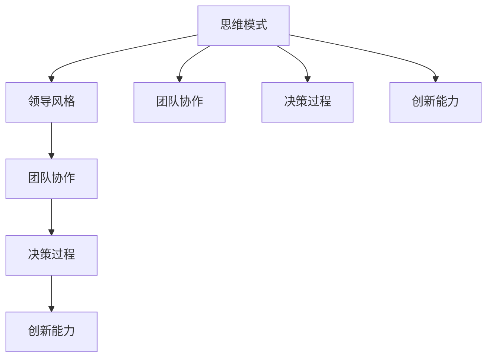

                 

# 思维模式对领导力的影响

## 1. 背景介绍

### 1.1 问题由来

在当今快速变化的社会和企业环境中，领导力变得比以往任何时候都更加重要。领导力不仅关乎组织的成功，还直接影响员工的士气、创新力和工作满意度。然而，很多领导者都忽视了一个至关重要的因素：思维模式。思维模式不仅是影响个人行为和决策的基础，也是影响组织文化和管理风格的关键。

### 1.2 问题核心关键点

- **思维模式定义**：指个体在面对问题时的思考习惯、决策方式和行为倾向。
- **影响领域**：包括领导风格、团队协作、决策过程、创新能力、问题解决等。
- **重要性**：正确的思维模式能够帮助领导者更好地应对复杂多变的环境，提高团队的凝聚力和执行力。
- **常见误区**：许多领导者过于依赖经验，忽视了思维模式对领导力的深远影响。

### 1.3 问题研究意义

研究思维模式对领导力的影响，对于提升领导者自身素质、优化组织管理和推动企业创新具有重要意义。通过理解思维模式，领导者能够更好地认识到自身的局限性，找到改进的方向。同时，这也有助于构建更加积极、健康的企业文化，激发团队成员的潜力。

## 2. 核心概念与联系

### 2.1 核心概念概述

为更好地理解思维模式对领导力的影响，本节将介绍几个密切相关的核心概念：

- **思维模式**：指个体在面对问题时的思考习惯、决策方式和行为倾向。包括认知、情感、意志等方面。
- **领导风格**：指领导者在管理团队和组织时的基本行为模式，如命令型、民主型、教练型等。
- **团队协作**：指团队成员之间的互动、合作和沟通方式。
- **决策过程**：指从识别问题到最终制定和执行决策的全过程。
- **创新能力**：指个体和组织在面对新问题时提出新颖、有创意的解决方案的能力。

这些核心概念之间的逻辑关系可以通过以下Mermaid流程图来展示：



这个流程图展示了几大核心概念之间的联系：

1. 思维模式影响领导风格、团队协作、决策过程和创新能力。
2. 领导风格进一步影响团队协作和决策过程。
3. 创新能力受到思维模式和决策过程的共同影响。

这些概念共同构成了思维模式对领导力的影响框架，帮助我们理解领导者如何通过改变思维模式来提升管理效果。

## 3. 核心算法原理 & 具体操作步骤
### 3.1 算法原理概述

思维模式对领导力的影响，本质上是一个复杂的行为科学问题。其核心思想是：个体和团队的思维方式和行为模式，直接影响其决策质量和领导效果。

通过研究和分析不同思维模式在特定情境下的表现，可以发现其对领导力表现的深远影响。常用的思维模式分析方法包括：

- **认知模式**：包括问题解决、信息处理、推理判断等，影响决策的准确性和创新性。
- **情感模式**：如乐观、悲观、焦虑等，影响领导者的情绪稳定性和团队士气。
- **意志模式**：如自律、坚韧、冒险等，影响领导者的执行力和管理力度。

### 3.2 算法步骤详解

基于思维模式对领导力的影响，以下是一般性的操作步骤：

**Step 1: 自我认知评估**

- 使用心理测验或评估工具，如MBTI、DISC等，了解自身的思维模式特点。
- 识别出自身在认知、情感和意志方面的优势和不足。

**Step 2: 团队分析与反馈**

- 收集团队成员的反馈，了解团队成员的思维模式特点。
- 分析团队内部的思维模式分布和协同效果，发现潜在的冲突和改进点。

**Step 3: 调整思维模式**

- 针对自身和团队的思维模式特点，设计针对性的改进策略。
- 通过培训、辅导和心理干预等手段，帮助自己和团队成员调整思维模式。

**Step 4: 实践和评估**

- 在实际管理工作中，应用调整后的思维模式。
- 通过定期反馈和评估，监控改进效果，持续优化思维模式。

### 3.3 算法优缺点

思维模式分析方法具有以下优点：

- **个性化定制**：根据不同个体的特点，制定个性化的改进计划。
- **科学依据**：通过系统评估和数据支持，帮助领导者做出更科学的决策。
- **提升效率**：通过调整思维模式，提高团队协作和决策效率。

同时，该方法也存在一些局限性：

- **复杂性**：思维模式分析涉及多个维度和层面，实际操作较复杂。
- **主观性**：评估和改进过程可能受到评估者主观因素的影响。
- **实施难度**：需要投入一定时间和资源进行评估和调整，难以快速见效。

### 3.4 算法应用领域

思维模式分析方法在多个领域都有广泛的应用，包括但不限于：

- **组织管理**：帮助管理者优化决策过程，提高团队协作效率。
- **人力资源**：通过评估和调整员工思维模式，提升员工满意度和绩效。
- **教育培训**：用于教师和学生的思维模式评估和培养，提高教学和学习效果。
- **个人发展**：帮助个人了解自我思维模式特点，进行自我提升和心理干预。

## 4. 数学模型和公式 & 详细讲解  
### 4.1 数学模型构建

思维模式对领导力的影响，可以通过以下几个数学模型进行描述：

1. **认知模式模型**：

$$
\text{认知能力} = \sum_{i=1}^{n} \text{认知技能}_i \times \text{技能权重}_i
$$

其中，$n$ 表示认知技能总数，$\text{技能权重}_i$ 为各项技能的重要性系数。

2. **情感模式模型**：

$$
\text{情感稳定性} = \alpha \times \text{情绪稳定性} + (1-\alpha) \times \text{情绪波动性}
$$

其中，$\alpha$ 为情感调节系数，$0 \leq \alpha \leq 1$。

3. **意志模式模型**：

$$
\text{执行力} = \beta \times \text{自我控制力} + (1-\beta) \times \text{自制力}
$$

其中，$\beta$ 为意志调节系数，$0 \leq \beta \leq 1$。

### 4.2 公式推导过程

以上三个模型分别描述了个体在认知、情感和意志方面的行为特征。通过这些公式，可以计算出每个维度上的具体表现，进而评估思维模式对领导力的综合影响。

例如，在情感模式模型中，通过调整情绪稳定性系数 $\alpha$，可以改变情感调节的效果，从而影响领导者的情绪稳定性和团队士气。

### 4.3 案例分析与讲解

假设某公司领导者在思维模式评估中发现，自身的情绪波动性较大，执行力也相对较弱。通过调整情绪稳定性系数 $\alpha$，领导者在实际工作中更能够保持情绪稳定，减少对团队士气的负面影响，同时增强自我控制力，提高执行力。

## 5. 项目实践：代码实例和详细解释说明
### 5.1 开发环境搭建

在进行思维模式分析实践前，我们需要准备好开发环境。以下是使用Python进行数据分析和可视化环境配置流程：

1. 安装Anaconda：从官网下载并安装Anaconda，用于创建独立的Python环境。

2. 创建并激活虚拟环境：
```bash
conda create -n thinking-mode-env python=3.8 
conda activate thinking-mode-env
```

3. 安装Python相关库：
```bash
conda install pandas numpy matplotlib seaborn scipy
```

4. 安装R语言和相关库：
```bash
conda install rpy2
```

5. 安装数据分析和可视化工具：
```bash
conda install statsmodels patsy
```

完成上述步骤后，即可在`thinking-mode-env`环境中开始思维模式分析实践。

### 5.2 源代码详细实现

这里我们以领导力评估为例，给出使用Python和R语言进行思维模式分析的代码实现。

**Python代码**：

```python
import pandas as pd
import numpy as np
import seaborn as sns
import matplotlib.pyplot as plt

# 读取思维模式评估数据
data = pd.read_csv('thinking_mode_data.csv')

# 计算认知能力、情感稳定性和执行力
cognitive = data['cognitive'].sum() / len(data)
emotional_stability = data['emotional_stability'].mean()
executiveness = data['executiveness'].mean()

# 绘制图表
sns.barplot(x=['cognitive', 'emotional_stability', 'executiveness'], y=[cognitive, emotional_stability, executiveness])
plt.title('Thinking Mode and Leadership Impact')
plt.xlabel('Thinking Mode Dimension')
plt.ylabel('Leadership Impact')
plt.show()
```

**R语言代码**：

```r
library(ggplot2)
library(dplyr)

# 读取思维模式评估数据
data <- read.csv('thinking_mode_data.csv')

# 计算认知能力、情感稳定性和执行力
cognitive <- mean(data$cognitive)
emotional_stability <- mean(data$emotional_stability)
executiveness <- mean(data$executiveness)

# 绘制图表
ggplot(data, aes(x = 'Thinking Mode Dimension', y = 'Leadership Impact')) +
  geom_bar(stat = 'identity') +
  labs(title = 'Thinking Mode and Leadership Impact', x = 'Thinking Mode Dimension', y = 'Leadership Impact') +
  theme_minimal()
```

以上代码实现了对思维模式评估数据的读取、计算和可视化。通过绘制思维模式与领导力影响的柱状图，直观展示了思维模式对领导力的影响。

### 5.3 代码解读与分析

让我们再详细解读一下关键代码的实现细节：

**数据读取**：使用Pandas和R语言的`read.csv`函数，从文件中读取思维模式评估数据。

**计算指标**：通过Pandas和R语言的聚合函数，计算出认知能力、情感稳定性和执行力的平均值。

**可视化**：使用Seaborn和ggplot2库，绘制思维模式与领导力影响的柱状图，直观展示各个维度对领导力的综合影响。

**代码优化**：为了提高代码效率，可以使用Pandas和R语言中的向量化操作，减少循环计算的复杂度。

**结果解读**：通过分析柱状图，可以发现认知能力、情感稳定性和执行力对领导力的影响大小，进而指导思维模式调整的策略。

## 6. 实际应用场景
### 6.1 企业领导力培训

思维模式分析方法在企业领导力培训中具有广泛应用。通过评估和管理领导者的思维模式，企业能够更有针对性地进行领导力提升。

具体而言，企业可以：

- **识别问题**：通过评估领导者的思维模式，识别出存在的问题和不足。
- **设计方案**：根据评估结果，设计个性化的领导力提升方案。
- **实施培训**：通过培训、辅导和心理干预等手段，帮助领导者调整思维模式。
- **评估效果**：定期评估培训效果，持续优化培训方案。

### 6.2 组织文化建设

思维模式分析方法在组织文化建设中也有重要应用。通过理解和管理团队成员的思维模式，企业能够构建更加健康、高效的组织文化。

具体而言，企业可以：

- **文化诊断**：通过评估团队成员的思维模式，诊断组织文化中的问题。
- **文化调整**：根据评估结果，调整组织文化中的不足之处。
- **文化培育**：通过培训和引导，培育积极的思维模式和行为习惯。
- **文化传播**：通过领导者和骨干员工的榜样作用，传播和践行积极的思维模式。

### 6.3 教育培训

思维模式分析方法在教育培训中同样具有重要应用。通过评估和培养学生的思维模式，教育机构能够提高学生的综合素质和竞争力。

具体而言，教育机构可以：

- **学生评估**：通过评估学生的思维模式，发现其学习上的问题。
- **培养方案**：根据评估结果，设计个性化的培养方案。
- **教学调整**：通过调整教学方法，促进学生的思维发展。
- **心理辅导**：通过心理干预和辅导，帮助学生调整不良思维模式。

### 6.4 未来应用展望

未来，思维模式分析方法将在更多领域得到应用，为组织和个人的发展提供科学支持。

在智慧城市建设中，思维模式分析可以帮助城市管理者更好地理解市民行为，优化城市规划和管理。在企业创新过程中，思维模式分析可以指导研发团队进行创新思维的培养和激发，提升企业的创新能力。

总之，思维模式分析方法将为各类组织和个人提供深刻的洞察和指导，推动其向更高的目标迈进。

## 7. 工具和资源推荐
### 7.1 学习资源推荐

为了帮助领导者系统掌握思维模式对领导力的影响，这里推荐一些优质的学习资源：

1. **《领导力心理学》**：介绍领导力与心理学的关系，系统讲解不同思维模式的特点和影响。
2. **《高效能人士的七个习惯》**：史蒂芬·柯维的经典著作，探讨了有效领导者的七个习惯，涵盖认知、情感和意志等多方面。
3. **《思考，快与慢》**：丹尼尔·卡尼曼的著作，深入分析了人类思维的两种模式，帮助领导者理解认知偏差。
4. **《情绪智力》**：丹尼尔·戈尔曼的著作，介绍情绪智力的概念和培养方法，提升领导者的情感管理能力。
5. **Coursera《领导力与组织行为》课程**：由耶鲁大学开设的在线课程，通过实际案例和理论讲解，帮助学习者提升领导力。

通过对这些资源的学习实践，相信你一定能够深入理解思维模式对领导力的影响，并在实际工作中发挥更大的作用。
###  7.2 开发工具推荐

高效的开发离不开优秀的工具支持。以下是几款用于思维模式分析开发的常用工具：

1. **Python和R语言**：功能强大的编程语言，支持数据分析和可视化。
2. **Pandas和R语言**：数据处理和分析工具，支持高效的数据读取、清洗和计算。
3. **Matplotlib和ggplot2**：绘图工具，支持绘制美观、清晰的图表。
4. **Jupyter Notebook和R Markdown**：交互式开发环境，支持代码和文档的混合编写。
5. **PsychoPy和R语言**：心理学实验工具，支持设计和实施各种心理评估实验。

合理利用这些工具，可以显著提升思维模式分析任务的开发效率，加速创新迭代的步伐。

### 7.3 相关论文推荐

思维模式分析方法的发展源于学界的持续研究。以下是几篇奠基性的相关论文，推荐阅读：

1. **《组织行为学》**：研究组织中个体和群体行为，探讨思维模式对组织行为的影响。
2. **《情绪智力与领导力》**：探讨情绪智力与领导力之间的关系，提出提升情绪智力的策略。
3. **《认知偏差与决策》**：分析认知偏差对决策的影响，提出纠正认知偏差的建议。
4. **《领导者的思维模式》**：综述领导者的认知、情感和意志模式，提出领导力提升的建议。
5. **《文化与领导力》**：研究文化对领导力的影响，提出构建积极组织文化的策略。

这些论文代表了大语言模型微调技术的发展脉络。通过学习这些前沿成果，可以帮助研究者把握学科前进方向，激发更多的创新灵感。

## 8. 总结：未来发展趋势与挑战
### 8.1 总结

本文对思维模式对领导力的影响进行了全面系统的介绍。首先阐述了思维模式在领导力中的重要性，明确了其对领导风格、团队协作、决策过程和创新能力的影响。其次，从原理到实践，详细讲解了思维模式分析的数学模型和操作步骤，给出了思维模式分析的代码实例和详细解释。同时，本文还广泛探讨了思维模式分析方法在企业领导力培训、组织文化建设、教育培训等多个领域的应用前景，展示了思维模式分析方法的巨大潜力。通过对这些资源的学习实践，相信你一定能够深入理解思维模式对领导力的影响，并在实际工作中发挥更大的作用。

### 8.2 未来发展趋势

展望未来，思维模式分析方法将呈现以下几个发展趋势：

1. **技术化提升**：随着大数据和人工智能技术的发展，思维模式分析将变得更加科学和高效，通过算法优化和大数据分析，提升评估的准确性和可靠性。
2. **个性化定制**：通过深度学习和机器学习，实现对个体思维模式的精准预测和个性化改进，提高培训和辅导的效果。
3. **数据化管理**：通过建立思维模式数据仓库，实时收集和分析团队成员的思维模式数据，提供动态管理和优化建议。
4. **全球化推广**：随着国际交流的加深，思维模式分析方法将在全球范围内得到推广和应用，提升全球领导力的整体水平。
5. **伦理化和标准化**：随着对领导力伦理和标准化研究的深入，思维模式分析方法将引入更多伦理规范和标准，确保评估和改进过程的公平和透明。

以上趋势凸显了思维模式分析方法的广阔前景。这些方向的探索发展，必将进一步提升思维模式分析技术的应用效果，为各类组织和个人的发展提供更加有力的支持。

### 8.3 面临的挑战

尽管思维模式分析方法已经取得了显著成果，但在迈向更加智能化、普适化应用的过程中，仍面临诸多挑战：

1. **数据质量问题**：思维模式评估数据的收集和处理存在一定难度，数据质量不均可能影响分析结果的准确性。
2. **评估方法多样性**：目前缺乏统一、标准化的思维模式评估方法，导致不同评估结果难以比较和整合。
3. **隐私保护问题**：思维模式分析涉及个人隐私，如何在保护隐私的前提下进行评估和改进，需要更多技术和伦理手段。
4. **跨文化适应性**：不同文化背景下的思维模式存在差异，如何将思维模式分析方法推广到全球范围内，仍然是一个难题。
5. **长期效果评估**：思维模式改进的效果评估周期较长，难以实时监测和反馈，影响改进方案的及时性。

正视思维模式分析面临的这些挑战，积极应对并寻求突破，将是大语言模型微调技术走向成熟的必由之路。相信随着学界和产业界的共同努力，这些挑战终将一一被克服，思维模式分析方法必将在构建人机协同的智能时代中扮演越来越重要的角色。

### 8.4 研究展望

面对思维模式分析所面临的种种挑战，未来的研究需要在以下几个方面寻求新的突破：

1. **多维度融合**：将认知、情感和意志等不同维度的思维模式进行融合分析，提升整体评估的准确性。
2. **跨文化研究**：开展跨文化背景下的思维模式研究，建立不同文化下的思维模式模型。
3. **混合方法应用**：结合定量分析和定性研究，综合评估思维模式对领导力的影响。
4. **数据隐私保护**：开发隐私保护技术，确保思维模式评估过程中数据的匿名化和安全性。
5. **长期效果跟踪**：设计长期效果跟踪机制，实时监测和反馈思维模式改进的效果。

这些研究方向的探索，必将引领思维模式分析技术迈向更高的台阶，为各类组织和个人的发展提供更加有力的支持。面向未来，思维模式分析技术还需要与其他心理学、社会学和伦理学等学科进行更深入的融合，共同推动思维模式分析和领导力提升的研究。只有勇于创新、敢于突破，才能不断拓展思维模式的边界，让智能技术更好地造福人类社会。

## 9. 附录：常见问题与解答

**Q1：思维模式分析是否适用于所有组织和个人？**

A: 思维模式分析适用于各类组织和个人，特别是那些在领导力、团队协作、决策过程等方面存在问题的组织。对于领导者而言，了解自身和团队的思维模式特点，有助于提升领导力和管理效率。

**Q2：如何选择合适的思维模式分析工具？**

A: 选择合适的思维模式分析工具，需要考虑以下几个因素：
1. 工具的功能和适用性：选择功能全面、易于使用的工具。
2. 数据的处理能力：工具应具备高效的数据处理和分析能力。
3. 成本和预算：根据组织和个人的预算，选择性价比高的工具。
4. 用户友好性：工具应具备良好的用户界面和交互体验。
5. 支持的语言和平台：选择支持Python、R语言等主流编程语言，以及Windows、Linux等主流操作系统的工具。

**Q3：思维模式分析在实际应用中需要注意哪些问题？**

A: 思维模式分析在实际应用中需要注意以下几个问题：
1. 数据的收集和处理：确保数据的准确性和完整性，避免数据偏差。
2. 工具的选型和配置：选择合适的工具，并根据实际需求进行配置和优化。
3. 评估结果的解读：结合实际情境，合理解读思维模式评估结果，避免误导决策。
4. 改进方案的实施：设计可行的改进方案，并根据实际情况进行调整和优化。
5. 持续跟踪和反馈：定期跟踪思维模式改进的效果，及时调整改进方案。

**Q4：如何结合其他方法提升思维模式分析的效果？**

A: 结合其他方法提升思维模式分析的效果，可以考虑以下几个方面：
1. 结合心理测试：使用心理测试工具，补充和验证思维模式评估结果。
2. 结合行为分析：通过行为观察和记录，进一步验证和补充思维模式分析结果。
3. 结合领导力培训：通过培训和辅导，帮助领导者调整思维模式，提升领导力。
4. 结合数据分析：通过大数据分析，挖掘思维模式与领导力的深层次关系，提供更全面的分析视角。
5. 结合模型优化：通过引入机器学习和深度学习，优化思维模式分析模型的准确性和可靠性。

这些方法的结合使用，可以进一步提升思维模式分析的效果，帮助领导者更好地提升领导力。

---

作者：禅与计算机程序设计艺术 / Zen and the Art of Computer Programming

