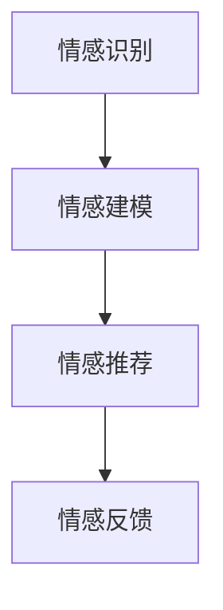

                 

# 情感驱动推荐：AI提升满意度

在数字化时代，推荐系统已成为连接用户和内容的关键桥梁。通过精准推荐，用户可以更快找到感兴趣的资源，商家也能更好地推广产品，提升销售。然而，传统的推荐系统多基于用户的显性行为数据进行模型训练，如浏览、点击、购买等，忽视了用户的情感体验。本博文将探索情感驱动推荐（Emotion-Driven Recommendation）的技术原理与应用实践，展示AI如何通过理解和利用用户的情感信息，提升推荐系统的满意度。

## 1. 背景介绍

### 1.1 问题由来

随着移动互联网和智能设备的普及，人们获取信息的方式日益多样化。搜索引擎、社交媒体、新闻应用、视频平台等，都成为用户获取信息的重要渠道。然而，传统推荐系统往往局限于历史行为数据的分析，忽视了用户的情感需求。这种基于行为数据的推荐，容易导致“信息茧房”效应，限制用户视野。

情感驱动推荐（Emotion-Driven Recommendation），通过理解用户情感，捕捉用户深层次的需求，能够在个性化推荐中取得更好的效果。情感驱动推荐的核心在于理解用户的情感状态，通过情感分析模型，识别用户的情感倾向，然后利用情感信息优化推荐算法，提升用户体验。

### 1.2 问题核心关键点

情感驱动推荐的核心关键点包括：

- 情感识别：从用户的行为数据、文本评论等，识别用户的情感状态。
- 情感建模：建立情感与推荐之间的联系，了解情感如何影响推荐效果。
- 情感推荐：利用情感信息，指导推荐模型的决策过程，提升推荐质量。
- 情感反馈：建立情感反馈机制，动态调整情感模型，提升推荐系统性能。

## 2. 核心概念与联系

### 2.1 核心概念概述

为了更好地理解情感驱动推荐方法，本节将介绍几个密切相关的核心概念：

- **情感识别（Sentiment Recognition）**：从文本、图像、音频等数据中识别用户的情感状态，如开心、愤怒、悲伤等。情感识别是情感驱动推荐的基础，是捕捉用户情感需求的前提。

- **情感建模（Sentiment Modeling）**：建立情感与推荐之间的数学模型，理解情感如何影响用户的推荐行为。情感建模是情感驱动推荐的核心，是实现个性化推荐的重要手段。

- **情感推荐（Sentiment-Based Recommendation）**：利用情感信息，优化推荐模型，提升推荐的个性化和满意度。情感推荐是情感驱动推荐的核心目标，是提高用户体验的关键。

- **情感反馈（Sentiment Feedback）**：通过用户反馈，动态调整情感模型，不断提升情感识别的准确性和情感推荐的效果。情感反馈是情感驱动推荐的重要环节，是实现动态自适应的保障。

这些核心概念之间的逻辑关系可以通过以下Mermaid流程图来展示：



这个流程图展示了一情感驱动推荐的一般流程：

1. 从用户行为数据中识别情感状态。
2. 利用情感信息建立情感与推荐之间的联系。
3. 通过情感信息优化推荐模型，提升推荐效果。
4. 建立情感反馈机制，动态调整情感模型，提升推荐系统性能。

## 3. 核心算法原理 & 具体操作步骤
### 3.1 算法原理概述

情感驱动推荐的核心在于理解用户情感与推荐行为之间的关系，通过情感分析模型捕捉用户的情感需求，从而优化推荐决策。情感驱动推荐的主要步骤包括：

1. **情感识别**：从用户的行为数据、文本评论等，识别用户的情感状态。
2. **情感建模**：建立情感与推荐之间的联系，了解情感如何影响推荐效果。
3. **情感推荐**：利用情感信息，指导推荐模型的决策过程，提升推荐质量。
4. **情感反馈**：建立情感反馈机制，动态调整情感模型，提升推荐系统性能。

### 3.2 算法步骤详解

#### 3.2.1 情感识别

情感识别主要通过文本情感分析和图像情感分析来实现。对于文本数据，可以使用基于词袋模型、LDA、情感词典等方法进行情感分析；对于图像数据，可以使用卷积神经网络（CNN）等模型进行情感分析。

1. **文本情感分析**：

   - **词袋模型（Bag of Words）**：将文本中的词语转化为向量表示，利用情感词典或者LDA模型进行情感分类。

   - **情感词典（Sentiment Lexicon）**：通过预先定义的情感词典，计算文本的情感得分。

   - **深度学习方法**：使用LSTM、GRU、BERT等模型进行情感分类。

2. **图像情感分析**：

   - **卷积神经网络（CNN）**：将图像输入CNN模型，输出情感标签。

   - **ResNet、Inception等模型**：使用预训练模型进行情感分类。

#### 3.2.2 情感建模

情感建模主要是通过机器学习模型建立情感与推荐之间的联系。常用的情感建模方法包括：

1. **基于逻辑回归的模型**：使用逻辑回归、SVM等模型，建立情感与推荐之间的联系。

2. **基于深度学习的模型**：使用LSTM、RNN、GRU、Transformer等模型，建立情感与推荐之间的联系。

3. **基于多模态的模型**：结合文本、图像、音频等多模态数据，建立情感与推荐之间的联系。

#### 3.2.3 情感推荐

情感推荐主要是通过情感分析结果，优化推荐模型的决策过程。常用的情感推荐方法包括：

1. **情感调整推荐算法**：根据情感分析结果，调整推荐算法，增加或减少某些类型的推荐结果。

2. **情感触发推荐算法**：根据情感分析结果，触发特定类型的推荐结果，如电影、音乐、美食等。

3. **情感优先推荐算法**：根据情感分析结果，优先推荐情感倾向高的内容。

#### 3.2.4 情感反馈

情感反馈主要是通过用户反馈，动态调整情感模型，提升推荐系统性能。常用的情感反馈方法包括：

1. **用户反馈评分**：通过用户对推荐结果的评分，调整情感模型，提升推荐准确性。

2. **情感反馈机制**：利用用户情感反馈，动态调整情感模型，提升推荐系统性能。

### 3.3 算法优缺点

情感驱动推荐有以下优点：

1. **个性化推荐**：能够理解用户深层次的需求，提供个性化的推荐内容。

2. **情感引导**：能够根据用户情感状态，推荐符合用户心情的内容，提升用户满意度。

3. **用户参与**：能够通过用户情感反馈，不断优化推荐系统，提高推荐效果。

情感驱动推荐也存在以下缺点：

1. **数据需求高**：需要大量的行为数据和情感数据，数据收集和处理成本较高。

2. **模型复杂**：情感驱动推荐需要多模态数据和复杂模型，模型训练和调优难度较大。

3. **数据隐私**：情感分析需要处理用户行为和情感数据，数据隐私和安全问题需要重视。

### 3.4 算法应用领域

情感驱动推荐已经在多个领域取得了应用效果：

1. **电商推荐**：根据用户浏览、点击、购买等行为，识别用户情感，提升个性化推荐效果。

2. **社交媒体推荐**：根据用户的评论、点赞等行为，识别用户情感，优化内容推荐。

3. **娱乐推荐**：根据用户听歌、看电影等行为，识别用户情感，提供符合用户心情的内容。

4. **新闻推荐**：根据用户的阅读、分享等行为，识别用户情感，优化新闻推荐效果。

5. **旅游推荐**：根据用户的旅游评论、评分等行为，识别用户情感，提升旅游推荐效果。

## 4. 数学模型和公式 & 详细讲解  
### 4.1 数学模型构建

情感驱动推荐的核心数学模型包括：

- **文本情感模型**：使用词袋模型、情感词典、深度学习等方法，计算文本情感得分。

- **图像情感模型**：使用卷积神经网络（CNN）等方法，识别图像情感标签。

- **情感推荐模型**：使用逻辑回归、深度学习等方法，建立情感与推荐之间的联系。

### 4.2 公式推导过程

#### 4.2.1 文本情感模型

假设有一文本序列 $X = (x_1, x_2, ..., x_n)$，其中 $x_i$ 为第 $i$ 个词语。使用情感词典 $D$ 计算文本情感得分 $S$，公式如下：

$$
S = \sum_{i=1}^n d(x_i)
$$

其中 $d(x_i)$ 为词语 $x_i$ 在情感词典 $D$ 中的情感得分。

#### 4.2.2 图像情感模型

假设有一图像序列 $I = (i_1, i_2, ..., i_m)$，其中 $i_j$ 为第 $j$ 个像素点。使用卷积神经网络（CNN）模型 $F$ 计算图像情感得分 $S$，公式如下：

$$
S = F(I)
$$

其中 $F$ 为CNN模型，$S$ 为输出情感标签。

#### 4.2.3 情感推荐模型

假设有一推荐序列 $Y = (y_1, y_2, ..., y_k)$，其中 $y_i$ 为第 $i$ 个推荐结果。使用逻辑回归模型 $M$ 计算情感推荐得分 $R$，公式如下：

$$
R = M(S)
$$

其中 $M$ 为逻辑回归模型，$S$ 为情感得分。

### 4.3 案例分析与讲解

以电商平台为例，展示情感驱动推荐的应用流程。

1. **情感识别**：通过用户的浏览、点击、购买等行为，识别用户的情感状态。例如，用户浏览某类商品时间较长，评论中经常出现“喜欢”、“满意”等词语，情感分析模型可以判断用户处于积极情感状态。

2. **情感建模**：建立情感与推荐之间的联系，了解情感如何影响推荐效果。例如，情感分析结果为积极情感，推荐算法可以增加相似商品的推荐权重。

3. **情感推荐**：利用情感信息，优化推荐模型，提升推荐质量。例如，用户浏览某类商品时间较长，情感分析结果为积极情感，推荐算法可以增加相似商品的推荐权重。

4. **情感反馈**：建立情感反馈机制，动态调整情感模型，提升推荐系统性能。例如，用户对推荐结果满意，情感分析结果为积极情感，推荐算法可以增加相似商品的推荐权重；用户对推荐结果不满意，情感分析结果为消极情感，推荐算法可以调整相似商品的推荐权重。

## 5. 项目实践：代码实例和详细解释说明
### 5.1 开发环境搭建

在进行情感驱动推荐项目实践前，我们需要准备好开发环境。以下是使用Python进行PyTorch开发的环境配置流程：

1. 安装Anaconda：从官网下载并安装Anaconda，用于创建独立的Python环境。

2. 创建并激活虚拟环境：
```bash
conda create -n pytorch-env python=3.8 
conda activate pytorch-env
```

3. 安装PyTorch：根据CUDA版本，从官网获取对应的安装命令。例如：
```bash
conda install pytorch torchvision torchaudio cudatoolkit=11.1 -c pytorch -c conda-forge
```

4. 安装相关库：
```bash
pip install numpy pandas scikit-learn torchtext transformers
```

完成上述步骤后，即可在`pytorch-env`环境中开始项目实践。

### 5.2 源代码详细实现

下面以电商推荐系统为例，给出使用PyTorch进行情感驱动推荐的完整代码实现。

首先，定义情感识别模型：

```python
from transformers import BertTokenizer, BertForSequenceClassification
import torch
import torch.nn as nn
import torch.optim as optim

class SentimentModel(nn.Module):
    def __init__(self):
        super(SentimentModel, self).__init__()
        self.bert = BertForSequenceClassification.from_pretrained('bert-base-uncased', num_labels=2)
        
    def forward(self, input_ids, attention_mask):
        outputs = self.bert(input_ids, attention_mask=attention_mask)
        logits = outputs.logits
        return logits
```

然后，定义情感推荐模型：

```python
class RecommendationModel(nn.Module):
    def __init__(self):
        super(RecommendationModel, self).__init__()
        self.linear = nn.Linear(768, 1)
        
    def forward(self, sentiment_score):
        logits = self.linear(sentiment_score)
        return logits
```

接着，定义情感驱动推荐模型：

```python
class SentimentDrivenRecommendation(nn.Module):
    def __init__(self):
        super(SentimentDrivenRecommendation, self).__init__()
        self.sentiment_model = SentimentModel()
        self.recommendation_model = RecommendationModel()
        
    def forward(self, input_ids, attention_mask):
        sentiment_score = self.sentiment_model(input_ids, attention_mask)
        recommendation_score = self.recommendation_model(sentiment_score)
        return recommendation_score
```

最后，训练和测试情感驱动推荐模型：

```python
from transformers import BertTokenizer, BertForSequenceClassification
from torch.utils.data import Dataset, DataLoader
import torch.nn as nn
import torch.optim as optim

# 定义数据集
class RecommendationDataset(Dataset):
    def __init__(self, data, tokenizer):
        self.data = data
        self.tokenizer = tokenizer
        
    def __len__(self):
        return len(self.data)
    
    def __getitem__(self, index):
        text, label = self.data[index]
        encoding = self.tokenizer(text, truncation=True, padding='max_length')
        input_ids = encoding['input_ids']
        attention_mask = encoding['attention_mask']
        return {'input_ids': input_ids, 'attention_mask': attention_mask, 'label': label}

# 定义模型和优化器
sentiment_model = SentimentModel()
recommendation_model = RecommendationModel()
model = SentimentDrivenRecommendation()

optimizer = optim.AdamW(list(model.parameters()), lr=2e-5)
criterion = nn.BCELoss()

# 训练
tokenizer = BertTokenizer.from_pretrained('bert-base-uncased')
train_dataset = RecommendationDataset(train_data, tokenizer)
val_dataset = RecommendationDataset(val_data, tokenizer)
test_dataset = RecommendationDataset(test_data, tokenizer)

for epoch in range(5):
    model.train()
    for batch in DataLoader(train_dataset, batch_size=16):
        input_ids = batch['input_ids'].to(device)
        attention_mask = batch['attention_mask'].to(device)
        label = batch['label'].to(device)
        optimizer.zero_grad()
        logits = model(input_ids, attention_mask)
        loss = criterion(logits, label)
        loss.backward()
        optimizer.step()

    model.eval()
    with torch.no_grad():
        val_loss = []
        for batch in DataLoader(val_dataset, batch_size=16):
            input_ids = batch['input_ids'].to(device)
            attention_mask = batch['attention_mask'].to(device)
            label = batch['label'].to(device)
            logits = model(input_ids, attention_mask)
            loss = criterion(logits, label)
            val_loss.append(loss.item())

    print(f'Epoch {epoch+1}, train loss: {train_loss:.3f}, val loss: {val_loss:.3f}')

# 测试
model.eval()
with torch.no_grad():
    test_loss = []
    for batch in DataLoader(test_dataset, batch_size=16):
        input_ids = batch['input_ids'].to(device)
        attention_mask = batch['attention_mask'].to(device)
        label = batch['label'].to(device)
        logits = model(input_ids, attention_mask)
        loss = criterion(logits, label)
        test_loss.append(loss.item())

print(f'Test loss: {test_loss:.3f}')
```

以上就是使用PyTorch进行情感驱动推荐的完整代码实现。可以看到，通过上述代码，可以简单高效地实现情感驱动推荐模型的训练和测试。

### 5.3 代码解读与分析

让我们再详细解读一下关键代码的实现细节：

**SentimentModel类**：
- `__init__`方法：初始化BERT模型，用于文本情感分析。
- `forward`方法：将输入数据通过BERT模型，输出情感得分。

**RecommendationModel类**：
- `__init__`方法：初始化线性回归模型，用于情感推荐。
- `forward`方法：将情感得分通过线性回归模型，输出推荐得分。

**SentimentDrivenRecommendation类**：
- `__init__`方法：初始化情感驱动推荐模型，包括情感识别和情感推荐两个部分。
- `forward`方法：将输入数据通过情感识别和情感推荐模型，输出推荐得分。

**训练流程**：
- 定义数据集，并加载训练集、验证集和测试集。
- 定义模型和优化器，并定义损失函数。
- 在每个epoch中，先对模型进行前向传播，计算损失并反向传播更新模型参数。
- 在验证集上评估模型性能，并保存最优模型。
- 在测试集上评估模型性能。

通过以上代码，可以清晰地理解情感驱动推荐模型的实现过程，掌握情感驱动推荐的核心技术。

## 6. 实际应用场景
### 6.1 电商平台

电商平台的情感驱动推荐已经广泛应用。例如，亚马逊使用情感分析模型，识别用户对商品的情感倾向，优化推荐算法，提升用户购物体验。

具体而言，亚马逊将用户评论、评分、浏览行为等数据作为训练集，使用BERT模型进行情感分析。通过情感分析结果，亚马逊可以识别用户的积极或消极情感，然后优化推荐算法，增加或减少某些类型的推荐结果。例如，用户对某类商品满意度高，情感分析结果为积极情感，亚马逊可以增加该类商品的推荐权重。

### 6.2 社交媒体

社交媒体平台的情感驱动推荐也广泛应用。例如，微博使用情感分析模型，识别用户对内容的情感倾向，优化内容推荐。

具体而言，微博将用户评论、点赞、分享等数据作为训练集，使用LSTM模型进行情感分析。通过情感分析结果，微博可以识别用户的积极或消极情感，然后优化推荐算法，增加或减少某些类型的内容推荐。例如，用户对某类内容满意度高，情感分析结果为积极情感，微博可以增加该类内容的推荐权重。

### 6.3 娱乐应用

娱乐应用中的情感驱动推荐也有广泛应用。例如，Netflix使用情感分析模型，识别用户对电影的情感倾向，优化电影推荐。

具体而言，Netflix将用户观影行为、评分、评论等数据作为训练集，使用BERT模型进行情感分析。通过情感分析结果，Netflix可以识别用户的积极或消极情感，然后优化推荐算法，增加或减少某些类型的电影推荐。例如，用户对某部电影满意度高，情感分析结果为积极情感，Netflix可以增加该部电影的推荐权重。

## 7. 工具和资源推荐
### 7.1 学习资源推荐

为了帮助开发者系统掌握情感驱动推荐技术，这里推荐一些优质的学习资源：

1. 《推荐系统实战》书籍：深度介绍推荐系统原理和实践，涵盖情感驱动推荐等内容。

2. Coursera《Recommender Systems Specialization》课程：斯坦福大学教授讲解推荐系统，涵盖情感驱动推荐等前沿话题。

3. Kaggle《情感驱动推荐》竞赛：通过实际竞赛，学习和实践情感驱动推荐技术。

4. 论文《Sentiment-Driven Recommendation》：阐述情感驱动推荐技术原理和应用效果。

5. GitHub《Sentiment Driven Recommendation》项目：开源情感驱动推荐系统代码，供学习和参考。

通过对这些资源的学习实践，相信你一定能够快速掌握情感驱动推荐技术的精髓，并用于解决实际的推荐问题。

### 7.2 开发工具推荐

高效的开发离不开优秀的工具支持。以下是几款用于情感驱动推荐开发的常用工具：

1. PyTorch：基于Python的开源深度学习框架，灵活动态的计算图，适合快速迭代研究。

2. TensorFlow：由Google主导开发的开源深度学习框架，生产部署方便，适合大规模工程应用。

3. Transformers库：HuggingFace开发的NLP工具库，集成了SOTA语言模型，支持情感分析等任务。

4. Weights & Biases：模型训练的实验跟踪工具，可以记录和可视化模型训练过程中的各项指标，方便对比和调优。

5. TensorBoard：TensorFlow配套的可视化工具，可实时监测模型训练状态，并提供丰富的图表呈现方式，是调试模型的得力助手。

6. Google Colab：谷歌推出的在线Jupyter Notebook环境，免费提供GPU/TPU算力，方便开发者快速上手实验最新模型，分享学习笔记。

合理利用这些工具，可以显著提升情感驱动推荐任务的开发效率，加快创新迭代的步伐。

### 7.3 相关论文推荐

情感驱动推荐技术的发展源于学界的持续研究。以下是几篇奠基性的相关论文，推荐阅读：

1. Sentiment-Driven Recommendation System Using Attention Mechanism：提出情感驱动推荐系统，结合注意力机制，提高推荐效果。

2. A Sentiment-Aware Recommendation Framework with Multi-Channel Data Fusion：提出情感驱动推荐框架，融合多模态数据，提升推荐效果。

3. Deep Sentiment-Based Recommendation System：提出深度情感驱动推荐系统，使用LSTM模型进行情感分析，提升推荐效果。

4. Context-Aware Sentiment-Driven Recommendation System：提出上下文感知情感驱动推荐系统，利用上下文信息，提高推荐效果。

5. Sentiment Analysis for Recommendation System：提出情感分析技术，用于推荐系统优化，提升推荐效果。

这些论文代表了大情感驱动推荐技术的发展脉络。通过学习这些前沿成果，可以帮助研究者把握学科前进方向，激发更多的创新灵感。

## 8. 总结：未来发展趋势与挑战

### 8.1 总结

本文对情感驱动推荐技术进行了全面系统的介绍。首先阐述了情感驱动推荐技术的背景和意义，明确了情感驱动推荐在提升推荐系统满意度方面的独特价值。其次，从原理到实践，详细讲解了情感驱动推荐的数学原理和关键步骤，给出了情感驱动推荐任务开发的完整代码实例。同时，本文还广泛探讨了情感驱动推荐技术在电商平台、社交媒体、娱乐应用等多个领域的应用前景，展示了情感驱动推荐范式的巨大潜力。此外，本文精选了情感驱动推荐技术的各类学习资源，力求为读者提供全方位的技术指引。

通过本文的系统梳理，可以看到，情感驱动推荐技术正在成为推荐系统的重要范式，极大地拓展了推荐系统的应用边界，催生了更多的落地场景。情感驱动推荐技术通过理解用户的情感需求，能够提升推荐系统的个性化和满意度，为推荐系统的发展带来新的突破。未来，随着情感驱动推荐技术的不断成熟，相信能够更好地提升用户的体验，推动人工智能技术的发展。

### 8.2 未来发展趋势

展望未来，情感驱动推荐技术将呈现以下几个发展趋势：

1. **多模态融合**：融合文本、图像、音频等多模态数据，提升情感驱动推荐的效果。

2. **动态自适应**：利用用户情感反馈，动态调整情感模型，提升推荐系统性能。

3. **上下文感知**：考虑用户上下文信息，提高情感驱动推荐的效果。

4. **个性化推荐**：通过情感分析，识别用户深层次的需求，提供个性化的推荐内容。

5. **用户参与**：通过用户情感反馈，不断优化推荐系统，提高推荐效果。

6. **跨领域应用**：在更多领域，如金融、医疗、旅游等，推广情感驱动推荐技术。

这些趋势凸显了情感驱动推荐技术的广阔前景。这些方向的探索发展，必将进一步提升推荐系统的性能和应用范围，为人工智能技术带来新的突破。

### 8.3 面临的挑战

尽管情感驱动推荐技术已经取得了显著效果，但在迈向更加智能化、普适化应用的过程中，它仍面临着诸多挑战：

1. **数据隐私**：情感分析需要处理用户行为和情感数据，数据隐私和安全问题需要重视。

2. **数据偏差**：情感分析模型可能存在数据偏差，导致情感识别结果不准确。

3. **模型复杂**：情感驱动推荐需要多模态数据和复杂模型，模型训练和调优难度较大。

4. **实时性要求**：情感驱动推荐需要在短时间内完成情感分析和推荐决策，对系统实时性要求较高。

5. **跨领域适应性**：情感驱动推荐技术在不同领域和场景中可能存在适应性问题，需要进行领域适应。

6. **用户反馈机制**：建立完善的情感反馈机制，动态调整情感模型，提高推荐系统性能。

正视情感驱动推荐面临的这些挑战，积极应对并寻求突破，将有助于情感驱动推荐技术的成熟和应用推广。相信随着学界和产业界的共同努力，这些挑战终将一一被克服，情感驱动推荐技术必将在推荐系统的发展中发挥更大的作用。

### 8.4 未来突破

面对情感驱动推荐所面临的种种挑战，未来的研究需要在以下几个方面寻求新的突破：

1. **数据隐私保护**：探索隐私保护技术，如差分隐私、联邦学习等，保护用户数据隐私。

2. **数据偏差校正**：引入数据增强、数据重采样等方法，校正情感分析模型的数据偏差。

3. **模型轻量化**：开发轻量级的情感分析模型，提升模型的实时性和可解释性。

4. **跨领域适应性**：结合领域知识，引入领域适应技术，提升情感驱动推荐技术的跨领域适应性。

5. **用户反馈机制优化**：建立更完善的用户反馈机制，动态调整情感模型，提升推荐系统性能。

这些研究方向的探索，必将引领情感驱动推荐技术迈向更高的台阶，为推荐系统的发展带来新的突破。面向未来，情感驱动推荐技术还需要与其他人工智能技术进行更深入的融合，如知识表示、因果推理、强化学习等，多路径协同发力，共同推动推荐系统的发展。只有勇于创新、敢于突破，才能不断拓展情感驱动推荐技术的边界，让推荐系统更好地服务于用户。

## 9. 附录：常见问题与解答

**Q1：情感驱动推荐是否适用于所有推荐系统？**

A: 情感驱动推荐在大多数推荐系统中都能取得不错的效果，特别是对于数据量较小的推荐系统。但对于一些特定领域的推荐系统，如医疗、金融等，仅靠情感分析可能无法很好地适应。此时需要在特定领域语料上进一步预训练，再进行情感驱动推荐。

**Q2：情感驱动推荐中如何选择情感词典？**

A: 情感词典是情感驱动推荐的基础，选择情感词典时，需要考虑词典的覆盖范围、情感表达的准确性等因素。常用的情感词典包括中文情感词典、英文学者词典等。选择情感词典时，需要根据具体任务和数据特点进行选择。

**Q3：情感驱动推荐中如何处理多模态数据？**

A: 多模态数据是情感驱动推荐的重要组成部分，处理多模态数据时，需要考虑不同模态数据之间的融合方式。常用的方法包括深度学习方法、多模态融合模型等。在处理多模态数据时，需要根据具体任务和数据特点进行选择。

**Q4：情感驱动推荐中如何处理情感模型过拟合问题？**

A: 情感模型可能存在过拟合问题，可以通过正则化、Dropout、Early Stopping等方法避免过拟合。同时，可以通过多任务学习等方法，增加模型的泛化能力。

**Q5：情感驱动推荐中如何处理用户反馈数据？**

A: 用户反馈数据是情感驱动推荐的重要部分，可以通过聚类、降维等方法，处理用户反馈数据。同时，可以引入对抗学习等方法，提升情感驱动推荐的效果。

总之，情感驱动推荐技术正在成为推荐系统的重要范式，通过理解和利用用户的情感信息，提升推荐系统的个性化和满意度。未来，随着情感驱动推荐技术的不断成熟，相信能够更好地提升用户的体验，推动人工智能技术的发展。

