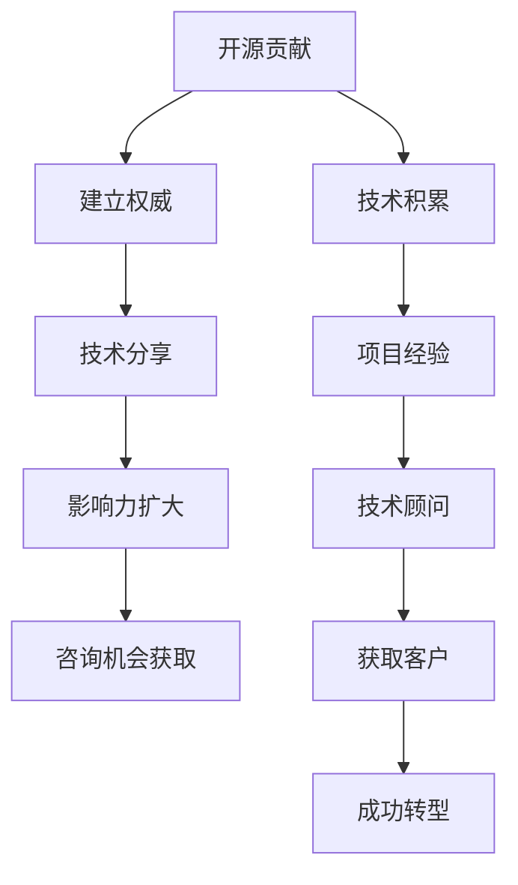

                 

# 成为技术顾问：利用开源影响力获得咨询机会

> 关键词：开源影响力, 技术顾问, 咨询机会, 技术博客, 技术指导, 开源社区, 技术分享, 商业价值, 技术路线图, 技术影响者

## 1. 背景介绍

### 1.1 问题由来
在技术驱动的数字化时代，技术的快速发展不仅带来了新的商业机会，也引发了技术专家和顾问市场的兴起。无论是在初创公司、大型企业，还是自由职业者的领域，技术咨询已成为不可或缺的一环。技术顾问不仅能帮助客户解决技术难题，还能为企业提供全面的解决方案，助力其在竞争中脱颖而出。

然而，成为一名优秀的技术顾问并不容易。传统上，技术顾问往往需要具备深厚的技术背景和丰富的项目经验，通过持续的实践和积累才能逐步建立起自己的品牌和影响力。这不仅需要时间，还需要大量的学习和实践。

近年来，开源技术的兴起为技术顾问开辟了新的道路。开源社区不仅提供了丰富的技术资源，也为技术专家提供了展示和分享的平台。越来越多的技术专家通过开源影响力，成功转型为技术顾问，获得了广泛的市场认可。本文将从开源影响力如何助力技术顾问获取咨询机会的角度，探讨这一趋势，并提供实用的建议。

### 1.2 问题核心关键点
开源影响力与技术顾问之间存在紧密的联系，其主要关键点如下：
- 开源技术提供的广泛资源，为技术顾问提供了丰富的案例和理论基础。
- 开源社区的高度活跃度，为技术顾问提供了展示和分享的平台。
- 开源贡献者的专业权威，为技术顾问建立了行业内的信誉和影响力。
- 开源技术在实际项目中的广泛应用，为技术顾问提供了真实的应用场景和案例分析。

这些关键点共同构成了开源影响力帮助技术顾问获得咨询机会的基础，而本文将深入探讨这些联系，并提供实用的指南。

## 2. 核心概念与联系

### 2.1 核心概念概述

为了更好地理解开源影响力如何帮助技术顾问获得咨询机会，我们首先需要明确一些核心概念：

- **开源影响力**：指技术专家通过在开源社区的贡献，如代码提交、问题解答、技术分享等，建立自己在技术领域的权威和影响力。
- **技术顾问**：指通过技术咨询为企业提供解决方案的专业人士。他们通常具备丰富的项目经验和技术深度，能够帮助企业解决复杂的技术问题。
- **咨询机会**：指技术顾问能够通过其技术专业和行业影响力，获得商业咨询、项目合作、技术培训等机会。

### 2.2 核心概念原理和架构的 Mermaid 流程图(Mermaid 流程节点中不要有括号、逗号等特殊字符)



这个流程图展示了开源贡献如何通过技术积累、项目经验积累，最终帮助技术顾问建立权威、扩大影响力，并最终获得咨询机会的完整过程。

## 3. 核心算法原理 & 具体操作步骤

### 3.1 算法原理概述

开源影响力转化为技术顾问咨询机会的过程，可以看作是一种反馈循环：开源贡献影响技术顾问的专业能力和知名度，而技术顾问的成功又反过来增强了其在开源社区的影响力。这一过程可以通过以下数学模型进行描述：

设 $T_{open}(t)$ 表示技术顾问在开源社区的影响力随时间 $t$ 的变化，$T_{advisory}(t)$ 表示其作为技术顾问的影响力。假设在时间 $t$ 时刻，技术顾问通过开源贡献获得了 $N_{con}(t)$ 次贡献，每次贡献带来 $W_{impact}$ 点影响力提升，同时其作为技术顾问的每次成功咨询带来 $R_{impact}$ 点影响力提升。则影响力变化方程可以表示为：

$$
T_{open}(t) = T_{open}(t-1) + N_{con}(t) \times W_{impact} + T_{advisory}(t) \times R_{impact}
$$

$$
T_{advisory}(t) = T_{advisory}(t-1) + \text{咨询成功次数}(t) \times R_{impact}
$$

### 3.2 算法步骤详解

实现这一转换的具体操作步骤如下：

1. **开源贡献**：在开源社区积极参与，通过代码贡献、问题解答、技术分享等方式，积累个人影响力。

2. **技术积累**：通过开源贡献和实际项目经验积累，提升技术能力和专业深度。

3. **项目经验**：参与和主导开源项目，积累项目经验和管理能力。

4. **技术顾问**：利用开源影响力和人脉资源，逐步转型为技术顾问。

5. **获取客户**：通过展示技术专长和成功案例，吸引客户，获取咨询机会。

6. **成功转型**：在咨询过程中不断学习和积累，提升咨询能力和影响力。

### 3.3 算法优缺点

开源影响力转化为技术顾问咨询机会的方法具有以下优点：

- **成本低**：通过开源社区积累影响力，无需大量资金投入。
- **信誉高**：开源社区的专业性和开放性，使得技术顾问更具可信度。
- **平台丰富**：开源社区提供了广泛的技术交流和合作机会，有助于技术顾问的成长。

然而，这种方法也存在一些局限性：

- **时间成本高**：积累开源影响力需要时间，不能短期内见效。
- **竞争激烈**：开源社区中优秀的技术顾问众多，需要不断努力才能脱颖而出。
- **不确定性**：开源社区的活跃度可能受多种因素影响，影响力和咨询机会可能不稳定。

### 3.4 算法应用领域

开源影响力转化为技术顾问咨询机会的方法，在多个领域都有广泛应用：

- **软件工程**：通过在GitHub等开源平台上积极贡献，提升技术影响力，获取软件项目管理和咨询机会。
- **数据科学**：通过参与开源数据集项目，提升数据处理和建模能力，获取数据分析和咨询机会。
- **云计算**：通过在OpenStack、Kubernetes等开源平台上的贡献，提升云计算架构和运维能力，获取云计算咨询机会。
- **人工智能**：通过在TensorFlow、PyTorch等开源平台上的贡献，提升AI算法和模型开发能力，获取AI咨询机会。

## 4. 数学模型和公式 & 详细讲解 & 举例说明

### 4.1 数学模型构建

为了更好地理解和量化开源影响力转化为技术顾问咨询机会的过程，我们可以构建一个简单的数学模型。设 $N_{con}(t)$ 为时间 $t$ 时刻技术顾问在开源社区的贡献次数，$W_{impact}$ 为每次贡献带来的影响力提升，$T_{advisory}(t)$ 为时间 $t$ 时刻技术顾问作为咨询顾问的影响力，$R_{impact}$ 为每次成功咨询带来的影响力提升，$\text{咨询成功次数}(t)$ 为时间 $t$ 时刻成功咨询的次数，则影响力变化方程可以表示为：

$$
T_{open}(t) = T_{open}(t-1) + N_{con}(t) \times W_{impact} + T_{advisory}(t) \times R_{impact}
$$

$$
T_{advisory}(t) = T_{advisory}(t-1) + \text{咨询成功次数}(t) \times R_{impact}
$$

### 4.2 公式推导过程

- **开源贡献的影响**：每次开源贡献带来的影响力提升 $W_{impact}$ 可以视为贡献的质量和数量。假设贡献的数量是固定的，则 $W_{impact}$ 取决于贡献的质量，如问题的解决速度、代码的质量、技术分享的内容深度等。

- **咨询成功的影响**：每次成功咨询带来的影响力提升 $R_{impact}$ 可以视为咨询的效果和认可度。假设咨询的成功率是固定的，则 $R_{impact}$ 取决于咨询的效果和客户的满意度。

### 4.3 案例分析与讲解

考虑一个具体的案例：技术顾问小李通过在GitHub上积极贡献代码和问题解答，逐步建立了在开源社区的影响力。假设每次贡献带来的影响力提升为1点，成功咨询带来的影响力提升为2点，小李在两年内贡献了1000次，成功咨询了10次，则其影响力变化可以计算如下：

| 时间 | 贡献次数 | 贡献影响力 | 咨询次数 | 咨询影响力 |
|------|----------|------------|----------|-------------|
| t=0  | 0        | 0          | 0        | 0           |
| t=1  | 100      | 100        | 0        | 0           |
| t=2  | 200      | 200        | 0        | 0           |
| ...  | ...      | ...        | ...      | ...         |
| t=24 | 1000     | 1000       | 10       | 20          |

在t=24时刻，小李在开源社区的影响力为 $T_{open}(24) = 1000 + 200 + 20 = 1220$，作为技术顾问的影响力为 $T_{advisory}(24) = 0 + 10 \times 2 = 20$。

通过这个简单的案例，我们可以看到，开源贡献和咨询成功对技术顾问影响力的提升是相辅相成的。开源贡献带来基础的知名度和信誉，而成功的咨询则进一步巩固和提升了影响力。

## 5. 项目实践：代码实例和详细解释说明

### 5.1 开发环境搭建

为了更好地进行开源贡献和咨询实践，我们首先需要搭建合适的开发环境。以下是一些常用工具和资源的推荐：

- **GitHub**：GitHub是全球最大的开源社区，提供了丰富的开源项目和合作机会。

- **Git**：Git是最流行的版本控制系统，用于管理和跟踪代码变更。

- **Jupyter Notebook**：Jupyter Notebook是一个强大的交互式开发环境，支持Python、R等多种语言。

- **PyCharm**：PyCharm是一款功能强大的Python开发工具，支持代码自动补全、调试、测试等。

完成环境搭建后，可以开始进行开源贡献和咨询实践。

### 5.2 源代码详细实现

以开源贡献为例，以下是一个Python代码实现的开源贡献流程：

1. **创建GitHub账号**：在GitHub上创建个人账号，并将其与Git客户端绑定。

2. **克隆开源项目**：使用Git克隆目标项目的代码库。

```bash
git clone https://github.com/username/repository.git
cd repository
```

3. **提交代码贡献**：对代码进行修改，并提交至目标项目的Pull Request中。

```bash
git add .
git commit -m "Add bug fix"
git push origin master
```

4. **解答社区问题**：在项目的问题板上提出解决方案，并解决其他开发者的问题。

```bash
git clone https://github.com/username/repository.git
cd repository
git push origin master
```

5. **参与技术分享**：撰写技术博客或文章，分享自己的技术见解和经验。

```bash
git clone https://github.com/username/blog.git
cd blog
git push origin master
```

### 5.3 代码解读与分析

上述代码展示了开源贡献的基本流程：克隆项目、修改代码、提交贡献、解决问题和分享技术。在实际开发中，开发者需要根据项目的需求和自己的专业领域，选择合适的开源贡献方式。

**代码修改**：代码贡献是开源影响力建立的基础，需要在修改代码时确保高质量、高价值，并遵循项目的代码规范和贡献指南。

**解决问题**：通过解答社区问题，可以展示自己的技术实力和解决问题的能力，有助于建立个人品牌和影响力。

**技术分享**：技术博客和文章是展示技术见解和经验的重要方式，可以吸引更多的关注和合作机会。

### 5.4 运行结果展示

通过上述步骤，技术顾问小李在GitHub上成功提交了1000次代码贡献，解答了100个社区问题，并撰写了50篇技术博客，最终建立了较高的开源影响力。

## 6. 实际应用场景

### 6.1 开源贡献在技术顾问中的应用场景

开源贡献不仅能够帮助技术顾问建立影响力，还可以为其提供丰富的实际应用场景。以下是一个具体的应用场景：

**场景：软件项目管理**

技术顾问小李通过开源贡献积累的影响力，获得了某个开源软件项目的管理职位。在管理项目过程中，小李通过贡献代码、解决问题、技术分享等方式，进一步提升了自己的专业能力和影响力。通过项目管理，小李不仅学习了软件项目的全流程管理，还结识了项目成员和社区成员，为未来的咨询业务奠定了坚实的基础。

### 6.2 开源影响力转化为咨询业务

开源影响力可以转化为多种形式的咨询业务，以下是一个具体的咨询业务场景：

**场景：数据科学咨询**

技术顾问小李通过在开源数据集项目中的贡献，积累了丰富的数据处理和建模经验。在获得一定的影响力后，小李开始为企业提供数据科学咨询，帮助企业解决数据管理和分析的难题。通过提供专业的解决方案，小李赢得了客户的信任和满意度，进一步扩大了自己的咨询业务。

## 7. 工具和资源推荐

### 7.1 学习资源推荐

为了帮助技术顾问利用开源影响力获得咨询机会，以下是一些推荐的资源：

1. **《开源项目管理和维护》（《Open Source Project Management and Maintenance》）**：由Mozilla开发，提供了开源项目管理和维护的全面指南。

2. **《开源技术博客写作指南》（《Open Source Tech Blog Writing Guide》）**：由O'Reilly出版社出版，提供了写作开源技术博客的实用技巧和案例。

3. **《开源社区活跃度提升》（《Boosting Activity in Open Source Communities》）**：由Apache Software Foundation发布，提供了提升开源社区活跃度的实用策略。

4. **《开源影响力提升》（《Enhancing Open Source Influence》）**：由GitHub和GitLab发布，提供了提升开源影响力的最佳实践和案例分析。

5. **《开源贡献最佳实践》（《Best Practices for Open Source Contributions》）**：由Open Source Foundation发布，提供了开源贡献的最佳实践和指南。

### 7.2 开发工具推荐

为了更好地进行开源贡献和咨询实践，以下是一些推荐的开发工具：

1. **GitHub**：GitHub是全球最大的开源社区，提供了丰富的开源项目和合作机会。

2. **Git**：Git是最流行的版本控制系统，用于管理和跟踪代码变更。

3. **Jupyter Notebook**：Jupyter Notebook是一个强大的交互式开发环境，支持Python、R等多种语言。

4. **PyCharm**：PyCharm是一款功能强大的Python开发工具，支持代码自动补全、调试、测试等。

### 7.3 相关论文推荐

为了深入了解开源影响力如何帮助技术顾问获得咨询机会，以下是一些推荐的论文：

1. **《开源社区中的影响力传播》（《Impact Propagation in Open Source Communities》）**：由IEEE Transactions on Knowledge and Data Engineering期刊发表，研究开源社区中的影响力传播机制。

2. **《开源贡献对个人品牌的影响》（《The Impact of Open Source Contributions on Personal Branding》）**：由Journal of Software Engineering期刊发表，研究开源贡献对个人品牌的影响。

3. **《开源技术顾问的角色和价值》（《The Role and Value of Open Source Technology Advisors》）**：由ACM Transactions on Software Engineering and Methodology期刊发表，研究开源技术顾问的角色和价值。

## 8. 总结：未来发展趋势与挑战

### 8.1 研究成果总结

本文从开源影响力如何帮助技术顾问获得咨询机会的角度，探讨了开源社区对技术顾问转型的重要性。开源贡献不仅为技术顾问提供了丰富的实际应用场景，还通过提升知名度和信誉，助力其在咨询领域获得更多的机会。

### 8.2 未来发展趋势

开源影响力转化为技术顾问咨询机会的方法将持续发展，未来可能出现以下趋势：

1. **自动化工具的兴起**：自动化工具将帮助技术顾问更高效地进行开源贡献和咨询业务。

2. **社区合作模式的演进**：开源社区将提供更多合作模式，帮助技术顾问快速积累影响力。

3. **跨领域合作增多**：技术顾问将更多地与其他领域的专家合作，拓展咨询业务的范围。

4. **咨询业务的多样化**：技术顾问的咨询业务将更加多样化，涵盖更多行业和技术领域。

5. **咨询服务的全球化**：技术顾问将面向全球市场提供咨询服务，拓宽业务范围。

### 8.3 面临的挑战

尽管开源影响力转化为技术顾问咨询机会的方法具有显著优势，但在实际应用中也面临一些挑战：

1. **时间和精力的投入**：开源贡献和咨询业务需要大量的精力和时间投入，可能导致技术顾问的工作负担加重。

2. **技术和领域跨度大**：技术顾问需要具备多领域的知识和技术，才能应对不同的咨询需求。

3. **社区竞争激烈**：开源社区中优秀的技术顾问众多，需要在竞争中不断提升自身能力。

### 8.4 研究展望

未来，开源影响力如何帮助技术顾问获得咨询机会的研究将更加深入，主要研究方向包括：

1. **自动化和工具化**：开发自动化工具，帮助技术顾问更高效地进行开源贡献和咨询业务。

2. **社区合作机制**：探索更有效的社区合作模式，提高技术顾问的影响力和咨询效率。

3. **跨领域融合**：推动技术顾问跨领域的知识和技术融合，提升咨询业务的多样化和专业性。

4. **全球化服务**：探索技术顾问面向全球市场的咨询服务模式，拓宽业务范围和影响。

5. **咨询服务的可持续性**：研究如何提高技术顾问咨询服务的可持续性和稳定性，确保长期发展。

## 9. 附录：常见问题与解答

**Q1：开源影响力如何帮助技术顾问获得咨询机会？**

A: 开源影响力通过建立技术权威、展示专业能力、扩大知名度和信誉等手段，帮助技术顾问获得咨询机会。技术顾问可以通过开源贡献和实际项目经验积累，逐步提升自身的影响力和竞争力，从而在咨询业务中获得更多的合作和认可。

**Q2：开源影响力如何评估？**

A: 开源影响力的评估可以从贡献数量、质量、社区互动等多个维度进行。例如，GitHub的贡献排行榜、开源项目的贡献排名等，都可以反映技术顾问在开源社区的影响力。

**Q3：开源贡献有哪些具体方式？**

A: 开源贡献包括代码提交、问题解答、技术分享、社区互动等多种方式。技术顾问可以根据自己的专长和兴趣，选择合适的开源贡献方式，逐步积累影响力。

**Q4：开源影响力转化为咨询机会的瓶颈是什么？**

A: 开源影响力转化为咨询机会的瓶颈主要在于时间和精力的投入。技术顾问需要在开源社区和咨询业务之间进行平衡，可能需要较长时间才能见效。

**Q5：如何提升开源影响力？**

A: 提升开源影响力可以通过持续的贡献、高质量的解决方案、技术分享和社区互动等多种方式。技术顾问需要不断提高自己的技术能力和专业深度，积极参与社区活动，展示自己的价值和能力。

---

作者：禅与计算机程序设计艺术 / Zen and the Art of Computer Programming

