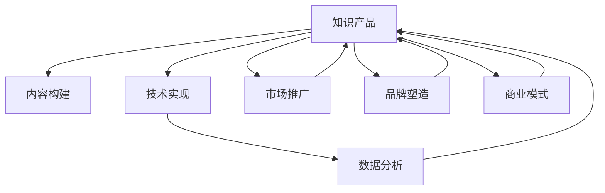

                 

# 打造优质知识产品IP吸引投资人关注投资

> 关键词：知识产品、IP打造、投资吸引、技术方法、核心策略

## 1. 背景介绍

### 1.1 问题由来
当前，数字化时代正以汹涌之势席卷全球，人工智能、大数据、云计算等技术的迅猛发展，深刻改变了各行各业的商业模式和竞争格局。在此背景下，知识产品的价值和影响力日益凸显，其商业潜力和市场空间也引起了众多投资者的关注。如何通过打造优质知识产品IP，吸引投资人的目光，成为了一个亟待解决的问题。

### 1.2 问题核心关键点
打造优质知识产品IP的核心在于：构建具有独特价值和广泛吸引力的知识体系，通过有效的市场推广和运营策略，将知识产品推向市场，最终实现商业变现。这一过程需要跨越多个环节，包括市场调研、内容构建、技术实现、品牌运营、商业模式设计等。以下将围绕这些关键点展开详细讨论。

## 2. 核心概念与联系

### 2.1 核心概念概述

- **知识产品**：基于专业知识和技术，以内容形式呈现，具备实用价值和市场潜力的产品，如技术教程、行业报告、在线课程等。
- **IP打造**：指通过系统性的内容建设、品牌塑造和市场推广，将知识产品转化为具有广泛吸引力和商业价值的IP。
- **投资吸引**：指通过展示知识产品的独特价值、市场潜力以及明确的商业计划，吸引投资者关注和投资。
- **技术方法**：涵盖内容构建、技术实现、数据分析等多个方面，是知识产品IP打造的重要支撑。
- **核心策略**：包括市场定位、运营模式、合作策略等，是知识产品IP打造的关键决策依据。

这些核心概念之间相互关联，共同构成了打造优质知识产品IP的完整框架。

### 2.2 核心概念原理和架构的 Mermaid 流程图



## 3. 核心算法原理 & 具体操作步骤
### 3.1 算法原理概述

打造优质知识产品IP的过程，本质上是一个基于数据的系统性决策过程。其核心在于通过数据驱动，构建起具有高市场吸引力和商业潜力的知识产品体系。以下是这一过程的主要算法原理：

1. **市场调研**：通过对目标市场的深度调研，获取关键数据和信息，识别市场机会和潜在需求。
2. **内容构建**：根据市场调研结果，设计符合市场需求的知识产品内容。内容应具备创新性、实用性和可传播性，以吸引用户关注。
3. **技术实现**：利用先进技术手段，将知识产品内容转化为易于访问和使用的形式，如网站、应用、视频等。
4. **数据分析**：通过数据分析，持续监测和优化知识产品的效果，评估市场表现和用户反馈，及时调整策略。
5. **市场推广**：结合数据分析结果，制定有效的市场推广策略，通过多渠道多平台推广，提升知识产品知名度和影响力。
6. **品牌塑造**：通过品牌建设和IP打造，构建知识产品的独特形象，增强市场竞争力。
7. **商业模式设计**：根据市场调研和推广结果，设计适合的商业模型，实现知识产品的商业化运营。

### 3.2 算法步骤详解

以下是打造优质知识产品IP的具体操作步骤：

**Step 1: 市场调研**
- 收集和分析目标市场的用户需求、竞争对手情况、市场趋势等数据。
- 通过问卷调查、焦点小组、访谈等手段，深入了解用户痛点和期望。

**Step 2: 内容构建**
- 根据市场调研结果，确定知识产品的主题和形式。
- 设计知识产品的详细大纲和内容框架，确保内容的创新性和实用性。
- 组建专业的编辑和作者团队，确保内容的高质量。

**Step 3: 技术实现**
- 选择合适的技术平台和工具，进行知识产品的开发和实现。
- 对内容进行技术封装和优化，确保用户体验良好。
- 利用先进技术手段，实现内容的自动化生成和智能推荐。

**Step 4: 数据分析**
- 对知识产品的使用数据进行收集和分析，评估用户行为和产品效果。
- 使用数据可视化工具，将分析结果呈现给团队成员和投资者。
- 根据分析结果，不断优化内容和推广策略。

**Step 5: 市场推广**
- 制定多渠道多平台的市场推广策略，如社交媒体、搜索引擎、合作伙伴等。
- 通过SEO优化、内容营销、付费广告等手段，提升知识产品的曝光率和用户量。
- 利用数据分析结果，调整推广策略，提升推广效果。

**Step 6: 品牌塑造**
- 设计知识产品的品牌标识、口号和形象，提升品牌识别度。
- 通过品牌故事和案例展示，增强用户对知识产品的认同感。
- 利用品牌影响力，吸引更多用户和投资者的关注。

**Step 7: 商业模式设计**
- 根据市场调研和推广结果，设计适合的商业模型，如订阅模式、付费模式、广告模式等。
- 制定详细的商业计划，包括收入预测、成本控制和盈利路径。
- 向投资者展示商业计划，争取投资支持和资源注入。

### 3.3 算法优缺点

打造优质知识产品IP具有以下优点：
1. 高市场潜力：基于深度市场调研和用户需求分析，构建具有广泛吸引力的知识产品，具备高市场潜力。
2. 精准运营：通过数据分析和优化，持续提升知识产品的效果，实现精准运营。
3. 品牌增值：通过品牌塑造和IP打造，提升知识产品的市场价值和竞争力。
4. 商业变现：设计适合的商业模式，实现知识产品的商业化运营，获得稳定的收入来源。

同时，这一方法也存在以下局限：
1. 投资门槛高：知识产品IP打造需要大量的人力、物力和财力投入，对中小型企业和创业者来说，门槛较高。
2. 风险较大：市场变化多端，知识产品IP打造过程中存在一定的失败风险。
3. 运营复杂：知识产品IP打造涉及多个环节，需要跨部门协作和系统管理，运营过程较为复杂。

尽管存在这些局限，但通过科学合理的方法论和执行策略，打造优质知识产品IP仍然是一条高效可行、潜力巨大的路径。

### 3.4 算法应用领域

打造优质知识产品IP的方法，在多个领域得到了广泛应用，以下是几个典型应用场景：

- **技术教程**：针对特定技术领域的知识产品，如编程语言、大数据技术、人工智能等。通过构建高质量的技术教程，吸引技术开发者关注和投资。
- **行业报告**：提供某一行业或领域的深度分析和市场预测，帮助企业决策和投资者洞察市场机会。
- **在线课程**：将知识产品以在线课程形式呈现，吸引学生和专业人士，实现教育和培训的商业化。
- **知识问答**：利用知识图谱和大数据技术，构建智能化的知识问答平台，吸引用户和企业，实现商业变现。
- **商业咨询**：提供定制化的商业咨询和解决方案，帮助企业提升运营效率和市场竞争力，实现商业合作。

## 4. 数学模型和公式 & 详细讲解 & 举例说明

### 4.1 数学模型构建

在知识产品IP打造过程中，可以通过以下数学模型进行量化分析：

- **用户满意度模型**：通过问卷调查和用户反馈，构建用户满意度的数学模型，评估知识产品的效果。
- **市场竞争力模型**：结合市场调研数据，构建知识产品市场竞争力的数学模型，评估其在市场中的地位。
- **投资回报模型**：根据商业模式和市场预期，构建知识产品投资的回报模型，评估投资的风险和收益。

### 4.2 公式推导过程

以用户满意度模型为例，设用户对知识产品的满意度为S，满意度由内容质量Q、用户体验U、市场反馈F等多个因素决定。构建用户满意度的数学模型如下：

$$ S = \alpha_1 Q + \alpha_2 U + \alpha_3 F $$

其中，$\alpha_1, \alpha_2, \alpha_3$为权重系数。通过数据分析，可以计算出每个因素的贡献度，从而优化知识产品的内容和用户体验。

### 4.3 案例分析与讲解

**案例一：技术教程的打造**

某科技公司欲打造一款针对Python编程语言的在线教程，步骤如下：

1. **市场调研**：通过问卷调查和访谈，发现Python编程是IT行业最热门且需求量最大的技能之一。
2. **内容构建**：设计详细的教程大纲，涵盖Python基础知识、高级应用、实战案例等。
3. **技术实现**：利用Python、HTML、CSS等技术，开发在线教程平台，实现内容的可视化展示。
4. **数据分析**：通过用户行为数据，分析课程的访问量和用户反馈，优化课程内容和教学方法。
5. **市场推广**：通过社交媒体、技术论坛等渠道推广课程，吸引更多用户注册和使用。
6. **品牌塑造**：设计品牌标识和口号，提升品牌识别度。
7. **商业模式设计**：采用付费订阅模式，用户需要购买订阅才能获取完整课程内容，同时提供广告和课程推荐服务，实现多元收入。

**案例二：行业报告的打造**

某咨询公司欲打造一份关于人工智能行业的深度报告，步骤如下：

1. **市场调研**：收集和分析全球人工智能市场的数据，识别市场机会和潜在需求。
2. **内容构建**：设计报告大纲，涵盖人工智能的发展历程、当前技术、市场趋势、应用案例等。
3. **技术实现**：利用数据分析工具，生成报告图表和数据可视化效果。
4. **数据分析**：通过数据分析，评估人工智能行业的市场潜力和发展前景。
5. **市场推广**：通过行业会议、专业论坛等渠道推广报告，吸引企业决策者和投资者关注。
6. **品牌塑造**：设计报告的品牌标识和口号，提升品牌影响力。
7. **商业模式设计**：采用付费订阅和广告合作模式，实现知识产品的商业化运营。

## 5. 项目实践：代码实例和详细解释说明

### 5.1 开发环境搭建

在进行知识产品IP打造的过程中，需要搭建相应的开发环境。以下是使用Python和Django框架进行知识产品网站开发的流程：

1. 安装Python：从官网下载并安装Python，保证Python版本与Django兼容。
2. 安装Django：使用pip命令安装Django，创建新项目。
3. 安装其他依赖：安装Flask、SQLAlchemy等常用库。
4. 配置开发环境：配置数据库、邮箱、消息队列等环境变量。
5. 开发部署：进行前端开发、后端开发、测试和部署。

### 5.2 源代码详细实现

以知识产品网站的开发为例，以下是Django框架的代码实现：

```python
from django.shortcuts import render
from django.http import HttpResponse
from .models import Course

def index(request):
    courses = Course.objects.all()
    return render(request, 'index.html', {'courses': courses})

def course_detail(request, id):
    course = Course.objects.get(id=id)
    return render(request, 'course_detail.html', {'course': course})
```

### 5.3 代码解读与分析

**index函数**：
- 获取所有课程数据，渲染到前端页面。
- 使用Django的模板引擎，将数据传递给HTML模板。

**course_detail函数**：
- 根据课程ID获取单个课程数据，渲染到前端页面。
- 使用Django的模板引擎，将课程数据传递给HTML模板。

### 5.4 运行结果展示

启动Django开发服务器，访问知识产品网站，可以看到所有课程的列表和单个课程的详细信息。

## 6. 实际应用场景

### 6.1 技术教程网站

技术教程网站通过提供高质量的在线教程，吸引开发者和学生关注和投资。其典型应用包括编程语言、数据分析、机器学习等技术领域的教程。

### 6.2 行业报告平台

行业报告平台通过提供深度市场分析和趋势预测，帮助企业决策和投资者洞察市场机会。其典型应用包括金融、医疗、科技等行业的报告。

### 6.3 在线课程平台

在线课程平台通过提供丰富的教育资源，吸引学生和专业人士，实现教育和培训的商业化。其典型应用包括K-12教育、职业技能培训、企业内训等。

### 6.4 知识问答社区

知识问答社区通过构建智能化的知识问答平台，吸引用户和专业人士，实现商业变现。其典型应用包括技术问答、医疗咨询、法律咨询等。

### 6.5 商业咨询服务

商业咨询服务通过提供定制化的商业咨询和解决方案，帮助企业提升运营效率和市场竞争力，实现商业合作。其典型应用包括市场分析、战略规划、运营优化等。

## 7. 工具和资源推荐

### 7.1 学习资源推荐

为了帮助开发者系统掌握知识产品IP打造的理论基础和实践技巧，这里推荐一些优质的学习资源：

1. **《打造知识产品IP：系统化方法与实战案例》**：系统介绍知识产品IP打造的理论和方法，结合实战案例进行讲解，适合学习者深入理解。
2. **《数据驱动的营销策略》**：介绍如何通过数据分析和市场调研，制定有效的知识产品推广策略，适合市场营销人员参考。
3. **《Python编程：从入门到精通》**：系统讲解Python编程语言的基础和高级应用，适合技术开发者学习。
4. **《Django Web开发实战》**：介绍Django框架的开发环境和实战项目，适合网站开发人员学习。
5. **《商业模型创新》**：讲解商业模型的构建和创新方法，适合创业者参考。

### 7.2 开发工具推荐

高效的开发离不开优秀的工具支持。以下是几款用于知识产品IP打造开发的常用工具：

1. **Python**：高效的编程语言，适合开发各种类型的知识产品。
2. **Django**：流行的Python Web框架，适合构建知识产品网站和应用。
3. **Jupyter Notebook**：交互式的编程环境，适合数据分析和算法实现。
4. **Git**：版本控制系统，适合团队协作和代码管理。
5. **GitHub**：代码托管平台，适合代码共享和项目管理。

### 7.3 相关论文推荐

知识产品IP打造领域的研究不断涌现，以下是几篇奠基性的相关论文，推荐阅读：

1. **《从产品到IP：知识产品的品牌塑造与市场推广》**：系统介绍知识产品品牌塑造和市场推广的方法和策略。
2. **《数据驱动的知识产品创新》**：探讨数据在知识产品创新和优化中的应用。
3. **《知识产品的商业模型设计》**：介绍如何通过商业模型设计，实现知识产品的商业化运营。
4. **《知识产品的用户行为分析》**：分析用户行为数据，优化知识产品的内容和推广策略。

## 8. 总结：未来发展趋势与挑战

### 8.1 总结

本文对打造优质知识产品IP的方法进行了全面系统的介绍。首先阐述了知识产品IP打造的研究背景和意义，明确了知识产品IP打造在提升市场竞争力和实现商业变现方面的重要作用。其次，从原理到实践，详细讲解了知识产品IP打造的数学模型和具体操作步骤，给出了知识产品网站开发的完整代码实例。同时，本文还广泛探讨了知识产品IP打造的实际应用场景，展示了知识产品IP打造的市场潜力。此外，本文精选了知识产品IP打造的各类学习资源，力求为读者提供全方位的技术指引。

通过本文的系统梳理，可以看到，知识产品IP打造方法在大数据和人工智能技术支持下，能够系统性地解决市场调研、内容构建、技术实现、数据分析、市场推广、品牌塑造、商业模式设计等多个环节的问题，显著提升知识产品的市场竞争力和商业价值。未来，随着知识产品IP打造的理论和方法不断完善，其市场应用前景将更加广阔。

### 8.2 未来发展趋势

展望未来，知识产品IP打造将呈现以下几个发展趋势：

1. **技术驱动创新**：随着人工智能和大数据技术的发展，知识产品的内容构建、技术实现和数据分析将更加智能化和高效化，提升知识产品的创新性和市场竞争力。
2. **个性化推荐**：通过大数据和机器学习技术，实现知识产品的个性化推荐，提升用户粘性和满意度。
3. **多渠道推广**：结合社交媒体、搜索引擎、内容平台等多渠道多平台，实现知识产品的广泛推广和传播。
4. **国际化扩展**：通过全球化市场调研和本地化内容构建，实现知识产品的国际化扩展，吸引更多国际用户和投资者关注。
5. **跨领域融合**：结合其他行业和领域的知识和资源，实现跨领域的知识产品创新和优化，拓展知识产品的应用场景。

这些趋势表明，知识产品IP打造正逐渐从单一领域走向多元化，从传统模式向智能化、个性化、国际化方向发展，知识产品的市场潜力和商业价值将进一步提升。

### 8.3 面临的挑战

尽管知识产品IP打造方法已经取得了一定成果，但在实现市场突破和商业变现的过程中，仍面临诸多挑战：

1. **内容创新困难**：高质量、创新性内容的制作成本高、周期长，难以满足快速变化的市场需求。
2. **市场竞争激烈**：知识产品市场竞争激烈，如何突出自身特色和优势，获得用户和投资者的认可，是一个重要难题。
3. **技术壁垒高**：知识产品IP打造涉及多学科、多技术领域的融合，技术实现难度较大。
4. **数据隐私保护**：在数据采集和分析过程中，如何保护用户隐私和数据安全，是一个亟待解决的法律和伦理问题。
5. **商业模式不确定**：如何设计适合的商业模式，实现知识产品的商业化运营，面临多种选择和不确定性。

这些挑战需要知识产品IP打造者在市场调研、内容构建、技术实现、数据分析、市场推广、品牌塑造等多个环节进行深入研究和优化，才能实现知识产品IP打造的突破和成功。

### 8.4 研究展望

面对知识产品IP打造所面临的挑战，未来的研究需要在以下几个方面寻求新的突破：

1. **内容创作平台**：开发高质量内容创作平台，降低内容制作的成本和时间，提高内容的创新性和可传播性。
2. **个性化推荐算法**：结合用户行为数据和个性化推荐算法，实现知识产品的精准推荐，提升用户粘性和满意度。
3. **国际化推广策略**：结合不同国家和地区的市场需求和用户习惯，制定全球化的知识产品推广策略，拓展国际市场。
4. **跨领域知识融合**：结合其他行业和领域的知识和资源，实现跨领域的知识产品创新和优化，拓展知识产品的应用场景。
5. **数据隐私保护技术**：开发数据隐私保护技术，保障用户隐私和数据安全，提升用户信任度和满意度。

这些研究方向将为知识产品IP打造提供新的思路和方法，促进知识产品IP打造技术的进一步发展和应用。

## 9. 附录：常见问题与解答

**Q1：知识产品IP打造是否适用于所有类型的知识内容？**

A: 知识产品IP打造主要适用于具有较高市场潜力和实用价值的知识内容，如技术教程、行业报告、在线课程等。对于一些非结构化、低价值的内容，如社交媒体动态、博客文章等，通过IP打造获得的商业价值较小。

**Q2：知识产品IP打造的成本和投入有多大？**

A: 知识产品IP打造需要大量的人力、物力和财力投入，包括市场调研、内容构建、技术实现、数据分析、市场推广等多个环节。具体成本和投入因产品类型和市场规模而异，通常需要数十万到数百万的资金支持。

**Q3：知识产品IP打造的周期和投入产出比如何？**

A: 知识产品IP打造通常需要较长的周期，从市场调研到内容构建、技术实现、数据分析、市场推广等环节，周期一般在3-12个月。投入产出比因产品类型和市场规模而异，成功打造的知识产品IP在实现商业变现后，通常能够获得较高的投资回报率。

**Q4：如何选择合适的知识产品IP打造方向？**

A: 选择合适的知识产品IP打造方向，需要综合考虑市场需求、技术可行性、市场竞争力等多个因素。建议进行详细的市场调研和用户需求分析，评估不同方向的市场潜力和收益，制定合理的商业计划和推广策略。

**Q5：知识产品IP打造失败的主要原因有哪些？**

A: 知识产品IP打造失败的主要原因包括：
1. 市场调研不足：没有充分了解市场需求和用户痛点，导致产品设计不符合市场期望。
2. 内容质量不高：内容制作成本高、质量低，难以吸引用户关注和投资。
3. 技术实现不力：技术平台和工具选择不当，导致产品功能不完善、用户体验差。
4. 市场推广不到位：缺乏有效的市场推广策略，无法提升产品知名度和用户量。
5. 商业模式不明：缺乏适合的商业模式，难以实现商业化运营和稳定盈利。

## 附录：常见问题与解答

**Q1：知识产品IP打造是否适用于所有类型的知识内容？**

A: 知识产品IP打造主要适用于具有较高市场潜力和实用价值的知识内容，如技术教程、行业报告、在线课程等。对于一些非结构化、低价值的内容，如社交媒体动态、博客文章等，通过IP打造获得的商业价值较小。

**Q2：知识产品IP打造的成本和投入有多大？**

A: 知识产品IP打造需要大量的人力、物力和财力投入，包括市场调研、内容构建、技术实现、数据分析、市场推广等多个环节。具体成本和投入因产品类型和市场规模而异，通常需要数十万到数百万的资金支持。

**Q3：知识产品IP打造的周期和投入产出比如何？**

A: 知识产品IP打造通常需要较长的周期，从市场调研到内容构建、技术实现、数据分析、市场推广等环节，周期一般在3-12个月。投入产出比因产品类型和市场规模而异，成功打造的知识产品IP在实现商业变现后，通常能够获得较高的投资回报率。

**Q4：如何选择合适的知识产品IP打造方向？**

A: 选择合适的知识产品IP打造方向，需要综合考虑市场需求、技术可行性、市场竞争力等多个因素。建议进行详细的市场调研和用户需求分析，评估不同方向的市场潜力和收益，制定合理的商业计划和推广策略。

**Q5：知识产品IP打造失败的主要原因有哪些？**

A: 知识产品IP打造失败的主要原因包括：
1. 市场调研不足：没有充分了解市场需求和用户痛点，导致产品设计不符合市场期望。
2. 内容质量不高：内容制作成本高、质量低，难以吸引用户关注和投资。
3. 技术实现不力：技术平台和工具选择不当，导致产品功能不完善、用户体验差。
4. 市场推广不到位：缺乏有效的市场推广策略，无法提升产品知名度和用户量。
5. 商业模式不明：缺乏适合的商业模式，难以实现商业化运营和稳定盈利。

---

作者：禅与计算机程序设计艺术 / Zen and the Art of Computer Programming

