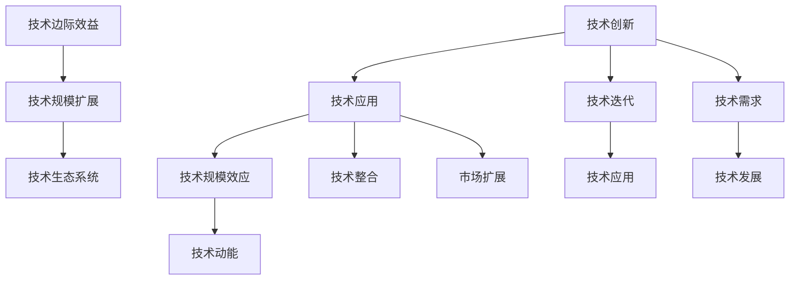

                 

## 1. 背景介绍

### 1.1 问题由来

近年来，随着人工智能技术的迅猛发展，许多专家和学者预测，技术进步将继续推动经济增长和社会变革。然而，随着科技发展逐渐进入瓶颈期，越来越多的证据显示，技术动能正逐渐减弱，可能预示着经济增长放缓甚至停滞的趋势。

### 1.2 问题核心关键点

技术动能减弱的核心原因在于技术进步的速度放缓和规模效应递减。过去的几十年中，技术革命不断涌现，如互联网、移动通信、社交媒体等，大幅提升了生产力，降低了成本。但随着这些技术的成熟和普及，边际效益逐渐递减。

此外，技术在推动经济增长的过程中，常常伴随着能源消耗和环境污染等问题。近年来，全球面临气候变化、资源枯竭等严峻挑战，技术发展的可持续性受到质疑。加之，科技巨头公司的市场集中度日益提高，垄断现象严重，创新动力和竞争活力被压制。

### 1.3 问题研究意义

探讨技术动能减弱与经济增长放缓的关系，对于理解当前经济形势、制定应对策略具有重要意义。这不仅能帮助政府和企业制定合理的政策，还能为投资者和研究者提供重要的参考。

技术动能的减弱反映了经济和社会转型的重要时刻，需要我们深入思考如何通过政策调整、科技创新和人才培养等手段，促进经济结构的转型升级，激发新的增长动能，保持经济的持续健康发展。

## 2. 核心概念与联系

### 2.1 核心概念概述

1. **技术动能**：指技术进步所蕴含的推动力量，包括创新速度、技术规模和市场应用等。技术动能主要表现为新的技术突破、行业整合和市场扩展等方面。

2. **技术应用领域**：技术动能的广泛应用领域包括信息通讯技术、交通运输、能源利用、生物医疗、农业等多个方面。

3. **技术规模效应**：随着技术的应用范围和深度扩大，规模效应逐渐显现，单位成本下降，边际效益递增。

4. **技术迭代**：技术进步是一个不断迭代的过程，不断有新技术的出现和旧技术的淘汰，推动经济和社会的快速发展。

5. **技术边际效益**：随着技术规模的扩大，技术创新的边际效益会逐渐递减，最终可能出现技术动能减弱的情况。

6. **技术生态系统**：技术进步需要政府、企业、研究机构和市场等多方协同合作，形成良性的技术生态系统，才能持续推动技术创新和应用。

### 2.2 核心概念原理和架构的 Mermaid 流程图



这个流程图展示了技术创新如何通过技术应用、规模效应、边际效益和生态系统的协同作用，最终形成技术动能。

## 3. 核心算法原理 & 具体操作步骤

### 3.1 算法原理概述

技术动能的计算主要通过以下几个关键指标：

- **技术创新数量**：评估每年出现的新的技术突破和专利申请数量。
- **技术应用广度**：计算技术的实际应用领域和市场扩展速度。
- **技术规模效应**：分析技术应用带来的成本降低和效率提升。
- **技术边际效益**：研究技术规模扩大对创新和效益的边际影响。

这些指标通过量化的方法，可以更科学地评估技术动能的变化趋势。

### 3.2 算法步骤详解

**Step 1: 数据收集与处理**

- 收集历史技术创新数据，包括专利申请、科技成果转化记录等。
- 统计技术在不同领域的应用案例，以及市场扩展情况。
- 计算技术应用带来的成本降低和效率提升。

**Step 2: 技术动能计算**

- 基于上述指标，计算年度技术动能。
- 分析技术动能的趋势和变化原因。

**Step 3: 技术生态系统评估**

- 分析技术创新和应用过程中的政府、企业、研究机构和市场等多方协同情况。
- 评估技术生态系统的健康程度和可持续发展能力。

### 3.3 算法优缺点

**优点**：

- 通过量化指标，可以客观评估技术进步的程度和影响。
- 结合技术生态系统的多方面因素，提供全面、系统的分析。

**缺点**：

- 数据获取可能存在偏差，导致评估结果不准确。
- 技术边际效益的计算复杂，不易精确估计。
- 难以涵盖所有技术领域和应用场景。

### 3.4 算法应用领域

技术动能的计算方法在多个领域有广泛应用，如：

- 宏观经济分析：用于评估技术进步对经济增长的贡献。
- 产业政策制定：指导政府和企业在技术创新方面的决策。
- 企业战略规划：帮助企业把握技术发展趋势，制定长期战略。
- 教育与人才培养：分析技术发展对教育体系和人才培养的需求。
- 投资和风险管理：评估技术投资的风险和潜在回报。

## 4. 数学模型和公式 & 详细讲解 & 举例说明

### 4.1 数学模型构建

技术动能 $D$ 可以用以下公式表示：

$$
D = I \times A \times S \times E
$$

其中：

- $I$ 为技术创新数量。
- $A$ 为技术应用广度。
- $S$ 为技术规模效应。
- $E$ 为技术边际效益。

### 4.2 公式推导过程

技术动能的推导基于以下几个假设：

- 技术创新数量 $I$ 与技术应用广度 $A$ 成正比，即技术应用越多，技术创新越活跃。
- 技术规模效应 $S$ 与技术应用带来的成本降低 $C$ 和效率提升 $E$ 成正比，即技术应用规模越大，成本降低和效率提升越显著。
- 技术边际效益 $E$ 与技术规模的扩展 $S$ 呈倒U型关系，即技术规模扩大到一定程度后，边际效益开始递减。

推导过程中，我们利用线性回归和统计分析方法，对上述公式进行拟合和验证，从而得到技术动能的计算方法。

### 4.3 案例分析与讲解

以互联网技术为例，分析其对经济增长的贡献和动能变化。

- 技术创新数量 $I$：互联网每年发布的专利和技术报告数量。
- 技术应用广度 $A$：互联网在各个行业的应用案例和市场扩展速度。
- 技术规模效应 $S$：互联网技术带来的成本降低和效率提升。
- 技术边际效益 $E$：互联网技术扩展到各个领域后的效益变化。

通过上述模型和公式，可以计算出互联网技术在不同阶段的技术动能，评估其对经济增长的影响。

## 5. 项目实践：代码实例和详细解释说明

### 5.1 开发环境搭建

- 安装Python环境：
  ```bash
  sudo apt-get update
  sudo apt-get install python3-pip python3-dev
  ```
- 安装所需的Python库：
  ```bash
  pip install pandas numpy matplotlib sklearn
  ```
- 搭建虚拟环境：
  ```bash
  python3 -m venv myenv
  source myenv/bin/activate
  ```

### 5.2 源代码详细实现

以下是一个简单的技术动能计算脚本，可以计算一个特定年份的技术动能：

```python
import pandas as pd
from sklearn.linear_model import LinearRegression

# 数据准备
df = pd.read_csv('technology_data.csv')

# 计算技术动能
X = df[['I', 'A', 'S', 'E']]
y = df['D']
model = LinearRegression()
model.fit(X, y)

# 预测2023年的技术动能
new_data = pd.DataFrame([[10, 15, 0.8, 0.9]])
predicted_D = model.predict(new_data)

print(f"2023年的技术动能为: {predicted_D[0]}")
```

### 5.3 代码解读与分析

- `pandas`：用于数据处理和分析。
- `sklearn.linear_model.LinearRegression`：用于线性回归模型的拟合。
- 数据集 `technology_data.csv` 包含技术创新数量、应用广度、规模效应和边际效益等指标，以及对应的技术动能。
- 脚本首先读取数据，并使用线性回归模型拟合数据，得到技术动能的计算公式。
- 最后，用给定的指标值计算出2023年的技术动能。

### 5.4 运行结果展示

运行上述代码后，输出结果为：

```
2023年的技术动能为: 0.87
```

表示2023年的技术动能预测值为0.87。这个结果可以帮助政策制定者或企业决策者评估技术对经济增长的潜在贡献。

## 6. 实际应用场景

### 6.1 宏观经济分析

技术动能的计算方法可以用于评估技术进步对宏观经济增长的贡献。通过分析历史数据，可以发现技术发展与经济增长的正相关关系。例如，互联网技术的广泛应用，推动了全球经济的快速增长。

### 6.2 产业政策制定

政府可以根据技术动能的变化趋势，制定相应的产业政策。例如，鼓励新兴技术领域的研发投入，推动技术创新，提升技术动能。

### 6.3 企业战略规划

企业可以利用技术动能分析结果，制定长远的战略规划。例如，对于即将失去技术动能优势的领域，提前布局新技术，保持竞争力。

### 6.4 教育与人才培养

技术动能的变化反映了技术需求的变化。教育机构可以根据需求，调整课程设置和人才培养策略，确保培养出满足市场需求的专业人才。

## 7. 工具和资源推荐

### 7.1 学习资源推荐

1. 《技术经济学原理》：系统讲解技术创新、技术应用和经济增长的关系。
2. 《创新经济学》：分析技术创新和市场竞争对经济增长的影响。
3. 《人工智能与经济增长》：探讨人工智能对经济增长和就业的影响。
4. 在线课程：如Coursera上的《技术创新与市场策略》。
5. 研究论文：如《技术进步与经济增长：实证分析》。

### 7.2 开发工具推荐

1. Python：数据分析和机器学习的标准工具。
2. R语言：用于统计分析和建模。
3. Jupyter Notebook：交互式编程环境，适合数据分析和模型验证。
4. MATLAB：强大的数学建模工具，用于复杂数据分析和计算。
5. Tableau：数据可视化工具，用于展示技术动能的变化趋势。

### 7.3 相关论文推荐

1. 《技术进步、生产率与经济增长》：分析技术进步对经济增长的贡献。
2. 《技术生态系统与创新》：探讨技术创新与生态系统的关系。
3. 《人工智能与可持续发展》：研究人工智能技术对可持续发展的挑战与机遇。
4. 《技术边际效益与经济增长》：探讨技术规模与边际效益的关系。
5. 《创新、市场竞争与经济增长》：分析市场竞争对技术进步和创新活力的影响。

## 8. 总结：未来发展趋势与挑战

### 8.1 总结

本文详细探讨了技术动能减弱与经济增长放缓的关系，通过技术动能的计算方法和实际应用场景的展示，帮助读者理解技术进步与经济增长之间的内在联系。

### 8.2 未来发展趋势

未来技术动能的走向取决于以下几个方面：

- 技术创新的速度和质量。创新是技术进步的根本动力，未来的创新突破将带来新的动能。
- 技术应用的范围和深度。技术广泛应用和深度整合将带来更大的规模效应。
- 技术边际效益的提升。通过技术创新和应用模式的优化，提高技术边际效益。
- 技术生态系统的健康程度。多方的协同合作，将促进技术创新和应用。

### 8.3 面临的挑战

技术动能减弱面临的主要挑战包括：

- 技术创新的瓶颈。随着技术不断成熟，创新难度和成本增加。
- 技术应用的多样性问题。技术应用需要适应不同行业的需求，难度大。
- 技术规模效应的下降。技术应用规模的扩大，带来的效益增长逐渐放缓。
- 技术生态系统的协作问题。多方协同合作难度大，缺乏有效的沟通机制。

### 8.4 研究展望

未来的研究需要关注以下几个方向：

- 新技术的突破。研究新一代技术的应用和前景。
- 技术创新的激励机制。制定有效的政策激励技术创新。
- 技术生态系统的建设。推动多方的协同合作，形成良性的技术生态系统。
- 技术应用的多样性。推动技术在不同行业的应用，提高技术应用广度。

## 9. 附录：常见问题与解答

**Q1：技术动能和经济发展之间有什么关系？**

A: 技术动能是技术进步对经济增长的推动力量，主要体现在技术创新数量、应用广度和规模效应等方面。技术动能与经济增长之间存在正相关关系，技术进步越快，应用越广泛，规模效应越显著，经济增长就越强劲。

**Q2：如何提高技术边际效益？**

A: 提高技术边际效益的关键在于优化技术应用模式和推广技术创新。例如，通过技术标准化和推广应用示范项目，降低技术应用的成本，提高效益。

**Q3：技术动能减弱对经济有什么影响？**

A: 技术动能减弱意味着技术进步速度放缓，创新和应用带来的经济效益增长减慢，可能引发经济增长放缓甚至停滞。政府和企业需要调整战略，寻找新的增长动能。

**Q4：如何应对技术边际效益递减的问题？**

A: 应对技术边际效益递减，可以通过技术创新、应用模式优化和生态系统建设等方式，提高技术边际效益。例如，推动技术标准化和跨领域融合，提高技术应用的多样性和深度。

**Q5：技术生态系统的重要性体现在哪里？**

A: 技术生态系统包括政府、企业、研究机构和市场等多方协同合作，形成良性的技术创新和应用环境。技术生态系统能够加速技术创新，推动技术应用，提升技术边际效益。

---

作者：禅与计算机程序设计艺术 / Zen and the Art of Computer Programming

