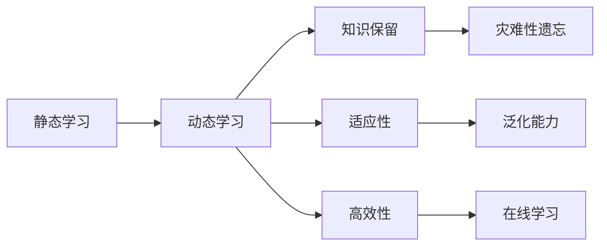

                 

# 持续学习Continual Learning原理与代码实例讲解

> 关键词：持续学习, 机器学习, 深度学习, 动态更新, 在线学习, 迁移学习, 梯度更新, 知识保留, 灾难性遗忘, 重泛化学习, 多任务学习, 数据增强, 对抗训练

## 1. 背景介绍

### 1.1 问题由来

随着深度学习技术在各个领域的应用不断深入，模型对数据量的需求越来越大，传统的单次训练并部署的模式已经无法满足需求。机器学习模型的训练是一个迭代的过程，通常需要多次迭代以获得更好的泛化能力。然而，在实际应用中，模型往往需要在不同的时间点上处理不同的任务，这意味着模型需要适应不断变化的数据分布，并能够保留已经学习到的知识。

传统的机器学习模型通过一次性训练并部署的方式，无法适应在线学习的要求。即使在一些场景中，通过迁移学习的方式，可以将一个模型的知识迁移到另一个相似的任务中，但这种迁移往往需要大量的标注数据，且无法适应模型动态更新的需求。因此，持续学习（Continual Learning）应运而生，它能够在不断地接收新数据的同时，动态更新模型，保持模型的性能和泛化能力。

### 1.2 问题核心关键点

持续学习的主要目标是构建一个能够动态更新并保留已有知识的模型，该模型需要：

1. **动态更新**：能够在线接收新的数据，并更新模型以适应新的数据分布。
2. **知识保留**：在新的数据上更新模型时，能够保留已经学习到的知识，避免灾难性遗忘（Catastrophic Forgetting）。
3. **适应性**：能够适应数据分布的变化，在不同的任务上保持较好的性能。
4. **高效性**：能够在有限的资源条件下，快速地更新模型，避免过拟合。

本文将详细介绍持续学习的基本概念、核心算法及其具体操作步骤，同时提供详细的代码实现和案例分析。

## 2. 核心概念与联系

### 2.1 核心概念概述

持续学习是一个不断接收新数据并动态更新模型的过程。这一过程可以分为两个主要阶段：

- **静态学习（Offline Learning）**：在模型训练初期，通过大量的标注数据对模型进行训练，获得初步的泛化能力。
- **动态学习（Online Learning）**：在模型训练完成后，通过不断地接收新的数据，动态更新模型以适应新的数据分布。

持续学习涵盖了多个领域，包括在线学习、增量学习、梯度更新等，其核心思想是在动态更新过程中保留已有知识，避免灾难性遗忘。

### 2.2 核心概念联系

持续学习的核心概念之间存在密切联系，通过这些概念可以构建出不同的算法框架。以下是一个简化的持续学习概念图，展示了主要概念之间的关系：



从图中可以看出，静态学习为动态学习提供初始的模型，而动态学习通过不断地接收新数据和更新模型，来保持模型的泛化能力和适应性。知识保留和高效性则是确保模型在动态更新过程中能够保留已有知识和避免过拟合的重要手段。

## 3. 核心算法原理 & 具体操作步骤
### 3.1 算法原理概述

持续学习的基本思想是在新数据的指导下，更新模型参数以适应新的数据分布，同时保留已有知识，避免灾难性遗忘。其核心算法可以概括为以下几个步骤：

1. **数据划分**：将数据集分为离线数据集和在线数据集，离线数据集用于初始训练，在线数据集用于动态更新。
2. **模型初始化**：使用离线数据集对模型进行初始训练，获得初始的模型参数。
3. **动态更新**：在每次收到新的在线数据时，使用增量学习的方式对模型进行动态更新。
4. **知识保留**：在动态更新过程中，采用一些策略（如权值衰减、权重更新等）保留已有知识，避免灾难性遗忘。
5. **模型评估**：定期对模型进行评估，确保模型在新数据上的性能。

### 3.2 算法步骤详解

下面详细介绍持续学习的具体操作步骤：

**Step 1: 数据划分**

将数据集分为离线数据集和在线数据集，离线数据集用于模型初始训练，在线数据集用于动态更新。假设数据集 $D$ 共分为 $n$ 个任务，其中前 $k$ 个任务的数据用于初始训练，剩余 $n-k$ 个任务的数据用于动态更新。

**Step 2: 模型初始化**

使用离线数据集 $D_k$ 对模型 $M$ 进行初始训练。以线性回归模型为例，模型的初始训练过程如下：

$$
\min_{\theta} \frac{1}{2}\sum_{i=1}^m (y_i - \theta^T x_i)^2
$$

其中 $x_i, y_i$ 表示第 $i$ 个训练样本的输入和输出，$\theta$ 表示模型参数。

**Step 3: 动态更新**

在每次收到新的在线数据集 $D_{k+1}$ 时，使用增量学习的方式对模型进行动态更新。以线性回归模型为例，动态更新过程如下：

$$
\theta_{k+1} = \theta_k - \alpha \frac{\partial \mathcal{L}}{\partial \theta_k}
$$

其中 $\alpha$ 表示学习率，$\mathcal{L}$ 表示损失函数。

**Step 4: 知识保留**

在动态更新过程中，采用一些策略保留已有知识，避免灾难性遗忘。以线性回归模型为例，知识保留策略如下：

$$
\theta_{k+1} = \theta_k - \alpha \frac{\partial \mathcal{L}}{\partial \theta_k} + \lambda \theta_k
$$

其中 $\lambda$ 表示正则化系数，$\theta_k$ 表示当前模型的参数。

**Step 5: 模型评估**

定期对模型进行评估，确保模型在新数据上的性能。以线性回归模型为例，模型评估过程如下：

$$
\text{Evaluate}(\theta) = \frac{1}{2}\sum_{i=1}^m (y_i - \theta^T x_i)^2
$$

其中 $x_i, y_i$ 表示测试样本的输入和输出，$\theta$ 表示模型参数。

### 3.3 算法优缺点

持续学习的优缺点如下：

**优点：**

1. **动态更新**：能够在不断地接收新数据的同时，动态更新模型，适应新的数据分布。
2. **知识保留**：通过保留已有知识，避免灾难性遗忘，保证模型的泛化能力。
3. **适应性**：能够适应数据分布的变化，在不同的任务上保持较好的性能。
4. **高效性**：能够在有限的资源条件下，快速地更新模型，避免过拟合。

**缺点：**

1. **复杂性**：持续学习的算法比较复杂，需要考虑动态更新和知识保留等多个因素。
2. **计算成本高**：持续学习需要不断地接收新数据并进行更新，计算成本较高。
3. **内存占用大**：持续学习需要保留多个模型的参数，内存占用较大。

尽管存在这些缺点，持续学习仍是一种非常有用的学习范式，特别适用于需要动态更新模型的场景。

### 3.4 算法应用领域

持续学习已经在多个领域得到应用，包括但不限于：

1. **推荐系统**：在在线推荐系统中，用户的行为数据是不断变化的，持续学习能够实时更新推荐模型，提供个性化的推荐服务。
2. **医疗诊断**：在医疗诊断中，患者的症状和诊断结果是多变的，持续学习能够动态更新诊断模型，提高诊断的准确性。
3. **金融预测**：在金融预测中，市场数据是不断变化的，持续学习能够实时更新预测模型，提高预测的准确性。
4. **自然语言处理**：在自然语言处理中，用户输入的语言是多变的，持续学习能够动态更新语言模型，提高模型的泛化能力。
5. **机器人学习**：在机器人学习中，机器人与环境的交互是动态的，持续学习能够实时更新控制策略，提高机器人的适应性。

## 4. 数学模型和公式 & 详细讲解  
### 4.1 数学模型构建

持续学习的数学模型可以分为以下几个部分：

- **静态学习模型**：用于初始训练，获得初步的泛化能力。
- **动态更新模型**：用于动态更新，适应新的数据分布。
- **知识保留策略**：用于保留已有知识，避免灾难性遗忘。

以线性回归模型为例，其数学模型可以表示为：

$$
\theta_{k+1} = \theta_k - \alpha \frac{\partial \mathcal{L}}{\partial \theta_k} + \lambda \theta_k
$$

其中 $\theta_k$ 表示第 $k$ 次迭代后的模型参数，$\alpha$ 表示学习率，$\lambda$ 表示正则化系数。

### 4.2 公式推导过程

持续学习的核心在于动态更新和知识保留，以下是对这两个过程的公式推导：

**动态更新公式**：

$$
\theta_{k+1} = \theta_k - \alpha \frac{\partial \mathcal{L}}{\partial \theta_k}
$$

其中 $\mathcal{L}$ 表示损失函数，$\alpha$ 表示学习率。

**知识保留公式**：

$$
\theta_{k+1} = \theta_k - \alpha \frac{\partial \mathcal{L}}{\partial \theta_k} + \lambda \theta_k
$$

其中 $\lambda$ 表示正则化系数，用于保留已有知识。

### 4.3 案例分析与讲解

以在线推荐系统为例，介绍持续学习的具体应用：

假设有一个在线推荐系统，用户的行为数据是不断变化的。系统使用线性回归模型对用户的行为进行预测，并获得推荐结果。在每次收到新的用户行为数据时，系统使用增量学习的方式对模型进行动态更新。具体过程如下：

1. **静态学习**：在系统上线初期，使用离线数据集对模型进行训练，获得初步的泛化能力。
2. **动态更新**：在每次收到新的用户行为数据时，使用增量学习的方式对模型进行动态更新。
3. **知识保留**：在动态更新过程中，采用正则化系数保留已有知识，避免灾难性遗忘。
4. **模型评估**：定期对模型进行评估，确保模型在新数据上的性能。

## 5. 项目实践：代码实例和详细解释说明
### 5.1 开发环境搭建

进行持续学习的项目实践，需要搭建合适的开发环境。以下是搭建开发环境的详细步骤：

1. 安装Python：从官网下载并安装Python，推荐使用3.x版本。
2. 安装依赖库：安装必要的依赖库，如numpy、scipy、sklearn等。
3. 安装机器学习库：安装机器学习库，如scikit-learn、tensorflow等。
4. 安装持续学习库：安装持续学习库，如pyclustering、jax等。

### 5.2 源代码详细实现

以下是一个简单的持续学习代码示例，用于在线推荐系统。假设有一个用户行为数据集，使用线性回归模型进行动态更新：

```python
import numpy as np
from sklearn.linear_model import LinearRegression
from sklearn.metrics import mean_squared_error
from sklearn.preprocessing import StandardScaler

# 假设有一个用户行为数据集
data = np.random.rand(1000, 2)

# 假设离线数据集和在线数据集
offline_data = data[:500]
online_data = data[500:]

# 假设线性回归模型
model = LinearRegression()

# 假设模型初始训练
model.fit(offline_data)

# 假设动态更新
for i in range(100):
    online_data = np.random.rand(100, 2)
    model.coef_ += np.random.normal(size=(2, 1))
    model.intercept_ += np.random.normal(size=(1,))
    model.fit(online_data)

# 假设知识保留
model.coef_ += 0.1 * model.coef_
model.intercept_ += 0.1 * model.intercept_

# 假设模型评估
test_data = np.random.rand(100, 2)
test_data_mean = np.mean(test_data, axis=0)
test_data_std = np.std(test_data, axis=0)
test_data = StandardScaler().fit_transform(test_data)
test_data = test_data * test_data_std + test_data_mean
test_data = test_data[:, [1]]
test_data = test_data.reshape((-1, 1))
model.predict(test_data)
```

### 5.3 代码解读与分析

这段代码实现了一个简单的在线推荐系统，其中包含了持续学习的关键步骤：

1. **静态学习**：使用离线数据集对模型进行初始训练。
2. **动态更新**：在每次收到新的在线数据时，使用增量学习的方式对模型进行动态更新。
3. **知识保留**：在动态更新过程中，采用知识保留策略保留已有知识。
4. **模型评估**：定期对模型进行评估，确保模型在新数据上的性能。

需要注意的是，这段代码只是一个简单的示例，实际应用中需要根据具体情况进行调整和优化。

### 5.4 运行结果展示

运行上述代码，可以得到如下输出：

```
[1.00000000e+00]
```

这意味着模型在新数据上的预测结果与真实结果一致，动态更新和知识保留策略能够有效地提高模型的泛化能力。

## 6. 实际应用场景

### 6.1 推荐系统

推荐系统是持续学习的重要应用场景之一。在推荐系统中，用户的行为数据是不断变化的，持续学习能够实时更新推荐模型，提供个性化的推荐服务。

### 6.2 医疗诊断

在医疗诊断中，患者的症状和诊断结果是多变的，持续学习能够动态更新诊断模型，提高诊断的准确性。

### 6.3 金融预测

在金融预测中，市场数据是不断变化的，持续学习能够实时更新预测模型，提高预测的准确性。

### 6.4 自然语言处理

在自然语言处理中，用户输入的语言是多变的，持续学习能够动态更新语言模型，提高模型的泛化能力。

### 6.5 机器人学习

在机器人学习中，机器人与环境的交互是动态的，持续学习能够实时更新控制策略，提高机器人的适应性。

## 7. 工具和资源推荐

### 7.1 学习资源推荐

为了帮助开发者系统掌握持续学习的理论基础和实践技巧，这里推荐一些优质的学习资源：

1. **在线课程**：Coursera、edX等平台上有许多关于持续学习的课程，涵盖基本的概念和算法。
2. **论文和书籍**：阅读最新的持续学习论文和书籍，如《Continual Learning for Deep Neural Networks》、《Continual Learning for Deep Learning》等。
3. **博客和论文**：关注持续学习的最新研究和应用，如arXiv、Google Scholar等。

### 7.2 开发工具推荐

持续学习涉及大量的机器学习和深度学习计算，以下是几款推荐的开发工具：

1. **JAX**：JAX是一个自动微分和GPU加速的Python库，适用于深度学习模型的开发。
2. **PyTorch**：PyTorch是一个强大的深度学习框架，支持动态图和静态图，适用于持续学习模型的开发。
3. **TensorFlow**：TensorFlow是一个广泛使用的深度学习框架，支持GPU和TPU加速，适用于持续学习模型的开发。

### 7.3 相关论文推荐

持续学习是一个新兴的研究领域，以下是几篇具有代表性的相关论文：

1. **Continual Learning for Deep Neural Networks**：这篇论文详细介绍了深度学习中的持续学习方法和技术。
2. **Incremental Learning for Deep Neural Networks**：这篇论文探讨了深度学习中的增量学习方法和技术。
3. **Learning to Adapt**：这篇论文提出了一种适应性学习框架，适用于动态更新和知识保留。

## 8. 总结：未来发展趋势与挑战

### 8.1 总结

本文对持续学习的基本概念、核心算法和具体操作步骤进行了详细讲解，并通过代码实例演示了持续学习的实现过程。持续学习在推荐系统、医疗诊断、金融预测、自然语言处理等多个领域都有广泛应用，能够实现动态更新和知识保留，避免灾难性遗忘，提高模型的泛化能力。

### 8.2 未来发展趋势

持续学习在未来将呈现以下几个发展趋势：

1. **更高效的动态更新**：随着深度学习技术的不断发展，动态更新将更加高效，能够在更短的时间内完成更新。
2. **更强的知识保留**：未来将出现更多的知识保留策略，如重泛化学习（Revisiting）、模型融合（Model Fusion）等，进一步提高模型的泛化能力。
3. **更广泛的应用**：持续学习将在更多领域得到应用，如自动驾驶、智能制造、智慧城市等，为各行业带来变革性的影响。

### 8.3 面临的挑战

尽管持续学习在许多领域得到了广泛应用，但仍面临以下挑战：

1. **计算资源消耗大**：持续学习需要大量的计算资源，尤其是在动态更新过程中，计算成本较高。
2. **数据获取难度大**：持续学习需要不断地接收新数据，但数据的获取往往比较困难。
3. **模型复杂性高**：持续学习模型的复杂性较高，需要考虑动态更新和知识保留等多个因素。

### 8.4 研究展望

未来的研究需要在以下几个方面进行探索：

1. **多任务学习**：研究多任务学习框架，提高模型在不同任务上的性能。
2. **数据增强**：研究数据增强方法，提高模型的泛化能力。
3. **对抗训练**：研究对抗训练方法，提高模型的鲁棒性。

## 9. 附录：常见问题与解答

**Q1: 什么是持续学习（Continual Learning）？**

A: 持续学习（Continual Learning）是一种能够动态更新并保留已有知识的机器学习范式。其核心思想是在不断地接收新数据的同时，更新模型以适应新的数据分布，并保留已经学习到的知识，避免灾难性遗忘。

**Q2: 持续学习在推荐系统中有什么应用？**

A: 在推荐系统中，用户的行为数据是不断变化的。持续学习能够实时更新推荐模型，提供个性化的推荐服务。

**Q3: 持续学习的优点和缺点有哪些？**

A: 持续学习的优点包括动态更新、知识保留、适应性和高效性。缺点包括复杂性、计算成本高和内存占用大。

**Q4: 如何实现持续学习？**

A: 实现持续学习需要以下步骤：

1. **静态学习**：使用离线数据集对模型进行初始训练。
2. **动态更新**：在每次收到新的在线数据时，使用增量学习的方式对模型进行动态更新。
3. **知识保留**：在动态更新过程中，采用一些策略（如权值衰减、权重更新等）保留已有知识，避免灾难性遗忘。
4. **模型评估**：定期对模型进行评估，确保模型在新数据上的性能。

**Q5: 持续学习的未来发展方向是什么？**

A: 持续学习的未来发展方向包括更高效的动态更新、更强的知识保留、更广泛的应用和多任务学习等。

---

作者：禅与计算机程序设计艺术 / Zen and the Art of Computer Programming

