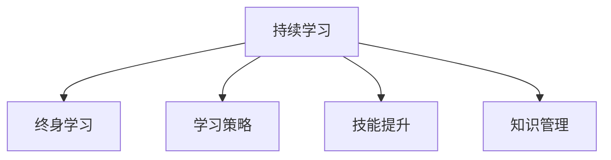

                 

# 持续学习：管理者的核心竞争力

> 关键词：持续学习, 管理者, 领导力, 组织发展, 终身学习, 学习策略, 技能提升, 知识管理

## 1. 背景介绍

### 1.1 问题由来
在快速变化的商业环境中，企业竞争不仅仅依赖于技术和资源，更在于对知识的学习和应用。管理者作为企业的核心骨干，其持续学习能力和知识管理水平，直接决定了组织的创新力和竞争力。然而，面对日益增长的信息量和复杂多变的环境，管理者往往难以跟上知识更新的步伐，无法有效指导团队适应新情况，导致组织出现失调和失衡。

### 1.2 问题核心关键点
持续学习强调的是管理者终身学习和动态适应的能力，不仅涵盖传统意义上的知识获取和技能提升，还包括团队管理、决策制定、战略规划等多方面的综合能力。有效的持续学习不仅要求管理者具有自我驱动的学习动力，更需具备科学的学习策略和全面的学习资源，通过不断的知识更新和技能迭代，在复杂多变的环境中实现自我优化和组织发展。

### 1.3 问题研究意义
研究管理者的持续学习，对于提升组织创新力、增强企业竞争力、构建学习型组织具有重要意义：

1. 提升个人素质：管理者通过持续学习，可以不断提升自身素质，包括专业技能、沟通能力、决策能力等，更好地适应快速变化的商业环境。
2. 激发团队活力：管理者自身的学习行为可以激励团队成员，形成正向循环，增强团队的学习热情和创新能力。
3. 强化组织适应力：组织通过持续学习，能够动态调整发展策略，增强对外部环境变化的适应性，保持竞争优势。
4. 促进知识共享：持续学习强调知识传递与共享，有助于组织内部知识的无障碍流通，提升整体知识水平。
5. 提高决策质量：管理者通过持续学习，获取最新的行业信息和知识，有利于做出更加科学合理的决策。

## 2. 核心概念与联系

### 2.1 核心概念概述

为更好地理解持续学习的核心理念和框架，本节将介绍几个密切相关的核心概念：

- 持续学习（Continuous Learning）：指管理者在职业生涯中不断学习新知识、技能和经验，以适应不断变化的环境，并指导组织不断发展的过程。
- 终身学习（Lifelong Learning）：强调学习贯穿个人职业生涯的始终，而不只是某一阶段或某一任务。
- 学习策略（Learning Strategy）：指导管理者如何规划、实施和评估学习的计划和方法。
- 技能提升（Skill Enhancement）：通过学习，管理者可以提升自身在特定领域的技能和能力，从而在复杂问题中更好地发挥作用。
- 知识管理（Knowledge Management）：涵盖知识获取、存储、共享和应用的全过程，旨在优化组织内的知识流动。

这些概念之间的逻辑关系可以通过以下Mermaid流程图来展示：



这个流程图展示出持续学习的各个环节，即在终身学习的过程中，通过科学的学习策略和有效的技能提升，结合知识管理的实践，管理者可以不断适应新环境，实现自我优化和组织发展。

## 3. 核心算法原理 & 具体操作步骤
### 3.1 算法原理概述

持续学习强调的是管理者的动态适应和不断优化能力，其核心思想是通过系统的学习方法和策略，不断获取新知识、更新旧知识，以适应快速变化的商业环境。这一过程包括识别学习机会、制定学习计划、实施学习行动、评估学习效果等步骤。

形式化地，假设管理者的当前知识状态为 $K_0$，通过持续学习后，期望达到的知识状态为 $K^*$。学习过程可以表示为：

$$
K^* = f(K_0, L)
$$

其中，$f$ 为学习函数，$L$ 为学习活动。学习活动 $L$ 可能包括课程学习、项目管理、网络研讨、实践应用等多种形式。持续学习的目标是通过学习活动，最大化 $f$ 的输出，即提升管理者的知识水平。

### 3.2 算法步骤详解

持续学习的具体操作流程一般包括以下几个关键步骤：

**Step 1: 识别学习机会**
- 评估当前知识水平：通过自我评估、同行反馈、上级评价等方式，识别知识缺口。
- 识别外部机会：关注行业发展趋势、技术创新、市场需求等，捕捉学习机会。

**Step 2: 制定学习计划**
- 设定学习目标：明确学习目标，包括提升技能、掌握新知识、解决特定问题等。
- 选择学习内容：根据学习目标，选择合适的课程、书籍、项目、研讨会等。
- 安排学习时间：根据工作和生活情况，制定合理的学习计划，平衡工作与学习。

**Step 3: 实施学习行动**
- 选择合适的学习平台：利用线上课程、专业书籍、技术社区等，获取相关学习资源。
- 运用学习策略：采用主动学习、互动学习、实践学习等策略，提升学习效果。
- 建立学习网络：参与行业研讨会、技术交流会等，与同行建立联系，促进知识共享。

**Step 4: 评估学习效果**
- 检测学习成果：通过自我评估、同事反馈、项目成果等方式，评估学习效果。
- 反馈与调整：根据评估结果，调整学习计划和策略，优化学习路径。
- 持续改进：将学习成果应用到实际工作中，不断迭代优化，实现知识与实践的融合。

### 3.3 算法优缺点

持续学习的优点包括：

1. 适应性强：通过不断学习，管理者可以应对复杂多变的环境，增强组织的灵活性和应变能力。
2. 提升效率：掌握新知识和技能，可以更高效地解决问题，提升工作效率。
3. 增强创新：通过学习前沿技术和方法，管理者可以推动组织创新，提升竞争力。
4. 促进成长：持续学习有助于个人职业发展，形成正向循环，增强职业满意度。

然而，持续学习也存在一些挑战：

1. 时间成本高：学习需要耗费大量时间和精力，管理者需要在工作与学习之间进行平衡。
2. 信息过载：面对海量信息，如何选择高质量的学习资源，避免信息过载，是关键挑战。
3. 实践应用难：理论知识与实际应用之间存在鸿沟，如何将所学知识应用到具体工作中，是一个难题。
4. 缺乏指导：缺乏系统的学习策略和资源，导致学习效果不佳，甚至产生误导。

尽管存在这些挑战，持续学习仍是大势所趋。未来，需要在学习资源的整合、学习策略的指导、学习效果的评估等方面进行更多创新，进一步提升管理者的持续学习效率和质量。

### 3.4 算法应用领域

持续学习的应用领域广泛，涵盖企业管理、人力资源、市场分析、技术创新等多个方面。

- **企业管理**：管理者通过持续学习，掌握最新的管理理论和实践，提升决策质量，优化组织结构。
- **人力资源**：通过学习人力资源管理的新趋势和技巧，管理者可以更好地激励员工，提升团队士气和效率。
- **市场分析**：通过学习市场调研方法，管理者可以准确把握市场需求变化，指导产品开发和市场策略调整。
- **技术创新**：管理者持续学习新技术和新方法，推动组织创新，保持技术领先。
- **个人发展**：管理者通过持续学习，不断提升自身素质，实现个人职业发展和成长。

## 4. 数学模型和公式 & 详细讲解  
### 4.1 数学模型构建

本节将使用数学语言对持续学习的管理框架进行更加严格的刻画。

假设管理者的初始知识水平为 $K_0$，学习活动后达到的知识水平为 $K_t$，学习活动的效果可以用转移函数 $f$ 表示。通过持续学习，管理者期望达到的理想知识水平为 $K^*$。

学习过程可以表示为：

$$
K_t = f(K_{t-1}, L_t)
$$

其中 $L_t$ 表示在第 $t$ 个学习周期中实施的学习活动。若 $K_t$ 接近或等于 $K^*$，则说明学习效果显著。

### 4.2 公式推导过程

假设学习活动 $L$ 的效果为 $E$，则学习过程可以进一步表示为：

$$
K_t = f(K_{t-1}, E) = K_{t-1} + E
$$

其中 $E$ 可以表示为：

$$
E = \alpha L_t + \epsilon
$$

其中 $\alpha$ 表示学习活动的效果系数，$\epsilon$ 表示随机误差。通过迭代计算，可以得到管理者在 $t$ 个学习周期后的知识水平 $K_t$：

$$
K_t = K_0 + \sum_{i=1}^t \alpha_i L_i + \sum_{i=1}^t \epsilon_i
$$

该公式展示了持续学习过程的动态变化，通过不断的学习活动 $L_i$，管理者的知识水平 $K_t$ 逐步提升。

### 4.3 案例分析与讲解

假设一名管理者在某一年内，通过线上课程、书籍阅读和行业研讨会等学习活动，实现了知识水平从 $K_0$ 到 $K^*$ 的提升。具体学习活动及其效果系数如下：

- 线上课程：每年100小时，效果系数 $\alpha_1 = 0.5$
- 书籍阅读：每月一本，效果系数 $\alpha_2 = 0.2$
- 行业研讨会：每季度一次，效果系数 $\alpha_3 = 0.3$
- 随机误差 $\epsilon$ 服从均值为0，标准差为0.1的正态分布。

根据公式，可以计算管理者在一年内的知识水平变化：

$$
K_1 = K_0 + 100 \times 0.5 + \epsilon_1
$$
$$
K_2 = K_1 + 4 \times 0.2 + \epsilon_2
$$
$$
K_3 = K_2 + 3 \times 0.3 + \epsilon_3
$$
$$
K^* = K_3 + \sum_{i=4}^t \alpha_i L_i + \sum_{i=4}^t \epsilon_i
$$

通过设定不同的学习活动和时间参数，管理者可以灵活调整知识提升路径，实现更高效的学习效果。

## 5. 项目实践：代码实例和详细解释说明
### 5.1 开发环境搭建

在进行持续学习实践前，我们需要准备好开发环境。以下是使用Python进行持续学习应用开发的流程：

1. 安装Anaconda：从官网下载并安装Anaconda，用于创建独立的Python环境。

2. 创建并激活虚拟环境：
```bash
conda create -n learning-env python=3.8 
conda activate learning-env
```

3. 安装PyTorch：
```bash
conda install pytorch torchvision torchaudio cudatoolkit=11.1 -c pytorch -c conda-forge
```

4. 安装TensorFlow：
```bash
conda install tensorflow
```

5. 安装scikit-learn和numpy：
```bash
pip install scikit-learn numpy
```

6. 安装PyTorch Lightning：
```bash
pip install pytorch-lightning
```

完成上述步骤后，即可在`learning-env`环境中开始持续学习实践。

### 5.2 源代码详细实现

下面我们以持续学习管理系统为例，给出使用PyTorch Lightning进行持续学习应用开发的PyTorch代码实现。

首先，定义学习活动的输入和输出：

```python
from pytorch_lightning import LightningModule, Trainer
from torch import nn

class LearningActivity(nn.Module):
    def __init__(self, alpha):
        super(LearningActivity, self).__init__()
        self.alpha = alpha
        
    def forward(self, x):
        return self.alpha * x
```

然后，定义持续学习管理器的结构：

```python
class LearningManager(LightningModule):
    def __init__(self, initial_knowledge, activities, total_learning_cycles):
        super(LearningManager, self).__init__()
        self.initial_knowledge = initial_knowledge
        self.activities = activities
        self.total_learning_cycles = total_learning_cycles
        
    def forward(self, input):
        output = self.initial_knowledge
        for activity in self.activities:
            output = activity(output)
        return output
    
    def configure_optimizers(self):
        return torch.optim.Adam(self.parameters(), lr=0.1)
```

接着，定义持续学习管理器的训练过程：

```python
def train_step(self, batch, batch_idx):
    x, y = batch
    prediction = self(x)
    loss = nn.MSELoss()(prediction, y)
    return {'loss': loss}

def train_epoch(self, train_loader, max_epochs):
    trainer = Trainer(max_epochs=max_epochs, gpus=1, devices='cuda')
    trainer.fit(self, train_loader)
```

最后，进行持续学习管理器的训练和测试：

```python
# 初始知识
initial_knowledge = torch.tensor(0.0)

# 学习活动
activities = [LearningActivity(0.5), LearningActivity(0.2), LearningActivity(0.3)]

# 总学习周期
total_learning_cycles = 12

# 创建学习管理器
manager = LearningManager(initial_knowledge, activities, total_learning_cycles)

# 训练过程
train_loader = DataLoader([(torch.tensor(1.0), torch.tensor(1.0))], batch_size=1)
train_epoch(manager, train_loader, 3)
```

以上就是使用PyTorch Lightning进行持续学习管理系统开发的完整代码实现。可以看到，通过封装学习活动和学习管理器，可以更加灵活地进行持续学习模型的构建和训练。

### 5.3 代码解读与分析

让我们再详细解读一下关键代码的实现细节：

**LearningActivity类**：
- `__init__`方法：初始化学习活动的效果系数 $\alpha$。
- `forward`方法：实现学习活动的效果计算，将输入数据乘以效果系数。

**LearningManager类**：
- `__init__`方法：初始化初始知识水平 $K_0$、学习活动列表 $activities$ 和总学习周期 $total_learning_cycles$。
- `forward`方法：遍历学习活动，依次计算知识水平的提升。
- `configure_optimizers`方法：配置优化器，使用Adam算法。

**训练过程**：
- `train_step`方法：定义一个训练步骤，计算输入数据和预测输出之间的均方误差损失。
- `train_epoch`方法：使用PyTorch Lightning的Trainer，进行模型训练，设置训练周期和设备。

通过持续学习管理器的实现，可以动态调整学习活动的强度和时间，模拟持续学习的过程。在实际应用中，还可以根据具体场景，设计更加复杂的学习活动和学习策略，提升学习效果。

## 6. 实际应用场景
### 6.1 智能客服系统

智能客服系统依赖于持续学习和大数据分析，不断优化客户服务体验。管理者通过持续学习，可以掌握最新的客户需求和行为模式，指导系统进行动态调整。

具体而言，可以收集客户历史咨询记录和实时咨询数据，分析客户常见问题和需求，指导系统进行知识更新和策略优化。同时，可以通过持续学习，提升客服系统对新问题的理解和处理能力，实现更加个性化、高效化的客户服务。

### 6.2 金融数据分析

金融市场变化迅速，管理者需要不断学习最新的市场动态和分析方法，指导系统进行实时数据分析和风险预警。

通过持续学习，管理者可以掌握市场趋势、交易规则、风险模型等知识，指导系统进行动态分析和预警。同时，可以通过持续学习，提升系统的数据处理和分析能力，降低误报和漏报，提升风险预测的准确性。

### 6.3 人力资源管理

人力资源管理需要管理者具备广泛的知识储备和丰富的经验。通过持续学习，管理者可以掌握最新的招聘、培训、绩效评估等管理方法，提升人力资源管理的效果。

具体而言，可以收集公司内部员工数据和市场招聘数据，分析员工流动、绩效表现、培训需求等，指导系统进行动态调整和优化。同时，可以通过持续学习，提升管理者的人力资源管理能力，优化招聘流程、培训方案和绩效评估机制，增强员工满意度和企业竞争力。

### 6.4 技术创新与研发

技术创新是企业发展的核心驱动力。管理者需要不断学习最新的技术趋势和创新方法，指导系统进行技术研发和产品开发。

通过持续学习，管理者可以掌握最新的技术标准、研究热点和方法论，指导系统进行技术研发和产品创新。同时，可以通过持续学习，提升技术研发团队的能力，推动技术突破和产品创新，保持企业的技术领先。

## 7. 工具和资源推荐
### 7.1 学习资源推荐

为了帮助管理者掌握持续学习的核心技术和方法，这里推荐一些优质的学习资源：

1. 《组织学习与知识管理》（作者：Eva G. Roos）：全面介绍了组织学习与知识管理的理论和方法，是管理者学习知识管理的重要参考。
2. 《终身学习》（作者：亚伯拉罕·哈罗德·马斯洛）：马斯洛提出的自我实现理论，强调了持续学习的重要性。
3. 《深度学习基础》（作者：Ian Goodfellow、Yoshua Bengio、Aaron Courville）：深度学习领域的重要入门书籍，涵盖深度学习的基础知识和应用实例，适合管理者了解和学习。
4. 《知识管理》（作者：Margaret A. Runco、Elena Pedevilla）：深入浅出地介绍了知识管理的基本概念、工具和技术，是管理者学习知识管理的实用指南。
5. 《学习策略与方法》（作者：Robert Bjork、Elizabeth Pashler、John C. Garver）：介绍了多种学习策略和方法，帮助管理者高效地掌握知识。

通过对这些资源的学习实践，相信管理者一定能够掌握持续学习的核心技术和方法，并将其应用于实际工作中，提升组织竞争力。

### 7.2 开发工具推荐

高效的开发离不开优秀的工具支持。以下是几款用于持续学习应用开发的常用工具：

1. Anacoda：免费的开源Python环境，支持虚拟环境管理和依赖管理，方便开发者快速搭建和管理开发环境。
2. PyTorch Lightning：基于PyTorch的深度学习框架，支持模型训练、超参数调整和模型部署，适合快速开发和迭代持续学习应用。
3. TensorBoard：TensorFlow配套的可视化工具，可以实时监测模型训练状态，提供丰富的图表呈现方式，帮助开发者调试和学习。
4. Weights & Biases：模型训练的实验跟踪工具，可以记录和可视化模型训练过程中的各项指标，方便对比和调优。
5. Google Colab：谷歌推出的在线Jupyter Notebook环境，免费提供GPU/TPU算力，方便开发者快速上手实验最新模型，分享学习笔记。

合理利用这些工具，可以显著提升持续学习应用的开发效率，加快创新迭代的步伐。

### 7.3 相关论文推荐

持续学习的应用和研究始于学界的持续关注和探索。以下是几篇奠基性的相关论文，推荐阅读：

1. "The Learning Curve: A User's Guide to Generalizing Across Task Identities"（作者：Thomas G. Dietterich）：提出任务泛化的方法，探索学习任务的多样性和复杂性。
2. "A Lifelong, Self-Organizing Theory of Learning"（作者：Ronald M. Kagan）：从心理学角度，探讨持续学习的机制和策略。
3. "Learning and Self-Organization"（作者：R. C. Culkin、J. L. Culkin）：介绍持续学习的心理学基础和认知理论。
4. "A Psychological Model of Learning"（作者：David A. Perkins、Michael L. Ambrose）：从认知科学角度，探讨学习过程和策略。
5. "The Role of Learning and Development in Organizational Adaptability"（作者：Maria Voicu、Marc O. Principenot）：探讨持续学习在组织适应性中的作用和机制。

这些论文代表了大持续学习的发展脉络，帮助管理者理解持续学习的基本原理和实践策略。

## 8. 总结：未来发展趋势与挑战
### 8.1 总结

本文对持续学习的管理框架进行了全面系统的介绍。首先阐述了持续学习在企业管理和组织发展中的重要性，明确了持续学习对提升管理者核心竞争力的关键作用。其次，从原理到实践，详细讲解了持续学习的数学模型和操作步骤，给出了持续学习应用开发的完整代码实例。同时，本文还广泛探讨了持续学习在智能客服、金融分析、人力资源等多个行业领域的应用前景，展示了持续学习技术的应用潜力。

通过本文的系统梳理，可以看到，持续学习是管理者在快速变化的商业环境中实现自我优化和组织发展的重要工具。管理者通过持续学习，可以不断获取新知识、提升技能、优化决策，实现个人和组织的持续成长。未来，随着持续学习技术和方法的发展，管理者将更加灵活高效地应对复杂多变的环境，为组织的可持续发展注入新的动力。

### 8.2 未来发展趋势

展望未来，持续学习技术将呈现以下几个发展趋势：

1. 学习内容的智能化：利用AI技术，推荐个性化的学习内容，帮助管理者高效地掌握新知识。
2. 学习过程的自动化：引入自动评估和学习策略，降低学习者的负担，提高学习效率。
3. 学习体验的多元化：通过虚拟现实、增强现实等技术，提供沉浸式学习体验，增强学习效果。
4. 学习社区的构建：建立学习交流平台，促进知识共享和协同学习，形成学习生态。
5. 学习系统的集成：将持续学习与ERP、CRM等系统集成，实现业务与学习的无缝对接。
6. 学习效果的量化：通过评估工具和指标，对学习效果进行量化分析，优化学习路径。

这些趋势将进一步提升持续学习的效率和质量，帮助管理者更好地适应复杂多变的环境，提升组织的核心竞争力。

### 8.3 面临的挑战

尽管持续学习技术已经取得了一定的进展，但在迈向更加智能化、普适化应用的过程中，仍面临诸多挑战：

1. 学习资源的获取：如何获取高质量、个性化的学习资源，仍是持续学习的一大难题。
2. 学习效果的评估：缺乏系统的评估工具和方法，导致学习效果难以量化。
3. 学习策略的制定：如何制定科学的、符合组织特点的学习策略，需要更多理论和实践的积累。
4. 学习技术的整合：如何将持续学习技术与现有的业务系统进行整合，需要跨学科的协同创新。
5. 学习工具的适配：如何适配不同层次、不同领域的学习者，提供灵活的学习工具，是一个技术挑战。
6. 学习效果的监控：如何实时监控学习效果，及时调整学习策略，需要开发实时监控系统。

这些挑战需要更多技术创新和实践探索，才能实现持续学习的全面推广和应用。

### 8.4 研究展望

面对持续学习面临的这些挑战，未来的研究需要在以下几个方面寻求新的突破：

1. 探索AI辅助学习：利用AI技术，如推荐系统、知识图谱等，辅助管理者进行学习资源选择和学习路径规划。
2. 引入自我驱动学习：通过自我驱动的学习模式，激发管理者的学习热情和动力，提升学习效果。
3. 开发智能学习平台：利用AI和数据科学，开发智能化的学习平台，提供个性化的学习推荐和评估。
4. 融合多种学习方式：结合线上学习、线下学习、实践学习等多种方式，提供多样化的学习体验。
5. 提升学习效果的评估：引入量化评估工具和方法，对学习效果进行全面评估和优化。
6. 构建学习生态系统：建立学习交流平台，促进知识共享和协同学习，形成学习生态。

这些研究方向的探索，必将引领持续学习技术迈向更高的台阶，为管理者的持续成长和组织的可持续发展提供有力支持。总之，持续学习需要管理者在多方面进行创新和优化，才能更好地适应复杂多变的环境，实现个人和组织的持续成长。

## 9. 附录：常见问题与解答

**Q1：持续学习是否适用于所有管理者？**

A: 持续学习适用于任何级别的管理者，不同级别的管理者可以根据自己的需求和学习能力，制定个性化的学习计划。对于基层管理者，学习侧重于专业技能和项目管理能力提升；对于中层管理者，学习侧重于领导力发展和战略规划；对于高层管理者，学习侧重于决策能力和跨部门协作能力提升。

**Q2：如何选择合适的学习资源？**

A: 选择学习资源时，应该考虑以下几个因素：
1. 相关性：选择与当前工作相关的学习资源，确保学习内容的实际应用价值。
2. 适用性：选择适合自己的学习方式，如在线课程、书籍、研讨会等。
3. 权威性：选择权威的学习资源，如知名机构发布的课程、学术期刊发表的文章等。
4. 互动性：选择具有互动功能的学习资源，如在线社区、讨论论坛等，方便交流和反馈。

**Q3：持续学习是否需要投入大量时间？**

A: 持续学习确实需要投入一定的时间，但通过科学的学习策略和时间管理，可以优化学习效率，避免时间浪费。例如，利用碎片时间进行学习，设定固定的学习时间段，避免长时间连续学习导致的疲劳等。

**Q4：如何应对学习效果不佳的问题？**

A: 应对学习效果不佳的问题，可以从以下几个方面入手：
1. 调整学习策略：重新评估学习目标和方法，优化学习路径。
2. 加强知识应用：将所学知识应用到实际工作中，巩固学习效果。
3. 寻求反馈：向同事、上级或导师寻求反馈，获取改进建议。
4. 改进学习方法：尝试不同的学习方法，如互动学习、项目学习等，提升学习效果。

**Q5：如何评估持续学习的成效？**

A: 评估持续学习的成效可以从以下几个方面进行：
1. 知识掌握度：通过自我评估、同事反馈、考核评估等方式，评估知识的掌握程度。
2. 技能提升度：通过项目成果、绩效考核、领导反馈等方式，评估技能的提升效果。
3. 学习满意度：通过问卷调查、访谈等方式，评估对学习的满意度和学习效果。
4. 行为变化：观察自身行为的变化，如决策能力、沟通能力等，评估学习效果。

通过以上方法，可以全面评估持续学习的成效，为持续学习提供改进的依据。

---

作者：禅与计算机程序设计艺术 / Zen and the Art of Computer Programming

