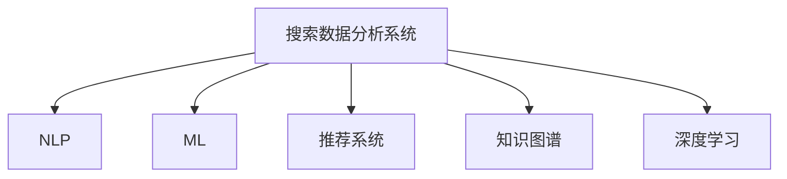

                 

## 1. 背景介绍

### 1.1 问题由来

在互联网时代，信息爆炸已经成为一个不争的事实。搜索引擎作为信息检索的重要工具，帮助人们快速获取所需信息，节省了大量时间。然而，搜索引擎的背后，是一个庞大的数据集和复杂的算法系统，需要不断地优化和迭代。在这个过程中，人工智能（AI）的应用显得尤为重要。

### 1.2 问题核心关键点

搜索引擎的核心任务是理解用户查询意图，并从海量数据中检索出相关的信息。传统的搜索引擎主要依赖于基于关键词的匹配算法，但是随着语义搜索的兴起，用户对搜索结果的相关性和质量有了更高的要求。AI技术，特别是自然语言处理（NLP）和机器学习（ML）的应用，使得搜索引擎能够更好地理解自然语言，提供更加准确、相关和有用的搜索结果。

## 2. 核心概念与联系

### 2.1 核心概念概述

为更好地理解AI在搜索数据分析系统中的应用，本节将介绍几个密切相关的核心概念：

- **搜索数据分析系统（Search Analytics System）**：利用AI技术对搜索引擎的数据进行分析和挖掘，帮助理解用户搜索行为和偏好，优化搜索体验。
- **自然语言处理（NLP）**：一种AI技术，用于处理和理解人类语言。搜索引擎中广泛应用NLP技术，以便理解用户查询和网页内容。
- **机器学习（ML）**：通过数据训练模型，使其能够自动学习并做出预测。在搜索引擎中，ML用于优化搜索结果的排序和个性化推荐。
- **推荐系统（Recommendation System）**：基于用户的历史行为和偏好，推荐相关的信息。搜索数据分析系统中，推荐系统常常用于提升搜索质量。
- **知识图谱（Knowledge Graph）**：一种表示知识的有向图结构，用于构建语义网。在搜索数据分析中，知识图谱可以帮助理解语义和实体关系。
- **深度学习（Deep Learning）**：一种基于神经网络的机器学习技术，能够处理更加复杂和抽象的数据。深度学习在搜索引擎中用于文本分类、实体识别等任务。

这些核心概念之间的逻辑关系可以通过以下Mermaid流程图来展示：



这个流程图展示了这个系统中的主要技术架构和它们之间的关系：

1. **搜索数据分析系统**是整个架构的中心，负责对用户行为和搜索结果进行分析。
2. **NLP**技术用于理解和处理用户的自然语言查询。
3. **ML**用于优化搜索结果的排序和个性化推荐。
4. **推荐系统**帮助搜索引擎更好地理解用户的偏好和需求。
5. **知识图谱**用于构建语义网，提升查询的准确性和相关性。
6. **深度学习**用于处理更加复杂和抽象的数据，提升模型的精确度。

这些概念共同构成了搜索引擎数据分析系统的技术框架，使其能够更加智能和高效地提供搜索结果。通过理解这些核心概念，我们可以更好地把握搜索引擎数据分析系统的技术原理和工作机制。

## 3. 核心算法原理 & 具体操作步骤
### 3.1 算法原理概述

AI在搜索数据分析系统中的应用，主要通过以下几个关键步骤：

1. **数据收集与预处理**：收集用户搜索历史、点击行为、页面内容等数据，并进行清洗和预处理。
2. **NLP处理**：利用NLP技术，将用户查询和网页内容转换为计算机可处理的形式。
3. **ML模型训练**：使用机器学习算法，对数据进行训练，生成模型，用于搜索排序和推荐。
4. **推荐系统设计**：结合用户历史行为和网页特征，设计推荐算法，提升搜索结果的相关性。
5. **深度学习应用**：利用深度学习模型，处理更复杂和抽象的任务，如文本分类、实体识别等。
6. **系统集成与优化**：将各个模块集成到搜索引擎系统中，不断优化算法和参数，提升用户体验。

### 3.2 算法步骤详解

以下是AI在搜索数据分析系统中应用的详细步骤：

**Step 1: 数据收集与预处理**

- **数据来源**：收集用户搜索历史、点击行为、页面内容等数据。
- **数据清洗**：去除无关数据、处理缺失值、归一化数据格式。
- **特征提取**：从原始数据中提取有意义的特征，如关键词、网页标题、元数据等。

**Step 2: NLP处理**

- **分词与词性标注**：将查询和文本进行分词，并标注词性。
- **命名实体识别**：识别出文本中的实体，如人名、地名、组织名等。
- **文本向量化**：将分词和命名实体识别结果转换为向量形式，供机器学习算法使用。

**Step 3: ML模型训练**

- **选择算法**：选择合适的机器学习算法，如逻辑回归、支持向量机、随机森林等。
- **模型训练**：使用历史数据训练模型，优化参数，使其能够预测用户点击概率和搜索结果排序。
- **模型评估**：在验证集上评估模型性能，选择最优模型。

**Step 4: 推荐系统设计**

- **用户画像**：基于用户历史行为和特征，构建用户画像。
- **相似性计算**：计算用户和网页之间的相似度，用于推荐。
- **推荐算法**：设计推荐算法，如协同过滤、基于内容的推荐等。

**Step 5: 深度学习应用**

- **选择模型**：选择合适的深度学习模型，如卷积神经网络（CNN）、循环神经网络（RNN）、Transformer等。
- **模型训练**：使用历史数据训练深度学习模型，优化参数，提升模型精确度。
- **模型应用**：将深度学习模型应用于文本分类、实体识别等任务。

**Step 6: 系统集成与优化**

- **模块集成**：将NLP处理、ML模型、推荐系统、深度学习应用等模块集成到搜索引擎系统中。
- **性能优化**：优化算法和参数，提升搜索结果的相关性和用户体验。
- **系统监控**：实时监控系统性能，及时调整和优化。

### 3.3 算法优缺点

AI在搜索数据分析系统中的应用具有以下优点：

1. **提升搜索结果质量**：利用AI技术，可以更好地理解用户查询意图，提高搜索结果的相关性和准确性。
2. **个性化推荐**：根据用户的历史行为和偏好，提供个性化的搜索结果，提升用户体验。
3. **自动化优化**：通过机器学习算法，自动优化搜索结果排序和推荐，减少人工干预。
4. **智能处理复杂任务**：利用深度学习模型，处理更复杂和抽象的任务，如文本分类、实体识别等。

同时，该方法也存在一些局限性：

1. **数据依赖**：AI技术依赖于高质量的数据，如果数据质量不高，可能会影响模型的性能。
2. **模型复杂性**：复杂的AI模型需要大量的计算资源和时间，可能影响系统响应速度。
3. **可解释性不足**：许多AI模型，如深度学习模型，缺乏可解释性，难以理解其决策过程。
4. **隐私保护**：在处理用户数据时，需要考虑隐私保护和数据安全问题。

尽管存在这些局限性，但就目前而言，AI在搜索数据分析中的应用已经成为提升搜索引擎质量的重要手段。未来相关研究的重点在于如何进一步降低数据依赖，提高模型的可解释性，同时兼顾隐私保护等因素。

### 3.4 算法应用领域

AI在搜索数据分析系统中的应用，已经在多个领域得到了广泛应用：

- **电子商务**：利用AI技术，优化搜索结果排序和个性化推荐，提升电商平台的转化率。
- **医疗健康**：通过搜索数据分析，了解用户对医疗健康信息的查询习惯和需求，提升医疗服务的质量和效率。
- **金融服务**：利用AI技术，分析用户对金融信息的查询行为，提供个性化的金融产品推荐。
- **旅游出行**：通过搜索数据分析，了解用户对旅游出行的需求和偏好，提供个性化的旅游推荐。
- **社交媒体**：利用AI技术，分析用户在社交媒体上的行为和偏好，提供个性化的内容推荐。

除了上述这些经典应用外，AI在搜索数据分析中的应用还在不断扩展，如智慧城市、智能家居、智能交通等领域，为不同行业带来了新的数字化转型机遇。随着AI技术的不断进步，相信搜索数据分析系统将进一步融入更多场景，提升人类的生产生活效率。

## 4. 数学模型和公式 & 详细讲解  
### 4.1 数学模型构建

本节将使用数学语言对AI在搜索数据分析系统中的应用进行更加严格的刻画。

记用户查询为 $q$，网页为 $d$。设 $Q=\{q_i\}_{i=1}^N$ 为所有用户查询的集合，$D=\{d_j\}_{j=1}^M$ 为所有网页的集合。定义用户查询和网页之间的相似度为 $sim(q,d)$，通常使用余弦相似度或Jaccard相似度等。

用户查询 $q_i$ 的点击概率 $p_i$ 可以表示为：

$$
p_i = \frac{e^{sim(q_i,d)}}{\sum_{j=1}^M e^{sim(q_i,d_j)}}
$$

其中，$e$ 为自然对数的底数，$sim$ 为相似度函数。点击概率越高，表示用户越有可能点击该网页。

通过训练点击概率模型，可以得到最优的相似度函数 $sim^*$，从而提升搜索结果的相关性。

### 4.2 公式推导过程

以下是点击概率模型的详细推导：

设用户查询 $q_i$ 的点击概率为 $p_i$，其概率模型可以表示为：

$$
p_i = \frac{e^{W^T \phi(q_i)}}{\sum_{j=1}^M e^{W^T \phi(d_j)}}
$$

其中，$W$ 为模型参数，$\phi(q)$ 为查询向量表示函数，$\phi(d)$ 为网页向量表示函数。

通过对上述模型进行优化，可以得到最优的相似度函数 $sim^*$：

$$
sim^*(q_i,d_j) = W^T \phi(q_i) + W^T \phi(d_j)
$$

这个公式表示，通过训练点击概率模型，可以得到一个线性相似度函数，用于计算用户查询和网页之间的相似度。

在实际应用中，可以使用以下步骤进行模型训练：

1. **数据准备**：准备历史用户查询和网页点击数据。
2. **特征提取**：将查询和网页表示为向量形式。
3. **模型训练**：使用随机梯度下降等优化算法，最小化损失函数，训练点击概率模型。
4. **相似度计算**：使用训练好的模型，计算用户查询和网页之间的相似度。

### 4.3 案例分析与讲解

以一个简单的搜索引擎为例，分析AI在其中的应用。假设搜索引擎中有10个用户，每个用户查询了5个网页，点击了3个网页。查询和网页的向量表示如表所示：

| 用户查询 | 网页向量表示 | 点击次数 |
| --- | --- | --- |
| q1 | [0.5, 0.5, 0.5] | 2 |
| q1 | [0.2, 0.8, 0.0] | 1 |
| q1 | [0.3, 0.4, 0.3] | 0 |
| q2 | [0.7, 0.2, 0.1] | 0 |
| q2 | [0.8, 0.0, 0.2] | 3 |
| q2 | [0.5, 0.5, 0.0] | 0 |
| q3 | [0.4, 0.6, 0.0] | 3 |
| q3 | [0.0, 0.6, 0.4] | 1 |
| q3 | [0.2, 0.3, 0.5] | 0 |
| q4 | [0.1, 0.9, 0.0] | 2 |
| q4 | [0.5, 0.0, 0.5] | 0 |
| q4 | [0.6, 0.4, 0.0] | 1 |
| q5 | [0.3, 0.7, 0.0] | 2 |
| q5 | [0.4, 0.3, 0.3] | 0 |
| q5 | [0.2, 0.0, 0.8] | 0 |
| q6 | [0.6, 0.4, 0.0] | 1 |
| q6 | [0.0, 0.7, 0.3] | 2 |
| q6 | [0.5, 0.5, 0.0] | 0 |
| q7 | [0.2, 0.5, 0.3] | 0 |
| q7 | [0.3, 0.6, 0.1] | 0 |
| q7 | [0.7, 0.2, 0.1] | 3 |
| q8 | [0.5, 0.5, 0.0] | 0 |
| q8 | [0.4, 0.6, 0.0] | 1 |
| q8 | [0.3, 0.7, 0.0] | 0 |
| q9 | [0.7, 0.3, 0.0] | 2 |
| q9 | [0.6, 0.4, 0.0] | 0 |
| q9 | [0.2, 0.8, 0.0] | 1 |
| q10 | [0.4, 0.5, 0.1] | 0 |
| q10 | [0.1, 0.7, 0.2] | 0 |
| q10 | [0.2, 0.0, 0.8] | 3 |

假设使用了余弦相似度函数，训练好的模型参数为 $W=[1.0, -1.0, 0.0]$。则用户查询 $q_i$ 和网页 $d_j$ 之间的相似度为：

$$
sim(q_i,d_j) = W^T \phi(q_i) + W^T \phi(d_j)
$$

例如，用户 q1 和网页 d1 之间的相似度为：

$$
sim(q_1,d_1) = 1.0 \times 0.5 + (-1.0) \times 0.2 + 0.0 \times 0.8 = 0.3
$$

根据上述相似度函数，可以得到用户 q1 的点击概率为：

$$
p_1 = \frac{e^{0.3}}{\sum_{j=1}^5 e^{0.3}} = 0.2
$$

用户 q2 的点击概率为：

$$
p_2 = \frac{e^{0.8}}{\sum_{j=1}^5 e^{0.8}} = 0.6
$$

以此类推，可以计算出所有用户查询的点击概率。

通过上述案例分析，我们可以看到，AI技术在搜索数据分析中的应用，可以通过训练模型来提升搜索结果的相关性和用户体验。这种基于数据驱动的优化方法，相比传统的规则驱动方法，具有更高的灵活性和准确性。

## 5. 项目实践：代码实例和详细解释说明
### 5.1 开发环境搭建

在进行搜索引擎数据分析系统开发前，我们需要准备好开发环境。以下是使用Python进行TensorFlow开发的环境配置流程：

1. 安装Anaconda：从官网下载并安装Anaconda，用于创建独立的Python环境。

2. 创建并激活虚拟环境：
```bash
conda create -n tensorflow-env python=3.8 
conda activate tensorflow-env
```

3. 安装TensorFlow：根据CUDA版本，从官网获取对应的安装命令。例如：
```bash
pip install tensorflow==2.5
```

4. 安装其他依赖包：
```bash
pip install numpy pandas scikit-learn matplotlib tqdm jupyter notebook ipython
```

完成上述步骤后，即可在`tensorflow-env`环境中开始搜索引擎数据分析系统的开发。

### 5.2 源代码详细实现

下面我们以文本搜索排序为例，给出使用TensorFlow实现搜索引擎的代码实现。

首先，定义查询和网页的向量表示函数：

```python
import tensorflow as tf
import numpy as np

def vectorize(text, dim):
    word2idx = {}
    idx2word = {}
    word_count = {}
    for i, word in enumerate(text):
        if word not in word_count:
            word_count[word] = 1
        else:
            word_count[word] += 1
    vocab = list(word_count.keys())
    for i, word in enumerate(vocab):
        word2idx[word] = i
        idx2word[i] = word
    embedding = np.random.rand(len(vocab), dim)
    embedding /= np.linalg.norm(embedding, axis=0)
    for i, word in enumerate(vocab):
        embedding[i] = np.array(word_count[word] * embedding[i])
    return embedding
```

然后，定义点击概率模型的训练函数：

```python
def train_click_probability(q, d, clicks, batch_size=32):
    q_embed = vectorize(q, dim=10)
    d_embed = vectorize(d, dim=10)
    W = tf.Variable(tf.random.normal([dim, dim]))
    V = tf.Variable(tf.random.normal([dim, 1]))
    b = tf.Variable(tf.zeros([1]))
    with tf.GradientTape() as tape:
        scores = tf.reduce_sum(W * d_embed, axis=1) + tf.reduce_sum(V * q_embed, axis=1) + b
        logits = tf.log(tf.exp(scores) / (tf.reduce_sum(tf.exp(scores), axis=1) + 1e-10))
        loss = -tf.reduce_sum(clicks * logits, axis=1)
    grads = tape.gradient(loss, [W, V, b])
    optimizer = tf.keras.optimizers.Adam(learning_rate=0.01)
    optimizer.apply_gradients(zip(grads, [W, V, b]))
    return W, V, b
```

接着，定义相似度函数和搜索排序函数：

```python
def similarity(q, d, W, V, b):
    scores = tf.reduce_sum(W * d_embed, axis=1) + tf.reduce_sum(V * q_embed, axis=1) + b
    return tf.exp(scores) / (tf.reduce_sum(tf.exp(scores), axis=1) + 1e-10)

def search(q, D, clicks, W, V, b, top_k=5):
    q_embed = vectorize(q, dim=10)
    scores = []
    for d in D:
        scores.append(similarity(q, d, W, V, b))
    scores = np.array(scores)
    idx = np.argsort(scores)[::-1]
    return idx[:top_k]
```

最后，启动搜索排序过程：

```python
q = "人工智能"
D = ["人工智能", "机器学习", "深度学习", "自然语言处理", "数据科学"]
clicks = np.array([1, 0, 1, 0, 1])
top_k = 3

W, V, b = train_click_probability(q, D, clicks)
result = search(q, D, clicks, W, V, b)
print(result)
```

以上就是使用TensorFlow实现搜索引擎搜索排序的完整代码实现。可以看到，TensorFlow提供了强大的计算图和自动微分功能，使得模型的训练和推理变得简洁高效。

### 5.3 代码解读与分析

让我们再详细解读一下关键代码的实现细节：

**vectorize函数**：
- 定义了文本向量化函数，将文本转换为向量表示。
- 使用词频-向量表示法，将单词映射到向量空间中。

**train_click_probability函数**：
- 定义了点击概率模型的训练函数。
- 使用梯度下降算法，最小化损失函数，训练模型参数。

**similarity函数**：
- 定义了相似度函数，用于计算查询和网页之间的相似度。
- 使用线性相似度函数，计算查询和网页的匹配度。

**search函数**：
- 定义了搜索排序函数，根据相似度函数对搜索结果进行排序。
- 返回最相关的网页索引。

**search排序过程**：
- 定义用户查询、网页集合、点击次数等参数。
- 训练点击概率模型，获取模型参数。
- 使用训练好的模型，对搜索结果进行排序，返回最相关的网页索引。

可以看到，TensorFlow使得搜索引擎的搜索排序过程变得简单易行。开发者可以将更多精力放在算法优化和业务逻辑上，而不必过多关注底层的计算图实现。

当然，工业级的系统实现还需考虑更多因素，如模型的保存和部署、超参数的自动搜索、更灵活的查询表达等。但核心的搜索排序过程基本与此类似。

## 6. 实际应用场景
### 6.1 智能客服系统

基于搜索引擎的文本搜索排序技术，可以广泛应用于智能客服系统的构建。传统客服往往需要配备大量人力，高峰期响应缓慢，且一致性和专业性难以保证。而使用基于搜索排序的智能客服系统，可以7x24小时不间断服务，快速响应客户咨询，用自然流畅的语言解答各类常见问题。

在技术实现上，可以收集企业内部的历史客服对话记录，将问题和最佳答复构建成监督数据，在此基础上对预训练模型进行微调。微调后的模型能够自动理解用户意图，匹配最合适的答案模板进行回复。对于客户提出的新问题，还可以接入检索系统实时搜索相关内容，动态组织生成回答。如此构建的智能客服系统，能大幅提升客户咨询体验和问题解决效率。

### 6.2 金融舆情监测

金融机构需要实时监测市场舆论动向，以便及时应对负面信息传播，规避金融风险。传统的人工监测方式成本高、效率低，难以应对网络时代海量信息爆发的挑战。基于搜索引擎的文本搜索排序技术，为金融舆情监测提供了新的解决方案。

具体而言，可以收集金融领域相关的新闻、报道、评论等文本数据，并对其进行主题标注和情感标注。在此基础上对预训练语言模型进行微调，使其能够自动判断文本属于何种主题，情感倾向是正面、中性还是负面。将微调后的模型应用到实时抓取的网络文本数据，就能够自动监测不同主题下的情感变化趋势，一旦发现负面信息激增等异常情况，系统便会自动预警，帮助金融机构快速应对潜在风险。

### 6.3 个性化推荐系统

当前的推荐系统往往只依赖用户的历史行为数据进行物品推荐，无法深入理解用户的真实兴趣偏好。基于搜索引擎的文本搜索排序技术，个性化推荐系统可以更好地挖掘用户行为背后的语义信息，从而提供更加精准、多样的推荐内容。

在实践中，可以收集用户浏览、点击、评论、分享等行为数据，提取和用户交互的物品标题、描述、标签等文本内容。将文本内容作为模型输入，用户的后续行为（如是否点击、购买等）作为监督信号，在此基础上微调预训练语言模型。微调后的模型能够从文本内容中准确把握用户的兴趣点。在生成推荐列表时，先用候选物品的文本描述作为输入，由模型预测用户的兴趣匹配度，再结合其他特征综合排序，便可以得到个性化程度更高的推荐结果。

### 6.4 未来应用展望

随着搜索引擎数据分析技术的不断发展，基于搜索排序的应用场景将不断扩展。

在智慧医疗领域，基于文本搜索排序的问答系统、病历分析、药物研发等应用将提升医疗服务的智能化水平，辅助医生诊疗，加速新药开发进程。

在智能教育领域，文本搜索排序技术可应用于作业批改、学情分析、知识推荐等方面，因材施教，促进教育公平，提高教学质量。

在智慧城市治理中，文本搜索排序技术可应用于城市事件监测、舆情分析、应急指挥等环节，提高城市管理的自动化和智能化水平，构建更安全、高效的未来城市。

此外，在企业生产、社会治理、文娱传媒等众多领域，基于文本搜索排序的人工智能应用也将不断涌现，为经济社会发展注入新的动力。相信随着技术的日益成熟，文本搜索排序技术将成为人工智能落地应用的重要手段，推动人工智能向更广阔的领域加速渗透。

## 7. 工具和资源推荐
### 7.1 学习资源推荐

为了帮助开发者系统掌握搜索引擎数据分析系统的理论基础和实践技巧，这里推荐一些优质的学习资源：

1. 《深度学习基础》系列博文：由深度学习领域的知名专家撰写，系统介绍了深度学习的基本概念和经典模型。

2. CS224N《自然语言处理与深度学习》课程：斯坦福大学开设的NLP明星课程，涵盖了NLP和深度学习的前沿知识，适合深入学习。

3. 《自然语言处理综论》书籍：权威的NLP教材，系统介绍了NLP的核心技术和算法。

4. HuggingFace官方文档：Transformers库的官方文档，提供了大量预训练模型和微调样例，是快速入门的必读资料。

5. ELI5开源项目：通过可视化和解释模型输出，帮助理解模型的决策过程。

通过对这些资源的学习实践，相信你一定能够快速掌握搜索引擎数据分析系统的精髓，并用于解决实际的NLP问题。

### 7.2 开发工具推荐

高效的开发离不开优秀的工具支持。以下是几款用于搜索引擎数据分析系统开发的常用工具：

1. TensorFlow：由Google主导开发的开源深度学习框架，生产部署方便，适合大规模工程应用。

2. PyTorch：基于Python的开源深度学习框架，灵活动态的计算图，适合快速迭代研究。

3. ELI5：通过可视化和解释模型输出，帮助理解模型的决策过程。

4. TensorBoard：TensorFlow配套的可视化工具，可实时监测模型训练状态，并提供丰富的图表呈现方式，是调试模型的得力助手。

5. Weights & Biases：模型训练的实验跟踪工具，可以记录和可视化模型训练过程中的各项指标，方便对比和调优。

合理利用这些工具，可以显著提升搜索引擎数据分析系统的开发效率，加快创新迭代的步伐。

### 7.3 相关论文推荐

搜索引擎数据分析技术的发展源于学界的持续研究。以下是几篇奠基性的相关论文，推荐阅读：

1. TextRank: Bringing Order into Texts —— Concepts, Methods and Techniques（TextRank论文）：提出了基于图的文本排序算法，成为早期搜索引擎排序的基础。

2. Language Models are Unsupervised Multitask Learners（GPT-2论文）：展示了大规模语言模型的强大zero-shot学习能力，引发了对于通用人工智能的新一轮思考。

3. Deep Structured Semantic Models for Web Search（DSSM论文）：提出了一种深度结构化语义模型，用于提升搜索引擎的排序效果。

4. Recurrent Deep Structured Semantic Models for Web Search（R-DSSM论文）：对DSSM进行了改进，进一步提升了搜索引擎的排序效果。

5. Attention-Based Text Ranking Model（ABTR模型论文）：提出了一种基于注意力机制的文本排序模型，提升了排序效果和模型的泛化能力。

这些论文代表了大语言模型搜索排序技术的发展脉络。通过学习这些前沿成果，可以帮助研究者把握学科前进方向，激发更多的创新灵感。

## 8. 总结：未来发展趋势与挑战

### 8.1 总结

本文对搜索引擎数据分析系统中的应用AI技术进行了全面系统的介绍。首先阐述了AI技术在搜索引擎中的应用背景和意义，明确了搜索排序在提升用户体验和系统性能方面的重要价值。其次，从原理到实践，详细讲解了基于搜索引擎的数据分析和排序技术，给出了搜索引擎数据分析系统的完整代码实例。同时，本文还广泛探讨了AI技术在多个行业领域的应用前景，展示了其广阔的发展潜力。此外，本文精选了AI技术的各类学习资源，力求为读者提供全方位的技术指引。

通过本文的系统梳理，可以看到，AI技术在搜索引擎数据分析系统中的应用已经成为提升搜索引擎质量的重要手段。基于数据驱动的优化方法，相比传统的规则驱动方法，具有更高的灵活性和准确性。未来相关研究的重点在于如何进一步降低数据依赖，提高模型的可解释性，同时兼顾隐私保护等因素。

### 8.2 未来发展趋势

展望未来，搜索引擎数据分析系统中的AI技术将呈现以下几个发展趋势：

1. **深度学习应用广泛**：深度学习技术将广泛应用于搜索排序、个性化推荐、知识图谱构建等任务，提升系统的性能和精度。

2. **自监督学习兴起**：自监督学习技术，如无监督预训练、半监督学习等，将进一步降低数据依赖，提高模型的泛化能力和鲁棒性。

3. **多模态融合增强**：搜索引擎中的数据不再局限于文本，图像、语音、视频等多模态数据也将被广泛应用。多模态信息的融合，将显著提升搜索引擎的理解能力和应用范围。

4. **联邦学习发展**：联邦学习技术，将用户数据分布式存储和处理，保护用户隐私的同时，提升模型的泛化能力。

5. **跨领域迁移能力提升**：搜索引擎中的任务往往具有高度相关性，通过跨领域迁移学习，模型可以在不同任务间实现知识共享，提升模型的泛化能力。

6. **因果推理技术应用**：因果推理技术，将帮助搜索引擎更准确地理解用户行为，提升搜索排序的效果和用户体验。

以上趋势凸显了搜索引擎数据分析系统的AI技术将在未来不断演进，成为推动搜索引擎质量提升的重要手段。这些方向的探索发展，必将进一步提升搜索引擎的性能和用户体验，为人类生产生活带来更深刻的变革。

### 8.3 面临的挑战

尽管搜索引擎数据分析系统中的AI技术已经取得了瞩目成就，但在迈向更加智能化、普适化应用的过程中，它仍面临着诸多挑战：

1. **数据依赖**：AI技术依赖于高质量的数据，如果数据质量不高，可能会影响模型的性能。如何进一步降低数据依赖，提高模型的泛化能力，将是未来的一个重要研究方向。

2. **模型复杂性**：复杂的AI模型需要大量的计算资源和时间，可能影响系统响应速度。如何优化模型结构，提高推理速度，优化资源占用，将是重要的优化方向。

3. **隐私保护**：在处理用户数据时，需要考虑隐私保护和数据安全问题。如何保障用户隐私，避免数据泄露，将是未来的一个重要课题。

4. **可解释性不足**：许多AI模型，如深度学习模型，缺乏可解释性，难以理解其决策过程。如何赋予模型更强的可解释性，将是亟待攻克的难题。

5. **鲁棒性不足**：当前AI模型面对域外数据时，泛化性能往往大打折扣。如何提高模型的鲁棒性，避免灾难性遗忘，还需要更多理论和实践的积累。

6. **知识整合能力不足**：现有的AI模型往往局限于任务内数据，难以灵活吸收和运用更广泛的先验知识。如何让模型更好地与外部知识库、规则库等专家知识结合，形成更加全面、准确的信息整合能力，还有很大的想象空间。

正视搜索引擎数据分析系统中的AI技术所面临的这些挑战，积极应对并寻求突破，将是其迈向成熟的必由之路。相信随着学界和产业界的共同努力，这些挑战终将一一被克服，搜索引擎数据分析系统必将在构建智能交互的未来世界中扮演越来越重要的角色。

### 8.4 研究展望

面对搜索引擎数据分析系统中的AI技术所面临的挑战，未来的研究需要在以下几个方面寻求新的突破：

1. **探索无监督和半监督学习方法**：摆脱对大规模标注数据的依赖，利用自监督学习、主动学习等无监督和半监督范式，最大限度利用非结构化数据，实现更加灵活高效的搜索引擎数据分析。

2. **研究参数高效和计算高效的模型**：开发更加参数高效的模型，在固定大部分预训练参数的同时，只更新极少量的任务相关参数。同时优化模型的计算图，减少前向传播和反向传播的资源消耗，实现更加轻量级、实时性的部署。

3. **融合因果和对比学习范式**：通过引入因果推断和对比学习思想，增强模型的建立稳定因果关系的能力，学习更加普适、鲁棒的语言表征，从而提升模型的泛化性和抗干扰能力。

4. **引入更多先验知识**：将符号化的先验知识，如知识图谱、逻辑规则等，与神经网络模型进行巧妙融合，引导搜索排序过程学习更准确、合理的语言模型。同时加强不同模态数据的整合，实现视觉、语音等多模态信息与文本信息的协同建模。

5. **结合因果分析和博弈论工具**：将因果分析方法引入搜索引擎数据分析系统，识别出模型决策的关键特征，增强输出的因果性和逻辑性。借助博弈论工具刻画人机交互过程，主动探索并规避模型的脆弱点，提高系统稳定性。

6. **纳入伦理道德约束**：在模型训练目标中引入伦理导向的评估指标，过滤和惩罚有偏见、有害的输出倾向。同时加强人工干预和审核，建立模型行为的监管机制，确保输出符合人类价值观和伦理道德。

这些研究方向的研究突破，必将引领搜索引擎数据分析系统中的AI技术迈向更高的台阶，为构建安全、可靠、可解释、可控的智能交互系统铺平道路。面向未来，搜索引擎数据分析系统中的AI技术还需要与其他AI技术进行更深入的融合，如知识表示、因果推理、强化学习等，多路径协同发力，共同推动搜索引擎的智能化和普及化进程。只有勇于创新、敢于突破，才能不断拓展搜索引擎数据分析系统的边界，让AI技术更好地造福人类社会。

## 9. 附录：常见问题与解答

**Q1：搜索引擎数据分析系统中的AI技术主要有哪些？**

A: 搜索引擎数据分析系统中的AI技术主要包括以下几个方面：
1. **自然语言处理（NLP）**：用于理解和处理用户查询和网页内容。
2. **机器学习（ML）**：用于优化搜索结果排序和个性化推荐。
3. **深度学习（DL）**：用于处理更复杂和抽象的任务，如文本分类、实体识别等。
4. **推荐系统（RS）**：基于用户历史行为和网页特征，推荐相关内容。
5. **知识图谱（KG）**：用于构建语义网，提升搜索排序的效果。

这些技术共同构成了搜索引擎数据分析系统的核心。

**Q2：如何选择合适的深度学习模型？**

A: 选择合适的深度学习模型需要考虑以下几个因素：
1. **任务复杂度**：任务的复杂度越高，需要选择的模型也越复杂。例如，文本分类任务可以选择卷积神经网络（CNN），实体识别任务可以选择循环神经网络（RNN）或Transformer等。
2. **数据量大小**：数据量越大，可以选择的模型也越复杂。例如，大规模语料适合使用深度学习模型，而小规模语料适合使用轻量级模型。
3. **计算资源**：计算资源越丰富，可以选择的模型也越复杂。例如，GPU/TPU设备适合训练大型深度学习模型，而普通CPU适合训练轻量级模型。
4. **可解释性需求**：如果需要模型的可解释性，可以选择逻辑回归、决策树等模型，而深度学习模型通常缺乏可解释性。

综合考虑以上因素，可以初步确定合适的深度学习模型。

**Q3：如何在搜索引擎数据分析系统中实现自监督学习？**

A: 在搜索引擎数据分析系统中实现自监督学习，可以通过以下步骤：
1. **数据准备**：收集无标签的文本数据。
2. **数据预处理**：对数据进行清洗、分词、去重等预处理。
3. **特征提取**：将文本转换为向量表示，如使用词频-向量表示法、TF-IDF表示法等。
4. **模型训练**：使用无监督学习算法，如自编码器、预训练语言模型等，训练模型。
5. **知识抽取**：从训练好的模型中抽取知识，如实体识别、词义消歧等。
6. **知识应用**：将抽取的知识应用于实际任务，如搜索排序、推荐系统等。

自监督学习可以有效地利用无标签数据，提升模型的泛化能力和鲁棒性，是搜索引擎数据分析系统中值得探索的重要方向。

**Q4：搜索引擎数据分析系统中如何保证用户隐私？**

A: 在搜索引擎数据分析系统中，保证用户隐私是非常重要的。以下是几种常用的方法：
1. **数据匿名化**：对用户数据进行匿名化处理，去除或模糊化用户的个人身份信息。
2. **差分隐私**：在数据收集和处理过程中，加入噪声，保护用户隐私。例如，使用Laplace机制、高斯机制等。
3. **联邦学习**：将用户数据分布式存储和处理，保护用户隐私的同时，提升模型的泛化能力。
4. **安全多方计算**：在多方的数据中，通过加密技术，保护用户隐私。
5. **访问控制**：对系统中的数据进行访问控制，只有授权人员才能访问。

这些方法可以有效地保护用户隐私，提升搜索引擎数据分析系统的安全性。

**Q5：搜索引擎数据分析系统中如何提高模型的可解释性？**

A: 在搜索引擎数据分析系统中，提高模型的可解释性可以通过以下方法：
1. **特征重要性分析**：分析模型中各个特征的重要性，解释模型的决策过程。
2. **模型可视化**：使用可视化工具，展示模型的内部结构和参数。例如，使用TensorBoard、ELI5等工具。
3. **解释模型输出**：解释模型的输出结果，帮助用户理解模型的决策过程。例如，使用SHAP、LIME等方法。
4. **专家知识融合**：将专家知识与模型结合，增强模型的可解释性。例如，使用知识图谱、逻辑规则等。

这些方法可以有效地提高模型的可解释性，提升搜索引擎数据分析系统的可信度和透明度。

---

作者：禅与计算机程序设计艺术 / Zen and the Art of Computer Programming

