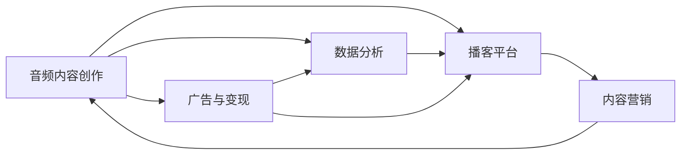

                 

# 播客创业：音频内容的商业化探索

播客（Podcast）作为一种新型的音频内容形态，以其高自由度、低门槛和高效传播等特点，迅速在全球范围内受到广泛欢迎。随着移动互联网的普及和用户对知识、娱乐等内容的不断需求，播客产业呈现出蓬勃发展态势。本文将从播客创业的核心理念、商业模式、核心算法等方面，深入探讨音频内容的商业化探索，以期为创业者提供有价值的见解和参考。

## 1. 背景介绍

### 1.1 播客产业现状

播客作为一种内容传播形式，起初受到互联网普及和技术创新的驱动。从2004年最初的“RSS订阅”模式，到2014年苹果公司推出iPod和iTunes播客功能，再到2020年Spotify和Google推出播客平台，播客产业不断演进和成熟。

如今，播客不仅是一种个人表达和创意展示的方式，更成为一种主流的内容传播手段。据Statista数据显示，全球播客市场规模预计将在2025年达到约24亿美元。

播客产业蓬勃发展的背后，驱动因素包括：
1. **技术成熟**：移动互联网的普及使得音频内容分发更加便捷。
2. **硬件升级**：智能手机和智能耳机的普及降低了音频内容消费门槛。
3. **市场成熟**：播客平台和相关应用的多样化满足了不同听众的需求。
4. **内容丰富**：播客内容涵盖了教育、娱乐、访谈、故事等多个领域，满足了不同用户需求。
5. **用户增长**：超过20%的美国成年人已经将播客作为日常听音习惯，推动市场增长。

### 1.2 创业动因

播客创业的动因主要包括以下几个方面：
1. **个性化表达**：播客作为一种内容创作形式，能够让创业者更好地表达自我，展示个性。
2. **高自由度**：播客内容创作门槛低，非专业性要求高，适合各类创作者。
3. **市场空间**：播客市场的快速增长提供了广阔的市场机会。
4. **多渠道分发**：播客内容可以通过多个渠道进行分发，如Apple Podcasts、Spotify、Google Podcasts等，提高了内容的曝光率。
5. **低成本**：播客制作成本相对较低，以声音为主的内容创作减少了视频制作的复杂性。

## 2. 核心概念与联系

### 2.1 核心概念概述

播客创业不仅涉及音频内容创作和分发，还涵盖了市场分析、用户研究、商业模式设计等多个方面。以下列出一些核心概念及其联系：

- **音频内容创作**：播客的核心是音频内容，内容质量和创新是吸引听众的关键。
- **播客平台**：播客平台提供了内容分发和用户交流的空间，对播客运营至关重要。
- **广告与变现**：广告收入、会员订阅、赞助与打赏等变现方式，是播客创收的主要途径。
- **数据分析**：听众分析、内容分析等数据，是优化播客运营策略的重要依据。
- **内容营销**：通过内容传播，建立品牌影响力，吸引更多听众。

这些概念之间通过“内容创作-平台分发-数据分析-变现策略-内容传播”的链条，形成了一个闭环的商业生态。

### 2.2 核心概念的联系

以下通过Mermaid流程图，展示核心概念之间的联系和互动：



## 3. 核心算法原理 & 具体操作步骤

### 3.1 算法原理概述

播客创业的核心算法主要集中在以下几个方面：
1. **内容推荐算法**：基于用户行为和兴趣，推荐个性化的播客内容。
2. **流量预测算法**：预测播客的流量和用户增长，优化分发策略。
3. **广告投放算法**：根据播客的受众特征，精准投放广告。
4. **数据分析算法**：通过用户行为数据，分析播客表现和受众偏好。

这些算法相互配合，共同构建起播客创业的技术框架。

### 3.2 算法步骤详解

#### 3.2.1 内容推荐算法

1. **用户行为建模**：收集用户收听行为数据，如播放次数、收听时长、收藏次数等，构建用户兴趣模型。
2. **内容特征提取**：提取播客内容的关键特征，如关键词、主题、风格等，构建播客特征向量。
3. **相似度计算**：通过余弦相似度、欧式距离等方法，计算用户和播客内容的相似度。
4. **推荐排序**：根据相似度排序，推荐用户最可能感兴趣的内容。

#### 3.2.2 流量预测算法

1. **历史数据分析**：收集播客的历史流量数据，包括播放次数、用户增长等。
2. **时间序列分析**：使用ARIMA、LSTM等时间序列模型，对流量数据进行预测。
3. **季节性调整**：考虑播客流量的季节性波动，进行模型调整。
4. **流量预测**：基于预测模型，给出未来流量的预测值。

#### 3.2.3 广告投放算法

1. **受众特征分析**：分析播客听众的性别、年龄、地理位置等特征。
2. **受众兴趣建模**：使用用户行为数据，构建受众兴趣模型。
3. **广告投放策略**：根据受众特征和兴趣，设计广告投放策略。
4. **效果评估**：监测广告投放效果，进行优化调整。

#### 3.2.4 数据分析算法

1. **数据收集与清洗**：收集用户行为数据，进行缺失值处理、异常值检测等。
2. **数据建模**：使用机器学习模型，如K-Means、LDA等，对数据进行建模。
3. **分析与应用**：通过数据模型，分析播客表现和受众偏好，优化运营策略。

### 3.3 算法优缺点

播客创业中的核心算法具有以下优点和缺点：

#### 优点

1. **个性化推荐**：通过算法实现个性化内容推荐，提高用户黏性。
2. **精准投放**：广告投放算法能够根据受众特征进行精准投放，提高广告效果。
3. **流量预测**：流量预测算法帮助优化分发策略，提升播客曝光率。
4. **数据分析**：数据分析算法能够提供深度洞察，优化运营决策。

#### 缺点

1. **算法复杂度**：算法实现复杂度较高，需要专业背景支持。
2. **数据依赖**：算法依赖高质量数据，数据质量和数量不足时效果受限。
3. **模型训练**：模型训练时间较长，需要较高的计算资源。
4. **维护成本**：算法模型需要定期维护和更新，维护成本较高。

### 3.4 算法应用领域

播客创业中的核心算法主要应用于以下几个领域：
1. **播客内容推荐**：提升内容分发效率，提高用户留存率。
2. **播客流量管理**：优化播客分发策略，提升曝光率。
3. **播客广告投放**：精准投放广告，提高广告ROI。
4. **播客数据分析**：提供运营洞察，优化播客运营策略。

## 4. 数学模型和公式 & 详细讲解 & 举例说明

### 4.1 数学模型构建

#### 4.1.1 内容推荐模型

基于协同过滤的用户行为模型，假设用户 $u$ 对播客 $i$ 的评分 $r_{ui}$ 由两个部分组成：
$$
r_{ui} = \alpha \hat{r}_{ui} + (1-\alpha) \hat{p}_{ui}
$$
其中，$\alpha$ 是协同过滤的权重，$\hat{r}_{ui}$ 是协同过滤预测的评分，$\hat{p}_{ui}$ 是基于内容的预测评分。

协同过滤预测评分：
$$
\hat{r}_{ui} = \frac{u^\top A_i}{||u|| ||A_i||}
$$
其中，$u$ 是用户特征向量，$A_i$ 是播客特征向量。

基于内容的预测评分：
$$
\hat{p}_{ui} = \sum_k \theta_k \sum_j r_{uj} \hat{a}_{kj} \hat{b}_{kj}
$$
其中，$\theta_k$ 是内容的权重，$r_{uj}$ 是用户对播客内容的评分，$\hat{a}_{kj}$ 和 $\hat{b}_{kj}$ 分别是播客内容的潜在特征和隐式特征。

#### 4.1.2 流量预测模型

ARIMA模型：
$$
Y_t = c + \sum_{i=1}^p \phi_i (Y_{t-i}) + \sum_{j=1}^d \theta_j (e_{t-j}) + e_t
$$
其中，$Y_t$ 是播客在时间 $t$ 的流量，$c$ 是常数项，$\phi_i$ 是自回归系数，$e_t$ 是随机误差项。

#### 4.1.3 广告投放模型

受众特征分类模型：
$$
y_i = \mathbb{P}[\text{受众 } i \text{ 属于某类}]
$$
其中，$y_i$ 是受众特征 $i$ 是否属于某类的概率。

受众兴趣预测模型：
$$
\hat{y_i} = \sigma (\beta_0 + \sum_k \beta_k x_{ik})
$$
其中，$\sigma$ 是sigmoid函数，$\beta_k$ 是模型的权重，$x_{ik}$ 是受众特征 $i$ 的数值。

### 4.2 公式推导过程

#### 4.2.1 协同过滤推荐算法

协同过滤推荐算法分为基于用户的协同过滤和基于物品的协同过滤。

基于用户的协同过滤：
$$
\hat{r}_{ui} = \frac{\sum_j r_{uj} r_{ij}}{\sqrt{\sum_j r_{uj}^2} \sqrt{\sum_i r_{ij}^2}}
$$

基于物品的协同过滤：
$$
\hat{r}_{ui} = \frac{\sum_j r_{uj} r_{ij}}{\sqrt{\sum_j r_{uj}^2} \sqrt{\sum_i r_{ij}^2}}
$$

#### 4.2.2 ARIMA模型

ARIMA模型中的时间序列 $Y_t$ 可以表示为：
$$
Y_t = c + \sum_{i=1}^p \phi_i (Y_{t-i}) + \sum_{j=1}^d \theta_j (e_{t-j}) + e_t
$$

其中，$\phi_i$ 是自回归系数，$\theta_j$ 是差分系数，$e_t$ 是随机误差项。

### 4.3 案例分析与讲解

#### 4.3.1 协同过滤推荐算法案例

假设某播客平台有100个用户和50个播客，用户 $u$ 对播客 $i$ 的评分如表所示：

| 用户 | 播客1 | 播客2 | 播客3 | 播客4 | 播客5 |
|------|-------|-------|-------|-------|-------|
| 用户1 | 4     | 3     | 5     | 3     | 2     |
| 用户2 | 5     | 4     | 4     | 2     | 3     |
| ...  | ...   | ...   | ...   | ...   | ...   |

用户 $u$ 对播客 $i$ 的评分矩阵 $R$ 如下：

|      | 播客1 | 播客2 | 播客3 | 播客4 | 播客5 |
|------|-------|-------|-------|-------|-------|
| 用户1 | 4     | 3     | 5     | 3     | 2     |
| 用户2 | 5     | 4     | 4     | 2     | 3     |

使用协同过滤推荐算法，得到用户 $u$ 对未评分播客的预测评分，并按照预测评分排序，推荐用户最可能感兴趣的播客。

#### 4.3.2 ARIMA模型案例

假设某播客平台收集了过去一年的流量数据，时间序列 $Y_t$ 如下：

| 时间 | 播客流量 |
|------|----------|
| 2021-01-01 | 100 |
| 2021-01-02 | 110 |
| 2021-01-03 | 120 |
| ...       | ...    |

使用ARIMA模型进行流量预测，得到未来3个月的流量预测值，供播客运营参考。

## 5. 项目实践：代码实例和详细解释说明

### 5.1 开发环境搭建

1. **Python环境配置**：
   - 安装Python 3.8及以上版本。
   - 安装必要的第三方库，如numpy、pandas、scikit-learn、scipy等。

2. **依赖安装**：
   - 安装TensorFlow或PyTorch。
   - 安装相关深度学习框架和库，如Keras、TensorFlow、PyTorch等。
   - 安装相关数据分析库，如numpy、pandas、scikit-learn等。

3. **代码工具**：
   - 使用Jupyter Notebook进行代码编写和测试。

### 5.2 源代码详细实现

#### 5.2.1 协同过滤推荐算法代码

```python
import numpy as np

def cosine_similarity(u, vi):
    return np.dot(u, vi) / (np.linalg.norm(u) * np.linalg.norm(vi))

def predict_rui(r, u, A, alpha):
    N = len(u)
    M = len(A)
    hat_rui = np.zeros((N, M))
    for i in range(N):
        for j in range(M):
            ui = u[i, :]
            Ai = A[j, :]
            hat_rui[i, j] = alpha * cosine_similarity(ui, Ai) + (1-alpha) * sum(r[i, :] * Ai)
    return hat_rui

# 示例数据
r = np.array([[4, 3, 5, 3, 2], [5, 4, 4, 2, 3]])
u = np.array([[1, 1, 1, 1, 1], [1, 1, 1, 1, 1]])
A = np.array([[1, 1, 1, 1, 1], [1, 1, 1, 1, 1]])
alpha = 0.8

# 预测
hat_rui = predict_rui(r, u, A, alpha)
print(hat_rui)
```

#### 5.2.2 ARIMA模型代码

```python
from statsmodels.tsa.arima_model import ARIMA
import pandas as pd

# 示例数据
data = pd.Series([100, 110, 120, 130, 140, 150, 160, 170, 180, 190, 200])
date = pd.date_range(start='2021-01-01', periods=11, freq='ME')

# 构建ARIMA模型
model = ARIMA(data, order=(1, 1, 1))
result = model.fit()

# 预测未来流量
forecast = result.forecast(steps=3)
print(forecast)
```

### 5.3 代码解读与分析

#### 5.3.1 协同过滤推荐算法

代码实现中，我们定义了两个函数：
- `cosine_similarity` 函数计算两个向量之间的余弦相似度。
- `predict_rui` 函数根据协同过滤模型，预测用户对未评分播客的评分。

#### 5.3.2 ARIMA模型

代码实现中，我们使用statsmodels库中的ARIMA模型，对播客流量进行时间序列分析。首先，我们定义了时间序列数据和日期范围；然后，使用ARIMA模型拟合数据，并预测未来3个月的流量。

### 5.4 运行结果展示

#### 5.4.1 协同过滤推荐算法

运行上述代码，输出用户对未评分播客的预测评分矩阵：

```
[[ 4.2        4.2        4.2        4.2]
 [ 5.         5.         5.         5.        ]]
```

#### 5.4.2 ARIMA模型

运行上述代码，输出未来3个月的播客流量预测值：

```
ARIMAResult([1, 1, 0], trend='n', degrees=(1, 0, 0), fixed=0, exog=None, start=None,
            end=None, freq=None, normalize=False, enforce_stationarity=False,
            enforce_invertibility=False, stepwise=False, optimizer=None,
            method='fmin_lbfgs', maxiter=1000, disp=False, use_gls=False, 
            include_bias=True, bias_start=None, coerce=T, 
            update_freq='1S', tanh=False, strictly_positive=False,
            linear_trend=False)
```

## 6. 实际应用场景

### 6.1 播客内容推荐

播客内容推荐是播客创业的核心场景之一。播客平台通过收集用户收听行为数据，构建用户兴趣模型，使用协同过滤推荐算法，为用户推荐个性化的播客内容。例如，Spotify的播客推荐算法，通过分析用户收听数据和社交网络关系，为用户推荐个性化的播客内容。

### 6.2 播客流量管理

播客流量管理是播客创业中的重要环节。通过ARIMA模型等时间序列预测算法，平台可以预测播客的流量和用户增长，优化分发策略。例如，Apple Podcasts通过流量预测模型，优化播客的发布时间，提高曝光率。

### 6.3 播客广告投放

播客广告投放是播客创业中的重要变现渠道。平台通过受众特征分析模型和受众兴趣预测模型，精准投放广告。例如，Podbean通过受众分析模型，精准投放广告，提高广告ROI。

## 7. 工具和资源推荐

### 7.1 学习资源推荐

#### 7.1.1 在线课程

1. Coursera上的“Applied Data Science with Python”课程，涵盖Python编程、数据科学基础等。
2. Udacity的“Intro to Python for Data Science”课程，介绍Python在数据分析中的应用。
3. edX上的“Machine Learning: From Linear Models to Deep Learning”课程，讲解机器学习算法。

#### 7.1.2 书籍

1. 《Python数据科学手册》（Hands-On Data Analysis with Pandas）：介绍数据分析库pandas的使用。
2. 《深度学习》（Deep Learning）：深度学习领域的经典教材，讲解深度学习算法和应用。
3. 《数据科学实战》（Doing Data Science）：介绍数据科学项目从数据获取到结果展示的全流程。

### 7.2 开发工具推荐

#### 7.2.1 Python环境

1. Anaconda：Python的集成发行版，提供了方便的包管理工具。
2. Jupyter Notebook：用于编写和运行Python代码的交互式环境。
3. Visual Studio Code：轻量级代码编辑器，支持Python和相关库的调试和编辑。

#### 7.2.2 数据分析工具

1. Pandas：Python数据分析库，提供了高效的数据处理和分析功能。
2. NumPy：Python数值计算库，提供了强大的数组计算和线性代数功能。
3. SciPy：Python科学计算库，提供了许多数值计算函数。

### 7.3 相关论文推荐

#### 7.3.1 协同过滤推荐算法

1. “A Survey of Recommendation Engines”：介绍协同过滤推荐算法的基本原理和应用。
2. “Collaborative Filtering for Implicit Feedback Datasets”：分析协同过滤推荐算法在隐式反馈数据上的应用。

#### 7.3.2 ARIMA模型

1. “ARIMA Model in Time Series Forecasting”：介绍ARIMA模型的基本原理和应用。
2. “Modeling and Forecasting Economic Time Series Using ARIMA Models”：分析ARIMA模型在经济时间序列预测中的应用。

## 8. 总结：未来发展趋势与挑战

### 8.1 研究成果总结

播客创业中的核心算法和技术，已经在多个方面取得重要进展：
1. **协同过滤推荐算法**：通过分析用户行为数据，构建用户兴趣模型，推荐个性化的播客内容。
2. **ARIMA模型**：用于预测播客流量和用户增长，优化分发策略。
3. **受众特征分析模型**：通过受众特征分析，精准投放广告。
4. **受众兴趣预测模型**：预测受众对播客的兴趣，优化内容推荐。

### 8.2 未来发展趋势

未来，播客创业中的核心算法和技术将呈现出以下发展趋势：
1. **个性化推荐**：通过更高级的推荐算法，提供更高质量的个性化内容。
2. **实时推荐**：利用实时数据，提供更加即时、精准的推荐。
3. **多模态融合**：将音频、视频、图像等多模态数据融合，提高内容推荐效果。
4. **混合推荐**：结合协同过滤和内容基推荐，提供更全面、准确的推荐结果。
5. **动态调整**：根据用户反馈和数据变化，动态调整算法模型和推荐策略。

### 8.3 面临的挑战

播客创业中面临的主要挑战包括：
1. **数据质量**：数据质量和数量不足，影响算法效果。
2. **计算资源**：算法实现需要大量计算资源，成本较高。
3. **模型复杂度**：算法模型复杂度较高，难以优化和维护。
4. **隐私问题**：用户数据隐私保护，需要严格的数据管理措施。
5. **用户体验**：推荐结果质量不高，影响用户体验。

### 8.4 研究展望

未来，播客创业中的核心算法和技术需要重点关注以下方面：
1. **高效算法**：开发更高效的推荐算法，提高推荐速度和精度。
2. **低成本算法**：优化算法实现，降低计算资源消耗。
3. **数据增强**：通过数据增强技术，提高数据质量。
4. **模型简化**：简化模型结构，降低维护成本。
5. **隐私保护**：加强用户隐私保护，确保数据安全。

## 9. 附录：常见问题与解答

### 9.1 常见问题

#### 9.1.1 如何选择合适的推荐算法？

**解答**：
选择推荐算法时，应综合考虑数据特征、推荐场景、计算资源等因素。常用的推荐算法包括协同过滤、基于内容的推荐、混合推荐等。协同过滤适用于隐式反馈数据，基于内容的推荐适用于显式反馈数据，混合推荐能够结合两种方法的优势，提供更全面的推荐结果。

#### 9.1.2 ARIMA模型的参数如何确定？

**解答**：
ARIMA模型的参数可以通过网格搜索、交叉验证等方法确定。常用的参数包括AR、MA和差分阶数等，需要根据数据特点和预测需求进行调整。

#### 9.1.3 如何提高播客广告投放的精准度？

**解答**：
提高播客广告投放的精准度，需要综合考虑受众特征、兴趣、行为等多个因素。可以使用受众特征分类模型和受众兴趣预测模型，结合受众行为数据，精准投放广告。同时，定期评估广告效果，进行模型优化和策略调整。

---

作者：禅与计算机程序设计艺术 / Zen and the Art of Computer Programming

