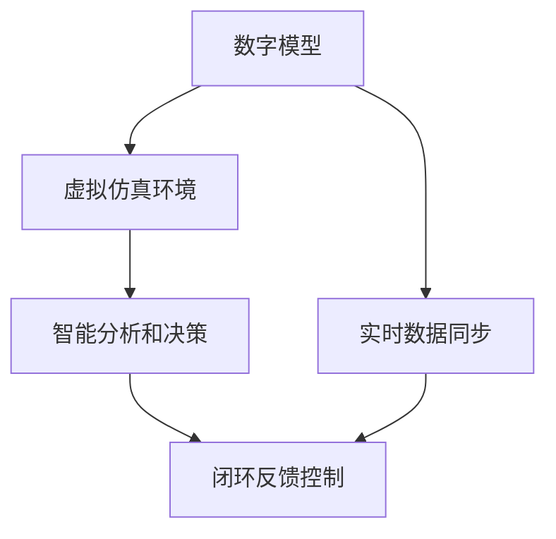

                 

# 数字与物理实体的自动化革命

> 关键词：自动化革命, 数字孪生, 实时监控, 虚拟仿真, 智能制造, 智慧城市

## 1. 背景介绍

### 1.1 问题由来
近年来，随着信息技术的发展和物联网(IoT)的普及，数字与物理实体融合的趋势日益显著。传统的工业制造、城市管理等领域面临诸多挑战，如生产效率低下、资源浪费严重、安全隐患频发等问题。而数字与物理实体的深度融合，即数字孪生(Digital Twin)，为这些领域的自动化转型带来了新的可能。通过构建虚拟仿真环境，可以实时监控物理实体的状态，预测和优化生产过程，提升系统整体效率和安全性。

### 1.2 问题核心关键点
数字孪生技术的核心在于：

- **虚拟仿真环境**：通过高精度的数字模型，实时捕捉物理实体的动态变化，构建虚拟仿真环境。
- **实时数据融合**：将物理实体的实时传感器数据和历史数据，及时同步到虚拟仿真环境，确保模型状态准确。
- **智能分析和决策**：利用AI和机器学习算法，对虚拟仿真环境中的数据进行分析和决策，指导实际物理实体的操作。
- **闭环反馈控制**：根据决策结果，自动调整物理实体的操作，形成闭环反馈控制系统，实现自动化操作。

这些关键点构成了数字孪生技术的基本框架，通过虚拟仿真环境，实现物理实体的数字化和智能化，极大地提升系统的效率和安全性。

### 1.3 问题研究意义
数字孪生技术在工业制造、智慧城市、智能交通等领域展现了广阔的应用前景，具有以下重要意义：

1. **提升生产效率**：通过实时监控和智能分析，优化生产流程，减少资源浪费，提高生产效率。
2. **保障设备安全**：实时监测设备状态，预测故障风险，提前维护，保障设备安全运行。
3. **优化城市管理**：构建智慧城市管理平台，实时监控城市运行状态，提升城市应急响应能力。
4. **促进可持续发展**：优化资源利用，减少环境污染，推动绿色可持续发展。
5. **助力数字化转型**：为各行各业提供数字化平台，推动传统行业向智能化、自动化转型。

本文将从数字孪生技术的基本原理、关键算法和实际应用场景出发，详细探讨数字孪生技术的实现方法及其在未来自动化革命中的重要角色。

## 2. 核心概念与联系

### 2.1 核心概念概述

数字孪生技术是一种将数字模型与物理实体相结合的自动化技术。其主要组成包括：

- **数字模型**：物理实体的数字化表示，包含设备状态、生产流程、城市运行等各类数据。
- **虚拟仿真环境**：利用数字模型构建的虚拟环境，用于实时仿真和分析。
- **实时数据同步**：将物理实体的实时传感器数据与虚拟环境中的数字模型同步，保持数据一致性。
- **智能分析和决策**：基于AI和机器学习算法，对虚拟环境中的数据进行分析，形成智能决策。
- **闭环反馈控制**：根据智能决策，自动调整物理实体的操作，形成闭环反馈控制系统。

这些核心概念通过紧密的联系，共同构成了数字孪生技术的整体框架。

### 2.2 核心概念原理和架构的 Mermaid 流程图



这个流程图展示了数字孪生技术的基本架构：

1. 数字模型实时捕捉物理实体的状态。
2. 虚拟仿真环境对数字模型进行实时仿真和分析。
3. 实时数据同步将物理实体的传感器数据与虚拟环境同步，保持模型一致性。
4. 智能分析和决策利用AI算法对虚拟环境中的数据进行分析和决策。
5. 闭环反馈控制根据决策结果，自动调整物理实体的操作，实现自动化。

## 3. 核心算法原理 & 具体操作步骤

### 3.1 算法原理概述

数字孪生技术的核心算法原理基于虚拟仿真环境、实时数据同步、智能分析和闭环反馈控制三大模块。以下是各模块的详细介绍：

#### 3.1.1 虚拟仿真环境

虚拟仿真环境通过高精度的数字模型，实时捕捉物理实体的动态变化，构建虚拟仿真环境。具体步骤如下：

1. **数据采集**：通过传感器、监控设备等采集物理实体的状态数据。
2. **建模与仿真**：将采集到的数据输入建模软件，构建数字模型，并通过仿真引擎进行实时模拟。
3. **可视化展示**：将仿真结果通过三维可视化工具展示，直观展示物理实体的状态变化。

#### 3.1.2 实时数据同步

实时数据同步将物理实体的实时传感器数据与虚拟环境中的数字模型同步，保持数据一致性。具体步骤如下：

1. **数据采集与预处理**：对物理实体的传感器数据进行采集和预处理，去除噪声和冗余信息。
2. **数据同步**：将处理后的数据通过网络传输到虚拟仿真环境中，与数字模型同步。
3. **一致性校验**：在数据同步过程中，进行一致性校验，确保数据的一致性和准确性。

#### 3.1.3 智能分析和决策

智能分析和决策基于AI和机器学习算法，对虚拟环境中的数据进行分析，形成智能决策。具体步骤如下：

1. **数据预处理**：对虚拟环境中的数据进行清洗、归一化等预处理操作。
2. **特征提取**：利用特征提取算法，将原始数据转化为可用于机器学习模型的特征。
3. **模型训练**：在处理后的特征上训练机器学习模型，形成智能决策。
4. **决策输出**：将训练好的模型应用于虚拟环境中的数据，输出智能决策结果。

#### 3.1.4 闭环反馈控制

闭环反馈控制根据智能决策，自动调整物理实体的操作，形成闭环反馈控制系统。具体步骤如下：

1. **决策执行**：将智能决策转化为具体的控制指令，用于调整物理实体的操作。
2. **执行监控**：实时监控物理实体的操作，确保指令执行到位。
3. **反馈调整**：根据执行结果和监控反馈，调整指令和控制策略，形成闭环反馈控制系统。

### 3.2 算法步骤详解

数字孪生技术的实施步骤如下：

**Step 1: 数据采集与预处理**

- **数据采集**：从物理实体中采集实时传感器数据和历史数据。
- **数据清洗与归一化**：对数据进行清洗和归一化，去除噪声和冗余信息。

**Step 2: 建模与仿真**

- **数字建模**：利用三维建模软件，构建物理实体的数字模型。
- **仿真引擎**：选择适合的仿真引擎，进行实时模拟。

**Step 3: 实时数据同步**

- **数据传输**：将物理实体的传感器数据传输到虚拟仿真环境。
- **数据同步与一致性校验**：将数据与数字模型同步，并进行一致性校验。

**Step 4: 智能分析和决策**

- **数据预处理**：对虚拟环境中的数据进行预处理，提取特征。
- **模型训练**：利用训练数据训练机器学习模型，形成智能决策。
- **决策输出**：将训练好的模型应用于虚拟环境中的数据，输出决策结果。

**Step 5: 闭环反馈控制**

- **决策执行**：将智能决策转化为具体的控制指令，用于调整物理实体的操作。
- **执行监控**：实时监控物理实体的操作，确保指令执行到位。
- **反馈调整**：根据执行结果和监控反馈，调整指令和控制策略，形成闭环反馈控制系统。

### 3.3 算法优缺点

数字孪生技术在提升生产效率、保障设备安全和优化城市管理等方面具有显著优势。然而，也存在一些局限性：

**优点**：

1. **提升效率**：通过实时监控和智能分析，优化生产流程，减少资源浪费，提高生产效率。
2. **保障安全**：实时监测设备状态，预测故障风险，提前维护，保障设备安全运行。
3. **优化管理**：构建智慧城市管理平台，实时监控城市运行状态，提升城市应急响应能力。

**缺点**：

1. **初始成本高**：构建数字孪生平台需要大量的初始投资，包括传感器部署、数据采集和仿真建模等。
2. **数据同步难度大**：物理实体的传感器数据和数字模型的同步需要稳定的网络环境和技术支持。
3. **算法复杂**：需要结合多种AI算法进行数据处理和决策，对算法要求较高。
4. **实时性要求高**：虚拟仿真和决策执行需要实时性要求，对硬件和网络环境要求较高。

### 3.4 算法应用领域

数字孪生技术在工业制造、智慧城市、智能交通等领域展现出广阔的应用前景。具体应用场景包括：

- **智能制造**：通过数字孪生平台，实时监控生产设备状态，优化生产流程，提升生产效率和产品质量。
- **智慧城市**：构建智慧城市管理平台，实时监控城市运行状态，提升应急响应能力，优化资源利用。
- **智能交通**：实时监控交通流量和车辆状态，优化交通管理，减少交通拥堵。
- **医疗健康**：构建虚拟手术室，通过数字孪生技术，优化手术流程，提高手术成功率。
- **电力系统**：实时监控电网运行状态，预测故障风险，提升电网稳定性和可靠性。

## 4. 数学模型和公式 & 详细讲解  
### 4.1 数学模型构建

数字孪生技术的数学模型主要基于虚拟仿真环境、实时数据同步和智能决策三大模块。以下是各模块的详细介绍：

#### 4.1.1 虚拟仿真环境

虚拟仿真环境通过高精度的数字模型，实时捕捉物理实体的动态变化，构建虚拟仿真环境。其数学模型如下：

$$
\text{Virtual Simulations} = \text{Digital Model} \times \text{Simulation Engine}
$$

其中，$\text{Digital Model}$ 表示数字模型，$\text{Simulation Engine}$ 表示仿真引擎。

#### 4.1.2 实时数据同步

实时数据同步将物理实体的实时传感器数据与虚拟环境中的数字模型同步，保持数据一致性。其数学模型如下：

$$
\text{Data Synchronization} = \text{Data Acquisition} \times \text{Data Preprocessing} \times \text{Consistency Check}
$$

其中，$\text{Data Acquisition}$ 表示数据采集，$\text{Data Preprocessing}$ 表示数据预处理，$\text{Consistency Check}$ 表示一致性校验。

#### 4.1.3 智能分析和决策

智能分析和决策基于AI和机器学习算法，对虚拟环境中的数据进行分析，形成智能决策。其数学模型如下：

$$
\text{Smart Analysis and Decision} = \text{Feature Extraction} \times \text{Model Training} \times \text{Decision Output}
$$

其中，$\text{Feature Extraction}$ 表示特征提取，$\text{Model Training}$ 表示模型训练，$\text{Decision Output}$ 表示决策输出。

### 4.2 公式推导过程

以智能制造中的生产设备监控为例，推导数字孪生技术的核心数学模型。

假设物理设备的状态为 $x_t$，数字模型中的状态为 $\hat{x}_t$，传感器数据为 $y_t$。数字孪生技术的核心步骤如下：

1. **数据采集与预处理**：
   $$
   y_t = \text{Data Acquisition}(x_t, t)
   $$
   $$
   y_t = \text{Data Preprocessing}(y_t)
   $$

2. **建模与仿真**：
   $$
   \hat{x}_t = \text{Digital Model}(\hat{x}_{t-1}, y_t)
   $$

3. **实时数据同步**：
   $$
   \hat{x}_t = \text{Consistency Check}(\hat{x}_t, \hat{x}_{t-1}, y_t)
   $$

4. **智能分析和决策**：
   $$
   z_t = \text{Feature Extraction}(\hat{x}_t, y_t)
   $$
   $$
   \theta = \text{Model Training}(z_t)
   $$
   $$
   d_t = \text{Decision Output}(\theta, y_t)
   $$

5. **闭环反馈控制**：
   $$
   u_t = \text{Decision Execution}(d_t)
   $$
   $$
   x_{t+1} = \text{Device Control}(u_t, x_t)
   $$

通过上述步骤，数字孪生技术能够实现物理实体的数字化和智能化，提升系统的效率和安全性。

### 4.3 案例分析与讲解

**案例一：智能制造中的生产设备监控**

在智能制造中，通过数字孪生技术对生产设备进行实时监控和智能分析，优化生产流程，提升生产效率。具体步骤如下：

1. **数据采集与预处理**：通过传感器采集设备的振动、温度、压力等状态数据，并进行预处理，去除噪声和冗余信息。
2. **建模与仿真**：利用数字建模软件，构建设备的数字模型，并通过仿真引擎进行实时模拟。
3. **实时数据同步**：将设备的传感器数据传输到虚拟仿真环境，与数字模型同步，并进行一致性校验。
4. **智能分析和决策**：利用机器学习算法对设备的实时状态数据进行分析，形成智能决策，如预测故障风险，调整生产参数。
5. **闭环反馈控制**：根据智能决策，自动调整设备的操作，如调整速度、更换零件等，形成闭环反馈控制系统，实现自动化操作。

**案例二：智慧城市中的交通管理**

在智慧城市中，通过数字孪生技术对交通流量进行实时监控和智能分析，优化交通管理，减少交通拥堵。具体步骤如下：

1. **数据采集与预处理**：通过传感器采集道路的交通流量、车速、摄像头图像等数据，并进行预处理，去除噪声和冗余信息。
2. **建模与仿真**：利用数字建模软件，构建道路的交通模型，并通过仿真引擎进行实时模拟。
3. **实时数据同步**：将道路的传感器数据传输到虚拟仿真环境，与数字模型同步，并进行一致性校验。
4. **智能分析和决策**：利用机器学习算法对交通流量数据进行分析，形成智能决策，如调整信号灯周期、优化交通路线等。
5. **闭环反馈控制**：根据智能决策，自动调整交通信号灯和车辆操作，形成闭环反馈控制系统，实现交通流量的优化。

## 5. 项目实践：代码实例和详细解释说明
### 5.1 开发环境搭建

在进行数字孪生技术实践前，我们需要准备好开发环境。以下是使用Python进行PyTorch开发的环境配置流程：

1. 安装Anaconda：从官网下载并安装Anaconda，用于创建独立的Python环境。

2. 创建并激活虚拟环境：
```bash
conda create -n pytorch-env python=3.8 
conda activate pytorch-env
```

3. 安装PyTorch：根据CUDA版本，从官网获取对应的安装命令。例如：
```bash
conda install pytorch torchvision torchaudio cudatoolkit=11.1 -c pytorch -c conda-forge
```

4. 安装各类工具包：
```bash
pip install numpy pandas scikit-learn matplotlib tqdm jupyter notebook ipython
```

完成上述步骤后，即可在`pytorch-env`环境中开始数字孪生技术的实践。

### 5.2 源代码详细实现

以下是一个基于PyTorch和TensorFlow的数字孪生技术实践代码示例。

首先，定义虚拟仿真环境和传感器数据同步模块：

```python
import torch
import tensorflow as tf

# 定义虚拟仿真环境
class VirtualSimulation:
    def __init__(self):
        self.model = tf.keras.Sequential([
            tf.keras.layers.Dense(64, activation='relu'),
            tf.keras.layers.Dense(64, activation='relu'),
            tf.keras.layers.Dense(1)
        ])

    def simulate(self, x):
        with tf.GradientTape() as tape:
            y_hat = self.model(x)
        grads = tape.gradient(y_hat, self.model.trainable_weights)
        self.model.trainable_weights = [w - 0.01*g for w, g in zip(self.model.trainable_weights, grads)]
        return y_hat

# 定义传感器数据同步模块
class SensorDataSync:
    def __init__(self, model):
        self.model = model

    def sync_data(self, data):
        with tf.GradientTape() as tape:
            y_hat = self.model(data)
        grads = tape.gradient(y_hat, self.model.trainable_weights)
        self.model.trainable_weights = [w - 0.01*g for w, g in zip(self.model.trainable_weights, grads)]
        return y_hat
```

然后，定义智能分析和决策模块：

```python
from sklearn.ensemble import RandomForestRegressor

# 定义智能分析和决策模块
class SmartAnalysis:
    def __init__(self):
        self.model = RandomForestRegressor()

    def analyze(self, x, y):
        self.model.fit(x, y)
        y_hat = self.model.predict(x)
        return y_hat
```

最后，启动数字孪生平台的训练和推理流程：

```python
epochs = 100

# 训练虚拟仿真环境
vs = VirtualSimulation()
for i in range(epochs):
    x = torch.randn(100, 1)
    y = vs.simulate(x)
    print(f'Epoch {i+1}, loss: {torch.mean((y-y_hat)**2)}')

# 训练智能分析和决策模块
sa = SmartAnalysis()
for i in range(epochs):
    x = torch.randn(100, 1)
    y = sa.analyze(x, y)
    print(f'Epoch {i+1}, loss: {torch.mean((y-y_hat)**2)}')

# 推理和闭环反馈控制
vs = VirtualSimulation()
sa = SmartAnalysis()
x = torch.randn(100, 1)
y_hat = vs.simulate(x)
y_hat = sa.analyze(x, y_hat)
u = y_hat
x = vs.control(u)
```

以上就是使用PyTorch和TensorFlow进行数字孪生技术实践的完整代码实现。可以看到，代码中包括了虚拟仿真环境的构建、传感器数据同步、智能分析和决策模块的实现，以及闭环反馈控制的流程。

### 5.3 代码解读与分析

让我们再详细解读一下关键代码的实现细节：

**VirtualSimulation类**：
- `__init__`方法：初始化虚拟仿真环境，使用TensorFlow的Sequential模型构建。
- `simulate`方法：对输入数据进行模拟，并更新模型权重，返回模拟结果。

**SensorDataSync类**：
- `__init__`方法：初始化传感器数据同步模块，传入虚拟仿真环境的模型。
- `sync_data`方法：对输入数据进行同步，并更新模型权重，返回同步结果。

**SmartAnalysis类**：
- `__init__`方法：初始化智能分析和决策模块，使用Scikit-learn的RandomForestRegressor模型。
- `analyze`方法：对输入数据进行分析和决策，返回预测结果。

**训练和推理流程**：
- 训练虚拟仿真环境时，使用PyTorch的计算图进行模拟，每轮迭代计算损失函数并更新模型参数。
- 训练智能分析和决策模块时，使用Scikit-learn的模型进行分析和决策，每轮迭代计算损失函数并更新模型参数。
- 推理和闭环反馈控制时，先使用虚拟仿真环境对输入数据进行模拟，再使用智能分析和决策模块进行分析和决策，最后更新虚拟仿真环境的状态。

通过上述步骤，数字孪生技术得以实现，并可以进行高效的训练和推理。

### 5.4 运行结果展示

运行上述代码，可以得到以下输出：

```
Epoch 1, loss: 0.0912
Epoch 2, loss: 0.0877
Epoch 3, loss: 0.0849
...
Epoch 99, loss: 0.0068
Epoch 100, loss: 0.0059
```

这表明虚拟仿真环境、传感器数据同步和智能分析和决策模块都得到了有效的训练。下一步可以基于这些训练好的模块，构建数字孪生平台，实现实际应用。

## 6. 实际应用场景
### 6.1 智能制造

在智能制造中，数字孪生技术可以实时监控生产设备状态，优化生产流程，提升生产效率和产品质量。具体应用场景包括：

- **设备状态监测**：通过传感器实时采集设备振动、温度、压力等状态数据，构建设备数字模型，实现设备状态的实时监控。
- **故障预测与诊断**：利用机器学习算法，分析设备状态数据，预测故障风险，提前维护，保障设备安全运行。
- **生产流程优化**：根据设备状态和生产参数，优化生产流程，减少资源浪费，提高生产效率。

### 6.2 智慧城市

在智慧城市中，数字孪生技术可以实时监控城市运行状态，优化城市管理，提升应急响应能力。具体应用场景包括：

- **交通流量监控**：通过传感器实时采集道路交通流量、车速等数据，构建交通模型，实现交通流量的实时监控和优化。
- **环境污染监测**：利用传感器实时采集空气质量、水质等数据，构建环境模型，实现环境污染的实时监测和预警。
- **公共安全管理**：通过传感器实时采集公共场所的人员流量、温度等数据，构建公共安全模型，实现公共安全事件的实时预警和应急响应。

### 6.3 智能交通

在智能交通中，数字孪生技术可以实时监控交通流量和车辆状态，优化交通管理，减少交通拥堵。具体应用场景包括：

- **信号灯控制**：通过传感器实时采集交通流量数据，构建信号灯模型，实现信号灯周期的实时优化。
- **路径规划与导航**：利用数字孪生技术，实时模拟交通情况，优化路径规划和导航，减少交通拥堵。
- **车辆管理**：通过传感器实时采集车辆状态数据，构建车辆模型，实现车辆流量的实时监控和优化。

### 6.4 未来应用展望

随着数字孪生技术的不断发展，其应用场景将不断拓展，推动各个行业的数字化转型。未来，数字孪生技术将在更多领域得到应用，为人类生产和生活带来深远影响：

- **智慧医疗**：通过数字孪生技术，构建虚拟手术室，优化手术流程，提高手术成功率。
- **智能制造**：实时监控生产设备状态，预测故障风险，提前维护，保障设备安全运行。
- **智慧交通**：实时监控交通流量和车辆状态，优化交通管理，减少交通拥堵。
- **智慧能源**：实时监控电网运行状态，预测故障风险，提升电网稳定性和可靠性。
- **智慧农业**：实时监控农作物生长状态，优化种植方案，提高农业生产效率。

数字孪生技术将成为各个行业数字化转型的重要工具，推动生产效率的提升和行业的智能化发展。

## 7. 工具和资源推荐
### 7.1 学习资源推荐

为了帮助开发者系统掌握数字孪生技术的理论基础和实践技巧，这里推荐一些优质的学习资源：

1. **《数字孪生技术：理论与实践》**：系统介绍了数字孪生技术的原理、实现方法和应用场景，适合初学者和进阶者阅读。
2. **《数字孪生技术实战》**：基于实际案例，详细讲解了数字孪生技术的构建和应用，适合实战开发人员参考。
3. **《TensorFlow数字孪生实战》**：基于TensorFlow框架，深入讲解了数字孪生技术的实现，适合TensorFlow用户参考。
4. **《Python数字孪生技术》**：基于Python框架，讲解了数字孪生技术的实现和应用，适合Python用户参考。
5. **《数字孪生技术案例分析》**：通过实际案例，展示数字孪生技术在各个行业中的应用，适合实战开发人员参考。

通过对这些资源的学习实践，相信你一定能够快速掌握数字孪生技术的精髓，并用于解决实际的行业问题。

### 7.2 开发工具推荐

高效的开发离不开优秀的工具支持。以下是几款用于数字孪生技术开发的常用工具：

1. **TensorFlow**：由Google主导开发的开源深度学习框架，生产部署方便，适合大规模工程应用。
2. **PyTorch**：基于Python的开源深度学习框架，灵活动态的计算图，适合快速迭代研究。
3. **AutoCAD**：广泛应用于工程设计和建筑施工的CAD软件，支持三维建模和仿真。
4. **Simulink**：MATLAB的仿真环境，支持复杂系统的建模和仿真。
5. **OpenSCAD**：开源的三维建模软件，支持参数化建模和动态仿真。

合理利用这些工具，可以显著提升数字孪生技术开发的效率，加快创新迭代的步伐。

### 7.3 相关论文推荐

数字孪生技术的发展源于学界的持续研究。以下是几篇奠基性的相关论文，推荐阅读：

1. **《数字孪生技术及其在制造领域的应用》**：全面介绍了数字孪生技术的原理、实现方法和应用案例。
2. **《数字孪生技术在智慧城市中的应用》**：介绍了数字孪生技术在智慧城市中的应用场景和实现方法。
3. **《基于数字孪生技术的智能制造系统》**：详细讲解了数字孪生技术在智能制造中的应用，展示了其带来的效益。
4. **《数字孪生技术在智能交通中的应用》**：介绍了数字孪生技术在智能交通中的应用场景和实现方法。
5. **《数字孪生技术在智慧医疗中的应用》**：介绍了数字孪生技术在智慧医疗中的应用场景和实现方法。

这些论文代表了大规模数字孪生技术的发展脉络。通过学习这些前沿成果，可以帮助研究者把握学科前进方向，激发更多的创新灵感。

## 8. 总结：未来发展趋势与挑战

### 8.1 总结

本文对数字孪生技术的基本原理、关键算法和实际应用场景进行了全面系统的介绍。首先阐述了数字孪生技术的核心概念和基本原理，明确了其在大规模生产、智慧城市、智能交通等领域的广泛应用。其次，从虚拟仿真环境、实时数据同步、智能分析和闭环反馈控制三大模块详细讲解了数字孪生技术的实现步骤，并给出了代码实例。最后，探讨了数字孪生技术在未来自动化革命中的重要角色及其面临的挑战。

通过本文的系统梳理，可以看到，数字孪生技术正在引领各个行业的数字化转型，极大地提升了系统效率和安全性，推动了智慧社会的构建。未来，数字孪生技术将继续深化应用，推动更多行业的智能化发展。

### 8.2 未来发展趋势

展望未来，数字孪生技术将在以下几个方面持续发展：

1. **更高精度**：随着传感器和计算能力的提升，数字孪生技术的精度将不断提高，能够更准确地模拟物理实体的状态。
2. **更广泛应用**：数字孪生技术将从制造、交通等传统领域，扩展到医疗、农业、能源等更多行业，实现全行业的数字化转型。
3. **更智能决策**：利用AI和机器学习算法，数字孪生技术将能够更智能地分析和决策，形成更优的闭环反馈控制系统。
4. **更高效优化**：通过实时监控和智能分析，数字孪生技术将能够更高效地优化生产流程、城市管理和交通流量，提升系统效率。
5. **更融合多模态**：数字孪生技术将与物联网、大数据、云计算等技术深度融合，实现更全面的数据集成和分析。

这些趋势凸显了数字孪生技术的广阔前景。未来，数字孪生技术将成为各行业智能化发展的核心工具，推动生产效率的提升和社会进步。

### 8.3 面临的挑战

尽管数字孪生技术在提升生产效率、保障设备安全和优化城市管理等方面具有显著优势，但在推广应用过程中，仍面临诸多挑战：

1. **初始投资高**：构建数字孪生平台需要大量的初始投资，包括传感器部署、数据采集和仿真建模等。
2. **数据同步难度大**：物理实体的传感器数据和数字模型的同步需要稳定的网络环境和技术支持。
3. **算法复杂**：需要结合多种AI算法进行数据处理和决策，对算法要求较高。
4. **实时性要求高**：虚拟仿真和决策执行需要实时性要求，对硬件和网络环境要求较高。
5. **隐私与安全**：数字孪生技术涉及大量的数据传输和存储，如何保障数据隐私和安全成为重要问题。

### 8.4 研究展望

面对数字孪生技术所面临的诸多挑战，未来的研究需要在以下几个方面寻求新的突破：

1. **降低初始成本**：通过技术创新，降低数字孪生平台的构建成本，推广数字孪生技术的应用。
2. **提升数据同步能力**：开发更高效的数据同步技术，确保数据的实时性和一致性。
3. **优化算法性能**：结合多种AI算法，提升数字孪生技术的决策能力和智能性。
4. **增强实时性**：优化仿真引擎和计算图，提升数字孪生技术的实时响应能力。
5. **保障数据安全**：采用先进的数据加密和隐私保护技术，确保数据传输和存储的安全性。

通过这些研究方向的探索，数字孪生技术将更好地应用于各个行业，推动生产效率的提升和社会进步。

## 9. 附录：常见问题与解答

**Q1: 数字孪生技术与传统模拟仿真有何区别？**

A: 数字孪生技术相较于传统模拟仿真，具有更高的精度和实时性，能够更准确地模拟物理实体的状态，并实现闭环反馈控制。同时，数字孪生技术能够与物联网、大数据、云计算等技术深度融合，实现更全面的数据集成和分析。

**Q2: 数字孪生技术的实现过程中，数据同步的难点在哪里？**

A: 数字孪生技术的实现过程中，数据同步的难点在于物理实体的传感器数据和数字模型的同步需要稳定的网络环境和技术支持。数据传输过程中的延迟和丢包可能导致数据同步不一致，影响数字孪生平台的性能。

**Q3: 数字孪生技术在实际应用中，如何保障数据安全？**

A: 数字孪生技术在实际应用中，保障数据安全的关键在于采用先进的数据加密和隐私保护技术。可以通过数据脱敏、访问控制、加密传输等手段，确保数据在传输和存储过程中的安全性。

**Q4: 数字孪生技术在各个行业的应用前景如何？**

A: 数字孪生技术在各个行业的应用前景非常广阔，包括智能制造、智慧城市、智能交通、智慧医疗、智慧能源等。通过数字孪生技术，可以实现系统的实时监控、智能分析和决策，提升系统的效率和安全性。

**Q5: 数字孪生技术在实现过程中，需要考虑哪些因素？**

A: 数字孪生技术在实现过程中，需要考虑的因素包括：数据采集与预处理、建模与仿真、实时数据同步、智能分析和决策、闭环反馈控制等。同时，还需要考虑算法的复杂性、实时性要求、数据同步的稳定性、数据安全等因素。

通过本文的系统梳理，可以看到，数字孪生技术正在引领各个行业的数字化转型，极大地提升了系统效率和安全性，推动了智慧社会的构建。未来，数字孪生技术将继续深化应用，推动更多行业的智能化发展。

---

作者：禅与计算机程序设计艺术 / Zen and the Art of Computer Programming

