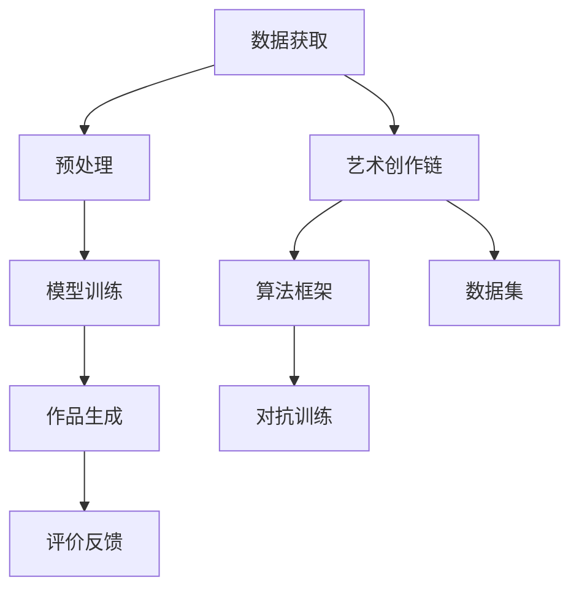

                 

# 数字化创造力：AI激发的艺术革新

## 1. 背景介绍

### 1.1 问题由来

随着人工智能技术的飞速发展，数字技术在艺术创作领域的应用也日渐广泛。从生成艺术作品的算法、创作交互式艺术品的软件，到用于辅助艺术研究和教育的工具，AI正不断挑战和重塑艺术创作的传统范式。

艺术创作一直被认为是人类情感和创造力的体现，而数字技术，特别是人工智能技术的融入，为艺术创作带来了新的可能性和挑战。AI不仅能够生成新颖独特的艺术作品，还能通过深度学习和算法优化，激发艺术家的新思维，推动艺术与技术的深度融合。

### 1.2 问题核心关键点

当前，AI在艺术创作中应用的核心关键点在于算法、数据和艺术的结合，以及如何通过这些技术手段，激发艺术家的创造力，并创造新颖的艺术作品。其技术核心包括：

- **算法框架**：用于生成艺术作品的算法，如GAN、VAE、对抗生成网络等。
- **数据集**：提供多样化和高质量的艺术创作数据，是算法优化的基础。
- **艺术创作链**：包括数据预处理、模型训练、作品生成、评价反馈等环节。

## 2. 核心概念与联系

### 2.1 核心概念概述

为了更好地理解AI在艺术创作中的应用，本节将介绍几个关键概念：

- **生成对抗网络(GANs)**：通过两个神经网络，一个生成网络生成艺术作品，另一个判别网络判断生成的作品是真是假，通过对抗训练，生成网络不断优化生成效果。
- **变分自编码器(VAEs)**：通过将输入数据映射到一个潜在空间的随机变量，并通过解码器重构回原始数据，实现数据压缩和生成。
- **对抗生成网络(Adversarial Generative Networks, A-GANs)**：在GAN基础上，加入对抗训练，进一步提升生成质量。
- **艺术创作过程**：包括数据获取、预处理、模型训练、作品生成、评价反馈等环节，是一个完整的创作链。

这些核心概念之间的逻辑关系可以通过以下Mermaid流程图来展示：



这个流程图展示了大模型在艺术创作中的核心概念及其之间的关系：

1. 数据获取和预处理是创作的起点。
2. 模型训练过程利用算法框架优化生成效果。
3. 作品生成是创作的核心环节。
4. 评价反馈环节对创作结果进行评估，不断优化模型。
5. 艺术创作链是整个过程的串联。
6. 算法框架和数据集是创作的基础。
7. 对抗训练是提升生成质量的关键步骤。

## 3. 核心算法原理 & 具体操作步骤
### 3.1 算法原理概述

基于深度学习的艺术创作，其核心思想是通过神经网络学习数据特征，并生成新的艺术作品。这一过程通常包括以下几个关键步骤：

1. **数据准备**：收集和处理用于训练的数据，如图片、音乐、文本等。
2. **模型构建**：选择合适的神经网络模型，并对其进行训练。
3. **生成过程**：通过训练好的模型，生成新的艺术作品。
4. **评价反馈**：对生成的作品进行评价和反馈，调整模型参数。
5. **应用部署**：将模型部署到实际应用中，生成具有创造力的艺术作品。

### 3.2 算法步骤详解

#### 3.2.1 数据准备

数据准备是艺术创作的基础，包括数据收集、清洗、标注等环节。常见的艺术数据集包括：

- **图片数据集**：如Flickr艺术数据集、Pinterest数据集等。
- **音乐数据集**：如IMDB电影评论、Amazon产品评论等。
- **文本数据集**：如Gutenberg电子书、维基百科页面等。

#### 3.2.2 模型构建

模型的选择和构建是艺术创作的核心。目前，常用的模型包括：

- **卷积神经网络(CNN)**：主要用于图像生成，如CycleGAN、ImageNet等。
- **循环神经网络(RNN)**：主要用于生成序列数据，如LSTM、GRU等。
- **生成对抗网络(GANs)**：通过生成器和判别器的对抗训练，生成高质量的图像、音乐、文本等。

#### 3.2.3 生成过程

生成过程是模型训练和应用的核心。通常，生成过程包括以下步骤：

1. **前向传播**：将输入数据送入模型，得到中间特征表示。
2. **后向传播**：计算模型损失，并更新模型参数。
3. **重复迭代**：通过多次前向和后向传播，不断优化模型参数。

#### 3.2.4 评价反馈

评价反馈是模型优化的重要环节。常见的评价指标包括：

- **重建误差**：评估生成的艺术作品与原始数据之间的差异。
- **可视化效果**：通过人工或自动评价，观察生成作品的艺术效果。
- **交互评价**：通过用户互动，获取对生成作品的反馈。

#### 3.2.5 应用部署

应用部署是将模型应用于实际创作的过程。常见的应用方式包括：

- **直接生成**：通过模型直接生成新的艺术作品。
- **交互创作**：艺术家通过控制生成过程，与AI协作创作艺术作品。
- **混合应用**：将AI生成的作品与人类创作相结合，创造更复杂和独特的艺术作品。

### 3.3 算法优缺点

#### 3.3.1 优点

基于深度学习的艺术创作具有以下优点：

1. **高效生成**：通过大规模数据训练，能够快速生成高质量的艺术作品。
2. **创新性高**：AI能够发现人类难以发现的数据特征，生成独特的艺术作品。
3. **灵活性大**：可以根据不同的创作需求，调整模型参数，实现多样化创作。
4. **自动化程度高**：通过自动化的评价和反馈，提升创作效率。

#### 3.3.2 缺点

基于深度学习的艺术创作也存在一些缺点：

1. **依赖数据**：需要大量高质量的数据进行训练，数据获取和标注成本较高。
2. **缺乏情感**：生成的艺术作品往往缺乏人类创作的情感和个性。
3. **模型复杂**：深度学习模型参数较多，计算复杂度较高，需要高性能硬件支持。
4. **不可解释性**：模型训练过程和生成过程缺乏可解释性，难以理解其生成逻辑。

## 4. 数学模型和公式 & 详细讲解 & 举例说明

### 4.1 数学模型构建

艺术创作过程中的数学模型构建，主要涉及生成对抗网络(GANs)和变分自编码器(VAEs)。

#### 4.1.1 GANs模型

GANs模型由生成器$G$和判别器$D$两部分组成，目标函数为：

$$
\min_{G} \max_{D} \mathbb{E}_{x \sim p_{data}} [\log D(x)] + \mathbb{E}_{z \sim p_{z}} [\log(1-D(G(z)))]
$$

其中，$z$为生成器输入的随机噪声向量，$p_{data}$为数据分布，$p_{z}$为噪声分布。

#### 4.1.2 VAEs模型

VAEs模型通过编码器$E$和解码器$D$将输入数据映射到潜在空间，并重构回原始数据。其目标函数为：

$$
\min_{E,D} \mathbb{E}_{x \sim p_{data}} [\|\mu(x)\|^2] + \mathbb{E}_{x \sim p_{data}} [-\log \det(\sigma(x))]
$$

其中，$\mu(x)$为编码器的输出，$\sigma(x)$为解码器的输出，$p_{data}$为数据分布。

### 4.2 公式推导过程

#### 4.2.1 GANs推导

GANs的推导过程相对复杂，但主要涉及生成器和判别器的梯度计算。以GANs为例，生成器的梯度为：

$$
\nabla_G L(G) = \nabla_G \mathbb{E}_{z \sim p_{z}} [\log(1-D(G(z)))]
$$

判别器的梯度为：

$$
\nabla_D L(D) = \nabla_D \mathbb{E}_{x \sim p_{data}} [\log D(x)] + \nabla_D \mathbb{E}_{z \sim p_{z}} [-\log(1-D(G(z))))
$$

通过交替优化生成器和判别器，可以提升生成质量。

#### 4.2.2 VAEs推导

VAEs的推导相对简单，主要涉及编码器和解码器的梯度计算。以VAEs为例，编码器的梯度为：

$$
\nabla_E L(E) = \nabla_E \mathbb{E}_{x \sim p_{data}} [\|\mu(x)\|^2] + \nabla_E \mathbb{E}_{x \sim p_{data}} [-\log \det(\sigma(x))]
$$

解码器的梯度为：

$$
\nabla_D L(D) = \nabla_D \mathbb{E}_{x \sim p_{data}} [-\log \det(\sigma(x))]
$$

通过交替优化编码器和解码器，可以提升生成效果。

### 4.3 案例分析与讲解

#### 4.3.1 GANs案例

GANs在艺术创作中应用广泛，如通过GANs生成高质量的艺术作品、音乐等。以GANs生成艺术图片为例：

1. **数据准备**：收集和清洗大量艺术图片数据。
2. **模型构建**：选择GANs架构，如DCGAN、WGAN等。
3. **生成过程**：将随机噪声向量$z$输入生成器，生成新的艺术图片。
4. **评价反馈**：通过重建误差、可视化效果等指标评估生成图片质量。
5. **应用部署**：将生成图片应用于艺术创作中。

#### 4.3.2 VAEs案例

VAEs在艺术创作中也得到了广泛应用，如通过VAEs生成音乐、文本等。以VAEs生成音乐为例：

1. **数据准备**：收集和清洗大量音乐数据。
2. **模型构建**：选择VAEs架构，如VAE、β-VAE等。
3. **生成过程**：将音乐片段输入编码器，生成潜在空间向量。
4. **重构过程**：通过解码器将潜在向量重构回音乐片段。
5. **评价反馈**：通过重建误差、可视化效果等指标评估生成音乐质量。
6. **应用部署**：将生成音乐应用于艺术创作中。

## 5. 项目实践：代码实例和详细解释说明

### 5.1 开发环境搭建

在进行艺术创作应用开发前，我们需要准备好开发环境。以下是使用Python进行PyTorch开发的环境配置流程：

1. 安装Anaconda：从官网下载并安装Anaconda，用于创建独立的Python环境。

2. 创建并激活虚拟环境：
```bash
conda create -n pytorch-env python=3.8 
conda activate pytorch-env
```

3. 安装PyTorch：根据CUDA版本，从官网获取对应的安装命令。例如：
```bash
conda install pytorch torchvision torchaudio cudatoolkit=11.1 -c pytorch -c conda-forge
```

4. 安装PyTorch Lightning：用于加速模型训练和部署。
```bash
pip install torch-lightning
```

5. 安装各类工具包：
```bash
pip install numpy pandas scikit-learn matplotlib tqdm jupyter notebook ipython
```

完成上述步骤后，即可在`pytorch-env`环境中开始创作应用开发。

### 5.2 源代码详细实现

这里以GANs生成艺术图片为例，给出使用PyTorch进行GANs模型的PyTorch代码实现。

首先，定义GANs模型：

```python
import torch
import torch.nn as nn
import torch.nn.functional as F

class Generator(nn.Module):
    def __init__(self, z_dim, img_size):
        super(Generator, self).__init__()
        self.z_dim = z_dim
        self.img_size = img_size
        self.model = nn.Sequential(
            nn.Linear(z_dim, 256),
            nn.LeakyReLU(),
            nn.Linear(256, 512),
            nn.LeakyReLU(),
            nn.Linear(512, img_size * img_size),
            nn.Tanh()
        )

    def forward(self, x):
        x = self.model(x)
        x = x.view(-1, self.img_size, self.img_size)
        return x

class Discriminator(nn.Module):
    def __init__(self, img_size):
        super(Discriminator, self).__init__()
        self.img_size = img_size
        self.model = nn.Sequential(
            nn.Conv2d(1, 64, 4, 1, 0),
            nn.LeakyReLU(),
            nn.Conv2d(64, 128, 4, 2, 1),
            nn.LeakyReLU(),
            nn.Conv2d(128, 256, 4, 2, 1),
            nn.LeakyReLU(),
            nn.Conv2d(256, 1, 4, 1, 0),
            nn.Sigmoid()
        )

    def forward(self, x):
        x = self.model(x)
        return x.view(-1)

```

然后，定义优化器：

```python
from torch.optim import Adam

G = Generator(z_dim=100, img_size=64)
D = Discriminator(img_size=64)

G_optimizer = Adam(G.parameters(), lr=0.0002)
D_optimizer = Adam(D.parameters(), lr=0.0002)
```

接着，定义训练和评估函数：

```python
import torchvision.transforms as transforms
from torch.utils.data import DataLoader

def load_data():
    transform = transforms.Compose([
        transforms.Resize((64, 64)),
        transforms.ToTensor(),
    ])
    train_data = torchvision.datasets.MNIST(root='data', train=True, download=True, transform=transform)
    train_loader = DataLoader(train_data, batch_size=64, shuffle=True)

    return train_loader

def train_gan(model_G, model_D, train_loader, epochs=100):
    for epoch in range(epochs):
        for i, (img, _) in enumerate(train_loader):
            img = img.to(device)
            G_optimizer.zero_grad()
            D_optimizer.zero_grad()

            # Generate fake images
            z = torch.randn(batch_size, z_dim, device=device)
            fake_images = model_G(z)

            # Discriminator on real and fake images
            real_outputs = model_D(img)
            fake_outputs = model_D(fake_images)
            d_loss_real = F.binary_cross_entropy(real_outputs, torch.ones_like(real_outputs))
            d_loss_fake = F.binary_cross_entropy(fake_outputs, torch.zeros_like(fake_outputs))
            d_loss = d_loss_real + d_loss_fake

            # Generator on fake images
            z = torch.randn(batch_size, z_dim, device=device)
            fake_images = model_G(z)
            g_loss = F.binary_cross_entropy(model_D(fake_images), torch.ones_like(fake_images))

            # Backpropagation
            d_loss.backward()
            G_optimizer.step()
            d_loss.backward()
            D_optimizer.step()

            if (i+1) % 100 == 0:
                print(f"Epoch {epoch+1}, Batch {i+1}, D Loss: {d_loss.item()}, G Loss: {g_loss.item()}")
```

最后，启动训练流程：

```python
import torch

device = torch.device('cuda' if torch.cuda.is_available() else 'cpu')

# Load data
train_loader = load_data()

# Train GAN
train_gan(model_G, model_D, train_loader)

# Save model
torch.save(model_G.state_dict(), 'generator.pth')
torch.save(model_D.state_dict(), 'discriminator.pth')
```

以上就是使用PyTorch进行GANs生成艺术图片的完整代码实现。可以看到，PyTorch Lightning的强大封装使得模型训练变得高效便捷。

### 5.3 代码解读与分析

让我们再详细解读一下关键代码的实现细节：

**Generator类**：
- `__init__`方法：初始化生成器模型结构。
- `forward`方法：定义生成器的前向传播过程。

**Discriminator类**：
- `__init__`方法：初始化判别器模型结构。
- `forward`方法：定义判别器的前向传播过程。

**优化器**：
- `Adam`类：定义优化器。
- 通过传入模型参数和超参数，生成器的优化器和判别器的优化器。

**train_gan函数**：
- 通过`load_data`函数获取训练数据。
- 通过迭代训练集中的样本，更新生成器和判别器的参数。
- 在每个epoch和batch结束时，打印损失函数值。
- 保存训练好的模型参数。

**训练流程**：
- 通过`train_gan`函数训练模型。
- 迭代100个epoch后，保存模型参数。

可以看到，PyTorch Lightning的强大封装使得模型训练变得高效便捷。开发者可以将更多精力放在模型改进、超参数调优等高层逻辑上，而不必过多关注底层的实现细节。

## 6. 实际应用场景

### 6.1 艺术创作平台

基于GANs和VAEs等深度学习模型，可以构建艺术创作平台，如ArtSynth、ArtCanvas等。艺术家可以通过上传图片或文本，生成新的艺术作品。平台还可以提供生成、编辑、分享等功能，使艺术创作更加便捷高效。

以ArtCanvas为例，用户可以通过以下步骤创作艺术作品：

1. 选择类别和样式。
2. 上传图片或文本。
3. 选择生成器模型。
4. 生成新的艺术作品。
5. 编辑、保存、分享作品。

### 6.2 数字艺术展览

数字艺术展览是将艺术创作作品数字化展示的方式。通过GANs和VAEs等技术，可以生成高质量的艺术作品，并进行展示和交流。例如，The Next Rembrandt项目，通过深度学习分析伦勃朗的作品，生成了一幅全新的艺术作品，并在全球范围内展示。

以The Next Rembrandt项目为例，项目通过以下步骤生成新的艺术作品：

1. 收集和分析伦勃朗的作品数据。
2. 选择生成模型和参数。
3. 生成新的艺术作品。
4. 展示和交流新作品。

### 6.3 艺术教育与研究

数字技术在艺术教育与研究中的应用越来越广泛。通过GANs和VAEs等技术，可以辅助艺术创作和教学，提升艺术教育的趣味性和互动性。

以GANs辅助艺术教学为例，教师可以通过以下步骤进行教学：

1. 选择生成模型和数据。
2. 生成新的艺术作品。
3. 分析生成过程和效果。
4. 展示和讨论生成作品。

## 7. 工具和资源推荐

### 7.1 学习资源推荐

为了帮助开发者系统掌握大语言模型微调的理论基础和实践技巧，这里推荐一些优质的学习资源：

1. 《深度学习》系列书籍：由Ian Goodfellow、Yoshua Bengio、Aaron Courville合著，是深度学习领域的经典教材，涵盖深度学习的各个方面。
2. 《生成对抗网络》系列书籍：由Ian Goodfellow等人合著，介绍生成对抗网络的原理和应用，是GAN领域的经典教材。
3. Coursera深度学习课程：由Andrew Ng等人主讲，涵盖深度学习的基础知识和最新进展，适合初学者和进阶者。
4. Arxiv预印本库：涵盖最新的人工智能研究成果，是学习前沿技术的最佳平台。

通过对这些资源的学习实践，相信你一定能够快速掌握深度学习在艺术创作中的应用，并用于解决实际的创作问题。

### 7.2 开发工具推荐

高效的开发离不开优秀的工具支持。以下是几款用于艺术创作工具的推荐：

1. Adobe Creative Suite：包括Photoshop、Illustrator、InDesign等，是艺术创作常用的软件工具。
2. Blender：开源的3D制作软件，支持多种建模、渲染和动画技术。
3. OpenSCAD：开源的3D建模软件，支持基于代码的几何生成。
4. Blender with CGPath：集成于Blender中的CGPath插件，用于生成复杂路径和几何图形。
5. After Effects：Adobe的动画制作软件，支持复杂的动画效果。

合理利用这些工具，可以显著提升艺术创作的效率和质量，为艺术创作带来更多的创新可能性。

### 7.3 相关论文推荐

大语言模型和微调技术的发展源于学界的持续研究。以下是几篇奠基性的相关论文，推荐阅读：

1. GANs（Generative Adversarial Networks）原论文：Goodfellow等人，介绍生成对抗网络的基本原理和实现。
2. VAEs（Variational Autoencoders）原论文：Kingma等人，介绍变分自编码器的基本原理和实现。
3. CGPath论文：Tsorted论文，介绍CGPath插件的实现和应用。
4. Blender论文：Blender开发团队，介绍Blender软件的设计和实现。
5. Adobe论文：Adobe公司，介绍Adobe Creative Suite软件的实现和应用。

这些论文代表了大语言模型在艺术创作中的研究脉络，通过学习这些前沿成果，可以帮助研究者把握学科前进方向，激发更多的创新灵感。

## 8. 总结：未来发展趋势与挑战

### 8.1 总结

本文对基于深度学习的大语言模型在艺术创作中的应用进行了全面系统的介绍。首先阐述了大语言模型和深度学习在艺术创作中的研究背景和意义，明确了深度学习在艺术创作中的重要价值。其次，从原理到实践，详细讲解了深度学习在艺术创作中的应用，包括GANs、VAEs等模型的构建和优化，以及具体的实现细节。同时，本文还广泛探讨了深度学习在艺术创作中的应用场景，展示了深度学习在艺术创作中的巨大潜力。

通过本文的系统梳理，可以看到，深度学习在艺术创作中的应用已经取得了显著进展，为艺术创作带来了新的可能性。未来，随着深度学习技术的进一步发展，将有更多的创新应用涌现，推动艺术创作向着更加智能化、个性化和互动化的方向发展。

### 8.2 未来发展趋势

展望未来，深度学习在艺术创作中的应用将呈现以下几个发展趋势：

1. **多样化应用**：深度学习在艺术创作中的应用将更加多样化，涵盖图像、音乐、文本、3D建模等多个领域。
2. **交互式创作**：深度学习将与人工智能、自然语言处理等技术相结合，实现交互式创作，提升创作体验。
3. **个性化创作**：深度学习将基于用户偏好和行为数据，生成个性化的艺术作品。
4. **自动化创作**：深度学习将自动生成艺术作品，降低创作门槛，提高创作效率。
5. **跨领域融合**：深度学习将与艺术、音乐、建筑等跨领域技术进行深度融合，提升艺术作品的创造力和表现力。

### 8.3 面临的挑战

尽管深度学习在艺术创作中已经取得了显著进展，但在迈向更加智能化、普适化应用的过程中，仍然面临诸多挑战：

1. **数据获取**：高质量艺术数据的获取和标注成本较高，限制了深度学习的应用。
2. **模型复杂度**：深度学习模型参数较多，计算复杂度较高，需要高性能硬件支持。
3. **可解释性**：深度学习模型的生成过程缺乏可解释性，难以理解其生成逻辑。
4. **伦理道德**：深度学习模型可能生成有害、有害的作品，引发伦理道德问题。
5. **技术门槛**：深度学习技术较为复杂，需要较高的技术门槛，限制了应用的普及。

### 8.4 研究展望

面对深度学习在艺术创作中面临的挑战，未来的研究需要在以下几个方面寻求新的突破：

1. **无监督学习**：探索无监督和半监督学习方法，降低数据获取和标注成本，提高深度学习的可扩展性。
2. **高效计算**：优化深度学习模型的计算图，降低计算复杂度，提高计算效率。
3. **可解释性**：引入可解释性方法，如LIME、SHAP等，提高深度学习模型的可解释性和可视化效果。
4. **伦理道德**：建立伦理道德框架，限制有害内容的生成，确保深度学习应用的伦理安全性。
5. **跨领域融合**：与艺术、音乐、建筑等跨领域技术进行深度融合，提升深度学习在艺术创作中的应用效果。

这些研究方向的探索，必将引领深度学习在艺术创作中的应用迈向更高的台阶，为人类艺术创作带来更多的创新可能性。面向未来，深度学习在艺术创作中还需要与其他人工智能技术进行更深入的融合，如知识表示、因果推理、强化学习等，多路径协同发力，共同推动艺术创作技术的进步。只有勇于创新、敢于突破，才能不断拓展深度学习在艺术创作中的边界，让艺术创作技术更好地造福人类社会。

## 9. 附录：常见问题与解答

**Q1：深度学习在艺术创作中的应用是否会取代人类创作？**

A: 深度学习在艺术创作中的应用，主要是辅助人类创作，而非取代人类创作。深度学习能够生成新颖独特的艺术作品，但缺乏人类创作中的情感和个性。因此，深度学习更多地作为辅助工具，与人类艺术家协作创作。

**Q2：深度学习在艺术创作中如何避免有害内容的生成？**

A: 避免有害内容生成的主要手段包括：
1. 数据筛选：选择高质量、无有害内容的数据进行训练。
2. 模型优化：通过正则化、对抗训练等技术，提升深度学习模型的鲁棒性。
3. 人工审核：通过人工干预和审核，及时发现和删除有害内容。

**Q3：深度学习在艺术创作中如何保证模型的可解释性？**

A: 保证模型可解释性的主要手段包括：
1. 特征可视化：通过可视化深度学习模型的中间特征，理解其生成逻辑。
2. 可解释性算法：引入可解释性算法，如LIME、SHAP等，提高深度学习模型的可解释性。
3. 交互式创作：通过交互式创作工具，让艺术家参与到生成过程中，理解模型的生成逻辑。

通过这些方法，可以提高深度学习模型在艺术创作中的应用效果，同时提升其可解释性和可靠性。

