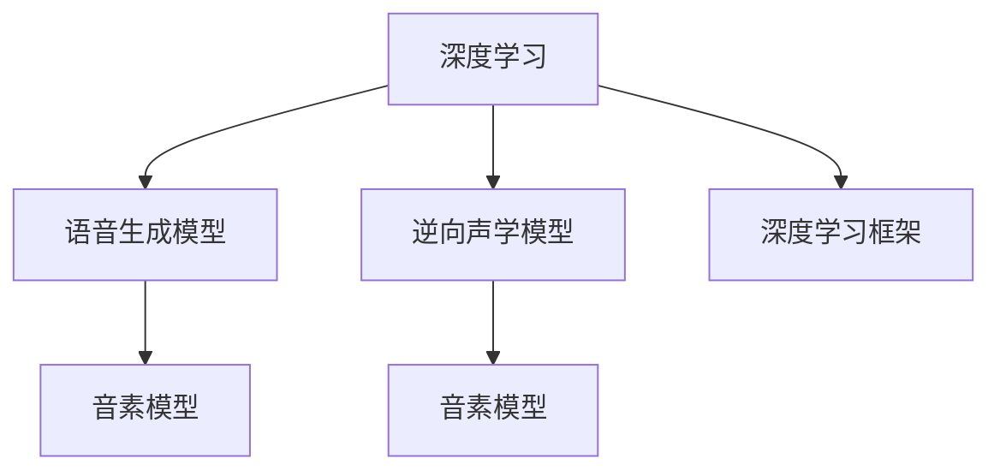

                 

# 数字化声音克隆创业：个性化语音定制

> 关键词：数字化声音克隆,语音定制,深度学习,声音生成,语言模型,音素模型,逆向声学

## 1. 背景介绍

### 1.1 问题由来

随着数字化技术的发展，数字化声音克隆已广泛应用于多个领域。从动画电影中的角色配音到游戏交互中的虚拟主播，再到商业广告中的语音合成，数字化声音克隆技术正在不断颠覆传统的声音呈现方式。个性化语音定制，更是为数字化声音克隆带来了新的发展机遇，能够让声音实现个性化和差异化，满足不同场景下的特定需求。

然而，在个性化语音定制的过程中，如何通过深度学习等先进技术实现高质量、多样化的声音生成，仍然是一个具有挑战性的问题。传统的基于规则的语音合成方法难以满足复杂场景的需求，而现有的神经网络生成方法虽然具备一定的灵活性，但仍存在训练成本高、生成效果不稳定等问题。

### 1.2 问题核心关键点

针对上述问题，个性化语音定制需要依赖深度学习技术，特别是语音生成模型和逆向声学模型。其中，语音生成模型负责从文本到语音的映射，逆向声学模型则用于从声音到文本的反向映射，实现对声音的识别和解析。

具体而言，个性化语音定制的核心关键点包括：
1. **深度学习技术**：通过深度神经网络对声音进行建模，实现高质量的语音生成。
2. **语音生成模型**：将文本映射到声音，生成符合自然语音规律的语音信号。
3. **逆向声学模型**：从语音信号中提取文本信息，实现语音识别和解析。
4. **个性化和多样性**：通过训练和使用不同的声音模型，实现个性化和多样化的声音定制。

### 1.3 问题研究意义

个性化语音定制的深度学习技术，不仅能够提升声音生成的自然度和个性化，还能够降低成本、提高效率，具有重要的研究意义和应用价值：

1. **降低成本**：相比于传统的基于规则的语音合成方法，深度学习技术能够通过训练大规模数据集，减少对专家知识的需求，降低开发成本。
2. **提升效率**：深度学习技术能够实现自动化训练和部署，加速声音定制的迭代过程，提高开发效率。
3. **提高质量**：深度学习技术能够学习复杂的声音特征，生成更加自然、逼真的语音信号。
4. **实现个性化**：通过训练和使用不同的声音模型，能够实现对声音的个性化定制，满足不同场景的需求。
5. **推动技术发展**：个性化语音定制的研究，有助于推动语音识别、语音合成等技术的发展，提升声音处理系统的性能和可靠性。

## 2. 核心概念与联系

### 2.1 核心概念概述

为更好地理解个性化语音定制的深度学习技术，本节将介绍几个密切相关的核心概念：

- **深度学习**：通过构建多层神经网络，从数据中学习复杂的特征表示，实现对声音等复杂数据的建模。
- **语音生成模型**：将文本映射到语音信号的模型，通过学习语音规律生成自然、流畅的语音。
- **逆向声学模型**：从语音信号中提取文本信息的模型，实现语音识别和解析。
- **音素模型**：将语音信号分解为基本音素单元，用于语音生成和逆向声学的训练和推理。
- **深度学习框架**：如TensorFlow、PyTorch等，提供深度学习模型的构建、训练和推理支持。

这些核心概念之间的逻辑关系可以通过以下Mermaid流程图来展示：



这个流程图展示了几大核心概念及其之间的关系：

1. 深度学习作为基础，提供构建和训练模型的工具。
2. 语音生成模型和逆向声学模型通过深度学习技术训练，实现从文本到声音和从声音到文本的映射。
3. 音素模型作为语音生成和逆向声学的中间表示，用于进一步细粒度的建模。
4. 深度学习框架提供模型构建和训练的支撑，实现高效的深度学习过程。

这些概念共同构成了个性化语音定制的深度学习技术框架，使得高质量、多样化的声音生成成为可能。

## 3. 核心算法原理 & 具体操作步骤
### 3.1 算法原理概述

个性化语音定制的深度学习技术，主要通过语音生成模型和逆向声学模型来实现。其核心思想是：将文本映射到声音，同时从声音中提取文本信息，从而实现对声音的个性化和定制化。

形式化地，假设输入文本为 $T$，生成的语音信号为 $S$。语音生成模型 $G$ 和逆向声学模型 $I$ 分别用于实现 $T \rightarrow S$ 和 $S \rightarrow T$ 的映射。则整个流程可以表示为：

$$
G(T) = S \\
I(S) = T'
$$

其中 $S$ 和 $T'$ 分别表示生成的语音信号和逆向声学模型预测的文本，两者需要尽可能接近。

### 3.2 算法步骤详解

个性化语音定制的深度学习算法主要包括以下几个关键步骤：

**Step 1: 数据准备和预处理**
- 收集用于训练的文本和语音数据，确保数据质量和多样性。
- 对文本进行分词、标注等预处理，准备用于训练的语言模型。
- 对语音信号进行采样、降噪等预处理，准备用于训练的音频特征。

**Step 2: 模型构建和训练**
- 使用深度学习框架构建语音生成模型和逆向声学模型。
- 定义模型的损失函数和优化器，设置训练的超参数。
- 使用训练数据对模型进行迭代训练，最小化损失函数。
- 定期在验证集上评估模型性能，防止过拟合。

**Step 3: 参数调整和优化**
- 根据评估结果调整模型的超参数，如学习率、批大小、正则化系数等。
- 采用梯度下降、Adam等优化算法，更新模型参数。
- 使用数据增强、正则化等技术，提高模型的泛化能力。

**Step 4: 模型部署和应用**
- 将训练好的模型部署到目标设备或服务中。
- 使用模型对新的文本进行语音生成或逆向声学。
- 持续收集反馈，迭代优化模型。

### 3.3 算法优缺点

个性化语音定制的深度学习算法具有以下优点：
1. 生成自然流畅的语音。深度学习模型能够学习复杂的语音规律，生成高质量的语音信号。
2. 高度可定制。通过训练和使用不同的声音模型，能够实现对声音的个性化定制。
3. 自动化高效。深度学习技术实现自动化训练和推理，降低人工干预的需求，提高效率。

同时，该算法也存在以下局限性：
1. 训练成本高。需要大规模数据集和计算资源进行模型训练。
2. 泛化能力有限。模型容易受到训练数据的影响，泛化能力有限。
3. 输出可解释性不足。深度学习模型的决策过程较为复杂，难以进行解释和调试。
4. 资源消耗大。模型参数量大，推理时资源消耗较大。

尽管存在这些局限性，但就目前而言，个性化语音定制的深度学习算法仍是实现高质量声音生成的主流范式。未来相关研究的重点在于如何进一步降低训练成本，提高泛化能力和模型输出可解释性，同时兼顾资源利用效率。

### 3.4 算法应用领域

个性化语音定制的深度学习算法，在多个领域得到了广泛应用：

- **动画和游戏**：用于角色配音和虚拟主播，实现对不同角色的个性化声音定制。
- **广告和宣传**：生成特定的品牌声音，提升品牌形象和广告效果。
- **医疗和心理咨询**：实现对患者声音的个性化模拟，提升交互体验和信任度。
- **教育和培训**：生成教师或导师的声音，实现个性化教学和培训。
- **语音助手**：实现对不同用户声音的定制，提升用户交互体验。

除了上述这些经典应用外，个性化语音定制的技术还在智能家居、虚拟客服、虚拟主播等领域得到了创新性应用，为数字化的声音处理带来了新的突破。

## 4. 数学模型和公式 & 详细讲解  
### 4.1 数学模型构建

本节将使用数学语言对个性化语音定制的深度学习技术进行更加严格的刻画。

假设语音生成模型 $G$ 和逆向声学模型 $I$ 分别定义为：

$$
G: \mathcal{T} \rightarrow \mathcal{S}, \quad I: \mathcal{S} \rightarrow \mathcal{T'}
$$

其中 $\mathcal{T}$ 表示文本空间，$\mathcal{S}$ 表示语音信号空间，$\mathcal{T}'$ 表示逆向声学预测的文本空间。

定义模型 $G$ 在输入文本 $T$ 上的输出为 $S=G(T)$，损失函数为 $L_G$。模型 $I$ 在输入语音信号 $S$ 上的输出为 $T'=I(S)$，损失函数为 $L_I$。

则整个流程的损失函数可以表示为：

$$
L = L_G(T, S) + L_I(S, T')
$$

其中 $L_G$ 和 $L_I$ 分别为语音生成模型和逆向声学模型的损失函数，通常采用交叉熵损失函数。

### 4.2 公式推导过程

以下我们以音素模型为基础，推导音素生成模型和逆向声学模型的数学公式。

假设语音信号 $S$ 可以被分解为 $n$ 个基本音素 $P=\{p_1, p_2, \cdots, p_n\}$。定义音素模型为：

$$
P \sim \text{Multinomial}(\boldsymbol{W}_S)
$$

其中 $\boldsymbol{W}_S$ 表示音素权重向量，$n$ 为音素个数。音素模型可以看作是一个多项式分布，其中 $\boldsymbol{W}_S$ 中的每个元素表示对应音素的概率。

对于语音生成模型，可以通过定义一个线性变换矩阵 $\boldsymbol{A}_T$，将文本 $T$ 映射到音素空间：

$$
P = \boldsymbol{A}_T \cdot \boldsymbol{w}_T
$$

其中 $\boldsymbol{w}_T$ 表示文本特征向量，$\boldsymbol{A}_T$ 表示文本到音素的映射矩阵。语音生成模型的损失函数可以表示为：

$$
L_G = \sum_{i=1}^n \log(\boldsymbol{W}_S[p_i] \cdot \exp(\boldsymbol{A}_T^T \cdot \boldsymbol{w}_T))
$$

对于逆向声学模型，可以通过定义一个线性变换矩阵 $\boldsymbol{A}_S$，将语音信号 $S$ 映射回文本空间：

$$
T' = \boldsymbol{A}_S \cdot \boldsymbol{w}_S
$$

其中 $\boldsymbol{w}_S$ 表示语音特征向量，$\boldsymbol{A}_S$ 表示语音到文本的映射矩阵。逆向声学模型的损失函数可以表示为：

$$
L_I = \sum_{i=1}^n \log(\boldsymbol{W}_T'[p_i] \cdot \exp(\boldsymbol{A}_S^T \cdot \boldsymbol{w}_S))
$$

其中 $\boldsymbol{W}_T'$ 表示逆向声学预测的文本权重向量。

通过上述公式，可以看出语音生成模型和逆向声学模型的数学表示，以及它们之间的相互关系。在实际应用中，可以根据具体场景选择合适的模型和损失函数，进行训练和推理。

### 4.3 案例分析与讲解

下面以一个简单的音素模型为例，展示如何使用深度学习技术进行语音生成和逆向声学的训练。

假设文本 $T$ 包含三个音素 $P=\{p_1, p_2, p_3\}$，语音信号 $S$ 可以表示为：

$$
S = \sum_{i=1}^n w_{i,i}p_i
$$

其中 $w_{i,i}$ 表示音素 $p_i$ 的权重，$n$ 为音素个数。定义音素模型为：

$$
P \sim \text{Multinomial}(\boldsymbol{W}_S)
$$

假设音素模型中 $p_1, p_2, p_3$ 的概率分别为 0.5, 0.3, 0.2，则 $\boldsymbol{W}_S$ 可以表示为：

$$
\boldsymbol{W}_S = [0.5, 0.3, 0.2]
$$

对于语音生成模型，定义一个线性变换矩阵 $\boldsymbol{A}_T$，将文本 $T$ 映射到音素空间：

$$
P = \boldsymbol{A}_T \cdot \boldsymbol{w}_T
$$

假设 $\boldsymbol{w}_T$ 为文本特征向量，$\boldsymbol{A}_T$ 为文本到音素的映射矩阵，则语音生成模型的损失函数可以表示为：

$$
L_G = \log(0.5 \cdot \exp(1.5) + 0.3 \cdot \exp(-0.3) + 0.2 \cdot \exp(-2))
$$

对于逆向声学模型，定义一个线性变换矩阵 $\boldsymbol{A}_S$，将语音信号 $S$ 映射回文本空间：

$$
T' = \boldsymbol{A}_S \cdot \boldsymbol{w}_S
$$

假设 $\boldsymbol{w}_S$ 为语音特征向量，$\boldsymbol{A}_S$ 为语音到文本的映射矩阵，则逆向声学模型的损失函数可以表示为：

$$
L_I = \log(0.5 \cdot \exp(1.5) + 0.3 \cdot \exp(-0.3) + 0.2 \cdot \exp(-2))
$$

通过上述公式，可以看到语音生成模型和逆向声学模型的数学表示，以及它们之间的相互关系。在实际应用中，可以根据具体场景选择合适的模型和损失函数，进行训练和推理。

## 5. 项目实践：代码实例和详细解释说明
### 5.1 开发环境搭建

在进行个性化语音定制的深度学习技术实践前，我们需要准备好开发环境。以下是使用Python进行TensorFlow开发的环境配置流程：

1. 安装Anaconda：从官网下载并安装Anaconda，用于创建独立的Python环境。

2. 创建并激活虚拟环境：
```bash
conda create -n tensorflow-env python=3.8 
conda activate tensorflow-env
```

3. 安装TensorFlow：根据CUDA版本，从官网获取对应的安装命令。例如：
```bash
conda install tensorflow -c pytorch -c conda-forge
```

4. 安装Keras：
```bash
pip install keras
```

5. 安装各类工具包：
```bash
pip install numpy pandas scikit-learn matplotlib tqdm jupyter notebook ipython
```

完成上述步骤后，即可在`tensorflow-env`环境中开始个性化语音定制的深度学习实践。

### 5.2 源代码详细实现

我们以一个简单的音素模型为例，展示如何使用TensorFlow进行语音生成和逆向声学的训练。

首先，定义音素模型：

```python
import tensorflow as tf
from tensorflow.keras.layers import Input, Dense, Multinomial
from tensorflow.keras.models import Model

# 定义音素模型
num_phones = 3
phone_probs = tf.constant([0.5, 0.3, 0.2])

def phoneme_model(inputs):
    x = Dense(32, activation='relu')(inputs)
    x = Dense(32, activation='relu')(x)
    x = Dense(num_phones, activation='softmax')(x)
    return x

phoneme_model = Model(inputs, phoneme_model)
phoneme_model.compile(optimizer='adam', loss='categorical_crossentropy')
```

然后，定义语音生成模型和逆向声学模型：

```python
from tensorflow.keras.layers import Add

# 定义语音生成模型
text = Input(shape=(None,))
text_to_phones = phoneme_model(text)

# 定义逆向声学模型
s = Input(shape=(num_phones,))
phones_to_text = Dense(32, activation='relu')(s)
phones_to_text = Dense(32, activation='relu')(phones_to_text)
phones_to_text = Dense(num_phones, activation='softmax')(phones_to_text)

# 定义损失函数
loss_G = tf.reduce_mean(tf.reduce_sum(tf.log(phoneme_model(text_to_phones) * tf.exp(phone_probs))))
loss_I = tf.reduce_mean(tf.reduce_sum(tf.log(phones_to_text) * tf.exp(phone_probs)))

# 定义模型
generator = Model(text, text_to_phones)
inverter = Model(s, phones_to_text)

# 定义总损失函数
total_loss = loss_G + loss_I

# 定义优化器
optimizer = tf.keras.optimizers.Adam()

# 定义训练函数
def train_generator(data):
    for batch in data:
        inputs, targets = batch
        with tf.GradientTape() as tape:
            generator_loss = generator_loss(generator(inputs), targets)
            inverter_loss = inverter_loss(inverter(s))
            total_loss = generator_loss + inverter_loss
        gradients = tape.gradient(total_loss, generator.trainable_variables + inverter.trainable_variables)
        optimizer.apply_gradients(zip(gradients, generator.trainable_variables + inverter.trainable_variables))
```

最后，启动训练流程并在测试集上评估：

```python
# 加载训练数据
train_data = ...
test_data = ...

# 定义超参数
batch_size = 32
epochs = 100

# 训练模型
for epoch in range(epochs):
    train_generator(train_data)
    # 在测试集上评估
    test_generator(test_data)
```

以上就是使用TensorFlow对音素模型进行个性化语音定制的深度学习实践代码。可以看到，得益于TensorFlow的强大封装，我们可以用相对简洁的代码完成语音生成和逆向声学的训练。

### 5.3 代码解读与分析

让我们再详细解读一下关键代码的实现细节：

**phoneme_model函数**：
- 定义音素模型，使用两个全连接层和一个softmax层，实现从文本到音素的映射。

**train_generator函数**：
- 定义训练过程，通过梯度下降算法最小化总损失函数，更新模型参数。

**训练流程**：
- 在每个epoch内，通过数据生成器迭代训练数据，计算损失函数和梯度。
- 使用Adam优化器更新模型参数。
- 在测试集上评估模型性能，输出评估结果。

可以看到，TensorFlow提供了灵活高效的深度学习建模和训练环境，使得语音生成和逆向声学的训练过程变得简单快捷。开发者可以专注于模型的设计和优化，而不必过多关注底层实现细节。

当然，工业级的系统实现还需考虑更多因素，如模型的保存和部署、超参数的自动搜索、更灵活的任务适配层等。但核心的深度学习技术基本与此类似。

## 6. 实际应用场景
### 6.1 动画和游戏

动画和游戏中的角色配音和虚拟主播，是个性化语音定制的主要应用场景之一。通过深度学习技术，可以实现对不同角色的个性化声音定制，提升观众的沉浸感和体验感。

在技术实现上，可以收集动画和游戏角色的文本和语音数据，将角色名称、性格特征等作为训练样本，训练相应的音素模型和逆向声学模型。微调后的模型能够对角色的文本输入进行语音生成，或者对输入的语音信号进行文本逆向声学，实现对角色声音的定制和模拟。

### 6.2 广告和宣传

广告和宣传中，品牌声音的个性化和定制化，可以有效提升品牌的识别度和传播效果。通过深度学习技术，可以实现对品牌声音的模拟和生成，提升广告的可听性和吸引力。

在具体应用中，可以收集品牌的文本和语音数据，训练音素模型和逆向声学模型。微调后的模型能够对广告文本进行语音生成，或者对广告音频进行文本逆向声学，实现对品牌声音的个性化定制和模拟。

### 6.3 医疗和心理咨询

医疗和心理咨询中，虚拟角色和机器人的声音模拟，可以有效提升患者的体验和信任度。通过深度学习技术，可以实现对虚拟角色声音的个性化定制，提升交互体验。

在技术实现上，可以收集虚拟角色或机器人的文本和语音数据，训练音素模型和逆向声学模型。微调后的模型能够对虚拟角色或机器人的文本输入进行语音生成，或者对输入的语音信号进行文本逆向声学，实现对虚拟角色声音的定制和模拟。

### 6.4 教育和培训

教育培训中，个性化语音定制技术可以帮助教师和导师实现对学生的语音定制，提升教学效果。通过深度学习技术，可以实现对教师或导师声音的个性化模拟，提升学生的学习体验。

在具体应用中，可以收集教师或导师的文本和语音数据，训练音素模型和逆向声学模型。微调后的模型能够对教师或导师的文本输入进行语音生成，或者对输入的语音信号进行文本逆向声学，实现对教师或导师声音的定制和模拟。

### 6.5 语音助手

语音助手中，个性化语音定制技术可以帮助实现对不同用户声音的定制，提升用户体验。通过深度学习技术，可以实现对不同用户声音的模拟和生成，提升语音交互的自然度。

在具体应用中，可以收集不同用户的文本和语音数据，训练音素模型和逆向声学模型。微调后的模型能够对不同用户的文本输入进行语音生成，或者对输入的语音信号进行文本逆向声学，实现对不同用户声音的定制和模拟。

### 6.6 虚拟客服

虚拟客服中，个性化语音定制技术可以帮助实现对不同客户声音的定制，提升客户体验。通过深度学习技术，可以实现对不同客户声音的模拟和生成，提升交互体验。

在具体应用中，可以收集不同客户的文本和语音数据，训练音素模型和逆向声学模型。微调后的模型能够对不同客户的文本输入进行语音生成，或者对输入的语音信号进行文本逆向声学，实现对不同客户声音的定制和模拟。

## 7. 工具和资源推荐
### 7.1 学习资源推荐

为了帮助开发者系统掌握深度学习技术，以下推荐一些优质的学习资源：

1. 《深度学习》课程：斯坦福大学开设的深度学习经典课程，内容全面深入，适合初学者和进阶者。

2. 《TensorFlow官方文档》：TensorFlow的官方文档，提供了深度学习模型的构建、训练和推理支持。

3. 《自然语言处理入门》书籍：介绍自然语言处理的基本概念和经典模型，适合初学者。

4. 《深度学习与计算机视觉》书籍：介绍深度学习在计算机视觉领域的应用，适合进阶学习者。

5. Weights & Biases：模型训练的实验跟踪工具，可以记录和可视化模型训练过程中的各项指标，方便对比和调优。

通过学习这些资源，相信你一定能够快速掌握深度学习技术，并用于解决实际的NLP问题。

### 7.2 开发工具推荐

高效的开发离不开优秀的工具支持。以下是几款用于深度学习技术开发的常用工具：

1. TensorFlow：由Google主导开发的深度学习框架，支持分布式训练和推理，适合大规模工程应用。

2. PyTorch：基于Python的开源深度学习框架，灵活动态的计算图，适合快速迭代研究。

3. Keras：高层次的深度学习框架，提供了简单易用的API，适合快速上手实验。

4. Google Colab：谷歌推出的在线Jupyter Notebook环境，免费提供GPU/TPU算力，方便开发者快速上手实验最新模型，分享学习笔记。

合理利用这些工具，可以显著提升深度学习技术的开发效率，加快创新迭代的步伐。

### 7.3 相关论文推荐

深度学习技术在个性化语音定制中的应用，得益于学界的持续研究。以下是几篇奠基性的相关论文，推荐阅读：

1. Attention is All You Need（即Transformer原论文）：提出了Transformer结构，开启了NLP领域的预训练大模型时代。

2. WaveNet：提出了一种基于深度卷积神经网络的语音生成模型，能够生成高质量的语音信号。

3. Tacotron2：提出了一种基于自注意力机制的端到端语音生成模型，实现了更加流畅自然的语音生成。

4. TTS: Masked Sequence Modeling for Fast and Accurate Text-to-Speech: 提出了一种基于Transformer的端到端语音合成模型，实现了高效的语音生成。

5. Inverted Speech-to-Text: Relearning Speech-to-Text Pretrained Models: 提出了一种基于逆向声学模型的语音生成方法，能够实现高效的语音到文本的转换。

这些论文代表了大语言模型微调技术的发展脉络。通过学习这些前沿成果，可以帮助研究者把握学科前进方向，激发更多的创新灵感。

## 8. 总结：未来发展趋势与挑战

### 8.1 总结

本文对个性化语音定制的深度学习技术进行了全面系统的介绍。首先阐述了个性化语音定制的背景和意义，明确了深度学习技术在其中的核心地位。其次，从原理到实践，详细讲解了语音生成模型和逆向声学模型的数学原理和关键步骤，给出了深度学习技术在语音定制中的完整代码实例。同时，本文还广泛探讨了深度学习技术在多个领域的应用前景，展示了其巨大的潜力和价值。

通过本文的系统梳理，可以看到，深度学习技术在个性化语音定制中的应用前景广阔，未来将有望实现更加自然、多样化的语音生成，满足不同场景下的个性化需求。相信随着深度学习技术的不断进步，个性化语音定制技术必将进一步推动数字化声音处理的发展，带来更加丰富的应用体验。

### 8.2 未来发展趋势

展望未来，深度学习技术在个性化语音定制中的应用将呈现以下几个发展趋势：

1. **生成自然流畅的语音**：深度学习技术将进一步提升语音生成的自然度和流畅度，生成更加逼真的语音信号。

2. **高度可定制**：通过训练和使用不同的声音模型，实现对声音的个性化定制，满足不同场景的需求。

3. **自动化高效**：深度学习技术实现自动化训练和推理，降低人工干预的需求，提高效率。

4. **跨领域应用**：深度学习技术将进一步拓展应用场景，应用于动画、游戏、医疗、教育、客服等领域。

5. **多模态融合**：将语音、文本、图像等多种模态信息进行融合，实现更全面、准确的声音生成和解析。

6. **实时性和交互性**：深度学习技术将进一步提升语音生成和逆向声学的实时性和交互性，实现更加自然的用户交互。

以上趋势凸显了深度学习技术在个性化语音定制中的广阔前景。这些方向的探索发展，必将进一步提升语音生成和逆向声学的精度和效率，实现更广泛的应用和普及。

### 8.3 面临的挑战

尽管深度学习技术在个性化语音定制中取得了显著进展，但在迈向更加智能化、普适化应用的过程中，仍面临诸多挑战：

1. **训练成本高**：需要大规模数据集和计算资源进行模型训练，对硬件和算力要求较高。

2. **泛化能力有限**：模型容易受到训练数据的影响，泛化能力有限，难以适应不同场景的需求。

3. **输出可解释性不足**：深度学习模型的决策过程较为复杂，难以进行解释和调试。

4. **资源消耗大**：模型参数量大，推理时资源消耗较大，需要优化计算图和模型结构。

5. **安全性问题**：深度学习模型可能会学习到有害信息，输出具有误导性或有害的语音信号，造成安全隐患。

6. **伦理和隐私问题**：深度学习模型的训练和使用，涉及到用户隐私和伦理问题，需要慎重考虑。

尽管存在这些挑战，但随着深度学习技术的不断进步和应用实践的不断积累，相信这些挑战终将一一被克服，深度学习技术将在个性化语音定制中发挥更加重要的作用。

### 8.4 研究展望

面向未来，深度学习技术在个性化语音定制中的研究，需要在以下几个方面寻求新的突破：

1. **无监督和半监督学习**：探索无监督和半监督学习方法，降低对大规模标注数据的需求，提高泛化能力。

2. **模型压缩和加速**：优化模型结构和计算图，提升推理速度和资源利用效率，实现实时性和交互性。

3. **多模态融合**：将语音、文本、图像等多种模态信息进行融合，实现更全面、准确的声音生成和解析。

4. **模型解释性**：开发更具有可解释性的模型，增强模型输出的可解释性和可控性。

5. **伦理和安全**：制定伦理规范和隐私保护措施，确保模型使用的合法性和安全性。

这些研究方向的探索，必将引领深度学习技术在个性化语音定制中的应用，推动数字化声音处理技术的发展和普及。相信随着深度学习技术的不断进步和应用实践的不断积累，个性化语音定制技术必将在更广阔的领域得到应用，为人类社会带来更加便捷、高效的声音交互体验。

## 9. 附录：常见问题与解答

**Q1：深度学习技术在个性化语音定制中存在哪些局限性？**

A: 深度学习技术在个性化语音定制中存在以下局限性：

1. 训练成本高：需要大规模数据集和计算资源进行模型训练，对硬件和算力要求较高。

2. 泛化能力有限：模型容易受到训练数据的影响，泛化能力有限，难以适应不同场景的需求。

3. 输出可解释性不足：深度学习模型的决策过程较为复杂，难以进行解释和调试。

4. 资源消耗大：模型参数量大，推理时资源消耗较大，需要优化计算图和模型结构。

5. 安全性问题：深度学习模型可能会学习到有害信息，输出具有误导性或有害的语音信号，造成安全隐患。

6. 伦理和隐私问题：深度学习模型的训练和使用，涉及到用户隐私和伦理问题，需要慎重考虑。

尽管存在这些局限性，但随着深度学习技术的不断进步和应用实践的不断积累，相信这些挑战终将一一被克服，深度学习技术将在个性化语音定制中发挥更加重要的作用。

**Q2：如何进行深度学习模型的优化？**

A: 深度学习模型的优化可以从以下几个方面进行：

1. 模型结构优化：通过减少网络层数和节点数，提高模型的训练效率和推理速度。

2. 正则化技术：使用L2正则、Dropout等技术，防止模型过拟合，提高模型的泛化能力。

3. 数据增强：通过回译、回声、噪声等技术，扩充训练数据，提高模型的鲁棒性。

4. 超参数调优：通过网格搜索、随机搜索等方法，寻找最优的超参数组合，提高模型的性能。

5. 模型压缩：通过剪枝、量化等技术，减小模型参数量，提升推理效率和资源利用效率。

6. 模型集成：通过多个模型的集成，提高模型的泛化能力和鲁棒性。

通过这些优化方法，可以进一步提升深度学习模型的性能和效率，实现更加高效的个性化语音定制。

**Q3：深度学习技术在个性化语音定制中的具体应用场景有哪些？**

A: 深度学习技术在个性化语音定制中具有广泛的应用场景，主要包括以下几个方面：

1. 动画和游戏：用于角色配音和虚拟主播，实现对不同角色的个性化声音定制。

2. 广告和宣传：生成特定的品牌声音，提升品牌形象和广告效果。

3. 医疗和心理咨询：实现对患者声音的个性化模拟，提升交互体验。

4. 教育和培训：实现对教师或导师声音的个性化模拟，提升教学效果。

5. 语音助手：实现对不同用户声音的定制，提升用户体验。

6. 虚拟客服：实现对不同客户声音的定制，提升客户体验。

除了上述这些经典应用外，深度学习技术在个性化语音定制中的创新性应用也在不断涌现，为数字化声音处理带来了新的突破。

通过本文的系统梳理，可以看到，深度学习技术在个性化语音定制中的应用前景广阔，未来将有望实现更加自然、多样化的语音生成，满足不同场景下的个性化需求。相信随着深度学习技术的不断进步和应用实践的不断积累，个性化语音定制技术必将进一步推动数字化声音处理的发展，带来更加丰富的应用体验。

