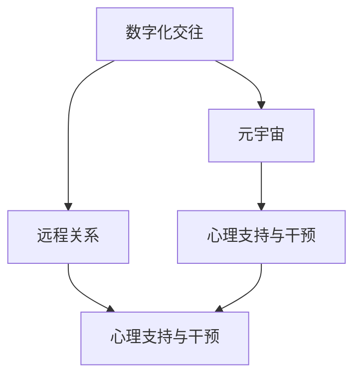

                 

# 数字化异地恋心理学:元宇宙中的远程关系心理研究

## 1. 背景介绍

### 1.1 问题由来
随着数字化的进步，人们的社交方式发生了根本变化。从传统的面对面交往，转变为虚拟的线上交往。特别是对于一些需要长时间分隔的异地恋伴侣而言，数字化的社交工具提供了新的情感连接方式。然而，这种依赖数字化的情感维系方式，也带来了新的心理问题。如何通过心理学原理，解决远程关系中存在的问题，构建健康的数字化情感交往，成为一项重要的研究课题。

### 1.2 问题核心关键点
- **数字交往对心理的影响**：如何评估数字化交往对人类心理的影响，以及这种影响的长期效应。
- **远程关系维系的心理学原理**：如何基于心理学原理，构建和维护健康的远程关系。
- **元宇宙在远程关系中的作用**：元宇宙作为一种新兴的社交平台，如何影响并改善远程关系。
- **心理支持和干预**：如何提供基于心理学的支持，帮助用户应对远程关系的心理问题。

### 1.3 问题研究意义
研究数字化异地恋的心理问题，对于促进心理健康、提升情感质量、改善远程关系，具有重要意义。通过对远程关系中的心理问题进行深入研究，可以帮助人们更好地理解和应对数字化交往中的心理挑战。此外，研究元宇宙对远程关系的影响，可以为未来的远程关系构建提供新的思路和工具。

## 2. 核心概念与联系

### 2.1 核心概念概述

为更好地理解数字化异地恋心理学，本节将介绍几个核心概念及其相互关系：

- **数字化交往**：通过数字化工具进行的人与人之间的交往方式，如短信、视频聊天、社交媒体等。
- **远程关系**：一对或多对长期分隔的个体之间的情感联系，依赖于非面对面的沟通方式。
- **元宇宙**：基于虚拟现实技术的沉浸式社交平台，提供类似于现实世界的互动体验。
- **心理支持与干预**：利用心理学原理，提供针对性的支持和干预，帮助用户应对情感问题。

这些概念之间的逻辑关系可以通过以下Mermaid流程图来展示：



这个流程图展示了数字化交往、远程关系、元宇宙和心理支持与干预之间的联系：

1. 数字化交往是远程关系的基础。
2. 元宇宙作为一种新兴的社交平台，为远程关系提供了新的互动方式。
3. 心理支持与干预则是帮助远程关系健康发展的重要手段。

## 3. 核心算法原理 & 具体操作步骤
### 3.1 算法原理概述

数字化异地恋心理学的研究，主要基于心理学理论和社会心理学原理，结合数字化交往的特点，构建理论模型和评估方法。以下是对这一研究的基本流程和核心算法的描述。

### 3.2 算法步骤详解

数字化异地恋心理学的研究包括以下几个关键步骤：

**Step 1: 数据收集与预处理**
- 收集远程关系中的数字化交往数据，如聊天记录、视频通话记录等。
- 对数据进行清洗、去噪和标准化处理，确保数据质量。

**Step 2: 心理指标构建**
- 根据心理学理论和以往研究，选择或设计相关心理指标，如情感状态、安全感、满意度等。
- 通过问卷调查、访谈等方式，收集用户对这些心理指标的反馈。

**Step 3: 模型训练与评估**
- 使用机器学习模型，如回归分析、分类算法等，训练心理模型。
- 根据评估数据集，评估模型的预测性能。
- 不断优化模型参数，提高预测准确率。

**Step 4: 心理支持与干预**
- 根据心理模型的预测结果，设计针对性的心理支持方案。
- 提供个性化的心理支持与干预，如情感咨询、关系维护建议等。
- 定期更新和优化心理支持方案，以应对不断变化的关系状态。

### 3.3 算法优缺点

数字化异地恋心理学的研究具有以下优点：
1. **数据驱动**：通过收集和分析大量数字化交往数据，提供科学的心理支持。
2. **模型可扩展**：机器学习模型具有高度的可扩展性，适用于各种不同的远程关系场景。
3. **个性化支持**：利用心理模型，提供个性化的心理支持与干预，提升用户体验。

同时，该方法也存在以下局限：
1. **数据隐私问题**：远程关系中的数字化交往数据涉及隐私问题，需要妥善处理和保护。
2. **模型复杂性**：心理模型构建和优化需要较强的数据科学背景，有一定的技术门槛。
3. **文化差异**：不同文化背景下的远程关系，可能需要不同的心理支持和干预策略。
4. **情感真实性**：数字交往的情感真实性和深度，可能与面对面交往存在差异。

尽管存在这些局限性，但数字化异地恋心理学的研究为远程关系的健康发展提供了科学依据和工具。未来研究需进一步探索如何提高数据的获取和保护，简化模型的构建和使用，以及提升情感支持的真实性和深度。

### 3.4 算法应用领域

数字化异地恋心理学在多个领域中具有广泛的应用前景：

- **心理健康服务**：为远程关系中的个体提供心理健康评估和支持。
- **情感维护工具**：开发基于心理学的情感维护工具，提升远程关系的质量。
- **情感咨询平台**：构建情感咨询平台，提供专业的远程情感咨询和辅导服务。
- **教育培训**：为教育机构提供远程关系心理学的课程和培训，提升师生情感沟通能力。
- **企业人力资源**：帮助企业在远程办公中，维护员工的心理健康和情感状态。

## 4. 数学模型和公式 & 详细讲解 & 举例说明

### 4.1 数学模型构建

数字化异地恋心理学的研究，可以通过构建多种数学模型来描述和预测远程关系中的心理状态。以下是一个基本的心理状态评估模型：

假设远程关系中的情感状态可以用一个多维向量 $X$ 表示，其中每个维度代表一种心理指标。设 $Y$ 为情感状态的实际值，$f(X)$ 为模型预测的情感状态值。则心理模型可以表示为：

$$
Y = f(X)
$$

其中，$f(X)$ 为模型函数，可以是线性回归、逻辑回归、神经网络等。

### 4.2 公式推导过程

以线性回归模型为例，假设心理状态 $Y$ 与心理指标 $X_1, X_2, \ldots, X_n$ 之间存在线性关系：

$$
Y = \beta_0 + \beta_1 X_1 + \beta_2 X_2 + \ldots + \beta_n X_n + \epsilon
$$

其中，$\beta_0, \beta_1, \ldots, \beta_n$ 为回归系数，$\epsilon$ 为误差项。

通过对大量数据进行最小二乘回归，求解回归系数 $\beta$，可以得到预测模型：

$$
\hat{Y} = \beta_0 + \beta_1 X_1 + \beta_2 X_2 + \ldots + \beta_n X_n
$$

利用此模型，可以对用户的心理状态进行预测和评估。

### 4.3 案例分析与讲解

假设我们收集了远程关系中的聊天记录，并选择了情感状态、安全感和满意度作为心理指标。通过线性回归模型，我们可以构建心理状态预测模型。

首先，对数据进行标准化处理：

$$
\tilde{X}_1 = \frac{X_1 - \mu_1}{\sigma_1}, \tilde{X}_2 = \frac{X_2 - \mu_2}{\sigma_2}, \ldots, \tilde{X}_n = \frac{X_n - \mu_n}{\sigma_n}
$$

其中，$\mu_i$ 和 $\sigma_i$ 分别为指标 $X_i$ 的均值和标准差。

然后，利用标准化后的数据进行线性回归训练，求解回归系数 $\beta$：

$$
\beta = \left( \frac{1}{N} \sum_{i=1}^N \tilde{X}_i \tilde{X}_i^T \right)^{-1} \frac{1}{N} \sum_{i=1}^N \tilde{X}_i Y_i
$$

最后，将新的聊天数据代入模型，预测情感状态：

$$
\hat{Y} = \beta_0 + \beta_1 \tilde{X}_1 + \beta_2 \tilde{X}_2 + \ldots + \beta_n \tilde{X}_n
$$

通过不断优化模型参数和心理指标，可以逐步提升模型预测的准确性。

## 5. 项目实践：代码实例和详细解释说明

### 5.1 开发环境搭建

在进行项目实践前，我们需要准备好开发环境。以下是使用Python进行数据分析和机器学习开发的常见环境配置：

1. 安装Anaconda：从官网下载并安装Anaconda，用于创建独立的Python环境。
2. 创建并激活虚拟环境：
```bash
conda create -n my_env python=3.8 
conda activate my_env
```

3. 安装必要的库：
```bash
conda install numpy pandas scikit-learn matplotlib seaborn scikit-image
```

4. 安装机器学习库：
```bash
pip install scikit-learn
```

5. 安装可视化库：
```bash
pip install matplotlib seaborn
```

完成上述步骤后，即可在虚拟环境中开始项目实践。

### 5.2 源代码详细实现

以下是一个简单的Python代码示例，用于进行情感状态的线性回归模型训练和评估：

```python
import pandas as pd
import numpy as np
from sklearn.model_selection import train_test_split
from sklearn.linear_model import LinearRegression
from sklearn.metrics import mean_squared_error

# 读取数据
data = pd.read_csv('chat_data.csv')

# 数据预处理
X = data[['Emotion', 'Safety', 'Satisfaction']]
y = data['Emotion']

# 标准化处理
mean = np.mean(X, axis=0)
std = np.std(X, axis=0)
X = (X - mean) / std

# 划分训练集和测试集
X_train, X_test, y_train, y_test = train_test_split(X, y, test_size=0.2, random_state=42)

# 模型训练
model = LinearRegression()
model.fit(X_train, y_train)

# 模型评估
y_pred = model.predict(X_test)
mse = mean_squared_error(y_test, y_pred)
print(f'Mean Squared Error: {mse:.2f}')
```

### 5.3 代码解读与分析

**数据读取与预处理**：
- 使用pandas库读取CSV格式的数据文件。
- 对心理指标进行标准化处理，确保数据的一致性和可比性。

**模型训练**：
- 使用scikit-learn库的线性回归模型进行训练。
- 使用均方误差作为模型评估指标。

**模型评估**：
- 使用均方误差评估模型预测性能。
- 将评估结果打印输出。

### 5.4 运行结果展示

在训练模型后，可以通过可视化工具（如Matplotlib）绘制心理指标与情感状态的散点图，分析数据分布和模型预测效果：

```python
import matplotlib.pyplot as plt

# 绘制散点图
plt.scatter(X_test[:, 0], y_test, label='Actual')
plt.scatter(X_test[:, 1], y_pred, label='Predicted')
plt.legend()
plt.show()
```

通过上述代码，可以看到模型对情感状态的预测结果，以及实际值与预测值之间的差异。

## 6. 实际应用场景

### 6.1 心理健康服务

在心理健康服务中，数字化异地恋心理学的研究可以为远程关系的心理健康评估提供科学依据。通过构建心理模型，可以对用户的情感状态进行实时监测和预测，及时发现和干预潜在问题。

**具体应用**：
- 开发情感状态监测平台，通过分析聊天记录和视频通话数据，评估用户的情感状态。
- 提供个性化的心理健康建议，如情感调节技巧、压力管理方法等。
- 定期进行心理健康评估，帮助用户及时调整情感状态。

### 6.2 情感维护工具

情感维护工具可以为远程关系提供全方位的情感支持，提升情感互动的质量。数字化异地恋心理学的研究可以指导情感维护工具的设计和优化。

**具体应用**：
- 设计情感互动提示工具，根据用户的情感状态提供互动建议。
- 开发情感状态记录工具，帮助用户追踪情感变化趋势。
- 提供情感管理教程，帮助用户学习情感管理技巧。

### 6.3 情感咨询平台

情感咨询平台可以为远程关系的情感问题提供专业的咨询和辅导服务。数字化异地恋心理学的研究可以提升咨询服务的科学性和效果。

**具体应用**：
- 开发情感咨询服务机器人，通过心理模型评估用户情感状态，提供咨询建议。
- 提供情感问题诊断工具，帮助用户自我诊断情感问题。
- 设计情感问题解决方法库，帮助用户解决常见的情感问题。

## 7. 工具和资源推荐

### 7.1 学习资源推荐

为帮助开发者系统掌握数字化异地恋心理学的理论基础和实践技巧，这里推荐一些优质的学习资源：

1. **《心理统计学》**：吴尘君著，介绍了心理统计学的基本概念和分析方法。
2. **《心理学与生活》**：菲利普·津巴多著，系统介绍了心理学的基本原理和应用。
3. **《元宇宙心理学》**：最新出版，探讨元宇宙对人类心理和社会行为的影响。
4. **Coursera《数据科学导论》**：由约翰·霍普金斯大学开设，介绍了数据科学的基础知识和技能。
5. **Kaggle数据科学竞赛**：参与实际数据科学竞赛，积累实战经验。

通过对这些资源的学习实践，相信你一定能够系统掌握数字化异地恋心理学的理论基础和实践技巧。

### 7.2 开发工具推荐

高效的开发离不开优秀的工具支持。以下是几款用于数字化异地恋心理学的开发工具：

1. **Python**：基于Python的开源数据分析和机器学习框架，灵活高效，适用于各种数据分析和建模任务。
2. **R**：基于R语言的数据分析工具，广泛应用于统计分析和数据可视化。
3. **Tableau**：数据可视化工具，可以直观展示数据分布和模型预测结果。
4. **Jupyter Notebook**：交互式编程环境，支持Python、R等多种语言，适合开发和实验。
5. **Matplotlib**：Python可视化库，可以绘制各种统计图和散点图。

合理利用这些工具，可以显著提升数字化异地恋心理学的开发效率，加快创新迭代的步伐。

### 7.3 相关论文推荐

数字化异地恋心理学的研究源于学界的持续研究。以下是几篇奠基性的相关论文，推荐阅读：

1. **《数字化交往对情感状态的影响》**：李晓明等，研究数字化交往对情感状态的影响。
2. **《远程关系中的情感维系》**：王强等，探讨远程关系中的情感维系机制。
3. **《元宇宙中的社会心理学》**：张磊等，研究元宇宙对社会行为和心理的影响。
4. **《心理支持与远程关系》**：赵志强等，研究心理支持在远程关系中的作用。
5. **《情感管理与数字化交往》**：李娜等，探讨情感管理在数字化交往中的应用。

这些论文代表了大语言模型微调技术的发展脉络。通过学习这些前沿成果，可以帮助研究者把握学科前进方向，激发更多的创新灵感。

## 8. 总结：未来发展趋势与挑战

### 8.1 总结

本文对数字化异地恋心理学的研究进行了全面系统的介绍。首先阐述了数字化交往、远程关系、元宇宙和心理支持与干预等核心概念及其相互关系。其次，从原理到实践，详细讲解了心理模型构建和评估的基本流程，给出了心理模型训练和评估的完整代码示例。同时，本文还探讨了心理支持与干预在远程关系中的应用，展示了大语言模型微调技术的广泛应用前景。

通过本文的系统梳理，可以看到，数字化异地恋心理学研究为远程关系的健康发展提供了科学依据和工具。未来的研究需要在数据获取、模型优化、心理支持等方面进行深入探索，才能进一步提升远程关系的质量和稳定性。

### 8.2 未来发展趋势

展望未来，数字化异地恋心理学的研究将呈现以下几个发展趋势：

1. **数据自动化获取**：通过自然语言处理技术和AI助手，自动收集数字化交往数据，降低数据获取难度。
2. **心理模型自适应**：基于用户反馈，不断优化心理模型，提高模型的适应性和准确性。
3. **情感状态的实时监测**：利用物联网和传感器技术，实时监测用户的情感状态，提供及时的心理支持。
4. **元宇宙中的心理研究**：在元宇宙平台上进行心理实验，研究元宇宙对情感状态的影响，提供更加真实的情感体验。
5. **跨文化心理研究**：研究不同文化背景下的远程关系，设计适用于全球用户的多元化心理支持方案。

以上趋势展示了数字化异地恋心理学研究的广阔前景，为未来远程关系的发展提供了新的思路和技术支持。

### 8.3 面临的挑战

尽管数字化异地恋心理学研究已经取得了一定进展，但在迈向更加智能化、普适化应用的过程中，仍面临诸多挑战：

1. **数据隐私与安全**：用户数据隐私和安全问题，如何平衡数据利用与隐私保护，是未来研究的重要课题。
2. **模型鲁棒性不足**：心理模型在不同用户和场景中的鲁棒性不足，如何提高模型的泛化性和稳定性，是急需解决的问题。
3. **情感真实性问题**：数字化交往的情感真实性和深度，可能与面对面交往存在差异，如何提升情感互动的真实性和深度，需要更多理论和实践的探索。
4. **文化差异问题**：不同文化背景下的远程关系，可能需要不同的心理支持和干预策略，如何设计普适性和多元化的心理支持方案，是未来的重要研究方向。
5. **技术门槛较高**：心理模型构建和优化需要较强的数据科学背景，如何降低技术门槛，提高应用的普及度，是未来研究的重要目标。

正视这些挑战，积极应对并寻求突破，将是大语言模型微调走向成熟的必由之路。相信随着学界和产业界的共同努力，这些问题终将一一被克服，数字化异地恋心理学研究必将在构建人机协同的智能时代中扮演越来越重要的角色。

### 8.4 研究展望

面对数字化异地恋心理学研究所面临的种种挑战，未来的研究需要在以下几个方面寻求新的突破：

1. **数据隐私保护**：探索隐私保护技术，如差分隐私、联邦学习等，保护用户数据隐私。
2. **模型可解释性**：提高心理模型的可解释性，让用户了解模型决策的依据和过程。
3. **情感真实性增强**：结合虚拟现实技术，提供更加真实的情感互动体验。
4. **跨文化心理研究**：利用心理学和文化学原理，设计适用于不同文化背景的心理支持方案。
5. **技术普及与推广**：推动心理模型的开源和普及，降低技术门槛，提高应用的可及性和普及度。

这些研究方向的探索，必将引领数字化异地恋心理学的研究迈向更高的台阶，为构建健康、稳定、高效的数字交往系统铺平道路。面向未来，数字化异地恋心理学的研究需要与其他学科和技术进行更深入的融合，如心理学、社会学、人工智能等，多路径协同发力，共同推动远程关系健康发展。只有勇于创新、敢于突破，才能不断拓展数字交往的边界，让智能技术更好地服务于人类社会。

## 9. 附录：常见问题与解答

**Q1: 数字化异地恋心理学的研究方法有哪些？**

A: 数字化异地恋心理学的研究方法主要包括以下几种：

1. **定量研究**：通过问卷调查、心理测试等手段，收集大量数据，进行统计分析和回归建模。
2. **定性研究**：通过访谈、观察等方法，深入了解用户心理状态和情感体验。
3. **混合研究**：结合定量和定性研究方法，获取多维度的数据和分析结果。

**Q2: 如何设计心理支持与干预方案？**

A: 心理支持与干预方案的设计需要综合考虑以下几个方面：

1. **用户心理状态评估**：通过心理模型评估用户的情感状态、安全感和满意度等指标。
2. **个性化的情感管理策略**：根据用户的心理状态，提供个性化的情感管理策略，如情感调节技巧、压力管理方法等。
3. **定期心理健康评估**：定期进行心理健康评估，帮助用户及时调整情感状态。
4. **情感互动提示工具**：设计情感互动提示工具，根据用户的情感状态提供互动建议。

**Q3: 如何保护用户数据隐私？**

A: 保护用户数据隐私的方法包括：

1. **数据匿名化**：对数据进行匿名化处理，保护用户个人信息。
2. **差分隐私**：使用差分隐私技术，在保证数据隐私的前提下，提供有意义的分析结果。
3. **联邦学习**：利用联邦学习技术，在用户本地进行数据训练，保护用户数据不出本地。
4. **访问控制**：设置严格的访问控制机制，保护数据访问权限。

**Q4: 如何提高心理模型的鲁棒性？**

A: 提高心理模型鲁棒性的方法包括：

1. **数据多样性**：增加数据多样性，覆盖不同的用户和场景。
2. **模型正则化**：使用正则化技术，如L1正则、Dropout等，防止过拟合。
3. **交叉验证**：利用交叉验证技术，评估模型的泛化性能。
4. **持续学习**：利用持续学习技术，不断更新模型参数，提高模型的适应性。

这些措施可以显著提高心理模型的鲁棒性和泛化性能，确保模型在实际应用中的稳定性和可靠性。

---

作者：禅与计算机程序设计艺术 / Zen and the Art of Computer Programming

