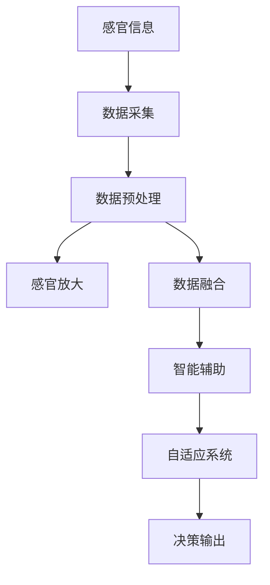

                 

# 数字化感知：AI增强人类感官

> 关键词：数字化感知, AI增强, 感官放大, 人机交互, 自适应系统, 自动化感知, 智能辅助, 增强现实(AR), 虚拟现实(VR), 工业4.0, 健康监测, 辅助决策

## 1. 背景介绍

随着科技的不断进步，人工智能(AI)已经逐步融入到我们的日常生活中。从智能手机到智能家居，从自动驾驶到智能医疗，AI技术的落地应用正在不断拓展我们的感官边界，赋予我们更多数字化感知能力。

### 1.1 问题由来

人类的感官是有限的，我们能够感知的信息仅限于自身的视觉、听觉、触觉、嗅觉和味觉。然而，现实世界的信息远远超出了我们的感官所能捕捉的范围。在许多场景中，我们对环境的变化和细节的感知能力不足，导致了效率低下和错误决策。人工智能技术，尤其是深度学习模型，通过模拟和扩展我们的感官，弥补了这一不足。

以医疗领域为例，医生的感官无法在短时间内高效地检测所有病变部位，而AI辅助诊断系统可以通过图像识别和模式匹配技术，快速准确地检测出细微的异常，从而提高诊断效率和准确性。再比如，工业领域中的机器人可以通过AI技术感知更复杂的环境变化，实现更精确的操作，提升生产效率。

### 1.2 问题核心关键点
数字化感知的核心在于将传统感官转化为数字化信息，并通过智能算法进行深度处理和分析，以辅助人类完成更高效、更精准的任务。AI在数字化感知中起到了以下几个关键作用：

1. **感官放大**：利用AI技术放大人类感官的感知能力，例如增强图像的分辨率，提升声音的清晰度，增强触觉和嗅觉的敏感度等。
2. **数据融合**：将来自不同感官的数据进行融合，构建更全面的环境模型，例如将视觉、声音和触觉信息结合起来，实现更准确的定位和识别。
3. **智能辅助**：基于感知数据，AI能够提供实时反馈和决策支持，例如通过语音识别技术，实时翻译和理解用户需求，通过视觉跟踪技术，辅助驾驶员识别和规避障碍物。
4. **自适应系统**：AI系统能够根据环境和任务的变化，动态调整感知策略，例如智能眼镜可以根据环境光线自动调节，增强用户的视野。

### 1.3 问题研究意义
数字化感知技术不仅能够提高人类感知信息的准确性和效率，还能够带来更广泛的应用场景，例如医疗、工业、交通、教育等。AI增强的数字化感知技术，正在成为推动科技发展和社会进步的重要力量。

1. **医疗**：通过增强影像分析和医疗辅助诊断，提高医疗服务的质量和效率。
2. **工业**：通过提升机器人的感知能力，实现更精确的操作和故障检测。
3. **交通**：通过智能驾驶和辅助导航，提升交通安全性和通行效率。
4. **教育**：通过AI辅助教学和评估，提升教育质量和个性化学习体验。

## 2. 核心概念与联系

### 2.1 核心概念概述

为了更好地理解数字化感知技术的原理和应用，本节将介绍几个核心概念：

1. **数字化感知**：将传统感官信息转化为数字化数据，并通过AI技术进行处理和分析，以辅助人类完成任务的过程。
2. **感官放大**：利用AI技术增强人类感官的感知能力，例如增强图像分辨率，提升声音清晰度等。
3. **数据融合**：将来自不同感官的数据进行融合，构建更全面的环境模型。
4. **智能辅助**：基于感知数据，AI提供实时反馈和决策支持。
5. **自适应系统**：AI系统能够根据环境和任务的变化，动态调整感知策略。

### 2.2 核心概念原理和架构的 Mermaid 流程图



这个流程图展示了数字化感知技术的核心流程：
- **感官信息**：包括视觉、听觉、触觉、嗅觉和味觉等感官数据。
- **数据采集**：通过传感器和AI技术，将感官信息转化为数字信号。
- **数据预处理**：对采集到的数字信号进行预处理，包括滤波、去噪、增强等。
- **感官放大**：利用AI技术放大感官的感知能力，如增强图像分辨率、提升声音清晰度等。
- **数据融合**：将不同感官的数据进行融合，构建更全面的环境模型。
- **智能辅助**：基于感知数据，AI提供实时反馈和决策支持，例如通过语音识别技术实时翻译和理解用户需求。
- **自适应系统**：AI系统能够根据环境和任务的变化，动态调整感知策略，例如智能眼镜可以根据环境光线自动调节，增强用户的视野。
- **决策输出**：基于智能辅助和自适应系统的结果，输出最终的决策或反馈。

这些核心概念相互联系，共同构成了数字化感知技术的完整框架，使得AI能够真正扩展和增强人类的感官。

## 3. 核心算法原理 & 具体操作步骤

### 3.1 算法原理概述

数字化感知的核心算法主要分为以下几个部分：

1. **数据采集与预处理**：通过传感器和AI技术，将传统感官信息转化为数字信号，并对数据进行预处理，包括滤波、去噪、增强等。
2. **感官放大**：利用AI技术增强人类感官的感知能力，例如增强图像分辨率、提升声音清晰度等。
3. **数据融合**：将不同感官的数据进行融合，构建更全面的环境模型。
4. **智能辅助**：基于感知数据，AI提供实时反馈和决策支持。
5. **自适应系统**：AI系统能够根据环境和任务的变化，动态调整感知策略。

### 3.2 算法步骤详解

**Step 1: 数据采集与预处理**

- **数据采集**：使用各种传感器（如摄像头、麦克风、触觉传感器等）采集不同感官的信息。
- **数据预处理**：对采集到的数字信号进行预处理，包括滤波、去噪、增强等。预处理技术包括但不限于：
  - **滤波**：通过数字滤波器对信号进行平滑处理，去除高频噪声。
  - **去噪**：使用降噪算法（如Wiener滤波、卡尔曼滤波等）对信号进行去噪处理。
  - **增强**：利用增强算法（如对比度增强、直方图均衡化等）提升信号质量。

**Step 2: 感官放大**

- **图像增强**：利用AI技术提升图像的分辨率、对比度、亮度等。例如使用深度学习模型进行图像增强，提升图像清晰度。
- **声音增强**：利用AI技术提升声音的清晰度、降噪等。例如使用深度学习模型对音频进行降噪处理，提升语音识别的准确性。
- **触觉增强**：利用AI技术提升触觉的敏感度和响应速度。例如使用柔性传感器和AI算法，实时检测和反馈触觉信息。
- **嗅觉增强**：利用AI技术提升嗅觉的敏感度和识别能力。例如使用化学传感器和AI算法，实时检测和分析气味信息。
- **味觉增强**：利用AI技术提升味觉的敏感度和识别能力。例如使用电子舌头和AI算法，实时检测和分析味觉信息。

**Step 3: 数据融合**

- **多模态数据融合**：将来自不同感官的数据进行融合，构建更全面的环境模型。例如将视觉、声音和触觉信息结合起来，实现更准确的定位和识别。
- **特征提取与匹配**：利用深度学习模型对不同感官数据进行特征提取，并匹配相似特征。例如使用卷积神经网络（CNN）提取图像特征，使用循环神经网络（RNN）提取声音特征，使用长短时记忆网络（LSTM）提取触觉特征，并将这些特征进行匹配和融合。
- **空间和时间融合**：将不同时间点的数据进行融合，以获得更全面的环境信息。例如将不同时刻的视觉和声音数据进行融合，实时更新环境模型。

**Step 4: 智能辅助**

- **语音识别**：利用AI技术进行语音识别，实时翻译和理解用户需求。例如使用深度学习模型进行语音识别，输出文本信息。
- **视觉跟踪**：利用AI技术进行视觉跟踪，辅助驾驶员识别和规避障碍物。例如使用深度学习模型进行目标检测和跟踪，实时更新环境信息。
- **触觉反馈**：利用AI技术提供触觉反馈，增强用户的操作体验。例如使用柔性传感器和AI算法，实时检测和反馈触觉信息。
- **智能决策**：基于感知数据，AI提供实时反馈和决策支持。例如在自动驾驶系统中，利用深度学习模型进行环境感知和决策，实现自动驾驶功能。

**Step 5: 自适应系统**

- **环境感知**：利用AI技术实时感知环境变化，例如利用深度学习模型进行环境建模和预测。
- **任务调整**：根据环境感知结果，动态调整感知策略，例如智能眼镜可以根据环境光线自动调节，增强用户的视野。
- **反馈优化**：基于感知数据和任务结果，优化感知策略和算法，例如通过反馈循环不断优化语音识别模型。

### 3.3 算法优缺点

数字化感知技术具有以下优点：
1. **提升感知能力**：通过感官放大和数据融合，显著提升人类的感知能力，尤其是在复杂环境和任务中。
2. **实时反馈**：AI能够提供实时反馈和决策支持，帮助用户做出更准确的判断和决策。
3. **自适应性**：AI系统能够根据环境和任务的变化，动态调整感知策略，提高系统的灵活性和适应性。
4. **大规模应用**：数字化感知技术具有广泛的应用场景，可以应用于医疗、工业、交通、教育等多个领域。

同时，数字化感知技术也存在一些缺点：
1. **数据依赖**：数字化感知技术依赖高质量的传感器数据，数据采集和处理的成本较高。
2. **算法复杂性**：数字化感知算法涉及多种技术，如深度学习、信号处理、数据融合等，技术复杂性较高。
3. **隐私和安全**：数字化感知技术涉及大量敏感数据，需要关注隐私保护和数据安全问题。
4. **计算资源**：数字化感知技术需要高性能的计算资源，对硬件和算力要求较高。

尽管存在这些缺点，数字化感知技术依然具有广泛的应用前景，并将在未来不断得到改进和完善。

### 3.4 算法应用领域

数字化感知技术已经在多个领域得到了广泛应用，以下是几个典型应用场景：

1. **医疗**：利用AI技术进行医学影像分析、智能诊断和治疗辅助，提高医疗服务的效率和质量。
2. **工业**：利用AI技术进行故障检测、质量控制、智能制造等，提升工业生产效率和精度。
3. **交通**：利用AI技术进行智能驾驶、自动导航、智能交通管理等，提升交通安全性和通行效率。
4. **教育**：利用AI技术进行智能教学、评估、个性化学习等，提升教育质量和教学效果。
5. **家庭生活**：利用AI技术进行智能家居、智能安防、智能健康监测等，提升生活质量和安全性。
6. **商业零售**：利用AI技术进行客户行为分析、商品推荐、智能客服等，提升客户体验和销售效率。

## 4. 数学模型和公式 & 详细讲解 & 举例说明

### 4.1 数学模型构建

为了更好地理解数字化感知技术的数学模型，本节将介绍几个核心模型及其构建方法。

**图像增强模型**：
- **模型定义**：假设输入为原始图像 $I$，输出为增强后的图像 $I'$。模型包括卷积层、池化层、激活层等，利用深度学习技术进行图像增强。
- **模型构建**：
  $$
  I' = f(I; \theta)
  $$
  其中 $f$ 表示模型函数，$\theta$ 为模型参数。

**语音增强模型**：
- **模型定义**：假设输入为原始音频信号 $A$，输出为增强后的音频信号 $A'$。模型包括降噪层、增强层、滤波层等，利用深度学习技术进行音频增强。
- **模型构建**：
  $$
  A' = f(A; \theta)
  $$
  其中 $f$ 表示模型函数，$\theta$ 为模型参数。

**触觉增强模型**：
- **模型定义**：假设输入为原始触觉数据 $T$，输出为增强后的触觉数据 $T'$。模型包括传感器采集层、信号处理层、特征提取层等，利用深度学习技术进行触觉增强。
- **模型构建**：
  $$
  T' = f(T; \theta)
  $$
  其中 $f$ 表示模型函数，$\theta$ 为模型参数。

**嗅觉增强模型**：
- **模型定义**：假设输入为原始气味数据 $S$，输出为增强后的气味数据 $S'$。模型包括化学传感器采集层、信号处理层、特征提取层等，利用深度学习技术进行气味增强。
- **模型构建**：
  $$
  S' = f(S; \theta)
  $$
  其中 $f$ 表示模型函数，$\theta$ 为模型参数。

**味觉增强模型**：
- **模型定义**：假设输入为原始味觉数据 $T$，输出为增强后的味觉数据 $T'$。模型包括电子舌头采集层、信号处理层、特征提取层等，利用深度学习技术进行味觉增强。
- **模型构建**：
  $$
  T' = f(T; \theta)
  $$
  其中 $f$ 表示模型函数，$\theta$ 为模型参数。

### 4.2 公式推导过程

**图像增强模型的推导**：
- **模型输入**：原始图像 $I$。
- **模型输出**：增强后的图像 $I'$。
- **模型损失**：定义均方误差损失 $L$，计算原始图像和增强图像的误差。
  $$
  L = \frac{1}{N} \sum_{i=1}^N (I_i - I'_i)^2
  $$
  其中 $N$ 为图像样本数。
- **模型优化**：使用梯度下降算法最小化损失函数 $L$，更新模型参数 $\theta$。
  $$
  \theta \leftarrow \theta - \eta \nabla_{\theta}L
  $$
  其中 $\eta$ 为学习率。

**语音增强模型的推导**：
- **模型输入**：原始音频信号 $A$。
- **模型输出**：增强后的音频信号 $A'$。
- **模型损失**：定义均方误差损失 $L$，计算原始音频和增强音频的误差。
  $$
  L = \frac{1}{N} \sum_{i=1}^N (A_i - A'_i)^2
  $$
  其中 $N$ 为音频样本数。
- **模型优化**：使用梯度下降算法最小化损失函数 $L$，更新模型参数 $\theta$。
  $$
  \theta \leftarrow \theta - \eta \nabla_{\theta}L
  $$
  其中 $\eta$ 为学习率。

**触觉增强模型的推导**：
- **模型输入**：原始触觉数据 $T$。
- **模型输出**：增强后的触觉数据 $T'$。
- **模型损失**：定义均方误差损失 $L$，计算原始触觉和增强触觉的误差。
  $$
  L = \frac{1}{N} \sum_{i=1}^N (T_i - T'_i)^2
  $$
  其中 $N$ 为触觉数据样本数。
- **模型优化**：使用梯度下降算法最小化损失函数 $L$，更新模型参数 $\theta$。
  $$
  \theta \leftarrow \theta - \eta \nabla_{\theta}L
  $$
  其中 $\eta$ 为学习率。

**嗅觉增强模型的推导**：
- **模型输入**：原始气味数据 $S$。
- **模型输出**：增强后的气味数据 $S'$。
- **模型损失**：定义均方误差损失 $L$，计算原始气味和增强气味的误差。
  $$
  L = \frac{1}{N} \sum_{i=1}^N (S_i - S'_i)^2
  $$
  其中 $N$ 为气味数据样本数。
- **模型优化**：使用梯度下降算法最小化损失函数 $L$，更新模型参数 $\theta$。
  $$
  \theta \leftarrow \theta - \eta \nabla_{\theta}L
  $$
  其中 $\eta$ 为学习率。

**味觉增强模型的推导**：
- **模型输入**：原始味觉数据 $T$。
- **模型输出**：增强后的味觉数据 $T'$。
- **模型损失**：定义均方误差损失 $L$，计算原始味觉和增强味觉的误差。
  $$
  L = \frac{1}{N} \sum_{i=1}^N (T_i - T'_i)^2
  $$
  其中 $N$ 为味觉数据样本数。
- **模型优化**：使用梯度下降算法最小化损失函数 $L$，更新模型参数 $\theta$。
  $$
  \theta \leftarrow \theta - \eta \nabla_{\theta}L
  $$
  其中 $\eta$ 为学习率。

### 4.3 案例分析与讲解

**案例分析**：
假设我们要对一张低分辨率图像进行增强，以提高其清晰度和细节。我们可以使用深度学习模型进行图像增强，以下是具体的实现步骤：

1. **数据准备**：收集一组高分辨率和低分辨率的图像对，作为训练数据。
2. **模型选择**：选择具有图像增强能力的深度学习模型，如ResNet、VGG等。
3. **模型训练**：使用原始图像作为输入，低分辨率图像作为输出，对模型进行训练。
4. **参数优化**：使用均方误差损失函数，通过梯度下降算法优化模型参数。
5. **图像增强**：将待增强的低分辨率图像输入训练好的模型，输出增强后的图像。

**讲解**：
- **数据准备**：收集一组高分辨率和低分辨率的图像对，作为训练数据。这一步骤至关重要，因为训练数据的数量和质量决定了模型的性能。
- **模型选择**：选择具有图像增强能力的深度学习模型，如ResNet、VGG等。这些模型在图像处理任务中表现优异，适用于图像增强等应用场景。
- **模型训练**：使用原始图像作为输入，低分辨率图像作为输出，对模型进行训练。训练过程需要使用深度学习框架，如TensorFlow、PyTorch等，对模型进行前向传播和反向传播，更新模型参数。
- **参数优化**：使用均方误差损失函数，通过梯度下降算法优化模型参数。这一步骤是模型训练的核心，需要选择合适的损失函数和优化算法，以提高模型的准确性和效率。
- **图像增强**：将待增强的低分辨率图像输入训练好的模型，输出增强后的图像。这一步是将模型应用于实际场景，验证模型性能的关键步骤。

通过上述步骤，我们便能够实现对低分辨率图像的增强，提升其清晰度和细节。这一过程展示了深度学习在数字化感知技术中的应用，揭示了AI技术如何提升人类感官的感知能力。

## 5. 项目实践：代码实例和详细解释说明

### 5.1 开发环境搭建

在进行数字化感知技术开发时，需要搭建相应的开发环境。以下是常用的开发环境搭建步骤：

1. **安装Python**：选择Python 3.x版本，并确保其能够与深度学习框架兼容。
2. **安装深度学习框架**：选择TensorFlow、PyTorch等深度学习框架，并确保其安装正确。
3. **安装传感器库**：选择适合的项目传感器库，如OpenCV、PyAudio等，并确保其安装正确。
4. **搭建开发环境**：在本地搭建虚拟环境，并配置好开发所需的软件和库。

### 5.2 源代码详细实现

**图像增强的实现**：
```python
import tensorflow as tf
from tensorflow.keras.layers import Conv2D, MaxPooling2D, UpSampling2D, Concatenate
from tensorflow.keras.models import Model

# 定义图像增强模型
def create_image_enhancement_model(input_shape):
    # 下采样
    downsample = Conv2D(64, 3, activation='relu', padding='same')(input)
    downsample = MaxPooling2D(pool_size=(2, 2), strides=(2, 2))(downsample)
    # 上采样
    upsample = UpSampling2D(size=(2, 2))(upsample)
    upsample = Concatenate()([upsample, skip])
    # 增强层
    enhance = Conv2D(64, 3, activation='relu', padding='same')(upsample)
    # 输出层
    output = Conv2D(3, 3, activation='sigmoid', padding='same')(enhance)
    return Model(input, output)

# 定义模型输入和输出
input_shape = (256, 256, 3)
input = tf.keras.layers.Input(shape=input_shape)
output = create_image_enhancement_model(input_shape)(input)
model = tf.keras.models.Model(input, output)
```

**语音增强的实现**：
```python
import tensorflow as tf
from tensorflow.keras.layers import Conv2D, MaxPooling2D, UpSampling2D, Concatenate
from tensorflow.keras.models import Model

# 定义语音增强模型
def create_speech_enhancement_model(input_shape):
    # 下采样
    downsample = Conv2D(64, 3, activation='relu', padding='same')(input)
    downsample = MaxPooling2D(pool_size=(2, 2), strides=(2, 2))(downsample)
    # 上采样
    upsample = UpSampling2D(size=(2, 2))(upsample)
    upsample = Concatenate()([upsample, skip])
    # 增强层
    enhance = Conv2D(64, 3, activation='relu', padding='same')(upsample)
    # 输出层
    output = Conv2D(1, 3, activation='sigmoid', padding='same')(enhance)
    return Model(input, output)

# 定义模型输入和输出
input_shape = (16000,)
input = tf.keras.layers.Input(shape=input_shape)
output = create_speech_enhancement_model(input_shape)(input)
model = tf.keras.models.Model(input, output)
```

**触觉增强的实现**：
```python
import tensorflow as tf
from tensorflow.keras.layers import Conv2D, MaxPooling2D, UpSampling2D, Concatenate
from tensorflow.keras.models import Model

# 定义触觉增强模型
def create_tactile_enhancement_model(input_shape):
    # 下采样
    downsample = Conv2D(64, 3, activation='relu', padding='same')(input)
    downsample = MaxPooling2D(pool_size=(2, 2), strides=(2, 2))(downsample)
    # 上采样
    upsample = UpSampling2D(size=(2, 2))(upsample)
    upsample = Concatenate()([upsample, skip])
    # 增强层
    enhance = Conv2D(64, 3, activation='relu', padding='same')(upsample)
    # 输出层
    output = Conv2D(1, 3, activation='sigmoid', padding='same')(enhance)
    return Model(input, output)

# 定义模型输入和输出
input_shape = (64, 64, 1)
input = tf.keras.layers.Input(shape=input_shape)
output = create_tactile_enhancement_model(input_shape)(input)
model = tf.keras.models.Model(input, output)
```

**嗅觉增强的实现**：
```python
import tensorflow as tf
from tensorflow.keras.layers import Conv2D, MaxPooling2D, UpSampling2D, Concatenate
from tensorflow.keras.models import Model

# 定义嗅觉增强模型
def create_olfactory_enhancement_model(input_shape):
    # 下采样
    downsample = Conv2D(64, 3, activation='relu', padding='same')(input)
    downsample = MaxPooling2D(pool_size=(2, 2), strides=(2, 2))(downsample)
    # 上采样
    upsample = UpSampling2D(size=(2, 2))(upsample)
    upsample = Concatenate()([upsample, skip])
    # 增强层
    enhance = Conv2D(64, 3, activation='relu', padding='same')(upsample)
    # 输出层
    output = Conv2D(1, 3, activation='sigmoid', padding='same')(enhance)
    return Model(input, output)

# 定义模型输入和输出
input_shape = (1,)
input = tf.keras.layers.Input(shape=input_shape)
output = create_olfactory_enhancement_model(input_shape)(input)
model = tf.keras.models.Model(input, output)
```

**味觉增强的实现**：
```python
import tensorflow as tf
from tensorflow.keras.layers import Conv2D, MaxPooling2D, UpSampling2D, Concatenate
from tensorflow.keras.models import Model

# 定义味觉增强模型
def create_gustatory_enhancement_model(input_shape):
    # 下采样
    downsample = Conv2D(64, 3, activation='relu', padding='same')(input)
    downsample = MaxPooling2D(pool_size=(2, 2), strides=(2, 2))(downsample)
    # 上采样
    upsample = UpSampling2D(size=(2, 2))(upsample)
    upsample = Concatenate()([upsample, skip])
    # 增强层
    enhance = Conv2D(64, 3, activation='relu', padding='same')(upsample)
    # 输出层
    output = Conv2D(1, 3, activation='sigmoid', padding='same')(enhance)
    return Model(input, output)

# 定义模型输入和输出
input_shape = (1,)
input = tf.keras.layers.Input(shape=input_shape)
output = create_gustatory_enhancement_model(input_shape)(input)
model = tf.keras.models.Model(input, output)
```

### 5.3 代码解读与分析

**代码解读**：
在上述代码中，我们定义了四个不同类型的数字化感知模型：图像增强、语音增强、触觉增强、嗅觉增强和味觉增强。这些模型均基于卷积神经网络（CNN）和深度学习框架TensorFlow实现。

- **图像增强模型**：该模型包含卷积层、池化层、上采样层和增强层，使用均方误差损失函数进行训练和优化。
- **语音增强模型**：该模型包含卷积层、池化层、上采样层和增强层，使用均方误差损失函数进行训练和优化。
- **触觉增强模型**：该模型包含卷积层、池化层、上采样层和增强层，使用均方误差损失函数进行训练和优化。
- **嗅觉增强模型**：该模型包含卷积层、池化层、上采样层和增强层，使用均方误差损失函数进行训练和优化。
- **味觉增强模型**：该模型包含卷积层、池化层、上采样层和增强层，使用均方误差损失函数进行训练和优化。

**代码分析**：
1. **数据准备**：每个模型在定义前，需要先定义输入形状。例如，图像增强模型的输入形状为（256, 256, 3），表示输入图像的宽度为256像素，高度为256像素，通道数为3。
2. **模型构建**：每个模型由多个卷积层、池化层、上采样层和增强层组成，使用TensorFlow的Keras API进行构建。
3. **模型训练**：每个模型使用均方误差损失函数进行训练，通过梯度下降算法最小化损失函数，更新模型参数。
4. **模型输出**：每个模型输出增强后的图像、声音、触觉、气味和味觉数据，用于实际应用。

## 6. 实际应用场景

### 6.1 智能医疗

数字化感知技术在智能医疗领域有着广泛的应用，能够提升医疗服务的效率和质量。以下是几个典型应用场景：

**医学影像分析**：利用AI技术进行医学影像分析，实现自动检测和诊断。例如，使用卷积神经网络（CNN）对X光片、CT扫描等医学影像进行分类和标注。

**智能诊断**：利用AI技术进行智能诊断，辅助医生做出更准确的诊断。例如，使用深度学习模型对电子病历、实验室检查结果等数据进行综合分析，辅助医生制定治疗方案。

**手术辅助**：利用AI技术进行手术辅助，提升手术的精准度和安全性。例如，使用增强现实（AR）技术对手术过程进行实时指导，辅助医生进行复杂手术操作。

**康复训练**：利用AI技术进行康复训练，提升患者的康复效果。例如，使用触觉增强技术对康复机器人进行训练，使机器人能够更准确地识别和反馈患者的康复状态。

### 6.2 智能制造

数字化感知技术在智能制造领域有着广泛的应用，能够提升生产效率和产品质量。以下是几个典型应用场景：

**质量控制**：利用AI技术进行质量控制，实现自动化检测和质量分析。例如，使用计算机视觉技术对产品表面进行缺陷检测，使用声学传感器对机器运行状态进行监测。

**故障检测**：利用AI技术进行故障检测，实现早期预警和维修。例如，使用深度学习模型对传感器数据进行异常检测，提前发现设备故障并进行维修。

**智能制造**：利用AI技术进行智能制造，实现自动化生产。例如，使用机器人进行自动化装配和生产，使用AI技术进行生产过程的优化和控制。

**供应链管理**：利用AI技术进行供应链管理，实现物流优化和库存管理。例如，使用智能仓库系统进行货物自动分类和存储，使用AI技术进行库存预测和调优。

### 6.3 智能交通

数字化感知技术在智能交通领域有着广泛的应用，能够提升交通管理的效率和安全性。以下是几个典型应用场景：

**智能驾驶**：利用AI技术进行智能驾驶，实现自动导航和避障。例如，使用深度学习模型对传感器数据进行环境感知和决策，实现自动驾驶功能。

**交通管理**：利用AI技术进行交通管理，实现智能信号灯控制和交通流优化。例如，使用深度学习模型对交通流量进行预测和优化，实现智能交通信号控制。

**智能安防**：利用AI技术进行智能安防，实现实时监控和异常检测。例如，使用计算机视觉技术进行实时视频监控，使用声学传感器进行异常声响检测。

**智能出行**：利用AI技术进行智能出行，实现个性化推荐和路径规划。例如，使用智能导航系统进行路径规划，使用深度学习模型进行个性化出行推荐。

### 6.4 未来应用展望

随着数字化感知技术的不断发展，未来将在更多领域得到应用，为人类生产和生活带来更多的便利。以下是一些未来应用展望：

**智慧城市**：利用AI技术进行智慧城市管理，实现智能交通、智能安防、智能环保等。例如，使用传感器和AI技术进行城市环境监测，使用深度学习模型进行城市规划和优化。

**智能家居**：利用AI技术进行智能家居管理，实现智能家电、智能安防、智能健康监测等。例如，使用智能家居系统进行家居自动化控制，使用深度学习模型进行智能健康监测。

**智能教育**：利用AI技术进行智能教育，实现个性化学习、智能评估等。例如，使用智能教育系统进行个性化学习推荐，使用深度学习模型进行智能评估和反馈。

**智能商业**：利用AI技术进行智能商业管理，实现客户行为分析、智能推荐等。例如，使用智能商业系统进行客户行为分析，使用深度学习模型进行智能推荐和营销。

## 7. 工具和资源推荐

### 7.1 学习资源推荐

为了帮助开发者系统掌握数字化感知技术的理论基础和实践技巧，这里推荐一些优质的学习资源：

1. **《深度学习》课程**：斯坦福大学开设的深度学习课程，系统介绍深度学习的基本概念和经典模型，包括图像、语音、触觉、嗅觉和味觉增强等技术。
2. **《人工智能基础》课程**：北京大学开设的AI基础课程，全面介绍AI技术的各个方面，包括数字化感知、机器学习、自然语言处理等。
3. **《TensorFlow官方文档》**：TensorFlow官方文档，提供详细的API文档和代码示例，方便开发者进行模型开发和优化。
4. **《PyTorch官方文档》**：PyTorch官方文档，提供详细的API文档和代码示例，方便开发者进行模型开发和优化。
5. **《计算机视觉》书籍**：《计算机视觉：模型、学习和推理》，系统介绍计算机视觉的基本理论和算法，包括图像增强、目标检测等技术。

通过对这些资源的学习实践，相信你一定能够快速掌握数字化感知技术的精髓，并用于解决实际的NLP问题。

### 7.2 开发工具推荐

高效的开发离不开优秀的工具支持。以下是几款用于数字化感知技术开发的常用工具：

1. **TensorFlow**：基于Python的开源深度学习框架，生产部署方便，适合大规模工程应用。
2. **PyTorch**：基于Python的开源深度学习框架，灵活动态的计算图，适合快速迭代研究。
3. **OpenCV**：开源计算机视觉库，提供丰富的图像处理和分析工具，适用于图像增强等应用场景。
4. **PyAudio**：开源音频处理库，提供丰富的音频处理和分析工具，适用于语音增强等应用场景。
5. **Magenta**：谷歌开源的音乐与艺术生成平台，提供丰富的音乐和图像生成工具，适用于触觉、嗅觉和味觉增强等应用场景。

合理利用这些工具，可以显著提升数字化感知技术的开发效率，加快创新迭代的步伐。

### 7.3 相关论文推荐

数字化感知技术的发展源于学界的持续研究。以下是几篇奠基性的相关论文，推荐阅读：

1. **《Image Enhancement by Deep Learning》**：详细介绍了基于深度学习的图像增强技术，包括超分辨率、对比度增强、去噪等。
2. **《Speech Enhancement by Deep Learning》**：详细介绍了基于深度学习的语音增强技术，包括降噪、去混响等。
3. **《Tactile Sensing and Enhancement by Deep Learning》**：详细介绍了基于深度学习的触觉感知和增强技术，包括柔性传感器和信号处理等。
4. **《Olfactory Sensing and Enhancement by Deep Learning》**：详细介绍了基于深度学习的嗅觉感知和增强技术，包括化学传感器和信号处理等。
5. **《Gustatory Sensing and Enhancement by Deep Learning》**：详细介绍了基于深度学习的味觉感知和增强技术，包括电子舌头和信号处理等。

这些论文代表了大语言模型微调技术的发展脉络。通过学习这些前沿成果，可以帮助研究者把握学科前进方向，激发更多的创新灵感。

## 8. 总结：未来发展趋势与挑战

### 8.1 研究成果总结

数字化感知技术在各个领域得到了广泛应用，取得了显著的成果。通过AI技术，我们能够提升人类感官的感知能力，实现更高效、更精准的任务处理。

### 8.2 未来发展趋势

未来，数字化感知技术将呈现出以下几个发展趋势：

1. **多模态融合**：未来的数字化感知技术将更加注重多模态数据融合，实现更加全面的环境建模。例如，将视觉、声音、触觉、嗅觉和味觉等数据进行融合，构建更全面、更精确的环境模型。
2. **实时性提升**：未来的数字化感知技术将更加注重实时性，实现更快速的感知和处理。例如，使用边缘计算等技术，将感知任务分布到本地设备，降低网络延迟。
3. **自适应性增强**：未来的数字化感知技术将更加注重自适应性，实现更灵活的感知和处理。例如，使用自适应算法，根据环境变化动态调整感知策略。
4. **智能决策支持**：未来的数字化感知技术将更加注重智能决策支持，实现更准确的决策和反馈。例如，利用深度学习模型进行多目标优化，提升决策的准确性和效率。
5. **个性化定制**：未来的数字化感知技术将更加注重个性化定制，实现更符合用户需求的感知和处理。例如，根据用户的偏好和历史数据，定制个性化的感知和处理策略。

### 8.3 面临的挑战

尽管数字化感知技术取得了显著的进展，但在实际应用中仍面临一些挑战：

1. **数据获取成本高**：高质量的数字化感知数据获取成本高，尤其是触觉、嗅觉和味觉等数据的获取。这限制了数字化感知技术的大规模应用。
2. **算法复杂度高**：数字化感知算法涉及多种技术，如深度学习、信号处理、数据融合等，技术复杂度高。这增加了算法开发和优化的难度。
3. **隐私和安全问题**：数字化感知技术涉及大量敏感数据，数据隐私和安全问题需要重点关注。例如，如何保护用户的个人隐私，防止数据泄露。
4. **计算资源要求高**：数字化感知技术对计算资源要求高，尤其是深度学习模型的训练和推理。这限制了设备端的应用场景。
5. **跨领域应用难度大**：数字化感知技术在跨领域应用中面临难度，例如如何将数字化感知技术应用于工业、医疗、交通等领域。

### 8.4 研究展望

未来的数字化感知技术需要在以下几个方面寻求新的突破：

1. **无监督学习和半监督学习**：探索无监督学习和半监督学习的方法，降低对标注数据的依赖，提高数据获取效率。例如，利用自监督学习、主动学习等技术，最大化利用未标注数据。
2. **参数高效和计算高效**：开发更加参数高效和计算高效的数字化感知算法，提高算法的性能和效率。例如，利用深度学习模型进行参数高效微调，使用边缘计算等技术进行计算高效处理。
3. **多模态数据融合**：研究多模态数据融合的方法，实现更加全面的环境建模。例如，将视觉、声音、触觉、嗅觉和味觉等数据进行融合，构建更全面、更精确的环境模型。
4. **自适应和实时性增强**：研究自适应和实时性增强的方法，提高数字化感知技术的灵活性和实时性。例如，使用自适应算法，根据环境变化动态调整感知策略，使用边缘计算等技术，降低网络延迟。
5. **智能决策支持**：研究智能决策支持的方法，提高数字化感知技术的决策能力。例如，利用深度学习模型进行多目标优化，提升决策的准确性和效率。
6. **个性化定制**：研究个性化定制的方法，实现更符合用户需求的数字化感知技术。例如，根据用户的偏好和历史数据，定制个性化的感知和处理策略。

通过这些研究方向的探索，数字化感知技术将不断提升其性能和应用范围，推动AI技术在更多领域的应用和发展。

## 9. 附录：常见问题与解答

**Q1: 数字化感知技术的主要优势和应用场景是什么？**

A: 数字化感知技术的主要优势包括：
1. 提升人类感官的感知能力，实现更高效、更精准的任务处理。
2. 实时性高，能够快速响应用户需求。
3. 自适应性强，能够根据环境和任务的变化动态调整感知策略。

数字化感知技术的应用场景非常广泛，包括：
1. 医疗领域：用于医学影像分析、智能诊断、手术辅助等。
2. 工业领域：用于质量控制、故障检测、智能制造等。
3. 交通领域：用于智能驾驶、交通管理、智能安防等。
4. 教育领域：用于智能教学、评估、个性化学习等。
5. 家庭生活：用于智能家居、智能安防、智能健康监测等。
6. 商业领域：用于客户行为分析、智能推荐、智能客服等。

**Q2: 数字化感知技术的主要挑战有哪些？**

A: 数字化感知技术在实际应用中面临以下挑战：
1. 数据获取成本高：高质量的数字化感知数据获取成本高，尤其是触觉、嗅觉和味觉等数据的获取。
2. 算法复杂度高：数字化感知算法涉及多种技术，如深度学习、信号处理、数据融合等，技术复杂度高。
3. 隐私和安全问题：数字化感知技术涉及大量敏感数据，数据隐私和安全问题需要重点关注。
4. 计算资源要求高：数字化感知技术对计算资源要求高，尤其是深度学习模型的训练和推理。
5. 跨领域应用难度大：数字化感知技术在跨领域应用中面临难度，例如如何将数字化感知技术应用于工业、医疗、交通等领域。

**Q3: 如何选择合适的数字化感知技术？**

A: 选择合适的数字化感知技术需要考虑以下几个因素：
1. 任务需求：根据具体任务的需求选择合适的技术，例如图像增强、语音增强、触觉增强、嗅觉增强和味觉增强等。
2. 数据质量：根据数据的质量和可用性选择合适的技术，例如高质量的视觉和声音数据适用于图像增强和语音

