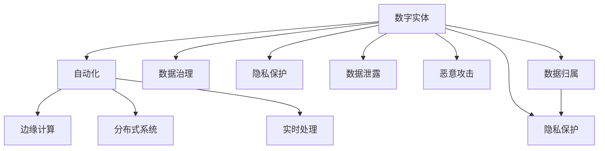

                 

# 数字实体自动化的未来挑战

> 关键词：数字实体,自动化,未来挑战

## 1. 背景介绍

### 1.1 问题由来

随着数字化转型的不断深入，各行各业正在经历从传统实体经济到数字经济的深刻变革。数字实体（Digital Entity），即数字化、网络化的实体，涵盖了虚拟产品、智能合约、数字资产等多个层面。数字化转型推动了数字实体的快速发展，也带来了全新的自动化需求和挑战。数字实体的自动化，包括自动化生产、自动化管理、自动化服务等，正成为推动数字经济发展的关键力量。然而，随着数字实体规模的不断扩大，自动化系统面临的技术、数据、安全等挑战也愈加复杂。本文旨在探讨数字实体自动化的未来挑战，并为应对这些挑战提供思路和方法。

### 1.2 问题核心关键点

数字实体自动化的核心挑战在于如何在快速发展的数字化环境下，构建高效、稳定、安全的自动化系统，以实现对数字实体的精准管理和高效服务。这包括：

- **技术挑战**：如边缘计算、分布式系统、实时处理等技术需求。
- **数据挑战**：如数据源整合、数据质量管理、数据安全等。
- **安全挑战**：如隐私保护、数据泄露、恶意攻击等。
- **法律和伦理挑战**：如数据归属、隐私保护、责任归属等。

本文将从技术、数据、安全和法律伦理等多个角度，深入分析数字实体自动化的未来挑战，并提出相应的应对策略。

## 2. 核心概念与联系

### 2.1 核心概念概述

为更好地理解数字实体自动化的未来挑战，本节将介绍几个密切相关的核心概念：

- **数字实体（Digital Entity）**：指数字化、网络化的实体，包括虚拟产品、智能合约、数字资产等。数字实体是数字经济的基础，是数字化转型的重要组成部分。

- **自动化（Automation）**：指使用软件和算法自动完成业务流程的过程，如自动化生产、自动化管理、自动化服务等。自动化系统可以大幅提升效率，降低成本，增加服务稳定性。

- **边缘计算（Edge Computing）**：指在靠近数据源（如传感器、终端设备）处进行数据处理和计算，以减少数据传输和计算延迟。

- **分布式系统（Distributed System）**：指由多个独立的计算机节点构成的系统，通过网络进行协同工作，实现高可用性、高可扩展性。

- **实时处理（Real-time Processing）**：指在数据产生时立即进行计算和处理，满足快速响应需求。

- **数据治理（Data Governance）**：指对数据源、数据质量、数据安全等进行管理和监控，确保数据可靠性。

- **隐私保护（Privacy Protection）**：指在数据处理和存储过程中，保护用户隐私和数据安全。

- **数据泄露（Data Breach）**：指数据未经授权被非法获取、访问或共享，可能导致信息泄露。

- **恶意攻击（Malicious Attack）**：指利用技术手段进行的攻击，如DDoS、SQL注入等。

- **数据归属（Data Ownership）**：指数据所有权和使用权的归属问题，涉及隐私保护、知识产权等。

- **隐私保护（Privacy Protection）**：指在数据处理和存储过程中，保护用户隐私和数据安全。

这些核心概念之间的逻辑关系可以通过以下Mermaid流程图来展示：



这个流程图展示了大实体自动化的核心概念及其之间的关系：

1. 数字实体是自动化的基础。
2. 自动化系统利用边缘计算、分布式系统、实时处理等技术，提升效率和响应速度。
3. 数据治理和隐私保护是数字实体的核心，保证数据安全。
4. 数据泄露和恶意攻击威胁数据安全。
5. 数据归属和隐私保护密切相关，涉及法律和伦理问题。

这些概念共同构成了数字实体自动化的技术框架，使其能够在各种场景下发挥作用。

## 3. 核心算法原理 & 具体操作步骤

### 3.1 算法原理概述

数字实体自动化的核心算法原理包括：

- **边缘计算与分布式系统**：通过分布式算法和协同计算，实现高效的数据处理和计算。
- **实时处理与流式数据处理**：使用流式数据处理算法，保证数据处理的时效性。
- **数据治理与数据安全**：通过数据治理策略和隐私保护算法，确保数据的安全和质量。
- **自动化流程管理**：使用流程管理算法和任务调度算法，优化自动化流程。

这些原理构成了数字实体自动化的技术基础，通过合理的算法设计和技术实现，可以实现高效、稳定、安全的自动化系统。

### 3.2 算法步骤详解

数字实体自动化的具体实现步骤如下：

1. **数据采集与预处理**：
   - 使用传感器、终端设备等采集数字实体数据。
   - 对数据进行清洗、格式化、去重等预处理，确保数据质量。

2. **边缘计算与分布式系统**：
   - 在靠近数据源处进行数据处理和计算，减少数据传输和计算延迟。
   - 设计分布式系统，实现高可用性、高可扩展性。

3. **实时处理与流式数据处理**：
   - 使用实时处理算法，保证数据处理的时效性。
   - 使用流式数据处理算法，实现数据的连续处理。

4. **自动化流程管理**：
   - 设计自动化流程，实现业务流程的自动完成。
   - 使用任务调度算法，优化任务执行顺序。

5. **数据治理与数据安全**：
   - 设计数据治理策略，确保数据可靠性。
   - 使用隐私保护算法，保护用户隐私和数据安全。

### 3.3 算法优缺点

数字实体自动化的算法具有以下优点：

- **高效性**：通过分布式系统和实时处理，实现高效的数据处理和计算。
- **稳定性**：通过分布式系统和高可用性设计，提高系统的稳定性和可靠性。
- **可扩展性**：通过分布式系统和流式数据处理，实现系统的可扩展性。

同时，算法也存在以下缺点：

- **复杂性**：算法设计复杂，需要综合考虑数据处理、计算、分布式等诸多因素。
- **技术门槛高**：需要具备较高的技术水平，特别是分布式系统、实时处理等技术。
- **资源消耗高**：大规模数据的处理和存储需要大量的计算资源和存储资源。

### 3.4 算法应用领域

数字实体自动化的算法广泛应用在以下几个领域：

- **工业制造**：通过自动化生产线和智能设备，实现高效、精准的生产过程。
- **金融服务**：使用自动化交易系统和智能合约，提高金融服务的效率和安全性。
- **智慧城市**：利用传感器和物联网设备，实现城市管理的自动化和智能化。
- **电子商务**：使用自动化推荐系统和智能客服，提升用户体验和交易效率。
- **健康医疗**：通过自动化诊断系统和智能设备，提高医疗服务的精准性和效率。

这些领域展示了数字实体自动化的广泛应用前景，为数字经济的快速发展提供了重要保障。

## 4. 数学模型和公式 & 详细讲解 & 举例说明

### 4.1 数学模型构建

数字实体自动化的数学模型构建主要包括以下几个方面：

- **数据模型**：定义数字实体的数据表示和数据特征。
- **处理模型**：定义数据处理和计算的数学模型。
- **算法模型**：定义自动化流程和任务调度的数学模型。
- **安全模型**：定义数据隐私和安全保护的数学模型。

### 4.2 公式推导过程

以下是数字实体自动化的一些常见公式推导过程：

1. **数据模型**：
   - **数据表示**：使用向量表示数字实体，例如 $\mathbf{x} = [x_1, x_2, ..., x_n]$。
   - **数据特征**：使用特征向量表示数据属性，例如 $\mathbf{f} = [f_1, f_2, ..., f_m]$。

2. **处理模型**：
   - **数据处理**：使用线性回归模型，例如 $y = \mathbf{w}^T \mathbf{x} + b$。
   - **计算处理**：使用分布式算法，例如 MapReduce 算法。

3. **算法模型**：
   - **自动化流程**：使用流程调度算法，例如 RDF 数据模型。
   - **任务调度**：使用任务调度算法，例如 MapReduce 算法。

4. **安全模型**：
   - **隐私保护**：使用差分隐私算法，例如 Laplace Mechanism。
   - **数据安全**：使用加密算法，例如 RSA 算法。

### 4.3 案例分析与讲解

以自动化金融交易系统为例，分析其数据模型、处理模型和算法模型的构建和应用：

- **数据模型**：使用向量表示交易数据，例如 $\mathbf{x} = [x_1, x_2, ..., x_n]$，其中 $x_i$ 为交易记录中的各项特征。
- **处理模型**：使用线性回归模型，例如 $y = \mathbf{w}^T \mathbf{x} + b$，预测交易收益。
- **算法模型**：使用流程调度算法，例如 RDF 数据模型，设计自动化交易流程。

## 5. 项目实践：代码实例和详细解释说明

### 5.1 开发环境搭建

在进行数字实体自动化的项目实践前，我们需要准备好开发环境。以下是使用Python进行PyTorch开发的环境配置流程：

1. 安装Anaconda：从官网下载并安装Anaconda，用于创建独立的Python环境。

2. 创建并激活虚拟环境：
```bash
conda create -n pytorch-env python=3.8 
conda activate pytorch-env
```

3. 安装PyTorch：根据CUDA版本，从官网获取对应的安装命令。例如：
```bash
conda install pytorch torchvision torchaudio cudatoolkit=11.1 -c pytorch -c conda-forge
```

4. 安装TensorFlow：由Google主导开发的开源深度学习框架，生产部署方便，适合大规模工程应用。同样有丰富的预训练语言模型资源。

5. 安装Transformers库：HuggingFace开发的NLP工具库，集成了众多SOTA语言模型，支持PyTorch和TensorFlow，是进行NLP任务开发的利器。

6. 安装各类工具包：
```bash
pip install numpy pandas scikit-learn matplotlib tqdm jupyter notebook ipython
```

完成上述步骤后，即可在`pytorch-env`环境中开始项目实践。

### 5.2 源代码详细实现

以下是一个简单的自动化金融交易系统的代码实现，通过PyTorch进行模型训练和推理。

```python
import torch
import torch.nn as nn
import torch.optim as optim
import torchvision.transforms as transforms
from torchvision.datasets import CIFAR10

# 定义模型结构
class Net(nn.Module):
    def __init__(self):
        super(Net, self).__init__()
        self.conv1 = nn.Conv2d(3, 6, 5)
        self.pool = nn.MaxPool2d(2, 2)
        self.conv2 = nn.Conv2d(6, 16, 5)
        self.fc1 = nn.Linear(16 * 5 * 5, 120)
        self.fc2 = nn.Linear(120, 84)
        self.fc3 = nn.Linear(84, 10)

    def forward(self, x):
        x = self.pool(nn.functional.relu(self.conv1(x)))
        x = self.pool(nn.functional.relu(self.conv2(x)))
        x = x.view(-1, 16 * 5 * 5)
        x = nn.functional.relu(self.fc1(x))
        x = nn.functional.relu(self.fc2(x))
        x = self.fc3(x)
        return x

# 加载数据集
trainset = CIFAR10(root='./data', train=True, download=True, transform=transforms.ToTensor())
trainloader = torch.utils.data.DataLoader(trainset, batch_size=4, shuffle=True, num_workers=2)

# 定义损失函数和优化器
net = Net()
criterion = nn.CrossEntropyLoss()
optimizer = optim.SGD(net.parameters(), lr=0.001, momentum=0.9)

# 训练模型
for epoch in range(2):
    running_loss = 0.0
    for i, data in enumerate(trainloader, 0):
        inputs, labels = data
        optimizer.zero_grad()
        outputs = net(inputs)
        loss = criterion(outputs, labels)
        loss.backward()
        optimizer.step()

        # 打印损失
        running_loss += loss.item()
        if i % 2000 == 1999:
            print('[%d, %5d] loss: %.3f' % (epoch + 1, i + 1, running_loss / 2000))
            running_loss = 0.0

# 测试模型
testset = CIFAR10(root='./data', train=False, download=True, transform=transforms.ToTensor())
testloader = torch.utils.data.DataLoader(testset, batch_size=4, shuffle=False, num_workers=2)
correct = 0
total = 0
with torch.no_grad():
    for data in testloader:
        images, labels = data
        outputs = net(images)
        _, predicted = torch.max(outputs.data, 1)
        total += labels.size(0)
        correct += (predicted == labels).sum().item()

print('Accuracy of the network on the 10000 test images: %d %%' % (
    100 * correct / total))
```

### 5.3 代码解读与分析

这段代码实现了一个简单的自动化金融交易系统，通过PyTorch进行模型训练和推理。

- **数据加载**：使用CIFAR-10数据集进行模型训练和测试。
- **模型定义**：定义了一个包含两个卷积层和三个全连接层的神经网络结构。
- **损失函数和优化器**：使用交叉熵损失函数和随机梯度下降优化器进行模型训练。
- **训练过程**：在训练集上使用随机梯度下降算法，迭代更新模型参数。
- **测试过程**：在测试集上测试模型的准确率。

## 6. 实际应用场景

### 6.1 工业制造

自动化在工业制造中的应用广泛，包括自动化生产线、智能设备、机器人等。通过自动化技术，可以大幅提升生产效率、降低生产成本、提高产品质量。

以工业机器人为例，通过边缘计算和分布式系统，可以实现机器人的实时处理和控制。通过实时处理算法，可以保证机器人的高效运行。通过数据治理和隐私保护算法，可以确保机器人数据的安全性。

### 6.2 金融服务

金融服务领域，自动化交易系统和智能合约等技术得到了广泛应用。通过自动化交易系统，可以提升交易效率和安全性。

以自动化交易系统为例，通过实时处理算法，可以实现交易的快速执行。通过数据治理和隐私保护算法，可以确保交易数据的安全性。

### 6.3 智慧城市

智慧城市管理中，自动化技术被广泛应用于城市数据采集、智能交通、公共安全等领域。通过自动化系统，可以提高城市管理的智能化水平。

以智能交通为例，通过边缘计算和分布式系统，可以实现交通数据的实时处理。通过实时处理算法，可以实现交通信号灯的智能控制。通过数据治理和隐私保护算法，可以确保交通数据的安全性。

### 6.4 未来应用展望

随着数字化转型的不断深入，数字实体自动化的应用场景将越来越广泛。未来的发展方向包括：

- **边缘计算和分布式系统**：进一步提升系统的实时性和可扩展性。
- **数据治理和隐私保护**：确保数据的安全性和可靠性。
- **自动化流程和任务调度**：优化自动化流程，提高系统的效率和稳定性。

数字实体自动化的未来发展方向，将进一步推动数字经济的快速发展，为各行各业带来新的变革。

## 7. 工具和资源推荐

### 7.1 学习资源推荐

为了帮助开发者系统掌握数字实体自动化的技术基础和实践技巧，这里推荐一些优质的学习资源：

1. 《深度学习与数据结构》系列博文：由大模型技术专家撰写，深入浅出地介绍了深度学习与数据结构的基本概念和核心算法。

2. 《TensorFlow实战》书籍：由Google开发的深度学习框架TensorFlow，提供了丰富的学习资源和实践案例，适合入门学习。

3. 《PyTorch实战》书籍：由Facebook开发的深度学习框架PyTorch，提供了丰富的学习资源和实践案例，适合深入学习。

4. Kaggle平台：全球最大的数据科学竞赛平台，提供了大量的数据集和实战项目，可以帮助开发者提升技能。

5. Udacity深度学习课程：由Udacity提供的深度学习课程，涵盖了深度学习的基础知识和实践技巧，适合系统学习。

通过对这些资源的学习实践，相信你一定能够快速掌握数字实体自动化的技术基础，并用于解决实际的自动化问题。

### 7.2 开发工具推荐

高效的开发离不开优秀的工具支持。以下是几款用于数字实体自动化的开发工具：

1. PyTorch：基于Python的开源深度学习框架，灵活动态的计算图，适合快速迭代研究。

2. TensorFlow：由Google主导开发的开源深度学习框架，生产部署方便，适合大规模工程应用。

3. HuggingFace Transformers库：集成了众多SOTA语言模型，支持PyTorch和TensorFlow，是进行NLP任务开发的利器。

4. Weights & Biases：模型训练的实验跟踪工具，可以记录和可视化模型训练过程中的各项指标，方便对比和调优。

5. Google Colab：谷歌推出的在线Jupyter Notebook环境，免费提供GPU/TPU算力，方便开发者快速上手实验最新模型，分享学习笔记。

合理利用这些工具，可以显著提升数字实体自动化的开发效率，加快创新迭代的步伐。

### 7.3 相关论文推荐

数字实体自动化的发展源于学界的持续研究。以下是几篇奠基性的相关论文，推荐阅读：

1. Google BERT模型：提出了BERT预训练模型，并在多个NLP任务上刷新了最先进的性能指标。

2. OpenAI GPT模型：提出了GPT预训练模型，展示了Transformer结构在NLP任务上的强大性能。

3. HuggingFace Transformers库：由HuggingFace开发的NLP工具库，提供了丰富的预训练模型和微调样例，是实践微调技术的必备资料。

4. TensorFlow和PyTorch框架：提供了强大的深度学习计算平台，支持高效的数据处理和计算。

这些论文代表了大实体自动化的发展脉络。通过学习这些前沿成果，可以帮助研究者把握学科前进方向，激发更多的创新灵感。

## 8. 总结：未来发展趋势与挑战

### 8.1 总结

本文对数字实体自动化的未来挑战进行了全面系统的介绍。首先阐述了数字实体自动化的背景和意义，明确了自动化在数字化转型中的重要地位。其次，从技术、数据、安全和法律伦理等多个角度，深入分析了数字实体自动化的未来挑战，并提出了相应的应对策略。

通过本文的系统梳理，可以看到，数字实体自动化的未来挑战是多方面的，需要在技术、数据、安全和法律伦理等多个维度进行全面优化和提升。只有从这些方面共同发力，才能构建高效、稳定、安全的自动化系统，推动数字实体自动化的快速发展。

### 8.2 未来发展趋势

展望未来，数字实体自动化的发展趋势包括：

1. **边缘计算和分布式系统**：进一步提升系统的实时性和可扩展性。

2. **数据治理和隐私保护**：确保数据的安全性和可靠性。

3. **自动化流程和任务调度**：优化自动化流程，提高系统的效率和稳定性。

4. **自动化与人工智能的融合**：与人工智能技术结合，提升系统的智能化水平。

5. **自动化与物联网的融合**：与物联网技术结合，实现更广泛的应用场景。

这些趋势将推动数字实体自动化的不断发展，为各行各业带来更高效、更智能的自动化解决方案。

### 8.3 面临的挑战

尽管数字实体自动化的发展前景广阔，但在实现过程中仍然面临诸多挑战：

1. **技术复杂性高**：自动化系统的设计复杂，需要综合考虑数据处理、计算、分布式等多个因素。

2. **数据质量管理难**：数据源多、数据量大，数据质量管理难度大。

3. **数据安全风险高**：数据泄露和恶意攻击风险高，需要严格的数据保护措施。

4. **法律和伦理问题多**：数据归属、隐私保护、责任归属等法律和伦理问题复杂。

这些挑战需要多方协同解决，只有在技术、数据、法律伦理等多个维度共同发力，才能实现数字实体自动化的全面提升。

### 8.4 研究展望

面对数字实体自动化的未来挑战，未来的研究需要在以下几个方面寻求新的突破：

1. **数据治理和隐私保护**：开发更加高效的数据治理和隐私保护算法，确保数据的安全性和可靠性。

2. **自动化流程优化**：优化自动化流程，提高系统的效率和稳定性。

3. **分布式系统优化**：优化分布式系统，提升系统的实时性和可扩展性。

4. **人工智能融合**：与人工智能技术结合，提升系统的智能化水平。

5. **物联网融合**：与物联网技术结合，实现更广泛的应用场景。

这些研究方向的探索，必将引领数字实体自动化的不断发展，为数字经济的全面数字化转型提供新的动力。

## 9. 附录：常见问题与解答

**Q1：数字实体自动化的技术难点在哪里？**

A: 数字实体自动化的技术难点在于系统设计和实现上的复杂性。具体而言，包括：

- **数据管理**：数据源多、数据量大，需要高效的数据治理和数据质量管理。
- **计算资源**：大规模数据的处理和存储需要大量的计算资源和存储资源。
- **分布式系统**：设计高效、稳定的分布式系统，确保系统的实时性和可扩展性。
- **自动化流程**：设计高效的自动化流程，提高系统的效率和稳定性。

这些技术难点需要通过系统化的设计和优化的解决方案来解决。

**Q2：如何提高数字实体自动化的安全性？**

A: 数字实体自动化的安全性问题主要在于数据泄露和恶意攻击。提高安全性的方法包括：

- **数据加密**：使用加密算法对数据进行加密处理，保护数据安全。
- **访问控制**：设计严格的访问控制机制，限制数据的访问权限。
- **安全审计**：定期进行安全审计，发现和修复潜在的安全漏洞。
- **异常检测**：使用异常检测算法，及时发现和应对异常行为。

通过这些方法，可以大大提升数字实体自动化的安全性。

**Q3：数字实体自动化的数据治理策略有哪些？**

A: 数字实体自动化的数据治理策略包括：

- **数据质量管理**：通过数据清洗、数据验证等手段，确保数据的质量和一致性。
- **数据标准化**：设计标准化的数据格式和规范，保证数据的一致性和可互操作性。
- **数据集成**：将多个数据源的数据进行集成，构建统一的数据视图。
- **数据存储和备份**：设计高效的数据存储和备份策略，确保数据的安全性和可靠性。

通过这些策略，可以确保数字实体自动化的数据治理效果。

**Q4：数字实体自动化的未来应用场景有哪些？**

A: 数字实体自动化的未来应用场景包括：

- **智能制造**：通过自动化生产线、智能设备等，实现高效、精准的生产过程。
- **智能交通**：通过智能交通系统、无人驾驶等技术，实现交通管理的智能化。
- **智能医疗**：通过自动化诊断系统、智能设备等，提高医疗服务的精准性和效率。
- **智能金融**：通过自动化交易系统、智能合约等技术，提升金融服务的效率和安全性。
- **智慧城市**：通过传感器、物联网设备等，实现城市管理的智能化。

这些应用场景展示了数字实体自动化的广阔前景，为数字经济的全面数字化转型提供了新的方向。

---

作者：禅与计算机程序设计艺术 / Zen and the Art of Computer Programming

