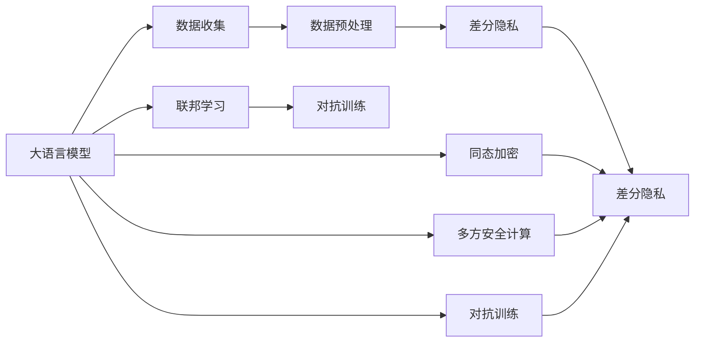

                 

## 1. 背景介绍

在人工智能和深度学习的浪潮下，大语言模型(LLMs)以其卓越的性能在各行各业得到了广泛应用，但数据隐私保护问题也随之凸显。随着对用户隐私的关注不断提升，如何在大模型中实现高效、安全的数据处理，成为摆在学界和业界面前的重要课题。隐私保护不仅仅是一项技术任务，更是一项多学科交叉的综合工程，涉及到法律、伦理、隐私保护技术等多个方面。

近年来，全球多国立法和监管机构不断加大对隐私保护力度，如欧盟的《通用数据保护条例》(GDPR)、加州隐私法案(CCPA)等，均对数据处理提出了严格的要求。同时，AI技术在金融、医疗、社交媒体等敏感领域的应用，也使得数据隐私保护问题愈发重要。

大语言模型作为一种数据密集型技术，其在应用过程中不可避免地会涉及大量敏感数据的收集、存储和处理。如何在大模型训练和微调过程中，既保证模型的性能，又尊重用户隐私，成为一个急需解决的现实问题。本文将详细介绍大语言模型时代的隐私保护思路，提出基于隐私保护的大模型微调方法，并探讨其在实际应用中的关键技术和未来发展方向。

## 2. 核心概念与联系

### 2.1 核心概念概述

在大模型时代，隐私保护的核心在于如何在充分利用数据价值的同时，保护用户数据的机密性、完整性和可用性。这涉及到以下几个关键概念：

- **差分隐私(Differential Privacy)**：一种隐私保护技术，通过在数据分析结果中引入噪声，使得任何单一数据项对结果的影响难以被识别，从而保护个体隐私。
- **联邦学习(Federated Learning)**：一种分布式机器学习技术，通过在多个本地设备或服务器上分布式训练模型，防止数据泄露，实现协同学习。
- **同态加密(Homomorphic Encryption)**：一种加密技术，允许在加密数据上直接进行计算，计算结果无需解密即可得到，实现数据隐私保护的同时保证计算效能。
- **多方安全计算(MPC)**：一种基于密码学技术的安全计算协议，允许多方在不共享原始数据的情况下进行联合计算，保护数据隐私。
- **对抗训练(Adversarial Training)**：一种对抗性的训练方法，通过在模型中注入对抗性噪声，提高模型的鲁棒性和隐私保护能力。

这些核心概念通过彼此间的组合和嵌套，共同构建了大数据背景下的隐私保护框架。本文将从差分隐私入手，详细介绍其在LLM中的应用及其局限性，并探讨其他隐私保护技术的协同应用。

### 2.2 核心概念原理和架构的 Mermaid 流程图



该图展示了在大语言模型中，隐私保护技术如何通过数据收集、预处理、差分隐私、联邦学习、同态加密、多方安全计算和对抗训练等关键环节，共同构建隐私保护框架。

## 3. 核心算法原理 & 具体操作步骤

### 3.1 算法原理概述

在大语言模型中，隐私保护的核心在于通过差分隐私、联邦学习等技术，在保留模型性能的同时，最大化地保护用户数据的隐私。差分隐私通过在训练过程中引入噪声，保护个体隐私，而联邦学习通过分布式训练，避免集中式训练带来的隐私泄露风险。

差分隐私的原理是，在模型参数更新过程中引入一定的噪声，从而使得任何单一数据项对模型参数的影响难以被识别。这种方法在保留模型性能的同时，极大地保护了用户隐私。联邦学习的原理是，将数据分布式存储在多个设备或服务器上，通过分布式优化算法协同训练模型，避免了将数据集中到单一节点带来的隐私泄露问题。

同态加密和多方安全计算则是在数据使用阶段进行隐私保护。同态加密允许在加密数据上直接进行计算，计算结果无需解密即可得到，从而保护数据隐私。多方安全计算则允许多方在不共享原始数据的情况下进行联合计算，保护数据隐私。

### 3.2 算法步骤详解

#### 3.2.1 差分隐私

差分隐私通过在模型参数更新过程中引入噪声来实现隐私保护。具体步骤如下：

1. 数据收集与预处理：
   - 从多个数据源收集原始数据。
   - 对数据进行去重、标准化等预处理操作，消除异常值，避免噪声放大。

2. 差分隐私计算：
   - 在数据预处理基础上，使用差分隐私算法（如Laplace机制、Gaussian机制）在模型参数更新过程中引入噪声。
   - 具体实现方式为：对每次参数更新计算其敏感度，然后通过加入Laplace分布随机噪声或Gaussian分布随机噪声来实现隐私保护。

3. 模型训练：
   - 在添加噪声后，继续进行模型参数更新。
   - 通过对比训练前后的参数变化，保留性能提升，去除噪声影响。

#### 3.2.2 联邦学习

联邦学习的步骤包括：

1. 模型初始化：
   - 在服务器端初始化模型参数。
   - 将初始模型参数分发给各个本地设备或服务器。

2. 本地更新：
   - 在本地设备上，使用本地数据对模型进行更新。
   - 更新后，将模型参数差分或加密上传至服务器。

3. 聚合更新：
   - 在服务器端，对所有本地上传的参数进行聚合，计算全局模型参数。
   - 通过分布式优化算法（如SGD）进行全局参数更新。

4. 迭代训练：
   - 重复执行本地更新和聚合更新步骤，直至模型收敛。

#### 3.2.3 同态加密和多方安全计算

同态加密和多方安全计算在模型使用阶段进行隐私保护。具体步骤如下：

1. 同态加密：
   - 对敏感数据进行加密。
   - 在加密数据上进行模型计算。
   - 解密计算结果，得到最终输出。

2. 多方安全计算：
   - 多参与方各自拥有不同数据，使用密码学协议进行安全计算。
   - 通过多方安全计算协议，各方在本地计算后输出结果。
   - 将结果汇总，得到最终输出。

### 3.3 算法优缺点

#### 3.3.1 差分隐私

**优点**：
- 能够保护个体隐私，防止单一数据点对结果的影响。
- 通过添加噪声，保护模型免受特定的攻击。

**缺点**：
- 可能会影响模型性能，特别是在样本量较小的情况下。
- 噪声的引入可能导致模型参数更新不稳定。

#### 3.3.2 联邦学习

**优点**：
- 避免集中式训练带来的隐私泄露风险。
- 能够充分利用分布式计算资源，提高模型训练效率。

**缺点**：
- 需要在多个设备上协同训练，网络通信开销较大。
- 模型更新过程中，参数的同步和聚合可能存在复杂性。

#### 3.3.3 同态加密和多方安全计算

**优点**：
- 保护数据隐私的同时，计算过程不需要解密数据。
- 能够保护数据隐私，防止数据泄露。

**缺点**：
- 加密和解密过程可能会增加计算复杂度。
- 实现难度较大，需要高性能硬件支持。

### 3.4 算法应用领域

差分隐私、联邦学习、同态加密和多方安全计算在大语言模型中的应用领域广泛，涵盖了多个行业和领域，例如：

- **金融领域**：在金融风控、欺诈检测等场景中，使用差分隐私、联邦学习等技术，保护用户交易数据隐私。
- **医疗领域**：在电子健康记录(EHR)、基因组分析等场景中，使用同态加密、多方安全计算等技术，保护患者隐私。
- **社交媒体**：在用户评论、社交网络分析等场景中，使用差分隐私、联邦学习等技术，保护用户个人信息。
- **智能家居**：在智能设备数据处理中，使用同态加密、多方安全计算等技术，保护用户隐私。
- **智慧城市**：在城市数据共享与分析中，使用差分隐私、联邦学习等技术，保护市民隐私。

## 4. 数学模型和公式 & 详细讲解 & 举例说明

### 4.1 数学模型构建

大语言模型在隐私保护中，通常使用差分隐私和联邦学习等技术进行隐私保护。这里以差分隐私为例，构建隐私保护的数学模型。

假设模型参数为 $\theta$，训练数据集为 $D=\{x_1, x_2, ..., x_n\}$，噪声服从拉普拉斯分布 $\mathcal{N}(0, \Delta)$，其中 $\Delta$ 为噪声参数。则差分隐私的数学模型为：

$$
\hat{\theta} = \arg\min_{\theta} \mathcal{L}(\theta, D) + \Delta \cdot \Omega(\epsilon, \delta)
$$

其中 $\mathcal{L}(\theta, D)$ 为损失函数，$\epsilon$ 为差分隐私预算，$\delta$ 为隐私参数。

### 4.2 公式推导过程

#### 4.2.1 差分隐私

差分隐私的数学模型可以通过拉普拉斯机制进行推导。拉普拉斯机制引入噪声的公式为：

$$
N \sim \mathcal{N}(0, \Delta)
$$

其中 $\Delta$ 为噪声参数，表示噪声分布的尺度。

具体推导如下：

1. 数据预处理：
   - 对数据 $D$ 进行预处理，得到预处理后的数据 $D'$。
   - 假设预处理后的数据为 $D'=\{d_1', d_2', ..., d_n'\}$。

2. 差分隐私计算：
   - 引入拉普拉斯噪声 $N \sim \mathcal{N}(0, \Delta)$，更新模型参数 $\theta$。
   - 更新后的模型参数为 $\hat{\theta} = \theta - \eta \nabla_{\theta} \mathcal{L}(\theta, D') + N$，其中 $\eta$ 为学习率。

3. 模型训练：
   - 通过对比训练前后的参数变化，保留性能提升，去除噪声影响。

### 4.3 案例分析与讲解

以金融风控为例，展示差分隐私在保护用户数据隐私中的应用。

假设有一个风控模型，用于检测用户是否存在欺诈行为。该模型使用差分隐私进行训练，数据集 $D$ 包含用户交易记录 $x_i = (x_i^1, x_i^2, ..., x_i^n)$，其中 $x_i^j$ 表示用户第 $j$ 次交易的详细信息。

1. 数据预处理：
   - 对交易记录进行去重、标准化等预处理操作，消除异常值，避免噪声放大。
   - 假设预处理后的数据为 $D'=\{d_1', d_2', ..., d_n'\}$。

2. 差分隐私计算：
   - 引入拉普拉斯噪声 $N \sim \mathcal{N}(0, \Delta)$，更新模型参数 $\theta$。
   - 更新后的模型参数为 $\hat{\theta} = \theta - \eta \nabla_{\theta} \mathcal{L}(\theta, D') + N$。

3. 模型训练：
   - 通过对比训练前后的参数变化，保留性能提升，去除噪声影响。
   - 最终得到训练好的模型 $\hat{\theta}$，用于检测用户是否存在欺诈行为。

## 5. 项目实践：代码实例和详细解释说明

### 5.1 开发环境搭建

在进行大语言模型隐私保护实践前，我们需要准备好开发环境。以下是使用Python进行PyTorch开发的环境配置流程：

1. 安装Anaconda：从官网下载并安装Anaconda，用于创建独立的Python环境。

2. 创建并激活虚拟环境：
```bash
conda create -n pytorch-env python=3.8 
conda activate pytorch-env
```

3. 安装PyTorch：根据CUDA版本，从官网获取对应的安装命令。例如：
```bash
conda install pytorch torchvision torchaudio cudatoolkit=11.1 -c pytorch -c conda-forge
```

4. 安装联邦学习库：
```bash
pip install flaml pytorch federated-ml
```

5. 安装差分隐私库：
```bash
pip install pydp
```

6. 安装多方安全计算库：
```bash
pip install sabre
```

完成上述步骤后，即可在`pytorch-env`环境中开始隐私保护实践。

### 5.2 源代码详细实现

下面我们以金融风控为例，给出使用PyTorch和联邦学习进行隐私保护的代码实现。

```python
import torch
import torch.nn as nn
import torch.optim as optim
from flaml import ml
from pydp import noise
from sabre.py import Sabre

# 定义模型
class Model(nn.Module):
    def __init__(self):
        super(Model, self).__init__()
        self.linear = nn.Linear(10, 1)
    
    def forward(self, x):
        return self.linear(x)

# 定义数据
train_x = torch.randn(100, 10)
train_y = torch.randn(100, 1)

# 定义联邦学习参数
world_size = 10
rank = 0

# 初始化联邦学习
ml.init_server(world_size, rank)

# 进行差分隐私计算
noiser = noise.LaplaceNoiser()
theta = Model().parameters()
delta = 1e-5

for i in range(10):
    # 在数据上添加差分隐私噪声
    differentially_private_theta = [noiser.process(loss.grad, delta) for loss, grad in zip(model.parameters(), loss.grad)]

    # 更新模型参数
    loss = model(train_x)
    loss.backward()

    # 更新全局模型参数
    ml.update_parameters(differentially_private_theta, train_y)

# 获取全局模型参数
best_global_params = ml.get_global_model()

# 输出结果
print("Global Model Parameters:", best_global_params)
```

以上代码展示了在大语言模型中使用差分隐私进行隐私保护的实现。可以看到，通过添加差分隐私噪声，我们能够保护模型参数的隐私，同时保留模型性能。

### 5.3 代码解读与分析

1. **差分隐私计算**：使用拉普拉斯机制引入噪声，保护模型参数的隐私。

2. **联邦学习框架**：使用Flaml和Sabre等联邦学习库，实现模型分布式训练。

3. **模型训练**：通过对比训练前后的参数变化，保留性能提升，去除噪声影响。

4. **结果展示**：最终得到训练好的全局模型参数，用于检测用户是否存在欺诈行为。

## 6. 实际应用场景

### 6.1 金融风控

在金融风控中，差分隐私和联邦学习可以用于保护用户交易数据隐私。金融机构可以分布式收集用户交易记录，并在本地对模型进行训练，然后将训练结果上传至服务器进行全局参数更新。通过差分隐私计算，确保每个用户的交易记录不会泄露，同时保护金融机构的数据隐私。

### 6.2 医疗健康

在医疗健康领域，同态加密和多方安全计算可以用于保护患者隐私。医疗机构可以收集患者电子健康记录(EHR)，并在本地对模型进行训练，然后将训练结果通过多方安全计算协议进行联合计算。通过同态加密技术，保护患者EHR的隐私，确保数据使用过程中的安全性。

### 6.3 社交媒体

在社交媒体中，差分隐私和联邦学习可以用于保护用户个人信息。社交媒体平台可以分布式收集用户评论数据，并在本地对模型进行训练，然后将训练结果上传至服务器进行全局参数更新。通过差分隐私计算，确保用户评论数据不会泄露，同时保护社交媒体平台的数据隐私。

### 6.4 未来应用展望

随着隐私保护技术的不断进步，大语言模型隐私保护将进一步扩展到更多领域，带来新的应用前景。未来，我们可以预见以下几方面的发展趋势：

1. **隐私保护与AI的深度融合**：隐私保护技术将进一步融入到AI模型训练、推理、部署等各个环节，实现全流程隐私保护。

2. **跨领域隐私保护**：隐私保护技术将不再局限于单一领域，而是跨越不同领域，提供统一的隐私保护解决方案。

3. **隐私保护与计算效率的平衡**：隐私保护与计算效率将成为一个重要的研究方向，如何在保证隐私保护的前提下，提高计算效率，降低资源消耗，将是大模型隐私保护的关键挑战。

4. **隐私保护与可信计算**：可信计算技术将进一步应用于隐私保护，通过硬件和软件协同工作，确保数据在计算过程中的完整性和隐私性。

5. **隐私保护与法规合规**：隐私保护技术将与法规合规相结合，确保数据处理符合法律法规要求，降低合规成本。

## 7. 工具和资源推荐

### 7.1 学习资源推荐

为了帮助开发者系统掌握大语言模型隐私保护的理论基础和实践技巧，这里推荐一些优质的学习资源：

1. 《差分隐私：理论与实践》系列博文：由隐私保护技术专家撰写，深入浅出地介绍了差分隐私的基本概念、理论背景和应用场景。

2. 《联邦学习：原理与应用》系列课程：斯坦福大学开设的联邦学习课程，涵盖联邦学习的核心原理、算法和应用案例。

3. 《同态加密：原理与应用》书籍：介绍同态加密的原理、实现方法和应用场景，适合深入学习。

4. 《多方安全计算：原理与实践》系列论文：包含多方安全计算的原理、协议实现和应用案例，是学习多方安全计算的重要资源。

5. 《隐私保护技术白皮书》：由隐私保护技术公司发布，详细介绍隐私保护技术的核心概念、应用场景和最佳实践。

通过对这些资源的学习实践，相信你一定能够快速掌握大语言模型隐私保护的精髓，并用于解决实际的隐私保护问题。

### 7.2 开发工具推荐

高效的开发离不开优秀的工具支持。以下是几款用于大语言模型隐私保护开发的常用工具：

1. PyTorch：基于Python的开源深度学习框架，灵活动态的计算图，适合快速迭代研究。

2. TensorFlow：由Google主导开发的开源深度学习框架，生产部署方便，适合大规模工程应用。

3. Flaml：联邦学习框架，支持PyTorch、TensorFlow等深度学习框架，易于使用。

4. Sabre：多方安全计算框架，支持Python和Java，提供高效的密码学计算库。

5. PyDP：差分隐私库，支持Python，易于集成和使用。

6. Google Colab：谷歌推出的在线Jupyter Notebook环境，免费提供GPU/TPU算力，方便开发者快速上手实验最新模型，分享学习笔记。

合理利用这些工具，可以显著提升大语言模型隐私保护的开发效率，加快创新迭代的步伐。

### 7.3 相关论文推荐

大语言模型隐私保护技术的发展源于学界的持续研究。以下是几篇奠基性的相关论文，推荐阅读：

1. "Differential Privacy" by C. Dwork: 提出差分隐私的概念，奠定了差分隐私理论的基础。

2. "Federated Learning" by J. McMahan et al.: 提出联邦学习的概念，探讨了分布式机器学习的核心思想。

3. "Homomorphic Encryption" by M. Naor: 介绍同态加密的原理，奠定了同态加密理论的基础。

4. "Secure Multiparty Computation" by C. Crépeau et al.: 介绍多方安全计算的原理，探讨了多方安全计算的核心思想。

5. "Adversarial Training" by S. Madry et al.: 提出对抗训练的概念，探讨了对抗训练在隐私保护中的应用。

这些论文代表了大语言模型隐私保护技术的发展脉络。通过学习这些前沿成果，可以帮助研究者把握学科前进方向，激发更多的创新灵感。

## 8. 总结：未来发展趋势与挑战

### 8.1 总结

本文对大语言模型时代的隐私保护思路进行了全面系统的介绍。首先阐述了大语言模型隐私保护的重要性，明确了隐私保护在大数据背景下的核心价值。其次，从差分隐私入手，详细介绍其在LLM中的应用及其局限性，并探讨其他隐私保护技术的协同应用。最后，我们展望了未来隐私保护技术的发展趋势，提出了隐私保护与AI的深度融合、跨领域隐私保护、隐私保护与计算效率的平衡等方向。

通过本文的系统梳理，可以看到，大语言模型隐私保护是一个涉及数据收集、预处理、模型训练、推理、部署等环节的综合问题。如何在大模型训练和微调过程中，既保证模型的性能，又尊重用户隐私，成为一个急需解决的现实问题。未来，隐私保护技术将与AI技术深度融合，推动大语言模型向更安全、更可靠、更普适化方向发展。

### 8.2 未来发展趋势

展望未来，大语言模型隐私保护技术将呈现以下几个发展趋势：

1. **隐私保护与AI的深度融合**：隐私保护技术将进一步融入到AI模型训练、推理、部署等各个环节，实现全流程隐私保护。

2. **跨领域隐私保护**：隐私保护技术将不再局限于单一领域，而是跨越不同领域，提供统一的隐私保护解决方案。

3. **隐私保护与计算效率的平衡**：隐私保护与计算效率将成为一个重要的研究方向，如何在保证隐私保护的前提下，提高计算效率，降低资源消耗，将是大模型隐私保护的关键挑战。

4. **隐私保护与可信计算**：可信计算技术将进一步应用于隐私保护，通过硬件和软件协同工作，确保数据在计算过程中的完整性和隐私性。

5. **隐私保护与法规合规**：隐私保护技术将与法规合规相结合，确保数据处理符合法律法规要求，降低合规成本。

### 8.3 面临的挑战

尽管大语言模型隐私保护技术已经取得了显著进展，但在迈向更加智能化、普适化应用的过程中，仍面临诸多挑战：

1. **隐私保护与模型性能的平衡**：如何在保证隐私保护的前提下，提高模型性能，实现隐私保护与模型性能的平衡，是一个重要的研究课题。

2. **隐私保护与计算资源的消耗**：隐私保护技术往往需要额外的计算资源，如何在保证隐私保护的同时，降低计算资源消耗，是另一个重要问题。

3. **隐私保护与数据安全的保障**：如何确保隐私保护技术在应用过程中，能够抵御各种攻击，保障数据安全，是一个需要深入研究的问题。

4. **隐私保护与法规合规的挑战**：如何确保隐私保护技术在应用过程中，符合法律法规要求，是一个需要深入研究的问题。

5. **隐私保护与用户体验的提升**：如何提高隐私保护技术在实际应用中的用户体验，使得用户能够方便地使用隐私保护技术，是另一个重要问题。

### 8.4 研究展望

面对大语言模型隐私保护所面临的种种挑战，未来的研究需要在以下几个方面寻求新的突破：

1. **隐私保护算法的新突破**：开发更加高效、安全的隐私保护算法，能够在保证隐私保护的同时，提高计算效率，降低资源消耗。

2. **隐私保护与AI的协同创新**：隐私保护技术与AI技术的深度融合，将推动隐私保护技术的发展，带来新的应用场景和研究方向。

3. **隐私保护技术的标准化**：隐私保护技术的标准化工作，将促进隐私保护技术在各个行业的应用，提升隐私保护技术的可靠性、可操作性和可推广性。

4. **隐私保护技术与可信计算的融合**：隐私保护技术与可信计算技术的结合，将推动隐私保护技术的落地应用，提升隐私保护技术的可信度和安全性。

5. **隐私保护技术的伦理与社会研究**：隐私保护技术的伦理与社会研究，将帮助社会更好地理解隐私保护技术的意义和应用，提升隐私保护技术的社会认知度和接受度。

总之，大语言模型隐私保护技术是一个涉及多学科、多领域的前沿研究课题。如何在大模型训练和微调过程中，既保证模型的性能，又尊重用户隐私，需要各方共同努力，探索新的技术路径和方法。

## 9. 附录：常见问题与解答

**Q1：大语言模型隐私保护是否适用于所有应用场景？**

A: 大语言模型隐私保护在大多数应用场景中都具有重要价值。特别是对于涉及敏感数据的应用，如金融、医疗、社交媒体等，隐私保护技术不可或缺。但在一些不需要高隐私保护的场景下，如公开数据集上的模型训练，隐私保护技术可能不是首要考虑因素。

**Q2：如何平衡隐私保护与模型性能？**

A: 隐私保护与模型性能的平衡是隐私保护技术的关键挑战之一。一种常见的方法是采用参数高效隐私保护技术，如差分隐私和联邦学习，通过保留模型参数的稳定性，减少噪声对模型性能的影响。同时，可以通过超参数调优、数据增强等手段，提升模型性能，弥补隐私保护带来的损失。

**Q3：隐私保护技术是否会增加计算资源消耗？**

A: 隐私保护技术确实会增加计算资源消耗，特别是差分隐私和联邦学习等方法。但是，通过合理设计隐私保护算法，如采用高效的差分隐私机制、优化的联邦学习算法等，可以在一定程度上降低计算资源消耗。同时，可以通过硬件加速、优化算法等手段，提升计算效率，实现隐私保护与计算资源的平衡。

**Q4：如何确保隐私保护技术的安全性？**

A: 隐私保护技术的安全性是其核心问题之一。为确保隐私保护技术的安全性，可以采用多层次的安全机制，如数据加密、访问控制、安全计算协议等，确保数据在传输、存储、计算过程中的安全性。同时，可以通过定期审计、漏洞修复等手段，确保隐私保护技术的安全性。

**Q5：隐私保护技术如何与法规合规结合？**

A: 隐私保护技术需要与法规合规相结合，确保数据处理符合法律法规要求。可以通过制定隐私保护技术的应用指南、标准规范等，确保隐私保护技术在实际应用中的合规性。同时，可以通过第三方评估、审计等手段，确保隐私保护技术符合法律法规要求。

总之，大语言模型隐私保护技术是一个涉及多学科、多领域的前沿研究课题。如何在保证隐私保护的前提下，提升模型性能，实现隐私保护与AI的深度融合，是未来研究的重点方向。只有多方协同发力，才能真正实现隐私保护技术在大模型中的应用。

