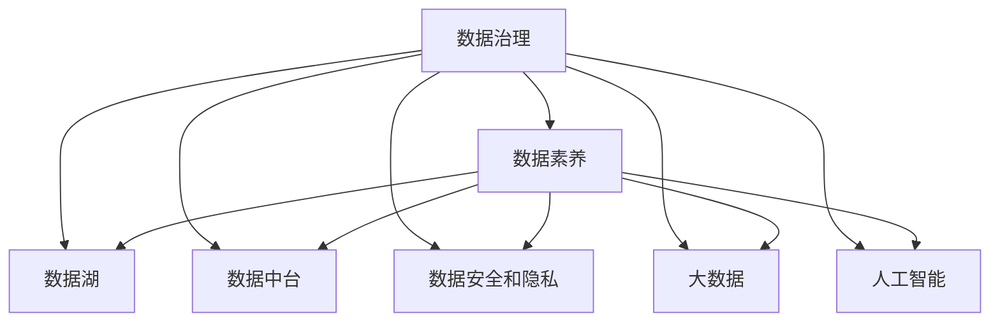

                 

# 数据治理与数据素养：软件2.0时代的管理新课题

> 关键词：数据治理, 数据素养, 软件2.0, 数据湖, 数据中台, 数据安全和隐私, 大数据, 人工智能

## 1. 背景介绍

### 1.1 问题由来

在软件1.0时代，程序员关注的是代码逻辑的正确性和系统的稳定运行。然而随着科技的进步，数据的地位不断提升，数据已经成为了企业最重要的资产之一。在软件2.0时代，数据驱动已成为企业数字化转型的核心，因此数据治理和数据素养成为了新的管理课题。

### 1.2 问题核心关键点

数据治理和数据素养的核心在于如何高效、安全、合规地管理数据，以实现数据的价值最大化。这涉及数据质量管理、数据安全管理、数据隐私管理、数据标准管理等多个方面。其关键点包括：

1. **数据质量管理**：保证数据的准确性、完整性、一致性和及时性。
2. **数据安全管理**：确保数据在传输、存储、处理过程中的安全。
3. **数据隐私管理**：遵守数据隐私法律法规，保护个人隐私信息。
4. **数据标准管理**：制定统一的数据存储、处理标准，确保数据一致性和互通性。
5. **数据生命周期管理**：从数据产生到废弃的全程跟踪和管控。

### 1.3 问题研究意义

在数据驱动的时代，数据治理和数据素养对企业的成功至关重要。通过有效的数据治理和数据素养培养，企业能够：

1. **提升决策质量**：以高质量的数据为基础，做出更准确、更有价值的决策。
2. **优化业务流程**：通过数据洞察，优化业务运营，提高效率。
3. **增强竞争力**：利用数据驱动的创新，在市场中获得竞争优势。
4. **保障数据安全**：防止数据泄露、滥用，维护公司声誉和法律合规。
5. **推动数字化转型**：构建数据驱动的业务生态，推动企业全面数字化。

## 2. 核心概念与联系

### 2.1 核心概念概述

为了更深入地理解数据治理和数据素养，我们先了解几个核心概念：

1. **数据治理(Data Governance)**：指企业对数据的全面管理，涵盖数据的规划、设计、创建、收集、存储、使用、保护、存档和销毁。

2. **数据素养(Data Literacy)**：指对数据的理解、解释和应用能力，是企业员工数据使用技能和数据意识的总和。

3. **软件2.0(Software 2.0)**：与软件1.0强调代码逻辑不同，软件2.0强调数据驱动和AI赋能，让软件系统能够自动从数据中学习并做出决策。

4. **数据湖(Data Lake)**：是指一个存储企业所有数据的大型存储库，包括传统关系型数据和新兴的非结构化数据。

5. **数据中台(Data Mesh)**：是一个数据处理平台，帮助企业构建统一、可扩展的数据资产，支持多个业务部门的数据共享和协作。

6. **数据安全和隐私(Data Security and Privacy)**：确保数据的保密性、完整性和可用性，保护用户隐私。

7. **大数据(Big Data)**：指超大规模、复杂的数据集，传统处理方式难以应对。

8. **人工智能(AI)**：利用算法和模型从数据中学习和提取知识，驱动决策和行动。

这些概念之间的逻辑关系可以通过以下Mermaid流程图来展示：



这个流程图展示了数据治理、数据素养与数据管理各个环节之间的联系：

1. 数据治理确保了数据的质量和安全，数据素养提升了员工对数据的理解和应用能力。
2. 数据湖、数据中台、大数据和人工智能是数据治理的具体实践和技术支持。
3. 数据安全和隐私是数据治理的重要组成部分，确保数据治理的合规性和有效性。

## 3. 核心算法原理 & 具体操作步骤

### 3.1 算法原理概述

数据治理的核心算法包括数据清洗、数据标准化、数据分类、数据聚类、数据挖掘等。这些算法通过数学和统计方法，帮助企业识别和处理数据中的问题，提升数据质量。

### 3.2 算法步骤详解

以下是一个数据治理的通用流程：

1. **数据收集**：从各个业务部门和系统收集数据。
2. **数据清洗**：识别和处理数据中的错误、重复、缺失值等。
3. **数据标准化**：统一数据格式和标准，保证数据的一致性。
4. **数据分类**：根据业务需求对数据进行分类。
5. **数据聚类**：使用聚类算法发现数据中的模式和分组。
6. **数据挖掘**：使用挖掘算法提取有价值的信息和知识。
7. **数据可视化和报告**：通过可视化工具展示数据治理结果，生成报告。

### 3.3 算法优缺点

数据治理算法的主要优点包括：

1. **提升数据质量**：确保数据的准确性、完整性和一致性。
2. **优化数据管理**：统一数据标准，简化数据管理和分析。
3. **增强决策支持**：提供高质量的数据支持决策制定。

缺点主要包括：

1. **成本高**：数据清洗和标准化需要投入大量人力和资源。
2. **复杂性高**：算法复杂，需要专业知识。
3. **时效性差**：处理大规模数据集耗时较长。
4. **依赖数据质量**：数据质量低时效果不佳。

### 3.4 算法应用领域

数据治理算法广泛应用于金融、医疗、零售、制造等多个行业，具体应用包括：

1. **金融行业**：处理信用卡交易数据、反欺诈分析、信用评分等。
2. **医疗行业**：病历数据标准化、疾病预测、药物研发等。
3. **零售行业**：销售数据清洗、库存管理、客户分析等。
4. **制造业**：设备数据监测、供应链优化、质量控制等。

## 4. 数学模型和公式 & 详细讲解 & 举例说明

### 4.1 数学模型构建

数据治理中的数学模型通常包括：

1. **数据清洗模型**：用于识别和修正数据中的错误和缺失值。
2. **数据标准化模型**：用于将数据转换为统一格式。
3. **数据分类模型**：用于将数据分成不同类别。
4. **数据聚类模型**：用于发现数据中的模式和分组。
5. **数据挖掘模型**：用于提取有价值的信息和知识。

### 4.2 公式推导过程

以数据聚类为例，K-means算法是最常用的数据聚类算法之一。其核心公式为：

$$
C_k = \arg\min_{C_k} \sum_{i=1}^n \sum_{j=1}^k \|x_i - \mu_j\|^2
$$

其中，$x_i$ 是数据点，$\mu_j$ 是聚类中心，$C_k$ 是聚类结果。

### 4.3 案例分析与讲解

假设我们有一份销售数据集，数据中存在一些异常值和重复值。我们可以使用以下步骤进行数据清洗：

1. **异常值检测**：使用IQR方法或箱线图检测异常值，并将其删除。
2. **重复值检测**：使用去重算法（如哈希表）删除重复值。
3. **缺失值处理**：根据业务规则填补缺失值，如均值填补、插值等。

## 5. 项目实践：代码实例和详细解释说明

### 5.1 开发环境搭建

在进行数据治理项目开发前，我们需要准备好开发环境。以下是使用Python进行Pandas开发的环境配置流程：

1. 安装Anaconda：从官网下载并安装Anaconda，用于创建独立的Python环境。

2. 创建并激活虚拟环境：
```bash
conda create -n pydata-env python=3.8 
conda activate pydata-env
```

3. 安装Pandas：
```bash
conda install pandas
```

4. 安装其他相关工具包：
```bash
pip install numpy scipy matplotlib seaborn sklearn
```

完成上述步骤后，即可在`pydata-env`环境中开始数据治理项目开发。

### 5.2 源代码详细实现

下面我们以销售数据清洗为例，给出使用Pandas库进行数据清洗的PyTorch代码实现。

```python
import pandas as pd

# 加载数据
sales_data = pd.read_csv('sales_data.csv')

# 异常值检测
sales_data = sales_data[sales_data['销售额'] > 0]

# 重复值检测
sales_data.drop_duplicates(inplace=True)

# 缺失值处理
sales_data.fillna(method='ffill', inplace=True)
```

### 5.3 代码解读与分析

让我们再详细解读一下关键代码的实现细节：

1. **加载数据**：使用Pandas的`read_csv`函数加载销售数据。

2. **异常值检测**：通过筛选条件`[sales_data['销售额'] > 0]`保留正数销售额，使用布尔索引操作。

3. **重复值检测**：使用`drop_duplicates`函数删除重复行。

4. **缺失值处理**：使用`fillna`函数进行前向填补，保留原始数据结构。

以上代码实现了基本的异常值检测和缺失值处理，Pandas库的强大功能和简洁语法使得数据清洗变得非常简单高效。

## 6. 实际应用场景

### 6.1 金融行业

在金融行业中，数据治理尤为重要。以下是一个典型的金融数据治理项目：

1. **数据采集**：从银行系统和第三方数据源采集客户交易数据。
2. **数据清洗**：清洗和标准化交易数据，确保数据的准确性。
3. **数据分类**：根据交易类型、金额、时间等维度进行分类。
4. **数据聚类**：发现异常交易行为，如欺诈检测。
5. **数据挖掘**：通过机器学习模型预测客户信用评分。

### 6.2 医疗行业

医疗行业的数据治理包括病历数据、实验室数据、临床数据等多个方面。以下是一个医疗数据治理项目：

1. **数据收集**：从医院信息系统、实验室管理系统等采集数据。
2. **数据清洗**：清洗和标准化病历数据，确保数据的完整性和一致性。
3. **数据分类**：根据疾病类型、治疗方案等维度进行分类。
4. **数据聚类**：发现疾病模式，支持诊断和治疗。
5. **数据挖掘**：通过机器学习模型预测病情发展趋势。

### 6.3 零售行业

零售行业的数据治理主要关注销售数据、库存数据和客户数据。以下是一个零售数据治理项目：

1. **数据采集**：从POS系统、库存管理系统等采集数据。
2. **数据清洗**：清洗和标准化销售数据，确保数据的准确性。
3. **数据分类**：根据产品类别、销售渠道等维度进行分类。
4. **数据聚类**：发现销售模式，优化库存管理。
5. **数据挖掘**：通过机器学习模型预测销售趋势。

### 6.4 未来应用展望

未来，数据治理和数据素养将成为企业数字化转型的核心能力，其应用前景广阔：

1. **自动化数据治理**：通过机器学习算法自动化数据治理过程，提高效率。
2. **实时数据治理**：构建实时数据治理系统，及时发现和解决问题。
3. **数据治理平台**：开发统一的数据治理平台，实现数据集中管理和治理。
4. **数据素养培训**：通过培训和认证，提升员工数据素养和技能。

## 7. 工具和资源推荐

### 7.1 学习资源推荐

为了帮助开发者系统掌握数据治理和数据素养，这里推荐一些优质的学习资源：

1. 《数据治理实践指南》：全面介绍了数据治理的理论和实践，提供大量案例和最佳实践。
2. 《数据素养教程》：详细讲解了数据素养的基本概念和应用场景。
3. 《Python数据处理》课程：介绍Pandas、NumPy等数据处理工具的用法。
4. 《大数据与人工智能》在线课程：讲解大数据处理和AI算法的基础知识和应用。
5. 《数据治理最佳实践》书籍：提供了数据治理的具体方法和实践经验。

通过对这些资源的学习实践，相信你一定能够快速掌握数据治理和数据素养的核心内容，并用于解决实际的数据管理问题。

### 7.2 开发工具推荐

高效的数据治理开发离不开优秀的工具支持。以下是几款用于数据治理开发的常用工具：

1. Apache Spark：分布式大数据处理框架，支持多种数据源和算法。
2. Apache Hadoop：分布式存储和计算框架，支持海量数据处理。
3. Apache Kafka：分布式流处理平台，支持实时数据采集和处理。
4. Apache Flink：分布式流处理和批处理框架，支持复杂的数据处理任务。
5. Apache Cassandra：分布式数据库，支持高可用性和高扩展性。

合理利用这些工具，可以显著提升数据治理任务的开发效率，加速创新迭代的步伐。

### 7.3 相关论文推荐

数据治理和数据素养的研究源于学界的持续研究。以下是几篇奠基性的相关论文，推荐阅读：

1. "Data Governance: An Overview"：全面介绍了数据治理的框架和最佳实践。
2. "Data Literacy in Practice"：探讨了数据素养在企业中的应用和提升方法。
3. "Big Data Governance: Challenges and Solutions"：分析了大数据治理面临的挑战和解决方案。
4. "Towards a Data-Driven Enterprise"：讨论了数据驱动型企业的数据治理策略。
5. "A Survey on Data Governance"：总结了数据治理的研究进展和未来方向。

这些论文代表了大数据治理和数据素养的研究趋势，通过学习这些前沿成果，可以帮助研究者把握学科前进方向，激发更多的创新灵感。

## 8. 总结：未来发展趋势与挑战

### 8.1 总结

本文对数据治理和数据素养的理论基础和实践方法进行了全面系统的介绍。首先阐述了数据治理和数据素养的背景和意义，明确了数据治理在提升数据质量、优化业务流程和增强企业竞争力等方面的重要性。其次，从原理到实践，详细讲解了数据治理的数学模型和算法步骤，给出了数据治理任务开发的完整代码实例。同时，本文还探讨了数据治理在金融、医疗、零售等多个行业的应用场景，展示了数据治理技术的广阔前景。

通过本文的系统梳理，可以看到，数据治理和数据素养已经成为软件2.0时代企业数字化转型的核心能力，极大地提升了企业的决策质量和运营效率。未来，伴随数据治理技术的持续演进，企业将能够更好地利用数据驱动决策，实现更高的数字化转型成功率。

### 8.2 未来发展趋势

展望未来，数据治理和数据素养将呈现以下几个发展趋势：

1. **自动化水平提升**：通过自动化工具和算法，数据治理过程将变得更加高效和可靠。
2. **实时数据治理**：构建实时数据治理系统，及时发现和解决问题。
3. **数据治理平台普及**：开发统一的数据治理平台，实现数据集中管理和治理。
4. **数据素养培训普及**：通过培训和认证，提升员工数据素养和技能。
5. **多数据源融合**：实现多数据源的无缝集成和融合，提升数据价值。
6. **数据安全和隐私保护**：加强数据安全和隐私保护，确保数据治理的合规性和安全性。

这些趋势凸显了数据治理和数据素养技术的广泛应用前景，相信在各行业的共同推动下，数据治理将成为企业数字化转型的核心驱动力。

### 8.3 面临的挑战

尽管数据治理技术已经取得了显著成就，但在迈向更加智能化、普适化应用的过程中，它仍面临着诸多挑战：

1. **数据质量问题**：数据源多样性和复杂性增加了数据质量管理的难度。
2. **数据标准不统一**：不同业务部门的数据标准不一致，难以实现数据互通。
3. **数据治理成本高**：数据清洗和标准化需要大量人力和资源。
4. **数据安全和隐私问题**：数据泄露和滥用风险增加，需加强安全防护。
5. **技术复杂度高**：数据治理涉及多个技术和工具，技术门槛高。

### 8.4 研究展望

未来，数据治理和数据素养需要更多技术创新和政策支持：

1. **技术创新**：开发自动化、智能化的数据治理工具，提升数据治理效率和效果。
2. **政策支持**：制定和完善数据治理和数据素养相关的法律法规，保障数据安全。
3. **跨部门协作**：加强跨部门、跨行业的协作，实现数据资源共享和互通。
4. **数据素养培训**：通过培训和认证，提升员工数据素养和技能，推动数据文化建设。
5. **数据治理平台**：开发统一的数据治理平台，实现数据集中管理和治理。

这些研究方向将引领数据治理和数据素养技术迈向更高的台阶，为构建安全、可靠、可解释、可控的智能系统铺平道路。面向未来，数据治理和数据素养技术还需要与其他人工智能技术进行更深入的融合，如知识表示、因果推理、强化学习等，多路径协同发力，共同推动自然语言理解和智能交互系统的进步。只有勇于创新、敢于突破，才能不断拓展数据治理的边界，让数据驱动智能技术更好地服务于社会。

## 9. 附录：常见问题与解答

**Q1：数据治理和数据素养有什么区别？**

A: 数据治理关注的是数据的全面管理，包括数据收集、清洗、标准化、分类、聚类、挖掘等，确保数据的质量和安全。而数据素养则关注的是数据使用者的能力，包括数据理解、数据解释、数据应用等，提升数据使用的价值。

**Q2：如何提高数据质量？**

A: 提高数据质量需要多方面的努力：
1. 数据清洗：清洗和标准化数据，确保数据的准确性。
2. 数据标准化：统一数据格式和标准，保证数据的一致性。
3. 数据验证：定期检查数据质量，及时发现和修复问题。
4. 数据治理：建立数据治理流程和制度，确保数据管理有序。

**Q3：数据治理需要哪些技术支持？**

A: 数据治理需要以下技术支持：
1. 数据清洗技术：用于清洗和标准化数据。
2. 数据分类技术：用于将数据分为不同类别。
3. 数据聚类技术：用于发现数据中的模式和分组。
4. 数据挖掘技术：用于提取有价值的信息和知识。
5. 数据可视化技术：用于展示数据治理结果。

**Q4：数据治理和数据素养在实际应用中有哪些挑战？**

A: 数据治理和数据素养在实际应用中面临以下挑战：
1. 数据质量问题：数据源多样性和复杂性增加了数据质量管理的难度。
2. 数据标准不统一：不同业务部门的数据标准不一致，难以实现数据互通。
3. 数据治理成本高：数据清洗和标准化需要大量人力和资源。
4. 数据安全和隐私问题：数据泄露和滥用风险增加，需加强安全防护。
5. 技术复杂度高：数据治理涉及多个技术和工具，技术门槛高。

通过不断优化和改进，这些挑战有望得到逐步解决，数据治理和数据素养的实践将更加成熟和有效。

---

作者：禅与计算机程序设计艺术 / Zen and the Art of Computer Programming

