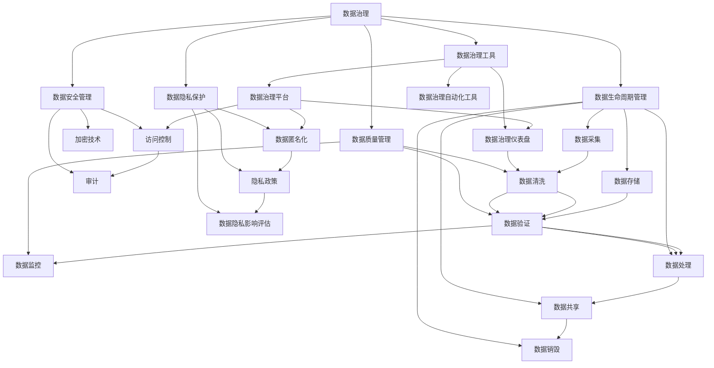

                 

# 数据治理体系：保障 AI 2.0 数据安全和隐私

> 关键词：数据治理, AI 2.0, 数据安全, 数据隐私, 数据管理, 隐私保护

## 1. 背景介绍

### 1.1 问题由来

随着人工智能技术的迅猛发展，尤其是AI 2.0时代的到来，数据成为了驱动人工智能模型训练和应用的关键资源。数据治理（Data Governance）作为保障数据安全和隐私的重要手段，其重要性愈发凸显。然而，在数据规模日益增长、数据类型日益多样化的背景下，传统的数据治理方法难以满足AI 2.0时代对数据安全和隐私的更高要求。

### 1.2 问题核心关键点

在AI 2.0时代，数据治理的主要目标是确保数据的完整性、准确性、一致性和安全性，保障AI模型在数据使用过程中的合法合规性。具体而言，数据治理需要做到以下几点：

- **数据质量管理**：确保数据的一致性、准确性和完整性，避免数据噪声对模型训练和应用的影响。
- **数据安全管理**：通过加密、访问控制、审计等措施，保护数据免受未经授权的访问和滥用。
- **数据隐私保护**：遵循数据最小化、匿名化等原则，确保用户数据的隐私不受侵害。
- **数据生命周期管理**：从数据的采集、存储、处理到销毁，进行全生命周期的治理，确保数据使用的合规性和合法性。
- **数据治理工具与技术**：利用自动化工具和先进技术，提高数据治理的效率和质量。

### 1.3 问题研究意义

随着数据在AI应用中扮演越来越重要的角色，数据治理的重要性也日益凸显。研究表明，数据质量问题和数据泄露事件是AI应用失败的主要原因之一。有效的数据治理不仅能提升数据质量，降低模型训练和推理的误差，还能保障用户隐私，增强用户信任，促进AI技术的广泛应用。

## 2. 核心概念与联系

### 2.1 核心概念概述

在AI 2.0时代，数据治理涉及到多个核心概念，包括：

- **数据治理**：通过制定数据治理政策、标准和流程，确保数据的质量、安全和隐私。
- **数据安全**：通过技术和管理手段，保障数据的机密性、完整性和可用性，防止数据泄露和滥用。
- **数据隐私**：遵循隐私保护法规和最佳实践，确保用户数据的合法使用和隐私保护。
- **数据质量**：通过数据清洗、数据验证、数据监控等手段，确保数据的一致性和准确性。
- **数据生命周期管理**：对数据的采集、存储、处理、共享和销毁进行全生命周期的治理。
- **数据治理工具**：使用自动化工具和先进技术，提高数据治理的效率和质量。

这些概念之间相互关联，共同构成了AI 2.0时代数据治理的体系框架。通过制定科学合理的治理政策，选择合适的技术工具，落实详细的数据治理流程，可以全面保障AI模型使用的数据安全与隐私。

### 2.2 核心概念原理和架构的 Mermaid 流程图



上述流程图示意图清晰地展示了数据治理各个模块之间的逻辑关系。

## 3. 核心算法原理 & 具体操作步骤

### 3.1 算法原理概述

在AI 2.0时代，数据治理的算法原理主要基于以下三个方面：

1. **数据质量管理**：通过数据清洗、数据验证和数据监控等算法，确保数据的准确性、完整性和一致性。
2. **数据安全管理**：利用加密技术、访问控制和审计等算法，保障数据的机密性、完整性和可用性。
3. **数据隐私保护**：通过数据匿名化、隐私政策制定和隐私影响评估等算法，确保用户数据的隐私安全。

### 3.2 算法步骤详解

#### 3.2.1 数据质量管理

数据质量管理的主要算法步骤如下：

1. **数据清洗**：通过算法检测并修正数据中的错误、缺失、重复等异常情况，确保数据的准确性。
2. **数据验证**：利用算法对数据进行验证，检测数据是否符合预期的格式和规则，确保数据的完整性和一致性。
3. **数据监控**：使用算法持续监控数据质量，及时发现和纠正数据问题，确保数据的实时可用性。

#### 3.2.2 数据安全管理

数据安全管理的主要算法步骤如下：

1. **加密技术**：使用对称加密、非对称加密等算法，对数据进行加密处理，确保数据在传输和存储过程中的机密性。
2. **访问控制**：通过身份验证、授权和审计等算法，确保只有授权用户和系统才能访问数据，防止数据泄露和滥用。
3. **审计**：使用审计算法记录和监控数据的访问和使用情况，确保数据使用的合规性和安全性。

#### 3.2.3 数据隐私保护

数据隐私保护的主要算法步骤如下：

1. **数据匿名化**：使用数据匿名化算法，如数据扰动、数据模糊化等，确保用户数据不被识别和滥用。
2. **隐私政策制定**：遵循隐私保护法规和最佳实践，制定详细的数据使用和保护政策，确保数据使用的合法性和合规性。
3. **隐私影响评估**：通过隐私影响评估算法，评估数据使用过程中对用户隐私的影响，确保数据使用的透明性和可控性。

### 3.3 算法优缺点

#### 3.3.1 数据质量管理

**优点**：

- 提高数据的准确性、完整性和一致性，降低模型训练和推理的误差。
- 通过数据清洗和验证，减少数据噪声，提升模型的性能。
- 通过数据监控，及时发现和纠正数据问题，确保数据的实时可用性。

**缺点**：

- 数据清洗和验证可能需要大量计算资源和时间，对实时性要求高的应用可能不适用。
- 数据监控需要持续的资源投入，成本较高。

#### 3.3.2 数据安全管理

**优点**：

- 通过加密和访问控制等技术手段，保障数据的机密性和完整性，防止数据泄露和滥用。
- 通过审计和日志记录，确保数据使用的合规性和安全性，增强系统的可信度。

**缺点**：

- 加密和解密等操作可能消耗大量计算资源，影响系统的性能。
- 访问控制和审计等机制可能需要复杂的管理和维护，增加了系统的复杂性。

#### 3.3.3 数据隐私保护

**优点**：

- 通过数据匿名化和隐私政策制定等措施，确保用户数据的隐私安全，增强用户信任。
- 通过隐私影响评估，评估数据使用对用户隐私的影响，确保数据使用的透明性和可控性。

**缺点**：

- 数据匿名化可能导致数据失真，影响数据质量。
- 隐私政策的制定和执行可能需要复杂的管理和法律支持。

### 3.4 算法应用领域

数据治理的算法原理和操作步骤在多个领域都有广泛的应用，例如：

- **金融行业**：在金融风控、反欺诈、信用评估等领域，通过数据治理确保数据的质量、安全和隐私。
- **医疗健康**：在医疗诊断、健康管理、药物研发等领域，通过数据治理保障患者数据的隐私和数据使用的合规性。
- **智能制造**：在智能制造、工业互联网等领域，通过数据治理提升工业数据的准确性和安全性。
- **政府服务**：在公共服务、智慧城市等领域，通过数据治理提升政府数据的质量和安全水平。
- **零售电商**：在电商平台、零售物流等领域，通过数据治理确保交易数据的准确性和隐私保护。

## 4. 数学模型和公式 & 详细讲解 & 举例说明

### 4.1 数学模型构建

在AI 2.0时代，数据治理的数学模型主要涉及以下三个方面：

1. **数据质量模型**：用于检测和修正数据中的错误、缺失、重复等异常情况。
2. **数据安全模型**：用于加密、解密、访问控制和审计等数据保护过程。
3. **数据隐私模型**：用于数据匿名化、隐私政策和隐私影响评估等隐私保护过程。

### 4.2 公式推导过程

#### 4.2.1 数据质量模型

数据质量模型主要基于统计学和数据挖掘算法，用于检测和修正数据中的异常情况。

假设有一组数据 $D=\{x_1, x_2, ..., x_n\}$，其中 $x_i$ 表示第 $i$ 个样本。数据质量模型的目标是通过检测和修正数据中的异常值，提升数据的质量。

数据质量模型包括两个关键算法：

1. **异常值检测**：通过算法检测数据中的异常值，如极大值、极小值等。
2. **异常值修正**：通过算法修正数据中的异常值，如替换、删除等。

异常值检测的算法如下：

1. 计算数据的均值 $\mu$ 和标准差 $\sigma$：
$$
\mu = \frac{1}{n} \sum_{i=1}^n x_i
$$
$$
\sigma = \sqrt{\frac{1}{n} \sum_{i=1}^n (x_i - \mu)^2}
$$

2. 计算每个样本的离散度 $Z_i$：
$$
Z_i = \frac{x_i - \mu}{\sigma}
$$

3. 检测并标记异常值 $x_{i_o}$：
$$
x_{i_o} = \{x_i | |Z_i| > k\}
$$

其中 $k$ 为预设的异常值阈值，一般取 3 到 4。

异常值修正的算法如下：

1. 替换异常值：用均值或中位数替换异常值。
$$
x_i' = \begin{cases}
\mu, & x_i \in x_{i_o} \\
x_i, & x_i \notin x_{i_o}
\end{cases}
$$

2. 删除异常值：删除异常值，保留正常值。

#### 4.2.2 数据安全模型

数据安全模型主要基于密码学和访问控制算法，用于加密、解密、访问控制和审计等数据保护过程。

假设有一组数据 $D=\{x_1, x_2, ..., x_n\}$，其中 $x_i$ 表示第 $i$ 个样本。数据安全模型的目标是通过加密和解密等算法，保障数据在传输和存储过程中的机密性。

数据安全模型的关键算法如下：

1. **对称加密算法**：使用同一个密钥进行加密和解密，确保数据传输的机密性。
2. **非对称加密算法**：使用公钥加密，私钥解密，确保数据传输的机密性和完整性。
3. **访问控制算法**：通过身份验证、授权和审计等算法，确保只有授权用户和系统才能访问数据。

对称加密算法的算法如下：

1. 生成随机密钥 $K$。
2. 加密：$C = E(K, D)$，其中 $E$ 为加密函数，$D$ 为待加密的数据。
3. 解密：$D' = D(E(K, D))$，其中 $D'$ 为解密后的数据。

非对称加密算法的算法如下：

1. 生成公钥 $P$ 和私钥 $k$。
2. 加密：$C = E(P, D)$，其中 $E$ 为加密函数，$D$ 为待加密的数据。
3. 解密：$D' = D(k, C)$，其中 $D'$ 为解密后的数据。

访问控制算法的算法如下：

1. 身份验证：通过用户名和密码等手段，验证用户的身份。
2. 授权：根据用户角色和权限，授权用户访问数据。
3. 审计：记录和监控数据访问和使用情况，确保数据使用的合规性和安全性。

#### 4.2.3 数据隐私模型

数据隐私模型主要基于隐私保护算法，用于数据匿名化、隐私政策和隐私影响评估等隐私保护过程。

假设有一组数据 $D=\{x_1, x_2, ..., x_n\}$，其中 $x_i$ 表示第 $i$ 个样本。数据隐私模型的目标是通过数据匿名化和隐私政策制定等措施，确保用户数据的隐私安全。

数据隐私模型的关键算法如下：

1. **数据匿名化算法**：通过数据扰动、数据模糊化等算法，确保用户数据不被识别和滥用。
2. **隐私政策制定**：遵循隐私保护法规和最佳实践，制定详细的数据使用和保护政策。
3. **隐私影响评估算法**：通过隐私影响评估算法，评估数据使用过程中对用户隐私的影响，确保数据使用的透明性和可控性。

数据匿名化算法的算法如下：

1. 数据扰动：通过添加噪声或随机值，使得数据无法直接识别用户身份。
2. 数据模糊化：通过模糊化处理，如四舍五入、截断等，减少数据中的敏感信息。

隐私政策制定的算法如下：

1. 遵循隐私保护法规：如欧盟的GDPR、美国的CCPA等。
2. 制定详细的数据使用和保护政策，确保数据使用的合法性和合规性。

隐私影响评估算法的算法如下：

1. 评估数据使用过程中对用户隐私的影响。
2. 确保数据使用的透明性和可控性，防止数据滥用。

### 4.3 案例分析与讲解

#### 4.3.1 金融风控

在金融风控领域，数据治理尤为重要。金融机构需要处理大量客户交易数据，确保数据的质量、安全和隐私。

案例：某银行在使用AI模型进行信用评估时，需要对客户交易数据进行数据治理。通过数据质量管理算法，银行检测并修正了数据中的错误和缺失，提升了数据的质量。通过数据安全管理算法，银行对交易数据进行了加密和访问控制，确保了数据的机密性和完整性。通过数据隐私管理算法，银行对客户交易数据进行了匿名化处理，确保了用户隐私的安全。

#### 4.3.2 医疗诊断

在医疗诊断领域，数据治理同样重要。医疗机构需要处理大量患者数据，确保数据的质量、安全和隐私。

案例：某医院在使用AI模型进行疾病诊断时，需要对患者数据进行数据治理。通过数据质量管理算法，医院检测并修正了数据中的错误和缺失，提升了数据的质量。通过数据安全管理算法，医院对患者数据进行了加密和访问控制，确保了数据的机密性和完整性。通过数据隐私管理算法，医院对患者数据进行了匿名化处理，确保了用户隐私的安全。

## 5. 项目实践：代码实例和详细解释说明

### 5.1 开发环境搭建

在进行数据治理项目实践前，我们需要准备好开发环境。以下是使用Python进行数据治理开发的常见环境配置流程：

1. 安装Python：从官网下载并安装Python，确保版本为3.6或以上。
2. 安装Pandas、NumPy、Scikit-learn等数据处理和分析库：
```bash
pip install pandas numpy scikit-learn
```
3. 安装PyTorch、TensorFlow等深度学习框架：
```bash
pip install torch torchvision torchaudio
```
4. 安装Flask、Django等Web框架：
```bash
pip install flask django
```
5. 安装数据治理工具：
```bash
pip install data-governance-platform
```

完成上述步骤后，即可在虚拟环境中开始数据治理项目实践。

### 5.2 源代码详细实现

以下是一个使用Pandas库进行数据清洗的Python代码示例：

```python
import pandas as pd
import numpy as np

# 读取数据
df = pd.read_csv('data.csv')

# 数据清洗
df.dropna(inplace=True)  # 删除缺失值
df.drop_duplicates(inplace=True)  # 删除重复值
df.replace(to_replace={'animal': 'cat'}, value='dog', inplace=True)  # 替换异常值

# 数据验证
df['animal'] = df['animal'].apply(lambda x: x.lower() if x in ['dog', 'cat'] else 'unknown')
df['age'] = df['age'].apply(lambda x: np.nan if x < 0 else x)

# 数据监控
df['animal'] = df['animal'].apply(lambda x: x.lower() if x in ['dog', 'cat'] else 'unknown')
df['age'] = df['age'].apply(lambda x: np.nan if x < 0 else x)

# 数据输出
df.to_csv('cleaned_data.csv', index=False)
```

### 5.3 代码解读与分析

#### 5.3.1 数据清洗

在数据清洗过程中，我们使用了Pandas库的`dropna`和`drop_duplicates`函数，删除了缺失值和重复值。使用`replace`函数替换了异常值。

#### 5.3.2 数据验证

在数据验证过程中，我们使用了Pandas库的`apply`函数，对数据进行了简单的验证和处理。对于不合法的数据，我们使用了`lambda`函数进行处理。

#### 5.3.3 数据监控

在数据监控过程中，我们使用了Pandas库的`apply`函数，对数据进行了持续的监控和处理。对于不合法的数据，我们使用了`lambda`函数进行处理。

## 6. 实际应用场景

### 6.1 金融风控

在金融风控领域，数据治理尤为重要。金融机构需要处理大量客户交易数据，确保数据的质量、安全和隐私。

通过数据治理，金融机构可以检测和修正数据中的错误和缺失，提升数据的质量。通过对数据进行加密和访问控制，金融机构可以保障数据在传输和存储过程中的机密性和完整性。通过对数据进行匿名化处理，金融机构可以确保用户隐私的安全。

### 6.2 医疗诊断

在医疗诊断领域，数据治理同样重要。医疗机构需要处理大量患者数据，确保数据的质量、安全和隐私。

通过数据治理，医疗机构可以检测和修正数据中的错误和缺失，提升数据的质量。通过对数据进行加密和访问控制，医疗机构可以保障数据在传输和存储过程中的机密性和完整性。通过对数据进行匿名化处理，医疗机构可以确保用户隐私的安全。

### 6.3 智能制造

在智能制造领域，数据治理同样重要。企业需要处理大量工业数据，确保数据的质量、安全和隐私。

通过数据治理，企业可以检测和修正数据中的错误和缺失，提升数据的质量。通过对数据进行加密和访问控制，企业可以保障数据在传输和存储过程中的机密性和完整性。通过对数据进行匿名化处理，企业可以确保用户隐私的安全。

### 6.4 未来应用展望

随着AI 2.0时代的到来，数据治理的重要性愈发凸显。未来，数据治理将在以下几个方面有更广泛的应用：

1. **大数据分析**：通过数据治理，可以确保大数据分析过程中的数据质量和安全性。
2. **区块链技术**：通过数据治理，可以确保区块链数据的安全性和隐私保护。
3. **物联网**：通过数据治理，可以确保物联网数据的安全性和隐私保护。
4. **人工智能**：通过数据治理，可以确保AI模型的数据质量和安全性。

## 7. 工具和资源推荐

### 7.1 学习资源推荐

为了帮助开发者系统掌握数据治理的理论基础和实践技巧，这里推荐一些优质的学习资源：

1. 《数据治理》一书：全面介绍了数据治理的理论基础和实践方法，适合数据治理初学者阅读。
2. 《数据治理实践指南》一书：详细讲解了数据治理的案例和最佳实践，适合数据治理从业者阅读。
3. 数据治理在线课程：如Coursera、Udemy等平台的在线课程，适合不同层次的学习者。

### 7.2 开发工具推荐

在数据治理开发过程中，需要借助一些高效的工具和平台，以下是推荐的工具：

1. PyTorch：一个灵活高效的深度学习框架，适合进行数据处理和模型训练。
2. TensorFlow：一个功能丰富的深度学习框架，适合进行大规模数据处理和分布式训练。
3. Apache Spark：一个分布式计算框架，适合进行大数据处理和分析。
4. Elasticsearch：一个高效的搜索引擎，适合进行大规模数据存储和查询。
5. Apache Kafka：一个高效的消息队列，适合进行实时数据流处理。

### 7.3 相关论文推荐

数据治理的相关论文涵盖了多个方面，以下是几篇代表性的论文，推荐阅读：

1. 《数据治理的理论与实践》：介绍了数据治理的理论基础和最佳实践，适合数据治理从业者阅读。
2. 《大数据下的数据治理》：介绍了大数据环境下的数据治理方法和技术，适合大数据领域从业者阅读。
3. 《AI与数据治理》：介绍了AI应用中的数据治理方法，适合AI从业者阅读。

## 8. 总结：未来发展趋势与挑战

### 8.1 研究成果总结

本文对AI 2.0时代的数据治理进行了全面系统的介绍。首先阐述了数据治理在AI 2.0时代的重要性，明确了数据治理的目标和核心关键点。其次，从原理到实践，详细讲解了数据质量管理、数据安全管理和数据隐私保护等数据治理的核心算法，给出了数据治理项目实践的完整代码实例。同时，本文还广泛探讨了数据治理在金融风控、医疗诊断、智能制造等诸多领域的应用前景，展示了数据治理的巨大潜力。

通过本文的系统梳理，可以看到，数据治理在AI 2.0时代具有重要的意义，能够保障数据的质量、安全和隐私，确保AI模型的合规性和可靠性。

### 8.2 未来发展趋势

展望未来，数据治理将在以下几个方面有更广泛的应用：

1. **数据治理平台**：通过数据治理平台，可以实现数据的全生命周期管理，提高数据治理的效率和质量。
2. **自动化工具**：通过自动化工具，可以降低数据治理的复杂性和成本，提高数据治理的灵活性。
3. **区块链技术**：通过区块链技术，可以实现数据的安全存储和共享，确保数据的可信性和透明性。
4. **智能分析**：通过智能分析工具，可以实现数据的自动清洗、验证和监控，提高数据治理的智能化水平。
5. **隐私保护**：随着隐私保护法规的不断完善，数据隐私保护将成为数据治理的重要方向。

### 8.3 面临的挑战

尽管数据治理在AI 2.0时代具有重要的意义，但在实际应用中仍面临诸多挑战：

1. **数据质量问题**：数据质量问题仍然是数据治理的核心挑战之一，需要持续改进数据清洗和验证算法。
2. **数据安全问题**：数据安全问题需要持续提升数据加密和访问控制技术，确保数据在传输和存储过程中的机密性和完整性。
3. **数据隐私问题**：数据隐私问题需要持续加强数据匿名化和隐私政策制定，确保用户隐私的安全。
4. **数据治理工具**：数据治理工具需要不断改进和优化，提高数据治理的效率和质量。
5. **数据治理标准**：数据治理标准需要持续完善，确保数据治理的规范化和标准化。

### 8.4 研究展望

面对数据治理所面临的诸多挑战，未来的研究需要在以下几个方面寻求新的突破：

1. **数据治理自动化**：开发更加自动化和智能化的数据治理工具，降低人工干预的复杂性。
2. **数据治理标准化**：制定和完善数据治理的标准和规范，确保数据治理的规范化和标准化。
3. **数据治理智能化**：利用机器学习和人工智能技术，提升数据治理的智能化水平。
4. **数据治理多模态**：融合多种数据类型和数据源，实现跨领域、跨模态的数据治理。
5. **数据治理实时化**：实现数据的实时采集、存储和处理，提高数据治理的时效性。

## 9. 附录：常见问题与解答

**Q1: 数据治理与数据管理有何不同？**

A: 数据治理和数据管理虽然有些相似，但仍有区别。数据管理主要关注数据的存储、访问和共享等基础管理任务，而数据治理则更注重数据的质量和安全性，确保数据在使用的全生命周期中能够满足业务需求和合规要求。

**Q2: 数据治理的常见技术有哪些？**

A: 数据治理的常见技术包括数据清洗、数据验证、数据监控、数据加密、访问控制、审计等。其中，数据清洗和数据验证是提升数据质量的关键技术，数据加密和访问控制是保障数据安全的重要手段，数据监控和审计则是确保数据使用的合规性的重要工具。

**Q3: 数据治理和隐私保护的关系是什么？**

A: 数据治理和隐私保护是密切相关的。数据治理不仅要保障数据的质量和安全，还要确保数据的隐私保护，遵循隐私保护法规和最佳实践，确保数据使用的合法性和合规性。

**Q4: 数据治理在AI 2.0时代有哪些新的应用场景？**

A: 数据治理在AI 2.0时代具有广泛的应用场景，包括金融风控、医疗诊断、智能制造、智慧城市等多个领域。数据治理不仅可以提升数据的质量和安全性，还能保障AI模型的合规性和可靠性，促进AI技术的广泛应用。

**Q5: 数据治理面临的挑战有哪些？**

A: 数据治理面临的主要挑战包括数据质量问题、数据安全问题、数据隐私问题、数据治理工具和技术问题、数据治理标准和规范问题等。这些挑战需要持续改进和优化，才能更好地保障数据的治理效果。

通过本文的系统梳理，可以看到，数据治理在AI 2.0时代具有重要的意义，能够保障数据的质量、安全和隐私，确保AI模型的合规性和可靠性。未来，随着数据治理技术的不断发展和完善，数据治理将成为AI 2.0时代的重要保障手段，促进AI技术的广泛应用，推动数据治理与AI技术的深度融合。

