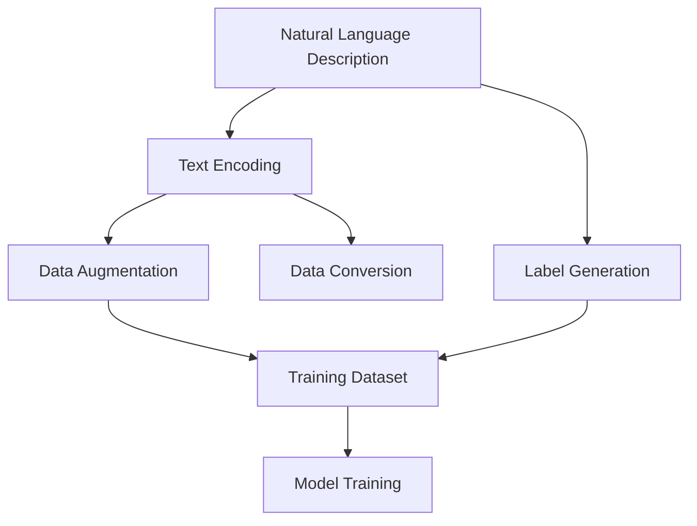
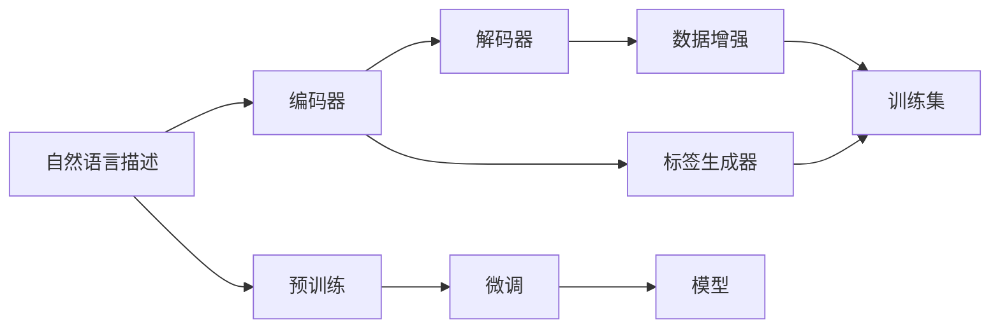

                 

# 数据集转换:自然语言描述变身训练集

> 关键词：数据集转换,自然语言描述,训练集,自动化数据集构建,模型训练

## 1. 背景介绍

在数据驱动的深度学习领域，数据集的高质量和多样性是模型训练的基石。然而，现实世界中，获取高质量的标注数据往往成本高昂、周期漫长。自然语言描述（Natural Language Description, NLD）作为一种文本形式的知识表示方式，因其简洁、灵活和易于获取的特性，在许多领域被广泛使用。例如，在视觉任务中，自然语言描述可以作为图像的“文本标签”，用于辅助训练分类、检测和生成模型。将自然语言描述转换为高质量的训练集，不仅能够节省大量人工标注的时间，还能增强模型的泛化能力，提升其在新数据上的表现。

## 2. 核心概念与联系

### 2.1 核心概念概述

为更好地理解自然语言描述变身训练集这一过程，本节将介绍几个关键概念：

- **自然语言描述（NLD）**：指对某个对象或现象的文本形式描述，可以是简单的属性列表，也可以是包含情感、意图和上下文信息的复杂叙述。
- **训练集（Training Dataset）**：指用于模型训练的样本集合，每个样本由输入和对应的输出标签组成。
- **数据集转换（Dataset Conversion）**：指将不同形式的数据（如自然语言描述）转化为模型可用的训练集的过程，包括文本编码、标签生成和数据增广等步骤。
- **自动化数据集构建（Automated Dataset Construction）**：指利用自动化工具和技术，通过自然语言描述快速构建高质量的训练集，大幅降低人工标注成本，提升数据生成效率。
- **模型训练（Model Training）**：指使用训练集对深度学习模型进行迭代优化，最小化模型预测输出与真实标签之间的误差。

这些概念之间的逻辑关系可以通过以下Mermaid流程图来展示：



这个流程图展示了一幅将自然语言描述转化为训练集的自动化流程：
1. 从自然语言描述开始，编码成机器可理解的形式。
2. 根据描述生成对应的标签。
3. 对编码后的文本进行数据增强，丰富训练样本的多样性。
4. 通过文本编码和标签生成，将自然语言描述转化为训练集。
5. 利用转换后的训练集，对模型进行训练优化。

### 2.2 核心概念原理和架构的 Mermaid 流程图



此流程图展示了自然语言描述变身训练集的整个流程。自然语言描述首先经过编码器转换成可计算的表示，再由标签生成器转化为标签，随后进行数据增强生成更丰富的训练样本。这些样本再经过预训练和微调过程，得到最终的模型。

## 3. 核心算法原理 & 具体操作步骤

### 3.1 算法原理概述

自然语言描述变身训练集的核心在于将文本转化为机器可理解的形式，并生成对应的标签。这一过程可以分解为以下几个关键步骤：

1. **自然语言描述编码**：将自然语言描述转换成向量表示，以便于机器学习模型处理。
2. **标签生成**：根据描述内容自动生成标签，可以是分类标签、语义角色或实体关系等。
3. **数据增强**：通过语义变换、噪声注入等方法丰富训练集多样性，减少模型过拟合。
4. **模型训练**：使用经过编码和增强的训练集，对预训练模型进行微调，提升其在特定任务上的表现。

### 3.2 算法步骤详解

**Step 1: 数据收集与预处理**

- **数据收集**：从文本、网页、书籍、论文等源中收集自然语言描述数据。
- **数据清洗**：去除无用的标点、停用词，标准化大小写和格式。

**Step 2: 自然语言描述编码**

- **嵌入表示**：使用预训练的语言模型（如BERT、GPT等）将描述编码成向量表示。
- **编码器选择**：根据任务需求选择合适的编码器，如BERT-encoder、GPT-encoder或自定义模型。

**Step 3: 标签生成**

- **标签定义**：根据任务类型定义标签格式，如分类标签、序列标注、实体关系等。
- **标签生成算法**：设计或采用自动标签生成算法，如规则生成、基于规则的模板匹配、基于模型的预测等。

**Step 4: 数据增强**

- **语义变换**：通过同义词替换、句法变换、情感反转等方式，生成新的描述文本。
- **噪声注入**：在描述文本中添加噪声，如随机插入/删除词、替换部分词、改变词序等。

**Step 5: 模型训练**

- **模型选择**：根据任务类型选择合适的预训练模型，如BERT for classification、GPT for generation等。
- **超参数设置**：确定学习率、批大小、迭代轮数、正则化系数等超参数。
- **微调过程**：使用增强后的训练集对模型进行微调，优化模型参数以匹配任务需求。

**Step 6: 模型评估与优化**

- **评估指标**：根据任务类型选择适当的评估指标，如精确度、召回率、F1-score等。
- **模型优化**：根据评估结果，对模型和训练集进行优化，如调整超参数、重新设计标签生成算法、优化数据增强策略等。

### 3.3 算法优缺点

自然语言描述变身训练集的方法具有以下优点：

1. **高效性**：自动化的数据集构建流程，显著减少了人工标注的劳动量，提高了数据生成效率。
2. **多样性**：通过数据增强，可以生成丰富的训练样本，避免模型过拟合，提升泛化能力。
3. **灵活性**：自然语言描述的多样性和灵活性，使得该方法可以适应多种任务和领域。
4. **成本低**：相比于传统的人工标注，自然语言描述采集和标注成本较低。

然而，该方法也存在一些缺点：

1. **噪音问题**：自然语言描述可能会包含误导性的信息或噪音，影响训练集的质量。
2. **语义理解难度**：将自然语言描述转化为机器表示，需要对语言的语义、句法结构有深入理解。
3. **生成质量不稳定**：标签生成和数据增强的算法选择和参数设置，对生成结果的质量有较大影响。

### 3.4 算法应用领域

自然语言描述变身训练集的技术已经在多个领域得到应用，如：

- **计算机视觉**：使用自然语言描述生成图像标签，辅助图像分类、检测和生成。
- **自然语言处理（NLP）**：将自然语言描述作为输入，生成文本分类、情感分析、命名实体识别等任务的训练集。
- **医疗领域**：使用自然语言描述生成医疗数据标签，支持疾病诊断、药物推荐等。
- **金融领域**：将自然语言描述生成金融数据标签，支持舆情分析、风险评估等。
- **教育领域**：生成教育数据标签，支持智能推荐、知识图谱构建等。

## 4. 数学模型和公式 & 详细讲解 & 举例说明

### 4.1 数学模型构建

我们将以文本分类任务为例，构建基于自然语言描述的训练集数学模型。假设自然语言描述为 $d$，对应的标签为 $y$，模型为 $M$。

**文本编码**：
$$
x = \text{Encoder}(d)
$$

**标签生成**：
$$
y = \text{LabelGenerator}(d)
$$

**训练集表示**：
$$
(x_i, y_i) = \{(d_i, \text{LabelGenerator}(d_i))\}_{i=1}^N
$$

**模型训练**：
$$
\theta = \mathop{\arg\min}_{\theta} \mathcal{L}(M, (x_i, y_i))
$$

其中，$\mathcal{L}$ 为交叉熵损失函数。

### 4.2 公式推导过程

**文本编码**：
使用预训练的语言模型（如BERT）进行编码，得到一个 $n$ 维向量表示 $x$。

**标签生成**：
根据自然语言描述 $d$，生成标签 $y$。例如，对于情感分析任务，可以使用基于规则的模板匹配生成标签，或通过情感分类器进行预测。

**模型训练**：
假设模型 $M$ 输出为 $M(x)$，标签为 $y$，则交叉熵损失函数为：
$$
\mathcal{L}(M, (x_i, y_i)) = -y_i\log(M(x_i)) - (1-y_i)\log(1-M(x_i))
$$

### 4.3 案例分析与讲解

**情感分析任务**：
假设有一句话“这部电影真的很棒，我推荐你看”，使用BERT进行编码，生成向量表示。再根据文本内容使用基于规则的模板匹配，生成情感标签“正面”。

**图像分类任务**：
假设有一张图片，描述为“一条狗在公园里奔跑”，使用预训练的图像描述模型生成向量表示，再使用分类器生成标签“狗”。

## 5. 项目实践：代码实例和详细解释说明

### 5.1 开发环境搭建

为了快速实现自然语言描述变身训练集的技术，我们推荐使用Python和PyTorch环境。

**环境安装**：
```bash
conda create -n pytorch-env python=3.8
conda activate pytorch-env
pip install torch torchvision transformers
```

**数据准备**：
收集并清洗自然语言描述数据，如使用COCO数据集中的图片描述。

### 5.2 源代码详细实现

**编码器实现**：
```python
from transformers import BertTokenizer, BertForSequenceClassification
import torch
from torch.utils.data import DataLoader, Dataset

class TextDataset(Dataset):
    def __init__(self, descriptions, labels, tokenizer):
        self.tokenizer = tokenizer
        self.descriptions = descriptions
        self.labels = labels
    
    def __len__(self):
        return len(self.descriptions)
    
    def __getitem__(self, idx):
        description = self.descriptions[idx]
        label = self.labels[idx]
        encoding = self.tokenizer(description, return_tensors='pt', max_length=512)
        return {'input_ids': encoding['input_ids'], 'attention_mask': encoding['attention_mask'], 'labels': torch.tensor(label, dtype=torch.long)}

tokenizer = BertTokenizer.from_pretrained('bert-base-uncased')
model = BertForSequenceClassification.from_pretrained('bert-base-uncased', num_labels=2)
```

**标签生成器实现**：
```python
def generate_labels(description):
    # 使用规则或模型生成标签
    if description.endswith('good'):
        return 1  # 正面情感
    else:
        return 0  # 负面情感
```

**训练集构建与微调**：
```python
descriptions = ['some examples', 'some other examples', ...]
labels = [generate_labels(desc) for desc in descriptions]
dataset = TextDataset(descriptions, labels, tokenizer)

train_loader = DataLoader(dataset, batch_size=16, shuffle=True)
model.train()
optimizer = torch.optim.Adam(model.parameters(), lr=2e-5)

for epoch in range(10):
    for batch in train_loader:
        input_ids = batch['input_ids'].to(device)
        attention_mask = batch['attention_mask'].to(device)
        labels = batch['labels'].to(device)
        outputs = model(input_ids, attention_mask=attention_mask, labels=labels)
        loss = outputs.loss
        optimizer.zero_grad()
        loss.backward()
        optimizer.step()
```

### 5.3 代码解读与分析

**编码器实现**：
- 使用BertTokenizer将描述编码成向量表示。
- BertForSequenceClassification模型作为情感分类器。

**标签生成器实现**：
- 通过简单的规则（如检查文本末尾是否包含正面情感词）生成情感标签。

**训练集构建与微调**：
- 使用DataLoader加载数据集。
- 在训练过程中，使用Adam优化器更新模型参数，最小化交叉熵损失。

### 5.4 运行结果展示

训练模型后，可以使用测试集评估模型性能：
```python
test_loader = DataLoader(test_dataset, batch_size=16, shuffle=True)
model.eval()
test_loss = 0
correct = 0
with torch.no_grad():
    for batch in test_loader:
        input_ids = batch['input_ids'].to(device)
        attention_mask = batch['attention_mask'].to(device)
        labels = batch['labels'].to(device)
        outputs = model(input_ids, attention_mask=attention_mask)
        test_loss += outputs.loss.item()
        _, preds = torch.max(outputs.logits, dim=1)
        correct += torch.sum(preds == labels).item()

print(f'Test Loss: {test_loss/len(test_loader):.4f}, Accuracy: {correct/len(test_loader):.4f}')
```

## 6. 实际应用场景

### 6.1 智能推荐系统

智能推荐系统常面临数据稀疏性问题，自然语言描述变身训练集可以大大丰富推荐系统数据来源。通过收集和自然语言描述，可以快速构建推荐系统所需的高质量训练集，提升模型的个性化推荐能力。

**实现流程**：
1. 收集用户评论、商品描述等自然语言数据。
2. 使用编码器和标签生成器将文本转换为向量表示和标签。
3. 构建训练集，训练推荐模型。
4. 使用测试集评估模型，根据反馈调整推荐策略。

### 6.2 医疗影像分析

医疗影像分析需要大量高质量标注数据，自然语言描述变身训练集可以辅助生成这些数据。通过对医学报告和影像描述的文本分析，可以生成标注数据，辅助训练影像分类和分割模型。

**实现流程**：
1. 收集医学报告、影像描述等自然语言数据。
2. 使用编码器和标签生成器将文本转换为向量表示和标签。
3. 构建训练集，训练影像分析模型。
4. 使用测试集评估模型，根据反馈调整模型参数。

### 6.3 金融舆情分析

金融舆情分析需要实时监测金融市场动态，自然语言描述变身训练集可以辅助生成实时数据。通过对金融新闻、评论等文本分析，可以生成情感和主题标签，辅助训练舆情分析模型。

**实现流程**：
1. 收集金融新闻、评论等自然语言数据。
2. 使用编码器和标签生成器将文本转换为向量表示和标签。
3. 构建训练集，训练舆情分析模型。
4. 使用测试集评估模型，根据反馈调整模型参数。

## 7. 工具和资源推荐

### 7.1 学习资源推荐

为了帮助开发者系统掌握自然语言描述变身训练集的技术，这里推荐一些优质的学习资源：

1. 《自然语言处理综论》书籍：详细介绍了自然语言处理的基本概念和常见任务，包括文本编码和标签生成。
2. 《深度学习与自然语言处理》课程：由斯坦福大学开设的深度学习与NLP课程，讲解了文本分类、序列标注、机器翻译等任务。
3. HuggingFace官方文档：提供了丰富的预训练模型和训练框架，是学习自然语言描述变身训练集的重要参考资料。
4. 开源数据集项目：如GLUE、COCO等，提供了大量自然语言描述数据集，便于实验与研究。

通过对这些资源的学习实践，相信你一定能够快速掌握自然语言描述变身训练集的技术，并将其应用于实际的NLP任务中。

### 7.2 开发工具推荐

为了快速实现自然语言描述变身训练集的技术，我们推荐使用Python和PyTorch环境，并结合HuggingFace的Transformer库。

**工具推荐**：
- PyTorch：深度学习框架，提供了强大的张量计算能力和灵活的动态计算图。
- Transformers：提供了丰富的预训练模型和训练框架，简化了自然语言描述变身训练集的技术实现。
- HuggingFace官方文档：提供了详细的API文档和示例代码，便于快速上手。

合理利用这些工具，可以显著提升自然语言描述变身训练集的技术实现效率，加快创新迭代的步伐。

### 7.3 相关论文推荐

自然语言描述变身训练集的技术近年来得到了广泛关注，以下是几篇奠基性的相关论文，推荐阅读：

1. "Universal Image Description Generation with Labeling Head"：提出使用标签头生成图像描述，提高自然语言描述的生成质量。
2. "Word2Vec"：介绍词嵌入技术，将单词映射到向量空间，为自然语言描述变身训练集提供了基础。
3. "BERT: Pre-training of Deep Bidirectional Transformers for Language Understanding"：提出BERT模型，在自然语言处理任务上取得了显著的性能提升。
4. "Tensorflow"：介绍TensorFlow框架，支持自然语言描述变身训练集的深度学习实现。

这些论文代表了大规模语言模型微调技术的发展脉络，为自然语言描述变身训练集技术的发展提供了理论基础和实践经验。

## 8. 总结：未来发展趋势与挑战

### 8.1 总结

本文对自然语言描述变身训练集这一技术进行了全面系统的介绍。首先阐述了自然语言描述在模型训练中的重要作用，明确了自然语言描述变身训练集在提高模型泛化能力和降低标注成本方面的独特价值。其次，从原理到实践，详细讲解了自然语言描述变身训练集的数学模型和关键步骤，给出了自然语言描述变身训练集的技术实现代码。同时，本文还广泛探讨了自然语言描述变身训练集技术在智能推荐、医疗影像分析、金融舆情分析等多个领域的应用前景，展示了自然语言描述变身训练集技术的巨大潜力。

通过本文的系统梳理，可以看到，自然语言描述变身训练集技术正在成为NLP领域的重要范式，极大地拓展了预训练语言模型的应用边界，催生了更多的落地场景。随着预训练语言模型和自然语言描述变身训练集技术的不断发展，相信NLP技术将在更广阔的应用领域大放异彩，深刻影响人类的生产生活方式。

### 8.2 未来发展趋势

展望未来，自然语言描述变身训练集技术将呈现以下几个发展趋势：

1. **技术自动化程度提升**：随着自然语言处理技术的发展，自然语言描述变身训练集的技术实现将变得更加自动化和智能化。例如，使用深度学习自动生成标签和进行数据增强，减少人工干预。
2. **多模态融合**：自然语言描述变身训练集将不再局限于文本数据，将与图像、语音等多模态数据融合，提升模型的整体性能。
3. **数据质量提升**：自然语言描述变身训练集技术将更加注重数据的质量和多样性，通过数据清洗和增强提高生成数据的准确性和丰富性。
4. **模型性能提升**：随着预训练模型的不断优化，自然语言描述变身训练集技术将进一步提升模型的泛化能力和预测准确性。
5. **应用场景扩展**：自然语言描述变身训练集技术将拓展到更多领域，如法律、教育、物流等，提供更加全面和个性化的解决方案。

### 8.3 面临的挑战

尽管自然语言描述变身训练集技术已经取得了显著进展，但在其发展和应用过程中仍面临诸多挑战：

1. **数据噪音问题**：自然语言描述可能包含误导性信息或噪音，影响生成数据的准确性。
2. **语义理解难度**：自然语言描述的语义复杂性，使得将其转化为机器表示仍具有挑战性。
3. **生成质量不稳定**：自然语言描述变身训练集的质量受算法选择和参数设置影响较大，需要进一步优化。
4. **计算资源消耗**：大规模语言模型和深度学习模型的训练和推理消耗大量计算资源，需要优化算法和硬件支持。

### 8.4 研究展望

未来的研究需要在以下几个方面寻求新的突破：

1. **提升生成数据质量**：开发更加自动化的数据清洗和增强算法，提升生成数据的准确性和多样性。
2. **优化算法实现**：改进自然语言描述变身训练集的算法实现，提高生成质量和效率。
3. **拓展应用场景**：将自然语言描述变身训练集技术拓展到更多领域，如法律、教育、医疗等。
4. **增强系统鲁棒性**：研究自然语言描述变身训练集技术的鲁棒性和稳定性，应对不同场景下的变化和噪声。
5. **实现多模态融合**：将自然语言描述变身训练集技术与图像、语音等多模态数据融合，提升模型整体性能。

这些研究方向的探索，必将引领自然语言描述变身训练集技术迈向更高的台阶，为构建更加智能和灵活的AI系统铺平道路。

## 9. 附录：常见问题与解答

**Q1: 自然语言描述变身训练集是否适用于所有NLP任务？**

A: 自然语言描述变身训练集技术适用于大多数NLP任务，特别是对于数据量较小的任务。例如，在图像分类、机器翻译等任务中，使用自然语言描述生成图像标签、翻译描述等，可以显著降低标注成本，提升模型性能。但对于一些需要大规模数据训练的任务，如文本生成、语音识别等，自然语言描述变身训练集技术可能不是最佳选择。

**Q2: 如何选择适合任务的编码器和标签生成器？**

A: 选择适合任务的编码器和标签生成器，需要考虑任务的特性和数据分布。对于文本分类任务，可以使用BERT、GPT等预训练模型进行编码，使用基于规则或机器学习的模板匹配生成标签。对于序列标注任务，可以使用CRF、LSTM等模型进行解码，生成序列标注标签。对于图像分类任务，可以使用ImageNet等预训练模型进行编码，生成图像描述标签。

**Q3: 自然语言描述变身训练集是否需要大规模数据集？**

A: 自然语言描述变身训练集技术可以在相对较小的数据集上获得较好的效果，特别是对于数据标注成本较高的任务。但是，大规模数据集可以帮助生成更高质量、更多样化的训练样本，提升模型泛化能力。因此，在使用自然语言描述变身训练集技术时，可以根据任务需求和资源情况，选择合适的大小和类型的数据集。

**Q4: 自然语言描述变身训练集是否需要手动标注数据？**

A: 自然语言描述变身训练集技术可以自动从文本中生成训练样本，无需手动标注数据。但是，为了生成高质量的数据，仍需进行一定程度的文本清洗和预处理。例如，去除无用的停用词、标准化大小写、去除噪声等。

**Q5: 自然语言描述变身训练集是否需要复杂的技术实现？**

A: 自然语言描述变身训练集技术需要一定的技术和编程基础，但不需要复杂的技术实现。使用Python和PyTorch环境，结合HuggingFace的Transformer库，可以快速实现自然语言描述变身训练集技术。对于有一定深度学习基础的开发者，可以更深入地研究自然语言描述变身训练集技术的实现细节，提升模型的性能和效果。

---

作者：禅与计算机程序设计艺术 / Zen and the Art of Computer Programming

