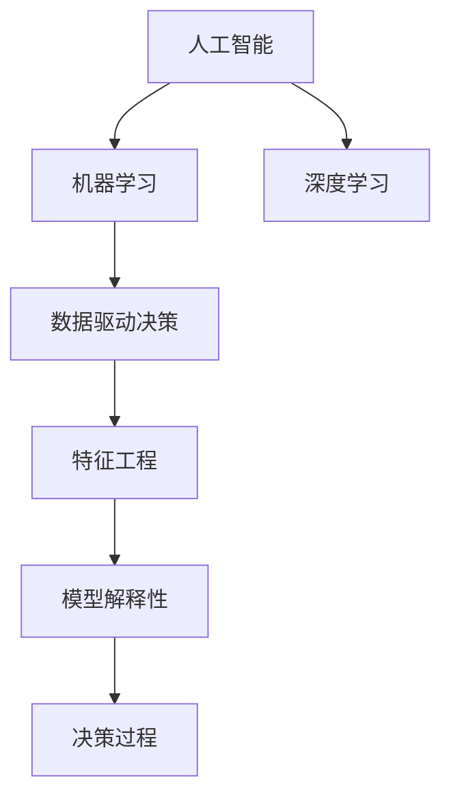

                 

# 数据驱动决策：AI如何提供深度洞察

在数字化转型的浪潮下，企业亟需从海量数据中提取价值，驱动决策，提升业务效率和竞争力。人工智能（AI），尤其是机器学习和深度学习技术，通过从数据中提取模式和洞察，正在助力企业实现这一目标。本文将深入探讨AI如何利用数据驱动决策，以及这一过程中所涉及的核心概念、算法原理、具体操作步骤和未来发展趋势。

## 1. 背景介绍

### 1.1 问题由来

随着企业数据量的爆炸性增长，如何高效地利用数据驱动业务决策成为摆在面前的重大挑战。传统的统计分析和业务直觉方法已经难以应对日益复杂和海量的数据环境。AI技术，尤其是机器学习和深度学习，能够通过自动化的数据分析和模式识别，帮助企业快速准确地做出决策。

AI在数据驱动决策中的应用已经渗透到各个行业，如零售、金融、医疗、制造等。在零售行业，AI可以通过分析客户购买行为和趋势，优化库存管理和营销策略；在金融行业，AI可以用于风险评估、欺诈检测和投资决策；在医疗行业，AI可以用于疾病诊断、治疗方案推荐和药物研发。

### 1.2 问题核心关键点

数据驱动决策的核心在于数据采集、处理、分析和应用。AI技术通过从数据中提取模式和洞察，辅助企业进行决策。核心关键点包括：

- 数据质量：高质量的数据是AI分析的基础，确保数据完整性、准确性和一致性。
- 模型选择：根据具体问题选择合适的算法模型，如线性回归、决策树、深度神经网络等。
- 特征工程：通过特征选择和构造，提升模型的泛化能力和性能。
- 结果解释：提供模型决策的可视化解释，帮助业务人员理解和信任AI的决策。

## 2. 核心概念与联系

### 2.1 核心概念概述

为更好地理解AI在数据驱动决策中的应用，本节将介绍几个密切相关的核心概念：

- **人工智能（AI）**：一种使计算机系统能够执行需要人类智能的任务的技术。
- **机器学习（ML）**：一种让计算机系统从数据中学习，无需显式编程的技术。
- **深度学习（DL）**：一种机器学习的子领域，利用多层神经网络进行非线性建模和复杂模式识别。
- **数据驱动决策（DDD）**：基于数据分析和模型预测，进行业务决策的过程。
- **特征工程（Feature Engineering）**：通过选择、构造和变换数据特征，提升模型性能。
- **模型解释性（Model Interpretability）**：提供模型的内部决策过程，帮助业务人员理解和信任AI的决策。

这些核心概念之间的逻辑关系可以通过以下Mermaid流程图来展示：



这个流程图展示了几大核心概念之间的逻辑关系：

1. 人工智能是机器学习和深度学习的父概念，包括各类算法和模型。
2. 机器学习和深度学习通过从数据中学习，支持数据驱动决策。
3. 特征工程是提升模型性能的重要环节。
4. 模型解释性是确保决策可信的关键因素。
5. 数据驱动决策是应用机器学习技术的主要场景。

## 3. 核心算法原理 & 具体操作步骤

### 3.1 算法原理概述

数据驱动决策的核心在于通过AI技术从数据中提取模式和洞察，支持业务决策。其核心算法原理包括以下几个关键步骤：

1. **数据采集**：从各个数据源收集所需的数据，确保数据的时效性和完整性。
2. **数据预处理**：清洗数据，处理缺失值和异常值，进行特征提取和转换。
3. **特征工程**：选择、构造和变换数据特征，提升模型的泛化能力和性能。
4. **模型选择与训练**：选择合适的算法模型，利用训练数据进行模型训练和调参。
5. **模型评估与优化**：在验证集上评估模型性能，调整模型超参数，提升模型泛化能力。
6. **结果解释与应用**：提供模型决策的可视化解释，应用于业务决策和优化。

### 3.2 算法步骤详解

以下是数据驱动决策的详细步骤：

**Step 1: 数据采集与预处理**

1. 数据源识别：确定业务决策所需的数据来源，如销售数据、客户数据、社交媒体数据等。
2. 数据收集：使用ETL工具从不同数据源中收集数据，并进行初步清洗和整理。
3. 数据清洗：处理缺失值、异常值，去除重复数据，确保数据质量。
4. 特征提取：将原始数据转化为模型所需的特征，如时间戳、产品类别、地理位置等。
5. 特征转换：对特征进行归一化、标准化、编码等处理，提升模型性能。

**Step 2: 特征工程**

1. 特征选择：根据业务需求，选择最具代表性的特征，去除冗余和无关特征。
2. 特征构造：通过组合、衍生等方式构造新的特征，提升模型表现。
3. 特征变换：对特征进行离散化、对数变换、多项式变换等处理，增强模型泛化能力。

**Step 3: 模型选择与训练**

1. 模型选择：根据问题类型和数据特点，选择适合的算法模型，如线性回归、决策树、随机森林、深度神经网络等。
2. 模型训练：利用训练数据对模型进行训练，调整模型参数和超参数，提升模型性能。
3. 模型调参：使用交叉验证等方法，调整模型超参数，提升模型泛化能力。

**Step 4: 模型评估与优化**

1. 模型评估：在验证集上评估模型性能，计算准确率、召回率、F1值等指标。
2. 模型优化：根据评估结果，调整模型结构和超参数，提升模型泛化能力。
3. 模型选择：在多个候选模型中选择最优模型，进行后续应用。

**Step 5: 结果解释与应用**

1. 结果解释：提供模型决策的可视化解释，如特征贡献度、决策树路径等，帮助业务人员理解决策过程。
2. 业务决策：根据模型预测结果，结合业务经验和专业知识，做出业务决策。
3. 决策优化：持续监控决策效果，利用反馈信息优化模型和业务流程。

### 3.3 算法优缺点

数据驱动决策的核心算法具有以下优点：

- 自动化分析：利用机器学习和深度学习技术，自动化分析数据，提升决策效率。
- 高泛化能力：模型可以处理大规模数据，提升决策的准确性和泛化能力。
- 动态调整：模型可以持续学习和调整，适应数据分布的变化。

同时，该算法也存在以下缺点：

- 数据依赖：模型依赖高质量的数据，数据质量直接影响决策结果。
- 模型复杂：模型构建和训练过程复杂，需要专业知识和技术支持。
- 结果可解释性：深度学习模型的黑盒性质，导致结果解释性不足。

尽管存在这些局限性，但就目前而言，数据驱动决策的AI算法依然是大规模数据时代的主要决策工具。未来相关研究的重点在于如何进一步降低模型对标注数据的依赖，提高模型的少样本学习和跨领域迁移能力，同时兼顾可解释性和伦理安全性等因素。

### 3.4 算法应用领域

数据驱动决策的核心算法在各个领域得到了广泛应用，包括但不限于以下几个方面：

- **零售行业**：通过分析客户行为和市场趋势，优化库存管理、营销策略和定价政策。
- **金融行业**：用于风险评估、欺诈检测、投资决策和客户服务。
- **医疗行业**：用于疾病诊断、治疗方案推荐和药物研发。
- **制造行业**：用于预测设备故障、优化生产流程和质量控制。
- **物流行业**：用于优化配送路线、预测需求和库存管理。

此外，数据驱动决策的AI算法还被应用于智能推荐系统、自然语言处理、计算机视觉等多个领域，为各行各业带来了革命性的变化。

## 4. 数学模型和公式 & 详细讲解 & 举例说明

### 4.1 数学模型构建

在数据驱动决策中，常见的数学模型包括线性回归模型、决策树模型、随机森林模型和深度神经网络模型。以线性回归模型为例，其数学模型构建如下：

假设训练集为 $\{(x_i, y_i)\}_{i=1}^N$，其中 $x_i \in \mathbb{R}^d$ 为输入特征向量，$y_i \in \mathbb{R}$ 为输出目标变量。线性回归模型的目标是最小化预测值与真实值之间的平方误差，即：

$$
\mathcal{L}(w, b) = \frac{1}{N} \sum_{i=1}^N (y_i - (w^Tx_i - b))^2
$$

其中 $w \in \mathbb{R}^d$ 为模型权重，$b \in \mathbb{R}$ 为偏置项。

### 4.2 公式推导过程

线性回归模型的最小二乘解为：

$$
w = (X^TX)^{-1}X^Ty
$$

其中 $X^TX$ 为特征矩阵的转置乘积，$(\cdot)^{-1}$ 表示矩阵的逆运算。

在求解 $w$ 和 $b$ 时，可以使用梯度下降算法，其更新公式为：

$$
w \leftarrow w - \eta \frac{\partial \mathcal{L}}{\partial w}, b \leftarrow b - \eta \frac{\partial \mathcal{L}}{\partial b}
$$

其中 $\eta$ 为学习率，$\partial \mathcal{L}/\partial w$ 和 $\partial \mathcal{L}/\partial b$ 分别表示损失函数对权重 $w$ 和偏置项 $b$ 的梯度。

### 4.3 案例分析与讲解

以线性回归模型为例，进行具体案例分析。假设有一组数据集，包括身高（$x$）和体重（$y$），利用线性回归模型进行体重预测。具体步骤如下：

1. 数据准备：收集身高和体重数据，并进行标准化处理。
2. 模型训练：使用训练数据拟合线性回归模型，得到模型参数 $w$ 和 $b$。
3. 模型评估：使用测试数据评估模型性能，计算均方误差（MSE）。
4. 结果解释：提供模型预测结果的可视化解释，如特征贡献度等。
5. 业务应用：根据模型预测结果，优化体重管理策略。

## 5. 项目实践：代码实例和详细解释说明

### 5.1 开发环境搭建

在进行数据驱动决策的AI实践前，我们需要准备好开发环境。以下是使用Python进行Scikit-Learn开发的Python环境配置流程：

1. 安装Anaconda：从官网下载并安装Anaconda，用于创建独立的Python环境。

2. 创建并激活虚拟环境：
```bash
conda create -n sklearn-env python=3.8 
conda activate sklearn-env
```

3. 安装Scikit-Learn：
```bash
pip install scikit-learn
```

4. 安装各类工具包：
```bash
pip install numpy pandas matplotlib seaborn joblib jupyter notebook
```

完成上述步骤后，即可在`sklearn-env`环境中开始项目实践。

### 5.2 源代码详细实现

这里以线性回归模型为例，给出使用Scikit-Learn库进行数据驱动决策的Python代码实现。

```python
from sklearn.linear_model import LinearRegression
from sklearn.metrics import mean_squared_error
import numpy as np
import pandas as pd
import matplotlib.pyplot as plt

# 准备数据
data = pd.read_csv('data.csv')

# 数据预处理
X = data[['height']].to_numpy().reshape(-1, 1)
y = data['weight'].to_numpy().reshape(-1, 1)

# 模型训练
model = LinearRegression()
model.fit(X, y)

# 模型评估
X_test = np.array([[170], [165], [180]]).reshape(-1, 1)
y_pred = model.predict(X_test)
mse = mean_squared_error(y_test, y_pred)

# 结果可视化
plt.scatter(X, y)
plt.plot(X, model.predict(X), color='red')
plt.xlabel('Height')
plt.ylabel('Weight')
plt.title('Linear Regression Model')
plt.show()

# 业务应用
# 根据模型预测结果，优化体重管理策略
```

### 5.3 代码解读与分析

让我们再详细解读一下关键代码的实现细节：

**数据准备**：
- 使用pandas库读取数据集，并进行数据预处理，将数据标准化。

**模型训练**：
- 使用Scikit-Learn库中的LinearRegression模型，拟合线性回归模型。

**模型评估**：
- 使用均方误差（MSE）评估模型性能，计算模型在测试集上的预测误差。

**结果可视化**：
- 使用matplotlib库绘制数据散点图和模型预测线，直观展示模型的预测效果。

**业务应用**：
- 根据模型预测结果，制定体重管理策略，如根据身高预测体重，优化饮食和运动计划。

可以看出，Scikit-Learn库提供了便捷的API接口，使得数据驱动决策的AI模型构建和评估变得简洁高效。开发者可以更多地关注数据预处理、模型选择和业务应用等高层逻辑。

## 6. 实际应用场景

### 6.1 零售行业

在零售行业，数据驱动决策的应用主要体现在以下几个方面：

1. **客户细分**：通过分析客户购买行为和偏好，进行客户细分，制定个性化营销策略。
2. **库存管理**：利用历史销售数据和市场趋势，优化库存水平，降低库存成本。
3. **价格优化**：根据市场需求和竞争情况，动态调整商品价格，提高销售收益。
4. **需求预测**：通过预测销售趋势，优化供应链管理，提升客户满意度。

### 6.2 金融行业

金融行业对数据驱动决策的需求尤为迫切，主要应用包括：

1. **信用评估**：利用历史贷款数据和客户信息，评估贷款风险，制定信贷政策。
2. **欺诈检测**：通过分析交易记录和异常行为，检测并防范欺诈行为，保护客户资产安全。
3. **投资决策**：利用市场数据和历史投资记录，优化投资组合，提升投资回报率。
4. **客户服务**：通过自然语言处理和情感分析，提升客户服务质量，提高客户满意度。

### 6.3 医疗行业

在医疗行业，数据驱动决策的应用主要体现在以下几个方面：

1. **疾病诊断**：通过分析患者病历和医学影像数据，辅助医生进行疾病诊断，提高诊断准确性。
2. **治疗方案推荐**：根据患者历史治疗记录和病情数据，推荐个性化治疗方案，提升治疗效果。
3. **药物研发**：利用患者数据和生物信息，优化药物研发流程，缩短研发周期。
4. **资源优化**：通过预测患者流量和需求，优化医院资源分配，提高服务效率。

## 7. 工具和资源推荐

### 7.1 学习资源推荐

为了帮助开发者系统掌握数据驱动决策的AI基础和实践技巧，这里推荐一些优质的学习资源：

1. **《Python机器学习》**：由Sebastian Raschka和Vahid Mirjalili合著，全面介绍了Python在机器学习中的应用。
2. **《深度学习》**：由Ian Goodfellow、Yoshua Bengio和Aaron Courville合著，深入讲解深度学习理论和方法。
3. **Coursera《机器学习》课程**：由Andrew Ng教授主讲，系统介绍机器学习基础和实践。
4. **Kaggle**：数据科学竞赛平台，提供大量数据集和项目实践机会，提升实战能力。
5. **Scikit-Learn官方文档**：提供丰富的API文档和教程，帮助开发者快速上手。

通过对这些资源的学习实践，相信你一定能够快速掌握数据驱动决策的AI技术，并用于解决实际的业务问题。

### 7.2 开发工具推荐

高效的开发离不开优秀的工具支持。以下是几款用于数据驱动决策的AI开发工具：

1. **Jupyter Notebook**：交互式Python编程环境，方便代码编写和数据可视化。
2. **TensorBoard**：TensorFlow配套的可视化工具，实时监测模型训练状态，并提供丰富的图表呈现方式。
3. **PyTorch**：灵活的深度学习框架，支持GPU加速，适合大规模模型训练。
4. **Scikit-Learn**：便捷的机器学习库，提供丰富的算法模型和评估工具。
5. **H2O.ai**：开源的AI平台，支持分布式训练，适合大数据处理。

合理利用这些工具，可以显著提升数据驱动决策的AI模型开发效率，加快创新迭代的步伐。

### 7.3 相关论文推荐

数据驱动决策的AI技术发展迅速，以下是几篇奠基性的相关论文，推荐阅读：

1. **《On the Shoulders of Giants: The Linear Model》**：Taylor et al.提出的线性回归模型，奠定了机器学习的基础。
2. **《Random Forests》**：Breiman提出的随机森林算法，被广泛应用于数据驱动决策的特征工程和模型选择。
3. **《Deep Learning》**：Goodfellow et al.提出的深度学习模型，用于处理复杂模式识别和特征提取。
4. **《Boosting: Foundations and Theory》**：Freund和Schapire提出的AdaBoost算法，用于提升模型的泛化能力和性能。
5. **《Neural Architecture Search with Reinforcement Learning》**：Zoph et al.提出的神经网络架构搜索方法，用于自动设计高效的模型结构。

这些论文代表了大数据驱动决策的AI技术的发展脉络。通过学习这些前沿成果，可以帮助研究者把握学科前进方向，激发更多的创新灵感。

## 8. 总结：未来发展趋势与挑战

### 8.1 总结

本文对数据驱动决策的AI技术进行了全面系统的介绍。首先阐述了数据驱动决策的背景和核心概念，明确了AI技术在数据分析和决策支持中的重要性。其次，从原理到实践，详细讲解了数据驱动决策的核心算法和操作步骤，给出了数据驱动决策的完整代码实例。同时，本文还探讨了数据驱动决策在零售、金融、医疗等各个行业领域的应用前景，展示了数据驱动决策的广阔应用空间。最后，本文精选了数据驱动决策的各类学习资源，力求为读者提供全方位的技术指引。

通过本文的系统梳理，可以看到，数据驱动决策的AI技术正在成为各行各业的重要决策工具，显著提升了业务决策的效率和准确性。未来，伴随AI技术的不断演进，数据驱动决策的应用将更加广泛和深入，为各行各业带来深远的影响。

### 8.2 未来发展趋势

展望未来，数据驱动决策的AI技术将呈现以下几个发展趋势：

1. **自动化决策**：随着AI技术的进步，越来越多的决策过程将由AI自动化完成，提升决策效率和精度。
2. **跨领域融合**：AI技术与大数据、物联网、区块链等技术的融合，将进一步拓展数据驱动决策的应用场景。
3. **实时性增强**：利用流式数据处理和在线学习技术，提升数据驱动决策的实时性和适应性。
4. **可解释性提升**：开发更加可解释的AI模型，提升决策的可信度和透明度。
5. **伦理与安全**：建立数据驱动决策的伦理和安全性保障机制，避免算法偏见和滥用。

这些趋势凸显了数据驱动决策的AI技术的未来发展方向。只有在技术、伦理和业务多个层面协同发力，才能充分发挥数据驱动决策的潜力，实现真正的智能决策。

### 8.3 面临的挑战

尽管数据驱动决策的AI技术已经取得了瞩目成就，但在迈向更加智能化、普适化应用的过程中，它仍面临着诸多挑战：

1. **数据质量**：数据质量和完整性直接影响AI模型的性能，高质量数据的获取和处理成本较高。
2. **模型复杂性**：大规模模型的构建和训练过程复杂，需要专业知识和技术支持。
3. **结果解释**：深度学习模型的黑盒性质，导致结果解释性不足，业务人员难以理解和信任。
4. **安全性**：数据驱动决策的AI模型可能面临数据泄露、算法滥用等安全风险，需要建立有效的防护机制。
5. **隐私保护**：数据驱动决策的AI模型需要保护用户隐私，避免数据滥用和泄露。

这些挑战需要在技术、伦理和法规等多个层面进行综合治理，才能充分发挥数据驱动决策的潜力。

### 8.4 研究展望

面对数据驱动决策的AI技术所面临的挑战，未来的研究需要在以下几个方面寻求新的突破：

1. **少样本学习**：开发少样本学习技术，减少数据对模型的依赖，提高模型的泛化能力。
2. **多模态数据融合**：将视觉、听觉、文本等多模态数据进行融合，提升决策的全面性和准确性。
3. **因果推理**：引入因果推理方法，增强模型的决策依据和解释性。
4. **跨领域迁移**：开发跨领域迁移学习技术，提升模型在不同领域和任务中的表现。
5. **模型压缩**：开发模型压缩和优化技术，降低模型的计算和存储成本。

这些研究方向的探索，将进一步提升数据驱动决策的AI技术水平，为各行各业带来深远的影响。

## 9. 附录：常见问题与解答

**Q1: 数据驱动决策的AI技术是否适用于所有行业？**

A: 数据驱动决策的AI技术在各个行业都有广泛的应用前景。然而，不同行业的特点和需求不同，需要根据具体情况进行调整和优化。例如，零售行业需要关注客户细分和库存管理，金融行业需要关注风险评估和欺诈检测，医疗行业需要关注疾病诊断和治疗方案推荐。

**Q2: 如何确保数据驱动决策的AI模型的高质量？**

A: 确保数据驱动决策的AI模型的高质量，需要从数据采集、数据预处理、特征工程、模型选择和模型训练等多个环节进行全面优化。具体措施包括：
- 数据采集：确保数据来源可靠，数据采集过程规范。
- 数据预处理：清洗数据，处理缺失值和异常值，进行特征提取和转换。
- 特征工程：选择和构造高质量的特征，提升模型性能。
- 模型选择：根据问题类型和数据特点，选择适合的算法模型。
- 模型训练：使用合适的超参数和优化算法，提升模型泛化能力。

**Q3: 数据驱动决策的AI模型如何进行可解释性分析？**

A: 数据驱动决策的AI模型的可解释性分析可以通过以下方式实现：
- 特征贡献度分析：计算模型中各特征对决策结果的贡献度，帮助理解模型的内部机制。
- 局部解释方法：如LIME、SHAP等，提供局部解释，帮助理解模型在单个样本上的决策过程。
- 全局解释方法：如模型可视化和特征重要性排序，提供全局解释，帮助理解模型在整体上的决策过程。

**Q4: 数据驱动决策的AI模型在实际应用中如何评估和优化？**

A: 数据驱动决策的AI模型的评估和优化可以通过以下步骤进行：
- 模型评估：在验证集上评估模型性能，计算准确率、召回率、F1值等指标。
- 模型优化：根据评估结果，调整模型超参数和模型结构，提升模型泛化能力。
- 持续优化：利用反馈信息，不断优化模型和业务流程，提升决策效果。

**Q5: 如何确保数据驱动决策的AI模型在不同环境下的稳定性和鲁棒性？**

A: 确保数据驱动决策的AI模型在不同环境下的稳定性和鲁棒性，需要从多个方面进行优化：
- 数据预处理：对数据进行归一化、标准化等处理，提升模型的泛化能力。
- 正则化技术：引入L2正则、Dropout等正则化技术，防止过拟合。
- 对抗训练：引入对抗样本，提高模型对噪声和干扰的鲁棒性。
- 模型集成：使用多个模型的集成方法，提升模型的稳定性和鲁棒性。

这些措施可以显著提升数据驱动决策的AI模型的稳定性和鲁棒性，确保模型在不同环境下的高效运行。

---

作者：禅与计算机程序设计艺术 / Zen and the Art of Computer Programming

