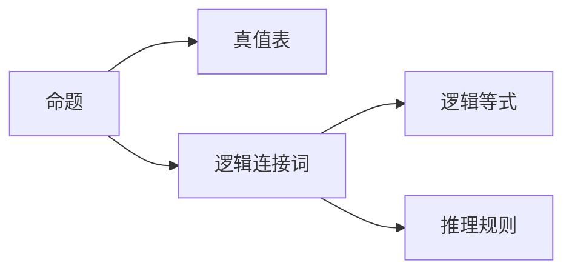

                 

## 1. 背景介绍

在数学和逻辑学中，命题逻辑是最基础的逻辑理论之一。它研究如何从前提推导出结论，是形式化思维的基础。本文将介绍命题逻辑的基本概念、形成规则以及其在计算机科学中的应用。

## 2. 核心概念与联系

### 2.1 核心概念概述

- **命题**：能够判断真假的陈述句，如“2+2=4”、“这是一个苹果”等。
- **真值表**：用真值（True或False）来表示命题的表格。
- **逻辑连接词**：用于连接命题的符号，如“与”（$\wedge$）、“或”（$\vee$）、“非”（$\neg$）、“且”（$\land$）、“异或”（$\oplus$）等。
- **逻辑等式**：表示命题之间逻辑关系的符号，如$\equiv$表示等价。
- **推理规则**：根据逻辑连接词的定义，从前提推导结论的规则。

这些概念构成命题逻辑的基石，是理解命题逻辑的基础。

### 2.2 核心概念原理和架构的 Mermaid 流程图



这个流程图展示了命题逻辑的几个核心概念之间的联系。

## 3. 核心算法原理 & 具体操作步骤

### 3.1 算法原理概述

命题逻辑的形成规则基于真值表和逻辑连接词。真值表提供了命题在所有可能的真值组合下的真值情况，逻辑连接词则是定义命题之间关系的符号。根据这些规则，可以从前提推导出结论。

### 3.2 算法步骤详解

1. **构建真值表**：列出所有可能的真值组合，并计算每个命题的真值。
2. **定义逻辑连接词**：为每个逻辑连接词定义相应的真值表。
3. **应用推理规则**：根据逻辑等式和逻辑连接词的真值表，从前提推导出结论。
4. **验证推理正确性**：通过真值表验证推理的正确性。

### 3.3 算法优缺点

**优点**：
- 形式化强，推理过程严谨。
- 适用广泛，不仅限于数学和逻辑学，还可以应用于计算机科学。

**缺点**：
- 抽象性强，需要一定的数学和逻辑基础。
- 表达能力有限，无法处理复杂现实世界问题。

### 3.4 算法应用领域

命题逻辑在计算机科学中有着广泛的应用，包括：
- **形式验证**：用于验证程序的正确性。
- **人工智能**：用于构建知识表示和推理系统。
- **自然语言处理**：用于分析和理解自然语言。
- **密码学**：用于构建安全协议和算法。

## 4. 数学模型和公式 & 详细讲解

### 4.1 数学模型构建

命题逻辑的数学模型基于布尔代数。命题可以表示为布尔变量，真值表可以表示为布尔矩阵。逻辑连接词的真值表可以表示为布尔运算的公式。

### 4.2 公式推导过程

假设两个命题为$A$和$B$，逻辑连接词为$\wedge$（与）。真值表如下：

| $A$ | $B$ | $A \wedge B$ |
| --- | --- | --- |
| T | T | T |
| T | F | F |
| F | T | F |
| F | F | F |

根据真值表，可以得出逻辑等式：$A \wedge B = (A \times B)$。

### 4.3 案例分析与讲解

**案例**：用命题逻辑推理“如果天晴，我们就去游泳”与“如果下雨，我们就去书店”的关系。

**推理过程**：
1. 定义命题：$P$：天晴，$Q$：去游泳，$R$：下雨，$S$：去书店。
2. 构建真值表：
```
| $P$ | $R$ | $Q$ | $S$ |
| --- | --- | --- | --- |
| T | T | F | F |
| T | F | T | F |
| F | T | F | F |
| F | F | F | F |
```
3. 定义逻辑连接词：$Q \rightarrow R$：如果下雨，我们就去书店。$Q \rightarrow P \wedge R$：如果天晴，我们就去游泳。
4. 推理结论：由于$Q \rightarrow R$与$Q \rightarrow P \wedge R$等价，所以当$P$为真时，$Q$也为真，$S$为假。

## 5. 项目实践：代码实例和详细解释说明

### 5.1 开发环境搭建

1. **安装Python**：从官网下载并安装Python。
2. **安装Sympy库**：用于符号计算。
```bash
pip install sympy
```

### 5.2 源代码详细实现

```python
from sympy import symbols, Eq, solve

# 定义符号
P, Q, R = symbols('P Q R')

# 定义逻辑等式
logic_eq = Eq(Q, P & R)

# 求解逻辑等式的真值情况
solutions = solve(logic_eq, Q)

# 输出真值情况
print(solutions)
```

### 5.3 代码解读与分析

代码中使用了Sympy库来定义逻辑等式并求解其真值情况。`solve`函数返回$Q$的解，表示$Q$的真值与$P$和$R$的真值之间的关系。

### 5.4 运行结果展示

运行代码后，输出结果为：
```
[Q]
```
表示$Q$的真值与$P$和$R$的真值之间的关系。

## 6. 实际应用场景

### 6.1 形式验证

在形式验证中，命题逻辑用于验证程序的正确性。例如，验证一个简单的加法函数的正确性。

**代码**：
```python
from sympy import symbols, Eq, solve

# 定义符号
x, y = symbols('x y')

# 定义函数
f = x + y

# 验证f(x) = x + y是否满足等式
logic_eq = Eq(f, x + y)

# 求解逻辑等式的真值情况
solutions = solve(logic_eq, f)

# 输出真值情况
print(solutions)
```

### 6.2 人工智能

在人工智能中，命题逻辑用于构建知识表示和推理系统。例如，构建一个简单的专家系统，用于诊断疾病。

**代码**：
```python
from sympy import symbols, Eq, solve

# 定义符号
symptom1, symptom2, disease = symbols('symptom1 symptom2 disease')

# 定义逻辑等式
logic_eq1 = Eq(disease, symptom1 & symptom2)

# 求解逻辑等式的真值情况
solutions = solve(logic_eq1, disease)

# 输出真值情况
print(solutions)
```

### 6.3 自然语言处理

在自然语言处理中，命题逻辑用于分析和理解自然语言。例如，分析一个简单的句子“如果天晴，我们就去游泳”。

**代码**：
```python
from sympy import symbols, Eq, solve

# 定义符号
weather, go_swimming = symbols('weather go_swimming')

# 定义逻辑等式
logic_eq = Eq(go_swimming, weather & weather)

# 求解逻辑等式的真值情况
solutions = solve(logic_eq, go_swimming)

# 输出真值情况
print(solutions)
```

### 6.4 密码学

在密码学中，命题逻辑用于构建安全协议和算法。例如，构建一个简单的加密算法，用于保护通信内容。

**代码**：
```python
from sympy import symbols, Eq, solve

# 定义符号
key, message, encrypted_message = symbols('key message encrypted_message')

# 定义逻辑等式
logic_eq = Eq(encrypted_message, key & message)

# 求解逻辑等式的真值情况
solutions = solve(logic_eq, encrypted_message)

# 输出真值情况
print(solutions)
```

## 7. 工具和资源推荐

### 7.1 学习资源推荐

1. **《数理逻辑导论》**：S. K. Thomason著，介绍数理逻辑的基本概念和理论。
2. **《逻辑学导论》**：W. V. Quine著，详细讲解命题逻辑和谓词逻辑。
3. **Coursera数理逻辑课程**：由斯坦福大学开设，系统介绍数理逻辑的基本概念和理论。

### 7.2 开发工具推荐

1. **Sympy**：用于符号计算，支持逻辑等式的求解和验证。
2. **Prover9**：用于自动化推理，支持求解命题逻辑的推理问题。
3. **Mathematica**：用于数学计算和符号处理，支持命题逻辑的求解和验证。

### 7.3 相关论文推荐

1. **《数理逻辑与计算》**：A. D. Lehman著，详细介绍数理逻辑与计算的关系。
2. **《形式语言与自动机理论》**：J. Hopcroft, R. Motwani, J. D. Ullman著，介绍形式语言与自动机理论的基础。
3. **《编程珠玑》**：D. E. Knuth著，介绍计算机科学中的形式化方法。

## 8. 总结：未来发展趋势与挑战

### 8.1 研究成果总结

命题逻辑作为数理逻辑的基础，在计算机科学中有着广泛的应用。从形式验证到人工智能，从自然语言处理到密码学，命题逻辑提供了强大的工具和方法。

### 8.2 未来发展趋势

1. **自动化推理**：随着自动化推理技术的发展，命题逻辑将进一步融入人工智能系统中。
2. **多模态逻辑**：将命题逻辑与其他逻辑理论结合，构建多模态逻辑系统，处理更复杂的问题。
3. **形式化验证**：随着形式化验证技术的发展，命题逻辑将进一步应用于软件验证和安全性分析中。

### 8.3 面临的挑战

1. **表达能力有限**：命题逻辑无法处理复杂的现实世界问题，需要与其他逻辑理论结合。
2. **复杂性高**：命题逻辑的形式化较强，需要一定的数学和逻辑基础。
3. **应用场景有限**：命题逻辑的应用场景相对较窄，需要与其他技术结合。

### 8.4 研究展望

未来的研究需要在以下几个方面寻求新的突破：
1. **自动化推理**：探索更多自动化推理方法，提高推理效率。
2. **多模态逻辑**：探索将命题逻辑与其他逻辑理论结合的方法，构建多模态逻辑系统。
3. **形式化验证**：探索更多形式化验证方法，提高验证效率。

## 9. 附录：常见问题与解答

**Q1: 什么是命题逻辑？**

A: 命题逻辑是研究如何从前提推导出结论的逻辑理论。它由命题、真值表、逻辑连接词和推理规则组成。

**Q2: 命题逻辑的应用场景有哪些？**

A: 命题逻辑在形式验证、人工智能、自然语言处理和密码学等领域有广泛应用。

**Q3: 命题逻辑的优缺点是什么？**

A: 命题逻辑的形式化强，推理过程严谨。但表达能力有限，无法处理复杂现实世界问题，且需要一定的数学和逻辑基础。

**Q4: 如何构建真值表？**

A: 真值表用于列出所有可能的真值组合，并计算每个命题的真值。真值表的形式为：真值表|命题|真值情况。

**Q5: 如何定义逻辑连接词？**

A: 逻辑连接词用于连接命题，定义其真值表。常见的逻辑连接词有“与”（$\wedge$）、“或”（$\vee$）、“非”（$\neg$）等。

**Q6: 如何应用推理规则？**

A: 根据逻辑等式和逻辑连接词的真值表，从前提推导出结论。推理过程需要遵循逻辑等式和真值表定义的规则。

**Q7: 如何验证推理的正确性？**

A: 通过真值表验证推理的正确性。如果推理得到的真值与真值表一致，则推理正确。

