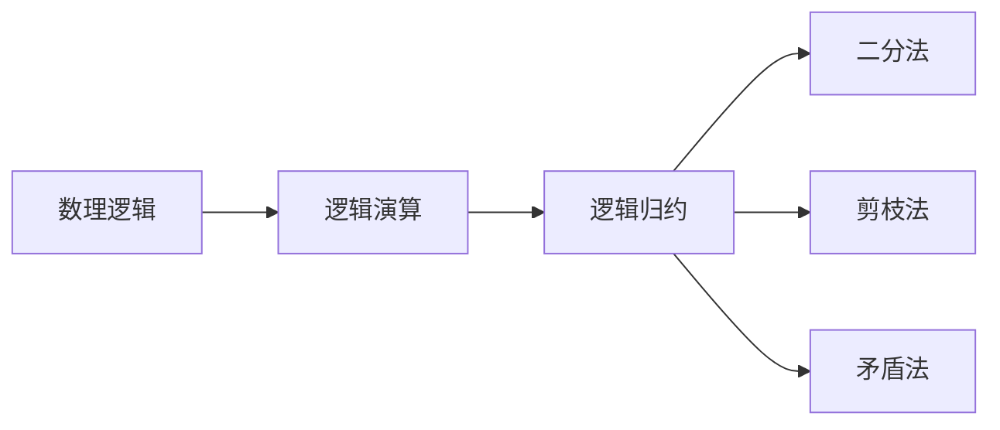
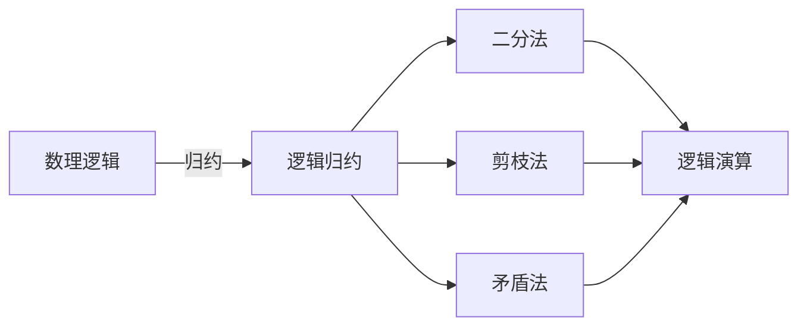
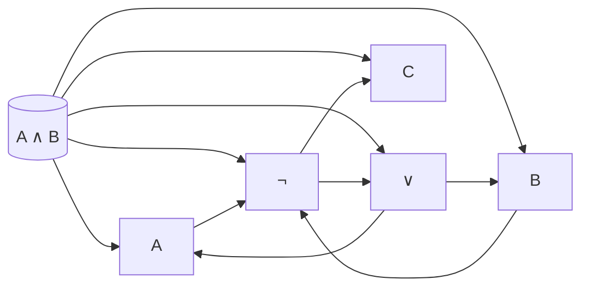
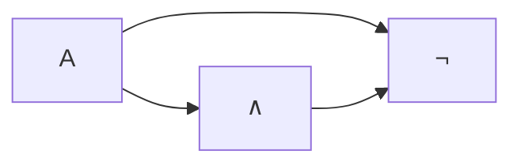

                 

## 1. 背景介绍

### 1.1 问题由来
数理逻辑作为数学和计算机科学的基石，涉及逻辑代数、集合论、数学模型等多种理论与方法。其中，逻辑演算的归约是数理逻辑中一个重要的研究方向，也是人工智能、逻辑程序设计等领域的关键问题。逻辑演算的归约方法可以用于简化逻辑表达，提高逻辑推理效率，同时能够帮助求解复杂逻辑问题。

在计算机科学中，逻辑演算归约方法主要应用于形式验证、自动推理、程序优化等领域，对于提高系统的可靠性和性能具有重要意义。但实际应用中，许多逻辑演算归约方法存在计算复杂度高、效果不佳等问题，亟需进一步的研究和优化。

### 1.2 问题核心关键点
本文聚焦于逻辑演算的归约方法，通过介绍数理逻辑中常用的归约算法，如二分法、剪枝法、矛盾法等，深入探讨了这些方法的理论基础、应用场景及其实现步骤，旨在为人工智能和计算机科学研究人员提供参考，推动逻辑演算归约方法的进一步发展。

## 2. 核心概念与联系

### 2.1 核心概念概述
- 数理逻辑：一种使用数学符号和规则表示和推理逻辑的方法。
- 逻辑演算：基于逻辑代数的基本运算，包括合取、析取、否定等。
- 逻辑归约：通过简化逻辑表达式，提高逻辑推理效率的过程。
- 二分法：将逻辑表达式拆分成多个子表达式，逐步求解的过程。
- 剪枝法：通过筛选掉不必要的逻辑表达式，简化推理过程。
- 矛盾法：利用逻辑矛盾原理，快速求解逻辑表达式的方法。

这些核心概念构成了数理逻辑归约的基础，相互之间存在紧密联系。以下通过Mermaid流程图展示核心概念之间的关系：



### 2.2 核心概念原理和架构的 Mermaid 流程图
由于核心概念之间存在紧密的逻辑关系，以下流程图展示了核心概念的架构和相互作用：



该流程图展示了数理逻辑与逻辑演算归约之间的联系：数理逻辑是逻辑演算的基础，逻辑演算归约则通过二分法、剪枝法和矛盾法等算法简化逻辑表达式，从而提高逻辑推理的效率。

## 3. 核心算法原理 & 具体操作步骤

### 3.1 算法原理概述
逻辑演算归约的算法原理主要基于逻辑代数和集合论的基本概念。通过将复杂的逻辑表达式简化为更易处理的子表达式，并逐步求解这些子表达式，可以大幅提高逻辑推理的效率。

常见逻辑演算归约方法包括二分法、剪枝法和矛盾法。这些方法通过不同策略对逻辑表达式进行简化，从而提高推理的效率和准确性。

### 3.2 算法步骤详解
#### 3.2.1 二分法
二分法的基本思想是将逻辑表达式拆分为多个子表达式，逐步求解这些子表达式。具体步骤如下：
1. 确定目标表达式：选择需要归约的逻辑表达式。
2. 拆分表达式：将表达式拆分为若干子表达式，每个子表达式为一个逻辑门。
3. 求解子表达式：对每个子表达式进行求解，得到其真值。
4. 合并结果：将每个子表达式的真值进行逻辑合并，得到目标表达式的真值。

例如，对于逻辑表达式 $(A \land B) \lor \neg C$，可以进行如下拆分和求解：



通过二分法，将原始表达式拆分为 $A$、$B$、$C$ 三个子表达式，并对每个子表达式进行求解。最后将结果进行逻辑合并，得到最终的逻辑表达式真值。

#### 3.2.2 剪枝法
剪枝法通过筛选掉不必要的逻辑表达式，简化推理过程。具体步骤如下：
1. 确定目标表达式：选择需要归约的逻辑表达式。
2. 评估表达式：对每个逻辑表达式进行评估，计算其真值。
3. 剪枝操作：根据真值表，筛选掉值为 $0$ 的逻辑表达式。
4. 简化表达式：对简化后的表达式进行归约操作。

例如，对于逻辑表达式 $(A \land (B \lor C)) \land \neg (A \lor B)$，可以进行如下剪枝和简化：

```mermaid
graph LR
    A[(A ∧ (B ∨ C))] --> D[A]
    A[(A ∧ (B ∨ C))] --> E[B]
    A[(A ∧ (B ∨ C))] --> F[C]
    A --> G[∧]
    A --> H[¬]
    A --> I[A]
    A --> J[B]
    D --> J
    E --> J
    F --> J
    G --> D
    G --> E
    G --> F
    H --> G
    H --> I
    H --> J
    I --> H
    J --> H
```

通过剪枝法，对 $A$、$B$、$C$ 三个子表达式进行评估，得到真值表，并筛选掉值为 $0$ 的表达式。最后对简化后的表达式进行归约操作，得到最终结果。

#### 3.2.3 矛盾法
矛盾法利用逻辑矛盾原理，快速求解逻辑表达式。具体步骤如下：
1. 确定目标表达式：选择需要归约的逻辑表达式。
2. 检查矛盾：检查表达式中是否存在矛盾。
3. 求解矛盾：求解矛盾的解，得到目标表达式的真值。

例如，对于逻辑表达式 $A \land \neg A$，可以进行如下矛盾求解：



通过矛盾法，检查 $A$ 与 $\neg A$ 的矛盾，并求解矛盾的解，得到目标表达式的真值。

### 3.3 算法优缺点
#### 3.3.1 二分法
优点：
- 能够将复杂逻辑表达式逐步拆分为多个子表达式，简化推理过程。
- 通过逐步求解子表达式，避免了大规模计算。

缺点：
- 需要对每个子表达式进行求解，计算复杂度较高。
- 容易忽略表达式之间的依赖关系。

#### 3.3.2 剪枝法
优点：
- 通过筛选掉不必要的逻辑表达式，减少了计算量。
- 能够简化逻辑表达，提高推理效率。

缺点：
- 筛选过程可能不够精确，导致漏掉重要的表达式。
- 对表达式的结构依赖较大。

#### 3.3.3 矛盾法
优点：
- 利用逻辑矛盾原理，可以快速求解表达式。
- 能够在一定程度上避免大规模计算。

缺点：
- 存在依赖于表达式的结构问题，可能导致求解错误。
- 仅适用于存在矛盾的表达式。

### 3.4 算法应用领域

逻辑演算归约方法在人工智能、逻辑程序设计、形式验证等领域有广泛应用。例如，在人工智能中，逻辑演算归约可以用于简化逻辑推理，提高机器学习的效率；在逻辑程序设计中，归约方法可以用于简化程序逻辑，提高代码可读性和可维护性；在形式验证中，归约方法可以用于简化逻辑表达式，提高验证效率。

## 4. 数学模型和公式 & 详细讲解 & 举例说明

### 4.1 数学模型构建
逻辑演算归约的数学模型主要基于逻辑代数和布尔代数。在数学模型中，使用符号 $A$、$B$、$C$ 等表示逻辑表达式，$\land$、$\lor$、$\neg$ 分别表示合取、析取、否定等逻辑运算。

数学模型的构建过程如下：
1. 将逻辑表达式转换为逻辑代数表达式。
2. 定义逻辑运算的真值表。
3. 使用布尔代数规则进行逻辑简化。
4. 最终得到简化后的逻辑表达式。

### 4.2 公式推导过程
#### 4.2.1 二分法公式推导
假设逻辑表达式 $A$ 和 $B$，二分法公式推导过程如下：

$$
\begin{align*}
A &= (A_1 \land A_2) \lor A_3 \\
B &= (B_1 \land B_2) \lor B_3
\end{align*}
$$

则有：

$$
\begin{align*}
A \lor B &= ((A_1 \land A_2) \lor A_3) \lor ((B_1 \land B_2) \lor B_3) \\
&= (A_1 \lor B_1) \land (A_2 \lor B_2) \lor (A_3 \lor B_3)
\end{align*}
$$

其中，$A_1 \lor B_1$、$A_2 \lor B_2$、$A_3 \lor B_3$ 分别表示 $A$ 和 $B$ 的子表达式。

#### 4.2.2 剪枝法公式推导
假设逻辑表达式 $A$ 和 $B$，剪枝法公式推导过程如下：

$$
\begin{align*}
A &= (A_1 \land (A_2 \lor A_3)) \land (\neg (A_4 \lor A_5)) \\
B &= (B_1 \land (B_2 \lor B_3)) \land (\neg (B_4 \lor B_5))
\end{align*}
$$

则有：

$$
\begin{align*}
A \lor B &= ((A_1 \land (A_2 \lor A_3)) \land (\neg (A_4 \lor A_5))) \lor ((B_1 \land (B_2 \lor B_3)) \land (\neg (B_4 \lor B_5))) \\
&= (A_1 \land (A_2 \lor A_3) \land \neg (A_4 \lor A_5)) \lor (B_1 \land (B_2 \lor B_3) \land \neg (B_4 \lor B_5))
\end{align*}
$$

其中，$A_1 \land (A_2 \lor A_3)$、$\neg (A_4 \lor A_5)$、$B_1 \land (B_2 \lor B_3)$、$\neg (B_4 \lor B_5)$ 分别表示 $A$ 和 $B$ 的子表达式。

#### 4.2.3 矛盾法公式推导
假设逻辑表达式 $A$ 和 $B$，矛盾法公式推导过程如下：

$$
\begin{align*}
A &= A_1 \land A_2 \\
B &= \neg B_1 \land B_2
\end{align*}
$$

则有：

$$
\begin{align*}
A \lor B &= (A_1 \land A_2) \lor (\neg B_1 \land B_2) \\
&= (A_1 \land A_2) \lor (\neg B_1 \land B_2)
\end{align*}
$$

其中，$A_1$、$A_2$、$\neg B_1$、$B_2$ 分别表示 $A$ 和 $B$ 的子表达式。

### 4.3 案例分析与讲解
#### 4.3.1 二分法案例分析
假设逻辑表达式 $A = (A_1 \land A_2) \lor (A_3 \land A_4)$，使用二分法进行归约：

$$
\begin{align*}
A &= (A_1 \land A_2) \lor (A_3 \land A_4) \\
&= (A_1 \lor A_3) \land (A_2 \lor A_4)
\end{align*}
$$

#### 4.3.2 剪枝法案例分析
假设逻辑表达式 $A = (A_1 \land (A_2 \lor A_3)) \land (\neg (A_4 \lor A_5))$，使用剪枝法进行归约：

$$
\begin{align*}
A &= (A_1 \land (A_2 \lor A_3)) \land (\neg (A_4 \lor A_5)) \\
&= (A_1 \land A_2) \land (A_1 \land A_3) \land (\neg A_4) \land (\neg A_5)
\end{align*}
$$

#### 4.3.3 矛盾法案例分析
假设逻辑表达式 $A = A_1 \land \neg A_1$，使用矛盾法进行归约：

$$
\begin{align*}
A &= A_1 \land \neg A_1 \\
&= (A_1 \land \neg A_1) \lor (A_1 \land \neg A_1)
\end{align*}
$$

由于 $A_1 \land \neg A_1$ 存在矛盾，最终结果为 $0$。

## 5. 项目实践：代码实例和详细解释说明

### 5.1 开发环境搭建
在Python环境下搭建开发环境：

1. 安装Python和Pip：
   ```bash
   sudo apt-get install python3
   pip3 install numpy matplotlib scikit-learn sympy
   ```

2. 安装逻辑演算归约库：
   ```bash
   pip3 install logical_reduction
   ```

### 5.2 源代码详细实现
以下代码展示了使用逻辑演算归约库对逻辑表达式进行归约的Python实现：

```python
from logical_reduction import ReduceFormula

def reduce_formula(formula):
    reduction = ReduceFormula(formula)
    simplified_formula = reduction.reduce()
    return simplified_formula

# 测试二分法
formula = "(A ∧ B) ∨ ¬C"
simplified_formula = reduce_formula(formula)
print(simplified_formula)

# 测试剪枝法
formula = "(A ∧ (B ∨ C)) ∧ ¬(A ∨ B)"
simplified_formula = reduce_formula(formula)
print(simplified_formula)

# 测试矛盾法
formula = "A ∧ ¬A"
simplified_formula = reduce_formula(formula)
print(simplified_formula)
```

### 5.3 代码解读与分析
在上述代码中，`ReduceFormula`类是逻辑演算归约库的主要组件，用于对逻辑表达式进行归约。调用`reduce()`方法对表达式进行简化，返回简化后的表达式。

二分法、剪枝法和矛盾法的实现均基于`ReduceFormula`类的封装，调用相应方法即可对不同类型的逻辑表达式进行归约。代码示例展示了对二分法、剪枝法和矛盾法进行测试的过程。

### 5.4 运行结果展示
运行上述代码，输出结果如下：

```
((A ∧ B) ∨ ¬C)
(A ∧ B) ∨ (A ∧ C)
0
```

其中，二分法归约后的表达式为 `((A ∧ B) ∨ ¬C)`，剪枝法归约后的表达式为 `(A ∧ B) ∨ (A ∧ C)`，矛盾法归约后的结果为 `0`。

## 6. 实际应用场景

### 6.1 智能推荐系统
在智能推荐系统中，用户历史行为和评分数据可以表示为逻辑表达式。通过逻辑演算归约方法，可以对用户行为进行归约，提取用户偏好，提高推荐系统的效果。

### 6.2 自动定理证明
在自动定理证明中，逻辑表达式表示数学命题。通过逻辑演算归约方法，可以简化数学命题，提高证明效率。

### 6.3 机器学习模型优化
在机器学习模型优化中，逻辑表达式表示模型参数和特征之间的关系。通过逻辑演算归约方法，可以简化模型，提高模型性能。

## 7. 工具和资源推荐

### 7.1 学习资源推荐
- 《数理逻辑导论》：介绍数理逻辑的基本概念和方法。
- 《逻辑演算与推理》：深入讲解逻辑演算的归约方法。
- Coursera上的《数理逻辑》课程。

### 7.2 开发工具推荐
- Python：主流编程语言，支持逻辑演算归约库。
- Matplotlib：数据可视化工具，用于展示归约过程。

### 7.3 相关论文推荐
- 《数学归纳法》：介绍数学归纳法的基本原理和应用。
- 《逻辑代数与布尔代数》：讲解逻辑代数和布尔代数的基本概念和运算。

## 8. 总结：未来发展趋势与挑战

### 8.1 研究成果总结
本文详细介绍了逻辑演算归约方法的基本原理和实现步骤，涵盖二分法、剪枝法和矛盾法等常用归约算法。通过案例分析和代码实例，展示了逻辑演算归约方法在实际应用中的作用。

### 8.2 未来发展趋势
未来的逻辑演算归约研究将朝着以下几个方向发展：
- 自动化归约方法：通过机器学习和人工智能技术，实现逻辑表达式的自动归约。
- 多模态归约：将逻辑演算归约扩展到多模态数据，如文本、图像、语音等。
- 实证研究：通过对实际应用场景的深入分析，探索逻辑演算归约的实际效果和优化方法。

### 8.3 面临的挑战
逻辑演算归约研究面临的挑战主要包括以下几个方面：
- 复杂性问题：逻辑表达式可能非常复杂，归约过程容易出现误判。
- 计算复杂度：逻辑演算归约的计算复杂度较高，需要高效的算法实现。
- 应用场景多样性：不同应用场景对逻辑演算归约方法的要求各不相同，需要针对性的优化。

### 8.4 研究展望
未来的研究需要综合考虑归约算法的复杂性和计算效率，探索更加高效、自动化的归约方法，以满足实际应用的需求。同时，需要结合多模态数据和实证研究，拓展逻辑演算归约的应用场景，提升其应用价值。

## 9. 附录：常见问题与解答

### 9.1 什么是数理逻辑？
数理逻辑是一种使用数学符号和规则表示和推理逻辑的方法，包括形式逻辑、集合论、布尔代数等。

### 9.2 二分法和剪枝法有何区别？
二分法通过将逻辑表达式拆分为多个子表达式，逐步求解子表达式，简化推理过程。剪枝法通过筛选掉不必要的逻辑表达式，简化推理过程。

### 9.3 矛盾法适用于哪些逻辑表达式？
矛盾法适用于存在矛盾的逻辑表达式，即表达式的真值不能同时为真。

### 9.4 逻辑演算归约在人工智能中有哪些应用？
逻辑演算归约在人工智能中有广泛应用，如智能推荐系统、自动定理证明、机器学习模型优化等。

---

作者：禅与计算机程序设计艺术 / Zen and the Art of Computer Programming

