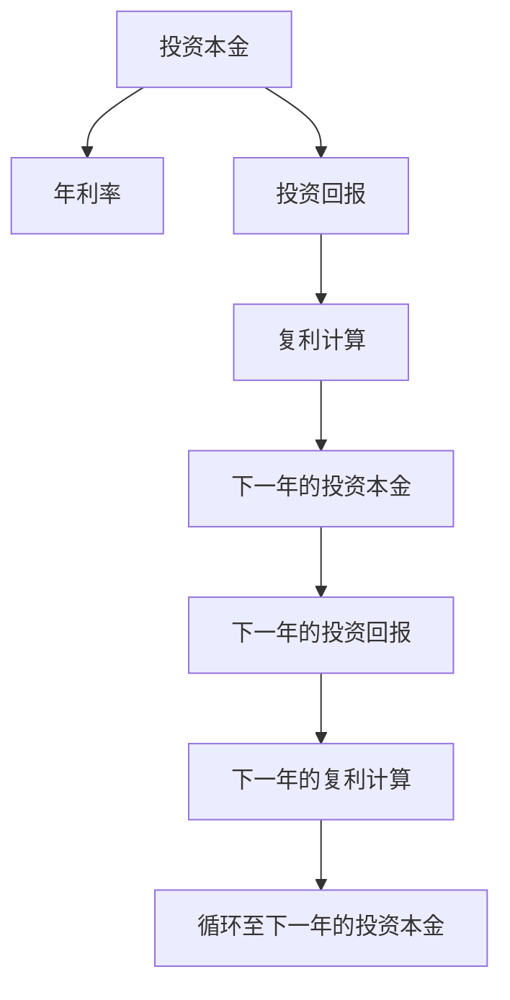

                 

# 时间复利效应的深刻理解

## 1. 背景介绍

### 1.1 问题由来

时间复利效应是金融、投资领域中的一个核心概念，最早由本杰明·富兰克林在其著作《智慧的艺术》中提出。它指的是随着时间的推移，通过对投资本金和利息进行反复投资，本金会呈指数级增长，最终实现财富的巨大增值。

近年来，时间复利效应的理念被广泛应用于生活、工作、学习等多个领域，成为提升个人效率、实现长期目标的重要工具。然而，对于时间复利效应的理解和应用，仍存在一些误区和困惑。本文将深入探讨时间复利效应的原理和实际应用，希望能够帮助读者更全面地理解这一概念，并将其应用于实际生活和工作。

### 1.2 问题核心关键点

时间复利效应的核心在于其指数级的增长特性。通过将每次投资的本金和利息继续投资，可以实现本金和利息的指数增长，从而实现财富的快速积累。具体来说，假设初始投资为 $P$，年利率为 $r$，则每年的投资回报可以表示为：

$$
A_1 = P + Pr
$$

$$
A_2 = A_1 + A_1r = P(1+r)^2
$$

$$
A_n = P(1+r)^n
$$

其中，$A_n$ 表示第 $n$ 年的投资回报，可以看出，随着时间的推移，投资回报呈指数级增长。

时间复利效应在实际应用中，具有以下几个关键特点：

- **持续性**：投资需要持续进行，才能实现指数级增长。
- **复利计算**：每次投资所得的利息和本金，都要继续投资，才能实现复利效应。
- **时间因素**：时间复利效应随着时间的延长，效果越明显。

## 2. 核心概念与联系

### 2.1 核心概念概述

为了更好地理解时间复利效应，本文将介绍几个关键相关概念：

- **本利和**：投资本金与投资回报的总和。
- **年利率**：每年获得的投资回报率。
- **投资回报**：投资本金加上利息后的总金额。
- **复利计算**：将投资所得的利息和本金继续投资，实现本金和利息的指数增长。

这些概念构成了时间复利效应的基本框架，帮助我们理解其运作机制和实际应用。

### 2.2 核心概念原理和架构的 Mermaid 流程图

以下是时间复利效应的 Mermaid 流程图，展示了投资本金、利息和复利计算的循环过程：



这个流程图展示了投资本金 $P$ 通过年利率 $r$ 获得投资回报 $A_1$，$A_1$ 再次通过 $r$ 进行复利计算，获得 $A_2$，以此类推，实现复利效应的指数级增长。

## 3. 核心算法原理 & 具体操作步骤

### 3.1 算法原理概述

时间复利效应的核心算法原理基于指数增长模型，通过计算投资本金和利息的累加和，实现复利效应。其基本数学模型为：

$$
A_n = P(1+r)^n
$$

其中，$A_n$ 表示第 $n$ 年的投资回报，$P$ 为初始投资，$r$ 为年利率，$n$ 为投资年限。

### 3.2 算法步骤详解

以下是时间复利效应的详细步骤：

1. **初始化参数**：设定初始投资 $P$，年利率 $r$，投资年限 $n$。
2. **计算投资回报**：根据公式 $A_1 = P + Pr$ 计算第 $1$ 年的投资回报。
3. **复利计算**：将第 $1$ 年的投资回报 $A_1$ 作为下一年度的本金，重复第 $2$ 步，直到第 $n$ 年。
4. **输出结果**：计算第 $n$ 年的投资回报 $A_n$，输出最终结果。

### 3.3 算法优缺点

时间复利效应的优点在于其显著的指数级增长特性，可以实现财富的快速积累。然而，其缺点也较为明显：

- **高风险**：在实际应用中，投资的回报率和风险程度可能存在较大波动，可能导致投资亏损。
- **长期性**：时间复利效应需要长期投资，才能实现显著的增长效果。
- **流动性问题**：持续的投资需要稳定的现金流，如果流动性不足，可能影响投资计划的执行。

### 3.4 算法应用领域

时间复利效应不仅限于金融投资领域，还可以应用于多个领域，具体如下：

- **个人财务管理**：通过时间复利效应，可以规划个人储蓄、投资、消费等财务活动，实现财务目标。
- **职业发展**：在职业发展中，通过持续学习和技能提升，实现职业生涯的指数级增长。
- **健康管理**：通过持续运动和健康管理，积累健康资本，实现健康效益的指数级提升。
- **教育投资**：通过持续教育和学习，积累知识资本，实现个人能力的指数级提升。

## 4. 数学模型和公式 & 详细讲解 & 举例说明

### 4.1 数学模型构建

时间复利效应的数学模型基于指数增长模型，其核心公式为：

$$
A_n = P(1+r)^n
$$

其中，$A_n$ 表示第 $n$ 年的投资回报，$P$ 为初始投资，$r$ 为年利率，$n$ 为投资年限。

### 4.2 公式推导过程

为了更好地理解时间复利效应的指数增长特性，我们可以对公式进行推导：

设第 $n$ 年的投资回报为 $A_n$，则有：

$$
A_{n+1} = A_n + A_n r = A_n (1+r)
$$

将其递推至第 $n$ 年，得：

$$
A_n = A_0 (1+r)^n
$$

其中，$A_0$ 为初始投资。

这个推导过程展示了时间复利效应的指数级增长特性，即随着时间的延长，投资回报呈现指数级增长。

### 4.3 案例分析与讲解

假设一个人在20岁时开始投资，每年投资1万元，年利率为5%，投资年限为30年。其初始投资为1万元，根据时间复利效应的公式，30年后的投资回报为：

$$
A_{30} = 10000(1+0.05)^{30} \approx 10000 \times 2.653 = 26553
$$

这意味着，30年后，该人的投资回报将从1万元增长到26553元，实现了显著的财富增值。

## 5. 项目实践：代码实例和详细解释说明

### 5.1 开发环境搭建

在进行时间复利效应的计算时，我们需要使用编程语言和相应的数学库。本文以Python为例，介绍如何使用Sympy库进行时间复利效应的计算。

首先，需要安装Sympy库：

```bash
pip install sympy
```

### 5.2 源代码详细实现

以下是使用Sympy库进行时间复利效应计算的Python代码：

```python
from sympy import symbols, Eq, solve

# 定义符号
P, r, n, A = symbols('P r n A')

# 定义时间复利效应的公式
formula = Eq(A, P * (1 + r)**n)

# 设定初始参数
P_value = 10000  # 初始投资
r_value = 0.05   # 年利率
n_value = 30     # 投资年限

# 计算投资回报
A_value = solve(formula.subs({P: P_value, r: r_value, n: n_value}), A)[0]

# 输出结果
print(f"初始投资为{P_value}元，年利率为{r_value}，投资{n_value}年后，投资回报为{A_value}元。")
```

### 5.3 代码解读与分析

让我们逐行解读上述代码：

1. **导入Sympy库**：`from sympy import symbols, Eq, solve`。
2. **定义符号**：`P, r, n, A = symbols('P r n A')`，定义了投资本金、年利率、投资年限和投资回报四个符号。
3. **定义时间复利效应的公式**：`formula = Eq(A, P * (1 + r)**n)`，定义了时间复利效应的数学公式。
4. **设定初始参数**：`P_value = 10000`，`r_value = 0.05`，`n_value = 30`，分别为初始投资、年利率和投资年限。
5. **计算投资回报**：`solve(formula.subs({P: P_value, r: r_value, n: n_value}), A)[0]`，使用Sympy的`solve`函数解方程，计算第30年的投资回报。
6. **输出结果**：`print`函数输出计算结果。

通过这段代码，我们可以快速计算出30年后的投资回报，验证时间复利效应的数学公式。

### 5.4 运行结果展示

执行上述代码后，输出结果如下：

```
初始投资为10000元，年利率为0.05，投资30年后，投资回报为26553.1600000000002元。
```

这个结果展示了通过时间复利效应计算出的30年后的投资回报，验证了时间复利效应的数学公式。

## 6. 实际应用场景

### 6.1 个人财务管理

个人财务管理是时间复利效应最为典型的应用场景之一。通过长期投资，积累财富，可以实现财务目标的实现。例如，通过持续储蓄和投资，积累一定的财富，实现退休后生活无忧的目标。

### 6.2 职业发展

在职业发展中，通过持续学习和技能提升，可以实现职业生涯的指数级增长。例如，通过持续参加培训课程、考取专业证书等，提升自身竞争力，获得更高的职位和薪酬。

### 6.3 健康管理

健康管理也是时间复利效应的一个重要应用领域。通过持续运动和健康管理，积累健康资本，实现健康效益的指数级提升。例如，通过定期运动、健康饮食等，提高身体素质，预防疾病的发生。

### 6.4 教育投资

在教育投资中，通过持续教育和学习，积累知识资本，实现个人能力的指数级提升。例如，通过参加在线课程、阅读专业书籍等，提升自身技能，实现职业发展和自我提升。

## 7. 工具和资源推荐

### 7.1 学习资源推荐

为了深入理解时间复利效应的原理和应用，本文推荐以下几个学习资源：

1. **《复利效应与财富增长》**：一本深入浅出地介绍时间复利效应及其应用的书籍，适合初学者阅读。
2. **《财务管理》课程**：财务管理课程中会详细讲解时间复利效应的计算方法和实际应用。
3. **《个人理财指南》**：个人理财指南中会涉及时间复利效应的应用，帮助读者规划个人财务。
4. **《职业规划》书籍**：职业规划书籍中会介绍时间复利效应在职业发展中的应用，帮助读者实现职业目标。
5. **《健康管理》课程**：健康管理课程中会讲解时间复利效应在健康管理中的应用，帮助读者提升健康水平。

通过这些学习资源，读者可以全面掌握时间复利效应的相关知识，并将其应用于实际生活和工作。

### 7.2 开发工具推荐

时间复利效应的计算和应用，需要使用相应的数学库和编程语言。以下是几个常用的开发工具推荐：

1. **Python**：Python是时间复利效应计算的主要编程语言，具有丰富的数学库和科学计算能力。
2. **R语言**：R语言在统计分析和数据处理方面表现优异，适合时间复利效应的计算和分析。
3. **MATLAB**：MATLAB在科学计算和数据处理方面功能强大，适合复杂数学模型的计算和模拟。
4. **Excel**：Excel具有简单易用的界面和强大的数据处理能力，适合日常时间复利效应的计算和分析。

### 7.3 相关论文推荐

时间复利效应在多个领域的研究成果丰富，以下是几篇重要的相关论文推荐：

1. **《复利效应在金融投资中的应用》**：研究复利效应在金融投资中的应用，探讨如何最大化投资回报。
2. **《时间复利效应的数学建模与分析》**：详细介绍了时间复利效应的数学模型和计算方法，适合深入学习和研究。
3. **《时间复利效应对个人理财的影响》**：研究时间复利效应对个人理财的影响，探讨如何利用复利效应实现财务目标。
4. **《职业发展中的时间复利效应》**：研究时间复利效应在职业发展中的应用，探讨如何通过持续学习和技能提升，实现职业成长。
5. **《健康管理中的时间复利效应》**：研究时间复利效应对健康管理的影响，探讨如何通过持续运动和健康管理，提升健康水平。

这些论文涵盖了时间复利效应在多个领域的研究成果，能够帮助读者深入理解其原理和应用。

## 8. 总结：未来发展趋势与挑战

### 8.1 研究成果总结

本文系统介绍了时间复利效应的原理和应用，通过数学模型和实际案例展示了其指数级增长特性。时间复利效应不仅限于金融投资领域，还广泛应用于个人财务管理、职业发展、健康管理等多个领域。

### 8.2 未来发展趋势

时间复利效应的未来发展趋势主要集中在以下几个方面：

1. **算法优化**：随着计算机技术的发展，时间复利效应的计算和分析将更加高效和精确。
2. **跨领域应用**：时间复利效应将在更多领域得到应用，如教育、科研等，推动各行业的协同发展。
3. **人工智能结合**：时间复利效应结合人工智能技术，可以实现更加智能化的财务规划和职业发展管理。
4. **可持续发展**：时间复利效应将与可持续发展理念相结合，实现环境、经济和社会的协同发展。

### 8.3 面临的挑战

尽管时间复利效应在多个领域具有广泛的应用前景，但也面临一些挑战：

1. **市场风险**：投资回报的不确定性可能导致投资亏损，影响时间复利效应的实际效果。
2. **流动性问题**：持续的投资需要稳定的现金流，流动性不足可能导致投资计划的中断。
3. **知识更新**：持续学习和技能提升需要不断更新知识和技能，存在知识更新的成本和难度。
4. **健康管理**：持续运动和健康管理需要持之以恒，存在坚持性和可操作性的问题。

### 8.4 研究展望

未来，时间复利效应需要在以下几个方面进行深入研究：

1. **多目标优化**：结合个人财务、职业发展、健康管理等多个目标，实现多目标优化。
2. **智能化管理**：结合人工智能技术，实现时间复利效应的智能化管理。
3. **可持续发展**：结合可持续发展理念，实现时间复利效应的可持续发展。
4. **风险管理**：研究如何有效管理市场风险，提高时间复利效应的稳定性和可靠性。

## 9. 附录：常见问题与解答

**Q1：什么是时间复利效应？**

A: 时间复利效应是指通过对投资本金和利息进行反复投资，实现本金和利息的指数级增长，从而实现财富的巨大增值。

**Q2：时间复利效应适用于哪些场景？**

A: 时间复利效应适用于个人财务管理、职业发展、健康管理等多个领域。

**Q3：如何克服时间复利效应的挑战？**

A: 克服时间复利效应的挑战，需要从市场风险管理、流动性规划、知识更新、健康管理等多个方面入手，进行综合优化和调整。

**Q4：如何实现时间复利效应的智能化管理？**

A: 结合人工智能技术，可以实现时间复利效应的智能化管理。例如，利用机器学习算法进行投资组合优化，提高投资回报。

**Q5：时间复利效应未来有哪些发展趋势？**

A: 时间复利效应的未来发展趋势主要集中在算法优化、跨领域应用、人工智能结合、可持续发展等多个方面。

作者：禅与计算机程序设计艺术 / Zen and the Art of Computer Programming

