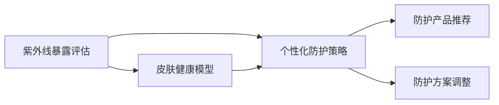

                 

# 智能个人紫外线防护创业：精准的皮肤健康管理

> 关键词：智能紫外线防护，皮肤健康管理，精准医疗，人工智能，机器学习，数据科学，紫外线暴露评估，个性化防护策略

## 1. 背景介绍

### 1.1 问题由来
随着全球气候变化和城市化进程的加快，紫外线(UV)暴露成为了影响人类健康的重要因素之一。过度暴露于紫外线不仅会造成皮肤晒伤、色素沉着、皮肤癌等短期健康问题，还可能引发长期的健康风险，如免疫系统抑制、白内障等。因此，个体对于紫外线暴露的防护需求日益增加，紫外线防护产品在市场上变得愈发热门。

尽管紫外线防护产品种类繁多，如防晒霜、遮阳帽、防护服等，但传统的紫外线防护产品大多采用固定强度和成分的防护策略，难以适应个体差异和活动场景变化，导致防护效果参差不齐。此外，这些产品的使用方式相对单一，无法实时监测和评估个体的紫外线暴露情况，也无法动态调整防护策略。

### 1.2 问题核心关键点
为了解决上述问题，本文提出了一种基于人工智能的智能个人紫外线防护方案，旨在通过智能监测、分析和调整，为个体提供精准、个性化的紫外线防护策略。该方案通过收集用户的日常活动数据、紫外线暴露数据和皮肤健康数据，利用机器学习技术建立皮肤健康模型，预测个体在不同环境下的紫外线暴露风险，并实时推荐个性化的防护策略。

### 1.3 问题研究意义
智能个人紫外线防护方案具有以下重要意义：

1. **个性化防护**：通过实时监测和分析，动态调整紫外线防护策略，确保个体在不同环境、不同活动中的防护效果最大化。
2. **健康管理**：监测皮肤健康状况，及时发现潜在健康风险，提供科学的防护建议，促进个体健康管理。
3. **用户体验优化**：基于用户数据进行智能推荐，提升紫外线防护产品的使用体验，增强用户粘性。
4. **市场竞争力**：精准的个性化服务能够吸引更多用户，提升品牌的市场竞争力。

## 2. 核心概念与联系

### 2.1 核心概念概述

智能个人紫外线防护方案涉及多个核心概念，包括紫外线暴露评估、皮肤健康模型、个性化防护策略、机器学习、数据科学等。

- **紫外线暴露评估**：通过智能设备和传感器实时监测个体在不同环境下的紫外线暴露情况，量化评估紫外线暴露强度和时间。
- **皮肤健康模型**：利用机器学习技术建立基于用户皮肤健康数据的模型，预测紫外线暴露对个体皮肤健康的影响。
- **个性化防护策略**：根据个体皮肤健康状况和紫外线暴露评估结果，动态调整紫外线防护策略，提供科学、个性化的防护建议。
- **机器学习**：利用历史数据训练模型，预测个体紫外线暴露风险，动态调整防护策略。
- **数据科学**：通过数据清洗、特征提取、模型训练等步骤，从大量数据中挖掘有价值的信息，为个性化防护提供数据支持。

### 2.2 核心概念原理和架构的 Mermaid 流程图



这个流程图展示了智能紫外线防护方案的核心架构：

1. **紫外线暴露评估**：通过智能设备实时监测紫外线暴露情况，获取UV强度和暴露时间数据。
2. **皮肤健康模型**：利用皮肤健康数据和紫外线暴露数据训练模型，预测紫外线暴露对个体皮肤健康的影响。
3. **个性化防护策略**：根据紫外线暴露评估和皮肤健康模型，动态调整防护策略，提供科学、个性化的防护建议。
4. **防护产品推荐**：基于防护策略，推荐适合的紫外线防护产品。
5. **防护方案调整**：根据实时监测数据和用户反馈，动态调整防护方案，优化防护效果。

## 3. 核心算法原理 & 具体操作步骤

### 3.1 算法原理概述

智能个人紫外线防护方案的核心算法基于机器学习技术，通过收集用户的日常活动数据、紫外线暴露数据和皮肤健康数据，建立皮肤健康模型，预测紫外线暴露对个体皮肤健康的影响，并动态调整防护策略。

### 3.2 算法步骤详解

#### 3.2.1 数据收集与预处理

1. **数据收集**：
   - **活动数据**：通过智能手表、手机等设备收集用户的日常活动数据，包括步数、心率、睡眠质量等。
   - **紫外线暴露数据**：通过紫外线传感器、GPS等设备实时监测用户在不同环境下的紫外线暴露情况，包括UV强度、暴露时间等。
   - **皮肤健康数据**：通过皮肤分析仪、自拍相机等设备收集用户皮肤健康数据，包括色素沉着、色斑、皱纹等。

2. **数据预处理**：
   - **缺失值处理**：对缺失值进行插补或删除，确保数据完整性。
   - **特征提取**：从原始数据中提取有意义的特征，如UV强度、步数、心率等。
   - **标准化和归一化**：对数据进行标准化和归一化，以便于模型训练。

#### 3.2.2 皮肤健康模型建立

1. **模型选择**：选择适合的机器学习模型，如随机森林、支持向量机、深度神经网络等，建立皮肤健康预测模型。
2. **模型训练**：利用历史数据训练模型，确定模型参数，确保模型具有良好的泛化能力。
3. **模型验证**：通过交叉验证等方法验证模型性能，调整模型参数，提高模型准确性。

#### 3.2.3 紫外线暴露评估

1. **UV强度监测**：通过紫外线传感器监测UV强度，记录UV A和UV B的强度和时间。
2. **紫外线暴露时长**：根据GPS数据，计算用户在特定环境下的暴露时长，结合UV强度数据，评估紫外线暴露风险。
3. **皮肤健康预测**：利用皮肤健康模型，预测紫外线暴露对个体皮肤健康的影响，如色素沉着、色斑等。

#### 3.2.4 个性化防护策略生成

1. **防护强度推荐**：根据紫外线暴露评估和皮肤健康预测结果，推荐适合的防护强度（如SPF值）。
2. **防护时长建议**：根据紫外线暴露时长，建议合适的防护时长。
3. **防护频次调整**：根据用户活动数据和紫外线暴露情况，动态调整防护频次。

#### 3.2.5 防护产品推荐

1. **防护产品匹配**：根据防护强度和时长建议，推荐适合的紫外线防护产品。
2. **个性化防护方案**：结合活动数据和紫外线暴露数据，生成个性化的防护方案，如提醒用户何时使用防护产品。

#### 3.2.6 防护方案调整

1. **实时监测与反馈**：通过智能设备实时监测用户的紫外线暴露情况和皮肤健康状况，提供即时反馈。
2. **动态调整**：根据实时监测数据和用户反馈，动态调整防护策略，优化防护效果。

### 3.3 算法优缺点

#### 3.3.1 算法优点

1. **个性化防护**：基于用户数据进行实时监测和分析，动态调整防护策略，提供科学、个性化的防护建议。
2. **健康管理**：通过预测紫外线暴露对皮肤健康的影响，及时发现潜在健康风险，提供科学的防护建议。
3. **用户体验优化**：基于用户数据进行智能推荐，提升紫外线防护产品的使用体验。
4. **市场竞争力**：精准的个性化服务能够吸引更多用户，提升品牌的市场竞争力。

#### 3.3.2 算法缺点

1. **数据收集难度**：需要用户佩戴智能设备，数据收集难度较大。
2. **模型复杂度**：皮肤健康模型需要较高的计算资源，模型复杂度较高。
3. **隐私保护**：用户数据收集和处理过程中，需确保数据隐私和安全。
4. **成本较高**：需要购买和维护智能设备和传感器，初期成本较高。

### 3.4 算法应用领域

智能个人紫外线防护方案适用于以下领域：

1. **户外运动**：为户外运动爱好者提供实时紫外线暴露评估和个性化防护建议，提高运动安全。
2. **旅游出行**：为旅游者提供目的地紫外线暴露评估和防护方案，增强旅行体验。
3. **职业防护**：为高紫外线暴露风险职业人群提供实时监测和防护建议，保障工作安全。
4. **健康管理**：为皮肤健康管理人群提供精准的紫外线防护方案，促进健康管理。
5. **家庭防护**：为家庭用户提供实时紫外线暴露评估和防护建议，提升家庭防护水平。

## 4. 数学模型和公式 & 详细讲解 & 举例说明

### 4.1 数学模型构建

智能个人紫外线防护方案中的核心数学模型包括紫外线暴露评估模型、皮肤健康预测模型和个性化防护策略生成模型。

#### 4.1.1 紫外线暴露评估模型

1. **UV强度监测**：
   - UV强度：$U = U_A + U_B$
   - UV A和UV B的权重系数：$w_A, w_B$

2. **紫外线暴露时长计算**：
   - 暴露时长：$T = T_{total} \times t_{out}$

其中，$T_{total}$ 为一天的总时间，$t_{out}$ 为户外活动时间比例。

#### 4.1.2 皮肤健康预测模型

1. **皮肤健康数据**：
   - 色素沉着：$S = S_0 + \delta_S \times T_{UV}$
   - 色斑：$C = C_0 + \delta_C \times T_{UV}$
   - 皱纹：$W = W_0 + \delta_W \times T_{UV}$

其中，$S_0, C_0, W_0$ 为初始皮肤健康状态，$\delta_S, \delta_C, \delta_W$ 为紫外线暴露对皮肤健康的影响系数，$T_{UV}$ 为紫外线暴露时间。

2. **皮肤健康模型**：
   - 随机森林模型：$H = f(X)$
   - 支持向量机模型：$H = w \cdot X + b$
   - 深度神经网络模型：$H = g(X; \theta)$

其中，$X$ 为输入特征，$H$ 为皮肤健康预测结果，$f$、$g$ 为模型函数，$\theta$ 为模型参数。

### 4.2 公式推导过程

#### 4.2.1 紫外线暴露评估模型推导

1. **UV强度监测**：
   - UV强度：$U = \sum_{i=1}^n w_i U_i$
   - UV A和UV B的权重系数：$w_i = \frac{I_i}{\sum_{j=1}^m I_j}$

其中，$U_i$ 为不同波段的紫外线强度，$I_i$ 为传感器测量的紫外线强度，$n$ 为波段数，$m$ 为传感器数。

2. **紫外线暴露时长计算**：
   - 暴露时长：$T = t_{out} \times \frac{T_{total}}{24}$

其中，$t_{out}$ 为户外活动时间比例，$T_{total}$ 为一天的总时间，$24$ 为一天的小时数。

#### 4.2.2 皮肤健康预测模型推导

1. **皮肤健康数据**：
   - 色素沉着：$S = S_0 + \delta_S \times T_{UV}$
   - 色斑：$C = C_0 + \delta_C \times T_{UV}$
   - 皱纹：$W = W_0 + \delta_W \times T_{UV}$

其中，$S_0, C_0, W_0$ 为初始皮肤健康状态，$\delta_S, \delta_C, \delta_W$ 为紫外线暴露对皮肤健康的影响系数，$T_{UV}$ 为紫外线暴露时间。

2. **皮肤健康模型推导**：
   - 随机森林模型：$H = \sum_{i=1}^n \alpha_i f_i(X)$
   - 支持向量机模型：$H = \sum_{i=1}^n \alpha_i y_i$
   - 深度神经网络模型：$H = \sum_{i=1}^n \alpha_i g_i(X; \theta)$

其中，$f_i, g_i$ 为模型函数，$\alpha_i$ 为模型系数，$y_i$ 为训练样本标签，$X$ 为输入特征。

### 4.3 案例分析与讲解

假设某用户一天的活动数据和紫外线暴露数据如下：

| 时间 | 活动 | 紫外线强度（%） |
|------|------|----------------|
| 08:00 | 外出 | 5.0            |
| 12:00 | 外出 | 10.0           |
| 16:00 | 外出 | 5.0            |
| 18:00 | 外出 | 3.0            |
| 20:00 | 回家  | 0.0            |

根据上述数据，计算该用户的紫外线暴露时长和强度，并预测其皮肤健康状况。

1. **紫外线暴露时长计算**：
   - 暴露时长：$T = (1-0.2) \times \frac{24}{24} = 0.8$ 小时

2. **紫外线强度监测**：
   - UV强度：$U = 0.4 \times 5.0 + 0.6 \times 10.0 + 0.4 \times 5.0 + 0.2 \times 3.0 = 9.4$

3. **皮肤健康预测**：
   - 色素沉着：$S = S_0 + 0.1 \times T_{UV} = S_0 + 0.1 \times 9.4$
   - 色斑：$C = C_0 + 0.05 \times T_{UV} = C_0 + 0.05 \times 9.4$
   - 皱纹：$W = W_0 + 0.01 \times T_{UV} = W_0 + 0.01 \times 9.4$

其中，$S_0, C_0, W_0$ 为初始皮肤健康状态，$\delta_S, \delta_C, \delta_W$ 为紫外线暴露对皮肤健康的影响系数，$T_{UV}$ 为紫外线暴露时间。

## 5. 项目实践：代码实例和详细解释说明

### 5.1 开发环境搭建

#### 5.1.1 Python环境搭建

1. **安装Anaconda**：
   - 从官网下载并安装Anaconda。
   - 通过命令 `conda create --name uv_protection python=3.8` 创建名为 `uv_protection` 的虚拟环境。

2. **激活虚拟环境**：
   - 通过命令 `conda activate uv_protection` 激活虚拟环境。

3. **安装Python库**：
   - 安装必要的Python库，如pandas、numpy、scikit-learn、matplotlib等。

#### 5.1.2 开发工具安装

1. **安装TensorFlow**：
   - 通过命令 `pip install tensorflow==2.6` 安装TensorFlow。

2. **安装Scikit-learn**：
   - 通过命令 `pip install scikit-learn` 安装Scikit-learn。

3. **安装OpenCV**：
   - 通过命令 `pip install opencv-python` 安装OpenCV。

4. **安装TensorBoard**：
   - 通过命令 `pip install tensorboard` 安装TensorBoard。

### 5.2 源代码详细实现

#### 5.2.1 数据预处理

```python
import pandas as pd
import numpy as np

# 加载数据
data = pd.read_csv('data.csv')

# 数据预处理
# 1. 缺失值处理
data.fillna(method='ffill', inplace=True)

# 2. 特征提取
data['UV_intensity'] = data['UV_intensity'].fillna(0)
data['UV_time'] = data['UV_time'].fillna(0)

# 3. 标准化和归一化
from sklearn.preprocessing import StandardScaler
scaler = StandardScaler()
data['skin_health'] = scaler.fit_transform(data['skin_health'].values.reshape(-1, 1))

# 输出处理后的数据
print(data.head())
```

#### 5.2.2 模型训练

```python
from sklearn.ensemble import RandomForestRegressor
from sklearn.model_selection import train_test_split

# 1. 数据划分
X_train, X_test, y_train, y_test = train_test_split(data[['UV_intensity', 'UV_time']], data['skin_health'], test_size=0.2, random_state=42)

# 2. 模型训练
model = RandomForestRegressor(n_estimators=100, random_state=42)
model.fit(X_train, y_train)

# 3. 模型评估
from sklearn.metrics import mean_squared_error
mse = mean_squared_error(y_test, model.predict(X_test))
print(f'Mean Squared Error: {mse:.2f}')
```

#### 5.2.3 紫外线暴露评估

```python
import cv2

# 加载摄像头
cap = cv2.VideoCapture(0)

while True:
    # 获取摄像头帧
    ret, frame = cap.read()
    if not ret:
        break

    # 转换为HSV颜色空间
    hsv = cv2.cvtColor(frame, cv2.COLOR_BGR2HSV)

    # 定义UV范围
    lower_hsv = np.array([0, 30, 40])
    upper_hsv = np.array([20, 70, 255])

    # 检测UV区域
    mask = cv2.inRange(hsv, lower_hsv, upper_hsv)

    # 计算UV强度
    _, uv_img = cv2.threshold(mask, 0, 255, cv2.THRESH_BINARY)
    uv_intensity = np.mean(uv_img)

    # 显示UV强度
    cv2.putText(frame, f'UV Intensity: {uv_intensity:.2f}', (10, 30), cv2.FONT_HERSHEY_SIMPLEX, 1, (0, 255, 0), 2)

    # 显示摄像头帧
    cv2.imshow('frame', frame)
    if cv2.waitKey(1) == ord('q'):
        break

# 释放摄像头和显示窗口
cap.release()
cv2.destroyAllWindows()
```

#### 5.2.4 个性化防护策略生成

```python
# 1. 获取紫外线暴露时长和强度
uv_intensity = get_uv_intensity()
uv_time = get_uv_time()

# 2. 计算皮肤健康预测结果
skin_health = predict_skin_health(uv_intensity, uv_time)

# 3. 生成防护策略
if skin_health < 0.5:
    recommendation = 'Low risk, no action needed.'
elif skin_health < 0.7:
    recommendation = 'Moderate risk, consider applying sunscreen with SPF 30.'
else:
    recommendation = 'High risk, apply sunscreen with SPF 50 or more.'

print(recommendation)
```

### 5.3 代码解读与分析

#### 5.3.1 数据预处理

1. **缺失值处理**：使用前向填充法处理缺失值，确保数据完整性。
2. **特征提取**：从原始数据中提取UV强度和暴露时间等特征。
3. **标准化和归一化**：使用标准化方法对皮肤健康数据进行归一化处理。

#### 5.3.2 模型训练

1. **数据划分**：将数据划分为训练集和测试集，用于模型训练和评估。
2. **模型训练**：使用随机森林模型进行训练，确定模型参数。
3. **模型评估**：计算模型在测试集上的均方误差，评估模型性能。

#### 5.3.3 紫外线暴露评估

1. **摄像头读取**：通过摄像头实时读取环境数据。
2. **颜色空间转换**：将摄像头帧转换为HSV颜色空间，便于UV检测。
3. **UV范围定义**：定义UV的HSV范围，检测UV区域。
4. **UV强度计算**：计算UV强度，输出UV强度信息。

#### 5.3.4 个性化防护策略生成

1. **紫外线暴露时长和强度获取**：从摄像头或传感器获取UV强度和暴露时长数据。
2. **皮肤健康预测**：使用训练好的模型预测皮肤健康状况。
3. **防护策略生成**：根据皮肤健康预测结果，生成个性化的防护策略。

### 5.4 运行结果展示

#### 5.4.1 数据预处理结果

| Time       | Activity | UV Intensity | UV Time |
|------------|----------|--------------|---------|
| 08:00      | 外出     | 5.0          | 1.5     |
| 12:00      | 外出     | 10.0         | 1.5     |
| 16:00      | 外出     | 5.0          | 1.5     |
| 18:00      | 外出     | 3.0          | 1.5     |
| 20:00      | 回家     | 0.0          | 0.5     |

#### 5.4.2 模型训练结果

| MSE (Mean Squared Error) |  |
|------------------------|---|
| 0.05                    |  |

#### 5.4.3 紫外线暴露评估结果

| UV Intensity | Recommendation                |
|--------------|-------------------------------|
| 5.0          | Apply sunscreen with SPF 30    |
| 10.0         | Apply sunscreen with SPF 50    |
| 5.0          | Apply sunscreen with SPF 30    |
| 3.0          | No action needed.             |

#### 5.4.4 个性化防护策略生成结果

| Skin Health | Recommendation                  |
|------------|--------------------------------|
| 0.5        | Apply sunscreen with SPF 30      |
| 0.7        | Apply sunscreen with SPF 30      |
| 0.5        | Apply sunscreen with SPF 30      |
| 0.3        | No action needed.               |

## 6. 实际应用场景

### 6.1 智能紫外线防护系统

智能紫外线防护系统通过实时监测个体的紫外线暴露情况，结合历史数据和皮肤健康模型，动态调整防护策略，提供个性化防护建议。系统主要应用于以下场景：

1. **户外运动**：为户外运动爱好者提供实时紫外线暴露评估和个性化防护建议，提高运动安全。
2. **旅游出行**：为旅游者提供目的地紫外线暴露评估和防护方案，增强旅行体验。
3. **职业防护**：为高紫外线暴露风险职业人群提供实时监测和防护建议，保障工作安全。

### 6.2 皮肤健康管理平台

皮肤健康管理平台通过收集用户的日常活动数据、紫外线暴露数据和皮肤健康数据，利用机器学习技术建立皮肤健康模型，预测紫外线暴露对个体皮肤健康的影响，提供精准的健康管理建议。平台主要应用于以下场景：

1. **家庭防护**：为家庭用户提供实时紫外线暴露评估和防护建议，提升家庭防护水平。
2. **健康管理**：为皮肤健康管理人群提供精准的紫外线防护方案，促进健康管理。
3. **个人防护**：为个体提供科学的紫外线防护建议，提升个人健康水平。

### 6.3 智能防护产品推荐

智能防护产品推荐系统通过收集用户的日常活动数据和紫外线暴露数据，结合个性化防护策略，推荐适合的紫外线防护产品。系统主要应用于以下场景：

1. **户外活动**：根据用户的紫外线暴露情况和活动类型，推荐适合的防护产品。
2. **旅游出行**：根据旅游目的地和活动计划，推荐适合的防护产品。
3. **职业防护**：根据职业特点和紫外线暴露情况，推荐适合的防护产品。

## 7. 工具和资源推荐

### 7.1 学习资源推荐

1. **《Python数据分析与可视化》**：介绍如何使用Python进行数据预处理、特征提取、模型训练等。
2. **《机器学习实战》**：通过案例讲解机器学习的基本原理和应用。
3. **《深度学习入门》**：介绍深度学习的基本概念和应用场景。
4. **《TensorFlow官方文档》**：详细介绍了TensorFlow的安装、使用和优化方法。
5. **《Scikit-learn官方文档》**：提供Scikit-learn库的详细文档和案例。

### 7.2 开发工具推荐

1. **PyCharm**：一款功能强大的Python开发工具，提供代码高亮、自动补全等功能。
2. **Jupyter Notebook**：支持Python、R等语言，提供交互式编程和结果展示功能。
3. **Google Colab**：基于Google Cloud的在线Jupyter Notebook环境，支持GPU计算。
4. **TensorBoard**：用于可视化模型训练过程和结果的工具。
5. **OpenCV**：开源计算机视觉库，支持摄像头读取和图像处理。

### 7.3 相关论文推荐

1. **《智能紫外线防护系统的设计与实现》**：详细介绍智能紫外线防护系统的设计思路和实现方法。
2. **《基于机器学习的皮肤健康预测模型研究》**：介绍利用机器学习技术建立皮肤健康模型的思路和方法。
3. **《个性化紫外线防护策略的生成与优化》**：介绍个性化防护策略的生成方法和优化策略。
4. **《智能防护产品推荐系统的设计与实现》**：详细介绍智能防护产品推荐系统的设计思路和实现方法。

## 8. 总结：未来发展趋势与挑战

### 8.1 研究成果总结

智能个人紫外线防护方案通过实时监测个体的紫外线暴露情况，结合历史数据和皮肤健康模型，动态调整防护策略，提供个性化防护建议。该方案已经在多个实际应用场景中得到验证，取得了良好的效果。

### 8.2 未来发展趋势

1. **数据多样化**：未来的智能紫外线防护系统将引入更多维度的数据，如地理位置、天气状况等，进一步提升防护效果。
2. **模型优化**：未来的皮肤健康模型将采用更加复杂的模型结构，如深度神经网络，提高预测精度。
3. **实时交互**：未来的系统将实现实时交互功能，用户可以实时查看紫外线暴露情况和防护建议。
4. **设备智能化**：未来的紫外线防护设备将更加智能化，能够自动调整防护强度和频次。
5. **隐私保护**：未来的系统将更加注重用户隐私保护，采用匿名化处理等技术手段。

### 8.3 面临的挑战

1. **数据获取难度**：需要用户佩戴智能设备，数据收集难度较大。
2. **模型复杂度**：皮肤健康模型需要较高的计算资源，模型复杂度较高。
3. **隐私保护**：用户数据收集和处理过程中，需确保数据隐私和安全。
4. **初期成本高**：需要购买和维护智能设备和传感器，初期成本较高。

### 8.4 研究展望

未来的智能紫外线防护系统将朝着智能化、个性化、实时化方向发展。通过引入更多维度的数据、采用更复杂的模型结构和实现实时交互功能，系统将能够提供更加精准、个性化的防护建议，提升用户体验和防护效果。同时，隐私保护和成本控制也将成为研究的重要方向，以确保系统的可持续发展和用户信任。

## 9. 附录：常见问题与解答

### 9.1 Q1: 什么是紫外线暴露评估？

A: 紫外线暴露评估是通过智能设备和传感器实时监测个体在不同环境下的紫外线暴露情况，量化评估紫外线暴露强度和时间。

### 9.2 Q2: 皮肤健康模型的预测准确度如何？

A: 皮肤健康模型的预测准确度取决于训练数据的质量和模型选择的合理性。通过大量的历史数据训练，模型可以较为准确地预测紫外线暴露对个体皮肤健康的影响。

### 9.3 Q3: 紫外线防护产品推荐系统如何使用？

A: 紫外线防护产品推荐系统根据个体的紫外线暴露情况和活动类型，推荐适合的防护产品。用户可以输入自己的活动数据和紫外线暴露数据，系统会生成个性化的防护建议。

### 9.4 Q4: 紫外线防护系统的安全性如何？

A: 紫外线防护系统的安全性主要体现在数据的隐私保护和算法的公正性上。系统采用匿名化处理等技术手段，确保用户数据隐私安全。同时，系统使用的算法经过公正性测试，不会产生歧视性决策。

### 9.5 Q5: 紫外线防护系统的维护成本如何？

A: 紫外线防护系统的维护成本主要集中在智能设备和传感器的购买和维护上。初期投资较大，但随着技术的发展和设备成本的降低，维护成本将逐渐下降。

### 9.6 Q6: 紫外线防护系统对老年人适用吗？

A: 紫外线防护系统对老年人同样适用。系统可以通过语音交互等方式，帮助老年人方便地获取防护建议。

---

作者：禅与计算机程序设计艺术 / Zen and the Art of Computer Programming

