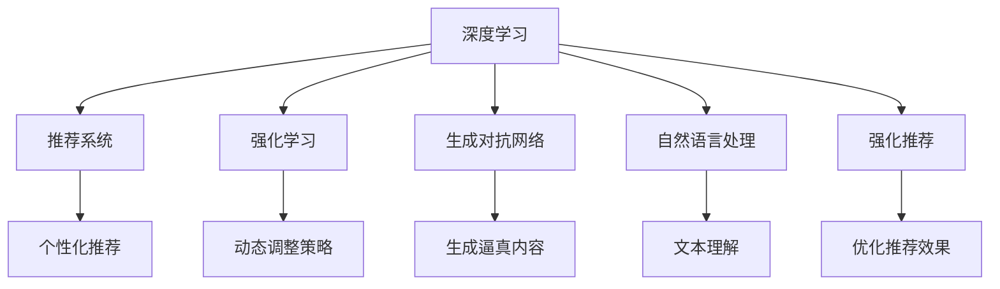
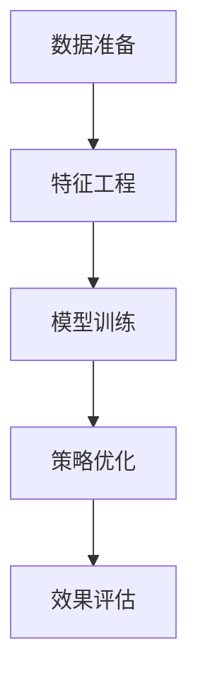

                 

# 智能促销策略的AI优化

## 1. 背景介绍

### 1.1 问题由来

在现代商业环境中，促销活动是推动销售增长的重要手段。传统促销策略往往依赖于经验积累和直觉判断，缺乏科学的决策依据。因此，利用AI技术优化促销策略，以更精确、更高效的方式进行决策，已成为各大企业的热门需求。

目前，促销策略优化的方法多种多样，包括基于规则的策略、历史数据驱动的策略、机器学习驱动的策略等。其中，机器学习驱动的策略通过数据分析和建模，能够实现自动化决策，从而更准确地预测销售效果和市场变化。但这些方法往往需要大量的历史数据，且模型训练和部署的复杂度较高，难以快速落地应用。

近年来，随着深度学习技术的发展，AI优化促销策略的方法逐渐向更加灵活和智能化方向演进。基于深度学习的智能促销策略优化方法，能够通过大数据分析和复杂模型训练，实现对市场动态的精细化和预测性理解，从而指导促销活动的设计和实施。

### 1.2 问题核心关键点

AI优化促销策略的核心在于如何将市场数据、用户行为、产品特性等因素，通过深度学习模型进行建模，实现对销售效果的预测和优化。常见的优化方法包括：

1. **基于协同过滤的推荐系统**：通过用户历史行为数据，推荐相关产品或促销活动，以提升用户购买意愿。
2. **基于深度学习的预测模型**：使用深度神经网络对历史销售数据进行拟合，预测未来的销售趋势和优化促销策略。
3. **强化学习**：通过模拟促销活动的运行环境，不断调整促销策略以最大化预期收益。
4. **生成对抗网络（GAN）**：生成逼真的促销活动设计和广告素材，提高用户点击率和转化率。
5. **自然语言处理（NLP）**：通过分析用户评论和社交媒体数据，提取潜在需求和市场趋势，优化促销内容。

这些方法各具特点，但共同的目的是通过数据分析和建模，提高促销策略的科学性和效率。

### 1.3 问题研究意义

AI优化促销策略的研究，对于提高企业的市场竞争力、提升销售业绩具有重要意义：

1. **提高决策效率**：通过数据驱动的决策，减少人为因素的干扰，加速决策速度。
2. **增强市场反应速度**：实时监测市场动态，快速调整促销策略，抓住市场机会。
3. **优化资源分配**：合理分配促销资源，提高投资回报率。
4. **提升用户体验**：通过个性化推荐和精准广告，提高用户满意度和忠诚度。
5. **降低运营成本**：优化促销活动设计，减少资源浪费和无效投入。

## 2. 核心概念与联系

### 2.1 核心概念概述

为更好地理解AI优化促销策略，本节将介绍几个密切相关的核心概念：

- **深度学习**：基于神经网络结构的机器学习技术，通过多层非线性变换对数据进行建模。深度学习广泛应用于图像、语音、自然语言处理等领域。
- **推荐系统**：通过分析用户行为和物品特征，推荐相关产品和内容，提升用户体验和销售额。
- **强化学习**：通过在特定环境中不断试错，优化策略以最大化预期收益。强化学习被广泛应用于游戏、机器人控制等领域。
- **生成对抗网络（GAN）**：由生成器和判别器两个模型组成，通过对抗训练生成逼真的数据或内容，应用于图像生成、文本生成等领域。
- **自然语言处理（NLP）**：研究计算机如何处理、理解、生成自然语言，包括文本分类、情感分析、语义理解等。
- **强化推荐**：结合强化学习与推荐系统的技术，通过动态调整推荐策略以最大化用户满意度。

这些核心概念之间的逻辑关系可以通过以下Mermaid流程图来展示：



这个流程图展示了大语言模型的核心概念及其之间的关系：

1. 深度学习为其他技术提供基础建模能力。
2. 推荐系统、强化学习、生成对抗网络和自然语言处理，都是基于深度学习的特定应用。
3. 强化推荐将推荐系统和强化学习结合起来，提升推荐效果。

这些概念共同构成了AI优化促销策略的核心框架，使得企业在实际应用中能够更好地利用深度学习技术，实现促销策略的科学化和智能化。

## 3. 核心算法原理 & 具体操作步骤
### 3.1 算法原理概述

AI优化促销策略的核心算法原理基于深度学习，主要包括以下几个步骤：

1. **数据准备**：收集和处理历史销售数据、用户行为数据、市场环境数据等。
2. **特征工程**：提取和构造特征，包括用户特征、商品特征、促销特征等。
3. **模型训练**：使用深度学习模型对数据进行训练，预测销售效果和用户反应。
4. **策略优化**：根据模型预测结果，优化促销策略，如调整价格、设计广告素材、选择推广渠道等。
5. **效果评估**：评估优化后的促销策略效果，迭代调整以实现最优结果。

具体来说，AI优化促销策略的算法流程如下：



### 3.2 算法步骤详解

#### 3.2.1 数据准备

数据准备是AI优化促销策略的基础，包括以下几个方面：

1. **历史销售数据**：包括商品的销量、销售额、折扣率、促销效果等。
2. **用户行为数据**：包括用户浏览记录、购买记录、评论内容等。
3. **市场环境数据**：包括节假日、季节性因素、竞争对手活动等。
4. **特征提取**：从原始数据中提取关键特征，如用户ID、商品ID、促销方式等。

#### 3.2.2 特征工程

特征工程是构建高质量数据集的重要环节，包括以下几个步骤：

1. **特征选择**：根据业务逻辑选择关键特征，如用户活跃度、商品类别、促销类型等。
2. **特征构造**：通过计算和组合，生成新的特征，如用户兴趣度、商品相关度等。
3. **特征归一化**：对特征进行标准化处理，如将数值型数据归一化到[0,1]区间。
4. **特征编码**：将文本型数据转换为数值型数据，如使用独热编码、词嵌入等技术。

#### 3.2.3 模型训练

模型训练是AI优化促销策略的核心步骤，主要包括以下几个步骤：

1. **模型选择**：选择适合当前问题的深度学习模型，如线性回归、决策树、神经网络等。
2. **模型调参**：调整模型参数，如学习率、批量大小、迭代轮数等，以优化模型性能。
3. **模型评估**：使用验证集评估模型效果，如均方误差（MSE）、均方根误差（RMSE）等。
4. **模型优化**：通过超参数优化、集成学习等方法，进一步提升模型性能。

#### 3.2.4 策略优化

策略优化是AI优化促销策略的最终目标，主要包括以下几个步骤：

1. **策略设计**：根据模型预测结果，设计促销策略，如价格折扣、优惠券、限时抢购等。
2. **策略实施**：将优化后的策略应用于实际促销活动中，并监测效果。
3. **效果评估**：使用测试集评估优化后的策略效果，如销售额、点击率、转化率等。
4. **迭代调整**：根据评估结果，调整策略以实现最优结果。

### 3.3 算法优缺点

AI优化促销策略具有以下优点：

1. **提高决策准确性**：通过数据驱动的决策，减少人为因素的干扰，提高决策的科学性。
2. **实现动态优化**：能够实时监测市场变化，动态调整促销策略，提升响应速度。
3. **提升用户满意度**：通过个性化推荐和精准广告，提高用户满意度和忠诚度。
4. **优化资源分配**：合理分配促销资源，提高投资回报率。

同时，该方法也存在一定的局限性：

1. **依赖高质量数据**：数据质量直接影响模型预测结果，高质量的数据获取成本较高。
2. **模型复杂度高**：深度学习模型训练和优化过程复杂，需要高性能计算资源。
3. **易受市场变化影响**：模型预测结果依赖于历史数据，无法应对突发的市场变化。
4. **可解释性不足**：深度学习模型的决策过程缺乏可解释性，难以调试和优化。

尽管存在这些局限性，但就目前而言，基于深度学习的AI优化促销策略仍是最主流的方法。未来相关研究的重点在于如何进一步降低数据需求，提高模型的鲁棒性和可解释性，以应对实际应用中的各种挑战。

### 3.4 算法应用领域

AI优化促销策略在众多领域得到了广泛应用，例如：

- **零售电商**：通过个性化推荐和精准广告，提高用户购买率和销售额。
- **金融服务**：利用用户行为数据，设计个性化理财方案，提升客户满意度。
- **旅游行业**：根据用户偏好和市场趋势，优化旅游产品推荐和促销活动。
- **医疗健康**：分析用户健康数据，设计个性化的健康管理方案和促销活动。
- **教育培训**：通过用户学习行为数据，推荐相关课程和优惠活动，提升学习效果。
- **能源电力**：优化电力销售策略，通过精准营销提高用户参与度和用电量。

除了上述这些经典应用外，AI优化促销策略还被创新性地应用于更多场景中，如智慧城市、农业管理等，为各行各业带来了新的发展机遇。

## 4. 数学模型和公式 & 详细讲解  
### 4.1 数学模型构建

本节将使用数学语言对AI优化促销策略的算法进行更加严格的刻画。

设历史销售数据为 $D=\{(x_i,y_i)\}_{i=1}^N, x_i \in \mathbb{R}^d, y_i \in \mathbb{R}$，其中 $x_i$ 表示输入特征向量，$y_i$ 表示销售结果。

定义促销策略 $a_i$ 对销售结果的影响为 $y_i = f(x_i,a_i) + \epsilon_i$，其中 $f$ 为预测函数，$\epsilon_i$ 为随机噪声。

通过最小二乘法对促销策略 $a_i$ 进行优化，使预测误差最小化，即：

$$
\min_{a_i} \sum_{i=1}^N (y_i - f(x_i,a_i))^2
$$

### 4.2 公式推导过程

以下我们以线性回归模型为例，推导最小二乘法的公式推导过程。

假设促销策略 $a_i$ 对销售结果的影响为线性关系，即：

$$
y_i = \beta_0 + \beta_1 x_{i1} + \beta_2 x_{i2} + \ldots + \beta_d x_{id} + \epsilon_i
$$

其中，$\beta_j$ 为回归系数，$x_{ij}$ 为输入特征的第 $j$ 维。

根据最小二乘法，将上式转化为如下优化问题：

$$
\min_{\beta} \sum_{i=1}^N (y_i - (\beta_0 + \beta_1 x_{i1} + \beta_2 x_{i2} + \ldots + \beta_d x_{id}))^2
$$

通过求导，得到回归系数的解为：

$$
\beta = (\mathbf{X}^T\mathbf{X})^{-1}\mathbf{X}^T\mathbf{y}
$$

其中 $\mathbf{X}$ 为特征矩阵，$\mathbf{y}$ 为销售结果向量。

### 4.3 案例分析与讲解

假设某电商平台收集了用户购买历史、商品类别、促销方式等数据，旨在通过AI优化促销策略，提高销售额。

1. **数据准备**：收集历史销售数据、用户行为数据、市场环境数据等。
2. **特征工程**：提取关键特征，如用户ID、商品ID、促销方式等。
3. **模型训练**：使用线性回归模型对数据进行训练，预测销售效果。
4. **策略优化**：根据模型预测结果，设计促销策略，如价格折扣、优惠券等。
5. **效果评估**：使用测试集评估优化后的策略效果，如销售额、点击率、转化率等。

## 5. 项目实践：代码实例和详细解释说明
### 5.1 开发环境搭建

在进行促销策略优化实践前，我们需要准备好开发环境。以下是使用Python进行PyTorch开发的环境配置流程：

1. 安装Anaconda：从官网下载并安装Anaconda，用于创建独立的Python环境。

2. 创建并激活虚拟环境：
```bash
conda create -n promo-env python=3.8 
conda activate promo-env
```

3. 安装PyTorch：根据CUDA版本，从官网获取对应的安装命令。例如：
```bash
conda install pytorch torchvision torchaudio cudatoolkit=11.1 -c pytorch -c conda-forge
```

4. 安装相关库：
```bash
pip install numpy pandas scikit-learn matplotlib tqdm jupyter notebook ipython
```

完成上述步骤后，即可在`promo-env`环境中开始促销策略优化的实践。

### 5.2 源代码详细实现

下面我们以电商平台为例，给出使用PyTorch进行促销策略优化的PyTorch代码实现。

首先，定义促销策略优化模型：

```python
from torch import nn
from torch.optim import Adam

class PromotionsModel(nn.Module):
    def __init__(self, input_dim, output_dim):
        super().__init__()
        self.fc1 = nn.Linear(input_dim, 64)
        self.fc2 = nn.Linear(64, 32)
        self.fc3 = nn.Linear(32, output_dim)
        self.relu = nn.ReLU()
        
    def forward(self, x):
        x = self.fc1(x)
        x = self.relu(x)
        x = self.fc2(x)
        x = self.relu(x)
        x = self.fc3(x)
        return x
```

然后，定义损失函数和优化器：

```python
import torch

loss_fn = nn.MSELoss()
optimizer = Adam(model.parameters(), lr=0.01)
```

接着，定义训练和评估函数：

```python
def train_epoch(model, dataset, batch_size, optimizer):
    model.train()
    total_loss = 0
    for batch in dataset:
        inputs, targets = batch
        optimizer.zero_grad()
        outputs = model(inputs)
        loss = loss_fn(outputs, targets)
        loss.backward()
        optimizer.step()
        total_loss += loss.item()
    return total_loss / len(dataset)

def evaluate(model, dataset, batch_size):
    model.eval()
    total_loss = 0
    for batch in dataset:
        inputs, targets = batch
        outputs = model(inputs)
        loss = loss_fn(outputs, targets)
        total_loss += loss.item()
    return total_loss / len(dataset)
```

最后，启动训练流程并在测试集上评估：

```python
epochs = 10
batch_size = 32

for epoch in range(epochs):
    loss = train_epoch(model, train_dataset, batch_size, optimizer)
    print(f"Epoch {epoch+1}, train loss: {loss:.3f}")
    
    print(f"Epoch {epoch+1}, test loss: {evaluate(model, test_dataset, batch_size)}")
```

以上就是使用PyTorch对促销策略优化模型的代码实现。可以看到，得益于PyTorch的强大封装，我们可以用相对简洁的代码完成模型训练和评估。

### 5.3 代码解读与分析

让我们再详细解读一下关键代码的实现细节：

**PromotionsModel类**：
- `__init__`方法：初始化模型层和激活函数。
- `forward`方法：定义前向传播过程，通过多层线性变换和激活函数，输出预测结果。

**损失函数和优化器**：
- 使用均方误差（MSE）作为损失函数，适用于回归问题。
- 使用Adam优化器，具有较好的收敛性和参数更新效率。

**训练和评估函数**：
- `train_epoch`函数：对数据集进行迭代训练，计算损失函数并反向传播更新模型参数。
- `evaluate`函数：对数据集进行评估，计算损失函数并返回平均损失。

**训练流程**：
- 定义总的epoch数和batch size，开始循环迭代。
- 每个epoch内，先在训练集上训练，输出平均loss。
- 在测试集上评估，输出平均loss。
- 所有epoch结束后，在测试集上评估，给出最终测试结果。

可以看到，PyTorch配合TensorFlow库使得促销策略优化的代码实现变得简洁高效。开发者可以将更多精力放在数据处理、模型改进等高层逻辑上，而不必过多关注底层的实现细节。

当然，工业级的系统实现还需考虑更多因素，如模型的保存和部署、超参数的自动搜索、更灵活的任务适配层等。但核心的促销策略优化范式基本与此类似。

## 6. 实际应用场景
### 6.1 电商平台

在电商平台中，基于AI优化促销策略的方法可以应用于商品推荐、库存管理、价格优化等方面。通过分析用户行为和销售数据，设计个性化推荐策略和动态定价模型，可以显著提升用户体验和销售额。

例如，某电商平台希望通过AI优化促销策略，提高用户的购买率和销售额。具体做法如下：

1. **数据准备**：收集用户浏览记录、购买记录、商品评价等数据。
2. **特征工程**：提取关键特征，如用户ID、商品ID、浏览时间、浏览时长等。
3. **模型训练**：使用深度学习模型对数据进行训练，预测用户的购买意愿和购买金额。
4. **策略优化**：根据模型预测结果，设计个性化推荐和动态定价策略。
5. **效果评估**：使用测试集评估优化后的策略效果，如点击率、购买率、平均销售额等。

通过上述步骤，电商平台可以实时监测用户行为，动态调整推荐策略和价格，提高用户满意度和销售额。

### 6.2 金融服务

金融服务行业也需要利用AI优化促销策略，以提升用户满意度和留存率。例如，某银行希望通过AI优化促销策略，提高信用卡激活率和账户使用频率。具体做法如下：

1. **数据准备**：收集信用卡申请数据、账户使用数据、客户反馈数据等。
2. **特征工程**：提取关键特征，如信用卡类型、申请时间、使用频率等。
3. **模型训练**：使用深度学习模型对数据进行训练，预测客户的激活概率和使用频率。
4. **策略优化**：根据模型预测结果，设计优惠活动、个性化服务策略。
5. **效果评估**：使用测试集评估优化后的策略效果，如激活率、使用率、客户满意度等。

通过上述步骤，银行可以实时监测客户行为，动态调整促销策略，提高客户的满意度和忠诚度。

### 6.3 旅游行业

旅游行业也需要利用AI优化促销策略，以提升用户预订和旅游体验。例如，某旅游平台希望通过AI优化促销策略，提高用户预订量和旅游满意度。具体做法如下：

1. **数据准备**：收集用户预订记录、旅游评论、天气信息等数据。
2. **特征工程**：提取关键特征，如用户ID、旅游目的地、预订时间等。
3. **模型训练**：使用深度学习模型对数据进行训练，预测用户的预订意愿和满意度。
4. **策略优化**：根据模型预测结果，设计个性化推荐和优惠活动策略。
5. **效果评估**：使用测试集评估优化后的策略效果，如预订量、旅游满意度、用户反馈等。

通过上述步骤，旅游平台可以实时监测用户行为，动态调整推荐策略和优惠活动，提高用户满意度和预订量。

### 6.4 未来应用展望

随着AI技术的发展，基于深度学习的促销策略优化方法将在更多领域得到应用，为各行各业带来新的发展机遇。

在智慧城市、农业管理、智能制造等领域，基于AI的促销策略优化方法也具有广泛的应用前景。例如，智慧城市可以通过优化交通促销策略，减少交通拥堵和环境污染；农业管理可以通过优化农资促销策略，提高农业生产效率和农民收入。

未来，基于AI的促销策略优化方法将不断拓展其应用边界，为各行各业带来更多的创新和变革。

## 7. 工具和资源推荐
### 7.1 学习资源推荐

为了帮助开发者系统掌握AI优化促销策略的理论基础和实践技巧，这里推荐一些优质的学习资源：

1. **《深度学习》系列课程**：斯坦福大学、Coursera等平台提供的深度学习课程，涵盖了深度学习的基础理论和应用实践。
2. **《TensorFlow实战》书籍**：Google官方出版的TensorFlow实战书籍，详细介绍了TensorFlow的使用方法和实践案例。
3. **《强化学习：原理与实践》书籍**：Russell & Norvig的强化学习经典教材，涵盖强化学习的基础理论和应用实践。
4. **Kaggle平台**：提供丰富的数据集和竞赛任务，可以练习和实践AI优化促销策略。
5. **GitHub开源项目**：开源社区提供的大量促销策略优化代码，可以参考和借鉴。

通过对这些资源的学习实践，相信你一定能够快速掌握AI优化促销策略的精髓，并用于解决实际的商业问题。
### 7.2 开发工具推荐

高效的开发离不开优秀的工具支持。以下是几款用于促销策略优化开发的常用工具：

1. **TensorFlow**：由Google主导开发的开源深度学习框架，生产部署方便，适合大规模工程应用。
2. **PyTorch**：基于Python的开源深度学习框架，灵活动态的计算图，适合快速迭代研究。
3. **Scikit-learn**：基于Python的机器学习库，提供了丰富的模型和算法，适合数据处理和特征工程。
4. **Jupyter Notebook**：支持代码执行和可视化展示，方便开发者进行实验和调试。
5. **AWS SageMaker**：亚马逊提供的云端机器学习平台，支持模型训练、部署和监控，适合工业级应用。
6. **Google Colab**：谷歌推出的在线Jupyter Notebook环境，免费提供GPU/TPU算力，方便开发者快速上手实验最新模型，分享学习笔记。

合理利用这些工具，可以显著提升AI优化促销策略的开发效率，加快创新迭代的步伐。

### 7.3 相关论文推荐

AI优化促销策略的研究源于学界的持续研究。以下是几篇奠基性的相关论文，推荐阅读：

1. **《深度学习在零售电商中的应用》**：介绍了深度学习在商品推荐、库存管理、价格优化等方面的应用。
2. **《强化学习在金融服务中的应用》**：探讨了强化学习在金融服务行业的客户管理、风险控制、投资优化等方面的应用。
3. **《自然语言处理在旅游行业中的应用》**：研究了自然语言处理在旅游预订、智能客服、客户反馈分析等方面的应用。
4. **《生成对抗网络在广告设计中的应用》**：介绍了生成对抗网络在广告设计、图像生成、个性化推荐等方面的应用。
5. **《深度学习在智慧城市中的优化应用》**：探讨了深度学习在智慧城市中的交通管理、能源优化、环境监测等方面的应用。

这些论文代表了大语言模型微调技术的发展脉络。通过学习这些前沿成果，可以帮助研究者把握学科前进方向，激发更多的创新灵感。

## 8. 总结：未来发展趋势与挑战

### 8.1 总结

本文对AI优化促销策略进行了全面系统的介绍。首先阐述了AI优化促销策略的背景和意义，明确了促销策略优化的重要性。其次，从原理到实践，详细讲解了AI优化促销策略的数学模型和关键步骤，给出了促销策略优化的完整代码实例。同时，本文还广泛探讨了AI优化促销策略在电商、金融、旅游等多个行业领域的应用前景，展示了AI技术在商业实践中的巨大潜力。此外，本文精选了促销策略优化的各类学习资源，力求为读者提供全方位的技术指引。

通过本文的系统梳理，可以看到，AI优化促销策略为零售电商、金融服务、旅游等行业带来了新的发展机遇，有望大幅提升企业的市场竞争力。

### 8.2 未来发展趋势

展望未来，AI优化促销策略将呈现以下几个发展趋势：

1. **模型复杂度提高**：深度学习模型在电商、金融、旅游等领域的广泛应用，将推动模型复杂度的不断提高。更大规模的深度学习模型，将带来更精确的预测和更高效的优化效果。
2. **个性化推荐提升**：通过更精细化的特征工程和更复杂的模型训练，实现更个性化的推荐策略，提升用户体验和满意度。
3. **实时响应增强**：实时监测用户行为和市场变化，动态调整促销策略，提高响应速度和效果。
4. **多模态融合**：结合文本、图像、语音等多种数据模态，提升促销策略的全面性和精准性。
5. **强化学习应用**：将强化学习引入促销策略优化中，实现更智能的策略优化和动态调整。
6. **模型可解释性增强**：通过可解释性技术，如注意力机制、因果推断等，提高模型的透明度和可信度。

以上趋势凸显了AI优化促销策略的广阔前景。这些方向的探索发展，必将进一步提升促销策略的科学性和智能化，为各行各业带来更多创新和突破。

### 8.3 面临的挑战

尽管AI优化促销策略在电商、金融、旅游等领域已经取得了显著成效，但仍面临诸多挑战：

1. **数据质量瓶颈**：高质量数据获取成本高，数据噪声和缺失等问题影响模型预测效果。
2. **模型复杂度高**：深度学习模型训练和优化过程复杂，需要高性能计算资源。
3. **实时响应不足**：模型实时响应速度受限于计算资源和模型规模，难以应对高频交易场景。
4. **用户隐私保护**：促销策略优化依赖于用户行为数据，数据隐私和安全问题亟需解决。
5. **模型可解释性不足**：深度学习模型的决策过程缺乏可解释性，难以调试和优化。
6. **市场变化影响**：模型预测结果依赖于历史数据，无法应对突发的市场变化。

尽管存在这些挑战，但随着技术的不断进步，AI优化促销策略有望逐步克服这些难题，为商业实践带来更多突破。

### 8.4 研究展望

面对AI优化促销策略所面临的挑战，未来的研究需要在以下几个方面寻求新的突破：

1. **多模态数据融合**：结合文本、图像、语音等多种数据模态，提升促销策略的全面性和精准性。
2. **强化学习优化**：通过强化学习优化促销策略，实现更智能的策略优化和动态调整。
3. **实时数据处理**：优化实时数据处理和模型推理算法，提升促销策略的实时响应能力。
4. **可解释性增强**：通过可解释性技术，如注意力机制、因果推断等，提高模型的透明度和可信度。
5. **隐私保护机制**：引入隐私保护机制，确保用户数据隐私和安全。
6. **模型鲁棒性增强**：增强模型鲁棒性，提升应对市场变化的适应能力。

这些研究方向的探索，必将引领AI优化促销策略迈向更高的台阶，为构建更智能、更高效、更安全的促销系统铺平道路。面向未来，AI优化促销策略需要与其他人工智能技术进行更深入的融合，如知识表示、因果推理、强化学习等，多路径协同发力，共同推动人工智能技术在商业实践中的广泛应用。

## 9. 附录：常见问题与解答

**Q1：AI优化促销策略是否适用于所有业务场景？**

A: AI优化促销策略在电商、金融、旅游等领域已经取得了显著成效，但对于一些特殊业务场景，如医疗、教育等，数据获取和业务逻辑复杂度较高，AI优化策略的适用性需要进一步探讨。

**Q2：如何选择合适的深度学习模型？**

A: 选择合适的深度学习模型需要考虑业务场景和数据特征。例如，电商推荐系统可以使用深度神经网络，金融服务可以使用卷积神经网络，旅游预订可以使用循环神经网络等。

**Q3：如何优化深度学习模型的性能？**

A: 优化深度学习模型的性能可以从多个方面入手，包括特征工程、模型选择、超参数优化等。例如，可以通过数据增强、正则化、集成学习等方法提升模型泛化能力和预测精度。

**Q4：如何确保AI优化促销策略的公平性和公正性？**

A: 确保AI优化促销策略的公平性和公正性需要引入公平性评估和监督机制。例如，可以定期审查模型输出结果，避免偏见和歧视，确保用户权益。

**Q5：AI优化促销策略的局限性有哪些？**

A: AI优化促销策略的局限性包括数据质量瓶颈、模型复杂度高、实时响应不足等。需要通过技术手段和算法改进，逐步克服这些难题。

通过本文的系统梳理，可以看到，AI优化促销策略为电商、金融、旅游等行业带来了新的发展机遇，有望大幅提升企业的市场竞争力。未来，随着技术的不断进步，AI优化促销策略将在更多领域得到应用，为各行各业带来更多的创新和突破。

作者：禅与计算机程序设计艺术 / Zen and the Art of Computer Programming

