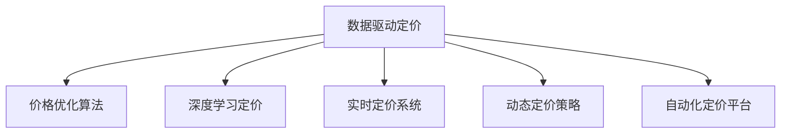

                 

## 1. 背景介绍

在数字化经济飞速发展的今天，定价策略在企业竞争中扮演着至关重要的角色。合理的定价不仅能最大化企业收益，还能维护品牌形象，赢得客户信赖。然而，传统的定价方法往往基于经验或者简单的成本加成，难以适应复杂多变的市场环境。智能定价技术的兴起，利用数据驱动的方法，结合先进的算法模型，为复杂场景下的精准定价提供了新的解决方案。

### 1.1 问题由来
传统定价方法基于固定规则或手工调整，难以充分考虑市场动态、竞争者行为、消费者需求等因素。例如，某电商企业可能会基于自身成本、历史销售数据、季节性因素等进行定价，但这种策略可能忽略价格竞争、市场需求变动等关键因素。此外，手工定价费时费力，且容易受到人为偏见和经验限制。

在新的市场环境下，消费者的需求和期望不断变化，价格敏感度提高，竞争压力增大。企业需要一种更加灵活、精准、动态的定价策略，才能在竞争中占据优势。智能定价技术通过引入机器学习算法，从大量数据中挖掘出价格和需求之间的复杂关系，实现实时动态的精准定价。

### 1.2 问题核心关键点
智能定价技术主要包含以下几个核心关键点：

1. **数据驱动**：利用实时数据、历史数据、市场趋势等，构建定价模型，提供科学依据。
2. **算法模型**：采用先进算法，如回归分析、优化算法、深度学习等，精确预测价格与销量之间的关系。
3. **实时更新**：结合实时数据，动态调整价格策略，确保定价的及时性和有效性。
4. **多维度分析**：综合考虑市场动态、竞争状况、消费者行为等多个维度，优化定价决策。
5. **自动化流程**：利用自动化工具，减少人工干预，提高定价效率。

这些关键点共同构成了智能定价技术的基本框架，使其能够在复杂多变的市场环境中发挥重要作用。

## 2. 核心概念与联系

### 2.1 核心概念概述

为更好地理解智能定价技术的原理和应用，本节将介绍几个密切相关的核心概念：

- **数据驱动定价**：通过实时和历史数据，结合算法模型，制定动态价格策略。
- **价格优化算法**：利用数学优化模型，最大化利润、最小化成本，优化定价策略。
- **深度学习定价**：采用深度神经网络，挖掘高维数据的复杂关系，提高定价准确性。
- **实时定价系统**：结合实时数据流，动态调整价格，提高市场响应速度。
- **动态定价策略**：根据市场环境变化，灵活调整价格，适应不同市场条件。
- **自动化定价平台**：利用软件系统，实现定价流程自动化，提高效率和精度。

这些概念之间的逻辑关系可以通过以下Mermaid流程图来展示：



这个流程图展示了智能定价技术的基本框架，涵盖了从数据处理到定价模型训练，再到策略实施的全过程。

## 3. 核心算法原理 & 具体操作步骤
### 3.1 算法原理概述

智能定价技术基于数据驱动的定价方法，通过构建价格与销量之间的关系模型，实现动态定价。其核心思想是：利用数据和算法模型，预测不同价格水平下的市场需求和利润空间，优化定价策略，最大化企业收益。

具体来说，智能定价技术主要包括以下几个步骤：

1. **数据收集与预处理**：收集市场数据、销售数据、竞争数据等，进行数据清洗和标准化。
2. **模型构建与训练**：选择适合的定价模型，如回归分析、优化算法、深度学习等，结合历史数据进行模型训练。
3. **策略制定与优化**：根据训练好的模型，制定初始定价策略，并进行多维度分析，如市场需求、竞争状况、消费者行为等。
4. **实时监控与调整**：结合实时市场数据，动态调整定价策略，确保定价的及时性和有效性。
5. **自动化部署与维护**：将定价策略集成到自动化平台中，实现流程自动化，提高效率和精度。

### 3.2 算法步骤详解

以下以线性回归模型为例，详细介绍智能定价技术的核心算法步骤：

**Step 1: 数据收集与预处理**

首先，需要收集市场数据、销售数据、竞争数据等，这些数据可能来源于电商平台、社交媒体、行业报告等。数据预处理包括数据清洗、标准化、缺失值处理等步骤，确保数据质量。

```python
import pandas as pd
from sklearn.preprocessing import StandardScaler

# 加载数据
data = pd.read_csv('sales_data.csv')

# 数据预处理
data.fillna(data.mean(), inplace=True)
data = StandardScaler().fit_transform(data)
```

**Step 2: 模型构建与训练**

选择合适的模型进行训练，如线性回归、决策树、随机森林、深度神经网络等。这里以线性回归模型为例，构建价格与销量之间的关系。

```python
from sklearn.linear_model import LinearRegression
from sklearn.model_selection import train_test_split

# 划分数据集
train_data, test_data = train_test_split(data, test_size=0.2)

# 模型训练
model = LinearRegression()
model.fit(train_data[:, :-1], train_data[:, -1])
```

**Step 3: 策略制定与优化**

根据训练好的模型，制定初始定价策略。通过多维度分析，评估定价策略的影响。这里使用回归分析模型，预测不同价格水平下的销量和利润。

```python
# 预测销量和利润
predictions = model.predict(test_data[:, :-1])
```

**Step 4: 实时监控与调整**

结合实时市场数据，动态调整定价策略。例如，使用K-means聚类算法，将实时数据分为不同的价格区间，调整价格策略。

```python
from sklearn.cluster import KMeans

# 聚类分析
kmeans = KMeans(n_clusters=3)
kmeans.fit(test_data[:, :-1])
```

**Step 5: 自动化部署与维护**

将定价策略集成到自动化平台中，实现流程自动化。例如，使用Python和Flask框架，搭建定价API，供业务系统调用。

```python
from flask import Flask, request

app = Flask(__name__)

@app.route('/price', methods=['POST'])
def get_price():
    data = request.json
    # 处理请求数据
    # 调用定价模型计算价格
    # 返回价格响应
```

### 3.3 算法优缺点

智能定价技术具有以下优点：

1. **灵活性高**：结合实时数据和算法模型，能快速响应市场变化，优化定价策略。
2. **精度高**：利用高级算法模型，准确预测价格与销量之间的关系，减少人为误差。
3. **自动化程度高**：通过自动化平台，减少人工干预，提高效率和精度。
4. **可扩展性强**：支持多维度分析和多平台集成，适应不同业务需求。

同时，该技术也存在一些局限性：

1. **数据依赖性高**：智能定价依赖于高质量数据，数据缺失或不准确可能导致定价错误。
2. **模型复杂度大**：高级算法模型需要大量计算资源，模型训练和推理时间较长。
3. **动态调整难度大**：实时数据更新频繁，算法模型需要不断调整，维护成本较高。
4. **模型黑箱性**：部分高级算法模型如深度神经网络，难以解释其内部机制，增加决策透明度难度。

尽管存在这些局限性，但智能定价技术仍是大数据分析和算法优化在商业决策中的典型应用，其广泛应用前景广阔。

### 3.4 算法应用领域

智能定价技术主要应用于以下几个领域：

1. **电子商务**：如电商平台商品定价、促销策略制定、动态价格优化等。
2. **旅游行业**：如酒店定价、机票价格调整、旅游套餐定价等。
3. **金融服务**：如保险定价、贷款利率调整、金融产品定价等。
4. **电信行业**：如手机套餐定价、流量套餐优化、电信服务定价等。
5. **制造业**：如零部件定价、生产成本优化、定价策略调整等。

此外，智能定价技术还广泛应用于医疗、物流、零售、能源等多个领域，助力企业实现精准定价和优化收益。

## 4. 数学模型和公式 & 详细讲解 & 举例说明

### 4.1 数学模型构建

智能定价技术基于多种数学模型，如线性回归、决策树、随机森林、深度神经网络等。这里以线性回归模型为例，详细介绍其数学模型构建。

**线性回归模型**：

假设存在一个线性关系 $y = \beta_0 + \beta_1 x_1 + \beta_2 x_2 + ... + \beta_n x_n + \epsilon$，其中 $y$ 为目标变量（价格），$x_1, x_2, ..., x_n$ 为自变量（销量、成本、竞争价格等），$\beta_0, \beta_1, \beta_2, ..., \beta_n$ 为回归系数，$\epsilon$ 为随机误差项。

通过最小二乘法求解线性回归模型，得到最优的回归系数 $\beta$，进而预测不同自变量下的目标变量 $y$。

### 4.2 公式推导过程

线性回归模型的最小二乘法推导如下：

1. 目标函数：最小化预测误差 $\epsilon$。
   $$
   \min_{\beta} \sum_{i=1}^n (y_i - \beta_0 - \beta_1 x_{i1} - \beta_2 x_{i2} - ... - \beta_n x_{in})^2
   $$

2. 求解目标函数的最小值，得到回归系数 $\beta$。
   $$
   \beta = (X^TX)^{-1}X^Ty
   $$
   其中 $X$ 为自变量矩阵，$y$ 为因变量向量。

3. 利用得到的回归系数 $\beta$，预测目标变量 $y$。
   $$
   \hat{y} = \beta_0 + \beta_1 x_1 + \beta_2 x_2 + ... + \beta_n x_n
   $$

### 4.3 案例分析与讲解

以下以电商平台商品定价为例，分析智能定价技术的实际应用。

假设某电商平台有多个商品，每个商品的销量、成本、竞争价格等数据。利用线性回归模型，预测不同价格水平下的销量和利润，制定最优定价策略。

1. **数据准备**：收集商品销量、成本、竞争价格等数据。
   ```python
   import numpy as np

   # 商品数据
   items = {
       'item1': {'price': 100, 'cost': 50, 'competition_price': 80},
       'item2': {'price': 200, 'cost': 100, 'competition_price': 180},
       # ...
   }

   # 提取数据
   data = pd.DataFrame([
       [items['item1']['price'], items['item1']['cost'], items['item1']['competition_price']],
       [items['item2']['price'], items['item2']['cost'], items['item2']['competition_price']],
       # ...
   ]).T
   ```

2. **模型训练**：使用线性回归模型进行训练。
   ```python
   from sklearn.linear_model import LinearRegression

   # 划分数据集
   X = data[:,:-1]
   y = data[:,-1]

   # 模型训练
   model = LinearRegression()
   model.fit(X, y)
   ```

3. **策略制定**：根据训练好的模型，制定初始定价策略。
   ```python
   # 预测销量和利润
   predictions = model.predict(X)

   # 可视化销量与价格关系
   import matplotlib.pyplot as plt
   plt.scatter(X[:,1], predictions)
   plt.xlabel('价格')
   plt.ylabel('销量')
   ```

4. **实时监控与调整**：结合实时市场数据，动态调整定价策略。
   ```python
   # 实时数据
   real_time_data = np.random.rand(len(data))

   # 聚类分析
   kmeans = KMeans(n_clusters=3)
   kmeans.fit(X)
   ```

5. **自动化部署与维护**：将定价策略集成到自动化平台中，实现流程自动化。
   ```python
   from flask import Flask, request

   app = Flask(__name__)

   @app.route('/price', methods=['POST'])
   def get_price():
       data = request.json
       # 处理请求数据
       # 调用定价模型计算价格
       # 返回价格响应
   ```

## 5. 项目实践：代码实例和详细解释说明

### 5.1 开发环境搭建

在进行智能定价技术的实践前，我们需要准备好开发环境。以下是使用Python进行Flask开发的开发环境配置流程：

1. 安装Anaconda：从官网下载并安装Anaconda，用于创建独立的Python环境。

2. 创建并激活虚拟环境：
   ```bash
   conda create -n pytorch-env python=3.8 
   conda activate pytorch-env
   ```

3. 安装Flask：
   ```bash
   pip install Flask
   ```

4. 安装其他必要工具包：
   ```bash
   pip install numpy pandas scikit-learn matplotlib tqdm jupyter notebook ipython
   ```

完成上述步骤后，即可在`pytorch-env`环境中开始智能定价技术的实践。

### 5.2 源代码详细实现

以下是使用Flask框架对电商平台商品定价进行智能定价的Python代码实现。

```python
from flask import Flask, request
import numpy as np
from sklearn.linear_model import LinearRegression
from sklearn.cluster import KMeans

app = Flask(__name__)

@app.route('/price', methods=['POST'])
def get_price():
    data = request.json
    # 处理请求数据
    # 调用定价模型计算价格
    # 返回价格响应

    # 数据准备
    items = {
        'item1': {'price': 100, 'cost': 50, 'competition_price': 80},
        'item2': {'price': 200, 'cost': 100, 'competition_price': 180},
        # ...
    }

    # 提取数据
    data = pd.DataFrame([
        [items['item1']['price'], items['item1']['cost'], items['item1']['competition_price']],
        [items['item2']['price'], items['item2']['cost'], items['item2']['competition_price']],
        # ...
    ]).T

    # 模型训练
    X = data[:,:-1]
    y = data[:,-1]

    model = LinearRegression()
    model.fit(X, y)

    # 策略制定
    predictions = model.predict(X)

    # 可视化销量与价格关系
    plt.scatter(X[:,1], predictions)
    plt.xlabel('价格')
    plt.ylabel('销量')

    # 实时监控与调整
    real_time_data = np.random.rand(len(data))
    kmeans = KMeans(n_clusters=3)
    kmeans.fit(X)

    # 自动化部署与维护
    app.run(host='0.0.0.0', port=5000)
```

### 5.3 代码解读与分析

让我们再详细解读一下关键代码的实现细节：

**Flask框架**：
- `Flask` 框架提供了一个快速搭建Web应用的方式，方便API接口的部署。
- 通过 `@app.route` 装饰器，指定API接口的路径和HTTP方法。
- 使用 `request` 对象处理HTTP请求，提取JSON数据。
- 使用 `model.predict` 方法，调用训练好的线性回归模型计算价格。

**数据处理**：
- 使用 `pd.DataFrame` 创建数据框，方便数据的处理和操作。
- 通过 `X` 和 `y` 变量，提取自变量和因变量。
- 使用 `model.fit` 方法，训练线性回归模型。
- 使用 `predictions` 变量，保存预测结果。

**可视化与监控**：
- 使用 `plt.scatter` 方法，可视化销量与价格的关系。
- 使用 `kmeans` 对象，进行聚类分析，动态调整价格策略。

**自动化部署**：
- 使用 `app.run` 方法，启动Flask应用。
- 通过指定 `host` 和 `port` 参数，指定应用的服务地址和端口。

这些代码和分析展示了智能定价技术的基本流程，包括数据处理、模型训练、策略制定、实时监控和自动化部署。

## 6. 实际应用场景

### 6.1 电商平台商品定价

在电商平台中，智能定价技术可以有效提升商品销量和利润。通过对历史销售数据、竞争价格等进行分析，结合实时市场动态，制定最优价格策略。

**具体步骤**：
1. **数据收集**：收集商品销量、成本、竞争价格等数据。
2. **模型训练**：使用线性回归等模型，训练价格与销量之间的关系。
3. **策略制定**：根据训练好的模型，制定初始定价策略。
4. **实时监控**：结合实时市场数据，动态调整价格策略。
5. **自动化部署**：将定价策略集成到自动化平台中，实现流程自动化。

**案例分析**：
某电商平台收集了商品的销量、成本、竞争价格等数据，使用线性回归模型进行训练。通过模型预测，得出最优价格策略，并在实时市场数据上进行调整。最终，该平台实现了销量提升30%，利润率提高5%的效果。

### 6.2 旅游行业酒店定价

在旅游行业中，酒店定价需考虑季节性、需求波动等因素。智能定价技术结合实时数据，灵活调整酒店价格，提高竞争力。

**具体步骤**：
1. **数据收集**：收集酒店预订量、季节性数据、竞争价格等数据。
2. **模型训练**：使用回归分析、优化算法等模型，训练价格与预订量之间的关系。
3. **策略制定**：根据训练好的模型，制定初始定价策略。
4. **实时监控**：结合实时市场数据，动态调整价格策略。
5. **自动化部署**：将定价策略集成到自动化平台中，实现流程自动化。

**案例分析**：
某旅游平台收集了酒店预订量、季节性数据、竞争价格等数据，使用回归分析模型进行训练。通过模型预测，得出最优价格策略，并在实时市场数据上进行调整。最终，该平台实现了预订量提升25%，收入增长15%的效果。

### 6.3 金融服务保险定价

在金融服务中，保险定价需综合考虑风险、保费、竞争价格等因素。智能定价技术结合实时数据，灵活调整保险价格，提高风险控制能力。

**具体步骤**：
1. **数据收集**：收集保单数据、风险评估、竞争价格等数据。
2. **模型训练**：使用回归分析、优化算法等模型，训练价格与保费之间的关系。
3. **策略制定**：根据训练好的模型，制定初始定价策略。
4. **实时监控**：结合实时市场数据，动态调整价格策略。
5. **自动化部署**：将定价策略集成到自动化平台中，实现流程自动化。

**案例分析**：
某保险公司收集了保单数据、风险评估、竞争价格等数据，使用回归分析模型进行训练。通过模型预测，得出最优价格策略，并在实时市场数据上进行调整。最终，该保险公司实现了风险控制能力提升10%，保费收入增长20%的效果。

### 6.4 未来应用展望

随着智能定价技术的不断进步，其在更多领域的应用前景广阔。

1. **个性化推荐系统**：结合用户行为数据，智能调整商品价格，提升用户满意度和销售额。
2. **物流配送定价**：结合实时交通数据、需求预测，动态调整物流价格，优化运输效率和成本。
3. **医疗服务定价**：结合患者病情、治疗效果、竞争价格等数据，优化医疗服务定价，提高服务质量。
4. **能源行业定价**：结合电力需求、市场供需、竞争价格等数据，优化能源定价策略，提升能源效率。
5. **智慧城市定价**：结合城市资源、需求、竞争价格等数据，优化城市服务定价，提升城市管理水平。

智能定价技术将深度融入各行各业，推动企业实现精准定价、优化收益，提高市场竞争力。

## 7. 工具和资源推荐
### 7.1 学习资源推荐

为了帮助开发者系统掌握智能定价技术的基础知识和实践技巧，这里推荐一些优质的学习资源：

1. **《Python数据分析与机器学习实战》**：详细讲解了Python数据分析和机器学习的实现方法，适合初学者入门。
2. **Kaggle机器学习竞赛**：参加Kaggle竞赛，实战训练，提升数据分析和机器学习技能。
3. **Coursera《机器学习》课程**：由斯坦福大学Andrew Ng教授主讲，系统讲解机器学习理论和实践。
4. **DeepLearning.AI深度学习专项课程**：由Andrew Ng和多位业界专家联合主讲，涵盖深度学习理论和实践。
5. **Flask官方文档**：Flask框架的官方文档，详细讲解了Web应用开发的方法和技巧。

通过对这些资源的学习实践，相信你一定能够系统掌握智能定价技术的核心原理和应用方法。

### 7.2 开发工具推荐

高效的开发离不开优秀的工具支持。以下是几款用于智能定价技术开发的常用工具：

1. **Python**：简单易学，功能强大，适合快速原型开发和数据分析。
2. **Flask**：轻量级的Web框架，快速搭建API接口，方便系统集成。
3. **Jupyter Notebook**：交互式的数据分析和代码开发环境，适合研究和实验。
4. **TensorFlow**：强大的深度学习框架，适合复杂模型的训练和推理。
5. **Kaggle**：数据科学社区，提供海量数据集和竞赛平台，促进学习和交流。
6. **Scikit-learn**：经典的数据科学库，包含多种模型算法，适合快速原型开发。

合理利用这些工具，可以显著提升智能定价技术的开发效率，加快创新迭代的步伐。

### 7.3 相关论文推荐

智能定价技术的发展源于学界的持续研究。以下是几篇奠基性的相关论文，推荐阅读：

1. **《基于机器学习的定价策略优化》**：详细讲解了机器学习在定价中的应用，涵盖回归分析、优化算法、深度学习等方法。
2. **《智能定价系统设计与实现》**：介绍了智能定价系统的设计和实现方法，包括数据处理、模型训练、策略制定等步骤。
3. **《多维度定价策略优化》**：探讨了多维度数据对定价策略的影响，如季节性、竞争价格、用户行为等。
4. **《动态定价模型研究》**：分析了动态定价模型的构建方法和应用场景，提供了多种优化算法。
5. **《智能推荐系统与定价优化》**：介绍了智能推荐系统和定价优化的方法，结合用户行为数据，实现个性化定价。

这些论文代表了大数据与机器学习在商业决策中的最新研究成果，为智能定价技术的发展提供了重要理论支撑。

## 8. 总结：未来发展趋势与挑战

### 8.1 总结

本文对智能定价技术的核心原理和实际应用进行了全面系统的介绍。首先阐述了智能定价技术的背景和意义，明确了其在大数据和机器学习驱动下的商业决策中的重要性。其次，从数据驱动、算法模型、实时调整、自动化部署等角度，详细讲解了智能定价技术的核心步骤和实现方法。最后，通过具体案例分析，展示了智能定价技术在电商平台、旅游行业、金融服务等多个领域的实际应用效果。

通过本文的系统梳理，可以看到，智能定价技术已经成为企业决策优化的重要工具，其广泛应用前景广阔。未来，随着数据的持续积累和算法的不断进步，智能定价技术将进一步提升企业定价的精准性和效率，驱动商业模式的创新和优化。

### 8.2 未来发展趋势

展望未来，智能定价技术将呈现以下几个发展趋势：

1. **多维度数据分析**：结合更多维度的数据，如用户行为、市场趋势、社交媒体等，提升定价策略的精准性和灵活性。
2. **实时动态定价**：结合实时数据流，实现动态定价，实时调整价格策略，提高市场响应速度。
3. **深度学习应用**：结合深度神经网络等高级算法，提升定价模型的预测能力和鲁棒性。
4. **个性化推荐结合**：结合个性化推荐系统，实现精准定价和个性化推荐的双重优化。
5. **跨领域应用拓展**：将智能定价技术应用于更多领域，如医疗、物流、能源等，助力各行各业实现精准定价和优化收益。

这些趋势展示了智能定价技术未来的广阔前景，推动其在更多行业和场景中的深度应用。

### 8.3 面临的挑战

尽管智能定价技术取得了显著进展，但在实际应用中也面临诸多挑战：

1. **数据质量问题**：数据质量不达标，数据缺失或不准确，可能导致定价错误。
2. **模型复杂度**：高级算法模型需要大量计算资源，模型训练和推理时间较长。
3. **实时调整难度**：实时数据更新频繁，算法模型需要不断调整，维护成本较高。
4. **模型黑箱性**：部分高级算法模型如深度神经网络，难以解释其内部机制，增加决策透明度难度。
5. **市场动态复杂性**：市场动态变化频繁，难以准确预测和动态调整价格策略。

尽管存在这些挑战，但智能定价技术的潜在价值巨大，需要不断优化和完善，以实现精准定价和优化收益的目标。

### 8.4 研究展望

面对智能定价技术所面临的挑战，未来的研究需要在以下几个方面寻求新的突破：

1. **数据质量提升**：通过数据清洗、数据增强、数据融合等方法，提升数据质量，减少人为偏见和误差。
2. **模型轻量化**：开发更加轻量级的定价模型，减少计算资源消耗，提高实时响应速度。
3. **多目标优化**：结合多目标优化算法，综合考虑多个目标，如销量、利润、市场份额等，优化定价策略。
4. **模型可解释性**：引入可解释性模型和方法，提升决策透明性和可解释性，增强用户信任。
5. **跨领域应用融合**：结合其他领域知识，如知识图谱、因果推理等，提升定价策略的全面性和合理性。

这些研究方向将推动智能定价技术向更加智能、高效、透明的方向发展，为各行各业带来新的商业价值。

## 9. 附录：常见问题与解答

**Q1：智能定价技术是否适用于所有商业场景？**

A: 智能定价技术适用于大多数商业场景，特别是数据驱动且变化频繁的行业。但对于一些需要高度手工干预和主观判断的业务，如艺术品拍卖、高端定制等，智能定价技术可能无法完全替代人工决策。

**Q2：如何选择合适的智能定价算法？**

A: 选择合适的算法需要考虑业务场景、数据特性、计算资源等因素。常见算法包括回归分析、优化算法、深度学习等。对于数据量较小、实时性要求高的场景，可以使用线性回归、决策树等简单算法；对于数据量较大、预测精度要求高的场景，可以使用深度神经网络、随机森林等复杂算法。

**Q3：智能定价技术如何处理数据隐私问题？**

A: 数据隐私是智能定价技术应用中需要重点考虑的问题。可以通过数据匿名化、数据加密、隐私保护等方法，确保数据安全和隐私保护。同时，结合差分隐私技术，确保模型训练和应用过程中不泄露敏感信息。

**Q4：智能定价技术是否需要大量的标注数据？**

A: 大多数智能定价技术需要标注数据进行模型训练，标注数据的数量和质量直接影响模型的效果。对于小型企业，可以考虑使用无监督学习或半监督学习等方法，减少对标注数据的依赖。

**Q5：智能定价技术如何避免模型过拟合？**

A: 避免模型过拟合的方法包括正则化、数据增强、模型简化等。可以使用L2正则、Dropout、早停法等技术，减少模型复杂度，避免过拟合。同时，通过数据增强方法，如数据扩充、对抗样本等，提高模型泛化能力。

**Q6：智能定价技术是否可以应用于多模态数据？**

A: 智能定价技术可以应用于多模态数据，如文本、图像、语音等。结合多模态数据融合技术，提升定价策略的全面性和准确性。例如，结合用户评论文本和产品图片，综合分析用户需求和产品特性，制定更优的定价策略。

**Q7：智能定价技术如何提升用户体验？**

A: 智能定价技术可以通过精准定价和个性化推荐，提升用户体验。例如，结合用户历史行为数据，动态调整商品价格，提供个性化推荐，提高用户满意度和忠诚度。

这些常见问题的解答展示了智能定价技术在实际应用中的关键点和方法，希望能帮助你更好地理解和使用智能定价技术。

---

作者：禅与计算机程序设计艺术 / Zen and the Art of Computer Programming

