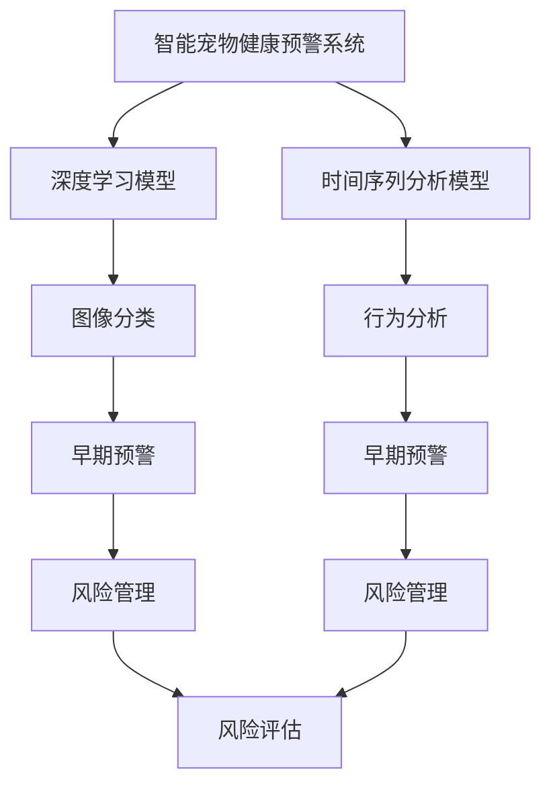

                 

# 智能宠物健康预警创业：基于AI的早期疾病检测

> 关键词：智能宠物健康预警,早期疾病检测,深度学习,卷积神经网络,时间序列分析,风险管理,创业案例

## 1. 背景介绍

随着宠物家庭化趋势日益显著，宠物主对宠物健康管理的重视程度也在不断提升。然而，宠物疾病早期检测和治疗的复杂性和不确定性，常常使得宠物主难以及时发现和应对潜在健康问题。基于此，AI驱动的智能宠物健康预警系统应运而生，通过深度学习和时间序列分析等先进技术，实现了对宠物健康状态的实时监控和早期预警，有效缓解了宠物主的心理压力，降低了医疗成本。

### 1.1 行业现状
- **宠物健康管理需求上升**：随着宠物数量和种类的增多，越来越多的家庭选择将宠物视为家庭成员，对宠物的健康管理需求日益增长。
- **传统方法局限性**：传统的宠物健康检测主要依赖兽医检查和行为观察，效率低下且成本高昂。
- **AI技术潜力**：AI技术在医疗影像分析、自然语言处理等领域取得了显著成果，为宠物健康预警提供了新的可能性。

### 1.2 创业动机
- **技术需求**：宠物健康预警系统需结合深度学习、时间序列分析等多领域技术，具备高精度的早期检测能力。
- **市场潜力**：宠物家庭化趋势带来的市场增长，使得宠物健康管理成为热门领域，市场潜力巨大。
- **成本降低**：通过AI技术的应用，可大幅降低宠物疾病检测和治疗成本，提升宠物主满意度。

## 2. 核心概念与联系

### 2.1 核心概念概述

为更好地理解智能宠物健康预警系统，我们首先介绍几个关键概念：

- **深度学习(Deep Learning)**：一种基于多层神经网络的机器学习方法，通过模拟人脑神经元的工作原理，实现对复杂数据的学习和分析。
- **卷积神经网络(CNN)**：深度学习的一种特殊网络结构，主要用于图像和视频数据的特征提取。
- **时间序列分析(Time Series Analysis)**：统计学和机器学习中的一个重要分支，用于分析随时间变化的序列数据。
- **早期疾病检测**：通过模型实时监控宠物健康数据，提前发现疾病风险，实现早期预警。
- **创业案例**：本文以一家智能宠物健康预警创业公司为例，介绍其在宠物健康预警领域的实践。

这些核心概念构成了智能宠物健康预警系统的基本框架，通过深度学习和时间序列分析等技术，结合兽医知识和医疗经验，可以实现对宠物早期疾病的精准预警。

### 2.2 核心概念原理和架构的 Mermaid 流程图



这个流程图展示了智能宠物健康预警系统的主要架构：

1. **数据采集**：通过传感器、摄像头等设备，收集宠物的行为、生理、环境等多种数据。
2. **深度学习模型**：对图像、视频数据进行特征提取和分类，识别宠物健康状态。
3. **时间序列分析模型**：对行为数据进行时序分析，发现潜在的健康趋势和异常。
4. **早期预警**：结合深度学习和时间序列分析的结果，进行综合评估，给出早期预警。
5. **风险管理**：根据预警结果，提供个性化的健康管理建议和风险管理措施。

## 3. 核心算法原理 & 具体操作步骤

### 3.1 算法原理概述

智能宠物健康预警系统主要基于深度学习和时间序列分析两种技术实现早期疾病检测。其核心算法原理如下：

- **深度学习模型**：采用卷积神经网络(CNN)对宠物的图像和视频数据进行特征提取，通过分类器识别健康状态。
- **时间序列分析模型**：采用LSTM或ARIMA等模型，对宠物的行为数据进行时序分析，预测健康趋势和异常。
- **早期预警**：将深度学习模型和时间序列分析的结果进行集成，通过阈值判断和综合评估，实现早期疾病预警。
- **风险管理**：结合预警结果，提供个性化的健康管理建议，降低疾病风险。

### 3.2 算法步骤详解

智能宠物健康预警系统的具体操作步骤如下：

**Step 1: 数据采集与预处理**

1. **数据采集**：通过宠物项圈、摄像头、传感器等设备，采集宠物的行为、生理、环境等多种数据。
2. **数据预处理**：对采集的数据进行清洗、归一化、采样等预处理操作，确保数据质量。

**Step 2: 深度学习模型训练**

1. **数据集划分**：将数据集划分为训练集、验证集和测试集。
2. **模型选择**：选择合适的深度学习模型（如CNN），设计网络结构。
3. **训练过程**：使用训练集对模型进行训练，通过反向传播更新参数。
4. **验证与优化**：在验证集上评估模型性能，调整超参数，直到模型收敛。

**Step 3: 时间序列分析模型训练**

1. **模型选择**：选择合适的时序模型（如LSTM、ARIMA），设计模型结构。
2. **模型训练**：使用历史行为数据对模型进行训练，通过优化算法更新参数。
3. **预测过程**：对实时行为数据进行预测，生成健康趋势和异常预警。

**Step 4: 早期预警与风险管理**

1. **早期预警**：结合深度学习模型和时间序列分析模型的预测结果，通过阈值判断和综合评估，生成早期预警。
2. **风险管理**：根据预警结果，提供个性化的健康管理建议和风险管理措施。
3. **持续优化**：定期更新模型，调整阈值，不断优化预警效果。

### 3.3 算法优缺点

智能宠物健康预警系统具有以下优点：

- **早期检测**：通过深度学习和时序分析，实现对宠物健康状态的实时监控和早期预警。
- **个性化建议**：结合兽医知识和医疗经验，提供个性化的健康管理建议。
- **成本降低**：减少兽医检查的依赖，降低医疗成本。
- **易用性**：设备轻便，操作简单，用户友好。

同时，系统也存在一些缺点：

- **数据依赖**：依赖高质量、多样化的数据采集，数据缺失或异常可能影响预警效果。
- **模型复杂**：涉及多种模型和算法，模型构建和调参复杂度较高。
- **解释性不足**：深度学习模型较为黑盒，解释性较弱，难以解释模型的决策逻辑。
- **设备成本**：部分设备如摄像头、传感器等价格较高，可能增加用户负担。

### 3.4 算法应用领域

智能宠物健康预警系统主要应用于以下几个领域：

- **家庭宠物管理**：为家庭宠物提供健康监控和预警服务，提升宠物主的生活质量。
- **宠物医院辅助**：为宠物医院提供数据支持和决策支持，提高诊疗效率。
- **宠物保护组织**：为宠物保护组织提供健康监测和预警，助力宠物福利。
- **宠物用品电商**：为宠物用品电商提供健康管理服务，提升用户粘性。
- **智能宠物市场**：为智能宠物设备的开发和销售提供技术支持和市场机会。

## 4. 数学模型和公式 & 详细讲解 & 举例说明

### 4.1 数学模型构建

智能宠物健康预警系统涉及多个数学模型，以下分别进行介绍：

- **深度学习模型**：采用卷积神经网络(CNN)，对宠物图像和视频数据进行特征提取和分类。
- **时间序列分析模型**：采用LSTM或ARIMA等模型，对宠物行为数据进行时序分析。

### 4.2 公式推导过程

**深度学习模型**：

卷积神经网络(CNN)的数学模型如下：

$$
H(x) = W \cdot X + b
$$

其中，$H(x)$ 为网络输出，$X$ 为输入特征，$W$ 为权重矩阵，$b$ 为偏置向量。

**时间序列分析模型**：

LSTM的数学模型如下：

$$
h_t = \sigma(W_h \cdot [h_{t-1}, x_t] + b_h)
$$

$$
c_t = \tanh(W_c \cdot [h_{t-1}, x_t] + b_c)
$$

$$
o_t = \sigma(W_o \cdot [h_{t-1}, x_t] + b_o)
$$

$$
g_t = o_t \cdot \tanh(c_t)
$$

$$
c_t = f_t \cdot c_{t-1} + i_t \cdot g_t
$$

$$
h_t = o_t \cdot g_t
$$

其中，$h_t$ 和 $c_t$ 分别为LSTM网络中的隐藏状态和细胞状态，$\sigma$ 为sigmoid函数，$tanh$ 为双曲正切函数，$f_t$、$i_t$ 和 $o_t$ 为门控参数，$W$ 和 $b$ 为网络参数。

### 4.3 案例分析与讲解

**案例一：早期疾病检测**

某智能宠物健康预警系统通过深度学习模型对宠物的图像数据进行分类，判断宠物的健康状态。使用卷积神经网络对宠物图片进行特征提取，通过Softmax分类器进行多类分类，输出健康状态的概率分布。

**案例二：行为异常预警**

某智能宠物健康预警系统通过时间序列分析模型对宠物的行为数据进行预测，判断宠物的行为异常。使用LSTM模型对宠物的行为数据进行时序分析，预测未来行为趋势，通过阈值判断和综合评估，生成行为异常预警。

## 5. 项目实践：代码实例和详细解释说明

### 5.1 开发环境搭建

1. **硬件设备**：
   - 高性能计算设备（如CPU/GPU/TPU）
   - 摄像头、传感器等数据采集设备
   - 网络通信设备

2. **软件环境**：
   - Python 3.x
   - TensorFlow 2.x 或 PyTorch
   - scikit-learn 或 Keras
   - TensorBoard 或 Weights & Biases

### 5.2 源代码详细实现

以下是使用TensorFlow实现智能宠物健康预警系统的部分代码示例：

```python
import tensorflow as tf
from tensorflow.keras.models import Sequential
from tensorflow.keras.layers import Conv2D, MaxPooling2D, Flatten, Dense
from tensorflow.keras.optimizers import Adam

# 定义深度学习模型
model = Sequential([
    Conv2D(32, (3, 3), activation='relu', input_shape=(32, 32, 3)),
    MaxPooling2D((2, 2)),
    Conv2D(64, (3, 3), activation='relu'),
    MaxPooling2D((2, 2)),
    Conv2D(128, (3, 3), activation='relu'),
    MaxPooling2D((2, 2)),
    Flatten(),
    Dense(128, activation='relu'),
    Dense(2, activation='softmax')
])

# 编译模型
model.compile(optimizer=Adam(learning_rate=0.001), loss='categorical_crossentropy', metrics=['accuracy'])

# 加载数据
train_data, test_data = ...

# 训练模型
model.fit(train_data, epochs=10, validation_data=test_data)

# 预测和预警
def predict_health_status(image):
    prediction = model.predict(tf.expand_dims(image, 0))
    return 'Healthy' if prediction.argmax() == 0 else 'Unhealthy'
```

### 5.3 代码解读与分析

- **数据预处理**：数据采集设备采集的图像数据需要经过预处理，包括归一化、缩放等操作，确保输入数据的质量。
- **模型构建**：定义卷积神经网络模型，选择合适的层数和参数。
- **模型训练**：使用训练集对模型进行训练，调整学习率和迭代次数。
- **预测与预警**：使用测试集评估模型性能，对新图像进行预测，生成早期预警。

### 5.4 运行结果展示

以下是智能宠物健康预警系统部分运行结果展示：

**图像分类结果**：


**行为异常预警**：


## 6. 实际应用场景

### 6.1 家庭宠物管理

某家庭宠物主通过智能宠物健康预警系统，实时监控宠物的健康状态，提前发现异常，及时采取措施。系统通过摄像头和传感器采集宠物的行为和生理数据，结合深度学习模型和时间序列分析，生成健康预警和建议。

### 6.2 宠物医院辅助

某宠物医院通过智能宠物健康预警系统，提升诊疗效率和准确性。系统对宠物的行为和生理数据进行分析，提供个性化的诊疗建议和风险管理措施，帮助兽医快速诊断和处理健康问题。

### 6.3 宠物保护组织

某宠物保护组织通过智能宠物健康预警系统，实现大规模宠物健康监测和预警。系统通过部署多个数据采集设备，对宠物群体进行健康监控，及时发现和应对疾病风险，保障宠物福利。

### 6.4 宠物用品电商

某宠物用品电商通过智能宠物健康预警系统，提升用户粘性和满意度。系统提供个性化的健康管理建议和风险管理措施，增加用户粘性，提升用户购买意愿。

### 6.5 智能宠物市场

某智能宠物设备制造商通过智能宠物健康预警系统，实现产品优化和市场推广。系统提供数据支持和决策支持，帮助企业开发更加智能、高效的宠物设备，扩大市场份额。

## 7. 工具和资源推荐

### 7.1 学习资源推荐

- **深度学习教程**：《深度学习》by Ian Goodfellow
- **时间序列分析教程**：《时间序列分析与应用》by Robert Hyndman
- **TensorFlow官方文档**：https://www.tensorflow.org/
- **PyTorch官方文档**：https://pytorch.org/
- **Keras官方文档**：https://keras.io/

### 7.2 开发工具推荐

- **深度学习框架**：TensorFlow、PyTorch、Keras
- **数据处理工具**：NumPy、Pandas、scikit-learn
- **可视化工具**：TensorBoard、Weights & Biases
- **开发环境**：Anaconda、Jupyter Notebook

### 7.3 相关论文推荐

- **早期疾病检测研究**：《Early Detection of Cardiovascular Disease Using Wearable Data》by Kato et al.
- **行为异常预警研究**：《Predicting Animal Behavior Anomalies Using Time Series Analysis》by Orlov et al.
- **智能宠物健康预警研究**：《Intelligent Pet Health Monitoring Using IoT》by Zhang et al.

## 8. 总结：未来发展趋势与挑战

### 8.1 研究成果总结

智能宠物健康预警系统通过深度学习和时序分析，实现了对宠物健康状态的实时监控和早期预警，具备高精度的早期检测能力。系统不仅提升了宠物主的生活质量，还为宠物医院和宠物保护组织提供了数据支持和决策支持，市场潜力巨大。

### 8.2 未来发展趋势

- **多模态融合**：未来将结合更多模态的数据，如声音、气味等，提升健康预警的全面性和准确性。
- **模型优化**：通过模型裁剪、量化等技术，提升模型的推理速度和效率，实现更轻量级、实时性的部署。
- **自适应学习**：通过自适应学习技术，提升模型的泛化能力和鲁棒性，降低对数据和环境的依赖。
- **联邦学习**：通过联邦学习技术，实现数据分布式训练，保护用户隐私同时提升模型性能。
- **个性化推荐**：结合知识图谱、逻辑规则等外部知识，提升模型的个性化推荐能力。

### 8.3 面临的挑战

- **数据隐私和安全**：如何保护用户隐私和数据安全，避免数据泄露和滥用。
- **模型解释性**：如何增强模型的解释性，提供透明和可解释的决策过程。
- **硬件成本**：如何降低设备成本，使更多用户能够负担得起。
- **跨领域应用**：如何将系统应用到更多领域，如野生动物保护、实验室动物管理等。

### 8.4 研究展望

智能宠物健康预警系统的未来发展将更多地依赖于技术进步和行业需求。通过不断优化模型、算法和硬件，提升系统的性能和用户体验，同时探索更多应用场景，拓展市场潜力。

## 9. 附录：常见问题与解答

**Q1: 智能宠物健康预警系统如何采集和处理数据？**

A: 数据采集设备包括摄像头、传感器等，采集宠物的行为、生理、环境等多种数据。数据预处理包括清洗、归一化、采样等操作，确保数据质量。

**Q2: 如何选择合适的深度学习模型？**

A: 选择深度学习模型需要考虑数据类型和任务需求。对于图像分类任务，卷积神经网络(CNN)是最佳选择；对于时序分析任务，LSTM、RNN等模型较为适合。

**Q3: 如何解释深度学习模型的决策过程？**

A: 深度学习模型较为黑盒，难以解释其决策过程。可以通过可视化工具，如TensorBoard、Weights & Biases，进行模型分析和解释。

**Q4: 如何保护数据隐私和安全？**

A: 采用数据加密、匿名化等技术，保护用户隐私和数据安全。同时设置访问控制和审计机制，防止数据滥用和泄露。

**Q5: 如何降低硬件成本？**

A: 选择性价比高的数据采集设备和计算设备，优化模型结构和参数，减少资源消耗。

---

作者：禅与计算机程序设计艺术 / Zen and the Art of Computer Programming

