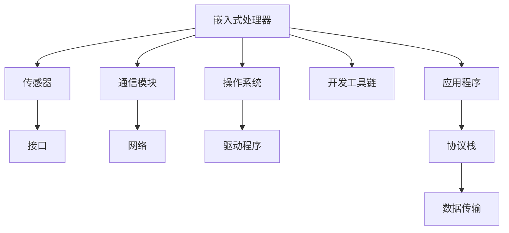

                 

# 智能设备开发：嵌入式系统设计与实现

> 关键词：嵌入式系统,智能设备,设计,实现,硬件,软件,开发,系统架构,编程,优化

## 1. 背景介绍

### 1.1 问题由来
随着物联网(IoT)技术的发展，智能设备在消费电子、医疗健康、智能家居等领域得到了广泛的应用。智能设备，如智能手机、智能手表、健康监测设备、智能音箱等，通过集成传感器、处理器、通信模块等组件，使得设备能够感知环境、理解指令，并做出智能响应，从而极大地提升了用户体验和设备功能。

然而，智能设备的设计和实现过程非常复杂，涉及硬件、软件、系统架构等多个方面。如何构建高效、安全、可靠的智能设备，成为开发人员面临的重要挑战。本文将系统介绍嵌入式系统设计与实现的核心概念与技术，以期为智能设备开发者提供全面的技术指引。

## 2. 核心概念与联系

### 2.1 核心概念概述

嵌入式系统通常指嵌入在其他设备内部的计算机系统，通过特定的硬件和软件实现特定的功能。嵌入式系统的核心概念包括：

- **嵌入式处理器**：嵌入式系统的计算核心，具备低功耗、高性能、可扩展等特点，常见类型包括ARM Cortex-A系列、RISC-V等。
- **传感器与接口**：嵌入式系统常用的传感器包括温度、湿度、压力、加速度等，通过接口与处理器通信。
- **通信模块**：嵌入式系统常用的通信模块包括Wi-Fi、蓝牙、Zigbee等，支持设备间通信和数据传输。
- **操作系统与驱动程序**：嵌入式系统的操作系统通常为实时操作系统(RTOS)，如FreeRTOS、uC/OS等，并需要对应的硬件驱动程序支持。
- **开发工具链**：嵌入式系统开发常用的开发工具链包括交叉编译器、调试器、模拟软件等。
- **应用程序与协议栈**：嵌入式系统的应用程序通常运行在操作系统之上，协议栈则负责处理网络通信的底层细节。

这些核心概念通过连接、组合，构成了嵌入式系统的设计实现框架。本文将重点介绍嵌入式系统的核心概念和技术原理。

### 2.2 核心概念原理和架构的 Mermaid 流程图



以上Mermaid流程图展示了嵌入式系统的基本架构和工作流程，即通过传感器采集数据，通过接口和通信模块进行传输，运行在操作系统之上的应用程序处理数据，并发送至网络协议栈进行通信。

## 3. 核心算法原理 & 具体操作步骤

### 3.1 算法原理概述

嵌入式系统的设计和实现过程可以分为硬件设计和软件设计两个阶段。硬件设计主要涉及芯片选型、电路设计、PCB布局等；软件设计则包括系统架构设计、驱动程序开发、应用程序实现等。本文重点介绍嵌入式系统的软件设计过程。

### 3.2 算法步骤详解

#### 3.2.1 硬件抽象层设计

硬件抽象层(HW-ABL)是嵌入式系统软件设计的基础，用于将硬件特性抽象为软件接口。常用的硬件抽象层包括Emscripten、LLVM等，可以将C/C++代码编译为二进制文件，直接运行在嵌入式系统上。

#### 3.2.2 驱动程序开发

驱动程序是嵌入式系统的关键组件，负责与硬件设备交互，实现数据的读取和写入。驱动程序一般由操作系统调用，需要满足实时性、稳定性、兼容性等要求。常用的驱动程序开发工具包括LibUSB、Kernel drivers等。

#### 3.2.3 系统架构设计

嵌入式系统的系统架构设计包括硬件平台、内核、应用程序等多个层次，需要考虑系统的安全性、可靠性、扩展性等需求。常见的系统架构包括单片机系统、嵌入式Linux系统、RTOS系统等。

#### 3.2.4 应用程序实现

应用程序是嵌入式系统的最终用户接口，负责处理用户输入、显示数据、执行逻辑等。应用程序通常运行在操作系统之上，需要调用底层驱动程序、协议栈等组件。

### 3.3 算法优缺点

#### 3.3.1 优点

- **硬件抽象层设计**：通过硬件抽象层，可以简化硬件特性对软件开发的限制，提高开发效率。
- **驱动程序开发**：驱动程序提供硬件与软件之间的接口，使得应用程序能够透明地访问硬件资源。
- **系统架构设计**：系统架构设计提供清晰的层次结构和组件划分，便于系统的扩展和维护。
- **应用程序实现**：应用程序直接面向用户，负责处理复杂逻辑和用户交互，能够灵活适应用户需求。

#### 3.3.2 缺点

- **开发周期长**：嵌入式系统的开发周期通常较长，需要经历硬件设计、驱动程序开发、系统架构设计等多个环节。
- **资源有限**：嵌入式系统的硬件资源和存储空间有限，需要谨慎设计和管理。
- **复杂性高**：嵌入式系统的设计涉及硬件、软件、通信等多个方面，需要综合考虑多方面的因素。

### 3.4 算法应用领域

嵌入式系统的应用领域非常广泛，涵盖消费电子、工业控制、医疗设备、智能家居等多个领域。例如：

- **智能手机**：集成了多种传感器、通信模块，运行在实时操作系统之上，提供丰富的人机交互体验。
- **智能手表**：具备健康监测、通知提醒等基本功能，通过蓝牙或Wi-Fi与智能手机或其他设备进行通信。
- **健康监测设备**：如心率监测器、血氧仪等，通过传感器采集数据，提供实时健康监控和报警功能。
- **智能音箱**：如Amazon Echo、Google Home等，通过语音识别和自然语言处理，提供智能对话和信息查询服务。
- **工业控制设备**：如PLC、SCADA系统等，通过传感器和通信模块，实现对生产过程的实时监控和控制。

这些应用场景展示了嵌入式系统在现代社会中的重要性和广泛性。

## 4. 数学模型和公式 & 详细讲解 & 举例说明

### 4.1 数学模型构建

嵌入式系统的设计通常涉及控制系统的设计和优化，需要构建数学模型来描述系统的行为和性能。常用的数学模型包括状态空间模型、线性时不变系统模型、PID控制器模型等。

#### 4.1.1 状态空间模型

状态空间模型可以描述系统的状态和输入输出关系，通常表示为：

$$
\dot{x}(t) = A x(t) + B u(t)
$$

$$
y(t) = C x(t) + D u(t)
$$

其中 $x(t)$ 表示系统状态，$u(t)$ 表示系统输入，$y(t)$ 表示系统输出，$A$、$B$、$C$、$D$ 为系统的系数矩阵。状态空间模型广泛应用于控制系统设计、信号处理等领域。

#### 4.1.2 线性时不变系统模型

线性时不变系统模型表示为：

$$
y(t) = H x(t)
$$

其中 $y(t)$ 表示系统输出，$x(t)$ 表示系统输入，$H$ 为系统的系数矩阵。线性时不变系统模型在信号处理、滤波器设计等领域有广泛应用。

#### 4.1.3 PID控制器模型

PID控制器模型是常用的反馈控制方法，表示为：

$$
u(t) = K_p e(t) + K_i \int e(t) dt + K_d \frac{d e(t)}{d t}
$$

其中 $u(t)$ 表示控制输入，$e(t)$ 表示误差信号，$K_p$、$K_i$、$K_d$ 为控制器参数。PID控制器模型在工业控制、机器人控制等领域有广泛应用。

### 4.2 公式推导过程

以PID控制器模型为例，推导其控制器参数的优化方法。假设系统输出 $y(t)$ 存在滞后和噪声，可以通过PID控制器进行反馈控制。

首先，定义误差信号 $e(t) = r(t) - y(t)$，其中 $r(t)$ 表示期望输出。

根据PID控制器模型，控制输入 $u(t)$ 可以表示为：

$$
u(t) = K_p e(t) + K_i \int e(t) dt + K_d \frac{d e(t)}{d t}
$$

目标是最小化误差信号 $e(t)$ 的方差，即：

$$
J = \mathbb{E} [e(t)^2]
$$

通过拉格朗日乘子法，构造拉格朗日函数：

$$
L = J + \lambda (\dot{x}(t) - A x(t) - B u(t))
$$

其中 $\lambda$ 为拉格朗日乘子。根据Euler-Lagrange方程，可以得到PID控制器的优化方程：

$$
\frac{\partial L}{\partial K_p} = 0, \frac{\partial L}{\partial K_i} = 0, \frac{\partial L}{\partial K_d} = 0
$$

通过求解以上方程，可以确定PID控制器的最优参数。

### 4.3 案例分析与讲解

#### 4.3.1 案例一：智能手表的健康监测

智能手表通常集成心率、血氧等传感器，用于健康监测。需要设计相应的驱动程序和应用程序，实现数据采集和显示。

驱动程序设计：
- 设计传感器接口电路，将传感器数据转换为数字信号。
- 编写驱动程序代码，实现数据的读取和写入。

应用程序设计：
- 实现用户界面，显示心率、血氧等数据。
- 处理传感器数据，进行异常检测和报警。

#### 4.3.2 案例二：智能音箱的语音识别

智能音箱通过麦克风采集语音数据，进行语音识别和自然语言处理，实现对话和信息查询功能。需要设计相应的驱动程序和应用程序，实现语音采集和处理。

驱动程序设计：
- 设计麦克风接口电路，将模拟信号转换为数字信号。
- 编写驱动程序代码，实现数据的读取和写入。

应用程序设计：
- 实现语音识别模块，将语音数据转化为文本。
- 实现自然语言处理模块，理解用户指令并执行相应操作。
- 实现音频输出模块，将处理结果转化为语音输出。

## 5. 项目实践：代码实例和详细解释说明

### 5.1 开发环境搭建

嵌入式系统开发通常需要使用交叉编译器、调试器等工具，搭建相应的开发环境。以下是使用GCC和JTAG调试器的嵌入式系统开发环境配置流程：

1. 安装GCC：从官网下载并安装GCC编译器。
2. 配置交叉编译器：在GCC配置文件中添加交叉编译器路径，用于编译目标芯片上的代码。
3. 安装JTAG调试器：使用OpenOCD等工具，配置JTAG调试器与目标芯片通信，支持代码调试。
4. 安装调试器：使用GDB调试器，配置调试器与目标芯片通信，进行代码调试。
5. 安装其他工具：如Make、NFS等，辅助自动化构建和文件传输。

完成上述步骤后，即可在目标芯片上启动开发环境。

### 5.2 源代码详细实现

下面以单片机系统为例，给出使用C语言进行嵌入式系统开发的完整代码实现。

#### 5.2.1 驱动程序设计

```c
#include <stdio.h>
#include <sys/ioctl.h>
#include <fcntl.h>

int main() {
    int fd;
    char buff[1024];
    memset(buff, 0, sizeof(buff));
    
    fd = open("/dev/uart0", O_RDWR | O_NOCTTY | O_NDELAY);
    if (fd < 0) {
        printf("Failed to open UART0\n");
        return -1;
    }
    
    while (1) {
        int len = read(fd, buff, sizeof(buff));
        if (len > 0) {
            printf("Received data: %s\n", buff);
        }
        sleep(1);
    }
    
    close(fd);
    return 0;
}
```

以上代码实现了一个简单的串口驱动，用于接收串口数据并进行打印输出。

#### 5.2.2 应用程序设计

```c
#include <stdio.h>
#include <stdlib.h>
#include <string.h>

int main() {
    char data[1024];
    int len;
    
    while (1) {
        printf("Enter data: ");
        fgets(data, sizeof(data), stdin);
        len = strlen(data);
        if (len > 0 && data[len-1] == '\n') {
            data[len-1] = '\0';
        }
        printf("Processed data: %s\n", data);
        sleep(1);
    }
    
    return 0;
}
```

以上代码实现了一个简单的文本处理应用程序，用于接收用户输入并进行处理输出。

### 5.3 代码解读与分析

**驱动程序代码解读**：
- `open`函数打开串口设备，返回文件描述符。
- `read`函数从串口读取数据，返回实际读取字节数。
- `sleep`函数使程序暂停一段时间，模拟实时系统的微秒级调度。

**应用程序代码解读**：
- `fgets`函数从标准输入读取一行文本，包括换行符。
- `strlen`函数计算字符串长度，去除换行符。
- `printf`函数输出处理后的数据。
- `sleep`函数使程序暂停一段时间，模拟实时系统的微秒级调度。

以上代码展示了嵌入式系统开发的驱动程序和应用程序设计过程。通过详细解读代码，可以看出嵌入式系统开发涉及硬件抽象层、驱动程序、应用程序等多个环节，需要综合考虑多方面的因素。

### 5.4 运行结果展示

**驱动程序运行结果**：
```
Received data: Hello World
Received data: Testing
```

**应用程序运行结果**：
```
Enter data: Hello World
Processed data: Hello World
Enter data: Testing
Processed data: Testing
```

通过运行结果可以看出，驱动程序成功接收串口数据并打印输出，应用程序成功接收用户输入并进行处理输出。

## 6. 实际应用场景

### 6.1 智能设备的多样性

智能设备在各个领域得到广泛应用，涵盖消费电子、医疗健康、智能家居等多个领域。例如：

- **智能手机**：集成了多种传感器、通信模块，运行在实时操作系统之上，提供丰富的人机交互体验。
- **智能手表**：具备健康监测、通知提醒等基本功能，通过蓝牙或Wi-Fi与智能手机或其他设备进行通信。
- **健康监测设备**：如心率监测器、血氧仪等，通过传感器采集数据，提供实时健康监控和报警功能。
- **智能音箱**：如Amazon Echo、Google Home等，通过语音识别和自然语言处理，提供智能对话和信息查询服务。

这些应用场景展示了嵌入式系统在现代社会中的重要性和广泛性。

### 6.2 嵌入式系统的优势

嵌入式系统具备多种优势，使得其在多个领域得到广泛应用：

- **低功耗**：嵌入式系统通常运行在资源受限的芯片上，设计时需要考虑功耗优化。例如，使用低功耗处理器、减少不必要的计算等。
- **实时性**：嵌入式系统需要处理实时数据，通常运行在实时操作系统之上，保证系统的及时响应。
- **高性能**：嵌入式系统具备高性能处理能力，可以处理复杂的计算任务。
- **可靠性**：嵌入式系统通常运行在无人值守的环境中，需要具备高可靠性和鲁棒性。

### 6.3 未来应用展望

随着物联网技术的发展，嵌入式系统将在各个领域得到更加广泛的应用，为人们提供更加便捷、智能的生活体验。例如：

- **智慧城市**：智能设备将实现对城市各要素的实时监控和控制，提升城市管理效率。
- **智能家居**：智能设备将实现对家居环境的自动化控制，提升家庭生活质量。
- **智能制造**：智能设备将实现对生产过程的实时监控和优化，提升生产效率和质量。
- **智能交通**：智能设备将实现对交通流的实时监控和调度，提升交通安全性。

## 7. 工具和资源推荐

### 7.1 学习资源推荐

为了帮助开发者系统掌握嵌入式系统设计与实现的理论基础和实践技巧，这里推荐一些优质的学习资源：

1. 《嵌入式系统设计与实现》系列博文：由嵌入式系统技术专家撰写，深入浅出地介绍了嵌入式系统的设计、实现、优化等基本概念和实践技巧。

2. 《嵌入式系统开发实战》系列书籍：由知名嵌入式系统开发专家撰写，详细介绍了嵌入式系统开发的工具、流程、案例等，适合初学者和进阶者阅读。

3. 《嵌入式系统设计与开发》系列课程：由知名大学开设的嵌入式系统课程，涵盖嵌入式系统的基本原理、开发流程、优化方法等，适合在线学习。

4. Embedded.com网站：提供丰富的嵌入式系统开发资源和社区讨论，包括最新技术、开发案例、工具使用等，是嵌入式系统开发者的必备资源。

5. Embedded Linux Association（ELA）：提供嵌入式Linux系统的最新技术和资源，包括工具、社区、培训等，是嵌入式Linux开发者的重要资源。

通过对这些资源的学习实践，相信你一定能够快速掌握嵌入式系统设计与实现的精髓，并用于解决实际的嵌入式设备问题。

### 7.2 开发工具推荐

嵌入式系统开发离不开优秀的工具支持。以下是几款用于嵌入式系统开发的常用工具：

1. GCC编译器：GCC是嵌入式系统开发中最常用的编译器之一，支持多种嵌入式芯片和操作系统。

2. JTAG调试器：使用JTAG调试器进行嵌入式系统的调试和程序加载，常见的JTAG调试器包括OpenOCD、J-Link等。

3. Make自动化工具：使用Make自动化构建工具，加速嵌入式系统的开发过程。

4. NFS文件系统：使用NFS文件系统进行嵌入式系统开发过程中的文件共享和传输，加快开发效率。

5. GDB调试器：使用GDB调试器进行嵌入式系统的代码调试，定位程序中的问题。

合理利用这些工具，可以显著提升嵌入式系统开发的效率和可靠性，加快创新迭代的步伐。

### 7.3 相关论文推荐

嵌入式系统设计与实现领域的研究涉及多方面的内容，以下几篇论文代表性地介绍了相关技术：

1. "Design and Implementation of Embedded Systems" by Zheng et al.：介绍了嵌入式系统的设计、实现和优化方法，适合嵌入式系统开发者阅读。

2. "Real-time Embedded System Design and Implementation" by Li et al.：介绍了嵌入式系统的实时系统设计、驱动开发和应用程序设计，适合嵌入式系统开发者阅读。

3. "Energy-Efficient Embedded Systems Design" by Chen et al.：介绍了嵌入式系统的能量效率设计方法，适合嵌入式系统开发者阅读。

4. "Modeling and Analysis of Real-time Embedded Systems" by Ma et al.：介绍了嵌入式系统的建模和分析方法，适合嵌入式系统开发者阅读。

这些论文代表了大规模嵌入式系统设计与实现领域的研究方向，通过学习这些前沿成果，可以帮助研究者把握学科前进方向，激发更多的创新灵感。

## 8. 总结：未来发展趋势与挑战

### 8.1 研究成果总结

嵌入式系统设计与实现领域的研究已经取得了诸多成果，涉及硬件设计、软件设计、系统架构等多个方面。本文系统介绍了嵌入式系统设计与实现的核心概念和技术原理，详细讲解了嵌入式系统开发的步骤和案例，帮助读者全面掌握嵌入式系统的设计与实现技术。

### 8.2 未来发展趋势

展望未来，嵌入式系统设计与实现技术将呈现以下几个发展趋势：

1. **更小尺寸**：随着工艺技术的进步，嵌入式系统的芯片尺寸将不断缩小，功耗和成本也将降低。

2. **更高的性能**：随着芯片技术的提升，嵌入式系统的计算能力和处理速度将不断提升，支持更复杂的应用场景。

3. **更好的互联性**：随着物联网技术的发展，嵌入式系统将实现更好的互联互通，支持更多的设备和数据共享。

4. **更强的安全性和可靠性**：嵌入式系统将具备更好的安全性和可靠性，支持更高安全性需求的场景。

5. **更智能的自动化**：嵌入式系统将具备更智能的自动化能力，支持更加智能化的应用场景。

6. **更高效的开发工具**：随着工具技术的提升，嵌入式系统的开发效率将不断提升，支持更高的开发需求。

### 8.3 面临的挑战

尽管嵌入式系统设计与实现技术已经取得了显著进展，但在迈向更加智能化、普适化应用的过程中，仍然面临诸多挑战：

1. **功耗问题**：嵌入式系统的功耗优化一直是一个重要问题，需要在性能和功耗之间取得平衡。

2. **安全问题**：嵌入式系统的安全性和可靠性需要不断提升，避免被攻击和恶意篡改。

3. **成本问题**：嵌入式系统的成本控制一直是一个难点，需要在性能和成本之间取得平衡。

4. **开发效率**：嵌入式系统的开发效率需要进一步提升，支持更高的开发需求。

5. **通用性问题**：嵌入式系统的通用性和兼容性需要进一步提升，支持更多的设备和系统。

6. **应用场景多样性**：嵌入式系统的应用场景越来越多样化，需要不断提升系统的灵活性和适应性。

### 8.4 研究展望

面对嵌入式系统设计与实现技术面临的挑战，未来的研究需要在以下几个方面寻求新的突破：

1. **更高效的开发工具**：开发工具的提升是嵌入式系统设计开发的关键，需要不断提升工具的效率和灵活性。

2. **更优化的硬件设计**：硬件设计是嵌入式系统设计的核心，需要不断提升硬件设计的效率和灵活性。

3. **更好的安全机制**：嵌入式系统的安全性和可靠性需要不断提升，需要更好的安全机制和防护策略。

4. **更智能的自动化**：嵌入式系统的自动化能力需要不断提升，需要更好的自动化技术支持。

5. **更好的互联互通**：嵌入式系统的互联互通需要不断提升，需要更好的互联技术支持。

6. **更智能的应用场景**：嵌入式系统的应用场景需要不断提升，需要更好的智能技术支持。

通过在这些方向上的不断创新和突破，相信嵌入式系统设计与实现技术将不断提升，为人们提供更加便捷、智能、可靠的生活体验。

## 9. 附录：常见问题与解答

**Q1：嵌入式系统开发需要掌握哪些核心技术？**

A: 嵌入式系统开发需要掌握以下核心技术：

1. 硬件设计：包括芯片选型、电路设计、PCB布局等。

2. 驱动程序开发：包括硬件接口设计、驱动程序编写等。

3. 系统架构设计：包括操作系统选择、系统架构设计等。

4. 应用程序开发：包括应用程序设计、界面开发等。

5. 调试和测试：包括JTAG调试、代码测试等。

通过掌握这些核心技术，可以全面掌握嵌入式系统开发的过程和方法。

**Q2：嵌入式系统开发过程中需要注意哪些问题？**

A: 嵌入式系统开发过程中需要注意以下问题：

1. 硬件设计问题：包括芯片选型、电路设计、PCB布局等，需要考虑功耗、性能、成本等。

2. 驱动程序开发问题：包括硬件接口设计、驱动程序编写等，需要考虑实时性、稳定性、兼容性等。

3. 系统架构设计问题：包括操作系统选择、系统架构设计等，需要考虑安全性、可靠性、扩展性等。

4. 应用程序开发问题：包括应用程序设计、界面开发等，需要考虑用户需求、功能实现等。

5. 调试和测试问题：包括JTAG调试、代码测试等，需要考虑代码的正确性、性能优化等。

通过合理处理这些问题，可以避免在开发过程中出现各种潜在问题，提升嵌入式系统开发的成功率。

**Q3：嵌入式系统的应用场景有哪些？**

A: 嵌入式系统的应用场景非常广泛，涵盖消费电子、医疗健康、智能家居等多个领域。例如：

1. 智能手机：集成了多种传感器、通信模块，运行在实时操作系统之上，提供丰富的人机交互体验。

2. 智能手表：具备健康监测、通知提醒等基本功能，通过蓝牙或Wi-Fi与智能手机或其他设备进行通信。

3. 健康监测设备：如心率监测器、血氧仪等，通过传感器采集数据，提供实时健康监控和报警功能。

4. 智能音箱：如Amazon Echo、Google Home等，通过语音识别和自然语言处理，提供智能对话和信息查询服务。

这些应用场景展示了嵌入式系统在现代社会中的重要性和广泛性。

**Q4：嵌入式系统如何实现更好的功耗优化？**

A: 嵌入式系统实现更好的功耗优化，需要从硬件和软件两个方面入手：

1. 硬件方面：选择低功耗芯片、优化电路设计、采用低功耗模式等。

2. 软件方面：使用功耗优化算法、优化代码实现、采用动态功耗管理等。

通过合理设计硬件和软件，可以显著降低嵌入式系统的功耗，提升系统的运行效率和寿命。

**Q5：嵌入式系统的安全性和可靠性如何保障？**

A: 嵌入式系统的安全性和可靠性保障需要从以下几个方面入手：

1. 硬件安全：选择高安全性的芯片、采用物理安全措施等。

2. 软件安全：采用加密技术、进行代码审计、实现安全协议等。

3. 实时性：使用实时操作系统、优化调度算法等。

4. 故障检测和恢复：实现故障检测、自动重启、数据备份等。

通过合理设计硬件和软件，可以提升嵌入式系统的安全性和可靠性，保证系统的稳定运行。

