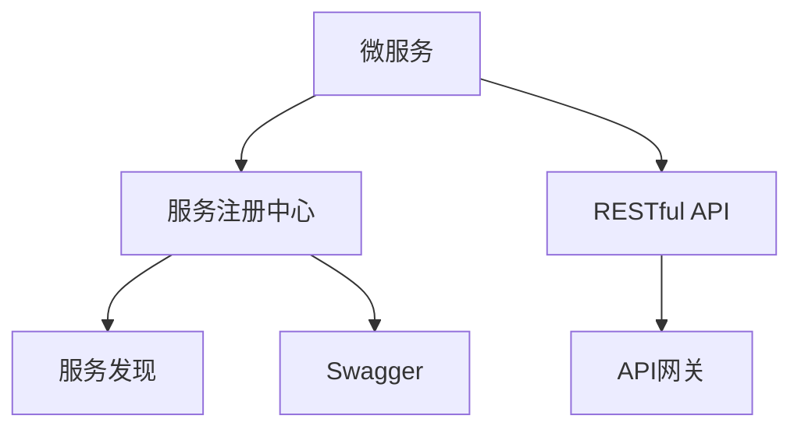

                 

# 服务注册中心的设计与实现

> 关键词：微服务,服务发现,服务注册中心,分布式系统,RESTful API,Swagger,API网关

## 1. 背景介绍

在现代互联网应用中，微服务架构(Microservices Architecture)已经成为了构建复杂系统的最佳实践。微服务架构通过将应用拆分为多个小型、自治的服务单元，有效提高了系统的可维护性、扩展性和可伸缩性。然而，微服务架构的一个重大挑战是如何在分布式系统中管理和发现服务。服务注册中心(Service Registry)就是为了解决这一问题而生的关键组件。

服务注册中心是分布式系统中服务发现的中心。它记录了系统中所有的微服务及其相关信息，如服务地址、服务版本、服务状态等。服务注册中心的存在，使得客户端能够通过简单的查询操作，发现和连接系统中任意微服务，大大简化了微服务的管理与发现。在微服务架构中，服务注册中心是保证系统稳定性和可扩展性的重要基础设施。

本文将系统地介绍服务注册中心的原理、设计及实现方法，并通过一系列案例和代码示例，帮助读者深入理解服务注册中心的关键技术和应用场景。

## 2. 核心概念与联系

### 2.1 核心概念概述

为更好地理解服务注册中心的原理和设计，本节将介绍几个核心概念及其相互关系：

- 微服务(Microservice)：将大型应用拆分为多个小型、自治的服务单元。每个服务单元负责单一的功能，并通过RESTful API或消息队列与外部系统进行通信。

- 服务发现(Service Discovery)：在分布式系统中，查找服务实例的过程。服务发现通常通过服务注册中心实现，确保所有客户端能够发现和连接系统中的服务。

- 服务注册中心(Service Registry)：记录和维护系统中所有服务的元数据，如服务地址、服务版本、服务状态等，并提供服务发现和查找服务的功能。

- RESTful API：一种轻量级的、无状态的、可缓存的接口设计风格，广泛应用于微服务架构中的服务通信。

- Swagger：一种基于Web的API设计和文档工具，帮助开发者设计和文档化RESTful API，并提供API的交互测试功能。

- API网关(API Gateway)：位于系统边界的一个代理服务，负责接收和路由所有客户端请求，提供统一的接口和安全策略，并处理复杂的路由和负载均衡。

这些核心概念构成了服务注册中心的基础框架，其相互关系可通过以下Mermaid流程图来展示：



## 3. 核心算法原理 & 具体操作步骤
### 3.1 算法原理概述

服务注册中心的原理基于分布式系统中的服务发现机制。其核心思想是：通过一个集中式的数据库记录所有服务的元数据，同时为每个服务分配一个唯一的全局标识符。客户端在访问服务时，首先向服务注册中心查询该服务的地址和状态，然后通过该地址连接服务实例。

### 3.2 算法步骤详解

服务注册中心的实现可以分为以下几个关键步骤：

**Step 1: 定义服务注册规则**
- 确定服务注册中心的协议和数据格式。常用的协议包括HTTP、gRPC等，数据格式包括JSON、Protocol Buffers等。
- 定义服务的元数据字段，如服务名称、地址、端口、状态等。

**Step 2: 实现服务注册和查找功能**
- 开发服务注册API，用于服务实例的注册、更新、删除等操作。
- 开发服务查找API，用于根据服务名称或地址查询服务实例。

**Step 3: 维护服务状态**
- 记录每个服务实例的状态，如注册状态、运行状态、错误状态等。
- 提供状态更新API，用于服务实例状态的更新和查询。

**Step 4: 处理服务故障和恢复**
- 当服务实例出现问题时，将其状态标记为故障状态。
- 当服务实例恢复时，将其状态标记为运行状态。
- 提供故障转移和恢复策略，确保服务的持续可用性。

**Step 5: 配置和监控**
- 配置服务注册中心的集群、数据存储和缓存策略。
- 监控服务注册中心的性能和状态，及时发现和解决异常。

### 3.3 算法优缺点

服务注册中心具有以下优点：
1. 集中管理服务信息，简化了服务的发现和连接过程。
2. 提供了服务状态的实时监控和故障恢复功能，提升了系统的可靠性。
3. 可以与多种服务通信协议和数据格式兼容，具有较强的灵活性和扩展性。

同时，服务注册中心也存在以下缺点：
1. 依赖中心化数据库，增加了系统的单点故障风险。
2. 当服务实例较多时，数据库性能可能成为瓶颈。
3. 当服务地址或状态频繁变化时，查询效率可能受到影响。
4. 实现和维护成本较高，需要专业的技术团队支持。

### 3.4 算法应用领域

服务注册中心在微服务架构中应用广泛，具体包括：

- 服务注册和查找：记录和查询系统中的服务实例，确保客户端能够快速找到所需的服务。
- 服务状态监控：实时监控服务实例的状态，及时发现和处理故障，提升系统的可靠性。
- 负载均衡和路由：根据服务状态和负载情况，动态调整服务的连接方式和路由策略。
- API网关和Swagger集成：集成Swagger等工具，为RESTful API提供文档和测试支持。
- 数据同步和缓存：将服务注册数据同步到缓存中，提高查询效率和系统的响应速度。

## 4. 数学模型和公式 & 详细讲解 & 举例说明
### 4.1 数学模型构建

服务注册中心的核心功能是服务信息的记录和查询。假设服务注册中心的元数据记录为：
$$
\text{Services} = \{S_1, S_2, ..., S_n\}
$$
其中 $S_i = \{Name, Address, Port, Status\}$，分别表示服务名称、地址、端口和状态。

服务注册中心的查询操作可以表示为：
$$
\text{GetService}(\text{ServiceName}) = \text{Address}, \text{Port}, \text{Status}
$$
表示根据服务名称获取服务实例的地址、端口和状态。

### 4.2 公式推导过程

服务注册中心的服务查询操作可以通过简单的CRUD操作实现。具体而言，服务注册API需要提供以下操作：

1. **注册服务**：$\text{RegisterService}(S_i)$，将服务实例 $S_i$ 添加到服务记录中。
2. **更新服务**：$\text{UpdateService}(S_i)$，更新服务实例 $S_i$ 的信息。
3. **删除服务**：$\text{DeleteService}(S_i)$，从服务记录中删除服务实例 $S_i$。
4. **查找服务**：$\text{GetService}(\text{ServiceName})$，根据服务名称获取服务实例的地址、端口和状态。

假设服务注册中心使用MySQL作为数据库，则服务注册操作的SQL语句可以表示为：

```sql
INSERT INTO Services (Name, Address, Port, Status) VALUES (?, ?, ?, ?);
UPDATE Services SET Address=?, Port=?, Status=? WHERE Name=?;
DELETE FROM Services WHERE Name=?;
SELECT Address, Port, Status FROM Services WHERE Name=?;
```

### 4.3 案例分析与讲解

以一个简单的微服务系统为例，演示服务注册中心的实现。假设系统中有两个微服务：OrderService和PaymentService，它们的元数据如下：

| 服务名称 | 地址    | 端口 | 状态 |
|---------|--------|-----|-----|
| OrderService | 192.168.1.10 | 8080 | UP |
| PaymentService | 192.168.1.20 | 8081 | UP |

当OrderService的地址由192.168.1.10更新为192.168.1.11时，客户端需要首先向服务注册中心查询OrderService的最新地址：

```sql
SELECT Address, Port, Status FROM Services WHERE Name='OrderService';
```

假设返回结果为：

| 地址    | 端口 | 状态 |
|--------|-----|-----|
| 192.168.1.11 | 8080 | UP |

则客户端连接OrderService的新地址192.168.1.11，并进行后续操作。

## 5. 项目实践：代码实例和详细解释说明
### 5.1 开发环境搭建

服务注册中心的开发环境主要包括MySQL数据库、RESTful API服务器和缓存系统。具体步骤如下：

1. 安装MySQL数据库，创建服务注册表。
2. 安装RESTful API服务器，如Node.js或Java Spring Boot。
3. 安装缓存系统，如Redis或ElastiCache，用于提升查询效率。

### 5.2 源代码详细实现

以下是一个简单的服务注册中心实现示例，使用Java和Spring Boot框架：

```java
// 定义服务注册接口
@RestController
@RequestMapping("/services")
public class ServiceRegistryController {
    @Autowired
    private ServiceRegistryService serviceRegistryService;
    
    @PostMapping
    public ResponseEntity<String> registerService(@RequestBody Service service) {
        serviceRegistryService.registerService(service);
        return ResponseEntity.ok("Service registered successfully.");
    }
    
    @GetMapping
    public ResponseEntity<Service> getService(@RequestParam String serviceName) {
        Service service = serviceRegistryService.getService(serviceName);
        if (service == null) {
            return ResponseEntity.notFound().build();
        }
        return ResponseEntity.ok(service);
    }
    
    @PutMapping
    public ResponseEntity<String> updateService(@RequestBody Service service) {
        serviceRegistryService.updateService(service);
        return ResponseEntity.ok("Service updated successfully.");
    }
    
    @DeleteMapping
    public ResponseEntity<String> deleteService(@RequestParam String serviceName) {
        serviceRegistryService.deleteService(serviceName);
        return ResponseEntity.ok("Service deleted successfully.");
    }
}
```

其中，`Service`类表示服务的元数据，包括名称、地址、端口和状态：

```java
public class Service {
    private String name;
    private String address;
    private int port;
    private String status;
    
    // getter和setter方法
}
```

### 5.3 代码解读与分析

让我们详细解读一下关键代码的实现细节：

**ServiceRegistryController类**：
- `registerService`方法：接收服务元数据，调用`ServiceRegistryService`类的`registerService`方法将服务添加到数据库中。
- `getService`方法：根据服务名称查询服务实例，并返回JSON格式的响应。
- `updateService`方法：接收服务元数据，调用`ServiceRegistryService`类的`updateService`方法更新服务实例。
- `deleteService`方法：根据服务名称删除服务实例。

**Service类**：
- 定义了服务的元数据字段，以及对应的getter和setter方法。

**ServiceRegistryService类**：
- 实现了服务注册和查找的具体逻辑，包括数据库操作和缓存逻辑。

可以看到，服务注册中心的实现主要依赖于RESTful API和数据库，代码简洁高效。开发者可以根据具体需求，灵活扩展功能，如添加负载均衡、健康检查等。

## 6. 实际应用场景
### 6.1 分布式应用管理

服务注册中心在分布式应用管理中具有重要应用。在微服务架构中，每个服务独立运行，分布在不同的服务器上。服务注册中心负责记录和查询服务实例的地址和状态，确保所有客户端能够正确地访问服务。例如，在电商平台中，订单服务和支付服务需要实时通信，服务注册中心可以帮助系统快速发现并连接这两项服务，确保交易的实时性和稳定性。

### 6.2 弹性扩展和故障恢复

服务注册中心可以动态监控服务实例的状态，及时发现和处理故障。在负载均衡和弹性扩展中，服务注册中心可以根据服务实例的负载情况，动态调整服务的连接方式和路由策略，确保系统能够快速响应负载变化和故障恢复。例如，在大型互联网应用中，服务注册中心可以实时监控服务实例的性能指标，当某个服务实例出现故障时，自动将其标记为不可用状态，并将请求转发到其他可用的服务实例上。

### 6.3 统一的API网关

服务注册中心可以集成Swagger等工具，为RESTful API提供文档和测试支持。在微服务架构中，不同的服务提供不同的API接口，客户端需要知道每个服务的详细API文档才能正确调用。服务注册中心可以为所有服务提供一个统一的API网关，并集成Swagger等工具，帮助客户端快速获取API文档和进行API测试，提高开发效率和系统稳定性。

### 6.4 未来应用展望

服务注册中心的应用场景将随着微服务架构的发展而不断扩展。未来，服务注册中心将可能与更多的组件集成，如API网关、负载均衡、健康检查等，形成更加完善的微服务治理体系。此外，服务注册中心还将向云原生方向发展，利用云平台提供的资源和工具，实现更高效、更安全的服务管理。

## 7. 工具和资源推荐
### 7.1 学习资源推荐

为了帮助开发者系统掌握服务注册中心的原理和实现，这里推荐一些优质的学习资源：

1. Spring Boot官方文档：提供了丰富的RESTful API开发和Spring Data JPA的使用指南，适合快速上手微服务开发。

2. Docker官方文档：介绍了如何使用Docker容器化服务注册中心，确保其在不同环境下的稳定性。

3. Swagger官方文档：提供了Swagger的使用指南和API文档工具的介绍，帮助开发者设计和文档化RESTful API。

4. Consul官方文档：介绍了Consul服务发现和配置管理工具的使用方法，提供了丰富的示例代码和配置选项。

5. Kubernetes官方文档：介绍了如何使用Kubernetes容器编排服务，动态管理服务实例，确保系统的弹性和可用性。

通过对这些资源的学习实践，相信你一定能够快速掌握服务注册中心的精髓，并用于解决实际的微服务问题。

### 7.2 开发工具推荐

高效的开发离不开优秀的工具支持。以下是几款用于服务注册中心开发的常用工具：

1. MySQL数据库：广泛使用的关系型数据库，适合存储和查询结构化数据。

2. Node.js和Spring Boot：轻量级、易于扩展的Web框架，支持RESTful API开发。

3. Swagger：基于Web的API设计和文档工具，帮助开发者设计和文档化RESTful API。

4. Consul：服务发现和配置管理工具，支持多数据中心和动态服务注册。

5. Kubernetes：容器编排工具，提供动态服务管理和弹性扩展能力。

合理利用这些工具，可以显著提升服务注册中心的开发效率，加快创新迭代的步伐。

### 7.3 相关论文推荐

服务注册中心的研究源于学界的持续探索。以下是几篇奠基性的相关论文，推荐阅读：

1. Etcd: A distributed highly-available key-value store for Internet applications：介绍了Etcd服务注册中心的原理和设计，适合了解服务注册中心的分布式架构。

2. ZooKeeper：提供了一个分布式协调服务，用于管理分布式系统的状态。

3. Service Mesh: Networking the Next Generation of Microservices：介绍了Service Mesh架构的基本原理，强调了服务注册中心在微服务中的重要作用。

4. Consul and Service Discovery: An Advanced Tutorial：Consul服务注册中心的官方教程，提供了详细的配置和使用示例。

5. Kubernetes Service Discovery with Kube-DNS：介绍了Kubernetes集群中的服务发现机制，适合了解Kubernetes平台的服务管理方式。

这些论文代表了大规模服务注册中心的研究方向，通过学习这些前沿成果，可以帮助研究者把握学科前进方向，激发更多的创新灵感。

## 8. 总结：未来发展趋势与挑战
### 8.1 总结

本文对服务注册中心的原理、设计和实现方法进行了全面系统的介绍。首先阐述了服务注册中心在微服务架构中的重要作用，明确了其在服务发现、状态监控、负载均衡等方面的应用。其次，从原理到实践，详细讲解了服务注册中心的数学模型和具体操作步骤，给出了微服务系统设计的完整代码实例。同时，本文还广泛探讨了服务注册中心在多个行业领域的应用前景，展示了其广泛的适用性和潜力。

通过本文的系统梳理，可以看到，服务注册中心是微服务架构中的关键组件，通过其服务注册和查找功能，简化了微服务的连接和管理。未来的发展方向，如云原生、弹性扩展等，将进一步拓展服务注册中心的应用边界，提升系统的可靠性和可扩展性。

### 8.2 未来发展趋势

展望未来，服务注册中心将呈现以下几个发展趋势：

1. 云原生化：随着云平台的发展，服务注册中心将更加紧密地集成到云平台中，利用云平台提供的资源和工具，实现更高效、更安全的服务管理。

2. 弹性扩展：服务注册中心将支持动态扩展和负载均衡，确保系统能够快速响应负载变化和故障恢复。

3. 分布式化：服务注册中心将支持多数据中心的分布式架构，确保服务实例在不同数据中心之间的高可用性和一致性。

4. 微服务治理：服务注册中心将集成更多微服务治理工具，如API网关、负载均衡、健康检查等，形成更加完善的微服务治理体系。

5. 安全性和隐私保护：服务注册中心将加入更多的安全性和隐私保护机制，确保服务实例的安全性和用户的隐私保护。

以上趋势凸显了服务注册中心的广阔前景。这些方向的探索发展，必将进一步提升微服务系统的性能和稳定性，为构建安全、可靠、可扩展的分布式系统提供重要保障。

### 8.3 面临的挑战

尽管服务注册中心已经取得了显著成就，但在迈向更加智能化、普适化应用的过程中，它仍面临着诸多挑战：

1. 数据一致性：服务注册中心需要保证不同数据中心的同步一致性，避免数据冲突和错误。

2. 高可用性和容错性：服务注册中心需要具备高可用性和容错性，确保服务实例的稳定性和可靠性。

3. 负载均衡和路由策略：服务注册中心需要支持多种负载均衡和路由策略，确保服务实例的负载均衡和请求路由。

4. 安全性和隐私保护：服务注册中心需要加入更多的安全性和隐私保护机制，确保服务实例的安全性和用户的隐私保护。

5. 扩展性和性能：服务注册中心需要支持大规模服务实例的注册和查找，避免性能瓶颈和资源浪费。

6. 技术复杂度：服务注册中心的设计和实现需要考虑多种技术因素，如分布式架构、缓存策略、负载均衡等，增加了技术复杂度和开发难度。

正视服务注册中心面临的这些挑战，积极应对并寻求突破，将是其迈向成熟的重要步骤。相信随着学界和产业界的共同努力，这些挑战终将一一被克服，服务注册中心必将在构建安全、可靠、可扩展的分布式系统中扮演越来越重要的角色。

### 8.4 研究展望

面对服务注册中心所面临的挑战，未来的研究需要在以下几个方面寻求新的突破：

1. 分布式一致性算法：研究分布式一致性算法，确保不同数据中心的同步一致性，避免数据冲突和错误。

2. 高性能缓存策略：研究高效的数据缓存策略，提升服务注册中心的查询效率和系统的响应速度。

3. 灵活的负载均衡策略：研究灵活的负载均衡和路由策略，确保服务实例的负载均衡和请求路由。

4. 安全性和隐私保护：研究安全性和隐私保护机制，确保服务实例的安全性和用户的隐私保护。

5. 可扩展性和性能优化：研究可扩展性和性能优化技术，支持大规模服务实例的注册和查找。

6. 多数据中心支持：研究多数据中心的分布式架构，确保服务实例在不同数据中心之间的高可用性和一致性。

这些研究方向的探索，必将引领服务注册中心技术迈向更高的台阶，为构建安全、可靠、可扩展的分布式系统提供重要保障。面向未来，服务注册中心还需要与其他组件进行更深入的融合，如API网关、负载均衡、健康检查等，多路径协同发力，共同推动微服务架构的进步。

## 9. 附录：常见问题与解答

**Q1：服务注册中心是否适用于所有微服务架构？**

A: 服务注册中心适用于大多数微服务架构，特别是分布式系统。然而，对于一些规模较小或特殊需求的应用，服务注册中心可能不是最佳选择。例如，对于仅包含少量微服务的简单应用，手动管理服务的地址和状态可能更为简单高效。

**Q2：服务注册中心是否需要与Swagger集成？**

A: 服务注册中心可以与Swagger集成，为RESTful API提供文档和测试支持。然而，集成Swagger并不是必需的，特别是在使用更轻量级的API设计和文档工具的情况下。开发者可以根据具体需求，选择适合自己的API设计和文档工具。

**Q3：服务注册中心是否需要与API网关集成？**

A: 服务注册中心可以与API网关集成，提供统一的API接口和安全策略。然而，集成API网关并不是必需的，特别是在使用基于RESTful API的服务架构中。开发者可以根据具体需求，选择适合自己的服务架构和API管理方式。

**Q4：服务注册中心是否需要支持分布式架构？**

A: 服务注册中心可以支持分布式架构，确保服务实例在不同数据中心之间的高可用性和一致性。然而，对于规模较小或特殊需求的应用，集中式的数据库和服务注册中心可能更为简单高效。

**Q5：服务注册中心是否需要与云平台集成？**

A: 服务注册中心可以与云平台集成，利用云平台提供的资源和工具，实现更高效、更安全的服务管理。然而，对于规模较小或非云平台的应用，服务注册中心的实现和维护成本可能较高。

这些问题的回答，将帮助你更好地理解服务注册中心的适用场景和设计策略，以便在实际开发中做出更合适的选择。

---

作者：禅与计算机程序设计艺术 / Zen and the Art of Computer Programming

