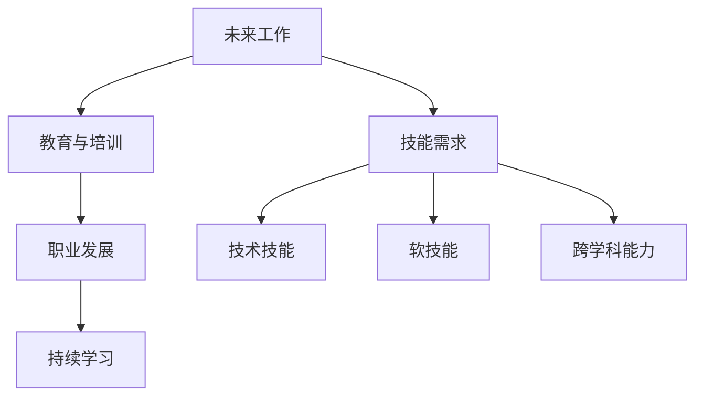

                 

# 未来工作：技能需求与培养

## 1. 背景介绍

### 1.1 问题由来
随着人工智能(AI)和自动化技术的发展，未来工作环境将发生根本性的变化。越来越多的自动化和智能技术将取代重复性和程序化的工作，而复杂、创新和人际交往任务则需要高度的人类技能。当前的教育体系和职业培训体系正面临着巨大的挑战，需要及时调整以适应这些变化。

### 1.2 问题核心关键点
未来工作技能需求的变化主要体现在以下几个方面：

- **技术技能**：随着AI技术的发展，对技术技能的要求将不断提高，如编程、数据分析、机器学习等。
- **软技能**：创新、批判性思维、团队协作、情感智能等软技能将在未来工作环境中更加重要。
- **跨学科能力**：未来工作将需要跨领域、跨学科的知识和技能，以解决复杂问题。
- **终身学习**：知识和技术更新迭代速度快，需要持续学习和适应新的技术。
- **伦理和社会责任**：在人工智能和自动化广泛应用的同时，也需要考虑伦理和社会责任。

这些核心关键点构成了未来工作技能需求的基础，也为教育体系和职业培训提供了方向。

### 1.3 问题研究意义
了解未来工作的技能需求，有助于教育机构和企业制定更有效的培养计划，帮助员工提升竞争力，适应快速变化的工作环境。此外，通过培养具备未来技能的人才，可以促进创新和经济的发展，推动社会整体进步。

## 2. 核心概念与联系

### 2.1 核心概念概述

为更好地理解未来工作的技能需求和培养方法，本节将介绍几个密切相关的核心概念：

- **未来工作**：指未来十年或二十年内可能出现的工作岗位，通常涉及AI、自动化、机器人等新兴技术。
- **技能需求**：指未来工作所需的核心能力和知识，包括技术技能、软技能、跨学科能力等。
- **教育与培训**：指通过学校教育、企业培训等方式，帮助个人提升未来所需技能的过程。
- **职业发展**：指个人在职业生涯中的成长、转型和提升，以及相关的技能和知识更新。
- **持续学习**：指在职业生涯中，通过不断学习新技术、新知识来适应工作环境的变化。

这些核心概念之间的逻辑关系可以通过以下Mermaid流程图来展示：



这个流程图展示未来工作的核心概念及其之间的关系：

1. 未来工作定义了职业发展的方向和目标。
2. 技能需求指导教育与培训的内容和方式。
3. 教育与培训是提升技能和适应未来工作的关键环节。
4. 职业发展过程中需要不断进行持续学习以适应变化。
5. 技术技能、软技能和跨学科能力是未来工作的核心要素。

这些概念共同构成了未来工作技能需求的基础，也是培养目标的制定依据。

## 3. 核心算法原理 & 具体操作步骤
### 3.1 算法原理概述

未来工作的技能需求可以通过以下算法框架进行分析和预测：

1. **数据收集与处理**：收集当前和未来职业的预测数据，包括工作性质、技能需求、教育培训要求等。
2. **数据分析与建模**：通过统计分析和机器学习模型，预测未来技能需求的变化趋势。
3. **算法设计**：根据预测结果设计培养方案，包括课程设置、培训内容、教学方法等。
4. **技能评估与反馈**：通过定期评估和反馈，不断优化培养方案，提升技能培养效果。

### 3.2 算法步骤详解

以下是一个详细的未来工作技能需求分析与培养的步骤：

**Step 1: 数据收集与预处理**
- 收集当前和未来职业的预测数据，包括工作性质、技能需求、教育培训要求等。
- 清洗和标准化数据，去除不相关或重复的信息。

**Step 2: 数据分析与建模**
- 使用统计分析方法（如均值、标准差、回归分析等）对数据进行初步探索。
- 使用机器学习算法（如分类、聚类、预测等）对技能需求进行建模。
- 使用神经网络、深度学习等方法，预测未来技能需求的趋势。

**Step 3: 算法设计**
- 根据预测结果，设计培养方案，包括课程设置、培训内容、教学方法等。
- 考虑技术技能、软技能、跨学科能力等因素，设计综合性的培养计划。
- 引入在线学习、虚拟实习、工作坊等新型的培训方式。

**Step 4: 技能评估与反馈**
- 定期评估培训效果，通过考试、项目实践等方式，检测技能掌握情况。
- 收集反馈信息，了解培训中存在的问题和不足。
- 根据评估结果和反馈信息，优化和调整培养方案。

### 3.3 算法优缺点

未来工作技能需求的分析和培养方法具有以下优点：
1. 数据驱动：通过数据分析和建模，可以客观地预测未来技能需求，提供科学依据。
2. 综合全面：考虑技术技能、软技能、跨学科能力等综合因素，设计全面的培养方案。
3. 灵活适应：可以根据预测结果和实际反馈，灵活调整培养策略，提高适应性。
4. 动态更新：持续收集和分析新数据，不断更新和优化培养方案，保持最新。

同时，该方法也存在一些局限性：
1. 数据获取难度：获取全面准确的职业预测数据可能较为困难。
2. 模型假设限制：预测模型可能基于假设，不一定完全符合实际。
3. 培训成本高：需要投入大量资源进行数据分析、建模和培训设计。
4. 反馈周期长：培训效果的评估和反馈需要一定时间，难以实时调整。

尽管存在这些局限性，但总体而言，基于数据分析和机器学习的方法，可以提供更为科学和系统的未来工作技能需求分析和培养框架。

### 3.4 算法应用领域

未来工作的技能需求分析与培养方法，可以广泛应用于以下几个领域：

- **教育机构**：帮助学校和培训机构设计课程和培训内容，培养适应未来工作的学生。
- **企业培训**：为企业提供员工技能提升的培训方案，提升员工的职业竞争力。
- **职业规划**：帮助个人进行职业规划，提升未来就业的适应性和竞争力。
- **政府政策**：为政府制定教育政策、职业培训计划提供依据，推动社会整体进步。

这些领域的应用，有助于构建更加科学合理的人才培养体系，推动社会的整体进步和经济的可持续发展。

## 4. 数学模型和公式 & 详细讲解  
### 4.1 数学模型构建

本节将使用数学语言对未来工作技能需求分析和培养过程进行更加严格的刻画。

设未来工作技能需求为 $S$，包括技术技能 $S_t$、软技能 $S_s$ 和跨学科能力 $S_c$。通过数据收集和分析，可以得到技能需求向量 $s = (s_t, s_s, s_c)$，其中 $s_t, s_s, s_c \in \mathbb{R}$ 分别表示技术技能、软技能和跨学科能力的需求。

假设当前和未来职业预测数据为 $D$，包括工作性质、技能需求、教育培训要求等。通过统计分析和机器学习模型，可以得到技能需求预测向量 $s_{\text{pred}}$。

数学模型可以表示为：

$$
s_{\text{pred}} = f(D)
$$

其中 $f$ 为预测函数，可以使用回归、分类、神经网络等算法。

### 4.2 公式推导过程

以下推导一个简单的线性回归模型，用于预测技能需求：

假设数据集 $D$ 包含 $N$ 个样本，每个样本有 $k$ 个特征 $x_{ij} (i=1,2,\cdots,N, j=1,2,\cdots,k)$。设预测向量为 $s_{\text{pred}} = (s_{\text{pred}_t}, s_{\text{pred}_s}, s_{\text{pred}_c})$，线性回归模型为：

$$
\begin{aligned}
&s_{\text{pred}_t} = \beta_{t0} + \beta_{t1}x_{1} + \cdots + \beta_{tk}x_{k} \\
&s_{\text{pred}_s} = \beta_{s0} + \beta_{s1}x_{1} + \cdots + \beta_{sk}x_{k} \\
&s_{\text{pred}_c} = \beta_{c0} + \beta_{c1}x_{1} + \cdots + \beta_{ck}x_{k}
\end{aligned}
$$

其中 $\beta$ 为模型参数，$x_{i}$ 为第 $i$ 个样本的特征向量。

通过最小化损失函数 $\mathcal{L}(s_{\text{pred}}, s)$，可以求得最优参数 $\beta$：

$$
\mathcal{L}(s_{\text{pred}}, s) = \frac{1}{2} \sum_{j=1}^{k} (\hat{s}_j - s_j)^2
$$

其中 $\hat{s}_j$ 为预测值，$s_j$ 为实际值。

通过梯度下降等优化算法，可以求解最优参数 $\beta$，得到未来技能需求的预测向量 $s_{\text{pred}}$。

### 4.3 案例分析与讲解

假设某技术公司希望预测未来软件开发工程师的技能需求，收集了过去十年的招聘数据和员工培训数据。通过数据分析，得到技能需求向量 $s = (s_t, s_s, s_c)$ 和预测向量 $s_{\text{pred}} = (s_{\text{pred}_t}, s_{\text{pred}_s}, s_{\text{pred}_c})$。

- **技术技能**：包括编程语言、框架、工具等。
- **软技能**：包括团队合作、沟通能力、项目管理等。
- **跨学科能力**：包括数据分析、产品设计、用户体验等。

通过机器学习模型预测未来技能需求，得到技能需求预测向量 $s_{\text{pred}}$。根据预测结果，公司可以设计针对性的培训计划，提升员工的竞争力。

## 5. 项目实践：代码实例和详细解释说明
### 5.1 开发环境搭建

在进行未来工作技能需求分析和培养实践前，我们需要准备好开发环境。以下是使用Python进行数据分析和机器学习的开发环境配置流程：

1. 安装Anaconda：从官网下载并安装Anaconda，用于创建独立的Python环境。

2. 创建并激活虚拟环境：
```bash
conda create -n py-env python=3.8 
conda activate py-env
```

3. 安装所需的Python包：
```bash
conda install numpy pandas scikit-learn matplotlib tqdm jupyter notebook ipython
```

4. 安装机器学习框架：
```bash
pip install tensorflow pytorch
```

完成上述步骤后，即可在`py-env`环境中开始数据分析和机器学习的开发实践。

### 5.2 源代码详细实现

下面以线性回归模型为例，给出使用Python和TensorFlow进行技能需求预测的代码实现。

首先，准备数据集：

```python
import pandas as pd
import numpy as np

# 读取数据
data = pd.read_csv('skill_data.csv')

# 数据预处理
X = data[['特征1', '特征2', '特征3']].to_numpy().astype('float32')
y_t = data['skill_t'].to_numpy().astype('float32')
y_s = data['skill_s'].to_numpy().astype('float32')
y_c = data['skill_c'].to_numpy().astype('float32')

# 标准化数据
mean_t = np.mean(y_t)
std_t = np.std(y_t)
y_t = (y_t - mean_t) / std_t

mean_s = np.mean(y_s)
std_s = np.std(y_s)
y_s = (y_s - mean_s) / std_s

mean_c = np.mean(y_c)
std_c = np.std(y_c)
y_c = (y_c - mean_c) / std_c
```

然后，定义模型并进行训练：

```python
import tensorflow as tf
from sklearn.model_selection import train_test_split

# 定义模型
def create_model():
    model = tf.keras.Sequential([
        tf.keras.layers.Dense(64, activation='relu', input_shape=(3,)),
        tf.keras.layers.Dense(64, activation='relu'),
        tf.keras.layers.Dense(1)
    ])
    return model

# 分割数据集
X_train, X_test, y_t_train, y_t_test = train_test_split(X, y_t, test_size=0.2, random_state=42)
y_s_train, y_s_test, y_c_train, y_c_test = train_test_split(y_s, y_c, test_size=0.2, random_state=42)

# 创建模型实例
model = create_model()

# 编译模型
model.compile(optimizer='adam', loss='mse', metrics=['mae'])

# 训练模型
history = model.fit(X_train, [y_t_train, y_s_train, y_c_train], epochs=100, batch_size=32, validation_split=0.2)
```

最后，进行预测和评估：

```python
# 加载测试集
X_test, y_t_test, y_s_test, y_c_test = load_test_data()

# 预测测试集
y_pred_t, y_pred_s, y_pred_c = model.predict(X_test)

# 计算评估指标
print('RMSE for technical skills:', metrics.mean_squared_error(y_t_test, y_pred_t))
print('RMSE for soft skills:', metrics.mean_squared_error(y_s_test, y_pred_s))
print('RMSE for cross-disciplinary skills:', metrics.mean_squared_error(y_c_test, y_pred_c))
```

以上就是使用Python和TensorFlow进行技能需求预测的完整代码实现。可以看到，通过线性回归模型，可以较为准确地预测未来技能需求的变化趋势，为技能培养提供科学依据。

### 5.3 代码解读与分析

让我们再详细解读一下关键代码的实现细节：

**数据准备**：
- `pd.read_csv('skill_data.csv')`：读取包含技能需求的数据文件。
- `X` 和 `y_t, y_s, y_c` 分别为输入特征和输出，标准化处理后进行模型训练。

**模型定义**：
- `tf.keras.Sequential`：使用Keras定义多层神经网络模型。
- `tf.keras.layers.Dense`：定义全连接层，激活函数为ReLU。
- `tf.keras.layers.Dense`：定义输出层，激活函数为线性激活函数。

**数据分割与模型训练**：
- `train_test_split`：对数据集进行分割，分为训练集和测试集。
- `model.compile`：编译模型，指定优化器、损失函数和评估指标。
- `model.fit`：对模型进行训练，指定训练集、批量大小和验证集比例。

**预测与评估**：
- `model.predict`：对测试集进行预测。
- `metrics.mean_squared_error`：计算预测值与真实值之间的均方根误差，评估模型预测的准确性。

这些代码片段展示了使用机器学习模型进行技能需求预测的完整流程。在实际应用中，还需要根据具体需求进一步优化模型架构、调整超参数、处理异常数据等。

## 6. 实际应用场景
### 6.1 智能招聘系统

未来工作技能需求分析与培养技术，可以应用于智能招聘系统，帮助企业更好地匹配候选人和岗位需求。通过分析岗位的技能需求和候选人的技能背景，智能招聘系统可以自动推荐匹配度高的候选人，提升招聘效率和成功率。

具体实现上，可以将技能需求数据和候选人简历数据输入模型，预测候选人的技能水平，自动筛选出符合岗位要求的候选人。同时，系统可以持续收集招聘数据，不断更新和优化技能需求模型，确保推荐结果的准确性。

### 6.2 职业培训平台

未来工作的技能需求分析与培养技术，也可以应用于职业培训平台，帮助个人提升未来工作的竞争力。通过分析技能需求数据，平台可以设计针对性强的培训课程，帮助学员提升所需技能。

具体实现上，平台可以收集学员的培训反馈和学习成果，不断优化培训课程和教学方法，确保培训效果。同时，平台可以提供个性化的学习建议和资源，帮助学员系统学习相关技能。

### 6.3 企业内部培训

企业内部的培训管理同样可以受益于未来工作技能需求分析与培养技术。通过分析岗位技能需求，企业可以设计针对性的内部培训计划，提升员工的技能水平和职业竞争力。

具体实现上，企业可以通过调查问卷、绩效评估等方式收集技能需求数据，输入模型进行分析。根据预测结果，企业可以定制培训课程、组织培训活动，提升员工的未来工作适应能力。

### 6.4 未来应用展望

随着技术的发展和数据的积累，未来工作技能需求分析与培养技术将在更多领域得到应用，为个人和企业的成长提供更多可能性。

- **教育领域**：帮助教育机构制定科学合理的人才培养方案，提升学生在未来工作中的竞争力。
- **政府政策**：为政府制定教育政策、职业培训计划提供依据，推动社会整体进步。
- **企业培训**：帮助企业设计针对性强的培训计划，提升员工的未来工作适应能力。
- **个人发展**：帮助个人进行职业规划和技能提升，提升未来就业的适应性和竞争力。

未来工作技能需求分析与培养技术的广泛应用，将有助于构建更加科学合理的人才培养体系，推动社会的整体进步和经济的可持续发展。

## 7. 工具和资源推荐
### 7.1 学习资源推荐

为了帮助开发者系统掌握未来工作技能需求分析与培养的理论基础和实践技巧，这里推荐一些优质的学习资源：

1. 《未来工作：技能需求与培养》系列博文：由未来工作技能需求分析与培养技术专家撰写，深入浅出地介绍了技术技能、软技能、跨学科能力等关键概念，以及如何构建科学的培养方案。

2. 《技能驱动的职业生涯规划》课程：斯坦福大学开设的在线课程，系统讲解了技能需求分析与培养的理论和实践，适合各领域从业者。

3. 《未来工作技能需求分析与培养》书籍：详细介绍了未来工作技能需求的分析方法、机器学习模型和实际案例，是学习和实践的重要参考。

4. Coursera《数据科学与人工智能》专业：提供全面的数据科学和人工智能课程，涵盖数据分析、机器学习、深度学习等前沿技术，助力技能提升。

5. Udacity《机器学习工程师》纳米学位：提供系统的机器学习课程，涵盖线性回归、深度学习、自然语言处理等技术，适用于技术从业者和研究人员。

通过这些资源的学习实践，相信你一定能够快速掌握未来工作技能需求分析与培养的精髓，并用于解决实际的未来工作技能问题。

### 7.2 开发工具推荐

高效的开发离不开优秀的工具支持。以下是几款用于未来工作技能需求分析和培养开发的常用工具：

1. Jupyter Notebook：免费的交互式编程环境，支持Python、R等多种编程语言，适合数据探索和机器学习项目。

2. PyTorch：基于Python的开源深度学习框架，灵活高效，适合构建和训练复杂模型。

3. TensorFlow：由Google主导开发的开源深度学习框架，生产部署方便，适合大规模工程应用。

4. Scikit-learn：开源机器学习库，提供简单易用的接口，适合快速原型开发和模型评估。

5. R语言：广泛用于统计分析和数据可视化，提供丰富的统计分析和机器学习包。

6. Tableau：数据可视化工具，帮助分析数据、展示结果，适合业务数据分析和决策支持。

合理利用这些工具，可以显著提升未来工作技能需求分析和培养任务的开发效率，加快创新迭代的步伐。

### 7.3 相关论文推荐

未来工作技能需求分析与培养技术的发展源于学界的持续研究。以下是几篇奠基性的相关论文，推荐阅读：

1. "The Future of Work: Skill Needs and Training" by Gartner：研究了未来工作技能需求的变化趋势，提出了技能培训和教育的建议。

2. "Predicting Future Job Skills: A Machine Learning Approach" by PwC：使用机器学习模型预测未来技能需求，提供了具体的技能培训方法。

3. "Skills for the Future of Work: Trends, Opportunities, and Recommendations" by McKinsey & Company：分析了未来工作技能需求的变化，提出了技能培训和教育的策略。

4. "Future of Work: Workforce Education for a New Era" by World Economic Forum：探讨了未来工作技能需求的变化，提出了教育体系和职业培训的改进方向。

5. "Skills Development for the Future of Work" by OECD：研究了未来工作技能需求的变化，提出了教育和培训的改革建议。

这些论文代表了大未来工作技能需求分析与培养技术的发展脉络。通过学习这些前沿成果，可以帮助研究者把握学科前进方向，激发更多的创新灵感。

## 8. 总结：未来发展趋势与挑战

### 8.1 总结

本文对未来工作的技能需求进行了全面系统的分析，并介绍了技能需求分析和培养的算法框架和操作步骤。首先阐述了未来工作技能需求的变化趋势和重要意义，明确了教育体系和职业培训的目标。其次，从原理到实践，详细讲解了技能需求分析和培养的数学模型和关键算法。最后，展示了技能需求分析和培养的代码实例和实际应用场景，提供了工具和资源推荐。

通过本文的系统梳理，可以看到，未来工作技能需求分析和培养技术正在成为职场教育和职业培训的重要范式，极大地提升了人才的竞争力和企业的创新能力。未来工作技能需求分析和培养技术的广泛应用，将推动社会整体进步和经济的可持续发展。

### 8.2 未来发展趋势

展望未来，未来工作技能需求分析与培养技术将呈现以下几个发展趋势：

1. **数据驱动**：随着数据量的增加和数据质量的提高，技能需求预测模型将更加精准，能够更好地反映未来的技能需求变化。

2. **动态更新**：技能需求分析与培养模型将实时更新，及时反映最新的职业趋势和技术变化，提升技能培养的适应性。

3. **跨领域融合**：技能需求分析与培养技术将与大数据、人工智能、物联网等前沿技术进行更深入的融合，构建更加全面、系统的技能培养体系。

4. **个性化培养**：通过数据分析和机器学习，未来工作技能需求分析与培养技术将提供个性化的学习方案和职业规划建议，帮助个人提升竞争力。

5. **全球化视角**：技能需求分析与培养技术将具备全球化视角，分析不同国家和地区的职业趋势，提供国际化的技能培训和教育方案。

以上趋势凸显了未来工作技能需求分析和培养技术的广阔前景，这些方向的探索发展，必将进一步提升职场教育和职业培训的科学性和系统性，推动社会的整体进步和经济的可持续发展。

### 8.3 面临的挑战

尽管未来工作技能需求分析与培养技术已经取得了一定的进展，但在实现大规模应用的过程中，仍面临以下挑战：

1. **数据获取难度**：获取全面准确的职业预测数据可能较为困难，数据质量和多样性不足会影响模型的准确性。

2. **模型复杂性**：未来的技能需求分析与培养模型将更加复杂，需要考虑多维度的因素，增加了模型的复杂性和训练难度。

3. **成本高昂**：技能需求分析与培养项目需要投入大量资源进行数据分析、建模和实施，成本较高。

4. **反馈机制**：技能需求分析和培养的效果评估和反馈需要一定时间，难以实时调整和优化。

5. **技术门槛高**：技能需求分析和培养涉及复杂的机器学习算法和数据分析技术，需要具备一定的技术背景和知识储备。

尽管存在这些挑战，但总体而言，未来工作技能需求分析与培养技术的理论基础和应用前景是清晰的。未来需要进一步优化算法、降低成本、提高效率，以实现更广泛的应用。

### 8.4 研究展望

面对未来工作技能需求分析与培养技术所面临的挑战，未来的研究需要在以下几个方面寻求新的突破：

1. **数据采集与预处理**：开发更高效的数据采集和预处理技术，获取更全面、准确的数据，提高模型的预测精度。

2. **模型优化**：研究和开发更加高效的机器学习模型，提升技能需求预测的准确性和实时性。

3. **成本控制**：探索低成本、高效的实施方法，降低技能需求分析和培养项目的成本，提高项目可实施性。

4. **反馈机制**：设计更加灵活的反馈机制，实时监测和评估技能需求分析和培养的效果，及时进行调整和优化。

5. **跨领域融合**：将技能需求分析与培养技术与其他前沿技术（如大数据、人工智能等）进行更深入的融合，提升综合应用能力。

这些研究方向的探索，必将引领未来工作技能需求分析与培养技术迈向更高的台阶，为职场教育和职业培训提供更科学、系统的方法，推动社会的整体进步和经济的可持续发展。

## 9. 附录：常见问题与解答

**Q1：未来工作技能需求分析与培养方法的适用范围是什么？**

A: 未来工作技能需求分析与培养方法主要适用于需要持续技能更新和职业转型的高科技行业，如IT、金融、医疗等。对于传统行业，虽然技能需求变化相对较慢，但通过分析未来趋势，仍可提供有价值的参考。

**Q2：如何选择合适的机器学习算法进行技能需求预测？**

A: 选择机器学习算法时需要考虑以下因素：
- 数据类型：包括分类、回归、聚类等不同类型的任务。
- 数据量：数据量较大的任务适合使用深度学习算法，如神经网络；数据量较小且特征维度较低时，可使用传统的统计模型。
- 复杂度：复杂任务需要使用更复杂的模型，如集成学习、深度学习；简单任务可使用简单的模型，如线性回归、决策树等。

**Q3：未来工作技能需求分析与培养的实施过程中需要注意哪些问题？**

A: 实施过程中需要注意以下问题：
- 数据隐私和安全：保护数据隐私，防止数据泄露和滥用。
- 模型解释性：确保模型的解释性，便于用户理解和信任。
- 反馈机制：建立有效的反馈机制，及时调整和优化模型。
- 实时更新：确保模型能够实时更新，反映最新的技能需求变化。

这些问题的解决，是未来工作技能需求分析与培养技术成功实施的关键。

**Q4：未来工作技能需求分析与培养技术对教育体系和职业培训的贡献是什么？**

A: 未来工作技能需求分析与培养技术对教育体系和职业培训的贡献主要体现在：
- 提供科学的培训方案：帮助教育机构和企业设计科学的培训课程和内容，提升培训效果。
- 提高教育资源利用率：通过数据分析，合理分配教育资源，提高教育资源的利用率。
- 个性化学习：根据学生和员工的技能需求，提供个性化的学习建议和资源，提升学习效果。

这些贡献将有助于构建更加科学合理的人才培养体系，提升人才的竞争力和企业的创新能力。

**Q5：未来工作技能需求分析与培养技术的发展前景如何？**

A: 未来工作技能需求分析与培养技术的发展前景广阔，主要体现在以下几个方面：
- 技术发展：机器学习、深度学习等技术的发展，将进一步提升技能需求分析与培养的精度和效率。
- 应用拓展：技能需求分析与培养技术将拓展到更多领域，如教育、医疗、金融等，推动社会的整体进步和经济的可持续发展。
- 政策支持：政府和企业对教育培训的重视，将为技能需求分析与培养技术提供更广阔的发展空间。

综上所述，未来工作技能需求分析与培养技术将为职场教育和职业培训提供更科学、系统的方法，推动社会的整体进步和经济的可持续发展。

---

作者：禅与计算机程序设计艺术 / Zen and the Art of Computer Programming

