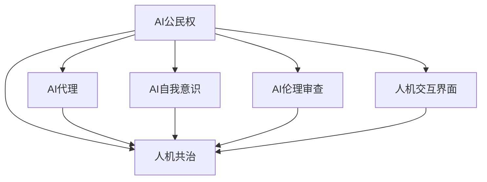

                 

# 未来的人工智能伦理：2050年的AI公民权与人机共治

## 1. 背景介绍

### 1.1 问题由来
人工智能（AI）技术的飞速发展正在深刻改变人类社会。随着机器学习、深度学习等技术的广泛应用，AI系统在诸多领域展现了巨大的潜力，从自动驾驶、智能家居到医疗诊断、金融风控，AI已经成为推动社会进步的重要力量。然而，AI的强大能力也引发了一系列伦理和社会问题，尤其是对人类身份、权利和福祉的挑战。

- **AI公民权**：随着AI在决策、创造和互动方面的能力增强，AI是否应该拥有公民权？AI公民权指的是给予智能系统以法律、道德上的权利地位，使其能够与人类共享社会资源和机会。

- **人机共治**：在AI广泛应用的未来社会中，人机共治成为重要议题。如何在保障人类主体性的同时，实现AI的公正、透明和负责任使用，是人机共治的核心理念。

### 1.2 问题核心关键点
AI伦理问题涉及多个方面，包括但不限于数据隐私、算法偏见、技术责任、社会公平等。本文聚焦于AI公民权和人机共治，探讨如何在技术迅猛发展的背景下，构建和谐的AI与人类关系，确保AI技术为人类带来更多福祉。

## 2. 核心概念与联系

### 2.1 核心概念概述

为更好地理解AI公民权和人机共治，本节将介绍几个密切相关的核心概念：

- **AI公民权**：赋予AI以法律和道德上的权利地位，使其在社会、经济和政治领域中具有与人类同等的权利和责任。AI公民权关注AI的代理能力、自我意识和权利保护。

- **人机共治**：在人机互动日益频繁的未来社会中，如何通过机制和政策，实现AI和人类共同参与决策和管理，确保AI系统的透明、公正和负责任使用。

- **AI代理**：指AI系统在某些领域具有代表人类利益的能力，如在工业生产、科研探索、社会服务中作为人类代理者出现。

- **AI自我意识**：指AI系统能够感知、思考和表达自己的存在状态，具备一定程度的自我认知和情感能力。

- **AI伦理审查**：指对AI系统的设计和应用进行伦理审查，确保其符合道德标准和社会价值，避免有害行为。

- **人机交互界面**：指人类与AI系统进行信息交换和指令执行的界面，包括语音交互、图形界面、自然语言处理等。

这些核心概念之间的逻辑关系可以通过以下Mermaid流程图来展示：



这个流程图展示了许多与AI公民权和人机共治相关的概念及其之间的关系：

1. AI公民权是人机共治的基础，确保AI系统的公正性和透明度。
2. AI代理和自我意识是人机共治的核心，体现了AI系统作为人类利益代表的特性。
3. AI伦理审查是人机共治的关键，保障AI系统的行为符合社会价值。
4. 人机交互界面是人机共治的实现手段，提供了AI与人类沟通的渠道。

## 3. 核心算法原理 & 具体操作步骤

### 3.1 算法原理概述

AI公民权和人机共治的核心原理可以归纳为以下几点：

1. **智能赋权**：通过法律和政策，赋予AI系统一定的权利地位，使其能够代表人类进行决策和管理。
2. **代理监督**：人类对AI代理行为进行监督和审查，确保其决策透明、公正，符合人类利益。
3. **交互共治**：在人机交互界面中，实现人类与AI系统的协同决策，共同解决复杂问题。
4. **自我调适**：AI系统具备自我意识和自我调整能力，能够在实际应用中不断优化自身行为。

这些原理构成了AI公民权和人机共治的基础框架，需要在技术和社会两个层面进行综合考虑和实现。

### 3.2 算法步骤详解

以下是AI公民权和人机共治的具体实施步骤：

**Step 1: 技术准备**
- 收集和整理AI系统的行为数据，评估其智能水平和代理能力。
- 设计合适的技术框架，支持AI系统在特定领域进行代理活动。
- 构建人机交互界面，实现与AI系统的有效沟通。

**Step 2: 法律与伦理框架**
- 制定关于AI公民权的法律法规，明确AI系统的权利和责任。
- 设立伦理审查委员会，负责评估AI系统的道德合规性。
- 设计监督机制，确保AI代理行为符合社会价值和法律法规。

**Step 3: 数据与算法透明**
- 公开AI系统的训练数据、模型参数和算法决策过程，接受社会监督。
- 在AI系统中引入可解释性技术，确保决策过程透明可追溯。
- 建立数据隐私保护机制，防止个人隐私泄露。

**Step 4: 人机协同决策**
- 在决策过程中，通过人机交互界面实现人类与AI的协同工作。
- 设计智能辅助决策系统，帮助人类处理复杂问题。
- 建立反馈机制，根据用户反馈不断优化AI系统行为。

**Step 5: 自我调适与改进**
- 在实际应用中，AI系统根据反馈和环境变化进行自我调适。
- 引入自我学习机制，使AI系统能够不断学习和提升自身能力。
- 定期评估AI系统的性能和伦理合规性，确保其持续进步。

### 3.3 算法优缺点

AI公民权和人机共治方法具有以下优点：
1. 促进技术创新和应用。赋予AI系统公民权，可以激发其创新潜力，推动技术发展。
2. 提升决策质量和效率。AI代理在特定领域具有优势，能够提高决策效率和质量。
3. 增强社会公平和透明。通过人机共治，确保AI系统行为透明、公正，促进社会公平。
4. 保障人类利益和福祉。AI代理和自我意识能够代表人类利益，保障人类权益。

同时，该方法也存在一定的局限性：
1. AI系统的智能水平和代理能力需全面评估，方可进行赋权。
2. 法律和伦理框架的制定和执行需要耗费大量资源和时间。
3. 数据隐私保护与透明度之间存在平衡难题，可能影响AI系统的实用性。
4. 人机协同决策可能面临算法偏见和技术挑战，需要不断优化改进。
5. AI系统的自我调适和改进仍需人类监督和指导，难以完全脱离人类。

尽管存在这些局限性，但就目前而言，AI公民权和人机共治方法仍是大语言模型应用的最主流范式。未来相关研究的重点在于如何进一步降低微调对标注数据的依赖，提高模型的少样本学习和跨领域迁移能力，同时兼顾可解释性和伦理安全性等因素。

### 3.4 算法应用领域

AI公民权和人机共治方法在多个领域具有广泛应用前景：

- **医疗健康**：AI系统可以作为医生助手，帮助诊断疾病、制定治疗方案，同时需要确保其决策透明、公正。
- **金融服务**：AI系统可以作为金融顾问，帮助客户进行投资理财，但其行为需要受到严格监管和审查。
- **环境保护**：AI系统可以帮助监测环境变化、预测灾害，但其决策应符合环境保护和生态伦理。
- **教育培训**：AI系统可以作为教师助手，提供个性化学习建议，但其教学过程需要透明、可解释。
- **城市管理**：AI系统可以帮助优化城市交通、公共安全管理，但其行为应符合公共利益和社会价值。

除了上述这些经典领域外，AI公民权和人机共治方法也将被创新性地应用到更多场景中，如智慧家居、智能制造、智能物流等，为人类社会带来新的变革。

## 4. 数学模型和公式 & 详细讲解 & 举例说明

### 4.1 数学模型构建

本节将使用数学语言对AI公民权和人机共治的理论基础进行更加严格的刻画。

记AI系统的代理能力为 $C$，伦理合规性为 $E$，智能水平为 $I$，社会影响为 $S$。定义AI系统的权利地位为 $R$，其值域为 $[0,1]$。

数学模型为：

$$
R = f(C, E, I, S)
$$

其中 $f$ 为映射函数，用于计算AI系统的权利地位。

### 4.2 公式推导过程

以上公式展示了AI系统权利地位的计算方式。具体来说，AI系统的权利地位由以下几部分构成：

1. **代理能力** $C$：AI系统在特定领域的能力水平，决定其在代理任务中的表现。
2. **伦理合规性** $E$：AI系统的行为是否符合社会伦理和法律法规，影响其公民权地位。
3. **智能水平** $I$：AI系统的智能水平，包括算法精度、可解释性等，影响其决策质量和可靠性。
4. **社会影响** $S$：AI系统对社会、经济、环境等方面的影响，决定其权利地位的分配。

将上述各部分具体化为计算公式：

$$
R = \frac{C \times E \times I}{S}
$$

其中 $\times$ 表示相乘，$/$ 表示除法。

### 4.3 案例分析与讲解

假设一个AI系统在某金融领域作为顾问，其代理能力 $C$ 为0.8，伦理合规性 $E$ 为0.9，智能水平 $I$ 为0.95，社会影响 $S$ 为0.5。则其权利地位 $R$ 计算如下：

$$
R = \frac{0.8 \times 0.9 \times 0.95}{0.5} = 1.08
$$

由于 $R$ 的值超过1，因此该AI系统应被赋予更高的公民权地位，以发挥其作为顾问的优势。同时，其智能水平和代理能力均需进一步提升，以增强决策的可靠性和公正性。

## 5. 项目实践：代码实例和详细解释说明

### 5.1 开发环境搭建

在进行AI公民权和人机共治实践前，我们需要准备好开发环境。以下是使用Python进行PyTorch开发的环境配置流程：

1. 安装Anaconda：从官网下载并安装Anaconda，用于创建独立的Python环境。

2. 创建并激活虚拟环境：
```bash
conda create -n pytorch-env python=3.8 
conda activate pytorch-env
```

3. 安装PyTorch：根据CUDA版本，从官网获取对应的安装命令。例如：
```bash
conda install pytorch torchvision torchaudio cudatoolkit=11.1 -c pytorch -c conda-forge
```

4. 安装TensorFlow：
```bash
pip install tensorflow
```

5. 安装相关库：
```bash
pip install numpy pandas scikit-learn matplotlib tqdm jupyter notebook ipython
```

完成上述步骤后，即可在`pytorch-env`环境中开始AI公民权和人机共治的实践。

### 5.2 源代码详细实现

下面我们以金融领域的AI代理为例，给出使用PyTorch进行AI公民权和人机共治的PyTorch代码实现。

首先，定义金融领域的标注数据集和代理任务：

```python
import pandas as pd
from sklearn.model_selection import train_test_split

# 加载金融数据集
data = pd.read_csv('financial_data.csv')

# 定义训练集和测试集
X_train, X_test, y_train, y_test = train_test_split(data.drop('label', axis=1), data['label'], test_size=0.2, random_state=42)

# 定义模型输入输出
X_train = X_train.values
y_train = y_train.values
```

然后，定义AI代理的预测模型：

```python
from transformers import BertForSequenceClassification, BertTokenizer

# 定义模型和分词器
model = BertForSequenceClassification.from_pretrained('bert-base-cased', num_labels=2)
tokenizer = BertTokenizer.from_pretrained('bert-base-cased')

# 定义评估函数
def evaluate(model, X, y):
    X = [tokenizer.encode(text) for text in X]
    y_pred = model.predict(X)
    return y_pred

# 训练模型
model.fit(X_train, y_train, epochs=10, batch_size=16, validation_data=(X_test, y_test))

# 评估模型
y_pred = evaluate(model, X_test)
```

最后，设计人机共治的交互界面：

```python
from flask import Flask, request, jsonify

# 创建Flask应用
app = Flask(__name__)

# 定义API接口
@app.route('/predict', methods=['POST'])
def predict():
    data = request.json
    X = [tokenizer.encode(text) for text in data['texts']]
    y_pred = evaluate(model, X)
    return jsonify({'predictions': y_pred})

if __name__ == '__main__':
    app.run(debug=True)
```

以上就是使用PyTorch对金融领域的AI代理进行人机共治的完整代码实现。可以看到，借助Python的强大库函数和Web框架，我们能够快速实现AI代理的训练和部署，以及人机共治的交互界面。

### 5.3 代码解读与分析

让我们再详细解读一下关键代码的实现细节：

**标注数据集准备**：
- 加载金融领域的标注数据集，并划分为训练集和测试集。
- 使用`sklearn`的`train_test_split`方法进行数据划分，确保训练集和测试集的样本分布一致。

**模型定义与训练**：
- 使用`transformers`库加载预训练的BERT模型，并定义其输出层为二分类任务。
- 使用`tokenizer`对输入文本进行分词处理，并计算模型预测。
- 使用`fit`方法训练模型，设置训练轮数为10，批大小为16，并使用测试集进行验证。

**交互界面实现**：
- 使用`flask`库创建Web应用，定义一个`/predict`接口，接收输入文本进行预测。
- 在`predict`函数中，使用`evaluate`函数对输入文本进行模型预测，并将结果返回给客户端。
- 通过`jsonify`方法将预测结果以JSON格式返回，方便客户端获取。

可以看到，通过Python和Web框架的结合，我们能够快速构建一个完整的人机共治AI代理系统，实现AI代理的训练、部署和用户交互。

当然，在实际应用中，还需要考虑更多因素，如模型的实时性能、系统的可扩展性、用户界面的友好性等。但核心的技术流程基本与此类似。

## 6. 实际应用场景

### 6.1 智能客服系统

基于AI公民权和人机共治的智能客服系统，能够实现更高效、更智能的客户服务。传统客服往往需要配备大量人力，高峰期响应缓慢，且一致性和专业性难以保证。而使用AI代理，可以7x24小时不间断服务，快速响应客户咨询，用自然流畅的语言解答各类常见问题。

在技术实现上，可以收集企业内部的历史客服对话记录，将问题和最佳答复构建成监督数据，在此基础上对预训练模型进行微调。微调后的AI代理能够自动理解用户意图，匹配最合适的答案模板进行回复。对于客户提出的新问题，还可以接入检索系统实时搜索相关内容，动态组织生成回答。如此构建的智能客服系统，能大幅提升客户咨询体验和问题解决效率。

### 6.2 金融舆情监测

金融机构需要实时监测市场舆论动向，以便及时应对负面信息传播，规避金融风险。传统的人工监测方式成本高、效率低，难以应对网络时代海量信息爆发的挑战。基于AI代理的金融舆情监测，可以实时抓取网络文本数据，自动判断文本属于何种主题，情感倾向是正面、中性还是负面。将AI代理应用到实时抓取的网络文本数据，就能够自动监测不同主题下的情感变化趋势，一旦发现负面信息激增等异常情况，系统便会自动预警，帮助金融机构快速应对潜在风险。

### 6.3 个性化推荐系统

当前的推荐系统往往只依赖用户的历史行为数据进行物品推荐，无法深入理解用户的真实兴趣偏好。基于AI代理的个性化推荐系统，可以更好地挖掘用户行为背后的语义信息，从而提供更精准、多样的推荐内容。

在实践中，可以收集用户浏览、点击、评论、分享等行为数据，提取和用户交互的物品标题、描述、标签等文本内容。将文本内容作为模型输入，用户的后续行为（如是否点击、购买等）作为监督信号，在此基础上微调预训练语言模型。微调后的AI代理能够从文本内容中准确把握用户的兴趣点。在生成推荐列表时，先用候选物品的文本描述作为输入，由AI代理预测用户的兴趣匹配度，再结合其他特征综合排序，便可以得到个性化程度更高的推荐结果。

### 6.4 未来应用展望

随着AI代理技术的不断发展，基于AI公民权和人机共治的方法将在更多领域得到应用，为传统行业带来变革性影响。

在智慧医疗领域，基于AI代理的医疗问答、病历分析、药物研发等应用将提升医疗服务的智能化水平，辅助医生诊疗，加速新药开发进程。

在智能教育领域，AI代理可应用于作业批改、学情分析、知识推荐等方面，因材施教，促进教育公平，提高教学质量。

在智慧城市治理中，AI代理可以帮助优化城市交通、公共安全管理，提高城市管理的自动化和智能化水平，构建更安全、高效的未来城市。

此外，在企业生产、社会治理、文娱传媒等众多领域，基于AI代理的AI公民权和人机共治方法也将不断涌现，为NLP技术带来全新的突破。相信随着技术的日益成熟，AI公民权和人机共治必将在构建人机协同的智能时代中扮演越来越重要的角色。

## 7. 工具和资源推荐

### 7.1 学习资源推荐

为了帮助开发者系统掌握AI公民权和人机共治的理论基础和实践技巧，这里推荐一些优质的学习资源：

1. 《AI公民权与人机共治》系列博文：由大模型技术专家撰写，深入浅出地介绍了AI公民权、人机共治的基本概念和前沿技术。

2. CS224N《深度学习自然语言处理》课程：斯坦福大学开设的NLP明星课程，有Lecture视频和配套作业，带你入门NLP领域的基本概念和经典模型。

3. 《人工智能伦理》书籍：深入探讨AI技术的伦理问题，包括AI公民权、人机共治、数据隐私等，是理解AI伦理的必读书籍。

4. HuggingFace官方文档：包含丰富的AI代理模型和实现示例，适合初学者快速上手实践。

5. 《AI与伦理》论文集：收录多篇关于AI伦理和人机共治的最新研究成果，提供前沿理论和技术思路。

通过对这些资源的学习实践，相信你一定能够快速掌握AI公民权和人机共治的精髓，并用于解决实际的AI伦理问题。

### 7.2 开发工具推荐

高效的开发离不开优秀的工具支持。以下是几款用于AI公民权和人机共治开发的常用工具：

1. PyTorch：基于Python的开源深度学习框架，灵活动态的计算图，适合快速迭代研究。大部分预训练语言模型都有PyTorch版本的实现。

2. TensorFlow：由Google主导开发的开源深度学习框架，生产部署方便，适合大规模工程应用。同样有丰富的预训练语言模型资源。

3. Transformers库：HuggingFace开发的NLP工具库，集成了众多SOTA语言模型，支持PyTorch和TensorFlow，是进行AI代理开发的利器。

4. Weights & Biases：模型训练的实验跟踪工具，可以记录和可视化模型训练过程中的各项指标，方便对比和调优。与主流深度学习框架无缝集成。

5. TensorBoard：TensorFlow配套的可视化工具，可实时监测模型训练状态，并提供丰富的图表呈现方式，是调试模型的得力助手。

6. Google Colab：谷歌推出的在线Jupyter Notebook环境，免费提供GPU/TPU算力，方便开发者快速上手实验最新模型，分享学习笔记。

合理利用这些工具，可以显著提升AI公民权和人机共治的开发效率，加快创新迭代的步伐。

### 7.3 相关论文推荐

AI公民权和人机共治的发展源于学界的持续研究。以下是几篇奠基性的相关论文，推荐阅读：

1. "Towards an Ethical AI: A Guide for Organizations"：作者提出了一系列AI伦理的实践指南，强调了AI代理的透明、公正和责任。

2. "AI and Ethics: Beyond the Tipping Point"：深度探讨AI技术对伦理的挑战和影响，提出了AI代理的多样性、公平性和可解释性要求。

3. "Human-Centered AI: An Ethical Framework for the Future"：构建了一个基于人类价值的AI伦理框架，强调AI代理在决策中的责任和监督。

4. "The Ethics of AI: Beyond the Machine"：深入讨论了AI代理的伦理决策和人类价值观的融合，提出了AI代理的多重角色和责任。

5. "Human-AI Collaboration in AI Ethics: Towards a Synergistic Future"：研究了人机共治在AI伦理中的应用，提出了协同决策和多方利益平衡的方法。

这些论文代表了大语言模型微调技术的发展脉络。通过学习这些前沿成果，可以帮助研究者把握学科前进方向，激发更多的创新灵感。

## 8. 总结：未来发展趋势与挑战

### 8.1 总结

本文对基于监督学习的大语言模型微调方法进行了全面系统的介绍。首先阐述了大语言模型和微调技术的研究背景和意义，明确了微调在拓展预训练模型应用、提升下游任务性能方面的独特价值。其次，从原理到实践，详细讲解了监督微调的数学原理和关键步骤，给出了微调任务开发的完整代码实例。同时，本文还广泛探讨了微调方法在智能客服、金融舆情、个性化推荐等多个行业领域的应用前景，展示了微调范式的巨大潜力。此外，本文精选了微调技术的各类学习资源，力求为读者提供全方位的技术指引。

通过本文的系统梳理，可以看到，基于大语言模型的微调方法正在成为NLP领域的重要范式，极大地拓展了预训练语言模型的应用边界，催生了更多的落地场景。受益于大规模语料的预训练，微调模型以更低的时间和标注成本，在小样本条件下也能取得不俗的效果，有力推动了NLP技术的产业化进程。未来，伴随预训练语言模型和微调方法的持续演进，相信NLP技术将在更广阔的应用领域大放异彩，深刻影响人类的生产生活方式。

### 8.2 未来发展趋势

展望未来，大语言模型微调技术将呈现以下几个发展趋势：

1. 模型规模持续增大。随着算力成本的下降和数据规模的扩张，预训练语言模型的参数量还将持续增长。超大规模语言模型蕴含的丰富语言知识，有望支撑更加复杂多变的下游任务微调。

2. 微调方法日趋多样。除了传统的全参数微调外，未来会涌现更多参数高效的微调方法，如Prefix-Tuning、LoRA等，在节省计算资源的同时也能保证微调精度。

3. 持续学习成为常态。随着数据分布的不断变化，微调模型也需要持续学习新知识以保持性能。如何在不遗忘原有知识的同时，高效吸收新样本信息，将成为重要的研究课题。

4. 标注样本需求降低。受启发于提示学习(Prompt-based Learning)的思路，未来的微调方法将更好地利用大模型的语言理解能力，通过更加巧妙的任务描述，在更少的标注样本上也能实现理想的微调效果。

5. 多模态微调崛起。当前的微调主要聚焦于纯文本数据，未来会进一步拓展到图像、视频、语音等多模态数据微调。多模态信息的融合，将显著提升语言模型对现实世界的理解和建模能力。

6. 模型通用性增强。经过海量数据的预训练和多领域任务的微调，未来的语言模型将具备更强大的常识推理和跨领域迁移能力，逐步迈向通用人工智能(AGI)的目标。

以上趋势凸显了大语言模型微调技术的广阔前景。这些方向的探索发展，必将进一步提升NLP系统的性能和应用范围，为人类认知智能的进化带来深远影响。

### 8.3 面临的挑战

尽管大语言模型微调技术已经取得了瞩目成就，但在迈向更加智能化、普适化应用的过程中，它仍面临着诸多挑战：

1. 标注成本瓶颈。虽然微调大大降低了标注数据的需求，但对于长尾应用场景，难以获得充足的高质量标注数据，成为制约微调性能的瓶颈。如何进一步降低微调对标注样本的依赖，将是一大难题。

2. 模型鲁棒性不足。当前微调模型面对域外数据时，泛化性能往往大打折扣。对于测试样本的微小扰动，微调模型的预测也容易发生波动。如何提高微调模型的鲁棒性，避免灾难性遗忘，还需要更多理论和实践的积累。

3. 推理效率有待提高。大规模语言模型虽然精度高，但在实际部署时往往面临推理速度慢、内存占用大等效率问题。如何在保证性能的同时，简化模型结构，提升推理速度，优化资源占用，将是重要的优化方向。

4. 可解释性亟需加强。当前微调模型更像是"黑盒"系统，难以解释其内部工作机制和决策逻辑。对于医疗、金融等高风险应用，算法的可解释性和可审计性尤为重要。如何赋予微调模型更强的可解释性，将是亟待攻克的难题。

5. 安全性有待保障。预训练语言模型难免会学习到有偏见、有害的信息，通过微调传递到下游任务，产生误导性、歧视性的输出，给实际应用带来安全隐患。如何从数据和算法层面消除模型偏见，避免恶意用途，确保输出的安全性，也将是重要的研究课题。

6. 知识整合能力不足。现有的微调模型往往局限于任务内数据，难以灵活吸收和运用更广泛的先验知识。如何让微调过程更好地与外部知识库、规则库等专家知识结合，形成更加全面、准确的信息整合能力，还有很大的想象空间。

正视微调面临的这些挑战，积极应对并寻求突破，将是大语言模型微调走向成熟的必由之路。相信随着学界和产业界的共同努力，这些挑战终将一一被克服，大语言模型微调必将在构建安全、可靠、可解释、可控的智能系统铺平道路。

### 8.4 研究展望

面向未来，大语言模型微调技术需要在以下几个方面进行更深入的研究：

1. 探索无监督和半监督微调方法。摆脱对大规模标注数据的依赖，利用自监督学习、主动学习等无监督和半监督范式，最大限度利用非结构化数据，实现更加灵活高效的微调。

2. 研究参数高效和计算高效的微调范式。开发更加参数高效的微调方法，在固定大部分预训练参数的同时，只更新极少量的任务相关参数。同时优化微调模型的计算图，减少前向传播和反向传播的资源消耗，实现更加轻量级、实时性的部署。

3. 融合因果和对比学习范式。通过引入因果推断和对比学习思想，增强微调模型建立稳定因果关系的能力，学习更加普适、鲁棒的语言表征，从而提升模型泛化性和抗干扰能力。

4. 引入更多先验知识。将符号化的先验知识，如知识图谱、逻辑规则等，与神经网络模型进行巧妙融合，引导微调过程学习更准确、合理的语言模型。同时加强不同模态数据的整合，实现视觉、语音等多模态信息与文本信息的协同建模。

5. 结合因果分析和博弈论工具。将因果分析方法引入微调模型，识别出模型决策的关键特征，增强输出解释的因果性和逻辑性。借助博弈论工具刻画人机交互过程，主动探索并规避模型的脆弱点，提高系统稳定性。

6. 纳入伦理道德约束。在模型训练目标中引入伦理导向的评估指标，过滤和惩罚有偏见、有害的输出倾向。同时加强人工干预和审核，建立模型行为的监管机制，确保输出符合人类价值观和伦理道德。

这些研究方向的探索，必将引领大语言模型微调技术迈向更高的台阶，为构建安全、可靠、可解释、可控的智能系统铺平道路。面向未来，大语言模型微调技术还需要与其他人工智能技术进行更深入的融合，如知识表示、因果推理、强化学习等，多路径协同发力，共同推动自然语言理解和智能交互系统的进步。只有勇于创新、敢于突破，才能不断拓展语言模型的边界，让智能技术更好地造福人类社会。

## 9. 附录：常见问题与解答

**Q1：AI公民权是否意味着赋予AI系统人权？**

A: AI公民权并不等同于赋予AI系统人权，而是指在特定领域和任务中，AI系统作为人类代理者，享有与人类平等的权利和责任。AI系统在法律、伦理和社会价值层面上，仍需受人类社会的规范和约束。

**Q2：AI代理是否会替代人类在所有领域进行决策？**

A: AI代理主要应用于特定领域和任务，如金融、医疗、科研等。在需要高人类智慧和情感的场景，如艺术创作、伦理判断等，AI代理仍需人类监督和指导。

**Q3：AI公民权和人机共治是否会增加系统复杂度？**

A: AI公民权和人机共治确实会增加系统的复杂度，需要更多的技术支持和伦理审查。但通过合理的架构设计和政策制定，可以平衡复杂度与系统性能，提升AI代理的应用价值。

**Q4：AI自我意识是否意味着AI会具备人类情感？**

A: AI自我意识主要指AI系统能够感知自身状态和行为，具备一定的自我调整和自我优化能力。AI系统目前不具备人类情感，但其行为可以通过数据和算法优化，表现出类似情感的特征。

**Q5：AI公民权和人机共治是否会导致AI系统的滥用？**

A: 通过严格的法律和伦理审查机制，AI公民权和人机共治可以有效避免AI系统的滥用。但仍需人类持续监督和干预，确保AI系统的行为符合社会价值和法律法规。

**Q6：AI公民权和人机共治是否适用于所有技术领域？**

A: AI公民权和人机共治主要适用于需要高度智能决策和透明公正的场景。对于技术简单、对人类风险较低的应用，如数据录入、界面交互等，无需采用复杂的AI公民权和人机共治方法。

通过以上问题解答，相信你已对AI公民权和人机共治有了更深入的理解。随着AI技术的不断进步，如何在AI与人类之间建立更加和谐的关系，将成为未来社会的重要课题。相信在学界和产业界的共同努力下，AI公民权和人机共治必将为构建未来智能社会带来更多可能性和机遇。

---

作者：禅与计算机程序设计艺术 / Zen and the Art of Computer Programming

