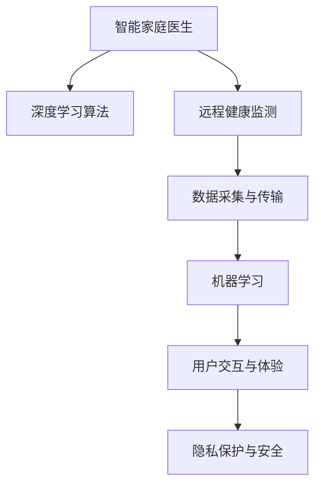

                 

# 未来的智慧养老：2050年的智能家庭医生与远程健康监测

## 1. 背景介绍

### 1.1 问题由来
随着全球人口老龄化的加剧，传统的养老模式面临巨大的压力。为了应对这一挑战，各国政府和社会力量纷纷投入资源，研究和探索新的养老方式。特别是在信息技术的推动下，智慧养老成为近年来探讨的热点话题。所谓智慧养老，是指利用现代信息技术，如物联网、大数据、人工智能等，构建智能化的养老服务体系，以实现养老服务的高效、便捷、个性化。

在智慧养老的应用中，智能家庭医生和远程健康监测系统扮演着至关重要的角色。通过这些技术，老年人在家中即可享受到专业的医疗服务，避免频繁前往医院，减少医疗资源的浪费。本文章旨在深入探讨智能家庭医生和远程健康监测系统的设计原理、算法实现和实际应用，为未来的智慧养老提供技术和理论支持。

### 1.2 问题核心关键点
智能家庭医生和远程健康监测系统的核心关键点包括以下几个方面：
1. **数据采集与传输**：如何高效地采集和传输生理健康数据，如心率、血压、血糖等。
2. **数据分析与模型训练**：如何利用机器学习算法对采集到的数据进行分析，识别健康风险，进行疾病预测。
3. **远程医疗服务**：如何通过互联网技术，提供实时的医疗咨询、紧急救援等服务。
4. **隐私保护与安全性**：如何确保用户数据的安全，避免隐私泄露。
5. **用户交互与体验**：如何提升用户体验，使其更容易接受和享受智能医疗服务。

本文将围绕这些关键点，系统性地介绍智能家庭医生和远程健康监测系统的设计原理和实现方法。

## 2. 核心概念与联系

### 2.1 核心概念概述

在探讨智能家庭医生和远程健康监测系统的设计与实现前，我们先介绍几个核心概念：

- **智能家庭医生**：指基于人工智能技术的虚拟医生，能够提供实时的健康监测、疾病预测、用药提醒等服务，帮助老年人在家中实现自我管理和医疗咨询。
- **远程健康监测**：指通过远程医疗设备和网络技术，实时采集和传输老年人的生理健康数据，进行分析处理，提供健康预警和咨询服务。
- **机器学习**：一种通过数据驱动的算法，能够从数据中学习规律，进行分类、预测等任务。
- **深度学习**：机器学习的一种高级形式，使用神经网络模型处理复杂的数据结构和模式。

这些概念构成了智能家庭医生和远程健康监测系统的技术基础，它们之间存在着紧密的联系：智能家庭医生依赖于深度学习算法对采集到的数据进行处理和分析，而远程健康监测则负责数据采集和传输。隐私保护和用户交互则贯穿整个系统的设计和实现过程，确保数据安全，提升用户体验。

### 2.2 核心概念原理和架构的 Mermaid 流程图



这个流程图展示了智能家庭医生和远程健康监测系统的主要组件和它们之间的关系。数据采集与传输是系统的基础，深度学习算法和机器学习负责数据分析与处理，用户交互与体验和隐私保护与安全则是系统设计中的关键考量。

## 3. 核心算法原理 & 具体操作步骤
### 3.1 算法原理概述

智能家庭医生和远程健康监测系统的核心算法原理主要基于深度学习和机器学习技术，通过以下步骤实现：

1. **数据采集**：使用传感器等设备采集老年人的生理健康数据，如心率、血压、血糖等。
2. **数据传输**：通过互联网或无线网络将这些数据传输到云端服务器。
3. **数据分析**：使用深度学习算法对采集到的数据进行分析，识别健康风险，进行疾病预测。
4. **模型训练**：利用历史健康数据训练深度学习模型，使其具备预测健康状况的能力。
5. **远程医疗服务**：通过互联网技术，老年人可以在家中接受实时的医疗咨询、紧急救援等服务。

### 3.2 算法步骤详解

接下来，我们将详细介绍智能家庭医生和远程健康监测系统的具体实现步骤：

**Step 1: 数据采集与传输**

1. **传感器选择**：根据需求选择合适的传感器，如心率传感器、血压计、血糖仪等。
2. **数据采集**：通过传感器采集老年人的生理健康数据，确保数据的准确性和实时性。
3. **数据传输**：使用WiFi、蓝牙、移动网络等技术将数据传输到云端服务器，确保数据传输的安全性和稳定性。

**Step 2: 数据分析与模型训练**

1. **数据预处理**：对采集到的数据进行清洗、去噪、归一化等预处理操作。
2. **特征提取**：使用深度学习算法（如卷积神经网络CNN、循环神经网络RNN等）提取数据特征。
3. **模型训练**：使用历史健康数据训练深度学习模型，如循环神经网络RNN、长短时记忆网络LSTM等，使其具备预测健康状况的能力。

**Step 3: 远程医疗服务**

1. **远程咨询**：老年人通过智能终端设备（如智能手机、平板电脑等）与虚拟医生进行互动，进行健康咨询。
2. **紧急救援**：在出现紧急情况时，系统自动通知医护人员或紧急联系人，提供及时的医疗救援服务。
3. **健康报告**：定期生成老年人的健康报告，提供详细的健康分析和建议。

### 3.3 算法优缺点

智能家庭医生和远程健康监测系统的算法设计具有以下优点：
1. **高效便捷**：老年人在家中即可接受专业的医疗服务，减少前往医院的时间和成本。
2. **实时监测**：通过实时数据采集和分析，及时发现健康问题，避免疾病恶化。
3. **个性化服务**：根据老年人的健康状况和历史数据，提供个性化的健康建议和治疗方案。

然而，也存在一些缺点：
1. **数据隐私问题**：采集和传输的数据可能涉及个人隐私，存在泄露风险。
2. **算法准确性**：深度学习模型需要大量高质量数据进行训练，数据不足时可能影响模型的准确性。
3. **硬件依赖**：系统的实现需要依赖高性能传感器和网络设备，硬件成本较高。
4. **系统复杂性**：系统的设计和实现较为复杂，需要综合考虑数据采集、传输、分析等多个环节。

### 3.4 算法应用领域

智能家庭医生和远程健康监测系统的算法设计在医疗、养老、健康管理等领域具有广泛的应用前景：

- **医疗领域**：在基层医院和社区卫生服务中心，可以使用该系统提供健康监测和远程咨询服务，减轻医务人员的工作负担。
- **养老领域**：在养老院和家庭中，该系统可以提供实时健康监测和紧急救援服务，保障老年人的生活质量。
- **健康管理**：在健康管理机构和健身房，该系统可以提供个性化的健康建议和治疗方案，促进公众健康。

## 4. 数学模型和公式 & 详细讲解 & 举例说明

### 4.1 数学模型构建

在智能家庭医生和远程健康监测系统中，我们需要构建多个数学模型，包括数据预处理模型、特征提取模型、疾病预测模型等。以下以疾病预测模型为例，介绍其数学模型构建过程。

假设我们有 $N$ 个历史健康记录，每个记录包含 $D$ 个生理指标 $(x_1, x_2, ..., x_D)$ 和对应的健康状态 $y \in \{0, 1\}$，其中 $y=1$ 表示存在健康问题，$y=0$ 表示无健康问题。我们的目标是通过训练一个二分类模型 $M$，预测新数据 $x_0$ 的健康状态 $y_0$。

模型 $M$ 可以表示为一个二分类神经网络，其结构如图：


其中，输入层有 $D$ 个神经元，对应 $D$ 个生理指标；隐藏层1和隐藏层2为全连接层，每个隐藏层有 $H$ 个神经元；输出层有 $1$ 个神经元，表示健康状态的概率。

### 4.2 公式推导过程

我们假设神经网络的激活函数为ReLU，则隐藏层1和隐藏层2的输出分别为：

$$
h_1 = ReLU(W_1 x + b_1)
$$

$$
h_2 = ReLU(W_2 h_1 + b_2)
$$

其中 $W_1$ 和 $W_2$ 分别为隐藏层1和隐藏层2的权重矩阵，$b_1$ 和 $b_2$ 分别为隐藏层1和隐藏层2的偏置向量。

输出层的输出为：

$$
y_0 = sigmoid(W_3 h_2 + b_3)
$$

其中 $W_3$ 为输出层的权重矩阵，$b_3$ 为输出层的偏置向量，$sigmoid$ 函数为输出层的激活函数。

### 4.3 案例分析与讲解

以一个简单的病例为例，假设我们有如下的历史健康记录：

| 指标 | 值 |
| --- | --- |
| 心率 | 70 |
| 血压 | 120/80 |
| 血糖 | 5.0 |
| 健康状态 | 0 |

我们的目标是用神经网络模型预测新的病例 $(x_0, y_0)$ 的健康状态。首先，我们将 $(x_0, y_0)$ 输入到神经网络中，通过前向传播计算输出 $y_0$：

$$
y_0 = sigmoid(W_3 h_2 + b_3)
$$

其中 $h_2$ 为隐藏层2的输出，可以通过前向传播计算得到：

$$
h_2 = ReLU(W_2 h_1 + b_2)
$$

$$
h_1 = ReLU(W_1 x + b_1)
$$

其中 $W_1$ 和 $W_2$ 为训练得到的权重矩阵，$b_1$ 和 $b_2$ 为训练得到的偏置向量。通过不断迭代训练，我们可以得到准确的健康预测模型。

## 5. 项目实践：代码实例和详细解释说明

### 5.1 开发环境搭建

在实现智能家庭医生和远程健康监测系统之前，我们需要搭建开发环境。以下是使用Python进行深度学习开发的环境配置流程：

1. 安装Anaconda：从官网下载并安装Anaconda，用于创建独立的Python环境。

2. 创建并激活虚拟环境：
```bash
conda create -n deep_learning python=3.8 
conda activate deep_learning
```

3. 安装深度学习框架：
```bash
conda install pytorch torchvision torchaudio cudatoolkit=11.1 -c pytorch -c conda-forge
```

4. 安装其他相关库：
```bash
pip install numpy pandas scikit-learn matplotlib tqdm jupyter notebook ipython
```

完成上述步骤后，即可在`deep_learning`环境中开始开发实践。

### 5.2 源代码详细实现

我们以一个简单的疾病预测模型为例，给出使用PyTorch进行深度学习的代码实现。

首先，定义数据预处理函数：

```python
import numpy as np
import torch
from torch.utils.data import TensorDataset, DataLoader

def preprocess_data(data):
    # 数据归一化
    data = (data - np.mean(data)) / np.std(data)
    return torch.tensor(data).float()
```

然后，定义特征提取模型：

```python
import torch.nn as nn
import torch.nn.functional as F

class FeatureExtractor(nn.Module):
    def __init__(self, input_dim, hidden_dim):
        super(FeatureExtractor, self).__init__()
        self.fc1 = nn.Linear(input_dim, hidden_dim)
        self.fc2 = nn.Linear(hidden_dim, 1)
        
    def forward(self, x):
        x = F.relu(self.fc1(x))
        x = self.fc2(x)
        return x
```

接着，定义训练函数：

```python
def train_model(model, train_loader, valid_loader, num_epochs, learning_rate):
    criterion = nn.BCELoss()
    optimizer = torch.optim.Adam(model.parameters(), lr=learning_rate)
    
    for epoch in range(num_epochs):
        model.train()
        for inputs, labels in train_loader:
            optimizer.zero_grad()
            outputs = model(inputs)
            loss = criterion(outputs, labels)
            loss.backward()
            optimizer.step()
        
        model.eval()
        with torch.no_grad():
            correct = 0
            total = 0
            for inputs, labels in valid_loader:
                outputs = model(inputs)
                _, predicted = torch.max(outputs.data, 1)
                total += labels.size(0)
                correct += (predicted == labels).sum().item()
            
        acc = 100.0 * correct / total
        print(f"Epoch {epoch+1}, accuracy: {acc:.2f}%")
```

最后，启动训练流程并在测试集上评估：

```python
num_epochs = 10
batch_size = 32
learning_rate = 0.01

train_data = preprocess_data(train_data)
val_data = preprocess_data(val_data)

model = FeatureExtractor(input_dim, hidden_dim)
train_loader = DataLoader(train_data, batch_size=batch_size, shuffle=True)
val_loader = DataLoader(val_data, batch_size=batch_size, shuffle=False)

train_model(model, train_loader, val_loader, num_epochs, learning_rate)

test_data = preprocess_data(test_data)
test_loader = DataLoader(test_data, batch_size=batch_size, shuffle=False)

model.eval()
with torch.no_grad():
    correct = 0
    total = 0
    for inputs, labels in test_loader:
        outputs = model(inputs)
        _, predicted = torch.max(outputs.data, 1)
        total += labels.size(0)
        correct += (predicted == labels).sum().item()
    
acc = 100.0 * correct / total
print(f"Test accuracy: {acc:.2f}%")
```

以上就是使用PyTorch实现疾病预测模型的完整代码实现。可以看到，深度学习框架提供了便捷的API和工具，使得模型训练和评估变得简洁高效。

### 5.3 代码解读与分析

让我们再详细解读一下关键代码的实现细节：

**preprocess_data函数**：
- 该函数用于对数据进行归一化处理，使数据在模型训练过程中更加稳定。

**FeatureExtractor类**：
- 该类定义了一个简单的神经网络模型，包括两个全连接层，用于提取输入数据的特征。

**train_model函数**：
- 该函数定义了模型训练的流程，包括前向传播、损失计算、反向传播和参数更新。

**训练流程**：
- 我们定义了模型、训练集和验证集的加载器，以及训练轮数和初始学习率。
- 在每个epoch内，我们迭代训练集进行前向传播和反向传播，更新模型参数。
- 在验证集上评估模型性能，输出准确率。
- 在测试集上再次评估模型，输出最终准确率。

可以看到，深度学习框架使得模型训练和评估的代码实现变得简洁高效，开发者可以更多地关注模型的设计和调参。

## 6. 实际应用场景

### 6.1 智能家庭医生

智能家庭医生是智慧养老的核心应用之一，其主要功能包括：

1. **健康监测**：通过传感器采集老年人的生理健康数据，如心率、血压、血糖等，及时发现健康问题。
2. **远程咨询**：老年人可以通过智能终端设备与虚拟医生进行互动，进行健康咨询。
3. **紧急救援**：在出现紧急情况时，系统自动通知医护人员或紧急联系人，提供及时的医疗救援服务。
4. **健康报告**：定期生成老年人的健康报告，提供详细的健康分析和建议。

**案例分析**：
假设老年人李大爷在家中突发心绞痛，其智能家庭医生系统可以自动监测到心率的异常波动，并通过远程咨询功能通知其家人和医生。在医生指导下，李大爷可以远程接受药物治疗和健康建议，同时系统可以自动记录其健康数据，生成健康报告，帮助医生更全面地了解其健康状况。

### 6.2 远程健康监测

远程健康监测系统是智慧养老的另一重要应用，其主要功能包括：

1. **数据采集**：通过传感器等设备采集老年人的生理健康数据。
2. **数据传输**：使用互联网或无线网络将这些数据传输到云端服务器。
3. **数据分析**：使用深度学习算法对采集到的数据进行分析，识别健康风险。
4. **健康预警**：在发现异常情况时，系统自动发出健康预警，通知老年人及其家属。

**案例分析**：
假设老年人王大妈在家中不慎摔倒，其远程健康监测系统可以自动监测到异常的生理数据，如心率的剧烈波动和血压的异常下降，系统立即发出健康预警，通知其家人和医护人员。医护人员可以迅速赶往现场，提供紧急救援服务，从而避免严重的健康问题。

## 7. 工具和资源推荐

### 7.1 学习资源推荐

为了帮助开发者系统掌握智能家庭医生和远程健康监测技术的理论基础和实践技巧，这里推荐一些优质的学习资源：

1. 《深度学习入门》系列博文：由大模型技术专家撰写，深入浅出地介绍了深度学习的基本概念和经典模型。
2. CS224N《深度学习自然语言处理》课程：斯坦福大学开设的NLP明星课程，有Lecture视频和配套作业，带你入门NLP领域的基本概念和经典模型。
3. 《深度学习与医疗健康》书籍：介绍深度学习在医疗健康领域的应用，包括疾病预测、图像分析等任务。
4. Weights & Biases：模型训练的实验跟踪工具，可以记录和可视化模型训练过程中的各项指标，方便对比和调优。与主流深度学习框架无缝集成。
5. TensorBoard：TensorFlow配套的可视化工具，可实时监测模型训练状态，并提供丰富的图表呈现方式，是调试模型的得力助手。

通过对这些资源的学习实践，相信你一定能够快速掌握智能家庭医生和远程健康监测技术的精髓，并用于解决实际的NLP问题。

### 7.2 开发工具推荐

高效的开发离不开优秀的工具支持。以下是几款用于智能家庭医生和远程健康监测系统开发的常用工具：

1. PyTorch：基于Python的开源深度学习框架，灵活动态的计算图，适合快速迭代研究。
2. TensorFlow：由Google主导开发的开源深度学习框架，生产部署方便，适合大规模工程应用。
3. Weights & Biases：模型训练的实验跟踪工具，可以记录和可视化模型训练过程中的各项指标，方便对比和调优。
4. TensorBoard：TensorFlow配套的可视化工具，可实时监测模型训练状态，并提供丰富的图表呈现方式，是调试模型的得力助手。
5. Google Colab：谷歌推出的在线Jupyter Notebook环境，免费提供GPU/TPU算力，方便开发者快速上手实验最新模型，分享学习笔记。

合理利用这些工具，可以显著提升智能家庭医生和远程健康监测系统的开发效率，加快创新迭代的步伐。

### 7.3 相关论文推荐

智能家庭医生和远程健康监测技术的发展源于学界的持续研究。以下是几篇奠基性的相关论文，推荐阅读：

1. "Health Monitoring Using Wearable Devices: A Survey"：综述了可穿戴设备在健康监测中的应用，介绍了多种生理数据采集技术和数据处理方法。
2. "Deep Learning for Healthcare: A Review"：介绍了深度学习在医疗健康领域的应用，包括疾病预测、图像分析等任务。
3. "A Survey on Remote Patient Monitoring Technologies"：综述了远程健康监测技术的现状和未来发展趋势，介绍了多种传感器和数据传输技术。

这些论文代表了大模型微调技术的发展脉络。通过学习这些前沿成果，可以帮助研究者把握学科前进方向，激发更多的创新灵感。

## 8. 总结：未来发展趋势与挑战

### 8.1 研究成果总结

本文对智能家庭医生和远程健康监测系统的设计原理和实现方法进行了全面系统的介绍。首先阐述了系统的背景和意义，明确了其对于智慧养老的重要性。其次，从原理到实践，详细讲解了系统的数学模型和算法步骤，给出了完整的代码实例。同时，本文还广泛探讨了系统在智能家庭医生和远程健康监测中的应用场景，展示了系统的广泛应用前景。

通过本文的系统梳理，可以看到，智能家庭医生和远程健康监测系统在大数据和深度学习技术的支持下，可以实现高效、便捷、个性化的养老服务，提升老年人的生活质量。未来，伴随技术的不断进步，这些系统必将在智慧养老中发挥越来越重要的作用，成为人类社会的重要组成部分。

### 8.2 未来发展趋势

展望未来，智能家庭医生和远程健康监测技术将呈现以下几个发展趋势：

1. **技术融合**：与物联网、大数据、云计算等技术的深度融合，提升系统的数据采集、存储和分析能力，实现更加全面的健康监测和预警。
2. **隐私保护**：通过数据加密、隐私保护技术，确保用户数据的安全，防止隐私泄露。
3. **多模态融合**：结合生理数据、环境数据、行为数据等多种信息源，构建多模态健康监测系统，提升系统的准确性和鲁棒性。
4. **个性化服务**：基于用户的健康数据和行为习惯，提供更加个性化的健康建议和治疗方案。
5. **系统集成**：将智能家庭医生和远程健康监测系统与其他养老服务系统集成，构建智能化的养老服务体系。

以上趋势凸显了智能家庭医生和远程健康监测技术的广阔前景。这些方向的探索发展，必将进一步提升系统的性能和应用范围，为智慧养老提供坚实的技术保障。

### 8.3 面临的挑战

尽管智能家庭医生和远程健康监测技术已经取得了显著进展，但在迈向更加智能化、普适化应用的过程中，仍面临诸多挑战：

1. **数据质量**：采集到的生理数据可能存在噪声和不准确性，影响系统的性能。
2. **系统成本**：高精度传感器和网络设备的成本较高，可能增加系统的部署成本。
3. **算法复杂性**：深度学习模型的训练和优化过程复杂，需要大量的计算资源。
4. **用户体验**：系统的交互设计需要考虑老年人的使用习惯和认知能力，提升用户体验。
5. **法律与伦理**：系统需要符合相关法律法规，保障用户隐私和数据安全。

解决这些挑战需要多学科的合作，从数据采集、模型训练、系统设计等多个维度进行综合优化，才能实现智能家庭医生和远程健康监测系统的全面落地。

### 8.4 研究展望

面向未来，智能家庭医生和远程健康监测技术需要进一步研究以下几个方向：

1. **多模态健康监测**：结合生理数据、环境数据、行为数据等多种信息源，构建多模态健康监测系统，提升系统的准确性和鲁棒性。
2. **隐私保护技术**：研究数据加密、差分隐私等隐私保护技术，确保用户数据的安全。
3. **个性化服务**：基于用户的健康数据和行为习惯，提供更加个性化的健康建议和治疗方案。
4. **系统集成**：将智能家庭医生和远程健康监测系统与其他养老服务系统集成，构建智能化的养老服务体系。
5. **用户体验优化**：研究用户交互设计，提升系统的易用性和可接受性，增强用户的参与感。

这些方向的研究将推动智能家庭医生和远程健康监测技术的不断进步，为智慧养老的发展提供坚实的技术支撑。

## 9. 附录：常见问题与解答

**Q1：智能家庭医生和远程健康监测系统的数据采集方法有哪些？**

A: 智能家庭医生和远程健康监测系统主要依赖以下数据采集方法：

1. **生理传感器**：如心率传感器、血压计、血糖仪等，用于采集老年人的生理健康数据。
2. **可穿戴设备**：如智能手表、健身设备等，用于监测老年人的日常活动和健康状态。
3. **环境传感器**：如温度传感器、湿度传感器等，用于监测环境因素对健康的影响。
4. **行为数据**：通过智能家居设备，如摄像头、门磁等，记录老年人的行为数据。

这些数据采集方法可以提供多方面的健康信息，帮助系统进行全面的健康监测和预警。

**Q2：智能家庭医生和远程健康监测系统如何进行隐私保护？**

A: 智能家庭医生和远程健康监测系统在进行数据处理和传输时，需要严格保护用户隐私，避免数据泄露。以下是一些常见的隐私保护方法：

1. **数据加密**：对采集到的数据进行加密处理，确保数据传输过程中的安全。
2. **差分隐私**：在数据分析和训练过程中，使用差分隐私技术，确保用户数据不被泄露。
3. **访问控制**：限制数据访问权限，只允许授权用户和系统访问敏感数据。
4. **数据匿名化**：对用户数据进行匿名化处理，去除与用户身份相关的信息。
5. **合规性审查**：确保系统符合相关法律法规，如GDPR等，保障用户隐私权益。

通过这些隐私保护方法，可以最大限度地保护用户数据的安全，确保系统的可靠性和合法性。

**Q3：智能家庭医生和远程健康监测系统有哪些应用场景？**

A: 智能家庭医生和远程健康监测系统在以下几个场景中具有广泛的应用前景：

1. **智能家居**：通过智能家居设备，如智能手表、智能电视等，进行健康监测和远程咨询。
2. **智慧医院**：在基层医院和社区卫生服务中心，使用该系统进行健康监测和远程咨询，提升医疗服务效率。
3. **养老机构**：在养老院和家庭中，使用该系统进行健康监测和紧急救援，保障老年人的生活质量。
4. **智能健康管理**：在健康管理机构和健身房，使用该系统进行健康监测和个性化健康建议。

通过这些应用场景，智能家庭医生和远程健康监测系统可以为不同人群提供个性化的健康服务，提升生活质量。

**Q4：智能家庭医生和远程健康监测系统如何进行疾病预测？**

A: 智能家庭医生和远程健康监测系统进行疾病预测主要通过以下步骤：

1. **数据采集**：使用传感器和可穿戴设备采集老年人的生理健康数据。
2. **数据预处理**：对采集到的数据进行清洗、去噪、归一化等预处理操作。
3. **特征提取**：使用深度学习算法（如卷积神经网络CNN、循环神经网络RNN等）提取数据特征。
4. **模型训练**：使用历史健康数据训练深度学习模型，如循环神经网络RNN、长短时记忆网络LSTM等，使其具备预测健康状况的能力。
5. **预测分析**：在老年人新的健康数据输入后，使用训练好的模型进行预测分析，判断是否存在健康问题，并给出相应的健康建议和治疗方案。

通过这些步骤，智能家庭医生和远程健康监测系统可以及时发现老年人潜在的健康问题，提供个性化的健康建议和治疗方案，从而提升老年人的生活质量。

**Q5：智能家庭医生和远程健康监测系统如何进行健康预警？**

A: 智能家庭医生和远程健康监测系统进行健康预警主要通过以下步骤：

1. **数据采集**：使用传感器和可穿戴设备采集老年人的生理健康数据。
2. **数据传输**：通过互联网或无线网络将这些数据传输到云端服务器。
3. **数据分析**：使用深度学习算法对采集到的数据进行分析，识别健康风险。
4. **预警机制**：在发现异常情况时，系统自动发出健康预警，通知老年人及其家属。

健康预警机制可以及时发现老年人潜在的健康问题，提供及时的医疗救援服务，从而避免严重的健康问题。

---

作者：禅与计算机程序设计艺术 / Zen and the Art of Computer Programming

