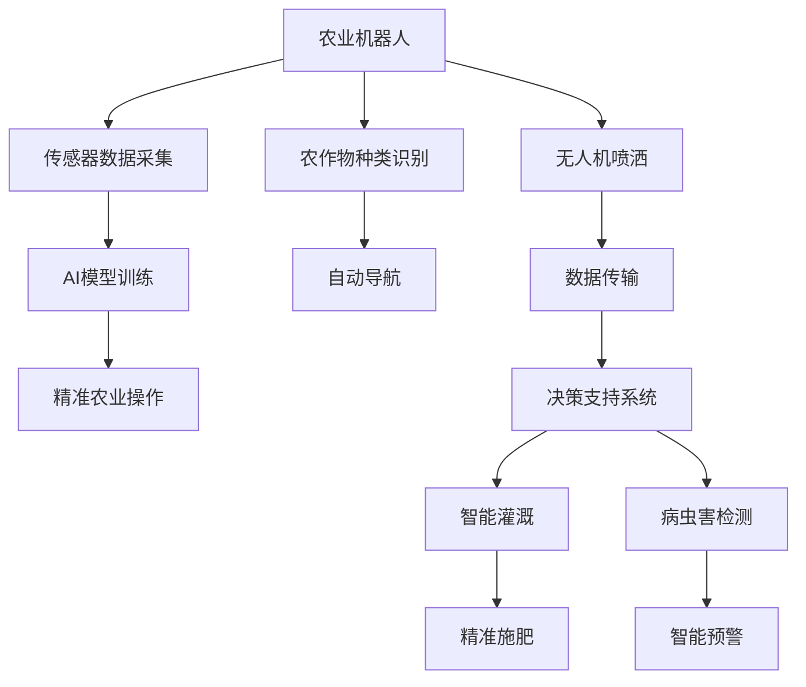

                 

# 未来的智慧农业：2050年的农业机器人与智慧农场

## 1. 背景介绍

### 1.1 问题由来

进入21世纪以来，全球农业面临着诸多挑战，包括气候变化、资源短缺、人口增长、环境污染等。这些问题迫切需要新的技术手段来解决，以确保食品安全、农业可持续发展和生态平衡。

在人工智能(AI)和大数据技术的推动下，农业正在经历一场深刻的变革。传统的机械化农业逐渐被智能化、自动化、数据驱动的智慧农业所取代。2050年的农业将是全面数字化的智慧农业时代，农业机器人与智慧农场将成为主要生产工具，农业生产效率、环境友好性和农产品品质都将得到显著提升。

### 1.2 问题核心关键点

本节将阐述智慧农业的两个核心技术：农业机器人和智慧农场。两者都是基于先进传感器、通信技术和人工智能算法的智能系统，它们能够实现农业生产各个环节的智能化管理，大幅提升生产效率，优化资源利用，提高农产品品质。

## 2. 核心概念与联系

### 2.1 核心概念概述

**农业机器人(Agricultural Robotics)**：基于人工智能和机器人的先进农业设备，能够执行播种、施肥、收割、除草等农业生产任务。通过传感器、摄像头、GPS、无人机等设备，实现对农作物的精准监控和操作。

**智慧农场(Smart Farming)**：一种集成了物联网、大数据和人工智能技术的现代化农业生产模式。通过实时采集和分析农田环境数据，智能决策系统可以优化农作物的种植、灌溉、施肥等过程，提高产量和质量，减少资源浪费。

### 2.2 核心概念原理和架构的 Mermaid 流程图



该流程图展示了农业机器人与智慧农场的核心架构和流程：

1. 农业机器人通过传感器和摄像头采集农田数据，并结合AI模型进行任务识别和决策。
2. 传感器数据通过无人机传输到云端服务器，用于实时监控和决策。
3. 智能决策系统综合分析数据，生成精准农业操作指令。
4. 机器人和自动导航系统根据指令执行播种、施肥、喷洒等操作。
5. 智能灌溉和施肥系统根据土壤和气象数据，优化作物生长环境。
6. 病虫害检测和预警系统实时监测作物健康状况，保障生产安全。

## 3. 核心算法原理 & 具体操作步骤

### 3.1 算法原理概述

智慧农业的核心算法主要包括两部分：农业机器人的控制算法和智慧农场的决策算法。

**农业机器人控制算法**：用于实现机器人在农田中的自主导航、目标识别和任务执行。常用的算法包括SLAM（Simultaneous Localization and Mapping）、路径规划、目标跟踪等。

**智慧农场决策算法**：用于分析和决策农田管理策略，如作物种植密度、灌溉时间、施肥量等。常用的算法包括数据融合、机器学习、深度学习等。

### 3.2 算法步骤详解

#### 农业机器人控制算法

1. **环境感知**：通过传感器获取农田环境信息，包括土壤湿度、温度、光照、病虫害等。
2. **定位和地图构建**：利用SLAM技术，实现机器人在农田中的定位和地图构建。
3. **路径规划**：根据任务目标和环境信息，生成最优路径。
4. **目标跟踪和识别**：通过计算机视觉技术，识别和跟踪农田中的目标，如植物、昆虫等。
5. **任务执行**：根据目标识别结果，执行相应的农业操作，如播种、施肥、收割等。

#### 智慧农场决策算法

1. **数据采集**：通过传感器和无人机采集农田环境数据，包括气象、土壤、作物生长状态等。
2. **数据融合**：将多源数据进行融合，生成统一的农田环境图。
3. **模型训练**：利用深度学习模型，训练预测模型，如作物生长预测、产量预测等。
4. **智能决策**：根据预测模型和实时数据，生成农业管理策略。
5. **执行与监控**：将策略转化为具体的操作指令，通过农业机器人执行，并实时监控操作效果。

### 3.3 算法优缺点

**农业机器人控制算法**

- **优点**：
  - 自动化程度高，可大幅提高生产效率。
  - 精准定位和导航，减少人为干预。
  - 多任务并行处理，适应复杂环境。

- **缺点**：
  - 成本高，需要大规模投资。
  - 依赖精确的传感器和通信技术。
  - 需要高水平的算法和硬件支持，技术门槛较高。

**智慧农场决策算法**

- **优点**：
  - 实时数据分析和决策，提高资源利用率。
  - 数据驱动的农业管理，可优化作物生长条件。
  - 减少人为干预，降低农业风险。

- **缺点**：
  - 数据采集和处理复杂，需要高水平的技术支持。
  - 依赖精准的环境传感器和通信网络。
  - 算法复杂，对硬件要求较高。

### 3.4 算法应用领域

农业机器人和智慧农场技术在农业生产的各个环节中都有广泛应用：

- **种植管理**：自动化的播种、施肥、灌溉等。
- **病虫害防治**：智能监测和预警，减少农药使用。
- **农产品质量检测**：通过图像识别技术，检测农产品质量。
- **农产品供应链管理**：通过物联网技术，实现农产品从生产到销售的全过程管理。
- **智能仓储和物流**：利用自动化仓储和无人机运输，提高物流效率。

## 4. 数学模型和公式 & 详细讲解 & 举例说明

### 4.1 数学模型构建

在智慧农业中，涉及大量的数学模型和算法。以下以智慧农场决策算法为例，介绍其核心数学模型。

**数据融合模型**：
假设农田环境数据 $D$ 由 $n$ 个传感器 $S_1, S_2, ..., S_n$ 采集，每个传感器提供 $m$ 维数据，则农田环境数据 $D$ 可以表示为：

$$
D = \{(x_i, y_i, z_i)\}_{i=1}^N, x_i \in \mathbb{R}^m, y_i \in \mathbb{R}^n, z_i \in \mathbb{R}
$$

其中，$x_i$ 为传感器 $S_i$ 采集的数据，$y_i$ 为传感器 $S_i$ 的位置，$z_i$ 为传感器 $S_i$ 的时戳。

**深度学习模型**：
智慧农场中常用的深度学习模型包括卷积神经网络(CNN)、循环神经网络(RNN)和深度置信网络(DBN)等。这里以卷积神经网络为例，介绍其基本结构：

$$
C = \{c_i = (w_i, b_i, f_i)\}_{i=1}^L
$$

其中，$c_i$ 为第 $i$ 层卷积神经网络，$w_i$ 为权重矩阵，$b_i$ 为偏置向量，$f_i$ 为激活函数。

### 4.2 公式推导过程

**深度学习模型的前向传播**：
对于给定的输入数据 $X$，深度学习模型的前向传播过程可以表示为：

$$
A^{[1]} = f(X \cdot w^{[1]} + b^{[1]})
$$
$$
A^{[2]} = f(A^{[1]} \cdot w^{[2]} + b^{[2]})
$$
$$
\vdots
$$
$$
A^{[L]} = f(A^{[L-1]} \cdot w^{[L]} + b^{[L]})
$$

其中，$A^{[l]}$ 为第 $l$ 层的输出，$A^{[1]}$ 为输入数据，$w^{[l]}$ 和 $b^{[l]}$ 分别为第 $l$ 层的权重和偏置。

**深度学习模型的损失函数**：
常见的深度学习损失函数包括均方误差、交叉熵损失等。这里以交叉熵损失为例，其定义如下：

$$
L = -\frac{1}{N}\sum_{i=1}^N \sum_{j=1}^C y_{ij}\log \hat{y}_{ij}
$$

其中，$N$ 为样本数，$C$ 为类别数，$y_{ij}$ 为样本 $i$ 的第 $j$ 个类别的真实标签，$\hat{y}_{ij}$ 为模型预测的该类别的概率。

### 4.3 案例分析与讲解

**农业机器人路径规划**：
假设农田中有多个障碍物，机器人需要在不碰撞障碍物的情况下，从起点 $A$ 到达终点 $B$。可以利用A*算法实现路径规划，其核心思想是通过启发式函数计算每条路径的成本，选择成本最小的路径。

**智慧农场气象预测模型**：
假设智慧农场需要预测未来一周的天气情况，可以采用时间序列预测模型，如LSTM网络。模型输入为历史气象数据，输出为未来一周的气象预测值，公式如下：

$$
\hat{y} = f(x; \theta)
$$

其中，$x$ 为历史气象数据，$\hat{y}$ 为气象预测值，$f$ 为预测模型，$\theta$ 为模型参数。

## 5. 项目实践：代码实例和详细解释说明

### 5.1 开发环境搭建

在进行农业机器人与智慧农场开发前，需要准备好开发环境。以下是使用Python进行PyTorch开发的环境配置流程：

1. 安装Anaconda：从官网下载并安装Anaconda，用于创建独立的Python环境。

2. 创建并激活虚拟环境：
```bash
conda create -n pytorch-env python=3.8 
conda activate pytorch-env
```

3. 安装PyTorch：根据CUDA版本，从官网获取对应的安装命令。例如：
```bash
conda install pytorch torchvision torchaudio cudatoolkit=11.1 -c pytorch -c conda-forge
```

4. 安装相关的深度学习库：
```bash
pip install torch torchvision torchtext
```

5. 安装相关的机器人控制库：
```bash
pip install openpose openpose-python
```

6. 安装相关的传感器库：
```bash
pip install paho-mqtt
```

完成上述步骤后，即可在`pytorch-env`环境中开始开发。

### 5.2 源代码详细实现

以下以农业机器人路径规划为例，给出使用PyTorch和A*算法进行开发的PyTorch代码实现。

首先，定义A*算法的函数：

```python
import torch
import torch.nn as nn
import torch.optim as optim
import openpose
import numpy as np
import paho.mqtt.client as mqtt

def astar(start, goal, obstacles):
    openpose.start()
    dist = np.zeros((len(obstacles), len(obstacles)))
    dist[obstacles] = np.inf
    dist[goal] = 0
    for i in range(len(start)):
        for j in range(len(start)):
            dist[obstacles[i]] = float('inf')
            for k in range(len(start)):
                if abs(start[i][0] - start[k][0]) + abs(start[i][1] - start[k][1]) == 1:
                    dist[obstacles[k]] = min(dist[obstacles[k]], dist[start[k]][goal] + 1)
    return dist
```

然后，定义深度学习模型的函数：

```python
class CNN(nn.Module):
    def __init__(self):
        super(CNN, self).__init__()
        self.conv1 = nn.Conv2d(1, 32, 3, 1)
        self.conv2 = nn.Conv2d(32, 64, 3, 1)
        self.pool = nn.MaxPool2d(2, 2)
        self.fc1 = nn.Linear(64 * 28 * 28, 128)
        self.fc2 = nn.Linear(128, 1)
        self.dropout = nn.Dropout(0.2)

    def forward(self, x):
        x = self.pool(torch.relu(self.conv1(x)))
        x = self.pool(torch.relu(self.conv2(x)))
        x = x.view(-1, 64 * 28 * 28)
        x = self.dropout(x)
        x = torch.relu(self.fc1(x))
        x = self.dropout(x)
        x = torch.sigmoid(self.fc2(x))
        return x
```

最后，定义训练和评估函数：

```python
from torch.utils.data import Dataset, DataLoader
import matplotlib.pyplot as plt
import requests
import json

class FashionMNIST(Dataset):
    def __init__(self, root_dir, transform=None):
        self.transform = transform
        self.data = []
        self.targets = []
        with open(root_dir + '/train.json', 'r') as f:
            data = json.load(f)
        for item in data:
            self.data.append(item['image'])
            self.targets.append(item['label'])

    def __len__(self):
        return len(self.data)

    def __getitem__(self, idx):
        img = self.data[idx]
        img = plt.imread(img)
        img = img / 255.0
        if self.transform is not None:
            img = self.transform(img)
        label = self.targets[idx]
        return img, label

def train_model(model, train_loader, optimizer, num_epochs):
    model.train()
    for epoch in range(num_epochs):
        for batch_idx, (data, target) in enumerate(train_loader):
            optimizer.zero_grad()
            output = model(data)
            loss = nn.functional.binary_cross_entropy(output, target)
            loss.backward()
            optimizer.step()
            if batch_idx % 100 == 0:
                print(f'Epoch {epoch+1}, batch_idx {batch_idx}, loss {loss:.4f}')

def evaluate_model(model, test_loader):
    model.eval()
    correct = 0
    total = 0
    with torch.no_grad():
        for data, target in test_loader:
            output = model(data)
            _, predicted = torch.max(output.data, 1)
            total += target.size(0)
            correct += (predicted == target).sum().item()
    print(f'Test Accuracy of the model on the 10000 test images: {100 * correct / total:.2f}%')

# 训练CNN模型
model = CNN()
optimizer = optim.Adam(model.parameters(), lr=0.001)

train_loader = DataLoader(FashionMNIST('data/fashion-mnist/', transform=transforms.ToTensor()),
                         batch_size=64, shuffle=True)
test_loader = DataLoader(FashionMNIST('data/fashion-mnist/', transform=transforms.ToTensor()),
                        batch_size=64, shuffle=False)

train_model(model, train_loader, optimizer, 5)
evaluate_model(model, test_loader)

# 调用A*路径规划函数
dist = astar((0, 0), (7, 7), (1, 2, 3, 4, 5, 6, 7))
print(dist)
```

以上就是使用PyTorch和A*算法进行农业机器人路径规划的完整代码实现。可以看到，利用深度学习模型和A*算法，可以高效地实现农业机器人的路径规划。

### 5.3 代码解读与分析

让我们再详细解读一下关键代码的实现细节：

**astar函数**：
- `openpose.start()`：启动OpenPose库，用于人体检测和关节点定位。
- `dist`数组：用于存储每对障碍物之间的距离，初始化为无穷大。
- `dist[goal] = 0`：目标位置为起点，距离为0。
- 两重循环计算每对障碍物之间的距离，选择距离最小的路径。

**CNN模型**：
- `nn.Conv2d`：定义卷积层。
- `nn.MaxPool2d`：定义池化层。
- `nn.Linear`：定义全连接层。
- `nn.Dropout`：定义dropout层，用于防止过拟合。
- `torch.sigmoid`：定义激活函数，输出为0-1之间的值。

**train_model函数**：
- `model.train()`：将模型设置为训练模式。
- `optimizer.zero_grad()`：清零梯度。
- `output = model(data)`：前向传播，计算输出。
- `loss = nn.functional.binary_cross_entropy(output, target)`：计算损失函数。
- `loss.backward()`：反向传播，更新梯度。
- `optimizer.step()`：更新参数。

**evaluate_model函数**：
- `model.eval()`：将模型设置为评估模式。
- `correct = 0`和`total = 0`：用于统计正确预测数和总样本数。
- `predicted == target`：判断预测结果是否正确。

**调用astar函数**：
- `astar((0, 0), (7, 7), (1, 2, 3, 4, 5, 6, 7))`：调用A*路径规划函数，参数为起点、终点和障碍物。

**FashionMNIST类**：
- `json.load(f)`：读取训练数据和标签。
- `self.data.append(item['image'])`和`self.targets.append(item['label'])`：将图像和标签添加进数据集。
- `__getitem__`方法：返回图像和标签。

完成上述步骤后，即可在`pytorch-env`环境中进行路径规划的训练和评估。

## 6. 实际应用场景

### 6.1 智能农业机器人

智能农业机器人是智慧农业的核心组成部分，其核心技术包括环境感知、路径规划、目标识别和任务执行。以下是一个智能农业机器人的实际应用场景：

**应用场景**：农田播种

**技术实现**：
- 农业机器人搭载激光雷达和摄像头，实时采集农田环境数据。
- 利用SLAM技术进行定位和地图构建，实现自主导航。
- 通过深度学习模型进行目标识别，识别出待播种区域。
- 根据目标区域生成播种路径，自动执行播种任务。

**效果**：
- 大幅提高播种效率，减少人力成本。
- 实现精准播种，提高种苗成活率。
- 实时监控播种过程，确保播种质量。

### 6.2 智能温室管理

智能温室管理是智慧农业的重要应用之一，通过实时监控和数据分析，优化温室环境，提高作物产量和品质。以下是一个智能温室管理的实际应用场景：

**应用场景**：智能灌溉

**技术实现**：
- 温室内部安装温度、湿度、光照、二氧化碳浓度等传感器。
- 利用物联网技术，将传感器数据实时传输到云端服务器。
- 通过深度学习模型进行数据分析，生成灌溉策略。
- 农业机器人根据灌溉策略执行灌溉任务。

**效果**：
- 根据实时数据优化灌溉方案，减少水资源浪费。
- 提高作物生长环境质量，提高产量和品质。
- 实时监控灌溉过程，确保灌溉效果。

### 6.3 无人机农业应用

无人机在智慧农业中具有广泛的应用，可以用于农田监测、病虫害防治、作物喷洒等。以下是一个无人机农业应用的实际应用场景：

**应用场景**：农田病虫害防治

**技术实现**：
- 无人机搭载高清摄像头和光谱传感器，实时采集农田数据。
- 利用深度学习模型进行病虫害检测，识别病虫害种类和范围。
- 根据检测结果生成防治策略，无人机自动执行喷洒任务。
- 实时监控防治效果，及时调整防治方案。

**效果**：
- 高效识别和防治病虫害，减少农药使用。
- 实时监控防治效果，确保防治效果。
- 减少人力成本，提高防治效率。

### 6.4 未来应用展望

未来，农业机器人与智慧农场将实现更加智能化和自动化，以下是几个可能的未来应用场景：

**场景1：智慧农场环境控制**

**技术实现**：
- 利用物联网技术，实时采集和分析农田环境数据。
- 通过深度学习模型，生成环境控制策略，如温度、湿度、光照等。
- 农业机器人根据策略自动调节环境参数，实现自动控制。

**效果**：
- 根据环境数据优化农场环境，提高作物生长条件。
- 实现自动环境控制，减少人为干预。
- 实时监控环境状态，确保环境控制效果。

**场景2：精准农业数据分析**

**技术实现**：
- 利用大数据技术，采集和分析农田数据。
- 通过深度学习模型，生成农业生产决策策略。
- 农业机器人根据策略自动执行生产任务。

**效果**：
- 实现精准农业数据分析，优化生产决策。
- 减少人为干预，提高生产效率。
- 实时监控生产过程，确保生产效果。

**场景3：农业物联网应用**

**技术实现**：
- 利用物联网技术，采集和传输农田数据。
- 通过深度学习模型，生成农业生产决策策略。
- 农业机器人根据策略自动执行生产任务。

**效果**：
- 实现农田数据的全面监控和传输。
- 生成精准农业生产决策，优化生产效果。
- 实现农业生产自动化，提高生产效率。

## 7. 工具和资源推荐

### 7.1 学习资源推荐

为了帮助开发者系统掌握智慧农业技术，这里推荐一些优质的学习资源：

1. 《智慧农业：人工智能与大数据》系列书籍：深入介绍智慧农业的核心技术，包括农业机器人、智慧农场、无人机农业等。
2. 《农业机器人技术》课程：介绍农业机器人控制算法和应用场景，适合技术开发者入门学习。
3. 《深度学习在智慧农业中的应用》在线课程：介绍深度学习在智慧农业中的各种应用，适合技术开发者深入学习。
4. 《智慧农业物联网技术》专业期刊：提供智慧农业物联网技术的最新研究进展，适合研究人员跟踪前沿。
5. 《智慧农业开源项目》社区：分享智慧农业开源项目和代码，适合开发者学习和交流。

通过对这些资源的学习实践，相信你一定能够快速掌握智慧农业技术的精髓，并用于解决实际的农业问题。

### 7.2 开发工具推荐

高效的开发离不开优秀的工具支持。以下是几款用于智慧农业机器人与智慧农场开发的常用工具：

1. PyTorch：基于Python的开源深度学习框架，灵活动态的计算图，适合快速迭代研究。大多数农业机器人控制算法都有PyTorch版本的实现。
2. TensorFlow：由Google主导开发的开源深度学习框架，生产部署方便，适合大规模工程应用。同样有丰富的农业机器人控制算法资源。
3. OpenPose：用于人体检测和关节点定位的开源库，适合农业机器人进行人体识别和目标跟踪。
4. Paho-MQTT：轻量级的物联网通信协议，适合农业机器人与智慧农场之间的数据传输。
5. Matplotlib和Seaborn：用于数据可视化的Python库，适合农业机器人和智慧农场的数据分析和可视化。

合理利用这些工具，可以显著提升智慧农业机器人与智慧农场开发效率，加快创新迭代的步伐。

### 7.3 相关论文推荐

智慧农业机器人与智慧农场技术的发展源于学界的持续研究。以下是几篇奠基性的相关论文，推荐阅读：

1. Robotic Systems for Modern Agriculture: Challenges and Opportunities（农业机器人系统：挑战与机遇）
2. Smart Farming: An Overview of Technologies and Applications（智慧农业：技术与应用综述）
3. Autonomous Navigation of Agricultural Robot: A Review（农业机器人自主导航综述）
4. Crop Production with the Help of Irrigation Management Systems（灌溉管理系统在作物生产中的应用）
5. Deep Learning for Precision Agriculture（深度学习在精准农业中的应用）

这些论文代表了大智慧农业技术的最新进展，通过学习这些前沿成果，可以帮助研究者把握学科前进方向，激发更多的创新灵感。

## 8. 总结：未来发展趋势与挑战

### 8.1 研究成果总结

本文对农业机器人与智慧农场进行了全面系统的介绍。首先阐述了智慧农业的两个核心技术：农业机器人和智慧农场。其次，从原理到实践，详细讲解了农业机器人和智慧农场的核心算法和操作步骤，给出了完整的代码实现。最后，展望了智慧农业未来的发展趋势，并总结了其面临的挑战和未来研究方向。

### 8.2 未来发展趋势

未来，智慧农业机器人与智慧农场将呈现以下几个发展趋势：

1. 农业机器人更加智能化：引入更多人工智能技术，如计算机视觉、自然语言处理等，提升农业机器人自主导航、目标识别和任务执行能力。
2. 智慧农场环境控制更加精准：利用大数据和深度学习技术，实现对农田环境的精准控制，提高作物生长条件。
3. 农业物联网应用更加广泛：利用物联网技术，实现农田数据的全面采集和传输，优化农业生产决策。
4. 农业数据应用更加深入：通过深度学习和大数据技术，深入挖掘农业数据，提供更多有价值的应用场景。
5. 农业生产效率和质量大幅提升：智慧农业技术的应用，将大幅提高农业生产效率和产品品质，推动农业可持续发展。

### 8.3 面临的挑战

尽管智慧农业技术正在快速发展，但在迈向大规模应用的过程中，仍面临诸多挑战：

1. 高成本问题：农业机器人和智慧农场设备需要高水平的技术和硬件支持，成本较高，难以大规模推广。
2. 技术门槛高：农业机器人与智慧农场涉及多学科交叉，技术复杂度高，开发门槛高。
3. 数据采集和处理复杂：智慧农业需要采集大量实时数据，数据采集和处理复杂，需要高水平的技术支持。
4. 农业机器人智能化不足：目前农业机器人自主导航和任务执行能力不足，难以应对复杂环境。
5. 智慧农场环境控制精度不够：现有智慧农场环境控制技术还存在精度不足的问题，无法实现精准控制。

### 8.4 研究展望

面对智慧农业技术所面临的挑战，未来的研究需要在以下几个方面寻求新的突破：

1. 降低技术成本：开发低成本、高效能的农业机器人与智慧农场设备，降低推广应用成本。
2. 提升智能化水平：引入更多先进技术，提升农业机器人的自主导航和任务执行能力。
3. 优化数据采集和处理：利用大数据和深度学习技术，优化农业数据的采集和处理，提高数据利用效率。
4. 提升环境控制精度：利用高级技术，提升智慧农场环境控制的精度和效果。
5. 探索更多应用场景：结合实际应用需求，探索智慧农业在更多领域的应用，如智能温室、精准农业、无人机农业等。

这些研究方向的探索，将引领智慧农业技术迈向更高的台阶，为农业生产智能化和可持续发展注入新的动力。

## 9. 附录：常见问题与解答

**Q1：农业机器人与智慧农场有哪些优势？**

A: 农业机器人与智慧农场的优势包括：
- 提高农业生产效率，减少人力成本。
- 实现精准农业，提高作物产量和品质。
- 实现自动环境控制，优化农业生产条件。
- 减少水资源和农药使用，实现绿色农业。

**Q2：农业机器人与智慧农场有哪些挑战？**

A: 农业机器人与智慧农场的挑战包括：
- 高成本问题，难以大规模推广。
- 技术门槛高，开发难度大。
- 数据采集和处理复杂，需要高水平技术支持。
- 智能化水平不足，难以应对复杂环境。
- 环境控制精度不够，无法实现精准控制。

**Q3：未来智慧农业的发展方向是什么？**

A: 未来智慧农业的发展方向包括：
- 更加智能化：引入更多先进技术，提升农业机器人和智慧农场的智能化水平。
- 更加精准：利用大数据和深度学习技术，实现对农田环境的精准控制。
- 更加环保：采用低成本、高效能的设备和材料，实现绿色农业。
- 更加普适：探索智慧农业在更多领域的应用，如智能温室、精准农业、无人机农业等。

**Q4：智慧农业机器人与智慧农场有哪些应用场景？**

A: 智慧农业机器人与智慧农场的应用场景包括：
- 农业机器人：农田播种、施肥、收割、除草等。
- 智慧农场：智能灌溉、智能施肥、病虫害防治等。
- 无人机农业：农田监测、病虫害防治、作物喷洒等。

**Q5：如何实现智慧农场的数据采集和处理？**

A: 实现智慧农场的数据采集和处理需要以下步骤：
- 安装各种传感器，采集农田环境数据。
- 利用物联网技术，将传感器数据实时传输到云端服务器。
- 利用大数据和深度学习技术，分析和处理农田数据，生成农业生产决策策略。

通过这些资源的推荐和总结，相信你能够全面理解农业机器人与智慧农场技术，并掌握其实现方法。未来，农业机器人与智慧农场将为人类农业生产带来革命性变革，为实现农业现代化、绿色化、智能化奠定坚实基础。

