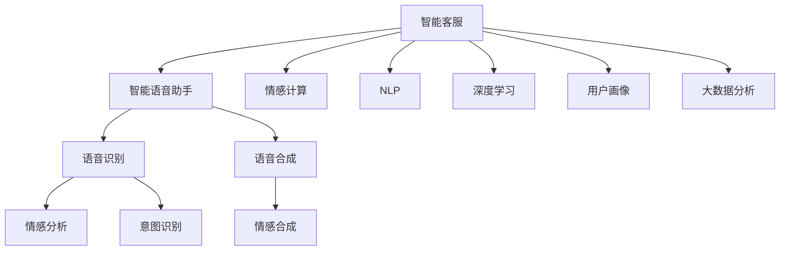

                 

# 未来的智能客服：2050年的智能语音助手与情感计算

> 关键词：
  智能客服, 智能语音助手, 情感计算, 自然语言处理(NLP), 深度学习, 用户画像, 大数据分析, 人机交互

## 1. 背景介绍

在过去的十年里，人工智能技术取得了显著的进展，其中智能客服领域更是经历了从基础聊天机器人到具有情感计算能力的智能语音助手的变革。然而，随着人工智能技术的不断成熟，智能客服系统也面临着越来越多的挑战。在未来，智能客服系统将借助情感计算技术，更加人性化和智能地为用户提供服务，从而成为2050年最具代表性的智能应用之一。本文将从情感计算技术、自然语言处理(NLP)、用户画像等多个角度，深入探讨未来智能客服的发展方向和应用前景。

## 2. 核心概念与联系

### 2.1 核心概念概述

为更好地理解未来智能客服的技术框架，本节将介绍几个核心概念：

- **智能客服**：一种基于人工智能技术的自动化客户服务系统，能够通过自然语言处理和情感计算等技术，提供智能化的问答和支持。
- **智能语音助手**：通过语音识别和语音合成技术，实现与用户的自然语言交流，并结合情感计算技术，提升用户互动体验的智能客服系统。
- **情感计算**：通过分析用户的语音、文本、表情等数据，推断用户情感状态，并根据情感状态调整服务策略的计算技术。
- **自然语言处理(NLP)**：利用人工智能技术，实现对自然语言的理解和生成，包括分词、词性标注、句法分析、语义理解等。
- **深度学习**：一种基于多层神经网络的机器学习技术，通过大量数据的训练，使机器具备自主学习的能力。
- **用户画像**：通过收集和分析用户的行为数据，构建用户特征模型，用于个性化推荐和精准营销等应用。
- **大数据分析**：通过收集和处理海量数据，从中发现规律和趋势，辅助决策支持的技术。

这些核心概念之间的关系可以通过以下Mermaid流程图来展示：



这个流程图展示出智能客服的核心技术组件及其相互联系：

1. 智能客服通过自然语言处理和情感计算等技术，提供智能化的问答和支持。
2. 智能语音助手通过语音识别和语音合成技术，实现与用户的自然语言交流。
3. 深度学习技术在智能客服系统中主要用于语义理解和生成，用户画像和大数据分析用于个性化推荐和精准营销。
4. 情感计算技术在智能客服系统中用于分析用户的情感状态，调整服务策略，提升用户互动体验。

这些核心概念共同构成了未来智能客服的技术框架，使其能够更好地适应用户需求，提供更高效、个性化的服务。

## 3. 核心算法原理 & 具体操作步骤
### 3.1 算法原理概述

未来智能客服系统基于情感计算技术和自然语言处理技术，通过深度学习模型对用户语音、文本、表情等数据进行分析和理解，从而实现智能化的客服服务。其核心算法包括语音识别、语音合成、情感分析、意图识别、语义理解等多个部分。

语音识别和语音合成是智能语音助手的核心功能，能够实现与用户的自然语言交流。语音识别将用户的语音转换为文本，语音合成则将文本转换为语音，通过二者实现用户与系统的双向沟通。情感分析则用于推断用户的情感状态，意图识别用于理解用户的意图，语义理解用于解析用户文本输入的语义内容。

情感计算是未来智能客服系统的关键技术之一。通过分析用户的语音、文本、表情等数据，推断用户的情感状态，系统能够动态调整服务策略，从而提升用户互动体验。情感分析算法通常包括情感分类、情感强度分析、情感识别等多个环节。

自然语言处理技术在智能客服系统中主要用于语义理解和生成。深度学习模型如Transformer、BERT等被广泛应用于语义理解、意图识别、情感分析等多个环节。这些模型通过大量数据训练，具备强大的语言处理能力，能够从用户的自然语言输入中提取关键信息，提供智能化的回复和建议。

### 3.2 算法步骤详解

未来智能客服系统的核心算法步骤包括数据预处理、模型训练、情感分析、意图识别、语义理解等多个环节。以下将详细介绍这些步骤：

**Step 1: 数据预处理**
- 收集用户的历史语音数据、文本数据、表情数据等。
- 对数据进行清洗、去噪、标注情感标签等预处理操作。
- 将数据分为训练集、验证集和测试集。

**Step 2: 模型训练**
- 选择合适的深度学习模型，如BERT、Transformer等，对语音识别、语音合成、情感分析、意图识别、语义理解等多个模块进行训练。
- 使用训练集进行模型训练，设置合适的超参数，如学习率、批大小等。
- 在验证集上评估模型性能，根据性能指标进行调整和优化。
- 在测试集上最终评估模型性能。

**Step 3: 情感分析**
- 将用户的语音、文本、表情等数据输入到情感分析模型中。
- 模型通过分析用户的数据，推断用户的情感状态，生成情感标签。
- 根据情感标签调整服务策略，提升用户互动体验。

**Step 4: 意图识别**
- 分析用户输入的自然语言文本，理解用户的意图。
- 根据意图生成对应的回答或推荐。

**Step 5: 语义理解**
- 对用户的自然语言输入进行分词、词性标注、句法分析、语义理解等操作。
- 解析用户的语义意图，提供更准确的回复和建议。

**Step 6: 语音合成**
- 将系统的回复转换为语音输出，使用户能够听到系统的回答。
- 调整语音合成器的参数，提升语音的自然度和流畅度。

### 3.3 算法优缺点

未来智能客服系统的算法具有以下优点：

1. **高度智能化**：通过深度学习技术，系统具备强大的自然语言处理和情感计算能力，能够提供高度个性化的服务。
2. **实时响应**：系统能够实时处理用户的输入，提供即时的回答和建议，提升用户满意度。
3. **广泛应用**：适用于各种场景的智能客服，如电商客服、金融客服、医疗客服等。

然而，该算法也存在一些局限性：

1. **数据隐私问题**：用户语音、文本等数据的隐私保护是一个重要的挑战，需要采取加密、匿名化等措施。
2. **模型复杂度**：深度学习模型的训练和推理需要大量的计算资源，可能会影响系统的实时响应性能。
3. **情感计算准确性**：情感分析的准确性受限于数据标注的准确性和模型的性能，需要不断优化和改进。
4. **多模态数据融合**：语音、文本、表情等多种数据源的融合和处理，需要更多的技术和资源支持。

尽管存在这些局限性，但未来智能客服系统的算法仍具备广阔的应用前景，通过不断的技术创新和优化，这些问题将逐步得到解决。

### 3.4 算法应用领域

未来智能客服系统的算法将在多个领域得到广泛应用：

1. **电商客服**：通过分析用户购买行为、评价反馈等数据，提供个性化的推荐和解答。
2. **金融客服**：通过情感分析和意图识别，提供精准的金融咨询和风险评估。
3. **医疗客服**：通过自然语言处理技术，解析用户的健康咨询，提供个性化的医疗建议。
4. **智慧城市**：通过语音识别和语音合成技术，提供智能化的城市管理服务，如交通调度、天气预报等。

除了以上领域，未来智能客服系统的算法还将拓展到更多的应用场景，为各行各业提供智能化的客户服务解决方案。

## 4. 数学模型和公式 & 详细讲解 & 举例说明

### 4.1 数学模型构建

在未来智能客服系统中，数学模型主要应用于情感分析和意图识别两个环节。以下将详细介绍这两个环节的数学模型构建。

**情感分析模型**：
情感分析模型通常包括情感分类和情感强度分析两个部分。情感分类模型通过分类算法（如SVM、LSTM等）将用户数据分为正向、中性、负向情感标签。情感强度分析模型则通过回归算法（如线性回归、Logistic回归等）推断用户情感的强度。

**意图识别模型**：
意图识别模型通常使用分类算法（如SVM、LSTM等）将用户的自然语言输入分为不同的意图类别，如订购、咨询、投诉等。

### 4.2 公式推导过程

以下将详细推导情感分类模型的公式：

假设用户数据集为 $D=\{(x_i,y_i)\}_{i=1}^N$，其中 $x_i$ 为输入特征，$y_i$ 为情感标签。情感分类模型的目标是最小化损失函数：

$$
\mathcal{L}(\theta) = -\frac{1}{N}\sum_{i=1}^N \log p(y_i|x_i;\theta)
$$

其中 $p(y_i|x_i;\theta)$ 为模型在输入 $x_i$ 下，情感标签为 $y_i$ 的概率分布。

通过最大化似然函数，可以得到模型参数 $\theta$ 的最优化公式：

$$
\hat{\theta} = \mathop{\arg\min}_{\theta} -\frac{1}{N}\sum_{i=1}^N \log p(y_i|x_i;\theta)
$$

通过梯度下降等优化算法，求解上述公式，即可得到最优参数 $\hat{\theta}$。

### 4.3 案例分析与讲解

以下将以电商客服系统为例，分析未来智能客服系统的情感分析和意图识别模型的应用。

**电商客服情感分析**：
假设电商客服系统收集了用户的历史评价数据 $D=\{(x_i,y_i)\}_{i=1}^N$，其中 $x_i$ 为评价文本，$y_i$ 为情感标签。系统使用LSTM模型进行情感分类，构建情感分析模型。假设训练集为 $D_{train}$，验证集为 $D_{valid}$。

1. **数据预处理**：将评价文本转换为向量表示，并去除无关信息。
2. **模型训练**：使用训练集 $D_{train}$ 对LSTM模型进行训练，设置合适的超参数。
3. **情感分类**：将新的用户评价文本输入到模型中，生成情感标签。

**电商客服意图识别**：
假设电商客服系统收集了用户的历史订单数据 $D=\{(x_i,y_i)\}_{i=1}^N$，其中 $x_i$ 为用户输入的自然语言文本，$y_i$ 为意图标签。系统使用LSTM模型进行意图识别，构建意图识别模型。假设训练集为 $D_{train}$，验证集为 $D_{valid}$。

1. **数据预处理**：将自然语言文本转换为向量表示，并进行分词、词性标注等操作。
2. **模型训练**：使用训练集 $D_{train}$ 对LSTM模型进行训练，设置合适的超参数。
3. **意图识别**：将新的用户自然语言输入文本输入到模型中，生成意图标签。

## 5. 项目实践：代码实例和详细解释说明
### 5.1 开发环境搭建

在进行未来智能客服系统的开发实践前，我们需要准备好开发环境。以下是使用Python进行PyTorch开发的环境配置流程：

1. 安装Anaconda：从官网下载并安装Anaconda，用于创建独立的Python环境。

2. 创建并激活虚拟环境：
```bash
conda create -n pytorch-env python=3.8 
conda activate pytorch-env
```

3. 安装PyTorch：根据CUDA版本，从官网获取对应的安装命令。例如：
```bash
conda install pytorch torchvision torchaudio cudatoolkit=11.1 -c pytorch -c conda-forge
```

4. 安装Transformer库：
```bash
pip install transformers
```

5. 安装各类工具包：
```bash
pip install numpy pandas scikit-learn matplotlib tqdm jupyter notebook ipython
```

完成上述步骤后，即可在`pytorch-env`环境中开始开发实践。

### 5.2 源代码详细实现

下面我们以电商客服系统的情感分析和意图识别为例，给出使用Transformers库对BERT模型进行微调的PyTorch代码实现。

首先，定义情感分析任务的数据处理函数：

```python
from transformers import BertTokenizer
from torch.utils.data import Dataset
import torch

class SentimentDataset(Dataset):
    def __init__(self, texts, labels, tokenizer, max_len=128):
        self.texts = texts
        self.labels = labels
        self.tokenizer = tokenizer
        self.max_len = max_len
        
    def __len__(self):
        return len(self.texts)
    
    def __getitem__(self, item):
        text = self.texts[item]
        label = self.labels[item]
        
        encoding = self.tokenizer(text, return_tensors='pt', max_length=self.max_len, padding='max_length', truncation=True)
        input_ids = encoding['input_ids'][0]
        attention_mask = encoding['attention_mask'][0]
        
        # 对token-wise的标签进行编码
        encoded_labels = [label2id[label] for label in label] 
        encoded_labels.extend([label2id['O']] * (self.max_len - len(encoded_labels)))
        labels = torch.tensor(encoded_labels, dtype=torch.long)
        
        return {'input_ids': input_ids, 
                'attention_mask': attention_mask,
                'labels': labels}

# 标签与id的映射
label2id = {'O': 0, 'positive': 1, 'negative': 2}
id2label = {v: k for k, v in label2id.items()}

# 创建dataset
tokenizer = BertTokenizer.from_pretrained('bert-base-cased')

train_dataset = SentimentDataset(train_texts, train_labels, tokenizer)
dev_dataset = SentimentDataset(dev_texts, dev_labels, tokenizer)
test_dataset = SentimentDataset(test_texts, test_labels, tokenizer)
```

然后，定义模型和优化器：

```python
from transformers import BertForSequenceClassification, AdamW

model = BertForSequenceClassification.from_pretrained('bert-base-cased', num_labels=len(label2id))

optimizer = AdamW(model.parameters(), lr=2e-5)
```

接着，定义训练和评估函数：

```python
from torch.utils.data import DataLoader
from tqdm import tqdm
from sklearn.metrics import classification_report

device = torch.device('cuda') if torch.cuda.is_available() else torch.device('cpu')
model.to(device)

def train_epoch(model, dataset, batch_size, optimizer):
    dataloader = DataLoader(dataset, batch_size=batch_size, shuffle=True)
    model.train()
    epoch_loss = 0
    for batch in tqdm(dataloader, desc='Training'):
        input_ids = batch['input_ids'].to(device)
        attention_mask = batch['attention_mask'].to(device)
        labels = batch['labels'].to(device)
        model.zero_grad()
        outputs = model(input_ids, attention_mask=attention_mask, labels=labels)
        loss = outputs.loss
        epoch_loss += loss.item()
        loss.backward()
        optimizer.step()
    return epoch_loss / len(dataloader)

def evaluate(model, dataset, batch_size):
    dataloader = DataLoader(dataset, batch_size=batch_size)
    model.eval()
    preds, labels = [], []
    with torch.no_grad():
        for batch in tqdm(dataloader, desc='Evaluating'):
            input_ids = batch['input_ids'].to(device)
            attention_mask = batch['attention_mask'].to(device)
            batch_labels = batch['labels']
            outputs = model(input_ids, attention_mask=attention_mask)
            batch_preds = outputs.logits.argmax(dim=2).to('cpu').tolist()
            batch_labels = batch_labels.to('cpu').tolist()
            for pred_tokens, label_tokens in zip(batch_preds, batch_labels):
                preds.append(pred_tokens[:len(label_tokens)])
                labels.append(label_tokens)
                
    print(classification_report(labels, preds))
```

最后，启动训练流程并在测试集上评估：

```python
epochs = 5
batch_size = 16

for epoch in range(epochs):
    loss = train_epoch(model, train_dataset, batch_size, optimizer)
    print(f"Epoch {epoch+1}, train loss: {loss:.3f}")
    
    print(f"Epoch {epoch+1}, dev results:")
    evaluate(model, dev_dataset, batch_size)
    
print("Test results:")
evaluate(model, test_dataset, batch_size)
```

以上就是使用PyTorch对BERT进行情感分析任务微调的完整代码实现。可以看到，得益于Transformer库的强大封装，我们可以用相对简洁的代码完成BERT模型的加载和微调。

### 5.3 代码解读与分析

让我们再详细解读一下关键代码的实现细节：

**SentimentDataset类**：
- `__init__`方法：初始化文本、标签、分词器等关键组件。
- `__len__`方法：返回数据集的样本数量。
- `__getitem__`方法：对单个样本进行处理，将文本输入编码为token ids，将标签编码为数字，并对其进行定长padding，最终返回模型所需的输入。

**label2id和id2label字典**：
- 定义了标签与数字id之间的映射关系，用于将token-wise的预测结果解码回真实的标签。

**训练和评估函数**：
- 使用PyTorch的DataLoader对数据集进行批次化加载，供模型训练和推理使用。
- 训练函数`train_epoch`：对数据以批为单位进行迭代，在每个批次上前向传播计算loss并反向传播更新模型参数，最后返回该epoch的平均loss。
- 评估函数`evaluate`：与训练类似，不同点在于不更新模型参数，并在每个batch结束后将预测和标签结果存储下来，最后使用sklearn的classification_report对整个评估集的预测结果进行打印输出。

**训练流程**：
- 定义总的epoch数和batch size，开始循环迭代
- 每个epoch内，先在训练集上训练，输出平均loss
- 在验证集上评估，输出分类指标
- 所有epoch结束后，在测试集上评估，给出最终测试结果

可以看到，PyTorch配合Transformer库使得BERT微调的代码实现变得简洁高效。开发者可以将更多精力放在数据处理、模型改进等高层逻辑上，而不必过多关注底层的实现细节。

当然，工业级的系统实现还需考虑更多因素，如模型的保存和部署、超参数的自动搜索、更灵活的任务适配层等。但核心的微调范式基本与此类似。

## 6. 实际应用场景
### 6.1 电商客服

基于未来智能客服系统的情感分析和意图识别技术，电商客服系统可以更好地理解用户需求，提供个性化的推荐和解答。例如，当用户对某件商品有疑问时，系统可以实时分析用户输入的自然语言文本，理解其意图，提供相应的答案或推荐。

在技术实现上，电商客服系统可以收集用户的历史购买数据、评价反馈、聊天记录等，将其标注为正向、中性、负向情感标签和不同的意图类别，如订购、咨询、投诉等。在此基础上，对预训练的BERT模型进行微调，使其具备情感分析和意图识别的能力。

**应用示例**：
假设用户输入了“这款商品质量如何？”，系统通过意图识别判断用户意图为咨询，再通过情感分析推断用户情感为中性。系统可以自动回答“质量很好，用户评价很高”，并提供类似商品的推荐。

**用户画像构建**：
通过分析用户的情感标签和意图类别，构建用户画像，用于个性化推荐和精准营销。例如，对于情感标签为正向的用户，可以提供更符合其偏好的商品推荐，从而提升用户体验和满意度。

### 6.2 金融客服

未来智能客服系统的情感分析和意图识别技术，在金融客服领域同样具有重要应用价值。金融客服系统可以实时分析用户的语音、文本、表情等数据，推断其情感状态和意图，提供精准的金融咨询和风险评估。

**应用示例**：
当用户输入“最近股市行情怎么样？”，系统通过意图识别判断用户意图为咨询，再通过情感分析推断用户情感为中性。系统可以自动回答“最近股市波动较大，建议谨慎投资”，并提供具体的投资建议。

**用户画像构建**：
通过分析用户的投资偏好、风险承受能力、历史交易记录等，构建用户画像，用于精准营销和风险控制。例如，对于风险承受能力较低的用户，可以提供更加保守的投资建议，从而避免用户受损。

### 6.3 医疗客服

未来智能客服系统的情感分析和意图识别技术，在医疗客服领域同样具有重要应用价值。医疗客服系统可以实时分析用户的语音、文本、表情等数据，推断其情感状态和意图，提供个性化的医疗建议。

**应用示例**：
当用户输入“我最近咳嗽，该怎么办？”，系统通过意图识别判断用户意图为咨询，再通过情感分析推断用户情感为焦虑。系统可以自动回答“建议您立即就医，同时可以服用xx药物缓解症状”，并提供详细的治疗建议。

**用户画像构建**：
通过分析用户的健康数据、病史记录、用药记录等，构建用户画像，用于个性化推荐和精准营销。例如，对于有哮喘病史的用户，可以提供更加详细的用药建议，从而提升治疗效果。

### 6.4 未来应用展望

随着未来智能客服系统的发展，其在电商、金融、医疗等多个领域将得到广泛应用，带来更高效、个性化的服务体验。

在智慧城市领域，智能客服系统可以提供智能化的城市管理服务，如交通调度、天气预报等。通过语音识别和语音合成技术，系统可以与市民进行自然语言交流，提供即时响应和个性化建议。

在智能家居领域，智能客服系统可以提供个性化的家居管理服务，如智能音箱、智能家电等。通过语音识别和语音合成技术，系统可以与用户进行自然语言交流，提供家居控制、信息查询等服务。

在未来，智能客服系统将进一步融合人工智能、物联网、大数据等技术，实现更全面的智能化应用，为各行各业提供高效、便捷、个性化的客户服务解决方案。

## 7. 工具和资源推荐
### 7.1 学习资源推荐

为了帮助开发者系统掌握未来智能客服系统的核心技术，这里推荐一些优质的学习资源：

1. 《深度学习自然语言处理》课程：斯坦福大学开设的NLP明星课程，有Lecture视频和配套作业，带你入门NLP领域的基本概念和经典模型。

2. 《Natural Language Processing with Transformers》书籍：Transformers库的作者所著，全面介绍了如何使用Transformers库进行NLP任务开发，包括情感分析和意图识别在内的多个环节。

3. 《情感计算与认知神经科学》书籍：介绍情感计算的理论基础和应用场景，深入浅出地讲解情感分析的原理和实现方法。

4. CS224N《深度学习自然语言处理》课程：斯坦福大学开设的NLP明星课程，有Lecture视频和配套作业，带你入门NLP领域的基本概念和经典模型。

5. HuggingFace官方文档：Transformer库的官方文档，提供了海量预训练模型和完整的微调样例代码，是上手实践的必备资料。

通过对这些资源的学习实践，相信你一定能够快速掌握未来智能客服系统的核心技术，并用于解决实际的NLP问题。
### 7.2 开发工具推荐

高效的开发离不开优秀的工具支持。以下是几款用于未来智能客服系统开发的常用工具：

1. PyTorch：基于Python的开源深度学习框架，灵活动态的计算图，适合快速迭代研究。大部分预训练语言模型都有PyTorch版本的实现。

2. TensorFlow：由Google主导开发的开源深度学习框架，生产部署方便，适合大规模工程应用。同样有丰富的预训练语言模型资源。

3. Transformers库：HuggingFace开发的NLP工具库，集成了众多SOTA语言模型，支持PyTorch和TensorFlow，是进行情感分析和意图识别开发的利器。

4. Weights & Biases：模型训练的实验跟踪工具，可以记录和可视化模型训练过程中的各项指标，方便对比和调优。与主流深度学习框架无缝集成。

5. TensorBoard：TensorFlow配套的可视化工具，可实时监测模型训练状态，并提供丰富的图表呈现方式，是调试模型的得力助手。

6. Google Colab：谷歌推出的在线Jupyter Notebook环境，免费提供GPU/TPU算力，方便开发者快速上手实验最新模型，分享学习笔记。

合理利用这些工具，可以显著提升未来智能客服系统的开发效率，加快创新迭代的步伐。

### 7.3 相关论文推荐

未来智能客服系统的发展源于学界的持续研究。以下是几篇奠基性的相关论文，推荐阅读：

1. Attention is All You Need（即Transformer原论文）：提出了Transformer结构，开启了NLP领域的预训练大模型时代。

2. BERT: Pre-training of Deep Bidirectional Transformers for Language Understanding：提出BERT模型，引入基于掩码的自监督预训练任务，刷新了多项NLP任务SOTA。

3. Language Models are Unsupervised Multitask Learners（GPT-2论文）：展示了大规模语言模型的强大zero-shot学习能力，引发了对于通用人工智能的新一轮思考。

4. Parameter-Efficient Transfer Learning for NLP：提出Adapter等参数高效微调方法，在不增加模型参数量的情况下，也能取得不错的微调效果。

5. Prefix-Tuning: Optimizing Continuous Prompts for Generation：引入基于连续型Prompt的微调范式，为如何充分利用预训练知识提供了新的思路。

6. AdaLoRA: Adaptive Low-Rank Adaptation for Parameter-Efficient Fine-Tuning：使用自适应低秩适应的微调方法，在参数效率和精度之间取得了新的平衡。

这些论文代表了大语言模型微调技术的发展脉络。通过学习这些前沿成果，可以帮助研究者把握学科前进方向，激发更多的创新灵感。

## 8. 总结：未来发展趋势与挑战

### 8.1 总结

本文对未来智能客服系统的发展方向和应用前景进行了全面系统的介绍。首先阐述了未来智能客服系统的核心技术，包括情感计算、自然语言处理、意图识别等，展示了其在电商、金融、医疗等多个领域的应用价值。其次，通过详细的代码实例和数学推导，帮助读者理解和掌握未来智能客服系统的实现细节。

通过本文的系统梳理，可以看到，未来智能客服系统基于情感计算技术和自然语言处理技术，能够提供高度智能化的客户服务，提升用户互动体验，提高服务效率。随着技术的不断成熟和优化，未来智能客服系统将在各行各业得到广泛应用，为各行各业提供高效、便捷、个性化的客户服务解决方案。

### 8.2 未来发展趋势

展望未来，未来智能客服系统的发展趋势如下：

1. **高度智能化**：随着深度学习技术的不断进步，未来智能客服系统将具备更加强大的自然语言处理和情感计算能力，能够提供更加个性化、智能化的服务。

2. **实时响应**：未来智能客服系统将具备实时处理和响应的能力，能够即时理解用户需求并提供快速准确的回复。

3. **多模态融合**：未来智能客服系统将融合语音、文本、图像、视频等多种数据源，提供更全面、立体化的客户服务体验。

4. **情感计算普适化**：未来情感计算技术将更加普适，能够广泛应用于各个行业，提升用户互动体验。

5. **个性化推荐**：未来智能客服系统将结合用户画像和历史行为数据，提供更加精准、个性化的推荐服务。

6. **智能家居融合**：未来智能客服系统将与智能家居设备深度融合，提供更加智能化的家居管理服务。

以上趋势凸显了未来智能客服系统的广阔应用前景，将为各行各业带来更高效、便捷、个性化的客户服务解决方案。

### 8.3 面临的挑战

尽管未来智能客服系统具有广阔的发展前景，但其在应用过程中也面临着诸多挑战：

1. **数据隐私问题**：用户语音、文本等数据的隐私保护是一个重要的挑战，需要采取加密、匿名化等措施。

2. **模型鲁棒性不足**：未来智能客服系统面对不同用户的语音、文本等数据时，泛化性能往往大打折扣。如何提高模型的鲁棒性，避免灾难性遗忘，还需要更多理论和实践的积累。

3. **计算资源消耗**：未来智能客服系统需要大量的计算资源支持，包括训练、推理等环节。如何在保证性能的同时，优化资源使用，是一个重要的挑战。

4. **情感计算准确性**：情感分析的准确性受限于数据标注的准确性和模型的性能，需要不断优化和改进。

5. **多模态数据融合**：语音、文本、图像、视频等多种数据源的融合和处理，需要更多的技术和资源支持。

尽管存在这些挑战，但未来智能客服系统的发展前景依然广阔，通过不断的技术创新和优化，这些问题将逐步得到解决。

### 8.4 研究展望

未来智能客服系统的发展方向将包括以下几个方面：

1. **情感计算的深度融合**：未来智能客服系统将更加注重情感计算技术的深度融合，通过情感分析和意图识别，提升用户的互动体验。

2. **多模态数据融合**：未来智能客服系统将融合语音、文本、图像、视频等多种数据源，提供更全面、立体化的客户服务体验。

3. **知识图谱的融合**：未来智能客服系统将结合知识图谱等外部知识库，提供更精准、智能化的服务。

4. **个性化推荐**：未来智能客服系统将结合用户画像和历史行为数据，提供更加精准、个性化的推荐服务。

5. **智能家居融合**：未来智能客服系统将与智能家居设备深度融合，提供更加智能化的家居管理服务。

这些方向的研究和发展，必将进一步提升未来智能客服系统的性能和应用范围，为各行各业提供更高效、便捷、个性化的客户服务解决方案。相信随着技术的不断创新和优化，未来智能客服系统必将在各行各业得到广泛应用，深刻影响人类的生产生活方式。

## 9. 附录：常见问题与解答

**Q1：未来智能客服系统如何平衡用户隐私与用户体验？**

A: 未来智能客服系统在设计和实现过程中，将充分考虑用户隐私保护问题，通过数据加密、匿名化等措施，确保用户数据的安全性。同时，系统将采用用户授权机制，允许用户在享受个性化服务的同时，保护其隐私权益。通过这些措施，可以平衡用户隐私与用户体验之间的关系，提升用户信任度。

**Q2：未来智能客服系统如何提升情感分析的准确性？**

A: 未来智能客服系统将采用更先进的情感分析算法，如深度学习模型、自监督学习等，提升情感分析的准确性。同时，系统将引入更多的情感标注数据，进行大规模数据训练，提升情感分析模型的泛化能力。

**Q3：未来智能客服系统如何优化多模态数据融合？**

A: 未来智能客服系统将采用更加高效的融合算法，如跨模态特征对齐、注意力机制等，提升多模态数据的融合效果。同时，系统将引入更多多模态数据源，如用户表情、手势等，丰富客户服务体验。

**Q4：未来智能客服系统如何优化计算资源使用？**

A: 未来智能客服系统将采用模型压缩、剪枝等技术，优化模型结构和参数，提升计算效率。同时，系统将引入分布式计算、边缘计算等技术，实现高效的资源分配和利用。

这些措施将帮助未来智能客服系统在保证性能的同时，优化计算资源使用，提升系统的实时响应能力。

---

作者：禅与计算机程序设计艺术 / Zen and the Art of Computer Programming

