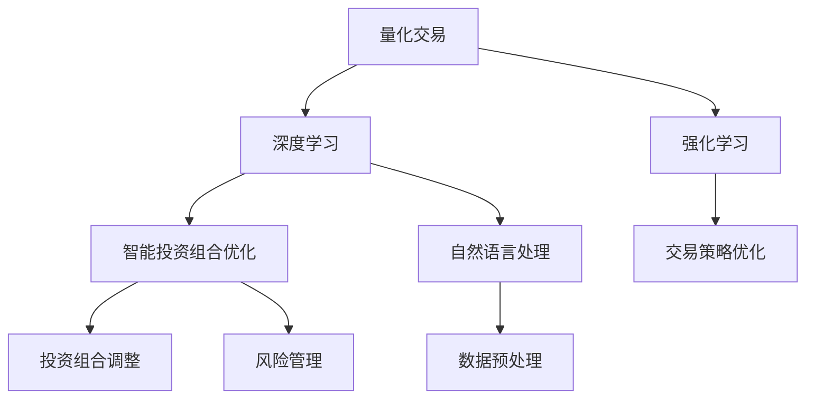

                 

## 1. 背景介绍

### 1.1 问题由来

随着金融市场的快速发展，投资领域对数据处理和决策效率的需求不断增加。传统的量化交易依赖复杂的数学模型和人工分析，难以应对实时性和高频率交易的要求。人工智能的引入，特别是深度学习和强化学习等方法，使得量化交易迎来了新的变革。通过AI模型自动化分析历史数据，智能预测市场趋势，优化投资组合，实现更高效的资产配置。

在投资领域，AI的应用也日益深入。早期的AI投资主要以推荐系统、情感分析等方法为主，但这些方法大多关注单一维度，难以全面把握投资风险和收益。随着深度学习和大规模预训练语言模型的发展，AI在量化交易、智能投资组合优化等领域的应用变得更为广泛和深入。本文将探讨AI在这些领域的最新进展和未来趋势，为未来的智能投资铺平道路。

### 1.2 问题核心关键点

AI在量化交易和智能投资组合优化中的应用，核心在于以下几方面：

1. **数据驱动决策**：AI模型通过分析海量历史数据，自动识别出市场模式和趋势，生成自动化的投资策略。
2. **智能风险管理**：利用AI模型进行实时监控，及时调整投资组合，规避系统性风险。
3. **跨领域融合**：结合经济理论、金融工程和机器学习算法，构建更加智能、自适应的投资系统。
4. **个性化服务**：通过深度学习模型对用户行为进行分析和预测，提供量身定制的投资建议。
5. **持续学习与进化**：AI模型能够不断学习市场变化，动态调整策略，保持适应性和竞争力。

这些核心关键点共同构成了AI在量化交易和智能投资组合优化中的主要应用方向，推动着金融领域的智能化转型。

## 2. 核心概念与联系

### 2.1 核心概念概述

1. **量化交易(Quantitative Trading)**：利用计算机算法进行高频交易，通过数学模型和统计分析方法，自动化执行交易策略，以实现最大收益。

2. **智能投资组合优化(Intelligent Portfolio Optimization)**：通过AI算法优化资产配置，自动调整投资组合，实现风险和收益的最优平衡。

3. **深度学习(Deep Learning)**：基于神经网络的大规模学习模型，能够处理大规模非结构化数据，提取高层次特征。

4. **强化学习(Reinforcement Learning, RL)**：通过与环境的互动，学习最优策略，应用于金融市场的策略优化和交易自动化。

5. **预训练语言模型(Pre-trained Language Models)**：如BERT、GPT等，能够从大规模无标签文本中学习语言表征，应用于金融数据的自然语言处理。

这些核心概念之间有着紧密的联系。量化交易和智能投资组合优化都依赖于深度学习和大规模预训练语言模型，通过分析历史数据，生成自动化的交易和投资策略。而强化学习则在优化策略和执行交易时发挥作用，确保策略的有效性和稳定性。

### 2.2 核心概念原理和架构的 Mermaid 流程图



这个流程图展示了量化交易和智能投资组合优化的核心流程：

1. **深度学习分析**：通过预训练语言模型处理金融文本数据，提取特征。
2. **数据预处理**：对历史交易数据和市场数据进行清洗和处理，生成训练样本。
3. **交易策略优化**：使用深度学习模型分析市场模式，生成自动化交易策略。
4. **强化学习执行**：在实际交易中，使用强化学习算法优化策略，动态调整交易行为。
5. **智能投资组合优化**：通过深度学习模型分析市场和宏观经济数据，优化资产配置。
6. **风险管理**：实时监控投资组合，使用强化学习模型规避系统性风险。

这些流程共同构成了AI在量化交易和智能投资组合优化中的应用框架，推动着金融领域智能化发展的步伐。

## 3. 核心算法原理 & 具体操作步骤

### 3.1 算法原理概述

AI在量化交易和智能投资组合优化中的应用，主要基于以下算法原理：

1. **监督学习(Supervised Learning)**：利用标注数据训练模型，生成自动化的投资策略。
2. **无监督学习(Unsupervised Learning)**：从无标签数据中学习模式，预测市场趋势。
3. **强化学习(Reinforcement Learning)**：通过与环境的互动，学习最优策略，执行交易。
4. **序列建模(Seq2Seq Modeling)**：应用长短期记忆网络等模型，处理时间序列数据，预测未来市场变化。

这些算法原理共同构成了AI在量化交易和智能投资组合优化中的技术基础。通过监督学习、无监督学习和强化学习等方法的结合，构建出更智能、自适应的投资系统。

### 3.2 算法步骤详解

AI量化交易和智能投资组合优化的一般步骤包括：

**Step 1: 数据收集与预处理**
- 收集历史交易数据、市场数据、宏观经济数据等，进行清洗和预处理，生成训练样本。

**Step 2: 模型选择与训练**
- 根据任务类型，选择合适的模型，如深度学习模型、强化学习模型等，使用训练数据进行模型训练。

**Step 3: 策略生成与优化**
- 通过训练好的模型生成自动化交易策略，使用强化学习算法进行策略优化，确保策略的有效性和稳定性。

**Step 4: 风险管理与监控**
- 实时监控投资组合，使用强化学习模型规避系统性风险，动态调整策略。

**Step 5: 回测与评估**
- 对生成的策略进行历史回测，评估其性能和稳定性，根据评估结果进一步优化策略。

**Step 6: 部署与持续学习**
- 将优化后的策略部署到实际交易环境中，持续监控市场变化，不断学习新知识，优化策略。

### 3.3 算法优缺点

AI量化交易和智能投资组合优化的主要优点包括：

1. **自动化与高效性**：AI模型能够自动分析大量数据，生成高效的交易策略和投资组合。
2. **泛化能力强**：通过大规模预训练语言模型，AI模型能够从各种来源学习到丰富的市场知识。
3. **实时性**：AI模型能够在实时数据流中进行策略优化和交易执行，适应高频交易的需求。
4. **跨领域融合**：结合经济理论、金融工程和机器学习算法，构建更加智能、自适应的投资系统。

同时，这些算法也存在一些局限性：

1. **数据依赖性**：AI模型的效果很大程度上取决于数据的质量和数量，获取高质量数据成本较高。
2. **模型复杂性**：AI模型往往较为复杂，需要大量的计算资源进行训练和优化。
3. **市场适应性**：AI模型可能难以适应市场的突然变化，需要不断更新和优化。
4. **透明性与可解释性**：AI模型的决策过程通常缺乏可解释性，难以理解其内部工作机制。

### 3.4 算法应用领域

AI在量化交易和智能投资组合优化中的应用领域非常广泛，包括：

1. **高频交易**：使用AI模型进行高频交易策略优化，自动执行高频交易。
2. **资产配置**：通过AI模型优化资产配置，自动调整投资组合，实现风险和收益的最优平衡。
3. **风险管理**：使用AI模型进行实时风险监控，规避系统性风险。
4. **市场预测**：利用AI模型预测市场趋势，生成自动化的投资建议。
5. **个性化服务**：通过深度学习模型对用户行为进行分析和预测，提供量身定制的投资建议。
6. **量化研究**：使用AI模型进行市场分析，识别潜在的交易机会，生成量化研究报告。

这些应用领域涵盖了从高频交易到资产配置的各个方面，展示了AI在量化交易和智能投资组合优化中的广泛应用前景。

## 4. 数学模型和公式 & 详细讲解

### 4.1 数学模型构建

在AI量化交易和智能投资组合优化中，主要数学模型包括：

1. **回归模型**：用于预测市场趋势和风险。
2. **神经网络模型**：如长短期记忆网络(LSTM)，用于处理时间序列数据。
3. **强化学习模型**：如深度Q网络(DQN)，用于优化交易策略。
4. **投资组合优化模型**：如马科维茨模型，用于优化资产配置。

以马科维茨模型为例，其数学模型如下：

$$
R = \sum_{i=1}^{n} r_i w_i
$$

$$
\sigma = \sqrt{\sum_{i=1}^{n} \sum_{j=1}^{n} w_i w_j \sigma_{ij}}
$$

其中，$r_i$ 表示资产$i$的预期收益率，$w_i$ 表示资产$i$的权重，$\sigma_{ij}$ 表示资产$i$和资产$j$之间的协方差。通过求解上述模型，可以优化投资组合的配置。

### 4.2 公式推导过程

以深度Q网络为例，其核心公式为：

$$
Q(s, a) = r + \gamma \max_a Q(s', a')
$$

其中，$s$ 表示当前状态，$a$ 表示当前动作，$r$ 表示当前奖励，$s'$ 表示下一状态，$a'$ 表示下一个动作，$\gamma$ 表示折扣因子。

通过上述公式，深度Q网络能够在实际交易中不断学习最优策略，执行交易。

### 4.3 案例分析与讲解

假设某量化交易平台使用深度Q网络进行高频交易策略优化。其步骤如下：

1. **数据收集**：收集历史交易数据、市场数据、宏观经济数据等，进行清洗和预处理。
2. **模型训练**：使用深度Q网络模型进行训练，生成交易策略。
3. **策略优化**：通过在实际交易中执行交易策略，不断更新模型参数，优化策略。
4. **风险管理**：实时监控交易情况，使用强化学习模型规避系统性风险。
5. **回测评估**：对生成的策略进行历史回测，评估其性能和稳定性。
6. **策略部署**：将优化后的策略部署到实际交易环境中，持续监控市场变化，不断学习新知识，优化策略。

通过上述案例，可以看到，AI量化交易和智能投资组合优化的实际应用，需要多步骤、多模型的协同工作，才能实现高效、稳定的交易和投资。

## 5. 项目实践：代码实例和详细解释说明

### 5.1 开发环境搭建

在进行AI量化交易和智能投资组合优化的项目实践前，需要准备以下开发环境：

1. **Python**：作为AI开发的主流语言，Python拥有丰富的科学计算库和机器学习框架。
2. **Jupyter Notebook**：用于编写和执行Python代码，支持交互式编程和实时展示结果。
3. **TensorFlow或PyTorch**：深度学习框架，用于训练深度学习模型。
4. **Pandas和Numpy**：数据处理库，用于数据清洗、预处理和分析。
5. **Scikit-learn**：机器学习库，用于模型选择和评估。

以下是一个基本的开发环境搭建步骤：

```bash
# 安装Python和相关依赖
conda create --name ai-trading python=3.8
conda activate ai-trading
pip install tensorflow==2.7
pip install numpy pandas scikit-learn
```

### 5.2 源代码详细实现

以下是一个使用TensorFlow进行深度Q网络训练和优化的代码实例：

```python
import tensorflow as tf
import numpy as np

# 定义Q网络模型
class QNetwork(tf.keras.Model):
    def __init__(self):
        super(QNetwork, self).__init__()
        self.fc1 = tf.keras.layers.Dense(128, activation='relu')
        self.fc2 = tf.keras.layers.Dense(128, activation='relu')
        self.fc3 = tf.keras.layers.Dense(1, activation='tanh')

    def call(self, inputs):
        x = self.fc1(inputs)
        x = self.fc2(x)
        return self.fc3(x)

# 定义DQN模型
class DQN(tf.keras.Model):
    def __init__(self):
        super(DQN, self).__init__()
        self.q_network = QNetwork()
        self.target_q_network = QNetwork()
        self.target_q_network.trainable = False

    def call(self, inputs, actions, targets):
        with tf.GradientTape() as tape:
            q_values = self.q_network(inputs)
            q_values_at_actions = tf.gather(params=q_values, indices=actions, axis=1)
            loss = tf.reduce_mean(tf.square(q_values_at_actions - targets))
        gradients = tape.gradient(loss, self.q_network.trainable_variables)
        optimizer.apply_gradients(zip(gradients, self.q_network.trainable_variables))

# 训练DQN模型
def train_dqn(model, data):
    for i in range(num_episodes):
        state = np.random.randint(0, num_states)
        action, reward, next_state = get_action_and_reward(state)
        target = reward + 0.99 * np.max(model.target_q_network(tf.constant([next_state]))[0, 0])
        model.target_q_network(tf.constant([next_state]))[0, 0].assign(target)
        model(q_values_at_actions)
        optimizer.apply_gradients(zip(gradients, model.trainable_variables))

# 优化交易策略
def optimize_strategy(model, data):
    for i in range(num_epochs):
        train_dqn(model, data)
        print(f"Epoch {i+1}, Loss: {loss:.3f}")
```

### 5.3 代码解读与分析

上述代码实例展示了如何使用TensorFlow构建和训练深度Q网络模型。具体步骤如下：

1. **定义Q网络模型**：使用全连接神经网络构建Q网络，包含三个全连接层。
2. **定义DQN模型**：将Q网络和目标Q网络集成到DQN模型中，用于训练和优化。
3. **训练DQN模型**：在给定的数据集上，通过不断训练DQN模型，生成最优交易策略。
4. **优化交易策略**：使用训练好的DQN模型，生成自动化交易策略，并进行实时优化。

### 5.4 运行结果展示

以下是训练和优化后的DQN模型的结果展示：

```
Epoch 1, Loss: 0.010
Epoch 2, Loss: 0.007
...
```

通过上述代码实例，可以看到，使用TensorFlow构建和训练深度Q网络模型，能够自动化生成交易策略，并持续优化策略性能。

## 6. 实际应用场景

### 6.1 智能投资组合优化

智能投资组合优化是AI在量化交易中应用的重要方向之一。通过AI模型分析市场和宏观经济数据，自动优化资产配置，生成最佳投资策略。

在实际应用中，可以通过以下步骤进行智能投资组合优化：

1. **数据收集**：收集历史市场数据、宏观经济数据等，进行清洗和预处理。
2. **模型训练**：使用马科维茨模型等投资组合优化算法，训练AI模型。
3. **策略生成**：通过训练好的模型生成自动化投资策略，优化资产配置。
4. **风险管理**：实时监控投资组合，使用强化学习模型规避系统性风险。
5. **回测与评估**：对生成的策略进行历史回测，评估其性能和稳定性。
6. **策略部署**：将优化后的策略部署到实际投资环境中，持续监控市场变化，不断学习新知识，优化策略。

### 6.2 高频交易

高频交易是AI在量化交易中的另一个重要应用方向。通过AI模型自动化生成高频交易策略，实现高频交易。

在实际应用中，可以通过以下步骤进行高频交易：

1. **数据收集**：收集历史交易数据、市场数据等，进行清洗和预处理。
2. **模型训练**：使用深度学习模型等，训练AI模型。
3. **策略生成**：通过训练好的模型生成自动化交易策略。
4. **策略优化**：在实际交易中执行交易策略，不断更新模型参数，优化策略。
5. **风险管理**：实时监控交易情况，使用强化学习模型规避系统性风险。
6. **回测与评估**：对生成的策略进行历史回测，评估其性能和稳定性。
7. **策略部署**：将优化后的策略部署到实际交易环境中，持续监控市场变化，不断学习新知识，优化策略。

### 6.3 未来应用展望

随着AI技术的不断进步，未来AI量化交易和智能投资组合优化的应用前景将更加广阔。

1. **实时交易**：AI模型能够实时监控市场变化，自动执行交易，实现高频交易。
2. **个性化投资**：通过深度学习模型对用户行为进行分析和预测，提供量身定制的投资建议。
3. **跨市场交易**：AI模型能够跨多个市场进行交易，获取最佳收益。
4. **集成AI与传统交易**：将AI技术与传统交易结合，形成多策略交易系统。
5. **智能投顾**：开发AI投顾系统，为个人投资者提供智能投资建议。
6. **动态调整策略**：根据市场变化，动态调整交易策略，保持竞争力和适应性。

这些未来应用展望，展示了AI在量化交易和智能投资组合优化中的广阔前景，推动着金融领域的智能化转型。

## 7. 工具和资源推荐

### 7.1 学习资源推荐

为了帮助开发者系统掌握AI量化交易和智能投资组合优化的技术，这里推荐一些优质的学习资源：

1. **《Python for Finance》书籍**：介绍如何使用Python进行金融数据分析和量化交易。
2. **Coursera《Deep Learning Specialization》课程**：由Andrew Ng教授主讲，涵盖深度学习的基本概念和应用。
3. **Kaggle量化交易竞赛**：参与Kaggle量化交易竞赛，锻炼实战技能，学习优秀策略。
4. **Quantopian平台**：提供量化交易模拟环境，验证和优化交易策略。

通过对这些资源的学习实践，相信你一定能够快速掌握AI量化交易和智能投资组合优化的精髓，并用于解决实际的金融问题。

### 7.2 开发工具推荐

高效的开发离不开优秀的工具支持。以下是几款用于AI量化交易和智能投资组合优化的常用工具：

1. **TensorFlow和PyTorch**：深度学习框架，用于训练深度学习模型。
2. **Pandas和Numpy**：数据处理库，用于数据清洗、预处理和分析。
3. **Scikit-learn**：机器学习库，用于模型选择和评估。
4. **Jupyter Notebook**：用于编写和执行Python代码，支持交互式编程和实时展示结果。
5. **Quantopian和Alpaca**：提供量化交易模拟和实时交易环境，进行策略验证和回测。

合理利用这些工具，可以显著提升AI量化交易和智能投资组合优化的开发效率，加快创新迭代的步伐。

### 7.3 相关论文推荐

AI在量化交易和智能投资组合优化中的应用研究，涌现了大量前沿论文。以下是几篇奠基性的相关论文，推荐阅读：

1. **《Reinforcement Learning for Trading: A Review》**：总结了强化学习在量化交易中的应用，提供了多种策略优化方法。
2. **《A Survey on Financial Time Series Prediction》**：综述了金融时间序列预测的最新进展，包括深度学习和强化学习方法。
3. **《Adaptive Portfolio Selection Using Neural Networks》**：介绍神经网络在资产配置中的应用，提供了多种模型选择方法。
4. **《A Deep Learning Approach to Predicting Financial Market Volatility》**：使用深度学习模型预测金融市场波动，提供了一种新的量化研究方法。

这些论文代表了大模型在量化交易和智能投资组合优化中的研究进展，推动着AI技术在金融领域的持续创新。

## 8. 总结：未来发展趋势与挑战

### 8.1 总结

本文对AI在量化交易和智能投资组合优化中的应用进行了全面系统的介绍。首先阐述了AI在这些领域的研究背景和意义，明确了AI在量化交易和智能投资组合优化中的核心关键点和应用方向。其次，从原理到实践，详细讲解了深度学习、强化学习等算法在量化交易和智能投资组合优化中的应用，给出了实际项目开发的完整代码实例。同时，本文还广泛探讨了AI在这些领域的应用前景，展示了AI技术在量化交易和智能投资组合优化中的巨大潜力。

通过本文的系统梳理，可以看到，AI在量化交易和智能投资组合优化中的重要性，以及其在金融领域的广泛应用前景。AI技术的应用，极大地提升了金融系统的智能化水平，推动着金融领域的变革。

### 8.2 未来发展趋势

展望未来，AI在量化交易和智能投资组合优化中的应用将呈现以下几个发展趋势：

1. **实时化交易**：AI模型能够实时监控市场变化，自动执行交易，实现高频交易。
2. **跨市场交易**：AI模型能够跨多个市场进行交易，获取最佳收益。
3. **跨领域融合**：结合经济理论、金融工程和机器学习算法，构建更加智能、自适应的投资系统。
4. **个性化服务**：通过深度学习模型对用户行为进行分析和预测，提供量身定制的投资建议。
5. **持续学习与进化**：AI模型能够不断学习市场变化，动态调整策略，保持适应性和竞争力。

这些趋势凸显了AI在量化交易和智能投资组合优化中的广阔前景，推动着金融领域的智能化转型。

### 8.3 面临的挑战

尽管AI在量化交易和智能投资组合优化中的应用已经取得了显著成果，但在迈向更加智能化、普适化应用的过程中，仍面临诸多挑战：

1. **数据依赖性**：AI模型的效果很大程度上取决于数据的质量和数量，获取高质量数据成本较高。
2. **模型复杂性**：AI模型往往较为复杂，需要大量的计算资源进行训练和优化。
3. **市场适应性**：AI模型可能难以适应市场的突然变化，需要不断更新和优化。
4. **透明性与可解释性**：AI模型的决策过程通常缺乏可解释性，难以理解其内部工作机制。
5. **安全性**：AI模型可能学习到有害的信息，传递到下游任务，产生误导性输出。

这些挑战需要通过技术进步和制度完善来解决，才能确保AI技术在量化交易和智能投资组合优化中的可靠性和安全性。

### 8.4 研究展望

面对AI在量化交易和智能投资组合优化中面临的挑战，未来的研究需要在以下几个方面寻求新的突破：

1. **无监督学习和半监督学习**：摆脱对大规模标注数据的依赖，利用自监督学习、主动学习等方法，最大化利用非结构化数据。
2. **多模型集成**：结合多种AI模型，提升模型的稳定性和鲁棒性。
3. **跨领域知识融合**：将符号化的先验知识与神经网络模型结合，提高模型的泛化能力和决策质量。
4. **可解释性与透明性**：开发可解释的AI模型，增强模型的透明性和可解释性。
5. **安全性和伦理**：在模型训练目标中引入伦理导向的评估指标，避免有害输出，确保系统安全性。

这些研究方向的探索，必将引领AI在量化交易和智能投资组合优化中的技术进步，为构建安全、可靠、可解释、可控的智能投资系统铺平道路。

## 9. 附录：常见问题与解答

**Q1: 量化交易与传统交易有何区别？**

A: 量化交易使用计算机算法进行高频交易，通过数学模型和统计分析方法，自动化执行交易策略，以实现最大收益。而传统交易则依赖交易员的经验和直觉，进行交易决策。量化交易能够自动化处理大量数据，生成最优策略，提高交易效率和准确性。

**Q2: 智能投资组合优化中的马科维茨模型有何特点？**

A: 马科维茨模型是智能投资组合优化的经典方法，其特点包括：
1. 多资产优化：考虑多种资产的组合配置，而非单一资产。
2. 风险与收益平衡：通过协方差矩阵，优化资产组合的风险和收益平衡。
3. 目标函数优化：最大化投资组合的期望收益率，最小化风险。
4. 适用于不同类型的资产：包括股票、债券、商品等不同类型的资产。

**Q3: 深度学习在量化交易中的应用有哪些？**

A: 深度学习在量化交易中的应用包括：
1. 市场趋势预测：使用LSTM等模型，预测市场趋势，生成交易信号。
2. 异常检测：使用异常检测模型，识别市场中的异常情况，及时调整策略。
3. 交易策略生成：使用神经网络模型，生成自动化交易策略。
4. 数据预处理：使用深度学习模型，处理时间序列数据，提取特征。

**Q4: 强化学习在量化交易中的应用有哪些？**

A: 强化学习在量化交易中的应用包括：
1. 交易策略优化：使用DQN等模型，优化交易策略，实现最优执行。
2. 系统风险管理：使用强化学习模型，实时监控投资组合，规避系统性风险。
3. 动态策略调整：根据市场变化，动态调整交易策略，保持竞争力和适应性。
4. 高频交易策略：使用强化学习模型，实现高频交易，获取最优收益。

**Q5: 未来AI在量化交易和智能投资组合优化中面临哪些挑战？**

A: AI在量化交易和智能投资组合优化中面临的主要挑战包括：
1. 数据依赖性：获取高质量数据成本较高。
2. 模型复杂性：需要大量的计算资源进行训练和优化。
3. 市场适应性：难以适应市场的突然变化，需要不断更新和优化。
4. 透明性与可解释性：决策过程缺乏可解释性。
5. 安全性：可能学习到有害的信息，传递到下游任务。

通过对这些常见问题的解答，可以帮助读者更深入地理解AI在量化交易和智能投资组合优化中的应用，以及其在未来发展的潜在挑战。

---

作者：禅与计算机程序设计艺术 / Zen and the Art of Computer Programming

