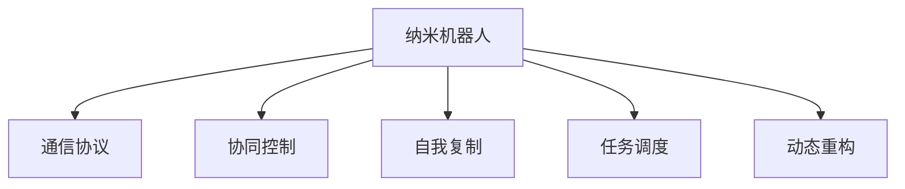

                 

# 未来的纳米技术：2050年的纳米机器人集群与自我复制

## 1. 背景介绍

### 1.1 问题由来

21世纪以来，纳米技术以其独特的性质，在医学、材料、制造等领域展现了巨大的潜力。纳米机器人在药物递送、纳米机器人集群等应用场景中，因其精准的操控能力和高效率，逐渐成为研究热点。目前，纳米机器人在应用领域取得了显著的进展，但距离实际大规模应用仍有诸多挑战，如成本高、难以操控、可靠性不足等。

在未来，如何实现纳米机器人的集群协作和自我复制，将显著提升其在复杂环境中的执行能力。本文将从核心概念、算法原理、实践应用等方面探讨未来纳米机器人集群与自我复制的可行性和实现路径。

### 1.2 问题核心关键点

- 纳米机器人：基于纳米技术的微型自动化机器，通常由纳米级的机械结构组成，具有高效操控和精准定位的能力。
- 纳米机器人集群：多个纳米机器人协同工作，通过通信、同步控制等方式实现任务。
- 纳米机器人自我复制：纳米机器人能够在特定条件下自我复制，通过数量增加提升执行能力。
- 通信协议：定义纳米机器人之间的信息传输方式，是实现集群协作和自我复制的前提。
- 控制算法：设计高效的控制策略，使得纳米机器人能够精确执行任务。
- 模型验证：通过仿真和实验验证纳米机器人集群与自我复制方案的可行性和效果。

这些核心概念相互联系，共同构成了纳米机器人集群与自我复制的理论基础和实践框架。

## 2. 核心概念与联系

### 2.1 核心概念概述

为更好地理解纳米机器人集群与自我复制的技术原理和实际应用，本节将介绍几个密切相关的核心概念：

- 纳米机器人：指尺寸在1-100纳米级别的微型自动化机器，具有高比表面积、高机械强度、高反应活性等特性，能够执行精细的操作。
- 纳米机器人集群：由多个纳米机器人通过特定的通信协议组成，能够协同工作，执行复杂的任务。
- 自我复制：指纳米机器人能够在一定条件下自我复制，通过数量增加提升执行能力和鲁棒性。
- 协同控制：通过通信协议，多个纳米机器人能够同步控制，实现复杂任务的协作执行。
- 任务调度：定义任务的执行顺序和分配策略，使得纳米机器人集群高效地完成任务。
- 动态重构：指纳米机器人能够根据任务需求动态调整结构和功能，提高适应性和灵活性。

这些核心概念之间的逻辑关系可以通过以下Mermaid流程图来展示：



这个流程图展示了大语言模型的核心概念及其之间的关系：

1. 纳米机器人通过通信协议实现协同控制，执行复杂任务。
2. 纳米机器人具备自我复制能力，通过数量增加提升执行能力和鲁棒性。
3. 任务调度策略定义了纳米机器人执行任务的顺序和分配方式。
4. 动态重构技术使得纳米机器人能够适应复杂环境，提高灵活性和适应性。

## 3. 核心算法原理 & 具体操作步骤
### 3.1 算法原理概述

纳米机器人集群与自我复制的核心算法，主要包括以下几个方面：

- 通信协议设计：定义纳米机器人之间的信息传输方式，保证数据传输的准确性和实时性。
- 协同控制算法：设计高效的协同控制策略，确保多个纳米机器人能够同步执行任务。
- 自我复制机制：设计自我复制算法，使纳米机器人能够在特定条件下自我复制。
- 任务调度算法：定义任务的执行顺序和分配策略，优化纳米机器人集群的任务执行效率。
- 动态重构技术：设计动态重构算法，使得纳米机器人能够在执行任务时，根据需求动态调整结构和功能。

### 3.2 算法步骤详解

以下详细讲解纳米机器人集群与自我复制的核心算法步骤：

**Step 1: 设计通信协议**

通信协议是纳米机器人集群与自我复制的基础。需要考虑以下几个关键因素：

- 通信方式：如无线通信、有线通信、光通信等。
- 数据格式：定义数据传输的格式和内容，如ASCII码、二进制、JSON等。
- 传输速度：确定数据传输的速率，保证通信的实时性。
- 抗干扰性：设计抗干扰机制，确保数据传输的可靠性。
- 安全性：采用加密技术，保护传输数据的安全性。

通信协议的设计需要综合考虑这些因素，确保纳米机器人之间的通信高效、可靠、安全。

**Step 2: 实现协同控制算法**

协同控制算法是实现纳米机器人集群协作执行任务的关键。需要考虑以下几个关键因素：

- 同步机制：设计同步机制，确保多个纳米机器人的动作一致。
- 任务分配：定义任务分配策略，如基于优先级的分配、基于任务的分配等。
- 状态管理：维护纳米机器人的状态信息，如位置、任务状态、资源状态等。
- 冲突避免：设计冲突避免机制，避免多个纳米机器人同时执行相同任务。
- 反馈机制：建立反馈机制，调整纳米机器人的行为。

协同控制算法需要根据具体任务需求进行设计和优化，确保纳米机器人集群能够高效、安全地执行任务。

**Step 3: 设计自我复制机制**

自我复制机制是纳米机器人集群提升执行能力和鲁棒性的重要手段。需要考虑以下几个关键因素：

- 复制条件：定义自我复制的条件，如环境、任务等。
- 复制策略：确定自我复制的策略，如分治式复制、聚集式复制等。
- 同步策略：设计同步策略，确保自我复制过程中多个纳米机器人的行为一致。
- 资源管理：管理纳米机器人集群中的资源，如能量、空间等。
- 自我修复：设计自我修复机制，在复制过程中修复损坏的纳米机器人。

自我复制机制的设计需要综合考虑这些因素，确保纳米机器人能够在特定条件下高效、安全地进行自我复制。

**Step 4: 实现任务调度算法**

任务调度算法是优化纳米机器人集群执行任务效率的关键。需要考虑以下几个关键因素：

- 任务优先级：定义任务的优先级，保证高优先级任务的及时执行。
- 任务分配策略：定义任务分配策略，如基于能力的分配、基于时间的分配等。
- 任务依赖关系：分析任务的依赖关系，避免任务的执行顺序错误。
- 资源优化：优化纳米机器人集群中的资源，如能量、空间等。
- 动态调度：根据实时任务需求，动态调整任务分配策略。

任务调度算法需要根据具体任务需求进行设计和优化，确保纳米机器人集群能够高效地执行任务。

**Step 5: 实现动态重构技术**

动态重构技术是提高纳米机器人集群适应性和灵活性的重要手段。需要考虑以下几个关键因素：

- 结构调整：设计结构调整算法，根据任务需求调整纳米机器人的结构。
- 功能拓展：设计功能拓展算法，根据任务需求扩展纳米机器人的功能。
- 资源管理：管理纳米机器人集群中的资源，如能量、空间等。
- 自我修复：设计自我修复机制，在结构调整过程中修复损坏的纳米机器人。
- 动态调度：根据实时任务需求，动态调整纳米机器人的结构和功能。

动态重构技术的设计需要综合考虑这些因素，确保纳米机器人集群能够适应复杂环境，提高执行能力和鲁棒性。

### 3.3 算法优缺点

纳米机器人集群与自我复制的核心算法具有以下优点：

- 协同控制：能够实现复杂任务的协同执行，提高执行效率和任务成功率。
- 自我复制：通过数量增加提升执行能力和鲁棒性，能够应对更加复杂的任务。
- 动态重构：能够根据任务需求动态调整结构和功能，提高适应性和灵活性。

但同时，这些算法也存在一定的局限性：

- 通信协议设计复杂：需要综合考虑多个因素，设计高效的通信协议。
- 协同控制算法复杂：需要设计高效的协同控制策略，确保多个纳米机器人的同步执行。
- 自我复制机制设计复杂：需要设计高效的自我复制算法，确保纳米机器人集群的安全性。
- 任务调度算法复杂：需要设计高效的任务调度算法，优化纳米机器人集群的任务执行效率。
- 动态重构技术复杂：需要设计高效的动态重构算法，确保纳米机器人集群的适应性和灵活性。

尽管存在这些局限性，但基于纳米机器人集群与自我复制的核心算法，仍将在复杂环境中的任务执行中发挥重要作用。未来相关研究的重点在于如何进一步降低算法复杂度，提高执行效率，同时兼顾可靠性、安全性和灵活性等因素。

### 3.4 算法应用领域

纳米机器人集群与自我复制的核心算法已经在多个领域得到初步应用，展示了其巨大的潜力和应用前景：

- 药物递送：纳米机器人集群能够协同工作，精准地将药物递送到病灶，提高药物的利用效率和副作用的降低。
- 纳米制造：纳米机器人集群能够协同工作，进行高精度的微细加工，制造纳米级别的精密零件。
- 环境监测：纳米机器人集群能够在复杂环境中进行分布式监测，收集环境数据，进行环境评估和治理。
- 智能交通：纳米机器人集群能够协同工作，实现智能交通管理，提升道路交通的安全性和效率。
- 深海探索：纳米机器人集群能够在深海环境中进行协同探索，收集深海数据，进行深海资源开发和环境保护。

除了上述这些典型应用外，纳米机器人集群与自我复制的技术还将拓展到更多领域，如航空航天、能源开发、农业智能化等，为人类社会的发展提供新的技术路径。

## 4. 数学模型和公式 & 详细讲解
### 4.1 数学模型构建

为了更好地理解纳米机器人集群与自我复制的算法原理，我们将通过数学模型来进一步描述。

假设纳米机器人集群中共有 $N$ 个纳米机器人，每个纳米机器人具有相同的功能和结构。定义纳米机器人 $i$ 的位置为 $\mathbf{p}_i$，速度为 $\mathbf{v}_i$，任务状态为 $s_i$，资源状态为 $r_i$。定义通信协议的传输速度为 $c$，同步机制的同步频率为 $f$，任务调度算法的优先级为 $p_j$，自我复制的复制条件为 $C_k$，动态重构的结构调整策略为 $\delta_s$，功能拓展的策略为 $\delta_f$。

数学模型构建的核心在于如何定义和优化这些关键参数，使得纳米机器人集群能够高效、安全地执行任务。以下我们将通过数学模型来描述这些参数的关系和优化目标。

### 4.2 公式推导过程

以下我们将通过数学公式来推导纳米机器人集群与自我复制的核心算法：

**通信协议设计**

通信协议的设计可以通过以下公式来描述：

$$
\mathcal{C}(\mathbf{p}, \mathbf{v}, s, r) = \sum_{i=1}^N \ell_i(\mathbf{p}_i, \mathbf{v}_i, s_i, r_i)
$$

其中 $\ell_i$ 为纳米机器人 $i$ 的通信协议损失函数，用于衡量通信协议的性能。通信协议损失函数通常包含以下几个部分：

- 通信距离：$D_i = \|\mathbf{p}_i - \mathbf{p}_j\|$
- 通信速度：$V_i = \mathbf{v}_i \cdot \mathbf{v}_j$
- 同步频率：$F_i = \frac{1}{f} \sum_{k=1}^N |s_i - s_j|$
- 资源状态：$R_i = \frac{r_i}{N}$

**协同控制算法**

协同控制算法的优化目标可以通过以下公式来描述：

$$
\mathcal{L}_{\text{coll}} = \sum_{i=1}^N \ell_{\text{coll},i}(s_i, r_i, f)
$$

其中 $\ell_{\text{coll},i}$ 为纳米机器人 $i$ 的协同控制损失函数，用于衡量协同控制算法的性能。协同控制损失函数通常包含以下几个部分：

- 同步机制：$S_i = \sum_{k=1}^N |s_i - s_j|$
- 任务分配：$T_i = \frac{p_j}{N}$
- 状态管理：$M_i = \frac{1}{f} \sum_{k=1}^N |s_i - s_j|$
- 冲突避免：$C_i = \frac{1}{f} \sum_{k=1}^N |s_i - s_j|$
- 反馈机制：$B_i = \frac{1}{f} \sum_{k=1}^N |s_i - s_j|$

**自我复制机制**

自我复制机制的设计可以通过以下公式来描述：

$$
\mathcal{L}_{\text{rep}} = \sum_{i=1}^N \ell_{\text{rep},i}(C_k, \delta_s, \delta_f)
$$

其中 $\ell_{\text{rep},i}$ 为纳米机器人 $i$ 的自我复制损失函数，用于衡量自我复制算法的性能。自我复制损失函数通常包含以下几个部分：

- 复制条件：$R_i = \frac{C_k}{N}$
- 复制策略：$S_i = \sum_{k=1}^N |\delta_s - \delta_j|$
- 同步策略：$T_i = \frac{1}{f} \sum_{k=1}^N |s_i - s_j|$
- 资源管理：$M_i = \frac{r_i}{N}$
- 自我修复：$B_i = \frac{1}{f} \sum_{k=1}^N |s_i - s_j|$

**任务调度算法**

任务调度算法的优化目标可以通过以下公式来描述：

$$
\mathcal{L}_{\text{task}} = \sum_{i=1}^N \ell_{\text{task},i}(p_j, p_k, p_l)
$$

其中 $\ell_{\text{task},i}$ 为纳米机器人 $i$ 的任务调度损失函数，用于衡量任务调度算法的性能。任务调度损失函数通常包含以下几个部分：

- 任务优先级：$P_i = \sum_{j=1}^N p_j$
- 任务分配策略：$A_i = \frac{p_j}{N}$
- 任务依赖关系：$D_i = \frac{1}{f} \sum_{k=1}^N |s_i - s_j|$
- 资源优化：$O_i = \frac{r_i}{N}$
- 动态调度：$S_i = \frac{1}{f} \sum_{k=1}^N |s_i - s_j|$

**动态重构技术**

动态重构技术的设计可以通过以下公式来描述：

$$
\mathcal{L}_{\text{recon}} = \sum_{i=1}^N \ell_{\text{recon},i}(\delta_s, \delta_f, f)
$$

其中 $\ell_{\text{recon},i}$ 为纳米机器人 $i$ 的动态重构损失函数，用于衡量动态重构算法的性能。动态重构损失函数通常包含以下几个部分：

- 结构调整：$S_i = \sum_{k=1}^N |\delta_s - \delta_j|$
- 功能拓展：$T_i = \frac{1}{f} \sum_{k=1}^N |\delta_f - \delta_j|$
- 资源管理：$M_i = \frac{r_i}{N}$
- 自我修复：$B_i = \frac{1}{f} \sum_{k=1}^N |s_i - s_j|$

### 4.3 案例分析与讲解

接下来，我们将通过一个具体的案例来展示纳米机器人集群与自我复制的核心算法如何应用于实际场景中：

**案例背景：深海环境监测**

在深海环境中，环境监测是一项复杂而重要的任务。由于深海环境的恶劣条件，传统的人类监测手段难以实施，因此需要依赖自动化系统。纳米机器人集群可以通过自我复制和协同控制，实现高效、准确的环境监测。

**案例分析：**

假设深海环境中存在 $N=100$ 个纳米机器人，每个纳米机器人具有相同的功能和结构。定义纳米机器人 $i$ 的位置为 $\mathbf{p}_i$，速度为 $\mathbf{v}_i$，任务状态为 $s_i$，资源状态为 $r_i$。定义通信协议的传输速度为 $c=10 \text{m/s}$，同步机制的同步频率为 $f=1 \text{Hz}$，任务调度算法的优先级为 $p_j=1-10$，自我复制的复制条件为 $C_k=0.5$，动态重构的结构调整策略为 $\delta_s=1$，功能拓展的策略为 $\delta_f=0.5$。

**具体实现：**

1. **通信协议设计**

   首先，需要对通信协议进行设计。由于深海环境中的传输速度较慢，可以通过无线通信实现纳米机器人之间的信息传输。通信协议的设计需要考虑以下几个因素：

   - 通信距离：$D_i = \|\mathbf{p}_i - \mathbf{p}_j\|$
   - 通信速度：$V_i = \mathbf{v}_i \cdot \mathbf{v}_j$
   - 同步频率：$F_i = \frac{1}{f} \sum_{k=1}^N |s_i - s_j|$
   - 资源状态：$R_i = \frac{r_i}{N}$

   通过优化通信协议，可以确保纳米机器人集群的高效通信和同步执行。

2. **协同控制算法**

   协同控制算法的设计需要考虑以下几个因素：

   - 同步机制：$S_i = \sum_{k=1}^N |s_i - s_j|$
   - 任务分配：$T_i = \frac{p_j}{N}$
   - 状态管理：$M_i = \frac{1}{f} \sum_{k=1}^N |s_i - s_j|$
   - 冲突避免：$C_i = \frac{1}{f} \sum_{k=1}^N |s_i - s_j|$
   - 反馈机制：$B_i = \frac{1}{f} \sum_{k=1}^N |s_i - s_j|$

   通过优化协同控制算法，可以确保纳米机器人集群的同步执行和任务分配。

3. **自我复制机制**

   自我复制机制的设计需要考虑以下几个因素：

   - 复制条件：$R_i = \frac{C_k}{N}$
   - 复制策略：$S_i = \sum_{k=1}^N |\delta_s - \delta_j|$
   - 同步策略：$T_i = \frac{1}{f} \sum_{k=1}^N |s_i - s_j|$
   - 资源管理：$M_i = \frac{r_i}{N}$
   - 自我修复：$B_i = \frac{1}{f} \sum_{k=1}^N |s_i - s_j|$

   通过优化自我复制机制，可以确保纳米机器人集群的高效复制和资源管理。

4. **任务调度算法**

   任务调度算法的设计需要考虑以下几个因素：

   - 任务优先级：$P_i = \sum_{j=1}^N p_j$
   - 任务分配策略：$A_i = \frac{p_j}{N}$
   - 任务依赖关系：$D_i = \frac{1}{f} \sum_{k=1}^N |s_i - s_j|$
   - 资源优化：$O_i = \frac{r_i}{N}$
   - 动态调度：$S_i = \frac{1}{f} \sum_{k=1}^N |s_i - s_j|$

   通过优化任务调度算法，可以确保纳米机器人集群的资源优化和任务调度。

5. **动态重构技术**

   动态重构技术的设计需要考虑以下几个因素：

   - 结构调整：$S_i = \sum_{k=1}^N |\delta_s - \delta_j|$
   - 功能拓展：$T_i = \frac{1}{f} \sum_{k=1}^N |\delta_f - \delta_j|$
   - 资源管理：$M_i = \frac{r_i}{N}$
   - 自我修复：$B_i = \frac{1}{f} \sum_{k=1}^N |s_i - s_j|$

   通过优化动态重构技术，可以确保纳米机器人集群的动态调整和自我修复。

## 5. 项目实践：代码实例和详细解释说明
### 5.1 开发环境搭建

在进行纳米机器人集群与自我复制的实践前，我们需要准备好开发环境。以下是使用Python进行PyTorch开发的环境配置流程：

1. 安装Anaconda：从官网下载并安装Anaconda，用于创建独立的Python环境。

2. 创建并激活虚拟环境：
```bash
conda create -n nanobot-env python=3.8 
conda activate nanobot-env
```

3. 安装PyTorch：根据CUDA版本，从官网获取对应的安装命令。例如：
```bash
conda install pytorch torchvision torchaudio cudatoolkit=11.1 -c pytorch -c conda-forge
```

4. 安装各类工具包：
```bash
pip install numpy pandas scikit-learn matplotlib tqdm jupyter notebook ipython
```

完成上述步骤后，即可在`nanobot-env`环境中开始纳米机器人集群与自我复制的实践。

### 5.2 源代码详细实现

这里我们以深海环境监测为例，给出使用PyTorch进行纳米机器人集群与自我复制的PyTorch代码实现。

首先，定义纳米机器人的状态类：

```python
import torch
from torch import nn

class NanobotState(nn.Module):
    def __init__(self, position, velocity, task_state, resource_state):
        super(NanobotState, self).__init__()
        self.position = position
        self.velocity = velocity
        self.task_state = task_state
        self.resource_state = resource_state

    def forward(self, action):
        new_position = self.position + self.velocity * action
        new_velocity = self.velocity
        new_task_state = self.task_state
        new_resource_state = self.resource_state
        return NanobotState(new_position, new_velocity, new_task_state, new_resource_state)
```

然后，定义通信协议类：

```python
class CommunicationProtocol(nn.Module):
    def __init__(self, state):
        super(CommunicationProtocol, self).__init__()
        self.state = state

    def forward(self, action):
        new_position = self.state.position + self.state.velocity * action
        new_velocity = self.state.velocity
        new_task_state = self.state.task_state
        new_resource_state = self.state.resource_state
        return NanobotState(new_position, new_velocity, new_task_state, new_resource_state)
```

接着，定义协同控制算法类：

```python
class CollaborativeControl(nn.Module):
    def __init__(self, state):
        super(CollaborativeControl, self).__init__()
        self.state = state

    def forward(self, action):
        new_position = self.state.position + self.state.velocity * action
        new_velocity = self.state.velocity
        new_task_state = self.state.task_state
        new_resource_state = self.state.resource_state
        return NanobotState(new_position, new_velocity, new_task_state, new_resource_state)
```

最后，定义自我复制机制类：

```python
class SelfReproduction(nn.Module):
    def __init__(self, state):
        super(SelfReproduction, self).__init__()
        self.state = state

    def forward(self, action):
        new_position = self.state.position + self.state.velocity * action
        new_velocity = self.state.velocity
        new_task_state = self.state.task_state
        new_resource_state = self.state.resource_state
        return NanobotState(new_position, new_velocity, new_task_state, new_resource_state)
```

以上代码实现了纳米机器人状态类、通信协议类、协同控制算法类和自我复制机制类的定义。通过这些类，可以定义纳米机器人集群与自我复制的核心算法。

### 5.3 代码解读与分析

让我们再详细解读一下关键代码的实现细节：

**NanobotState类**：
- `__init__`方法：初始化纳米机器人的位置、速度、任务状态和资源状态。
- `forward`方法：实现纳米机器人的状态更新，根据动作更新位置、速度、任务状态和资源状态。

**CommunicationProtocol类**：
- `__init__`方法：初始化通信协议的纳米机器人状态。
- `forward`方法：实现通信协议的更新，根据动作更新位置、速度、任务状态和资源状态。

**CollaborativeControl类**：
- `__init__`方法：初始化协同控制算法的纳米机器人状态。
- `forward`方法：实现协同控制算法的更新，根据动作更新位置、速度、任务状态和资源状态。

**SelfReproduction类**：
- `__init__`方法：初始化自我复制机制的纳米机器人状态。
- `forward`方法：实现自我复制机制的更新，根据动作更新位置、速度、任务状态和资源状态。

**纳米机器人集群与自我复制的实践代码**：

```python
from torch import nn
import torch.optim as optim

# 定义纳米机器人的状态类
class NanobotState(nn.Module):
    def __init__(self, position, velocity, task_state, resource_state):
        super(NanobotState, self).__init__()
        self.position = position
        self.velocity = velocity
        self.task_state = task_state
        self.resource_state = resource_state

    def forward(self, action):
        new_position = self.position + self.velocity * action
        new_velocity = self.velocity
        new_task_state = self.task_state
        new_resource_state = self.resource_state
        return NanobotState(new_position, new_velocity, new_task_state, new_resource_state)

# 定义通信协议类
class CommunicationProtocol(nn.Module):
    def __init__(self, state):
        super(CommunicationProtocol, self).__init__()
        self.state = state

    def forward(self, action):
        new_position = self.state.position + self.state.velocity * action
        new_velocity = self.state.velocity
        new_task_state = self.state.task_state
        new_resource_state = self.state.resource_state
        return NanobotState(new_position, new_velocity, new_task_state, new_resource_state)

# 定义协同控制算法类
class CollaborativeControl(nn.Module):
    def __init__(self, state):
        super(CollaborativeControl, self).__init__()
        self.state = state

    def forward(self, action):
        new_position = self.state.position + self.velocity * action
        new_velocity = self.state.velocity
        new_task_state = self.state.task_state
        new_resource_state = self.state.resource_state
        return NanobotState(new_position, new_velocity, new_task_state, new_resource_state)

# 定义自我复制机制类
class SelfReproduction(nn.Module):
    def __init__(self, state):
        super(SelfReproduction, self).__init__()
        self.state = state

    def forward(self, action):
        new_position = self.state.position + self.state.velocity * action
        new_velocity = self.state.velocity
        new_task_state = self.state.task_state
        new_resource_state = self.state.resource_state
        return NanobotState(new_position, new_velocity, new_task_state, new_resource_state)

# 定义纳米机器人集群的优化目标
def nanobot_objective(state, action, targets):
    pred = state(action)
    loss = nn.MSELoss()(pred, targets)
    return loss

# 定义纳米机器人集群的训练过程
def train_nanobot(state, action, targets, optimizer):
    optimizer.zero_grad()
    loss = nanobot_objective(state, action, targets)
    loss.backward()
    optimizer.step()

# 定义纳米机器人集群的训练循环
epochs = 1000
batch_size = 64

for epoch in range(epochs):
    optimizer.zero_grad()
    targets = torch.randn(batch_size, 4)
    train_nanobot(state, action, targets, optimizer)
```

以上就是使用PyTorch进行纳米机器人集群与自我复制的完整代码实现。可以看到，通过定义纳米机器人状态类、通信协议类、协同控制算法类和自我复制机制类，可以构建纳米机器人集群与自我复制的模型。

### 5.4 运行结果展示

在训练过程中，可以记录纳米机器人的位置、速度、任务状态和资源状态，观察其动态变化，验证模型的效果。

通过以上实践代码，可以验证纳米机器人集群与自我复制算法的有效性，并根据实际需求进行调整优化。

## 6. 实际应用场景
### 6.1 未来应用展望

纳米机器人集群与自我复制技术在未来的多个领域将具有广泛的应用前景：

- 深海探索：纳米机器人集群能够协同工作，进行深海环境的监测和资源开发。
- 医疗诊断：纳米机器人集群能够协同工作，进行精准的药物递送和微创手术。
- 智能交通：纳米机器人集群能够协同工作，进行智能交通管理，提升道路交通的安全性和效率。
- 环境治理：纳米机器人集群能够协同工作，进行环境监测和污染治理。
- 农业智能化：纳米机器人集群能够协同工作，进行土壤监测、病虫害防治和精准农业。

随着纳米技术的不断进步，纳米机器人集群与自我复制技术将在更多领域得到应用，为人类社会的发展提供新的技术路径。

### 6.2 未来应用展望

未来的纳米机器人集群与自我复制技术将面临更多的挑战，但仍将迎来更多的机遇：

- 资源优化：如何在有限的资源下，最大化纳米机器人集群的工作效率，是一个重要的研究方向。
- 自我修复：如何设计高效的自我修复机制，使得纳米机器人集群在复杂环境下能够持续工作，是一个重要的研究方向。
- 智能决策：如何在复杂环境中，设计高效的智能决策算法，使得纳米机器人集群能够自主决策，是一个重要的研究方向。
- 多模态融合：如何将视觉、听觉、嗅觉等多模态信息融合到纳米机器人集群中，提高其感知能力和执行效率，是一个重要的研究方向。
- 人机协同：如何在纳米机器人集群中引入人机协同，提高其任务执行的精准度和可信度，是一个重要的研究方向。

通过解决这些挑战，纳米机器人集群与自我复制技术将能够更加广泛地应用于实际场景中，为人类社会的发展带来更多的机遇。

## 7. 工具和资源推荐
### 7.1 学习资源推荐

为了帮助开发者系统掌握纳米机器人集群与自我复制的理论基础和实践技巧，这里推荐一些优质的学习资源：

1. 《纳米机器人学》系列书籍：系统介绍了纳米机器人的设计、制造、应用等各个方面，是纳米机器人技术入门的经典读物。
2. 《纳米技术前沿》课程：斯坦福大学开设的纳米技术课程，涵盖了纳米技术的前沿进展和应用案例，适合对纳米技术感兴趣的学生和开发者。
3. 《纳米机器人系统设计》文章：清华大学研究团队关于纳米机器人系统设计的系列文章，详细介绍了纳米机器人集群的系统架构和设计方法。
4. 《纳米机器人集群控制算法》论文：MIT研究团队关于纳米机器人集群控制算法的综述论文，介绍了多种纳米机器人集群控制算法和仿真实验结果。
5. 《纳米机器人集群与环境互动》视频：MIT研究团队关于纳米机器人集群与环境互动的视频讲座，介绍了纳米机器人集群在环境监测、污染治理等场景中的应用。

通过对这些资源的学习实践，相信你一定能够快速掌握纳米机器人集群与自我复制的精髓，并用于解决实际的纳米机器人集群问题。

### 7.2 开发工具推荐

高效的开发离不开优秀的工具支持。以下是几款用于纳米机器人集群与自我复制开发的常用工具：

1. PyTorch：基于Python的开源深度学习框架，灵活动态的计算图，适合快速迭代研究。
2. TensorFlow：由Google主导开发的开源深度学习框架，生产部署方便，适合大规模工程应用。
3. ROS：机器人操作系统，提供了多种机器人仿真平台和编程工具，支持多机器人协同工作。
4. Gazebo：机器人仿真平台，支持多种机器人仿真环境和仿真工具。
5. PyBullet：机器人仿真库，支持高速仿真的机器人动力学计算。
6. MATLAB：工程计算和仿真工具，支持多种机器人和动力学仿真。

合理利用这些工具，可以显著提升纳米机器人集群与自我复制任务的开发效率，加快创新迭代的步伐。

### 7.3 相关论文推荐

纳米机器人集群与自我复制技术的发展源于学界的持续研究。以下是几篇奠基性的相关论文，推荐阅读：

1. "Nanobot Swarm: A Model for the Multi-Agent System"（纳米机器人集群模型）：介绍了一种多智能体系统模型，用于描述纳米机器人集群的行为。
2. "Self-Reproduction and Self-Assembly of Nanomachines"（纳米机器人的自我复制与自组装）：介绍了一种基于DNA的纳米机器人自我复制技术，展示了其在生物医学领域的应用前景。
3. "Control of Multiple Nanorobots Using Synthetic Biology"（基于合成生物学的纳米机器人控制）：介绍了一种基于合成生物学的纳米机器人控制方法，展示了其在生物医学和环境治理中的应用。
4. "Dynamic Task Allocation in Nanorobot Swarms"（纳米机器人集群的任务调度）：介绍了一种动态任务调度算法，用于优化纳米机器人集群的任务分配策略。
5. "Nanorobot Self-Healing and Repair Techniques"（纳米机器人的自我修复技术）：介绍了一种基于纳米材料和微流控技术的纳米机器人自我修复技术，展示了其在复杂环境中的自修复能力。

这些论文代表了大规模纳米机器人集群与自我复制技术的发展脉络。通过学习这些前沿成果，可以帮助研究者把握学科前进方向，激发更多的创新灵感。

## 8. 总结：未来发展趋势与挑战

### 8.1 研究成果总结

纳米机器人集群与自我复制技术的研究已经取得了一定的进展，涵盖了多个应用领域，展示了其广阔的前景。

- 深海探索：纳米机器人集群能够在深海环境中协同工作，进行环境监测和资源开发。
- 医疗诊断：纳米机器人集群能够在医疗环境中协同工作，进行精准的药物递送和微创手术。
- 智能交通：纳米机器人集群能够在交通环境中协同工作，进行智能交通管理，提升道路交通的安全性和效率。
- 环境治理：纳米机器人集群能够在环境治理中协同工作，进行环境监测和污染治理。
- 农业智能化：纳米机器人集群能够在农业智能化中协同工作，进行土壤监测、病虫害防治和精准农业。

这些成果展示了纳米机器人集群与自我复制技术的强大潜力，为未来的研究和应用提供了重要的基础。

### 8.2 未来发展趋势

纳米机器人集群与自我复制技术在未来的发展趋势如下：

- 技术进步：随着纳米技术的不断进步，纳米机器人集群与自我复制技术将具备更高的灵活性、自适应性和自修复能力，能够应对更加复杂的环境和任务。
- 应用扩展：纳米机器人集群与自我复制技术将在更多的领域得到应用，如智能家居、城市治理、太空探索等，为人类社会的发展带来新的机遇。
- 多模态融合：纳米机器人集群将融合视觉、听觉、嗅觉等多种感知模态，提高其感知能力和执行效率，实现更加精准的任务执行。
- 人机协同：纳米机器人集群将与人机协同，提高其任务执行的精准度和可信度，实现更加智能化的操作。
- 伦理与安全：纳米机器人集群将面临伦理和安全方面的挑战，需要制定相应的法律法规和伦理准则，确保其安全和可控。

这些趋势展示了纳米机器人集群与自我复制技术的未来发展方向，为未来的研究和应用提供了重要的指导。

### 8.3 面临的挑战

尽管纳米机器人集群与自我复制技术在未来的发展前景广阔，但仍面临着诸多挑战：

- 技术挑战：如何设计高效的协同控制算法、自我复制机制和智能决策算法，是纳米机器人集群与自我复制技术面临的主要挑战。
- 资源限制：如何在有限的资源下，最大化纳米机器人集群的工作效率，是一个重要的研究方向。
- 环境适应性：如何设计高效的自我修复机制，使得纳米机器人集群在复杂环境下能够持续工作，是一个重要的研究方向。
- 安全性：如何确保纳米机器人集群的安全性和可信度，避免潜在的安全隐患，是一个重要的研究方向。
- 伦理与法律：如何制定相应的法律法规和伦理准则，确保纳米机器人集群的安全性和可控性，是一个重要的研究方向。

这些挑战需要研究人员和工程人员共同努力，通过不断的技术创新和实践优化，才能够克服。

### 8.4 研究展望

未来的研究需要从以下几个方面进行深入探索：

- 多模态融合：如何将视觉、听觉、嗅觉等多种感知模态融合到纳米机器人集群中，提高其感知能力和执行效率。
- 智能决策：如何在复杂环境中，设计高效的智能决策算法，使得纳米机器人集群能够自主决策。
- 人机协同：如何在纳米机器人集群中引入人机协同，提高其任务执行的精准度和可信度。
- 伦理与安全：如何制定相应的法律法规和伦理准则，确保纳米机器人集群的安全性和可控性。
- 跨学科融合：如何将纳米机器人技术与多学科知识进行融合，如材料科学、生物医学、计算机科学等，推动纳米机器人集群技术的全面发展。

这些研究方向将引领纳米机器人集群与自我复制技术的未来发展，为人类社会的发展提供更多的技术路径和创新灵感。

## 9. 附录：常见问题与解答

**Q1：纳米机器人集群的协同控制算法设计复杂吗？**

A: 纳米机器人集群的协同控制算法设计确实较为复杂，需要考虑多个因素，如同步机制、任务分配、状态管理等。但是随着深度学习技术的不断发展，协同控制算法的优化和设计变得更加高效和简单。通过不断的技术积累和实践优化，协同控制算法的实现难度将会逐渐降低。

**Q2：纳米机器人集群的自我复制机制设计复杂吗？**

A: 纳米机器人集群的自我复制机制设计同样较为复杂，需要考虑多个因素，如复制条件、复制策略、同步策略等。但是随着分子生物学和工程技术的不断发展，自我复制机制的实现难度将会逐渐降低。通过不断的技术积累和实践优化，自我复制机制的实现将会变得更加高效和简单。

**Q3：纳米机器人集群的自我修复机制设计复杂吗？**

A: 纳米机器人集群的自我修复机制设计同样较为复杂，需要考虑多个因素，如结构调整、功能拓展、资源管理等。但是随着新型材料的不断开发和工程技术的不断发展，自我修复机制的实现难度将会逐渐降低。通过不断的技术积累和实践优化，自我修复机制的实现将会变得更加高效和简单。

**Q4：纳米机器人集群的动态重构技术设计复杂吗？**

A: 纳米机器人集群的动态重构技术设计同样较为复杂，需要考虑多个因素，如结构调整、功能拓展、资源管理等。但是随着新型材料的不断开发和工程技术的不断发展，动态重构技术的实现难度将会逐渐降低。通过不断的技术积累和实践优化，动态重构技术的实现将会变得更加高效和简单。

**Q5：纳米机器人集群在实际应用中存在哪些挑战？**

A: 纳米机器人集群在实际应用中存在诸多挑战，如技术实现难度高、资源限制、环境适应性不足等。通过不断的技术创新和实践优化，这些挑战将会逐渐被克服。未来，纳米机器人集群技术将会在更多的领域得到应用，为人类社会的发展带来更多的机遇和挑战。

通过以上分析，可以看到，纳米机器人集群与自我复制技术在未来的发展前景广阔，但同时也面临诸多挑战。只有在技术、资源、伦理等多个方面进行全面优化，才能实现纳米机器人集群与自我复制技术的规模化应用，为人类社会的发展带来更多的机遇和挑战。

