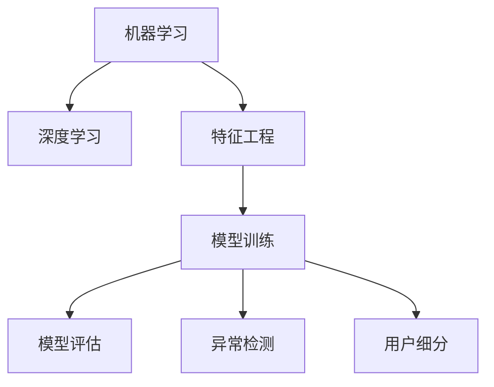

                 

# 机器学习在用户行为分析中的应用

## 1. 背景介绍

### 1.1 问题由来

随着互联网和移动互联网的迅猛发展，人们的生活和工作方式发生了深刻的变化。数字行为分析已成为企业洞察用户需求、优化产品设计、提升用户体验和促进商业决策的重要手段。传统的数据分析方法虽然有效，但在处理海量数据、发现潜在模式和进行预测性分析方面存在诸多限制。

近年来，机器学习（Machine Learning, ML）和深度学习（Deep Learning, DL）技术在数据处理和模式识别方面的突破性进展，使得用户行为分析进入了一个新的阶段。机器学习不仅能处理大规模数据集，还能自动发现数据中的复杂模式，提供更精确的预测和分类能力。在商业应用中，通过机器学习技术，企业可以更好地理解用户行为，实现精准营销、个性化推荐、用户留存率提升、客户细分等目标。

### 1.2 问题核心关键点

机器学习在用户行为分析中的应用，主要围绕以下几个核心关键点展开：

- **数据预处理**：用户行为数据往往包含大量噪音和不一致性，需要对数据进行清洗和预处理，以提高后续模型的精度和泛化能力。
- **特征工程**：从原始数据中提取具有代表性和区分度的特征，构建用户行为特征向量，供模型进行学习。
- **模型选择与训练**：选择合适的机器学习模型，使用标注数据进行训练，以实现对用户行为的分类、预测或聚类。
- **模型评估与优化**：通过交叉验证、性能指标评估等方法，不断调整模型参数，优化模型效果。
- **应用部署与迭代**：将优化后的模型部署到实际应用中，监控模型性能，不断迭代优化。

### 1.3 问题研究意义

用户行为分析对于提升企业的市场竞争力具有重要意义：

1. **精准营销**：通过分析用户行为数据，企业可以更精准地定位目标用户群体，制定个性化的广告和促销策略。
2. **产品优化**：理解用户对产品的使用习惯和偏好，及时调整产品功能和界面，提升用户体验。
3. **客户细分与流失预警**：识别不同行为模式的用户群体，针对高价值用户进行重点服务，对可能流失的用户进行预警和挽留。
4. **推荐系统优化**：根据用户行为历史和实时数据，优化个性化推荐算法，提升用户满意度和粘性。
5. **运营效率提升**：通过行为分析，优化运营流程，降低运营成本，提高服务响应速度和质量。

## 2. 核心概念与联系

### 2.1 核心概念概述

为更好地理解机器学习在用户行为分析中的应用，本节将介绍几个密切相关的核心概念：

- **机器学习**：一种人工智能技术，通过数据训练算法模型，实现对新数据的高效预测和分类。
- **深度学习**：机器学习的一个子领域，通过多层次神经网络模型，实现更复杂的特征提取和模式识别。
- **特征工程**：数据预处理和模型训练前的关键步骤，通过特征提取和变换，构建高质量的输入特征向量。
- **模型训练**：使用标注数据训练模型，调整模型参数以提高泛化能力。
- **交叉验证**：通过将数据集分为训练集和验证集，评估模型的泛化性能。
- **模型评估指标**：如准确率、召回率、F1分数、AUC等，用于衡量模型在不同数据集上的性能。
- **异常检测**：识别数据中的异常点，帮助发现用户行为中的异常模式或异常用户。
- **用户细分**：根据用户行为特征，将用户划分为不同细分市场或群体，以实现精准营销。

这些概念之间的逻辑关系可以通过以下Mermaid流程图来展示：



这个流程图展示了机器学习在用户行为分析过程中的主要步骤和概念关系：

1. 机器学习和深度学习作为算法基础，提供数据处理和模式识别能力。
2. 特征工程从原始数据中提取有用特征，构建高质量的输入数据。
3. 模型训练使用标注数据，调整模型参数，提高模型泛化能力。
4. 模型评估通过交叉验证和性能指标，衡量模型效果。
5. 异常检测和用户细分，基于模型预测结果进行后续应用。

## 3. 核心算法原理 & 具体操作步骤

### 3.1 算法原理概述

用户行为分析主要分为两大类任务：监督学习和非监督学习。监督学习需要标注数据，通过预测任务（如分类、回归、序列标注等）进行模型训练；非监督学习则不需要标注数据，通过聚类、降维等方法发现用户行为中的潜在模式。

本文重点介绍监督学习方法，以分类任务为例，其核心原理为：

- **数据准备**：收集和清洗用户行为数据，标注数据集。
- **特征提取**：从行为数据中提取特征向量，构成训练样本。
- **模型训练**：选择合适的机器学习模型（如SVM、随机森林、神经网络等），使用标注数据训练模型。
- **模型评估**：通过交叉验证和性能指标评估模型效果。
- **应用部署**：将训练好的模型部署到实际应用中，进行预测和分类。

### 3.2 算法步骤详解

以下详细介绍机器学习在用户行为分类任务中的应用步骤：

**Step 1: 数据收集与预处理**
- 收集用户行为数据，包括点击行为、购买记录、搜索历史、评分反馈等。
- 对数据进行清洗和预处理，去除噪音和不一致性，如处理缺失值、异常值、重复数据等。
- 对用户行为进行特征提取，如用户ID、行为发生时间、行为类型等。

**Step 2: 特征工程**
- 选择和构建特征向量，如TF-IDF特征、时间特征、行为序列特征等。
- 使用PCA等降维方法减少特征维度，提高模型训练效率。
- 对特征进行归一化和标准化处理，确保模型对不同量级特征的公平处理。

**Step 3: 模型选择与训练**
- 选择合适的机器学习模型，如决策树、随机森林、支持向量机、神经网络等。
- 对模型进行参数调优，选择合适的算法超参数，如学习率、正则化系数等。
- 使用交叉验证等技术进行模型训练，防止过拟合。

**Step 4: 模型评估与优化**
- 使用测试集评估模型性能，如准确率、召回率、F1分数、AUC等。
- 根据评估结果调整模型参数，如增加特征数量、调整正则化系数等。
- 使用集成学习等方法提高模型性能，如Bagging、Boosting等。

**Step 5: 应用部署与迭代**
- 将训练好的模型部署到实际应用中，如网站推荐系统、移动应用推荐引擎等。
- 监控模型性能，收集新数据，不断迭代优化模型，保持模型最新状态。

### 3.3 算法优缺点

机器学习在用户行为分析中具有以下优点：

- **高效处理大规模数据**：机器学习算法能够处理海量用户行为数据，发现数据中的复杂模式。
- **自适应性强**：机器学习模型能够自动调整参数，提高泛化能力，适应不同数据集和应用场景。
- **精度高**：通过不断优化模型参数和特征选择，可以实现较高的预测精度。
- **算法灵活**：机器学习提供多种算法选择，根据数据特性选择最合适的算法。

同时，机器学习也存在一些局限性：

- **需要标注数据**：机器学习模型需要大量的标注数据进行训练，标注成本较高。
- **模型复杂**：深度学习等复杂模型可能面临过拟合和训练时间长的问题。
- **模型可解释性差**：某些模型（如神经网络）的决策过程难以解释，不利于实际应用。
- **数据质量依赖**：模型性能受数据质量和特征工程的影响较大，数据质量问题可能严重影响模型效果。

### 3.4 算法应用领域

机器学习在用户行为分析中的应用广泛，具体包括：

- **个性化推荐**：根据用户行为数据，推荐合适的产品或服务。
- **用户分群**：识别不同用户群体，进行精准营销和个性化服务。
- **行为预测**：预测用户未来的行为，如购买意向、流失风险等。
- **异常检测**：识别异常行为，如欺诈行为、恶意行为等。
- **行为序列分析**：分析用户行为序列，发现用户行为模式和趋势。
- **情感分析**：通过用户评论、反馈等数据，分析用户情绪和满意度。

## 4. 数学模型和公式 & 详细讲解 & 举例说明

### 4.1 数学模型构建

假设我们有一组用户行为数据 $\{(x_i, y_i)\}_{i=1}^N$，其中 $x_i$ 表示用户行为特征向量，$y_i \in \{0,1\}$ 表示用户是否进行某个行为（如购买）。我们的目标是使用机器学习模型 $M$ 对用户行为进行分类，即预测 $y_i$。

设 $M$ 的参数为 $\theta$，其分类边界为 $f(x_i; \theta) = \sigma(Wx_i + b)$，其中 $W$ 为权重矩阵，$b$ 为偏置向量，$\sigma$ 为激活函数。分类边界高于 $0.5$ 时，模型预测为 $1$；低于 $0.5$ 时，预测为 $0$。

我们的目标是最小化预测误差，即：

$$
\mathcal{L}(\theta) = -\frac{1}{N} \sum_{i=1}^N (y_i \log f(x_i; \theta) + (1-y_i) \log (1-f(x_i; \theta)))
$$

其中 $f(x_i; \theta) = \sigma(Wx_i + b)$，$\log$ 表示自然对数。

### 4.2 公式推导过程

接下来，我们将上述目标函数进行详细推导：

- 将分类边界 $f(x_i; \theta)$ 代入目标函数：
$$
\mathcal{L}(\theta) = -\frac{1}{N} \sum_{i=1}^N (y_i \log \sigma(Wx_i + b) + (1-y_i) \log (1-\sigma(Wx_i + b)))
$$

- 对 $W$ 和 $b$ 进行梯度下降更新，以最小化 $\mathcal{L}(\theta)$：
$$
\frac{\partial \mathcal{L}(\theta)}{\partial W} = -\frac{1}{N} \sum_{i=1}^N \left( y_i (x_i \sigma'(Wx_i + b)) - (1-y_i) x_i \sigma'(Wx_i + b) \right)
$$

$$
\frac{\partial \mathcal{L}(\theta)}{\partial b} = -\frac{1}{N} \sum_{i=1}^N \left( y_i \sigma(Wx_i + b) - (1-y_i) \sigma(Wx_i + b) \right)
$$

其中 $\sigma'$ 为 $\sigma$ 函数的导数。

### 4.3 案例分析与讲解

以一个简单的购物网站为例，分析用户行为分类任务的机器学习实现：

1. **数据收集与预处理**：收集用户的浏览、点击、购买等行为数据，并进行清洗和预处理。例如，去除重复行为记录，处理缺失数据。

2. **特征工程**：从原始数据中提取有用特征，如用户ID、浏览时长、浏览商品ID、购买金额等。对特征进行归一化和标准化处理，防止特征值过大或过小影响模型训练。

3. **模型选择与训练**：选择随机森林或神经网络等模型，使用标注数据进行训练。例如，使用交叉验证技术，在训练集和验证集上分别训练多个模型，选择性能最佳的模型。

4. **模型评估与优化**：使用测试集评估模型性能，如准确率、召回率、F1分数、AUC等。根据评估结果调整模型参数，如增加特征数量、调整正则化系数等。

5. **应用部署与迭代**：将训练好的模型部署到推荐系统中，进行实时推荐和分类预测。收集新数据，不断迭代优化模型，保持模型最新状态。

## 5. 项目实践：代码实例和详细解释说明

### 5.1 开发环境搭建

在进行用户行为分析的机器学习实践前，我们需要准备好开发环境。以下是使用Python进行Scikit-Learn开发的环境配置流程：

1. 安装Anaconda：从官网下载并安装Anaconda，用于创建独立的Python环境。

2. 创建并激活虚拟环境：
```bash
conda create -n ml-env python=3.8 
conda activate ml-env
```

3. 安装Scikit-Learn、Numpy、Pandas等工具包：
```bash
pip install scikit-learn numpy pandas matplotlib jupyter notebook ipython
```

4. 安装Keras等深度学习框架（可选）：
```bash
pip install keras tensorflow
```

完成上述步骤后，即可在`ml-env`环境中开始机器学习实践。

### 5.2 源代码详细实现

下面以用户行为分类任务为例，给出使用Scikit-Learn进行随机森林模型训练的Python代码实现。

```python
from sklearn.ensemble import RandomForestClassifier
from sklearn.model_selection import train_test_split
from sklearn.metrics import accuracy_score, precision_score, recall_score, f1_score, roc_auc_score
from sklearn.datasets import make_classification
import pandas as pd
import numpy as np

# 生成示例数据集
X, y = make_classification(n_samples=1000, n_features=5, n_informative=3, n_redundant=0, random_state=42)

# 将数据集划分为训练集和测试集
X_train, X_test, y_train, y_test = train_test_split(X, y, test_size=0.2, random_state=42)

# 定义模型
model = RandomForestClassifier(n_estimators=100, random_state=42)

# 训练模型
model.fit(X_train, y_train)

# 预测测试集
y_pred = model.predict(X_test)

# 评估模型
print("Accuracy:", accuracy_score(y_test, y_pred))
print("Precision:", precision_score(y_test, y_pred))
print("Recall:", recall_score(y_test, y_pred))
print("F1 Score:", f1_score(y_test, y_pred))
print("AUC Score:", roc_auc_score(y_test, y_pred))
```

### 5.3 代码解读与分析

让我们再详细解读一下关键代码的实现细节：

- **make_classification函数**：用于生成模拟的分类数据集。
- **train_test_split函数**：将数据集划分为训练集和测试集。
- **RandomForestClassifier模型**：使用随机森林算法进行分类。
- **fit方法**：使用训练集数据拟合模型。
- **predict方法**：使用模型进行测试集预测。
- **准确率、精度、召回率、F1分数、AUC分数**：通过这些性能指标评估模型效果。

以上代码实现了一个简单的用户行为分类任务，展示了Scikit-Learn库的使用。开发者可以根据具体任务，选择不同的模型和算法，进行特征工程和模型训练。

## 6. 实际应用场景

### 6.1 智能推荐系统

智能推荐系统是机器学习在用户行为分析中的重要应用之一。推荐系统通过分析用户的历史行为数据，推荐用户可能感兴趣的产品或服务。推荐系统的核心在于用户行为建模和相似性匹配。

在实践中，可以通过以下步骤实现智能推荐系统：

1. **数据收集**：收集用户的浏览、点击、购买、评分等行为数据。
2. **特征提取**：从原始数据中提取特征，如用户ID、商品ID、购买时间、评分等。
3. **模型训练**：使用机器学习算法，如协同过滤、内容推荐、深度学习等，训练推荐模型。
4. **推荐预测**：根据用户行为数据和历史推荐数据，预测用户对不同商品的可能兴趣，生成推荐结果。
5. **效果评估**：通过A/B测试等方法，评估推荐系统的性能，不断优化推荐策略。

智能推荐系统可以应用于电商、视频、音乐等各类平台，提升用户体验和运营效率。

### 6.2 用户流失预测

用户流失预测是企业用户行为分析的另一个重要应用。通过分析用户行为数据，预测用户流失风险，提前采取措施挽留用户。

在实践中，可以通过以下步骤实现用户流失预测：

1. **数据收集**：收集用户的购买、使用、反馈等行为数据。
2. **特征提取**：从原始数据中提取特征，如用户ID、购买频率、使用时长、投诉次数等。
3. **模型训练**：使用机器学习算法，如逻辑回归、随机森林、深度学习等，训练用户流失预测模型。
4. **预测用户流失**：根据用户行为数据和历史流失数据，预测用户流失概率，生成流失风险评分。
5. **采取措施**：对高流失风险用户，采取个性化服务、优惠活动等措施，提升用户粘性。

用户流失预测可以应用于金融、电信、游戏等各类行业，帮助企业提升用户满意度和服务质量。

### 6.3 行为异常检测

行为异常检测是用户行为分析中的重要环节，通过识别用户行为中的异常模式，防范风险和欺诈行为。

在实践中，可以通过以下步骤实现行为异常检测：

1. **数据收集**：收集用户的交易、操作、访问等行为数据。
2. **特征提取**：从原始数据中提取特征，如交易金额、交易时间、操作频率等。
3. **模型训练**：使用机器学习算法，如孤立森林、神经网络等，训练行为异常检测模型。
4. **识别异常行为**：根据用户行为数据和历史正常数据，识别异常行为模式。
5. **采取措施**：对异常行为用户，采取验证、监控等措施，保障用户和平台安全。

行为异常检测可以应用于金融、网络安全、社交平台等各类场景，提升平台的安全性和用户信任度。

## 7. 工具和资源推荐

### 7.1 学习资源推荐

为了帮助开发者系统掌握机器学习在用户行为分析中的应用，这里推荐一些优质的学习资源：

1. **《机器学习》课程**：斯坦福大学Andrew Ng教授的机器学习课程，涵盖了机器学习的基本概念和算法，是入门机器学习的最佳选择。
2. **Kaggle平台**：数据科学竞赛平台，提供丰富的机器学习竞赛和数据集，帮助开发者实践和提升技能。
3. **Scikit-Learn官方文档**：Scikit-Learn官方文档，详细介绍了机器学习算法和模型，提供丰富的案例和代码示例。
4. **Google机器学习速成课程**：Google提供的免费机器学习速成课程，涵盖机器学习基础、深度学习等内容。
5. **Coursera平台**：在线学习平台，提供丰富的机器学习相关课程，如深度学习、自然语言处理等。

通过对这些资源的学习实践，相信你一定能够快速掌握机器学习在用户行为分析中的应用。

### 7.2 开发工具推荐

高效的开发离不开优秀的工具支持。以下是几款用于机器学习用户行为分析开发的常用工具：

1. **Scikit-Learn**：Python中的机器学习库，提供了丰富的算法和模型，易于使用。
2. **TensorFlow**：Google开发的深度学习框架，支持大规模模型训练和部署。
3. **Keras**：高层次神经网络API，易于使用，支持多种深度学习模型。
4. **Jupyter Notebook**：交互式Python开发环境，便于编写和测试代码。
5. **PyTorch**：Facebook开发的深度学习框架，灵活高效，适合研究人员和工程师使用。

合理利用这些工具，可以显著提升机器学习用户行为分析任务的开发效率，加快创新迭代的步伐。

### 7.3 相关论文推荐

机器学习在用户行为分析方面的研究不断进展，以下是几篇奠基性的相关论文，推荐阅读：

1. **A Survey of Feature Selection Techniques for Classification**：总结了特征选择方法，为机器学习模型的特征工程提供参考。
2. **The Element of Statistical Learning**：介绍了统计学习理论，为机器学习算法的设计和评估提供基础。
3. **Deep Learning for Recommender Systems**：介绍了深度学习在推荐系统中的应用，探讨了推荐系统的新方向。
4. **The Lottery Ticket Hypothesis: Finding Sparse, Trainable Neural Networks**：提出了稀疏优化方法，提高深度学习模型的训练效率。
5. **Anomaly Detection: A Survey**：总结了异常检测方法，为行为异常检测提供理论基础。

这些论文代表了大数据时代机器学习在用户行为分析方面的研究进展，通过学习这些前沿成果，可以帮助研究者把握学科前进方向，激发更多的创新灵感。

## 8. 总结：未来发展趋势与挑战

### 8.1 研究成果总结

机器学习在用户行为分析中取得了诸多研究成果，主要包括以下几个方面：

1. **算法创新**：引入了深度学习、神经网络、集成学习等算法，提高了模型的准确率和泛化能力。
2. **特征工程**：研究了特征选择、特征提取、特征降维等技术，提升了数据预处理的效果。
3. **模型优化**：研究了模型参数调优、正则化、对抗训练等技术，提高了模型的鲁棒性和泛化能力。
4. **应用拓展**：应用了机器学习技术，如个性化推荐、用户流失预测、行为异常检测等，提升了用户行为分析的实用性和可靠性。

### 8.2 未来发展趋势

展望未来，机器学习在用户行为分析领域将呈现以下几个发展趋势：

1. **算法多样化**：将更多算法引入用户行为分析，如强化学习、迁移学习、对抗学习等，提升模型的适应性和泛化能力。
2. **模型轻量化**：研究轻量化模型和模型压缩技术，提高模型的实时性和资源利用率。
3. **实时性提升**：研究实时数据处理和模型训练技术，实现用户行为分析的实时化和自动化。
4. **多模态融合**：研究多模态数据融合技术，提高用户行为分析的全面性和准确性。
5. **联邦学习**：研究联邦学习技术，保护用户隐私的同时，实现跨平台、跨机构的用户行为分析。

### 8.3 面临的挑战

尽管机器学习在用户行为分析中取得了诸多进展，但在迈向更加智能化、普适化应用的过程中，仍面临以下挑战：

1. **数据隐私和安全**：用户行为数据的隐私和安全问题需高度重视，需采取隐私保护措施，确保数据合法合规使用。
2. **模型鲁棒性**：模型需具备良好的鲁棒性和泛化能力，以应对不同数据集和应用场景的变化。
3. **算法可解释性**：需提高算法的可解释性，便于用户理解和接受。
4. **模型效率**：需提升模型的实时性和资源利用率，以支持大规模用户行为分析。
5. **模型复杂性**：需简化模型结构，降低模型的复杂性，以提高模型稳定性和可维护性。

### 8.4 研究展望

面对机器学习在用户行为分析中面临的挑战，未来的研究需要在以下几个方面寻求新的突破：

1. **隐私保护技术**：研究数据隐私保护技术，如差分隐私、联邦学习等，保护用户隐私。
2. **模型解释性**：研究模型解释技术，如可解释机器学习、透明学习等，提高模型的可解释性。
3. **实时化技术**：研究实时数据处理和模型训练技术，实现实时化的用户行为分析。
4. **多模态融合**：研究多模态数据融合技术，提升用户行为分析的全面性和准确性。
5. **联邦学习**：研究联邦学习技术，实现跨平台、跨机构的用户行为分析，保护用户隐私。

这些研究方向的探索，必将引领机器学习在用户行为分析领域的进一步发展，为构建智能化、普适化的用户行为分析系统提供新的思路和方法。面向未来，机器学习技术还将与其他人工智能技术进行更深入的融合，如知识表示、因果推理、强化学习等，协同发力，共同推动用户行为分析技术的进步。

## 9. 附录：常见问题与解答

**Q1：机器学习在用户行为分析中需要多少标注数据？**

A: 机器学习在用户行为分析中需要多少标注数据，取决于数据集的大小、模型的复杂度和预测任务的难度。一般来说，数据量越大，模型效果越好。如果数据量较少，可以通过数据增强、半监督学习等方法，缓解标注数据不足的问题。

**Q2：机器学习算法是否能够自动发现数据中的模式？**

A: 机器学习算法能够自动发现数据中的模式，但这种模式通常是数据分布规律和特征之间的关联，而非数据的本质和因果关系。对于复杂的因果关系和异常模式，仍需结合专家知识和人工干预。

**Q3：机器学习在用户行为分析中，如何处理大规模数据？**

A: 机器学习在处理大规模数据时，通常采用分布式计算和并行处理技术，如使用Hadoop、Spark等大数据处理平台，提高数据处理效率。此外，可以使用模型压缩和轻量化技术，减少模型复杂度，提升实时性。

**Q4：机器学习在用户行为分析中，如何评估模型性能？**

A: 机器学习在用户行为分析中，通常使用准确率、召回率、F1分数、AUC等性能指标进行模型评估。这些指标可以帮助评估模型在不同数据集和应用场景下的泛化能力和准确性。

**Q5：机器学习在用户行为分析中，如何避免过拟合？**

A: 机器学习在用户行为分析中，通常使用正则化技术、Dropout、Early Stopping等方法，防止模型过拟合。此外，可以采用数据增强、特征降维等方法，提高模型的泛化能力。

---

作者：禅与计算机程序设计艺术 / Zen and the Art of Computer Programming

