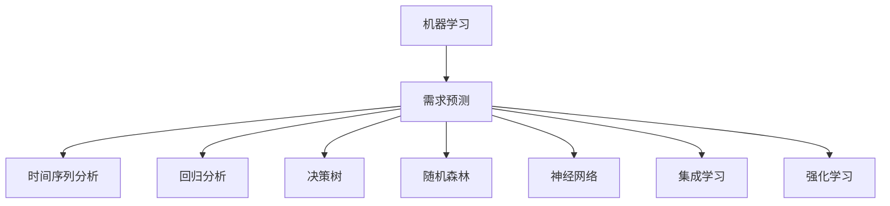

                 

# 机器学习在需求预测中的作用

## 1. 背景介绍

### 1.1 问题由来

需求预测是企业运营管理中极为关键的一环，其准确性直接影响企业供应链管理、库存管理、销售策略等。传统的需求预测方法往往依赖专家经验和历史数据，存在数据依赖性强、主观性强、预测精度差等问题。随着人工智能技术的迅猛发展，机器学习方法逐渐成为需求预测的新宠，其高效、客观、精度高、预测能力强的特点，使其在需求预测领域大放异彩。

### 1.2 问题核心关键点

机器学习在需求预测中的应用，关键在于通过构建准确的需求预测模型，利用历史数据和各类特征，自动发现数据中的模式和趋势，生成未来需求的预测结果。以下是影响需求预测模型性能的关键因素：

1. 数据质量：数据中是否包含噪音，数据的真实性和完整性。
2. 特征选择：哪些特征与需求变化有更强的相关性，是否需要构建新的特征。
3. 模型选择：不同机器学习模型在不同类型的预测问题上性能差异。
4. 超参数调优：选择合适的超参数使得模型更好地适应具体场景。
5. 模型评估：如何客观评估预测结果的准确性和可靠性。
6. 模型部署：如何将模型部署到实际的生产环境中，并持续优化。

### 1.3 问题研究意义

机器学习在需求预测中的应用，对于提升企业决策质量、优化资源配置、降低运营成本具有重要意义：

1. 提升决策质量：机器学习能够自动分析海量历史数据，发现数据中的规律和趋势，生成客观准确的预测结果，辅助决策者制定更合理的业务策略。
2. 优化资源配置：通过预测产品需求，企业可以更有效地分配生产和库存资源，避免生产过剩和缺货情况，提升运营效率。
3. 降低运营成本：准确的需求预测能够避免不必要的库存和浪费，降低物流和库存管理成本，提升企业的市场竞争力。
4. 加速业务创新：基于预测结果，企业可以更快地推出新产品和市场策略，应对市场需求变化，保持行业领先地位。
5. 赋能产业升级：需求预测技术的广泛应用，使各行业能够实现数字化、智能化转型，提升生产效率和服务质量。

## 2. 核心概念与联系

### 2.1 核心概念概述

为更好地理解机器学习在需求预测中的应用，本节将介绍几个密切相关的核心概念：

- 机器学习（Machine Learning, ML）：指通过数据训练模型，使模型能够自动学习数据中的模式，并生成预测结果的技术。
- 需求预测（Demand Forecasting）：指利用历史数据和各类特征，预测未来需求趋势和规模的过程。
- 时间序列分析（Time Series Analysis）：指对随时间变化的数据进行分析预测，是需求预测中常用的方法之一。
- 回归分析（Regression Analysis）：指利用数据建立变量之间的线性或非线性关系，预测未来数值的方法。
- 决策树（Decision Tree）：一种基于树形结构的机器学习模型，常用于特征选择和分类问题。
- 随机森林（Random Forest）：多个决策树的集成，用于处理复杂的分类和回归问题。
- 神经网络（Neural Network, NN）：一种类脑神经元网络的机器学习模型，适用于非线性关系的预测和分类问题。
- 集成学习（Ensemble Learning）：通过组合多个模型，提升模型的整体预测性能。
- 强化学习（Reinforcement Learning, RL）：通过奖励和惩罚机制，训练模型在动态环境中做出最优决策。

这些核心概念之间的逻辑关系可以通过以下Mermaid流程图来展示：



这个流程图展示了大语言模型的核心概念及其之间的关系：

1. 机器学习是需求预测的基础，通过训练模型学习数据中的规律。
2. 时间序列分析、回归分析、决策树、随机森林、神经网络等机器学习方法，都是常用的预测模型。
3. 集成学习和强化学习，则可以进一步提升模型的泛化能力和决策能力。

这些概念共同构成了需求预测的机器学习框架，使其能够更好地适应数据分布的变化，预测未来需求。

## 3. 核心算法原理 & 具体操作步骤
### 3.1 算法原理概述

基于机器学习的需求预测，本质上是建立一个预测模型，利用历史数据和特征，自动学习数据中的规律，并生成未来需求的预测结果。常见的机器学习算法包括时间序列分析、回归分析、决策树、随机森林、神经网络、集成学习、强化学习等。

以时间序列分析为例，其原理是利用时间序列中的规律，通过观察历史数据的变化趋势，预测未来时间点的需求值。常用的时间序列模型包括ARIMA、SARIMA、VAR、LSTM等，它们都是基于不同数学模型的线性或非线性预测方法。

以回归分析为例，其原理是利用数据中的变量关系，建立模型来预测未来的需求值。回归分析包括线性回归、多项式回归、岭回归、LASSO回归等，其中岭回归和LASSO回归通过正则化技术解决过拟合问题。

以决策树为例，其原理是通过划分数据集来预测分类或回归结果。决策树利用信息增益或基尼系数选择最优划分特征，通过树形结构生成预测结果。

以随机森林为例，其原理是通过集成多个决策树，生成更加鲁棒的预测结果。随机森林在训练和测试阶段，分别随机选择样本和特征，使得模型具有更高的泛化能力。

以神经网络为例，其原理是通过多层次的非线性映射，将输入特征映射到预测结果。神经网络包含输入层、隐藏层、输出层，通过反向传播算法更新网络参数，使得网络能够拟合数据中的非线性关系。

以集成学习为例，其原理是通过组合多个模型，提升预测性能。集成学习包括Bagging、Boosting、Stacking等方法，通过集成算法使得模型更加稳健。

以强化学习为例，其原理是通过奖励和惩罚机制，训练模型在动态环境中做出最优决策。强化学习包括Q-Learning、Deep Q-Network等方法，通过不断试错，使得模型在特定环境中获得最优策略。

### 3.2 算法步骤详解

基于机器学习的需求预测，通常包括数据预处理、特征选择、模型选择、训练和评估、预测等关键步骤：

**Step 1: 数据预处理**
- 收集历史需求数据，进行清洗、去重、填充缺失值等处理。
- 划分训练集、验证集和测试集，保证模型训练和评估的独立性。

**Step 2: 特征选择**
- 利用统计方法或领域知识选择与需求变化最相关的特征。
- 构建新的复合特征，如节假日、促销活动、季节变化等，增强预测能力。

**Step 3: 模型选择**
- 根据问题的性质和数据特征选择合适的机器学习模型。
- 考虑模型的复杂度、泛化能力、计算效率等因素，进行模型对比选择。

**Step 4: 训练和评估**
- 在训练集上使用模型的超参数和算法进行训练。
- 在验证集上评估模型的性能，调整超参数，避免过拟合。
- 在测试集上再次评估模型，给出最终预测性能的指标。

**Step 5: 预测和部署**
- 将训练好的模型部署到实际的生产环境中，进行实时需求预测。
- 定期收集新的数据，更新模型参数，保持预测性能。

### 3.3 算法优缺点

机器学习在需求预测中的应用，具有以下优点：

1. 自动化：机器学习可以自动分析数据，发现数据中的规律，生成预测结果。
2. 高精度：机器学习可以综合考虑多个因素，生成更准确的预测结果。
3. 泛化能力强：机器学习模型可以适应数据分布的变化，预测性能稳健。
4. 可解释性差：大多数机器学习模型黑盒处理，难以解释其内部决策逻辑。
5. 依赖数据质量：数据中的噪音和异常值会影响预测结果。
6. 计算复杂度高：大规模数据的训练和预测需要较高的计算资源。

同时，该方法也存在一定的局限性：

1. 模型选择困难：不同问题的模型选择困难，需要深入理解问题和数据。
2. 过拟合风险：数据较少时容易发生过拟合，需要合理的正则化技术。
3. 模型难以解释：机器学习模型通常难以解释其内部决策过程，缺乏可解释性。
4. 参数调整复杂：模型的超参数需要精细调整，使得模型具有良好的泛化能力。
5. 对异常值敏感：机器学习模型对异常值敏感，需要进行异常值处理。

尽管存在这些局限性，但就目前而言，机器学习是需求预测领域的主流方法，其高效、准确、可扩展的特点，使其在商业化应用中得以广泛应用。未来相关研究的重点在于如何进一步提升模型的可解释性，降低对数据的依赖，提高模型的泛化能力。

### 3.4 算法应用领域

机器学习在需求预测中的应用，已广泛应用于各个行业领域：

1. 零售行业：预测商品销售量、库存管理、市场推广等。
2. 制造业：预测生产需求、设备维护、库存管理等。
3. 物流行业：预测货物运输需求、配送路线优化、仓储管理等。
4. 金融行业：预测客户贷款需求、市场交易量、风险评估等。
5. 医疗行业：预测医院病人流量、药品需求、医疗设备使用等。
6. 旅游行业：预测旅游需求、旅游热点、交通流量等。

此外，机器学习的需求预测方法，也在不断拓展到更多领域，如农业、能源、交通、城市规划等，为各行各业带来了新的数字化、智能化解决方案。

## 4. 数学模型和公式 & 详细讲解  
### 4.1 数学模型构建

基于机器学习的需求预测，常见的数学模型包括时间序列模型、回归模型、决策树模型、神经网络模型等。

以时间序列模型为例，常用的ARIMA模型可以表示为：

$$ ARIMA(p, d, q)(P, D, Q)[S]_c $$

其中：
- $ARIMA$：自回归积分滑动平均模型。
- $p$、$d$、$q$：自回归项、差分阶数、滑动平均阶数。
- $(P, D, Q)$：季节性自回归项、季节性差分阶数、季节性滑动平均阶数。
- $S$：季节性周期。
- $c$：随机误差项的均值。

以回归模型为例，常用的线性回归模型可以表示为：

$$ y = \beta_0 + \beta_1 x_1 + \beta_2 x_2 + \ldots + \beta_n x_n + \epsilon $$

其中：
- $y$：预测结果。
- $\beta_0, \beta_1, \beta_2, \ldots, \beta_n$：回归系数。
- $x_1, x_2, \ldots, x_n$：特征变量。
- $\epsilon$：误差项。

以神经网络模型为例，常用的多层感知机（MLP）模型可以表示为：

$$ f(x) = w_1 f_{hidden}(w_2 x + b_2) + b_1 $$

其中：
- $f(x)$：预测结果。
- $w_1, w_2$：权重。
- $b_1, b_2$：偏置。
- $f_{hidden}$：隐藏层非线性激活函数，如Sigmoid、ReLU等。

### 4.2 公式推导过程

以线性回归模型为例，其最小二乘法公式为：

$$ \hat{\beta} = \mathop{\arg\min}_{\beta} \sum_{i=1}^n (y_i - \beta_0 - \beta_1 x_{1i} - \ldots - \beta_n x_{ni})^2 $$

将其展开并整理得到：

$$ \hat{\beta} = \left( X^T X \right)^{-1} X^T y $$

其中，$X^T$ 为特征矩阵的转置，$y$ 为标签向量。

以多层感知机模型为例，其前向传播公式为：

$$ h^{[l]} = g(\hat{z}^{[l]}) = g(w^{[l]} h^{[l-1]} + b^{[l]}) $$

其中：
- $h^{[l]}$：隐藏层输出。
- $g$：激活函数。
- $z^{[l]} = w^{[l]} h^{[l-1]} + b^{[l]}$：线性变换。
- $w^{[l]}$、$b^{[l]}$：权重和偏置。

以神经网络模型的反向传播算法为例，其公式为：

$$ \frac{\partial C}{\partial w^{[l]}} = \delta^{[l]} h^{[l-1]^T} $$

其中：
- $C$：损失函数。
- $\delta^{[l]}$：误差信号。
- $w^{[l]}$：权重。
- $h^{[l-1]}$：隐藏层输出。

### 4.3 案例分析与讲解

以ARIMA模型为例，其步骤包括：

1. 对数据进行差分处理，得到平稳序列。
2. 对平稳序列进行自回归分析，识别自回归项$p$。
3. 对平稳序列进行滑动平均分析，识别滑动平均项$q$。
4. 对平稳序列进行季节性分析，识别季节性自回归项$P$和季节性滑动平均项$Q$。
5. 结合以上步骤，构建ARIMA模型，进行预测。

以神经网络模型为例，其步骤包括：

1. 数据预处理，归一化、去重、填充缺失值等。
2. 划分训练集、验证集和测试集，确保模型评估的独立性。
3. 设计神经网络结构，选择输入层、隐藏层、输出层。
4. 确定激活函数、损失函数和优化器，选择合适的超参数。
5. 在训练集上进行前向传播和反向传播，更新模型参数。
6. 在验证集上评估模型性能，调整超参数。
7. 在测试集上最终评估模型，给出预测结果。

## 5. 项目实践：代码实例和详细解释说明
### 5.1 开发环境搭建

在进行需求预测实践前，我们需要准备好开发环境。以下是使用Python进行Scikit-learn开发的环境配置流程：

1. 安装Anaconda：从官网下载并安装Anaconda，用于创建独立的Python环境。

2. 创建并激活虚拟环境：
```bash
conda create -n demand-env python=3.8 
conda activate demand-env
```

3. 安装Scikit-learn：
```bash
pip install scikit-learn
```

4. 安装其他必要工具包：
```bash
pip install numpy pandas matplotlib seaborn
```

完成上述步骤后，即可在`demand-env`环境中开始需求预测实践。

### 5.2 源代码详细实现

这里我们以线性回归模型为例，给出使用Scikit-learn进行需求预测的Python代码实现。

首先，定义数据处理函数：

```python
import pandas as pd
from sklearn.model_selection import train_test_split
from sklearn.preprocessing import MinMaxScaler

def load_data(file_path):
    df = pd.read_csv(file_path)
    X = df.drop('y', axis=1)
    y = df['y']
    X_train, X_test, y_train, y_test = train_test_split(X, y, test_size=0.3, random_state=42)
    scaler = MinMaxScaler()
    X_train = scaler.fit_transform(X_train)
    X_test = scaler.transform(X_test)
    return X_train, y_train, X_test, y_test

X_train, y_train, X_test, y_test = load_data('data.csv')
```

然后，定义模型训练函数：

```python
from sklearn.linear_model import LinearRegression

def train_model(X_train, y_train):
    model = LinearRegression()
    model.fit(X_train, y_train)
    return model
```

接着，定义模型评估函数：

```python
from sklearn.metrics import mean_squared_error, r2_score

def evaluate_model(model, X_test, y_test):
    y_pred = model.predict(X_test)
    rmse = mean_squared_error(y_test, y_pred, squared=False)
    r2 = r2_score(y_test, y_pred)
    print(f'RMSE: {rmse:.2f}, R^2: {r2:.2f}')
```

最后，启动训练流程并在测试集上评估：

```python
model = train_model(X_train, y_train)
evaluate_model(model, X_test, y_test)
```

以上就是使用Scikit-learn进行线性回归需求预测的完整代码实现。可以看到，Scikit-learn的封装简洁高效，只需少量的代码，即可实现模型的训练和评估。

### 5.3 代码解读与分析

让我们再详细解读一下关键代码的实现细节：

**load_data函数**：
- 从CSV文件中加载数据。
- 将数据划分为特征和标签，进行数据拆分。
- 使用MinMaxScaler对数据进行归一化处理，保证数据在同一尺度上。

**train_model函数**：
- 实例化LinearRegression模型。
- 使用训练集数据训练模型，并返回模型实例。

**evaluate_model函数**：
- 使用模型对测试集进行预测。
- 计算预测结果与真实标签之间的RMSE和R^2值，评估模型性能。

**训练流程**：
- 使用train_model函数训练线性回归模型。
- 调用evaluate_model函数在测试集上评估模型性能。

可以看出，Scikit-learn提供了丰富的机器学习算法和工具，使得需求预测的实践过程非常便捷。开发者可以将更多精力放在数据处理、模型改进等高层逻辑上，而不必过多关注底层的实现细节。

当然，实际应用中还需要考虑更多因素，如模型保存和部署、超参数优化、模型鲁棒性等。但核心的需求预测模型实现，Scikit-learn已经为我们提供了完整的代码实现。

## 6. 实际应用场景
### 6.1 智能制造

基于机器学习的需求预测，可以应用于智能制造系统的生产计划制定。传统的制造系统往往采用固定生产计划，无法应对需求波动。而通过需求预测模型，可以实时监测订单变化，动态调整生产计划，减少库存和浪费，提升生产效率。

在技术实现上，可以收集订单历史数据、设备状态、市场需求等信息，构建需求预测模型，实时输出需求预测结果。根据预测结果，制造系统可以自动调整生产计划，协调设备使用，避免过生产或生产不足。

### 6.2 电子商务

基于机器学习的需求预测，可以应用于电子商务平台的商品销售预测。传统电商平台往往难以准确预测商品销售量，导致库存积压或断货。而通过需求预测模型，可以实时监测市场需求变化，动态调整库存管理策略，减少库存成本，提升客户满意度。

在技术实现上，可以收集历史销售数据、用户行为数据、市场趋势信息等，构建需求预测模型，实时输出销售预测结果。根据预测结果，电商平台可以自动调整库存和促销策略，优化用户购物体验，提升销售业绩。

### 6.3 供应链管理

基于机器学习的需求预测，可以应用于供应链管理系统的库存控制。传统的供应链管理系统往往采用固定库存策略，难以适应市场需求变化。而通过需求预测模型，可以实时监测订单变化，动态调整库存水平，避免库存过剩或短缺，降低物流成本，提升供应链效率。

在技术实现上，可以收集订单历史数据、库存状态、市场需求等信息，构建需求预测模型，实时输出需求预测结果。根据预测结果，供应链管理系统可以自动调整库存策略，协调物流资源，优化库存和运输效率，提升供应链响应速度。

### 6.4 未来应用展望

随着机器学习技术的不断发展，需求预测方法也将呈现以下几个发展趋势：

1. 数据融合：融合多源数据，包括销售数据、社交媒体数据、天气数据等，提升预测精度。
2. 模型优化：引入深度学习、强化学习等方法，提升预测模型的复杂度和泛化能力。
3. 实时预测：构建实时预测系统，实时输出预测结果，提升决策效率。
4. 异常检测：构建异常检测模型，识别异常数据和预测结果，保障预测结果的可靠性。
5. 模型评估：引入多种评估指标，如MAE、RMSE、MAPE等，综合评估模型性能。
6. 自动化部署：将模型部署为自动服务，集成到业务系统中，实现自动化预测。

以上趋势凸显了机器学习在需求预测中的广泛应用前景，需求预测技术必将在各行业中被广泛采用，为智能系统的运营优化提供强有力的支持。

## 7. 工具和资源推荐
### 7.1 学习资源推荐

为了帮助开发者系统掌握机器学习在需求预测中的应用，这里推荐一些优质的学习资源：

1. 《机器学习实战》系列博文：由机器学习专家撰写，系统介绍了机器学习在各行各业中的应用，包括需求预测。

2. 《统计学习方法》课程：北京大学《统计学习方法》课程，系统介绍了统计学习的基本概念和机器学习算法，适合入门学习。

3. 《机器学习》书籍：Tom Mitchell所著，全面介绍了机器学习的基本原理和方法，是机器学习领域的经典教材。

4. Scikit-learn官方文档：Scikit-learn库的官方文档，提供了丰富的算法和工具，适合实践学习。

5. Kaggle竞赛平台：Kaggle机器学习竞赛平台，提供了大量的机器学习竞赛和数据集，适合实战练习。

通过学习这些资源，相信你一定能够快速掌握机器学习在需求预测中的应用，并用于解决实际的业务问题。
###  7.2 开发工具推荐

高效的开发离不开优秀的工具支持。以下是几款用于需求预测开发的常用工具：

1. Scikit-learn：Python机器学习库，提供了丰富的机器学习算法和工具，适合快速迭代研究。

2. TensorFlow：由Google主导开发的深度学习框架，生产部署方便，适合大规模工程应用。

3. PyTorch：基于Python的开源深度学习框架，灵活性高，适合科研和实验。

4. Weights & Biases：模型训练的实验跟踪工具，可以记录和可视化模型训练过程中的各项指标，方便对比和调优。

5. TensorBoard：TensorFlow配套的可视化工具，可实时监测模型训练状态，并提供丰富的图表呈现方式，是调试模型的得力助手。

6. Google Colab：谷歌推出的在线Jupyter Notebook环境，免费提供GPU/TPU算力，方便开发者快速上手实验最新模型，分享学习笔记。

合理利用这些工具，可以显著提升需求预测任务的开发效率，加快创新迭代的步伐。

### 7.3 相关论文推荐

机器学习在需求预测中的应用，源于学界的持续研究。以下是几篇奠基性的相关论文，推荐阅读：

1. ARIMA: Approximating Autoregressive Integrated Moving Average Models: A Computationally Efficient Method: 提出了ARIMA模型，广泛应用于时间序列预测。

2. Statistical Learning: 介绍统计学习的基本概念和方法，适合入门学习。

3. Linear Regression: 介绍线性回归模型的基本原理和实现方法。

4. Deep Learning: 介绍深度学习的基本概念和方法，适合深入学习。

5. Reinforcement Learning: 介绍强化学习的基本概念和方法，适合深入学习。

这些论文代表了大语言模型微调技术的发展脉络。通过学习这些前沿成果，可以帮助研究者把握学科前进方向，激发更多的创新灵感。

## 8. 总结：未来发展趋势与挑战

### 8.1 总结

本文对基于机器学习的需求预测方法进行了全面系统的介绍。首先阐述了需求预测在企业运营管理中的重要性和机器学习方法的优势，明确了需求预测在提升决策质量、优化资源配置、降低运营成本等方面的意义。其次，从原理到实践，详细讲解了机器学习在需求预测中的应用，包括时间序列分析、回归分析、决策树、随机森林、神经网络、集成学习、强化学习等方法。同时，本文还探讨了需求预测模型的实现步骤和实际应用场景，展示了机器学习在智能制造、电子商务、供应链管理等领域的广泛应用。此外，本文还推荐了一些学习资源、开发工具和相关论文，力求为读者提供全方位的技术指引。

通过本文的系统梳理，可以看到，机器学习在需求预测中发挥了重要的作用，为企业运营提供了强有力的技术支持。未来，随着机器学习技术的不断发展，需求预测方法也将不断进步，为各行业的智能转型提供更可靠的保障。

### 8.2 未来发展趋势

展望未来，需求预测技术将呈现以下几个发展趋势：

1. 数据融合：融合多源数据，提升预测精度和可靠性。
2. 模型优化：引入深度学习、强化学习等方法，提升模型的复杂度和泛化能力。
3. 实时预测：构建实时预测系统，提升预测效率和决策速度。
4. 异常检测：构建异常检测模型，保障预测结果的稳定性和可靠性。
5. 自动化部署：将模型部署为自动服务，集成到业务系统中，实现自动化预测。
6. 可解释性：引入可解释性方法，提升模型的透明性和可信度。

以上趋势凸显了机器学习在需求预测中的广泛应用前景，需求预测技术必将在各行业中被广泛采用，为智能系统的运营优化提供强有力的支持。

### 8.3 面临的挑战

尽管需求预测技术已经取得了瞩目成就，但在迈向更加智能化、普适化应用的过程中，它仍面临诸多挑战：

1. 数据质量：数据中可能包含噪音和异常值，影响预测结果。
2. 模型选择：不同问题的模型选择困难，需要深入理解问题和数据。
3. 过拟合风险：数据较少时容易发生过拟合，需要合理的正则化技术。
4. 可解释性差：机器学习模型通常难以解释其内部决策过程，缺乏可解释性。
5. 资源消耗：大规模数据的训练和预测需要较高的计算资源。
6. 模型更新：需求预测模型需要定期更新，保持预测性能。

尽管存在这些挑战，但就目前而言，机器学习是需求预测领域的主流方法，其高效、准确、可扩展的特点，使其在商业化应用中得以广泛应用。未来相关研究的重点在于如何进一步提升模型的可解释性，降低对数据的依赖，提高模型的泛化能力。

### 8.4 研究展望

面对需求预测技术所面临的挑战，未来的研究需要在以下几个方面寻求新的突破：

1. 数据融合与治理：构建统一的数据治理体系，融合多源数据，提升数据质量。
2. 模型优化与可解释性：引入深度学习、强化学习等方法，提升模型的复杂度和可解释性。
3. 实时预测与自动化：构建实时预测系统，集成到业务系统中，实现自动化预测。
4. 异常检测与监控：构建异常检测模型，保障预测结果的稳定性和可靠性。
5. 模型评估与更新：引入多种评估指标，定期更新模型，保持预测性能。
6. 安全性与伦理：保障模型的安全性和公平性，避免有害的预测结果。

这些研究方向的探索，必将引领需求预测技术迈向更高的台阶，为构建安全、可靠、可解释、可控的智能系统铺平道路。面向未来，需求预测技术还需要与其他人工智能技术进行更深入的融合，如知识表示、因果推理、强化学习等，多路径协同发力，共同推动需求预测技术的进步。只有勇于创新、敢于突破，才能不断拓展需求预测技术的边界，让智能技术更好地服务于企业运营和社会发展。

## 9. 附录：常见问题与解答

**Q1：机器学习在需求预测中的局限性有哪些？**

A: 机器学习在需求预测中的局限性主要包括：
1. 数据质量问题：数据中可能包含噪音和异常值，影响预测结果。
2. 模型选择问题：不同问题的模型选择困难，需要深入理解问题和数据。
3. 过拟合问题：数据较少时容易发生过拟合，需要合理的正则化技术。
4. 可解释性问题：机器学习模型通常难以解释其内部决策过程，缺乏可解释性。
5. 资源消耗问题：大规模数据的训练和预测需要较高的计算资源。
6. 模型更新问题：需求预测模型需要定期更新，保持预测性能。

这些局限性需要我们在实践中不断探索和解决，才能实现机器学习在需求预测中的广泛应用。

**Q2：如何选择合适的机器学习模型？**

A: 选择合适的机器学习模型需要考虑以下几个因素：
1. 问题的性质：根据问题的分类、回归或聚类问题选择合适的模型。
2. 数据特征：考虑数据的分布、规模、噪声等特征，选择合适的模型。
3. 模型复杂度：考虑模型的复杂度和泛化能力，选择合适的模型。
4. 计算资源：考虑计算资源的限制，选择合适的模型。
5. 模型评估：通过实验比较不同模型的性能，选择最优的模型。

一般来说，可以先选择多种模型进行尝试，通过实验比较选择最优模型。

**Q3：机器学习在需求预测中的数据预处理包括哪些步骤？**

A: 机器学习在需求预测中的数据预处理包括以下几个步骤：
1. 数据清洗：去除重复数据、缺失值、异常值等。
2. 数据归一化：将数据归一化到同一尺度，避免因数据规模不同导致的影响。
3. 特征选择：选择与需求变化最相关的特征，构建新的复合特征。
4. 数据拆分：将数据划分为训练集、验证集和测试集，保证模型评估的独立性。

数据预处理是机器学习模型训练的重要环节，直接影响模型的预测性能。

**Q4：机器学习在需求预测中的模型评估包括哪些指标？**

A: 机器学习在需求预测中的模型评估指标主要包括：
1. RMSE：均方根误差，衡量预测结果与真实标签之间的差异。
2. MAE：平均绝对误差，衡量预测结果与真实标签之间的差异。
3. MAPE：平均绝对百分比误差，衡量预测结果与真实标签之间的差异。
4. R^2：决定系数，衡量预测结果与真实标签之间的相关性。
5. SSE：残差平方和，衡量预测结果的误差。
6. MSE：均方误差，衡量预测结果的误差。

通过这些指标，可以客观评估模型的预测性能，选择合适的模型。

**Q5：如何降低机器学习在需求预测中的过拟合风险？**

A: 降低机器学习在需求预测中的过拟合风险，可以采取以下措施：
1. 数据增强：通过回译、近义替换等方式扩充训练集。
2. 正则化：使用L2正则、Dropout、Early Stopping等避免过拟合。
3. 模型集成：通过集成多个模型，提升模型的泛化能力。
4. 交叉验证：通过交叉验证评估模型的泛化能力。
5. 超参数调优：选择合适的超参数，提升模型的泛化能力。

通过这些措施，可以有效地降低过拟合风险，提高模型的预测性能。

---

作者：禅与计算机程序设计艺术 / Zen and the Art of Computer Programming

