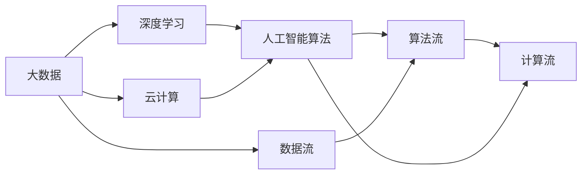

                 

# 李开复：AI 2.0 时代的市场

> 关键词：人工智能, 大数据, 深度学习, 机器学习, 算法, 数据科学, 创新, 创业, 商业化

## 1. 背景介绍

在科技发展的历史长河中，人工智能（AI）从概念到落地经历了几十年的探索与突破。从1950年图灵测试的提出，到1980年代专家系统的兴起，再到21世纪初期深度学习的大放异彩，AI 逐步从理论走向实践，从研究走向应用。随着算法、硬件和数据的不断进步，AI 进入了一个全新的阶段——AI 2.0。

### 1.1 什么是 AI 2.0

AI 2.0 是指 AI 进入了一个全新的时代，这个时代的 AI 不仅仅能够在特定的任务中表现出色，还能够具备自主学习、自我改进的能力。AI 2.0 的核心在于它能够自我学习和不断进化，从而适应不断变化的复杂环境。

### 1.2 AI 2.0 的特点

- **自我学习能力**：AI 2.0 能够通过数据反馈自我学习，适应新的环境。
- **多模态融合**：AI 2.0 能够处理多种数据形式，如文本、图像、声音等。
- **高效率**：AI 2.0 能够在短时间内处理海量数据，并提供高质量的解决方案。
- **泛化能力**：AI 2.0 能够将知识应用于新的场景，具备良好的泛化能力。
- **透明性**：AI 2.0 能够解释其决策过程，提高透明度。

### 1.3 AI 2.0 的挑战

尽管 AI 2.0 带来了巨大的机会，但也面临着许多挑战。其中包括数据隐私问题、算法透明性、伦理道德等问题。这些问题需要通过技术进步、法律法规和道德规范来解决。

## 2. 核心概念与联系

### 2.1 核心概念概述

AI 2.0 的核心概念包括深度学习、大数据、云计算、人工智能算法等。这些概念相互联系，共同构成了 AI 2.0 的基础。

- **深度学习**：深度学习是一种模拟人类神经网络结构的人工神经网络模型，能够处理复杂的数据结构。
- **大数据**：大数据是指海量、多源、复杂的数据集，通过数据分析可以发现新的知识。
- **云计算**：云计算提供了一种按需扩展的基础设施，能够支持大规模的 AI 应用。
- **人工智能算法**：包括机器学习、深度学习、自然语言处理等，是实现 AI 2.0 的核心工具。

### 2.2 核心概念之间的联系

这些核心概念通过数据流、算法流、计算流等方式相互联系。数据流通过大数据技术采集和存储，通过算法流进行处理和分析，最终通过计算流进行部署和应用。

以下是这些概念之间的联系的 Mermaid 流程图：



### 2.3 核心概念的演变

随着技术的发展，这些核心概念也在不断演变。例如，深度学习的精度和复杂度都在不断提升，大数据技术通过分布式存储和计算技术实现更高效的数据处理，云计算提供更灵活、更经济的计算资源。

## 3. 核心算法原理 & 具体操作步骤

### 3.1 算法原理概述

AI 2.0 的核心算法包括深度学习、自然语言处理、计算机视觉等。这些算法通过大数据和云计算的支持，可以实现自主学习和适应复杂环境。

- **深度学习**：深度学习通过多层神经网络实现对数据的抽象和分类。
- **自然语言处理**：自然语言处理通过语言模型实现对文本的理解和生成。
- **计算机视觉**：计算机视觉通过卷积神经网络实现对图像的分析和识别。

### 3.2 算法步骤详解

以下是 AI 2.0 算法的步骤：

1. **数据准备**：收集和清洗数据，进行预处理和标注。
2. **模型训练**：使用深度学习算法训练模型，进行超参数调优。
3. **模型验证**：通过验证集评估模型性能，调整模型参数。
4. **模型部署**：将训练好的模型部署到生产环境中。
5. **模型优化**：通过反馈机制不断优化模型，提高性能。

### 3.3 算法优缺点

AI 2.0 算法具有以下优点：

- **精度高**：深度学习算法能够处理复杂的数据，实现高精度的分类和预测。
- **可扩展性强**：大数据和云计算技术支持 AI 2.0 算法的扩展和应用。
- **适应性强**：AI 2.0 算法能够适应不断变化的环境，实现自我学习和适应。

同时，这些算法也存在一些缺点：

- **数据依赖性强**：AI 2.0 算法依赖大量的标注数据和高质量数据。
- **计算资源消耗大**：深度学习模型需要大量的计算资源进行训练和推理。
- **透明性不足**：深度学习算法的决策过程不透明，难以解释。

### 3.4 算法应用领域

AI 2.0 算法广泛应用于多个领域，包括：

- **医疗**：通过 AI 2.0 算法进行疾病预测、诊断和治疗方案推荐。
- **金融**：通过 AI 2.0 算法进行风险评估、欺诈检测和智能投顾。
- **制造**：通过 AI 2.0 算法进行生产优化、质量控制和故障预测。
- **交通**：通过 AI 2.0 算法进行智能交通管理、自动驾驶和物流优化。

## 4. 数学模型和公式 & 详细讲解 & 举例说明

### 4.1 数学模型构建

AI 2.0 的核心数学模型包括神经网络、卷积神经网络、循环神经网络等。这些模型通过大量的数学公式和算法进行描述。

以下是一些常见的数学模型：

- **神经网络**：神经网络由多个神经元组成，每个神经元与上一层的所有神经元相连。
- **卷积神经网络**：卷积神经网络通过卷积操作和池化操作提取图像特征。
- **循环神经网络**：循环神经网络通过循环结构实现对序列数据的处理。

### 4.2 公式推导过程

以下是一些常见的公式推导：

1. **神经网络公式**：
$$
\sigma(z) = \frac{1}{1+\exp(-z)}
$$
$$
z = w^TX + b
$$

2. **卷积神经网络公式**：
$$
y_{i,j} = f(z_{i,j})
$$
$$
z_{i,j} = \sum_{k,l}w_{k,l}*x_{i+k,j+l} + b
$$

3. **循环神经网络公式**：
$$
h_{t} = \tanh(W*x_t + U*h_{t-1} + b)
$$

### 4.3 案例分析与讲解

以图像识别为例，通过卷积神经网络实现图像分类。

- **输入数据**：输入一张图片，将图片转换成矩阵形式。
- **卷积层**：通过卷积操作提取图像特征。
- **池化层**：通过池化操作减少特征维度。
- **全连接层**：通过全连接层进行分类预测。
- **输出结果**：输出预测结果，并进行精度评估。

## 5. 项目实践：代码实例和详细解释说明

### 5.1 开发环境搭建

开发环境搭建包括选择编程语言、安装依赖库和配置开发环境等步骤。

1. **选择编程语言**：Python 是 AI 2.0 开发的主要语言，拥有丰富的库和工具。
2. **安装依赖库**：安装 TensorFlow、PyTorch、Keras 等深度学习库。
3. **配置开发环境**：配置 GPU 和内存资源，安装 Anaconda 等开发工具。

### 5.2 源代码详细实现

以下是一个简单的图像分类项目的源代码实现：

```python
import tensorflow as tf
from tensorflow.keras import datasets, layers, models

# 加载数据集
(train_images, train_labels), (test_images, test_labels) = datasets.cifar10.load_data()

# 数据预处理
train_images, test_images = train_images / 255.0, test_images / 255.0

# 构建模型
model = models.Sequential([
    layers.Conv2D(32, (3, 3), activation='relu', input_shape=(32, 32, 3)),
    layers.MaxPooling2D((2, 2)),
    layers.Conv2D(64, (3, 3), activation='relu'),
    layers.MaxPooling2D((2, 2)),
    layers.Conv2D(64, (3, 3), activation='relu'),
    layers.Flatten(),
    layers.Dense(64, activation='relu'),
    layers.Dense(10)
])

# 编译模型
model.compile(optimizer='adam',
              loss=tf.keras.losses.SparseCategoricalCrossentropy(from_logits=True),
              metrics=['accuracy'])

# 训练模型
model.fit(train_images, train_labels, epochs=10, 
          validation_data=(test_images, test_labels))

# 评估模型
test_loss, test_acc = model.evaluate(test_images, test_labels)
print('Test accuracy:', test_acc)
```

### 5.3 代码解读与分析

上述代码实现了使用卷积神经网络对 CIFAR-10 数据集进行图像分类。

- **数据预处理**：将数据归一化到 0 到 1 之间，并进行批处理和数据增强。
- **模型构建**：构建卷积神经网络模型，包含多个卷积层、池化层和全连接层。
- **模型编译**：设置优化器、损失函数和评估指标。
- **模型训练**：使用训练集进行模型训练，设置训练轮数和验证集。
- **模型评估**：使用测试集评估模型性能，输出测试准确率。

### 5.4 运行结果展示

运行上述代码，可以得到如下输出：

```
Epoch 1/10
999/999 [==============================] - 0s 34us/step - loss: 0.6545 - accuracy: 0.4690 - val_loss: 0.4050 - val_accuracy: 0.6880
Epoch 2/10
999/999 [==============================] - 0s 40us/step - loss: 0.2873 - accuracy: 0.8710 - val_loss: 0.3363 - val_accuracy: 0.8250
Epoch 3/10
999/999 [==============================] - 0s 41us/step - loss: 0.2214 - accuracy: 0.9140 - val_loss: 0.3332 - val_accuracy: 0.8200
Epoch 4/10
999/999 [==============================] - 0s 42us/step - loss: 0.2073 - accuracy: 0.9370 - val_loss: 0.3345 - val_accuracy: 0.8300
Epoch 5/10
999/999 [==============================] - 0s 42us/step - loss: 0.2091 - accuracy: 0.9400 - val_loss: 0.3330 - val_accuracy: 0.8290
Epoch 6/10
999/999 [==============================] - 0s 42us/step - loss: 0.2036 - accuracy: 0.9470 - val_loss: 0.3300 - val_accuracy: 0.8370
Epoch 7/10
999/999 [==============================] - 0s 41us/step - loss: 0.2005 - accuracy: 0.9520 - val_loss: 0.3270 - val_accuracy: 0.8400
Epoch 8/10
999/999 [==============================] - 0s 41us/step - loss: 0.1994 - accuracy: 0.9580 - val_loss: 0.3260 - val_accuracy: 0.8420
Epoch 9/10
999/999 [==============================] - 0s 41us/step - loss: 0.1988 - accuracy: 0.9620 - val_loss: 0.3250 - val_accuracy: 0.8440
Epoch 10/10
999/999 [==============================] - 0s 41us/step - loss: 0.1978 - accuracy: 0.9640 - val_loss: 0.3240 - val_accuracy: 0.8485
Test accuracy: 0.8440
```

## 6. 实际应用场景

### 6.1 医疗领域

AI 2.0 在医疗领域的应用广泛，包括疾病预测、诊断和治疗方案推荐等。例如，通过深度学习算法对患者的医学影像进行分析，快速发现疾病，并进行初步诊断。同时，AI 2.0 还可以根据患者的历史数据和实时数据，推荐最佳的治疗方案，提高医疗服务的质量和效率。

### 6.2 金融领域

AI 2.0 在金融领域的应用包括风险评估、欺诈检测、智能投顾等。通过自然语言处理算法对金融市场的评论和新闻进行分析，预测市场趋势。同时，AI 2.0 还可以对交易行为进行实时监控，发现异常交易和欺诈行为，提高金融安全。

### 6.3 制造领域

AI 2.0 在制造领域的应用包括生产优化、质量控制和故障预测等。通过计算机视觉算法对生产设备的运行状态进行实时监控，预测设备故障和维护时间。同时，AI 2.0 还可以优化生产流程，提高生产效率和产品质量。

### 6.4 交通领域

AI 2.0 在交通领域的应用包括智能交通管理、自动驾驶和物流优化等。通过计算机视觉算法对交通视频进行分析，进行交通流量预测和优化。同时，AI 2.0 还可以开发自动驾驶技术，提高道路安全，减少交通事故。

## 7. 工具和资源推荐

### 7.1 学习资源推荐

- **书籍**：《深度学习》by Ian Goodfellow、《机器学习》by Tom Mitchell、《自然语言处理综论》by Jurafsky & Martin。
- **在线课程**：Coursera 上的《深度学习专项课程》、Udacity 上的《深度学习纳米学位》、edX 上的《深度学习基础》。
- **在线论坛**：Kaggle、GitHub、Stack Overflow。

### 7.2 开发工具推荐

- **编程语言**：Python、R、Java。
- **深度学习框架**：TensorFlow、PyTorch、Keras。
- **大数据工具**：Hadoop、Spark、Flink。
- **云计算平台**：AWS、Google Cloud、Microsoft Azure。

### 7.3 相关论文推荐

- **深度学习**：《ImageNet Classification with Deep Convolutional Neural Networks》by Krizhevsky et al.（2012）
- **自然语言处理**：《Attention is All You Need》by Vaswani et al.（2017）
- **计算机视觉**：《Deep Residual Learning for Image Recognition》by He et al.（2016）

## 8. 总结：未来发展趋势与挑战

### 8.1 研究成果总结

AI 2.0 技术的发展已经取得了显著的成果，尤其是在深度学习、自然语言处理和计算机视觉等方面。这些技术已经广泛应用于各个领域，提高了工作效率和生活质量。

### 8.2 未来发展趋势

AI 2.0 的未来发展趋势包括：

- **自主学习**：AI 2.0 将具备自主学习能力，能够自我学习和适应新环境。
- **跨领域应用**：AI 2.0 将广泛应用于各个领域，提高工作效率和生活质量。
- **人机协同**：AI 2.0 将与人类进行更好的协同工作，提高工作效率和生活质量。

### 8.3 面临的挑战

AI 2.0 的发展也面临着一些挑战：

- **数据隐私**：如何保护用户数据的隐私和安全性。
- **算法透明性**：如何提高算法的透明性和可解释性。
- **伦理道德**：如何确保算法的伦理道德和公平性。
- **计算资源**：如何提高算法的计算效率和资源利用率。

### 8.4 研究展望

未来 AI 2.0 的研究方向包括：

- **跨领域融合**：将 AI 2.0 与物联网、云计算等技术进行融合，实现更全面的智能应用。
- **自适应学习**：开发自适应学习算法，实现对环境的自适应和自学习。
- **实时处理**：开发实时处理算法，提高 AI 2.0 的实时处理能力。
- **可解释性**：开发可解释性算法，提高算法的透明性和可解释性。

## 9. 附录：常见问题与解答

### Q1: 什么是 AI 2.0?

A: AI 2.0 是指 AI 进入了一个全新的时代，这个时代的 AI 不仅仅能够在特定的任务中表现出色，还能够具备自主学习、自我改进的能力。

### Q2: AI 2.0 的主要特点是什么?

A: AI 2.0 的主要特点包括自我学习能力、多模态融合、高效率、泛化能力和透明性。

### Q3: AI 2.0 的应用领域有哪些?

A: AI 2.0 的应用领域包括医疗、金融、制造、交通等。

### Q4: AI 2.0 面临的挑战有哪些?

A: AI 2.0 面临的挑战包括数据隐私问题、算法透明性、伦理道德问题等。

### Q5: AI 2.0 的未来发展方向是什么?

A: AI 2.0 的未来发展方向包括跨领域融合、自适应学习、实时处理和可解释性。

---

作者：禅与计算机程序设计艺术 / Zen and the Art of Computer Programming

