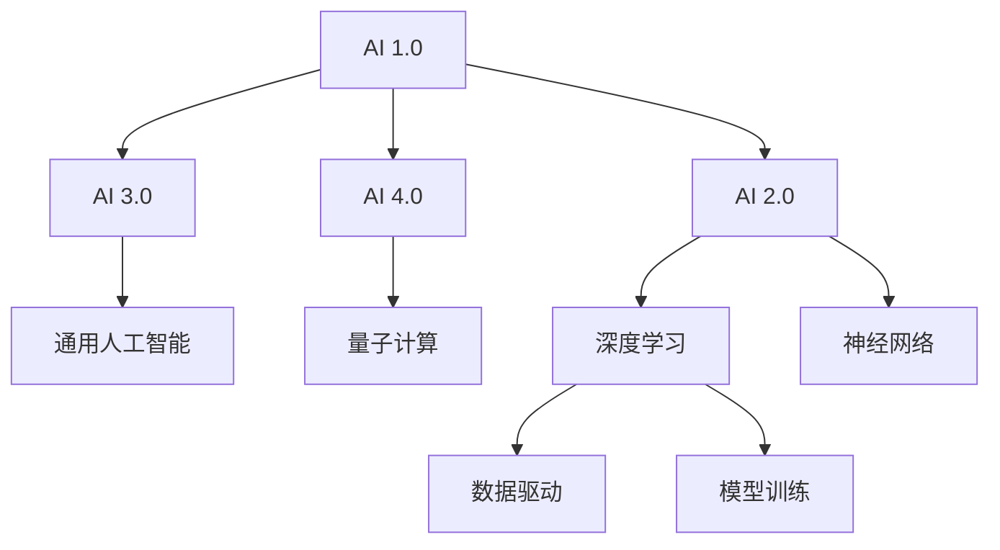

                 

# 李开复：AI 2.0 时代的市场前景

## 1. 背景介绍

人工智能（AI）作为21世纪最具革命性的技术之一，正在逐步改变我们的生活和工作方式。回顾过去十年，人工智能从AI 1.0迈向AI 2.0，科技行业迎来了前所未有的发展机遇。AI 2.0时代，技术突破不断，应用场景日益丰富，市场前景广阔。本文将从市场前景、核心技术、应用场景等方面深入分析AI 2.0时代的发展趋势。

## 2. 核心概念与联系

### 2.1 核心概念概述

为了更好地理解AI 2.0时代的市场前景，首先需要明确几个核心概念：

- **AI 1.0**：早期的人工智能主要集中在专家系统和决策支持系统等少数应用领域，依赖于人工设计的特征提取和规则。

- **AI 2.0**：基于深度学习，尤其是神经网络模型的兴起，AI 2.0能够处理大规模、复杂的数据，从数据中自动学习特征和规则，具备更强的泛化能力和应用潜力。

- **AI 3.0**：未来的人工智能将更强调人类智能和机器智能的结合，实现真正的通用人工智能，具备自我意识、情感、创新等高级能力。

- **AI 4.0**：基于量子计算等前沿技术，AI 4.0将进一步突破性能瓶颈，实现更高层次的智能。

这些概念之间的关系可以通过以下Mermaid流程图来展示：



该流程图展示了AI发展不同阶段之间的联系和演变路径。

## 3. 核心算法原理 & 具体操作步骤

### 3.1 算法原理概述

AI 2.0的核心在于深度学习和大数据处理。通过深度神经网络模型，AI可以从海量的数据中自动学习特征和规则，实现对复杂任务的建模和预测。

AI 2.0的关键技术包括：

- **深度学习**：通过多层神经网络，自动学习数据特征，提升模型泛化能力。
- **大数据处理**：处理大规模数据集，从数据中提取有效信息。
- **强化学习**：通过与环境的交互，模型不断优化决策策略，实现智能控制。
- **迁移学习**：利用已有的知识，加速新任务的学习过程。
- **预训练模型**：在大型数据集上进行预训练，提取通用知识，再通过微调适配特定任务。

### 3.2 算法步骤详解

AI 2.0的实现步骤主要包括数据预处理、模型构建、训练、评估和部署等环节。以下详细介绍各步骤：

**Step 1: 数据预处理**

- 收集和清洗数据集，去除噪音和异常值。
- 将数据转换为模型可处理的形式，如图像、文本、时间序列等。
- 进行数据增强，扩充训练集。

**Step 2: 模型构建**

- 选择合适的神经网络模型，如卷积神经网络（CNN）、循环神经网络（RNN）、Transformer等。
- 设计模型架构，包括层数、节点数、激活函数等。
- 设置超参数，如学习率、批大小、优化器等。

**Step 3: 模型训练**

- 使用优化算法（如SGD、Adam等）更新模型参数。
- 对模型进行多次迭代，直至收敛。

**Step 4: 模型评估**

- 在验证集上评估模型性能，选择最优模型。
- 使用不同的评估指标，如准确率、召回率、F1-score等。

**Step 5: 模型部署**

- 将模型保存为可部署格式，如TensorFlow SavedModel、PyTorch模型文件等。
- 部署模型到服务器或云平台，提供API接口供外部调用。

### 3.3 算法优缺点

AI 2.0的优点：

- 强大的泛化能力：深度学习模型能够自动学习数据特征，适用于复杂多样化的任务。
- 高效的数据处理：利用大数据技术，AI可以从海量数据中提取有用信息。
- 快速迭代优化：通过不断训练和调整，模型性能不断提升。

AI 2.0的缺点：

- 数据依赖性强：模型训练依赖高质量数据集，数据获取成本高。
- 计算资源消耗大：大规模深度学习模型需要高性能硬件支持，成本较高。
- 黑盒性质：模型决策过程复杂，难以解释和调试。

### 3.4 算法应用领域

AI 2.0在多个领域得到了广泛应用，涵盖医疗、金融、教育、娱乐等。以下是几个典型应用场景：

- **医疗**：AI 2.0在疾病诊断、影像分析、药物研发等方面展现了巨大潜力。通过深度学习模型，医生可以快速准确地诊断疾病，药物研究人员可以高效筛选出潜在药物。
- **金融**：AI 2.0用于风险评估、投资策略、欺诈检测等，提升了金融行业的运营效率和风险控制能力。
- **教育**：AI 2.0在个性化学习、智能辅导、语言学习等方面应用广泛，提升了教育质量和学习效果。
- **娱乐**：AI 2.0在内容推荐、智能客服、虚拟主播等方面得到应用，丰富了用户体验。

## 4. 数学模型和公式 & 详细讲解 & 举例说明

### 4.1 数学模型构建

以图像分类任务为例，构建一个基于卷积神经网络（CNN）的分类模型。

- **输入**：图像数据 $X$。
- **输出**：类别概率分布 $y$。
- **模型**：卷积神经网络，包含卷积层、池化层、全连接层等。

数学模型表示如下：

$$
y = M(X; \theta)
$$

其中，$M$ 表示CNN模型，$\theta$ 为模型参数。

### 4.2 公式推导过程

以二分类问题为例，计算损失函数及梯度更新公式。

假设模型输出为 $z=\sigma(W_1X+b_1)$，其中 $W_1$ 和 $b_1$ 为第一层全连接层的参数。则损失函数为二元交叉熵：

$$
\mathcal{L}(y, \hat{y}) = -\sum_{i=1}^N(y_i\log \hat{y}_i + (1-y_i)\log (1-\hat{y}_i))
$$

其中 $y$ 为真实标签，$\hat{y}$ 为模型预测概率。

梯度更新公式为：

$$
\frac{\partial \mathcal{L}}{\partial W_1} = -\frac{1}{N}\sum_{i=1}^N(y_i-\hat{y}_i)\nabla_{\theta}y
$$

其中 $\nabla_{\theta}y$ 为模型输出对输入的导数，可以通过链式法则求导得到。

### 4.3 案例分析与讲解

以图像分类任务为例，分析模型参数的更新过程。

假设模型输入为图像 $X$，经过卷积层、池化层和全连接层后，输出为类别概率分布 $z$。则损失函数为：

$$
\mathcal{L}(y, z) = -\sum_{i=1}^N(y_i\log z_i + (1-y_i)\log (1-z_i))
$$

其中 $y_i$ 为真实标签，$z_i$ 为模型预测概率。

通过链式法则求导，得到梯度更新公式：

$$
\frac{\partial \mathcal{L}}{\partial W} = -\frac{1}{N}\sum_{i=1}^N(y_i-\hat{y}_i)\nabla_{\theta}z
$$

其中 $W$ 为模型参数，$z$ 为模型输出，$\hat{y}$ 为预测概率。

假设模型的第一层全连接层参数为 $W_1$，则梯度更新公式为：

$$
\frac{\partial \mathcal{L}}{\partial W_1} = -\frac{1}{N}\sum_{i=1}^N(y_i-\hat{y}_i)\nabla_{\theta}z
$$

通过反向传播算法，不断更新参数 $W_1$，直至损失函数最小化。

## 5. 项目实践：代码实例和详细解释说明

### 5.1 开发环境搭建

以下是使用Python和TensorFlow搭建图像分类模型的环境配置：

1. 安装Anaconda：从官网下载并安装Anaconda，用于创建独立的Python环境。

2. 创建并激活虚拟环境：

```bash
conda create -n tf-env python=3.8
conda activate tf-env
```

3. 安装TensorFlow和其他依赖包：

```bash
conda install tensorflow==2.5
pip install numpy matplotlib scikit-learn
```

4. 准备数据集：使用TensorFlow的Keras API加载MNIST数据集。

```python
import tensorflow as tf
import numpy as np
from tensorflow.keras.datasets import mnist

(X_train, y_train), (X_test, y_test) = mnist.load_data()

X_train = X_train.reshape(X_train.shape[0], 28, 28, 1).astype('float32') / 255
X_test = X_test.reshape(X_test.shape[0], 28, 28, 1).astype('float32') / 255
y_train = tf.keras.utils.to_categorical(y_train, 10)
y_test = tf.keras.utils.to_categorical(y_test, 10)
```

### 5.2 源代码详细实现

以下是使用卷积神经网络（CNN）实现图像分类的完整代码：

```python
import tensorflow as tf

class CNNClassifier(tf.keras.Model):
    def __init__(self):
        super(CNNClassifier, self).__init__()
        self.conv1 = tf.keras.layers.Conv2D(32, (3, 3), activation='relu')
        self.maxpool1 = tf.keras.layers.MaxPooling2D((2, 2))
        self.conv2 = tf.keras.layers.Conv2D(64, (3, 3), activation='relu')
        self.maxpool2 = tf.keras.layers.MaxPooling2D((2, 2))
        self.flatten = tf.keras.layers.Flatten()
        self.fc1 = tf.keras.layers.Dense(512, activation='relu')
        self.fc2 = tf.keras.layers.Dense(10, activation='softmax')

    def call(self, x):
        x = self.conv1(x)
        x = self.maxpool1(x)
        x = self.conv2(x)
        x = self.maxpool2(x)
        x = self.flatten(x)
        x = self.fc1(x)
        return self.fc2(x)

model = CNNClassifier()

model.compile(optimizer='adam',
              loss='categorical_crossentropy',
              metrics=['accuracy'])

model.fit(X_train, y_train, epochs=10, batch_size=64, validation_data=(X_test, y_test))
```

### 5.3 代码解读与分析

**CNNClassifier类**：

- `__init__`方法：定义卷积层、池化层、全连接层等组件。
- `call`方法：定义前向传播过程，计算模型输出。

**模型训练**：

- `compile`方法：配置优化器、损失函数和评估指标。
- `fit`方法：加载数据集，进行模型训练，并返回训练过程的指标。

**模型评估**：

- 使用测试集评估模型性能，输出训练过程中的各项指标。

## 6. 实际应用场景

### 6.1 医疗影像诊断

AI 2.0在医疗影像诊断中具有广泛应用。深度学习模型可以自动识别和分类医学影像，辅助医生进行诊断和治疗。

以乳腺癌影像诊断为例，AI 2.0模型可以对X光片、CT扫描等影像进行自动标注，快速识别出病变区域和恶性程度。通过不断优化模型，AI 2.0可以实现比人类医生更高的准确率和诊断效率。

### 6.2 金融风险控制

AI 2.0在金融风险控制方面也有重要应用。通过深度学习模型，金融机构可以实时监控市场动态，预测市场趋势，防范金融风险。

例如，在信贷评估中，AI 2.0模型可以对客户信息、历史交易等数据进行分析，准确预测客户信用风险。同时，AI 2.0还可以对交易数据进行实时监控，及时发现异常交易行为，保障金融安全。

### 6.3 智能客服系统

AI 2.0在智能客服系统中应用广泛。通过深度学习模型，AI 2.0可以实现智能问答、语音识别、情感分析等功能，提升客户体验和运营效率。

例如，智能客服机器人可以通过对话历史和用户反馈，不断优化问答策略，提供更准确的回答。同时，AI 2.0还可以进行语音识别和情感分析，根据用户情绪调整回答策略，提高客户满意度。

## 7. 工具和资源推荐

### 7.1 学习资源推荐

为了帮助开发者系统掌握AI 2.0技术的理论和实践，这里推荐一些优质的学习资源：

1. **TensorFlow官方文档**：TensorFlow的官方文档详细介绍了深度学习模型的构建和训练，提供了丰富的代码示例和教程。

2. **深度学习专项课程**：Coursera和Udacity等在线教育平台提供深度学习专项课程，涵盖基础理论、模型架构、优化算法等。

3. **AI 2.0书籍**：《深度学习》（Goodfellow et al.）、《神经网络与深度学习》（Aurélien Géron）等书籍系统介绍了深度学习技术，适合深入学习。

4. **开源项目**：GitHub上的TensorFlow、PyTorch等开源项目提供了大量实用的代码和工具，帮助开发者快速上手实践。

5. **在线课程**：斯坦福大学和密歇根大学的AI课程，涵盖深度学习、强化学习、自然语言处理等多个方向。

### 7.2 开发工具推荐

为了提高AI 2.0模型的开发效率，这里推荐几款常用工具：

1. **TensorFlow**：谷歌开源的深度学习框架，支持GPU加速，性能优越。

2. **PyTorch**：Facebook开源的深度学习框架，易于使用，支持动态计算图。

3. **Keras**：高层次的深度学习API，提供简单易用的接口，适合快速原型开发。

4. **Jupyter Notebook**：用于数据探索和模型调试的交互式环境，支持Python代码和数学公式的混合编辑。

5. **GitHub**：代码托管平台，提供版本控制和协作开发功能，方便开发者共享和复用代码。

### 7.3 相关论文推荐

为了深入理解AI 2.0技术的最新进展，这里推荐几篇关键论文：

1. **ImageNet Classification with Deep Convolutional Neural Networks**：AlexNet论文，提出了卷积神经网络（CNN），并应用于图像分类任务，开启了深度学习时代。

2. **Deep Residual Learning for Image Recognition**：ResNet论文，提出了残差网络，解决了深度网络训练中的梯度消失问题，提升了模型的深度和性能。

3. **Attention is All You Need**：Transformer论文，提出了自注意力机制，大幅提升了模型的泛化能力和计算效率。

4. **GANs Trained by a Two Time-Scale Update Rule Converge to the Naive Mode**：WGAN论文，提出了生成对抗网络（GAN），并应用于图像生成和增强任务。

5. **Natural Language Processing (almost) from Scratch**：Transformer的跨语言迁移学习范式，展示了深度学习模型在多语言数据上的优秀性能。

## 8. 总结：未来发展趋势与挑战

### 8.1 研究成果总结

AI 2.0技术在过去几年中取得了显著进展，已在医疗、金融、智能客服等多个领域得到广泛应用。深度学习模型通过自动学习数据特征，实现了对复杂任务的建模和预测，提升了行业运营效率和决策质量。

### 8.2 未来发展趋势

AI 2.0的未来发展趋势如下：

1. **模型规模扩大**：随着算力成本的下降和数据规模的扩张，AI 2.0模型的参数量将不断增加，实现更强大的泛化能力和更复杂的建模任务。

2. **多模态融合**：AI 2.0将逐步扩展到多模态数据融合，实现视觉、语音、文本等多模态信息的协同建模，提升对现实世界的理解和建模能力。

3. **跨领域迁移**：AI 2.0将不断增强跨领域迁移能力，利用已有知识加速新任务的学习过程，提升模型的通用性和应用范围。

4. **可解释性增强**：AI 2.0将进一步增强模型的可解释性，通过生成可解释的模型输出和决策逻辑，提高模型的可信度和可接受性。

5. **伦理道德考量**：AI 2.0将加强伦理道德的考量，避免偏见和歧视，确保模型输出符合人类价值观和伦理规范。

### 8.3 面临的挑战

尽管AI 2.0技术取得了显著进展，但仍然面临一些挑战：

1. **数据获取难度**：高质量标注数据获取成本高，限制了AI 2.0模型的训练和应用。

2. **计算资源消耗大**：深度学习模型需要高性能硬件支持，计算资源消耗大，限制了模型的应用范围和实时性。

3. **模型复杂性**：深度学习模型结构复杂，难以解释和调试，影响了模型的可靠性和可维护性。

4. **伦理道德问题**：AI 2.0模型可能学习到偏见和有害信息，需要进一步加强伦理道德的规范和监管。

5. **技术壁垒**：AI 2.0技术门槛高，需要具备扎实的数学和算法基础，限制了其普及和应用。

### 8.4 研究展望

未来，AI 2.0技术需要在以下几个方面进行进一步研究：

1. **无监督学习**：探索无监督学习范式，摆脱对标注数据的依赖，充分利用非结构化数据。

2. **模型压缩和优化**：开发模型压缩和优化技术，提高模型的效率和可部署性，降低计算成本。

3. **跨模态融合**：研究多模态数据融合技术，提升模型的综合分析和建模能力。

4. **可解释性提升**：开发可解释性模型和工具，提高模型的可信度和可接受性。

5. **伦理道德规范**：建立伦理道德规范和监管机制，避免模型输出中的偏见和歧视。

这些研究方向的探索，将推动AI 2.0技术的进一步发展和应用，为实现人工智能的可持续发展奠定坚实基础。

## 9. 附录：常见问题与解答

**Q1: 什么是AI 2.0?**

A: AI 2.0是指基于深度学习和大数据处理的人工智能技术，通过自动学习数据特征，实现对复杂任务的建模和预测。与AI 1.0相比，AI 2.0具有更强的泛化能力和应用潜力。

**Q2: AI 2.0的优点是什么?**

A: AI 2.0的优点包括：强大的泛化能力、高效的数据处理、快速迭代优化等。AI 2.0模型可以从大规模数据中自动学习特征和规则，适用于复杂多样的任务。

**Q3: AI 2.0的缺点是什么?**

A: AI 2.0的缺点包括：数据依赖性强、计算资源消耗大、模型复杂性高等。AI 2.0模型需要大量高质量数据进行训练，且需要高性能硬件支持。

**Q4: AI 2.0在哪些领域得到应用?**

A: AI 2.0在医疗、金融、智能客服、娱乐等多个领域得到广泛应用。AI 2.0模型可以辅助医生进行诊断和治疗，防范金融风险，提升客户体验和运营效率。

**Q5: AI 2.0的未来发展趋势是什么?**

A: AI 2.0的未来发展趋势包括：模型规模扩大、多模态融合、跨领域迁移、可解释性增强、伦理道德考量等。AI 2.0技术将继续向更复杂、更广泛的应用场景拓展。

---

作者：禅与计算机程序设计艺术 / Zen and the Art of Computer Programming

