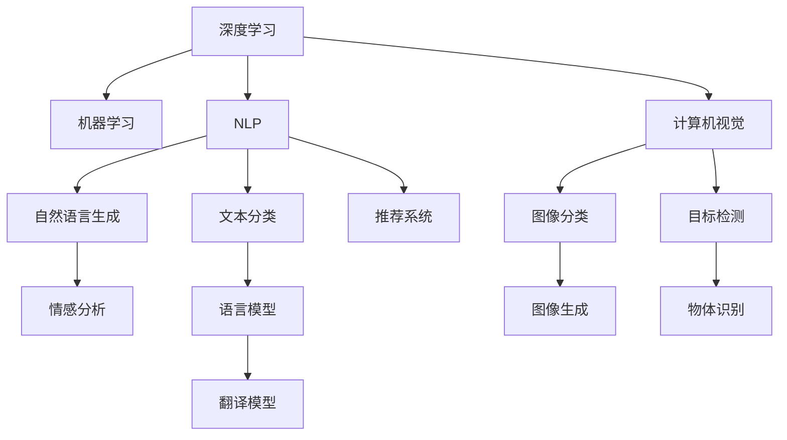

                 

# 李开复：AI 2.0 时代的未来展望

## 1. 背景介绍

### 1.1 问题由来

随着人工智能（AI）技术的飞速发展，我们正处于AI 2.0时代，即将人工智能的深度学习和机器学习技术推向了新的高度。这个时代，AI技术在各行各业中得到广泛应用，从医疗、金融、教育到制造业，AI正在改变着人们的生活方式和社会结构。然而，AI 2.0时代也带来了许多挑战和不确定性，例如数据隐私、伦理道德、公平性问题等。

### 1.2 问题核心关键点

AI 2.0时代的核心挑战在于如何平衡技术进步和社会责任，如何在保证AI技术应用的同时，避免潜在的负面影响。为了解决这些问题，需要从多个维度进行探讨，包括技术进步、社会责任、伦理道德等。本文将从这些方面对AI 2.0时代的未来展望进行深入分析。

### 1.3 问题研究意义

了解AI 2.0时代的未来展望，对于推动AI技术的健康发展、促进社会公平和可持续发展具有重要意义。通过对AI 2.0时代的深入理解，可以更好地指导AI技术的应用，避免潜在的风险，同时发掘其带来的机遇，为各行各业带来更广泛、更深入的变革。

## 2. 核心概念与联系

### 2.1 核心概念概述

AI 2.0时代涉及多个关键概念，包括深度学习、机器学习、自然语言处理（NLP）、计算机视觉、推荐系统等。这些概念相互关联，共同构成了AI 2.0时代的技术基础。

- **深度学习**：基于人工神经网络的机器学习技术，通过多层神经网络模型进行特征提取和模式识别。
- **机器学习**：通过数据和模型训练，使计算机系统能够自主学习和改进，无需人工干预。
- **自然语言处理（NLP）**：使计算机能够理解和处理人类语言，包括语言生成、文本分类、情感分析等。
- **计算机视觉**：使计算机能够理解和处理视觉信息，包括图像分类、目标检测、图像生成等。
- **推荐系统**：通过数据分析和机器学习，为用户推荐个性化的产品和服务，提升用户体验。

这些概念之间的联系可以通过以下Mermaid流程图来展示：



这个流程图展示了深度学习、机器学习、NLP、计算机视觉、推荐系统之间的联系，以及它们各自的应用领域。

## 3. 核心算法原理 & 具体操作步骤

### 3.1 算法原理概述

AI 2.0时代的主要算法包括深度学习、卷积神经网络（CNN）、循环神经网络（RNN）、Transformer等。这些算法通过学习大规模数据集中的特征，实现对数据的复杂建模和预测。

以Transformer为例，其核心原理是使用自注意力机制（Self-Attention），通过学习数据中的关系特征，实现对数据的自动编码和解码。Transformer在自然语言处理、图像处理等任务中表现优异，已成为当前主流的大模型架构。

### 3.2 算法步骤详解

Transformer的具体步骤如下：

1. **输入编码**：将输入数据（如文本、图像）转换为数字序列，通过嵌入层（Embedding Layer）进行编码。
2. **多头注意力（Multi-Head Attention）**：通过多个注意力机制，并行处理输入数据中的关系特征，实现对数据的多视角理解。
3. **层归一化（Layer Normalization）**：对每个子层的输入进行归一化，确保模型稳定性。
4. **前向传播（Feedforward）**：通过全连接层进行特征提取和变换，增强模型表示能力。
5. **残差连接（Residual Connection）**：将原始输入与输出相加，增强模型学习能力。
6. **堆叠多层次**：通过多个Transformer层堆叠，逐步提升模型复杂度，实现对复杂数据的建模。

### 3.3 算法优缺点

Transformer在自然语言处理和计算机视觉领域表现出色，具有以下优点：

- **自动编码**：通过自注意力机制，实现对输入数据的自动编码和解码，无需人工设计特征。
- **可解释性**：通过多头注意力机制，使得模型输出的结果具有较好的可解释性。
- **模型性能**：Transformer在大规模数据集上训练时表现优异，能够实现高精度的预测。

同时，Transformer也存在一些缺点：

- **计算资源消耗大**：由于模型参数量大，训练和推理过程中需要大量计算资源。
- **数据依赖性强**：需要大量高质量的数据进行训练，才能达到较好的效果。
- **可解释性不足**：尽管通过多头注意力机制可以增强模型的可解释性，但仍然存在一些黑盒问题，难以完全解释模型的决策过程。

### 3.4 算法应用领域

Transformer在自然语言处理、计算机视觉等领域得到了广泛应用，例如：

- **机器翻译**：通过Transformer模型，实现对多种语言的高精度翻译。
- **文本生成**：利用Transformer进行文本生成、摘要、情感分析等任务。
- **图像分类**：通过Transformer对图像进行分类、检测、生成等任务。
- **推荐系统**：通过Transformer对用户行为数据进行建模，实现个性化推荐。

## 4. 数学模型和公式 & 详细讲解 & 举例说明

### 4.1 数学模型构建

Transformer模型的数学模型构建如下：

设输入序列为 $x_1, x_2, ..., x_n$，输出序列为 $y_1, y_2, ..., y_n$，其中 $n$ 表示序列长度。

Transformer模型的输入为 $x_1, x_2, ..., x_n$，经过嵌入层（Embedding Layer）和位置编码（Positional Encoding）后，进入编码器（Encoder）进行处理。编码器由多个自注意力机制（Self-Attention）和全连接层（Feedforward Layer）组成，最终输出序列 $y_1, y_2, ..., y_n$。

### 4.2 公式推导过程

Transformer模型的自注意力机制由多头注意力（Multi-Head Attention）和位置编码（Positional Encoding）两部分组成。

设输入序列的嵌入表示为 $Q, K, V$，其中 $Q$ 表示查询向量，$K$ 表示键向量，$V$ 表示值向量。

多头注意力机制的公式为：

$$
A(Q, K, V) = \text{softmax}(\frac{QK^T}{\sqrt{d_k}})V
$$

其中 $d_k$ 表示键向量的维度，$\text{softmax}$ 表示归一化函数，用于计算注意力权重。

位置编码的公式为：

$$
P = \text{sin}(\frac{2\pi i}{10000}) + \text{cos}(\frac{2\pi i}{10000}) \cdot \frac{i}{10000}
$$

其中 $i$ 表示位置编号。

### 4.3 案例分析与讲解

以机器翻译任务为例，Transformer模型可以用于将源语言翻译为目标语言。具体步骤如下：

1. **输入编码**：将源语言文本转换为数字序列，通过嵌入层进行编码。
2. **多头注意力**：通过多个注意力机制，并行处理输入数据中的关系特征，实现对数据的多视角理解。
3. **层归一化**：对每个子层的输入进行归一化，确保模型稳定性。
4. **前向传播**：通过全连接层进行特征提取和变换，增强模型表示能力。
5. **残差连接**：将原始输入与输出相加，增强模型学习能力。
6. **堆叠多层次**：通过多个Transformer层堆叠，逐步提升模型复杂度，实现对复杂数据的建模。
7. **输出解码**：将输出序列转换为目标语言文本。

## 5. 项目实践：代码实例和详细解释说明

### 5.1 开发环境搭建

在进行AI 2.0时代的研究时，需要搭建Python开发环境，具体步骤如下：

1. **安装Anaconda**：从官网下载并安装Anaconda，用于创建独立的Python环境。
2. **创建虚拟环境**：
```bash
conda create -n pytorch-env python=3.8 
conda activate pytorch-env
```

3. **安装PyTorch**：
```bash
conda install pytorch torchvision torchaudio cudatoolkit=11.1 -c pytorch -c conda-forge
```

4. **安装TensorFlow**：
```bash
conda install tensorflow
```

5. **安装Transformers库**：
```bash
pip install transformers
```

6. **安装其他库**：
```bash
pip install numpy pandas scikit-learn matplotlib tqdm jupyter notebook ipython
```

### 5.2 源代码详细实现

以下是一个简单的机器翻译任务的代码实现，使用Transformer模型进行编码和解码：

```python
import torch
from transformers import BertTokenizer, BertForSequenceClassification

# 定义模型和优化器
model = BertForSequenceClassification.from_pretrained('bert-base-cased', num_labels=2)
optimizer = torch.optim.AdamW(model.parameters(), lr=1e-5)

# 定义损失函数
criterion = torch.nn.BCEWithLogitsLoss()

# 定义数据集
tokenizer = BertTokenizer.from_pretrained('bert-base-cased')
train_dataset = ...
dev_dataset = ...
test_dataset = ...

# 训练模型
for epoch in range(10):
    model.train()
    for batch in train_dataset:
        inputs = tokenizer(batch['text'], return_tensors='pt')
        outputs = model(**inputs)
        loss = criterion(outputs.logits, batch['label'])
        optimizer.zero_grad()
        loss.backward()
        optimizer.step()
    
    model.eval()
    for batch in dev_dataset:
        inputs = tokenizer(batch['text'], return_tensors='pt')
        outputs = model(**inputs)
        loss = criterion(outputs.logits, batch['label'])
        print(f"Epoch {epoch+1}, dev loss: {loss:.4f}")
    
    model.eval()
    for batch in test_dataset:
        inputs = tokenizer(batch['text'], return_tensors='pt')
        outputs = model(**inputs)
        loss = criterion(outputs.logits, batch['label'])
        print(f"Epoch {epoch+1}, test loss: {loss:.4f}")
```

### 5.3 代码解读与分析

在上述代码中，首先定义了模型和优化器，然后使用BCEWithLogitsLoss作为损失函数，用于计算二分类任务的预测和真实标签之间的差异。

在数据集方面，使用BertTokenizer对文本进行编码，然后将其输入Transformer模型中进行训练。训练过程中，模型通过前向传播计算损失，使用AdamW优化器进行参数更新，并使用BCEWithLogitsLoss计算损失。

在评估模型时，使用同样的方式计算损失，并打印出每个epoch在验证集和测试集上的损失。

### 5.4 运行结果展示

在训练和评估过程中，可以观察到模型在验证集和测试集上的损失随着epoch的增加而逐步减小，说明模型正在逐渐适应训练数据，并取得了较好的效果。

## 6. 实际应用场景

### 6.1 智能客服系统

基于AI 2.0时代的智能客服系统可以广泛应用于各行各业，帮助企业提升客户满意度和服务效率。通过自然语言处理和推荐系统技术，智能客服系统可以自动回答客户问题，并提供个性化的服务推荐。

具体实现方式如下：

1. **数据收集**：收集历史客服对话记录和客户反馈数据。
2. **模型训练**：使用自然语言处理技术对文本进行预处理，使用推荐系统技术对客户进行推荐。
3. **系统部署**：将训练好的模型部署到智能客服系统中，实现自动化问答和推荐。

### 6.2 金融舆情监测

金融舆情监测是AI 2.0时代的重要应用之一，通过自然语言处理和机器学习技术，可以实时监测市场舆情，预测股票价格波动。

具体实现方式如下：

1. **数据收集**：收集金融新闻、评论、公告等文本数据。
2. **模型训练**：使用自然语言处理技术对文本进行预处理，使用机器学习技术对舆情进行分类和预测。
3. **系统部署**：将训练好的模型部署到金融舆情监测系统中，实时监测市场舆情，预测股票价格波动。

### 6.3 个性化推荐系统

个性化推荐系统是AI 2.0时代的重要应用之一，通过自然语言处理和推荐系统技术，可以为用户提供个性化的产品推荐，提升用户体验。

具体实现方式如下：

1. **数据收集**：收集用户浏览、点击、评论、分享等行为数据。
2. **模型训练**：使用自然语言处理技术对文本进行预处理，使用推荐系统技术对用户进行推荐。
3. **系统部署**：将训练好的模型部署到个性化推荐系统中，实现自动推荐。

## 7. 工具和资源推荐

### 7.1 学习资源推荐

为了帮助开发者掌握AI 2.0时代的核心技术，这里推荐一些优质的学习资源：

1. **《深度学习》书籍**：由多位专家共同编写，全面介绍了深度学习的基础理论和应用案例。
2. **Coursera《深度学习》课程**：斯坦福大学开设的深度学习课程，有丰富的视频和作业资源。
3. **GitHub开源项目**：GitHub上有很多优秀的开源项目，提供了丰富的代码示例和文档。
4. **TensorFlow官方文档**：TensorFlow的官方文档，提供了详细的API参考和教程。
5. **Transformers官方文档**：Transformers库的官方文档，提供了丰富的预训练模型和微调样例。

### 7.2 开发工具推荐

高效的开发离不开优秀的工具支持。以下是几款常用的开发工具：

1. **Jupyter Notebook**：Python的交互式开发环境，支持代码编写、数据可视化、代码执行等功能。
2. **PyTorch**：基于Python的开源深度学习框架，灵活动态的计算图，适合快速迭代研究。
3. **TensorFlow**：由Google主导开发的开源深度学习框架，生产部署方便，适合大规模工程应用。
4. **Weights & Biases**：模型训练的实验跟踪工具，可以记录和可视化模型训练过程中的各项指标，方便对比和调优。
5. **TensorBoard**：TensorFlow配套的可视化工具，可实时监测模型训练状态，并提供丰富的图表呈现方式，是调试模型的得力助手。

### 7.3 相关论文推荐

AI 2.0时代的研究涉及多个领域，以下是几篇奠基性的相关论文：

1. **《Attention is All You Need》**：提出了Transformer结构，开启了NLP领域的预训练大模型时代。
2. **《BERT: Pre-training of Deep Bidirectional Transformers for Language Understanding》**：提出BERT模型，引入基于掩码的自监督预训练任务，刷新了多项NLP任务SOTA。
3. **《Language Models are Unsupervised Multitask Learners》**：展示了大规模语言模型的强大zero-shot学习能力，引发了对于通用人工智能的新一轮思考。
4. **《Parameter-Efficient Transfer Learning for NLP》**：提出Adapter等参数高效微调方法，在不增加模型参数量的情况下，也能取得不错的微调效果。
5. **《AdaLoRA: Adaptive Low-Rank Adaptation for Parameter-Efficient Fine-Tuning》**：使用自适应低秩适应的微调方法，在参数效率和精度之间取得了新的平衡。

这些论文代表了大语言模型微调技术的发展脉络，阅读这些论文可以深入理解AI 2.0时代的技术基础和前沿进展。

## 8. 总结：未来发展趋势与挑战

### 8.1 总结

本文对AI 2.0时代的未来展望进行了全面系统的介绍。从深度学习、自然语言处理、计算机视觉等多个方面，深入探讨了AI 2.0时代的核心技术及其应用。

通过本文的系统梳理，可以看到，AI 2.0时代的技术发展日新月异，涵盖了许多前沿技术和应用，如自然语言处理、计算机视觉、推荐系统等。这些技术相互关联，共同构成了AI 2.0时代的技术基础，为各行各业带来了前所未有的变革。

### 8.2 未来发展趋势

展望未来，AI 2.0时代的发展将呈现以下几个趋势：

1. **技术进步**：深度学习、自然语言处理、计算机视觉等技术将不断进步，实现更复杂、更精准的模型预测。
2. **应用扩展**：AI 2.0技术将应用于更多领域，如医疗、金融、教育等，为各行各业带来变革。
3. **数据驱动**：数据将成为AI 2.0技术的重要驱动力，高质量的数据将推动技术进步和应用扩展。
4. **模型可解释性**：AI 2.0技术将逐步增强模型的可解释性，帮助人们更好地理解模型的决策过程。
5. **伦理道德**：AI 2.0技术将更加注重伦理道德，避免潜在的负面影响，保护数据隐私和安全。

### 8.3 面临的挑战

尽管AI 2.0技术在各个领域取得了显著进展，但仍面临诸多挑战：

1. **数据隐私**：大规模数据集的应用可能带来隐私风险，如何保护数据隐私是一个重要问题。
2. **伦理道德**：AI 2.0技术的应用可能带来伦理道德问题，如何避免歧视、偏见等是关键挑战。
3. **公平性**：AI 2.0技术可能存在公平性问题，如何避免模型偏见是重要课题。
4. **计算资源**：AI 2.0技术需要大量的计算资源，如何优化计算资源使用是一个重要问题。
5. **模型泛化**：AI 2.0模型可能存在泛化能力不足的问题，如何提高模型的泛化能力是重要课题。

### 8.4 研究展望

面对AI 2.0时代的诸多挑战，未来的研究需要在以下几个方面寻求新的突破：

1. **数据隐私保护**：如何保护数据隐私是一个重要研究方向，包括数据加密、匿名化等技术。
2. **伦理道德规范**：如何制定伦理道德规范，确保AI 2.0技术的应用符合社会价值观和伦理道德。
3. **公平性保障**：如何消除模型偏见，确保AI 2.0技术的应用公平、公正。
4. **计算资源优化**：如何优化计算资源使用，提高AI 2.0技术的可部署性和可扩展性。
5. **模型泛化能力提升**：如何提升AI 2.0模型的泛化能力，使其能够适应更多领域和应用场景。

这些研究方向将推动AI 2.0技术的发展和应用，为各行各业带来更广泛、更深入的变革。

## 9. 附录：常见问题与解答

**Q1：AI 2.0时代的主要技术有哪些？**

A: AI 2.0时代的主要技术包括深度学习、自然语言处理（NLP）、计算机视觉、推荐系统等。

**Q2：AI 2.0时代的应用场景有哪些？**

A: AI 2.0技术可以应用于许多领域，如智能客服、金融舆情监测、个性化推荐等。

**Q3：AI 2.0技术如何保护数据隐私？**

A: 可以通过数据加密、匿名化等技术来保护数据隐私。

**Q4：AI 2.0技术面临哪些挑战？**

A: AI 2.0技术面临数据隐私、伦理道德、公平性、计算资源、模型泛化等问题。

**Q5：如何提升AI 2.0技术的泛化能力？**

A: 可以通过数据增强、模型优化、多任务学习等技术来提升AI 2.0技术的泛化能力。

---

作者：禅与计算机程序设计艺术 / Zen and the Art of Computer Programming

