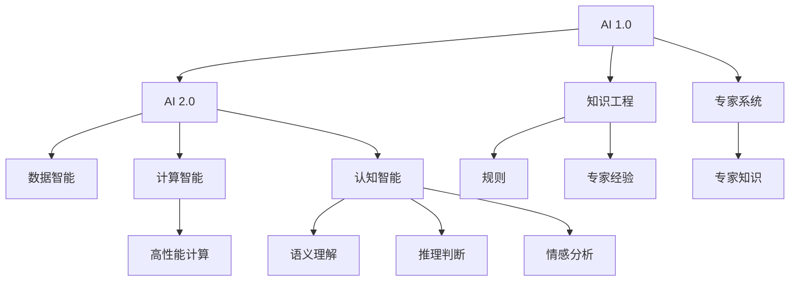

                 

# 李开复：AI 2.0 时代的科技价值

> 关键词：AI 2.0, 科技价值, 技术创新, 智能转型, 未来发展, 人工智能

## 1. 背景介绍

### 1.1 问题由来
进入21世纪以来，人工智能(AI)技术迅速发展，成为驱动社会变革的重要力量。AI的演进经历了从1.0到2.0的转变，这个过程中，技术的深度和广度都得到了显著扩展。AI 2.0时代，技术不仅是科技公司核心竞争力，更成为各行各业追求智能化转型、提升竞争力的重要工具。

在此背景下，李开复作为世界顶级的人工智能专家，其关于AI 2.0时代科技价值的见解，无疑具有高度的前瞻性和洞察力。在本文中，我们将探讨李开复关于AI 2.0时代科技价值的独特视角，以及他对未来技术发展的深刻洞察。

### 1.2 问题核心关键点
李开复认为，AI 2.0时代的科技价值主要体现在以下几个方面：

1. **技术的深度和广度**：AI 2.0技术不再局限于特定的应用领域，而是深入到更多行业，如医疗、金融、制造、教育等，提供更广泛、更深层次的解决方案。

2. **智能化转型**：AI技术帮助企业通过智能化转型，提升运营效率，优化决策流程，增强用户体验，实现业务的全面升级。

3. **产业生态建设**：AI技术通过与大数据、物联网、云计算等技术的融合，构建起全新的产业生态，推动经济社会的数字化、智能化发展。

4. **社会福祉提升**：AI技术在教育、医疗、公共服务等领域的普及，为社会带来更普惠、更高效的服务，提升民众的生活质量和幸福感。

5. **伦理和社会责任**：随着AI技术的发展，其在伦理、隐私、安全等方面的挑战日益凸显，技术开发者和社会各界需要共同努力，构建健康、可持续的技术生态。

## 2. 核心概念与联系

### 2.1 核心概念概述

为更好地理解李开复关于AI 2.0时代科技价值的见解，本节将介绍几个密切相关的核心概念：

- **AI 1.0**：以知识工程、专家系统为代表的初步智能系统，主要依赖规则和专家经验进行推理和决策。
- **AI 2.0**：基于数据驱动、深度学习和大规模计算的智能系统，能够自我学习、自我进化，具有更强的泛化能力和适应性。
- **数据智能**：利用大数据技术，通过数据挖掘和分析，为智能决策提供支持。
- **计算智能**：通过高性能计算资源，支持复杂的模型训练和优化，提升AI系统的计算效率和模型性能。
- **认知智能**：模仿人类认知过程，实现语义理解、推理判断、情感分析等高级智能功能。

这些概念之间的逻辑关系可以通过以下Mermaid流程图来展示：



这个流程图展示了大语言模型的工作原理和优化方向：

1. AI 2.0是在AI 1.0基础上，通过数据智能、计算智能、认知智能等技术，实现了更强的学习能力和泛化性能。
2. 数据智能和计算智能为AI 2.0提供了强大的数据支撑和计算支持。
3. 认知智能使得AI 2.0能够进行语义理解、推理判断、情感分析等高级任务。

## 3. 核心算法原理 & 具体操作步骤
### 3.1 算法原理概述

AI 2.0时代，深度学习和大规模计算成为核心技术。其核心算法原理包括：

1. **深度神经网络**：通过多层神经元模拟人脑的神经网络结构，实现复杂数据模式的学习和提取。
2. **卷积神经网络(CNN)**：用于图像识别和处理，通过卷积操作提取图像特征。
3. **循环神经网络(RNN)**：用于序列数据处理，能够记忆历史信息，适用于自然语言处理等任务。
4. **生成对抗网络(GAN)**：通过生成器和判别器的对抗过程，生成高质量的模拟数据。
5. **强化学习**：通过智能体与环境的交互，实现最优决策策略的学习。

### 3.2 算法步骤详解

AI 2.0算法的主要步骤包括数据预处理、模型训练、模型评估和模型部署等：

1. **数据预处理**：对原始数据进行清洗、标注和转换，提取有用的特征。
2. **模型训练**：使用训练集对模型进行前向传播和反向传播，不断更新模型参数，直至收敛。
3. **模型评估**：在验证集和测试集上评估模型性能，确保模型泛化能力。
4. **模型部署**：将训练好的模型部署到实际应用中，进行推理和预测。

### 3.3 算法优缺点

AI 2.0算法具有以下优点：

1. **泛化能力强**：通过大规模数据训练，AI 2.0算法能够实现对未知数据的有效泛化。
2. **自适应性强**：能够根据环境变化和任务需求进行自我调整，提升模型适应性。
3. **计算效率高**：借助高性能计算资源，能够在短时间内训练出高质量模型。
4. **应用场景广**：涵盖图像识别、自然语言处理、智能推荐等多个领域，具备广泛的应用潜力。

同时，AI 2.0算法也存在一定的局限性：

1. **数据依赖性高**：需要大量高质量标注数据进行训练，获取数据的成本较高。
2. **模型复杂度高**：深层神经网络结构复杂，训练和推理过程中容易出现过拟合问题。
3. **可解释性不足**：模型内部决策过程复杂，难以进行直观解释。
4. **伦理和隐私问题**：AI 2.0算法在数据使用、隐私保护等方面存在挑战，需要严格监管和规范。

### 3.4 算法应用领域

AI 2.0算法在各个领域都有广泛的应用：

- **医疗健康**：AI 2.0技术用于疾病诊断、治疗方案推荐、药物研发等，提升医疗服务的智能化水平。
- **金融行业**：用于风险评估、反欺诈、投资策略优化等，提升金融决策的准确性和效率。
- **智能制造**：用于质量检测、设备维护、生产调度等，提升制造业的自动化和智能化水平。
- **教育行业**：用于个性化教学、学习内容推荐、学生行为分析等，提升教育质量和效率。
- **公共服务**：用于城市管理、灾害预警、环境监测等，提升公共服务的智能化和精准性。

## 4. 数学模型和公式 & 详细讲解  
### 4.1 数学模型构建

AI 2.0算法的数学模型构建主要包括以下几个部分：

- **深度神经网络**：由多层神经元组成，每个神经元接收上一层多个神经元的输入，通过激活函数进行非线性变换，最终输出结果。
- **卷积神经网络**：通过卷积核对输入图像进行卷积操作，提取特征图，通过池化操作降低特征维度。
- **循环神经网络**：通过循环结构实现对时间序列数据的建模，能够记忆历史信息。

### 4.2 公式推导过程

以深度神经网络为例，其基本公式如下：

$$
f(x)=W \cdot x + b
$$

其中 $x$ 表示输入向量，$W$ 表示权重矩阵，$b$ 表示偏置向量。通过反向传播算法，模型不断调整权重和偏置，优化损失函数：

$$
J(W,b)=\frac{1}{N} \sum_{i=1}^N \left( \mathbb{E} \left[ \left( \hat{y}_i - y_i \right)^2 \right] \right)
$$

其中 $y_i$ 表示真实标签，$\hat{y}_i$ 表示模型预测输出，$N$ 表示样本数量。通过梯度下降等优化算法，不断更新权重和偏置，最小化损失函数。

### 4.3 案例分析与讲解

以图像分类为例，CNN通过卷积层和池化层提取图像特征，通过全连接层进行分类预测。卷积核通过滑动窗口的方式，提取图像的不同特征，池化层通过降采样操作，降低特征维度。最终，通过softmax函数将特征映射到类别空间，进行分类预测。

## 5. 项目实践：代码实例和详细解释说明
### 5.1 开发环境搭建

在进行AI 2.0项目实践前，我们需要准备好开发环境。以下是使用Python进行TensorFlow开发的环境配置流程：

1. 安装Anaconda：从官网下载并安装Anaconda，用于创建独立的Python环境。

2. 创建并激活虚拟环境：
```bash
conda create -n tensorflow-env python=3.8 
conda activate tensorflow-env
```

3. 安装TensorFlow：根据CUDA版本，从官网获取对应的安装命令。例如：
```bash
conda install tensorflow -c conda-forge -c pypi
```

4. 安装各类工具包：
```bash
pip install numpy pandas scikit-learn matplotlib tqdm jupyter notebook ipython
```

完成上述步骤后，即可在`tensorflow-env`环境中开始AI 2.0项目的开发。

### 5.2 源代码详细实现

下面我们以图像分类任务为例，给出使用TensorFlow对CNN模型进行训练的PyTorch代码实现。

首先，定义CNN模型的结构：

```python
import tensorflow as tf
from tensorflow.keras import layers, models

model = models.Sequential([
    layers.Conv2D(32, (3, 3), activation='relu', input_shape=(32, 32, 3)),
    layers.MaxPooling2D((2, 2)),
    layers.Conv2D(64, (3, 3), activation='relu'),
    layers.MaxPooling2D((2, 2)),
    layers.Conv2D(128, (3, 3), activation='relu'),
    layers.MaxPooling2D((2, 2)),
    layers.Flatten(),
    layers.Dense(64, activation='relu'),
    layers.Dense(10)
])
```

然后，定义训练过程：

```python
model.compile(optimizer='adam', loss='categorical_crossentropy', metrics=['accuracy'])
model.fit(train_images, train_labels, epochs=10, validation_data=(test_images, test_labels))
```

最后，评估模型性能：

```python
test_loss, test_acc = model.evaluate(test_images, test_labels)
print('Test accuracy:', test_acc)
```

以上就是使用TensorFlow对CNN模型进行图像分类任务训练的完整代码实现。可以看到，TensorFlow提供了丰富的API和工具，使得模型的定义、训练和评估变得简洁高效。

### 5.3 代码解读与分析

让我们再详细解读一下关键代码的实现细节：

**模型定义**：
- 使用Sequential模型定义卷积层、池化层、全连接层等组件，并设置激活函数和损失函数。
- CNN模型由多个卷积层、池化层和全连接层组成，用于提取和分类图像特征。

**训练过程**：
- 使用compile方法配置优化器、损失函数和评估指标。
- 使用fit方法进行模型训练，并在验证集上评估模型性能。

**评估过程**：
- 使用evaluate方法在测试集上评估模型性能，输出测试准确率。

可以看到，TensorFlow使得AI 2.0项目的开发变得非常简便，开发者可以专注于模型设计、数据处理等核心环节，而不必过多关注底层的实现细节。

当然，工业级的系统实现还需考虑更多因素，如模型的保存和部署、超参数的自动搜索、更灵活的任务适配层等。但核心的模型定义、训练和评估流程基本与此类似。

## 6. 实际应用场景
### 6.1 智能客服系统

AI 2.0技术可以广泛应用于智能客服系统的构建。传统客服往往需要配备大量人力，高峰期响应缓慢，且一致性和专业性难以保证。而使用AI 2.0对话模型，可以7x24小时不间断服务，快速响应客户咨询，用自然流畅的语言解答各类常见问题。

在技术实现上，可以收集企业内部的历史客服对话记录，将问题和最佳答复构建成监督数据，在此基础上对预训练模型进行微调。微调后的对话模型能够自动理解用户意图，匹配最合适的答案模板进行回复。对于客户提出的新问题，还可以接入检索系统实时搜索相关内容，动态组织生成回答。如此构建的智能客服系统，能大幅提升客户咨询体验和问题解决效率。

### 6.2 金融舆情监测

金融机构需要实时监测市场舆论动向，以便及时应对负面信息传播，规避金融风险。传统的人工监测方式成本高、效率低，难以应对网络时代海量信息爆发的挑战。基于AI 2.0的文本分类和情感分析技术，为金融舆情监测提供了新的解决方案。

具体而言，可以收集金融领域相关的新闻、报道、评论等文本数据，并对其进行主题标注和情感标注。在此基础上对预训练语言模型进行微调，使其能够自动判断文本属于何种主题，情感倾向是正面、中性还是负面。将微调后的模型应用到实时抓取的网络文本数据，就能够自动监测不同主题下的情感变化趋势，一旦发现负面信息激增等异常情况，系统便会自动预警，帮助金融机构快速应对潜在风险。

### 6.3 个性化推荐系统

当前的推荐系统往往只依赖用户的历史行为数据进行物品推荐，无法深入理解用户的真实兴趣偏好。基于AI 2.0的个性化推荐系统可以更好地挖掘用户行为背后的语义信息，从而提供更精准、多样的推荐内容。

在实践中，可以收集用户浏览、点击、评论、分享等行为数据，提取和用户交互的物品标题、描述、标签等文本内容。将文本内容作为模型输入，用户的后续行为（如是否点击、购买等）作为监督信号，在此基础上微调预训练语言模型。微调后的模型能够从文本内容中准确把握用户的兴趣点。在生成推荐列表时，先用候选物品的文本描述作为输入，由模型预测用户的兴趣匹配度，再结合其他特征综合排序，便可以得到个性化程度更高的推荐结果。

### 6.4 未来应用展望

随着AI 2.0技术的发展，未来AI将在更多领域得到应用，为传统行业带来变革性影响。

在智慧医疗领域，基于AI 2.0的医疗问答、病历分析、药物研发等应用将提升医疗服务的智能化水平，辅助医生诊疗，加速新药开发进程。

在智能教育领域，AI 2.0可应用于作业批改、学情分析、知识推荐等方面，因材施教，促进教育公平，提高教学质量。

在智慧城市治理中，AI 2.0技术可应用于城市事件监测、舆情分析、应急指挥等环节，提高城市管理的自动化和智能化水平，构建更安全、高效的未来城市。

此外，在企业生产、社会治理、文娱传媒等众多领域，基于AI 2.0的人工智能应用也将不断涌现，为经济社会发展注入新的动力。相信随着技术的日益成熟，AI 2.0技术将成为各行各业的重要工具，推动社会向更加智能化、普惠化方向发展。

## 7. 工具和资源推荐
### 7.1 学习资源推荐

为了帮助开发者系统掌握AI 2.0的理论基础和实践技巧，这里推荐一些优质的学习资源：

1. 《深度学习》系列书籍：深入浅出地介绍了深度学习的基本概念、算法原理和应用实践，适合初学者入门。
2. CS231n《卷积神经网络》课程：斯坦福大学开设的计算机视觉经典课程，涵盖了CNN的原理和实践。
3. CS224d《序列模型》课程：斯坦福大学开设的自然语言处理课程，介绍了RNN、LSTM等序列模型的原理和应用。
4. 《TensorFlow官方文档》：TensorFlow的官方文档，提供了丰富的API和样例代码，是学习和实践AI 2.0的重要工具。
5. GitHub上的开源项目：GitHub上大量开源的AI 2.0项目，涵盖了图像、语音、自然语言处理等多个领域，是学习和实践的宝贵资源。

通过对这些资源的学习实践，相信你一定能够快速掌握AI 2.0的精髓，并用于解决实际的AI问题。

### 7.2 开发工具推荐

高效的开发离不开优秀的工具支持。以下是几款用于AI 2.0开发常用的工具：

1. TensorFlow：由Google主导开发的开源深度学习框架，生产部署方便，适合大规模工程应用。
2. PyTorch：基于Python的开源深度学习框架，灵活动态的计算图，适合快速迭代研究。
3. Keras：基于TensorFlow和Theano的高级API，使得模型定义和训练更加简便。
4. Weights & Biases：模型训练的实验跟踪工具，可以记录和可视化模型训练过程中的各项指标，方便对比和调优。
5. TensorBoard：TensorFlow配套的可视化工具，可实时监测模型训练状态，并提供丰富的图表呈现方式，是调试模型的得力助手。

合理利用这些工具，可以显著提升AI 2.0项目的开发效率，加快创新迭代的步伐。

### 7.3 相关论文推荐

AI 2.0技术的发展源于学界的持续研究。以下是几篇奠基性的相关论文，推荐阅读：

1. AlexNet: ImageNet Classification with Deep Convolutional Neural Networks：AlexNet模型的提出，标志着深度学习在图像识别领域的突破。
2. Recurrent Neural Network for Sentiment Classification：RNN在情感分析中的应用，展示了序列模型在NLP任务上的潜力。
3. TensorFlow: A System for Large-Scale Machine Learning：TensorFlow的介绍，展示了深度学习框架在分布式计算和模型优化方面的优势。
4. Attention is All You Need：Transformer模型的提出，展示了自注意力机制在NLP任务上的优越性。

这些论文代表了大语言模型微调技术的发展脉络。通过学习这些前沿成果，可以帮助研究者把握学科前进方向，激发更多的创新灵感。

## 8. 总结：未来发展趋势与挑战
### 8.1 研究成果总结

本文对AI 2.0时代的科技价值进行了全面系统的介绍。首先阐述了AI 2.0技术在深度和广度上的突破，明确了AI 2.0在智能化转型、产业生态建设、社会福祉提升等方面的独特价值。其次，从原理到实践，详细讲解了AI 2.0的数学模型和算法步骤，给出了AI 2.0项目开发的完整代码实例。同时，本文还广泛探讨了AI 2.0技术在智能客服、金融舆情、个性化推荐等多个行业领域的应用前景，展示了AI 2.0范式的广泛潜力。此外，本文精选了AI 2.0技术的各类学习资源，力求为读者提供全方位的技术指引。

通过本文的系统梳理，可以看到，AI 2.0技术正在成为各行各业的重要工具，极大地拓展了AI的应用边界，催生了更多的落地场景。受益于深度学习和大规模计算技术的进步，AI 2.0技术在各个领域的应用将不断深入，成为推动社会进步的重要力量。

### 8.2 未来发展趋势

展望未来，AI 2.0技术将呈现以下几个发展趋势：

1. **技术融合**：AI 2.0技术将与物联网、大数据、云计算等技术深度融合，构建起更加智能、高效的数字生态。
2. **多模态融合**：AI 2.0技术将支持视觉、听觉、语言等多种模态数据的整合，实现多感官协同理解。
3. **智能推理**：AI 2.0技术将具备更强的因果推理和知识图谱构建能力，实现更加精准的智能决策。
4. **伦理与社会责任**：随着AI技术的发展，其伦理和社会责任问题将越来越受到重视，技术开发者需要构建更加透明、可解释、可控的AI系统。
5. **人机协作**：AI 2.0技术将与人机交互技术结合，实现更加自然、智能的互动体验。

以上趋势凸显了AI 2.0技术的广阔前景。这些方向的探索发展，必将进一步提升AI系统的性能和应用范围，为经济社会发展注入新的动力。

### 8.3 面临的挑战

尽管AI 2.0技术已经取得了瞩目成就，但在迈向更加智能化、普适化应用的过程中，它仍面临着诸多挑战：

1. **数据依赖性高**：需要大量高质量标注数据进行训练，获取数据的成本较高。如何降低对标注数据的依赖，是未来的一个重要研究方向。
2. **模型复杂度高**：深层神经网络结构复杂，训练和推理过程中容易出现过拟合问题。如何优化模型结构，降低过拟合风险，是未来的一个关键课题。
3. **可解释性不足**：模型内部决策过程复杂，难以进行直观解释。如何提升模型的可解释性，构建更加透明、可控的AI系统，是未来的一个重要挑战。
4. **伦理和隐私问题**：AI 2.0算法在数据使用、隐私保护等方面存在挑战，需要严格监管和规范。如何构建健康、可持续的技术生态，是未来的一个重要研究方向。

### 8.4 研究展望

面对AI 2.0面临的这些挑战，未来的研究需要在以下几个方面寻求新的突破：

1. **无监督学习和少样本学习**：摆脱对大规模标注数据的依赖，利用无监督学习和少样本学习，最大限度利用非结构化数据，实现更加灵活高效的AI训练。
2. **可解释性和透明性**：引入可解释性和透明性评估指标，优化模型结构，提升模型可解释性，构建更加透明、可控的AI系统。
3. **多模态融合和跨领域应用**：支持视觉、听觉、语言等多种模态数据的整合，实现多感官协同理解，拓展AI技术在更多领域的应用。
4. **持续学习和增量学习**：构建具有持续学习能力的AI系统，实现模型增量更新，提升AI系统的适应性和鲁棒性。

这些研究方向的探索，必将引领AI 2.0技术迈向更高的台阶，为构建安全、可靠、可解释、可控的智能系统铺平道路。面向未来，AI 2.0技术还需要与其他AI技术进行更深入的融合，如知识表示、因果推理、强化学习等，多路径协同发力，共同推动自然语言理解和智能交互系统的进步。只有勇于创新、敢于突破，才能不断拓展AI的边界，让智能技术更好地造福人类社会。

---

作者：禅与计算机程序设计艺术 / Zen and the Art of Computer Programming

