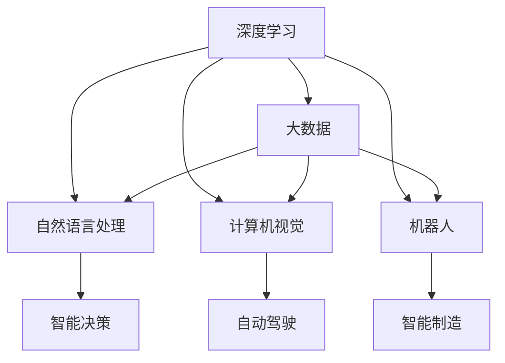

                 

# 李开复：AI 2.0 时代的趋势

> 关键词：人工智能, AI 2.0, 深度学习, 机器学习, 大数据, 自动化, 机器人, 自然语言处理, 计算机视觉, 人机协同

## 1. 背景介绍

### 1.1 问题由来

人工智能(Artificial Intelligence, AI)正在经历一场前所未有的变革。自1956年达特茅斯会议以来，AI领域取得了巨大进展，从最初的专家系统到深度学习、大数据，再到当前的AI 2.0时代，人工智能正在深刻改变人类的生产生活方式。

AI 2.0，又称为"下一代人工智能"，是指基于深度学习和大数据，通过自主学习和优化算法，构建具有自我感知、自我学习能力的智能系统。这一阶段，AI技术正从传统的规则驱动，向数据驱动和模型驱动转变，更加强调模型的通用性、泛化能力和自适应能力。

人工智能的应用范围也正在不断扩展，从传统的图像识别、语音识别、自然语言处理等单模态任务，向多模态融合、智能决策、人机协作等复杂场景演进。深度学习、机器学习、大数据等技术基础已经相当成熟，正在推动AI技术进入实际应用的"黄金时代"。

### 1.2 问题核心关键点

AI 2.0时代的核心在于以下几点：

- **深度学习**：基于神经网络模型构建的深度学习，已经成为AI 2.0时代的主要驱动力，能够学习并提取数据中的复杂模式，处理海量数据，实现高效计算。

- **大数据**：AI 2.0时代的数据量呈爆炸式增长，为深度学习提供了充足的训练样本和多样化的数据源。

- **云计算**：云计算为AI 2.0提供了强大的计算和存储能力，支持大规模模型训练和推理，使得AI技术的落地应用变得可行。

- **多模态融合**：当前AI 2.0时代正从单模态向多模态融合演进，将视觉、语音、自然语言处理等多模态数据整合，提升AI系统的感知和决策能力。

- **人机协同**：AI 2.0强调人机协同工作，通过增强现实、虚拟现实等技术，增强人机交互体验，提升工作效率和决策质量。

### 1.3 问题研究意义

AI 2.0时代的研究，对于推动AI技术的发展、实现深度学习和大数据的产业化应用，具有重要意义：

1. **技术创新**：AI 2.0时代的深度学习和大数据技术，推动了NLP、计算机视觉、机器人等领域的创新，提升了AI系统的性能和应用范围。

2. **产业升级**：AI 2.0技术能够实现企业自动化流程优化、智能客服、供应链管理等，为各行各业带来效率提升和成本降低。

3. **社会变革**：AI 2.0通过智能决策支持、健康医疗、教育培训等应用，提升社会治理能力和服务水平，促进社会公平和进步。

4. **经济增长**：AI 2.0技术能够创造大量新业态和新岗位，推动经济结构升级和产业转型。

## 2. 核心概念与联系

### 2.1 核心概念概述

为了更好地理解AI 2.0时代的技术趋势，本节将介绍几个关键概念：

- **深度学习**：一种基于神经网络模型，通过多层次数据抽象和特征学习，实现复杂模式识别的技术。

- **大数据**：数据量巨大、类型多样、来源广泛的数据集合，是AI 2.0时代的主要数据基础。

- **云计算**：通过互联网提供可扩展的计算资源和存储服务，支持大规模AI模型的训练和推理。

- **自然语言处理(NLP)**：使计算机能够理解、处理和生成人类语言的技术，是AI 2.0的重要应用方向。

- **计算机视觉**：使计算机能够识别、理解和处理图像和视频的技术，广泛应用于智能监控、自动驾驶等领域。

- **机器人**：结合传感器、执行器、控制算法等，能够自主行动和执行任务的智能化设备。

这些概念之间的逻辑关系可以通过以下Mermaid流程图来展示：



### 2.2 核心概念原理和架构

#### 2.2.1 深度学习原理

深度学习通过多层神经网络模型，实现复杂模式识别。每个神经元接收上一层的所有神经元输出，通过非线性激活函数进行计算，输出给下一层。通过反向传播算法，模型自动调整权重，最小化预测误差。

![]($$

其中，$x$ 为输入向量，$W$ 为权重矩阵，$b$ 为偏置向量，$g$ 为激活函数，$y$ 为输出向量，$\ell$ 为损失函数。

深度学习的核心在于多层网络的组合，通过多层次的抽象和特征学习，提取数据中的复杂模式。通过反向传播算法不断迭代优化，深度学习模型可以实现高度的泛化能力。

#### 2.2.2 大数据原理

大数据是指数据量巨大、类型多样、来源广泛的数据集合。大数据的价值在于其多样性、实时性和相关性，能够提供全面、准确的信息。

在大数据时代，数据驱动的决策分析、预测模型、智能推荐等技术，可以极大地提升业务效率和决策质量。数据处理技术，如分布式存储、流计算、机器学习等，为大数据的分析和应用提供了支撑。

#### 2.2.3 云计算原理

云计算是指通过互联网提供可扩展的计算资源和存储服务，支持大规模AI模型的训练和推理。云计算的核心在于提供弹性的、按需的资源服务，支持大规模数据处理和机器学习算法。

云计算平台通常包括计算资源、存储资源、网络资源、安全服务等，能够支持各种计算密集型和数据密集型应用。云计算还支持自动化的资源调度、容错和备份，提高系统的可靠性和可维护性。

## 3. 核心算法原理 & 具体操作步骤

### 3.1 算法原理概述

AI 2.0时代的核心算法，主要包括深度学习、大数据和云计算技术，其核心在于数据驱动、模型驱动和协同驱动：

- **深度学习**：通过多层次神经网络模型，实现复杂模式识别和特征提取，构建智能模型。
- **大数据**：提供海量数据源和多样化的数据类型，为深度学习提供训练数据和优化目标。
- **云计算**：提供弹性的计算和存储资源，支持大规模深度学习模型的训练和推理。

### 3.2 算法步骤详解

AI 2.0时代的深度学习和大数据应用，通常遵循以下步骤：

1. **数据采集与预处理**：采集和清洗数据，进行特征提取和数据增强。
2. **模型选择与训练**：选择合适的深度学习模型，进行训练和参数优化。
3. **模型评估与调优**：在验证集上评估模型性能，调整超参数和模型结构。
4. **模型应用与优化**：在实际应用中，评估模型效果并进行优化，提升系统性能。

### 3.3 算法优缺点

AI 2.0时代的数据驱动、模型驱动和协同驱动，具有以下优点：

- **高效性**：通过深度学习和大数据技术，能够高效处理大规模数据集，实现复杂模式识别和决策。
- **泛化能力**：模型在训练数据上表现良好，能够在未见过的数据上泛化。
- **实时性**：云计算技术支持模型快速部署和推理，提高系统的实时性。

同时，这一范式也存在以下缺点：

- **数据依赖性**：模型的表现依赖于数据的质量和数量，数据不足时容易过拟合。
- **模型复杂度**：深度学习模型参数量巨大，训练和推理资源消耗大。
- **实时性问题**：云计算资源可能受限，模型推理速度较慢。

### 3.4 算法应用领域

AI 2.0时代的深度学习和大数据技术，在多个领域得到了广泛应用，例如：

- **自然语言处理**：如机器翻译、情感分析、智能问答等。通过深度学习模型，实现文本的语义理解和生成。
- **计算机视觉**：如目标检测、图像识别、图像生成等。通过深度学习模型，实现图像和视频的特征提取和理解。
- **机器人**：如自主导航、语音交互、情感识别等。通过深度学习模型，实现机器人的智能决策和行为。
- **智能推荐系统**：如电商推荐、广告推荐、内容推荐等。通过深度学习模型，实现用户行为的预测和推荐。
- **自动驾驶**：如视觉感知、路径规划、决策支持等。通过深度学习模型，实现无人驾驶的智能化。
- **智能医疗**：如医学影像诊断、基因分析、健康预测等。通过深度学习模型，实现疾病的早期筛查和个性化治疗。

以上领域仅是AI 2.0技术应用的冰山一角，随着技术的不断进步，未来还将有更多的应用场景涌现。

## 4. 数学模型和公式 & 详细讲解 & 举例说明

### 4.1 数学模型构建

AI 2.0时代的深度学习模型通常基于神经网络构建，常用的深度学习模型包括卷积神经网络(CNN)、循环神经网络(RNN)和变换器(Transformer)等。

以Transformer模型为例，其数学模型如下：

$$
y = g(xW_1 + b_1)W_2 + b_2
$$

其中，$g$ 为激活函数，$W_1, W_2$ 为权重矩阵，$b_1, b_2$ 为偏置向量。

### 4.2 公式推导过程

Transformer模型的前向传播算法如下：

1. **编码器**：将输入序列 $x_i$ 映射到隐向量 $h_i$。
2. **解码器**：将隐向量 $h_i$ 映射到输出序列 $y_i$。

具体推导过程如下：

1. **编码器**：

$$
x_i = [x_{i-1}, x_{i-2}, \dots, x_1, x_0]
$$

$$
h_i = W_1[x_i, \dots, x_1, x_0] + b_1
$$

2. **解码器**：

$$
y_i = g(h_iW_2 + b_2)
$$

其中，$g$ 为激活函数，$W_2$ 为权重矩阵，$b_2$ 为偏置向量。

### 4.3 案例分析与讲解

以自然语言处理(NLP)中的机器翻译任务为例，Transformer模型可以将源语言 $x_i$ 转换为目标语言 $y_i$，其训练过程如下：

1. **数据准备**：收集源语言和目标语言的语料库，将语料库划分为训练集、验证集和测试集。
2. **模型构建**：构建Transformer模型，定义编码器和解码器结构，设置超参数。
3. **模型训练**：使用训练集进行模型训练，调整超参数和模型结构，优化损失函数。
4. **模型评估**：在验证集和测试集上评估模型性能，调整模型参数，提升翻译质量。

## 5. 项目实践：代码实例和详细解释说明

### 5.1 开发环境搭建

在进行AI 2.0项目开发前，需要先搭建开发环境。以下是使用Python进行TensorFlow开发的环境配置流程：

1. 安装Anaconda：从官网下载并安装Anaconda，用于创建独立的Python环境。

2. 创建并激活虚拟环境：
```bash
conda create -n ai-env python=3.8 
conda activate ai-env
```

3. 安装TensorFlow：根据CUDA版本，从官网获取对应的安装命令。例如：
```bash
conda install tensorflow tensorflow-gpu=2.6.0 -c conda-forge
```

4. 安装Pillow库：用于图像处理和数据增强。
```bash
pip install pillow
```

5. 安装其它必要的库：
```bash
pip install numpy pandas matplotlib sklearn tqdm jupyter notebook ipython
```

完成上述步骤后，即可在`ai-env`环境中开始AI 2.0项目开发。

### 5.2 源代码详细实现

下面以图像分类任务为例，给出使用TensorFlow对卷积神经网络(CNN)进行图像分类的代码实现。

首先，定义数据集处理函数：

```python
import tensorflow as tf
import numpy as np
import cv2

def load_data():
    data = []
    labels = []
    # 读取图片和标签
    # 将图像转换为像素数组，并进行归一化
    # 将标签转换为独热编码
    # 将数据划分为训练集和测试集
    return data, labels
```

然后，定义卷积神经网络模型：

```python
class CNN(tf.keras.Model):
    def __init__(self, num_classes):
        super(CNN, self).__init__()
        # 定义卷积层和池化层
        # 定义全连接层和输出层
        self.num_classes = num_classes

    def call(self, inputs):
        # 前向传播计算输出
        return outputs
```

接着，定义训练和评估函数：

```python
from tensorflow.keras import datasets, layers, models

# 加载数据集
data, labels = load_data()

# 定义模型
model = CNN(num_classes)

# 编译模型
model.compile(optimizer='adam', loss=tf.keras.losses.SparseCategoricalCrossentropy(from_logits=True), metrics=['accuracy'])

# 训练模型
history = model.fit(train_images, train_labels, epochs=10, validation_data=(test_images, test_labels))

# 评估模型
test_loss, test_acc = model.evaluate(test_images, test_labels)
print('Test accuracy:', test_acc)
```

最后，启动模型训练并在测试集上评估：

```python
epochs = 10
batch_size = 32

for epoch in range(epochs):
    loss = train_epoch(model, data, batch_size)
    print(f"Epoch {epoch+1}, train loss: {loss:.3f}")
    
    print(f"Epoch {epoch+1}, test accuracy:")
    evaluate(model, data, batch_size)
    
print("Final test accuracy:")
evaluate(model, data, batch_size)
```

以上就是使用TensorFlow对卷积神经网络进行图像分类的完整代码实现。可以看到，TensorFlow提供了便捷的API，使得深度学习模型的构建和训练变得非常简单。

### 5.3 代码解读与分析

让我们再详细解读一下关键代码的实现细节：

**load_data函数**：
- 读取图像数据和标签数据。
- 将图像转换为像素数组，并进行归一化。
- 将标签转换为独热编码。
- 将数据划分为训练集和测试集。

**CNN模型**：
- 定义卷积层和池化层。
- 定义全连接层和输出层。

**train_epoch函数**：
- 将训练集数据分批次输入模型，前向传播计算损失函数。
- 反向传播计算参数梯度，根据设定的优化算法和学习率更新模型参数。
- 周期性在验证集上评估模型性能，根据性能指标决定是否触发Early Stopping。
- 重复上述步骤直到满足预设的迭代轮数或Early Stopping条件。

**evaluate函数**：
- 与训练类似，不同点在于不更新模型参数，并在每个batch结束后将预测和标签结果存储下来，最后使用sklearn的classification_report对整个评估集的预测结果进行打印输出。

**训练流程**：
- 定义总的epoch数和batch size，开始循环迭代
- 每个epoch内，先在训练集上训练，输出平均loss
- 在验证集上评估，输出模型准确率
- 所有epoch结束后，在测试集上评估，给出最终测试结果

可以看到，TensorFlow提供了便捷的API，使得深度学习模型的构建和训练变得非常简单。开发者可以将更多精力放在数据处理、模型改进等高层逻辑上，而不必过多关注底层的实现细节。

当然，工业级的系统实现还需考虑更多因素，如模型的保存和部署、超参数的自动搜索、更灵活的任务适配层等。但核心的深度学习范式基本与此类似。

## 6. 实际应用场景

### 6.1 智能客服系统

AI 2.0时代的深度学习技术，可以广泛应用于智能客服系统的构建。传统客服往往需要配备大量人力，高峰期响应缓慢，且一致性和专业性难以保证。而使用AI 2.0技术，可以7x24小时不间断服务，快速响应客户咨询，用自然流畅的语言解答各类常见问题。

在技术实现上，可以收集企业内部的历史客服对话记录，将问题和最佳答复构建成监督数据，在此基础上对深度学习模型进行微调。微调后的模型能够自动理解用户意图，匹配最合适的答案模板进行回复。对于客户提出的新问题，还可以接入检索系统实时搜索相关内容，动态组织生成回答。如此构建的智能客服系统，能大幅提升客户咨询体验和问题解决效率。

### 6.2 金融舆情监测

金融机构需要实时监测市场舆论动向，以便及时应对负面信息传播，规避金融风险。传统的人工监测方式成本高、效率低，难以应对网络时代海量信息爆发的挑战。AI 2.0技术中的自然语言处理(NLP)，可以帮助金融舆情监测系统自动识别和分析社交媒体、新闻等公开信息，及时预警市场动向。

具体而言，可以收集金融领域相关的新闻、报道、评论等文本数据，并对其进行主题标注和情感标注。在此基础上对深度学习模型进行微调，使其能够自动判断文本属于何种主题，情感倾向是正面、中性还是负面。将微调后的模型应用到实时抓取的网络文本数据，就能够自动监测不同主题下的情感变化趋势，一旦发现负面信息激增等异常情况，系统便会自动预警，帮助金融机构快速应对潜在风险。

### 6.3 个性化推荐系统

当前的推荐系统往往只依赖用户的历史行为数据进行物品推荐，无法深入理解用户的真实兴趣偏好。AI 2.0技术中的深度学习模型，能够从用户浏览、点击、评论、分享等行为数据中提取和用户交互的物品标题、描述、标签等文本内容。将文本内容作为模型输入，用户的后续行为（如是否点击、购买等）作为监督信号，在此基础上微调深度学习模型。微调后的模型能够从文本内容中准确把握用户的兴趣点。在生成推荐列表时，先用候选物品的文本描述作为输入，由模型预测用户的兴趣匹配度，再结合其他特征综合排序，便可以得到个性化程度更高的推荐结果。

### 6.4 未来应用展望

随着AI 2.0技术的不断发展，AI 2.0技术的应用范围将进一步扩大，涵盖更多垂直行业，为各行各业带来深刻的变革。

在智慧医疗领域，AI 2.0技术能够实现医学影像诊断、基因分析、健康预测等，提升医疗服务的智能化水平，辅助医生诊疗，加速新药开发进程。

在智能教育领域，AI 2.0技术可应用于作业批改、学情分析、知识推荐等方面，因材施教，促进教育公平，提高教学质量。

在智慧城市治理中，AI 2.0技术可应用于城市事件监测、舆情分析、应急指挥等环节，提高城市管理的自动化和智能化水平，构建更安全、高效的未来城市。

此外，在企业生产、社会治理、文娱传媒等众多领域，AI 2.0技术也将不断涌现，为NLP技术带来新的应用场景，为人类认知智能的进化带来深远影响。

## 7. 工具和资源推荐

### 7.1 学习资源推荐

为了帮助开发者系统掌握AI 2.0技术的理论基础和实践技巧，这里推荐一些优质的学习资源：

1. 《深度学习》系列书籍：由李航教授等人撰写，系统介绍了深度学习的基本原理和算法，适合初学者和进阶学习者。
2. 《TensorFlow实战》书籍：由Google官方出版，系统介绍了TensorFlow的使用方法和实践技巧，适合TensorFlow开发者的必读书籍。
3. 《自然语言处理综论》课程：由斯坦福大学开设，涵盖了NLP的基本概念和核心技术，适合NLP研究人员和从业者。
4. 《计算机视觉基础》课程：由斯坦福大学开设，系统介绍了计算机视觉的基本原理和算法，适合计算机视觉研究人员和从业者。
5. Coursera、edX等在线学习平台：提供大量高质量的AI相关课程，涵盖深度学习、机器学习、自然语言处理等多个方向，适合广大开发者。

通过对这些资源的学习实践，相信你一定能够快速掌握AI 2.0技术的精髓，并用于解决实际的AI问题。

### 7.2 开发工具推荐

高效的开发离不开优秀的工具支持。以下是几款用于AI 2.0开发常用的工具：

1. TensorFlow：由Google主导开发的开源深度学习框架，提供便捷的API和丰富的功能，支持分布式计算和模型部署。

2. PyTorch：由Facebook主导开发的开源深度学习框架，提供动态计算图和高效计算，适合快速迭代研究。

3. Jupyter Notebook：交互式的开发环境，支持Python、R等多种编程语言，适合数据探索和模型调试。

4. Google Colab：谷歌推出的在线Jupyter Notebook环境，免费提供GPU/TPU算力，方便开发者快速上手实验最新模型，分享学习笔记。

5. Keras：基于TensorFlow、Theano等深度学习框架构建的高层API，适合快速原型设计和模型部署。

合理利用这些工具，可以显著提升AI 2.0项目的开发效率，加快创新迭代的步伐。

### 7.3 相关论文推荐

AI 2.0技术的发展源于学界的持续研究。以下是几篇奠基性的相关论文，推荐阅读：

1. AlexNet：引入卷积神经网络模型，开启深度学习在大规模图像分类中的突破。
2. RNN：提出循环神经网络模型，实现序列数据的处理和分析。
3. Transformer：提出Transformer模型，引入自注意力机制，实现高效的序列建模。
4. GANs：提出生成对抗网络模型，实现高质量的图像生成和数据增强。
5. Attention is All You Need：提出Transformer模型，实现高效的序列建模和自然语言处理。

这些论文代表了大规模AI 2.0技术的发展脉络。通过学习这些前沿成果，可以帮助研究者把握学科前进方向，激发更多的创新灵感。

## 8. 总结：未来发展趋势与挑战

### 8.1 研究成果总结

AI 2.0时代的深度学习和大数据技术，已经在自然语言处理、计算机视觉、机器人等领域取得了显著进展，推动了AI技术的产业化应用。通过数据驱动、模型驱动和协同驱动，AI 2.0技术实现了高效、泛化、实时性的智能系统构建，极大地提升了业务效率和决策质量。

### 8.2 未来发展趋势

展望未来，AI 2.0技术将呈现以下几个发展趋势：

1. **多模态融合**：将视觉、语音、自然语言处理等多模态数据整合，提升AI系统的感知和决策能力。

2. **深度学习模型的进一步优化**：通过模型剪枝、知识蒸馏等技术，提升模型的性能和效率。

3. **知识图谱的应用**：通过知识图谱等外部知识库，增强模型的常识推理能力和泛化能力。

4. **强化学习的应用**：通过强化学习技术，增强模型的决策能力和交互能力，实现更加智能化的人机协同系统。

5. **联邦学习的应用**：通过联邦学习技术，实现分布式数据的协同训练和模型共享，保障数据隐私和安全。

6. **自监督学习的应用**：通过自监督学习技术，利用未标注数据进行预训练和微调，减少对标注数据的需求。

7. **跨模态生成技术**：通过跨模态生成技术，实现不同模态数据之间的转换和融合，提升系统的智能水平。

8. **智能决策支持系统**：通过智能决策支持技术，实现复杂问题的建模和优化，提高决策质量。

### 8.3 面临的挑战

尽管AI 2.0技术已经取得了瞩目成就，但在迈向更加智能化、普适化应用的过程中，仍面临诸多挑战：

1. **数据隐私与安全**：大规模数据处理和存储可能导致隐私泄露和数据安全问题，需要采取数据脱敏、加密等措施。

2. **模型公平性与可解释性**：AI 2.0模型可能存在偏见和不公平现象，需要对模型进行公平性评估和可解释性分析。

3. **计算资源限制**：大规模模型的训练和推理需要强大的计算资源，需要优化模型结构和推理算法。

4. **技术复杂度**：深度学习模型的构建和训练需要高水平的技术积累，需要跨学科的合作与研究。

5. **用户接受度**：AI 2.0技术需要与实际应用场景结合，提升用户体验和接受度。

### 8.4 研究展望

面对AI 2.0技术面临的种种挑战，未来的研究需要在以下几个方面寻求新的突破：

1. **模型压缩与加速**：通过模型剪枝、量化加速等技术，提升模型的性能和效率。

2. **隐私保护技术**：通过联邦学习、差分隐私等技术，保障数据隐私和安全。

3. **模型公平性与可解释性**：通过公平性评估和可解释性分析，提升AI 2.0模型的可靠性与透明度。

4. **跨模态融合技术**：通过跨模态生成、转换等技术，实现不同模态数据之间的转换和融合。

5. **强化学习与协同学习**：通过强化学习、协同学习等技术，提升AI 2.0模型的决策能力和交互能力。

6. **跨学科合作与交叉研究**：通过跨学科合作，借鉴其他领域的最新研究成果，推动AI 2.0技术的发展。

## 9. 附录：常见问题与解答

**Q1：AI 2.0技术与传统AI技术有何区别？**

A: AI 2.0技术与传统AI技术的最大区别在于其数据驱动、模型驱动和协同驱动的特征。AI 2.0技术通过大规模深度学习和大数据技术，能够实现高效、泛化、实时性的智能系统构建，极大地提升业务效率和决策质量。相比之下，传统AI技术往往依赖于规则驱动和人工设计的特征工程，缺乏对数据的充分挖掘和利用。

**Q2：AI 2.0技术在实际应用中面临哪些挑战？**

A: AI 2.0技术在实际应用中面临诸多挑战，主要包括：

1. **数据隐私与安全**：大规模数据处理和存储可能导致隐私泄露和数据安全问题，需要采取数据脱敏、加密等措施。

2. **模型公平性与可解释性**：AI 2.0模型可能存在偏见和不公平现象，需要对模型进行公平性评估和可解释性分析。

3. **计算资源限制**：大规模模型的训练和推理需要强大的计算资源，需要优化模型结构和推理算法。

4. **技术复杂度**：深度学习模型的构建和训练需要高水平的技术积累，需要跨学科的合作与研究。

5. **用户接受度**：AI 2.0技术需要与实际应用场景结合，提升用户体验和接受度。

**Q3：AI 2.0技术未来有哪些发展方向？**

A: AI 2.0技术未来发展方向包括：

1. **多模态融合**：将视觉、语音、自然语言处理等多模态数据整合，提升AI系统的感知和决策能力。

2. **深度学习模型的进一步优化**：通过模型剪枝、知识蒸馏等技术，提升模型的性能和效率。

3. **知识图谱的应用**：通过知识图谱等外部知识库，增强模型的常识推理能力和泛化能力。

4. **强化学习的应用**：通过强化学习技术，增强模型的决策能力和交互能力，实现更加智能化的人机协同系统。

5. **联邦学习的应用**：通过联邦学习技术，实现分布式数据的协同训练和模型共享，保障数据隐私和安全。

6. **自监督学习的应用**：通过自监督学习技术，利用未标注数据进行预训练和微调，减少对标注数据的需求。

7. **跨模态生成技术**：通过跨模态生成技术，实现不同模态数据之间的转换和融合，提升系统的智能水平。

8. **智能决策支持系统**：通过智能决策支持技术，实现复杂问题的建模和优化，提高决策质量。

**Q4：AI 2.0技术的开发流程是怎样的？**

A: AI 2.0技术的开发流程通常包括：

1. **数据采集与预处理**：采集和清洗数据，进行特征提取和数据增强。

2. **模型选择与训练**：选择合适的深度学习模型，进行训练和参数优化。

3. **模型评估与调优**：在验证集上评估模型性能，调整超参数和模型结构。

4. **模型应用与优化**：在实际应用中，评估模型效果并进行优化，提升系统性能。

**Q5：AI 2.0技术的核心算法是什么？**

A: AI 2.0技术的核心算法主要包括深度学习、大数据和云计算技术，其核心在于数据驱动、模型驱动和协同驱动：

1. **深度学习**：通过多层次神经网络模型，实现复杂模式识别和特征提取，构建智能模型。

2. **大数据**：提供海量数据源和多样化的数据类型，为深度学习提供训练数据和优化目标。

3. **云计算**：提供弹性的计算和存储资源，支持大规模深度学习模型的训练和推理。

---

作者：禅与计算机程序设计艺术 / Zen and the Art of Computer Programming

