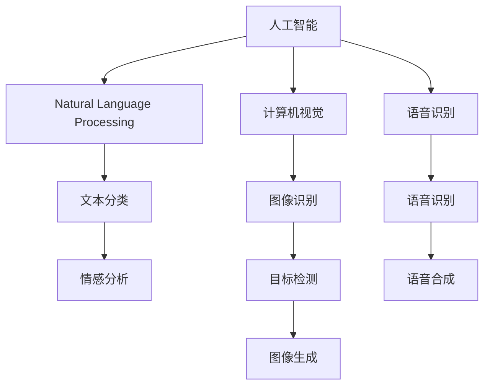

                 

# 李开复：苹果AI应用的颠覆性

## 1. 背景介绍

在人工智能(AI)蓬勃发展的今天，各大科技巨头纷纷加速布局AI技术，争夺AI市场的制高点。在这场激烈的技术竞赛中，苹果公司凭借其深厚的技术积累和创新能力，逐渐展现出颠覆性的应用前景。本文将从AI应用的视角，探讨苹果在自然语言处理(NLP)、计算机视觉、语音识别等领域的创新突破，及其对未来的深远影响。

## 2. 核心概念与联系

### 2.1 核心概念概述

要深入理解苹果AI应用的颠覆性，首先需要明确几个核心概念：

- **人工智能(AI)**：一种使计算机系统能够模拟人类智能行为的技术，包括感知、推理、学习等能力。
- **自然语言处理(NLP)**：专注于理解和生成人类语言的技术，如文本分类、机器翻译、情感分析等。
- **计算机视觉(Computer Vision, CV)**：让计算机能够“看”懂图像和视频的技术，涉及图像识别、目标检测、图像生成等。
- **语音识别(Speech Recognition)**：将语音信号转换为文本或命令的技术，涉及声音识别、语音合成等。
- **机器学习(Machine Learning)**：通过数据训练模型，使其具备自动学习新知识的能力。

这些技术相互交叉、协同作用，共同构成了苹果AI应用的坚实基础。

### 2.2 核心概念原理和架构的 Mermaid 流程图



此图展示了AI应用中各核心技术之间的联系与相互依赖关系。

## 3. 核心算法原理 & 具体操作步骤

### 3.1 算法原理概述

苹果的AI应用，无论是自然语言处理、计算机视觉还是语音识别，都是建立在深度学习的基础上。深度学习通过构建多层神经网络，利用大量标注数据进行训练，从而实现对复杂问题的有效建模和预测。

具体而言，苹果AI应用的颠覆性在于以下几个方面：

- **预训练模型(Pre-trained Models)**：苹果使用了在大规模语料上预训练的Transformer模型，如BERT、GPT-3等。这些模型通过自监督学习任务，学习到了丰富的语言知识和通用表征，可以应用于多种下游任务。
- **迁移学习(Meta-Learning)**：通过迁移学习，苹果能够将通用知识迁移到特定任务上，实现知识复用和快速适应。
- **多模态融合(Multimodal Fusion)**：苹果AI应用不仅限于单一模态，而是通过融合视觉、语音、文本等多模态信息，构建更为全面、准确的模型。
- **自适应算法(Adaptive Algorithms)**：苹果应用了动态调整学习率、适应性正则化等自适应算法，提高了模型的训练效率和泛化能力。

### 3.2 算法步骤详解

苹果AI应用的开发通常遵循以下步骤：

**Step 1: 数据准备**

- 收集和清洗海量标注数据，如自然语言语料、图像库、语音样本等。
- 使用数据增强技术，扩充训练集。
- 划分数据集为训练集、验证集和测试集，确保模型在不同数据上的泛化能力。

**Step 2: 模型搭建**

- 选择合适的预训练模型，如BERT、GPT-3等，进行迁移学习。
- 设计适合特定任务的任务适配层，如分类头、解码器等。
- 确定超参数，如学习率、批大小、迭代轮数等。

**Step 3: 模型训练**

- 使用优化算法，如AdamW、SGD等，进行模型训练。
- 应用正则化技术，如L2正则、Dropout等，防止过拟合。
- 定期在验证集上评估模型性能，根据性能调整学习率。

**Step 4: 模型部署**

- 将训练好的模型部署到实际应用中。
- 对模型进行测试，确保其性能稳定。
- 持续收集新数据，定期重新训练模型，保持模型的最新状态。

### 3.3 算法优缺点

**优点**：

- **高效性**：利用预训练模型和迁移学习，可以快速适应新任务，减少从头训练的时间和成本。
- **通用性**：基于通用预训练模型，能够应用于多种NLP、CV、语音识别任务，提高模型泛化能力。
- **可解释性**：通过可视化工具，可以对模型内部进行深入分析，提高模型的可解释性。

**缺点**：

- **数据依赖**：模型性能依赖于高质量的标注数据，数据采集和标注成本较高。
- **模型复杂度**：大规模预训练模型参数量庞大，训练和推理开销较大。
- **过拟合风险**：尤其在数据量小的情况下，容易发生过拟合，影响模型泛化能力。

### 3.4 算法应用领域

苹果AI应用的颠覆性在以下几个领域得到了充分体现：

- **自然语言处理(NLP)**：应用于Siri语音助手、苹果翻译应用等，实现自然语言理解和生成。
- **计算机视觉(CV)**：应用于人脸识别、图像分类、增强现实等，实现深度图像分析。
- **语音识别(Speech Recognition)**：应用于Siri语音助手、HomePod智能音箱等，实现语音命令控制和语音交互。
- **增强现实(AR)**：应用于iOS ARKit平台，实现自然图像增强、实时环境交互等功能。

## 4. 数学模型和公式 & 详细讲解 & 举例说明

### 4.1 数学模型构建

苹果AI应用通常基于深度神经网络构建模型。以下以BERT为例，构建自然语言处理模型：

- **输入层**：将输入文本转化为token ids和位置编码，形成Tensor输入。
- **Transformer编码器**：通过自注意力机制，捕捉输入中的语义信息。
- **输出层**：通过分类头或解码器，将编码器输出映射到任务所需的空间。

### 4.2 公式推导过程

以BERT为例，其预训练任务包括掩码语言模型(Masked Language Model, MLM)和下一句预测(Next Sentence Prediction, NSP)。掩码语言模型的损失函数为：

$$
L_{MLM} = -\frac{1}{N}\sum_{i=1}^N \log p(x_i|x_{-i})
$$

其中，$x_i$表示输入序列的第$i$个token，$x_{-i}$表示除去第$i$个token后的输入序列。$p$表示模型在给定上下文$x_{-i}$下的预测概率分布。

### 4.3 案例分析与讲解

以苹果的Siri语音助手为例，其工作原理如下：

1. **语音识别**：将用户的语音输入转化为文本，使用语音识别模型如HIFIGAN。
2. **自然语言理解(NLU)**：通过BERT模型进行文本分类，识别用户的意图。
3. **自然语言生成(NLG)**：根据用户意图，生成自然语言回复。
4. **语音合成**：将生成的文本转换为语音输出，使用Tacotron 2等模型进行合成。

## 5. 项目实践：代码实例和详细解释说明

### 5.1 开发环境搭建

苹果AI应用的开发主要依赖PyTorch和TensorFlow等深度学习框架。以下以PyTorch为例，搭建开发环境：

1. 安装Anaconda：`conda install anaconda`
2. 创建虚拟环境：`conda create -n pytorch-env python=3.8`
3. 激活虚拟环境：`conda activate pytorch-env`
4. 安装PyTorch和相关库：`pip install torch torchvision torchaudio`
5. 安装苹果AI应用所需的库和框架：`pip install fasttext SpeechRecognition`

### 5.2 源代码详细实现

以下以BERT模型为例，展示其自然语言处理应用的代码实现：

```python
import torch
import torch.nn as nn
import torch.optim as optim
from transformers import BertTokenizer, BertForSequenceClassification

# 加载预训练模型和分词器
tokenizer = BertTokenizer.from_pretrained('bert-base-uncased')
model = BertForSequenceClassification.from_pretrained('bert-base-uncased', num_labels=2)

# 定义损失函数
criterion = nn.CrossEntropyLoss()

# 定义优化器
optimizer = optim.Adam(model.parameters(), lr=2e-5)

# 训练函数
def train(model, train_loader, criterion, optimizer):
    model.train()
    total_loss = 0
    for batch in train_loader:
        inputs = batch['input_ids'].to(device)
        attention_mask = batch['attention_mask'].to(device)
        labels = batch['labels'].to(device)
        
        outputs = model(inputs, attention_mask=attention_mask)
        loss = criterion(outputs, labels)
        optimizer.zero_grad()
        loss.backward()
        optimizer.step()
        total_loss += loss.item()
    return total_loss / len(train_loader)

# 训练模型
device = torch.device('cuda' if torch.cuda.is_available() else 'cpu')
model.to(device)
train_loader = DataLoader(train_dataset, batch_size=16, shuffle=True)
for epoch in range(10):
    loss = train(model, train_loader, criterion, optimizer)
    print(f'Epoch {epoch+1}, loss: {loss:.3f}')
```

### 5.3 代码解读与分析

以上代码展示了BERT模型在自然语言分类任务上的训练过程。关键点包括：

- **模型加载**：使用`BertTokenizer`和`BertForSequenceClassification`加载预训练模型。
- **损失函数**：使用`nn.CrossEntropyLoss`计算分类任务上的交叉熵损失。
- **优化器**：使用`Adam`优化器进行参数更新。
- **训练函数**：通过前向传播、反向传播和优化器更新，完成一个epoch的训练。

## 6. 实际应用场景

### 6.1 智能语音助手

苹果的Siri语音助手利用BERT模型进行自然语言处理，通过语音识别和自然语言理解，实现与用户的自然对话。用户可以自然地向Siri提出问题，如“今天天气怎么样？”，Siri会通过自然语言生成，返回详细的天气信息。这种智能语音交互方式，极大地提升了用户的使用体验。

### 6.2 图像识别

苹果的Face ID技术应用了深度学习模型，通过人脸检测和图像识别，实现高效的生物识别功能。Face ID通过摄像头采集用户的面部图像，利用预训练模型进行人脸识别，安全地解锁手机或支付。这种基于深度学习的生物识别技术，大幅提升了设备的安全性和便捷性。

### 6.3 增强现实

苹果的ARKit平台，通过计算机视觉技术，实现了增强现实功能。用户可以通过摄像头实时捕捉现实环境，通过ARKit进行图像增强、虚拟对象交互等操作。这种强大的AR功能，为游戏、教育、设计等领域提供了新的创新空间。

### 6.4 未来应用展望

苹果AI应用的未来展望包括：

- **多模态融合**：将自然语言、图像、语音等多种模态信息融合，构建更为全面的智能系统。
- **实时推理**：实现高效的实时推理，支持更多的实时应用场景，如自动驾驶、智能家居等。
- **跨平台协作**：在苹果的生态系统中，实现不同设备间的无缝协作，提升用户体验。
- **边缘计算**：通过在边缘设备上部署AI模型，实现低延迟、高效率的AI应用。

## 7. 工具和资源推荐

### 7.1 学习资源推荐

为了深入理解苹果AI应用，以下是推荐的资源：

- **《Deep Learning with PyTorch》**：PyTorch官方教程，涵盖PyTorch的基本操作和深度学习模型构建。
- **《The Pythonic Apple》**：苹果官方开发指南，详细介绍了苹果生态系统的开发环境和API。
- **《AI in Industry》**：CSAIL CS50 AI课程，介绍AI在工业中的应用案例，涵盖自然语言处理、计算机视觉等多个领域。

### 7.2 开发工具推荐

- **PyTorch**：开源深度学习框架，支持动态计算图，适合快速迭代开发。
- **TensorFlow**：Google开源的深度学习框架，支持分布式计算，适合大规模生产部署。
- **fastText**：Facebook开源的自然语言处理库，支持文本分类、词向量训练等任务。
- **SpeechRecognition**：Python语音识别库，支持多种语音识别模型。

### 7.3 相关论文推荐

- **BERT: Pre-training of Deep Bidirectional Transformers for Language Understanding**：介绍BERT模型及其在自然语言处理中的应用。
- **HIFIGAN: Speech Synthesis with Reconnet Attention**：介绍HIFIGAN模型，用于高保真语音合成。
- **Tacotron 2: A Model for End-to-End Speech Synthesis**：介绍Tacotron 2模型，用于自然语言生成到语音的端到端合成。

## 8. 总结：未来发展趋势与挑战

### 8.1 研究成果总结

苹果AI应用的颠覆性主要体现在以下几个方面：

- **高效性**：利用预训练模型和迁移学习，快速适应新任务。
- **通用性**：模型在多种任务上表现优异，具备较强的泛化能力。
- **可解释性**：通过可视化工具，提高模型的可解释性。

### 8.2 未来发展趋势

苹果AI应用的未来趋势包括：

- **多模态融合**：将自然语言、图像、语音等多模态信息融合，提升模型的全面性和准确性。
- **实时推理**：实现高效的实时推理，支持更多的实时应用场景。
- **跨平台协作**：在苹果生态系统中，实现不同设备间的无缝协作，提升用户体验。
- **边缘计算**：通过在边缘设备上部署AI模型，实现低延迟、高效率的AI应用。

### 8.3 面临的挑战

苹果AI应用面临的挑战包括：

- **数据依赖**：高质量标注数据成本较高。
- **模型复杂度**：大规模预训练模型参数量庞大，训练和推理开销较大。
- **过拟合风险**：尤其在数据量小的情况下，容易发生过拟合。

### 8.4 研究展望

苹果AI应用的未来展望包括：

- **增强现实**：通过计算机视觉技术，实现增强现实功能，为用户提供沉浸式体验。
- **医疗健康**：利用自然语言处理和图像识别技术，提升医疗健康领域的诊断和治疗效果。
- **自动驾驶**：通过计算机视觉和深度学习技术，实现自动驾驶的感知、决策和控制。
- **智能家居**：通过自然语言处理和智能设备集成，实现家庭环境的智能管理和自动化。

## 9. 附录：常见问题与解答

**Q1：苹果AI应用的核心优势是什么？**

A: 苹果AI应用的核心优势在于其高效的预训练模型和迁移学习能力，能够在多个领域快速适应新任务，实现高性能的AI应用。

**Q2：苹果AI应用的模型如何训练？**

A: 苹果AI应用的模型通常基于深度学习框架进行训练，采用动态计算图和优化器进行参数更新，利用正则化技术防止过拟合。

**Q3：苹果AI应用的应用场景有哪些？**

A: 苹果AI应用主要应用于智能语音助手、图像识别、增强现实等多个领域，极大地提升了用户体验和设备功能。

**Q4：苹果AI应用的未来展望是什么？**

A: 苹果AI应用的未来展望包括多模态融合、实时推理、跨平台协作、边缘计算等多个方向，有望在未来进一步拓展应用范围。

---

作者：禅与计算机程序设计艺术 / Zen and the Art of Computer Programming

