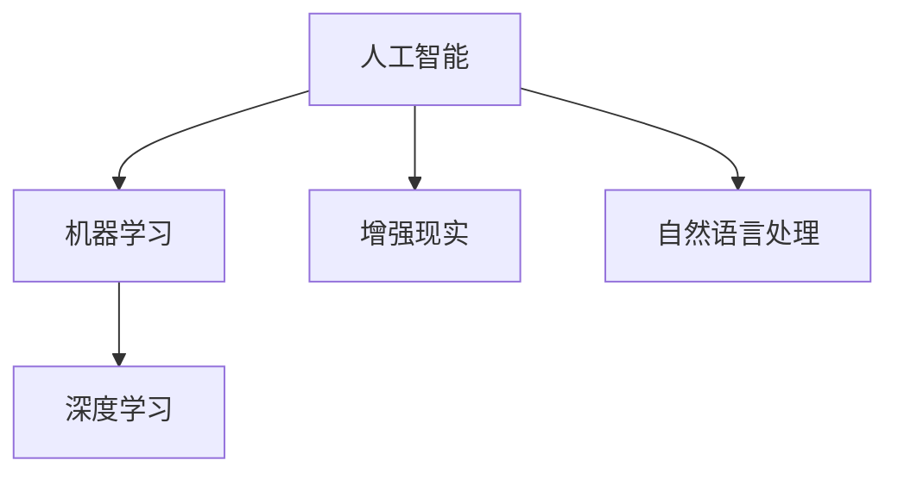
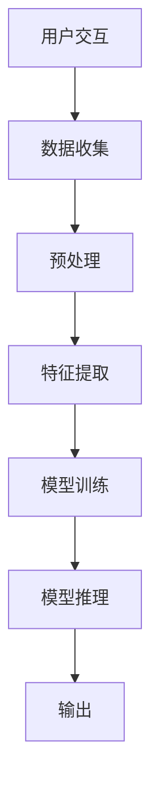

                 

# 李开复：苹果发布AI应用的价值

在人工智能（AI）领域，李开复无疑是一位站在技术前沿的行业领袖。他对AI应用的见解深入浅出，总能洞悉科技发展背后的商业价值和社会影响。本文将从李开复的视角，探讨苹果发布AI应用所蕴含的巨大价值，并分析其在实际应用中的影响。

## 1. 背景介绍

### 1.1 苹果在AI领域的布局

苹果（Apple）作为全球知名的消费电子公司，近年来在AI领域投入巨大。从Siri语音助手、Face ID人脸识别技术，到Apple Neural Engine加速计算芯片，苹果正逐步建立起强大的AI生态系统。2019年，苹果发布了新一代iOS系统iOS 13，其中整合了全新的AI应用，如智能分屏、画中画、语音识别等，为用户带来了更加便捷和智能的使用体验。

### 1.2 苹果发布AI应用的意义

苹果发布AI应用不仅展示了其在AI技术上的领先地位，更展现了其对消费者需求精准把握的能力。AI技术的应用，使得苹果设备能够更加贴合用户的个性化需求，提升用户体验。此外，苹果的AI应用还能为开发者提供丰富的API接口，推动第三方应用的创新，实现生态链的整体升级。

## 2. 核心概念与联系

### 2.1 核心概念概述

为更好地理解苹果AI应用的价值，本节将介绍几个密切相关的核心概念：

- **人工智能（AI）**：通过算法和计算，使计算机模拟、延伸和扩展人类智能的技术。
- **机器学习（ML）**：AI的一个分支，使计算机系统能够从数据中学习规律，进行预测和决策。
- **深度学习（DL）**：ML的一个高级分支，通过多层次神经网络进行数据特征的自动提取和模式识别。
- **增强现实（AR）**：通过计算机视觉、传感器等技术，将虚拟信息与现实世界结合，提供沉浸式体验。
- **自然语言处理（NLP）**：使计算机能够理解、处理和生成人类语言，是AI的重要应用之一。

这些概念之间通过以下Mermaid流程图展示其联系：



### 2.2 核心概念原理和架构的 Mermaid 流程图

苹果的AI应用涵盖了深度学习、计算机视觉、自然语言处理等多个技术领域。其核心架构通过以下流程图示意：



从用户交互到数据收集，再到特征提取、模型训练和推理输出，这个过程展示了苹果AI应用的完整流程。

## 3. 核心算法原理 & 具体操作步骤

### 3.1 算法原理概述

苹果AI应用的算法原理主要基于深度学习和自然语言处理技术。深度学习通过对大量数据的学习，自动提取特征，从而实现模式识别和预测。自然语言处理则使机器能够理解、处理和生成人类语言，从而进行文本分析、情感识别、语音识别等任务。

### 3.2 算法步骤详解

苹果AI应用的开发流程大致包括以下几个步骤：

1. **数据收集与预处理**：从用户设备中收集相关数据，如位置信息、语音指令、文本输入等，并进行预处理，包括去噪、归一化、标准化等。
2. **特征提取**：通过深度学习模型，自动提取数据中的关键特征，如图像中的边缘、纹理，语音中的音高、音调等。
3. **模型训练**：使用机器学习算法对提取的特征进行训练，学习数据中的规律和模式。
4. **模型推理**：将新的数据输入训练好的模型，进行推理和预测。
5. **输出与反馈**：根据模型推理结果，生成相应的输出，如语音识别结果、图像分类结果等。同时，收集用户反馈，用于模型的进一步优化。

### 3.3 算法优缺点

苹果AI应用的优点在于：

- **用户体验优化**：AI技术的应用使得苹果设备更加智能化，提升了用户体验。
- **生态系统增强**：丰富的API接口，推动了第三方应用的创新，增强了苹果生态系统的竞争力。
- **跨平台兼容**：通过iOS系统，苹果AI应用能够跨平台运行，扩大了其应用范围。

然而，也存在一些缺点：

- **隐私风险**：用户数据被收集和处理，可能带来隐私泄露的风险。
- **计算资源消耗**：深度学习和自然语言处理需要大量的计算资源，可能影响设备性能。
- **算法偏见**：算法模型可能存在偏见，导致输出结果的不公平性。

### 3.4 算法应用领域

苹果AI应用主要应用于以下几个领域：

- **语音助手**：通过自然语言处理和语音识别技术，实现智能语音助手功能。
- **图像识别**：通过计算机视觉技术，实现人脸识别、物体检测等应用。
- **文本分析**：通过自然语言处理技术，进行情感分析、文本分类等任务。
- **增强现实**：通过AR技术，结合虚拟信息，为用户提供沉浸式体验。

## 4. 数学模型和公式 & 详细讲解 & 举例说明

### 4.1 数学模型构建

苹果AI应用的数学模型主要基于深度学习中的卷积神经网络（CNN）和循环神经网络（RNN）。CNN常用于图像识别和处理，RNN则常用于文本分析和序列预测。

### 4.2 公式推导过程

以图像识别为例，假设输入图像为$I$，输出标签为$Y$，模型参数为$\theta$，则常见的图像分类模型可表示为：

$$
\hat{Y} = f_\theta(I)
$$

其中$f_\theta$表示通过卷积神经网络进行特征提取和分类，$\hat{Y}$表示模型预测的标签。

### 4.3 案例分析与讲解

苹果的Face ID功能就是一个典型的应用。Face ID通过卷积神经网络对输入的面部图像进行特征提取，然后与预先存储的面部特征进行比对，从而进行身份验证。这一过程中，模型首先对输入图像进行卷积操作，提取局部特征：

$$
F = \sum_{i=1}^N W_i \cdot I_i
$$

其中$W_i$为卷积核，$I_i$为图像中对应位置的像素值。然后通过池化操作，将特征图的大小缩小：

$$
F' = \max_{i,j} F[i,j]
$$

最后通过全连接层进行分类：

$$
\hat{Y} = softmax(W \cdot F')
$$

其中$softmax$函数将特征向量转换为概率分布，$W$为全连接层的权重。

## 5. 项目实践：代码实例和详细解释说明

### 5.1 开发环境搭建

苹果的AI应用开发主要依赖苹果的开发平台Xcode，以及其配套的AI框架Core ML和Apple Neural Engine。在开发过程中，开发者需要搭建Xcode环境，安装相关依赖，并使用Core ML工具进行模型训练和推理。

### 5.2 源代码详细实现

以下是一个简单的基于Core ML进行图像分类的示例代码：

```python
import coremltools as ct
import cv2

# 加载预训练模型
model = ct.load_model('classifier.mlmodel')

# 加载图像
img = cv2.imread('example.jpg')
img = cv2.resize(img, (224, 224))

# 预处理图像
img = cv2.cvtColor(img, cv2.COLOR_BGR2RGB)
img = img / 255.0

# 进行推理
result = model.predict(img)

# 输出结果
print(result)
```

### 5.3 代码解读与分析

- `coremltools`库提供了加载、转换和推理Core ML模型的接口。
- `cv2`库用于图像的加载和预处理。
- `model.predict()`方法进行图像分类的推理，并返回预测结果。

## 6. 实际应用场景

### 6.1 智能家居

苹果的AI应用在智能家居领域有着广泛的应用。通过深度学习和自然语言处理技术，苹果设备可以理解用户语音指令，实现智能家居设备的控制。例如，Siri可以通过语音指令控制灯光、空调、窗帘等设备，极大地提升了用户的便利性和舒适性。

### 6.2 健康医疗

苹果的AI应用在健康医疗领域也展现出了巨大的潜力。通过苹果手表和健康应用，苹果收集用户的心率、步数、睡眠质量等数据，并进行分析，为用户提供个性化的健康建议。此外，苹果的AI应用还可以进行疾病预测和诊断，帮助医生更好地进行诊疗。

### 6.3 金融服务

苹果的AI应用在金融服务领域也得到了应用。通过苹果支付（Apple Pay），用户可以通过语音助手进行支付，提升了支付的便捷性和安全性。此外，苹果的AI应用还可以进行股票分析和风险评估，为投资者提供精准的投资建议。

### 6.4 未来应用展望

未来，苹果的AI应用将在更多领域得到应用。随着技术的发展，苹果的AI应用将更加智能化、个性化，能够为用户提供更加便捷和智能的服务。

## 7. 工具和资源推荐

### 7.1 学习资源推荐

为帮助开发者系统掌握苹果AI应用的开发，以下是一些推荐的学习资源：

- **《深度学习基础》**：由李开复主讲的在线课程，介绍了深度学习的基本概念和应用。
- **《苹果AI开发指南》**：苹果官方发布的AI应用开发指南，提供了详细的开发步骤和技术细节。
- **《机器学习实战》**：由Peter Harrington编写的实战指南，介绍了机器学习算法的实现和应用。

### 7.2 开发工具推荐

苹果的AI应用开发主要依赖以下工具：

- **Xcode**：苹果的开发环境，支持多平台应用开发。
- **Core ML**：苹果的AI框架，提供了模型训练和推理的工具。
- **Apple Neural Engine**：苹果的加速计算芯片，支持深度学习的加速计算。

### 7.3 相关论文推荐

苹果的AI应用基于深度学习和自然语言处理技术，以下是一些相关的论文：

- **《Convolutional Neural Networks for Visual Recognition》**：深度学习领域的经典论文，介绍了卷积神经网络在图像识别中的应用。
- **《Attention Is All You Need》**：深度学习领域的里程碑论文，提出了Transformer模型，引领了自然语言处理的革命。

## 8. 总结：未来发展趋势与挑战

### 8.1 研究成果总结

苹果的AI应用展示了深度学习、自然语言处理等技术的强大应用潜力。通过AI技术，苹果设备能够更好地理解用户需求，提升用户体验。

### 8.2 未来发展趋势

未来，苹果的AI应用将在更多领域得到应用。随着技术的发展，苹果的AI应用将更加智能化、个性化，能够为用户提供更加便捷和智能的服务。

### 8.3 面临的挑战

尽管苹果的AI应用取得了显著成果，但也面临一些挑战：

- **隐私保护**：如何保护用户隐私，防止数据泄露。
- **计算资源**：如何优化算法，提高计算效率，降低设备消耗。
- **算法公平性**：如何确保算法模型的公平性，避免偏见和歧视。

### 8.4 研究展望

未来，苹果的AI应用需要在隐私保护、计算资源优化和算法公平性等方面进行深入研究，以实现更好的应用效果。

## 9. 附录：常见问题与解答

**Q1：苹果的AI应用是否依赖于第三方框架？**

A: 苹果的AI应用主要依赖苹果自己的开发框架，如Core ML和Apple Neural Engine。这些框架提供了丰富的API接口和优化工具，方便开发者进行AI应用的开发。

**Q2：苹果的AI应用是否会降低设备性能？**

A: 苹果的AI应用通过优化算法和硬件加速，尽可能地降低对设备性能的影响。例如，苹果的Apple Neural Engine加速计算芯片可以显著提升深度学习的计算效率。

**Q3：苹果的AI应用是否存在隐私风险？**

A: 苹果在用户隐私保护方面有着严格的规定。通过苹果的隐私框架，用户数据得到了很好的保护，防止数据泄露和滥用。

**Q4：苹果的AI应用是否会存在算法偏见？**

A: 苹果的AI应用通过多轮的模型训练和优化，尽可能地消除算法偏见。同时，苹果还引入了人工审核机制，确保模型的公平性和透明性。

---

作者：禅与计算机程序设计艺术 / Zen and the Art of Computer Programming

