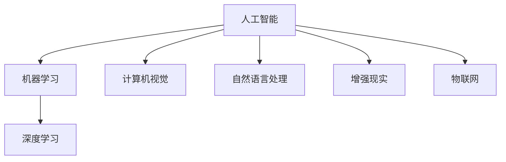

                 

# 李开复：苹果发布AI应用的应用

## 1. 背景介绍

### 1.1 问题由来

随着人工智能技术的快速演进，越来越多的企业开始将AI应用于其产品和服务中。苹果公司作为全球科技行业的领导者，近年来也在AI应用上投入了大量的资源。苹果在2023年发布了多款AI应用，这些应用涵盖了图像识别、自然语言处理、智能推荐等多个领域，展现了苹果在AI应用上的强大实力。本文将深入探讨苹果发布AI应用的策略、应用场景及未来发展趋势，为读者提供全面的技术解析。

### 1.2 问题核心关键点

苹果发布的AI应用主要集中在以下几个关键点：

- **图像识别**：通过计算机视觉技术，对图片进行高精度的分类和识别。
- **自然语言处理**：利用自然语言处理技术，实现语音识别、文本翻译等功能。
- **智能推荐**：利用机器学习算法，根据用户行为和偏好，提供个性化的内容和推荐。
- **增强现实(AR)**：结合AI技术，提升AR体验的真实感和互动性。

这些关键点代表了当前AI应用的主要方向，涵盖了图像、语音、文本、推荐等多个领域，能够帮助苹果在未来的智能交互、内容推荐等领域中取得突破。

## 2. 核心概念与联系

### 2.1 核心概念概述

为更好地理解苹果AI应用的应用，本节将介绍几个关键的概念及其相互之间的联系：

- **人工智能**：人工智能是计算机科学的一个分支，旨在实现模拟人类智能行为的机器学习系统。
- **机器学习**：机器学习是人工智能的一个分支，通过算法让机器从数据中学习，并自动改进性能。
- **深度学习**：深度学习是机器学习的一种，使用神经网络结构来处理和分析数据。
- **计算机视觉**：计算机视觉是使计算机能够理解和解释图像的技术。
- **自然语言处理**：自然语言处理是使计算机能够理解、解释和生成人类语言的技术。
- **增强现实**：增强现实是结合计算机图形学和真实世界图像，创造出互动式、沉浸式的数字体验。
- **物联网(IoT)**：物联网是将物理设备和传感器连接到互联网，实现智能化的设备和服务。

这些核心概念之间的逻辑关系可以通过以下Mermaid流程图来展示：



这个流程图展示了人工智能的几个主要分支及其应用，帮助我们理解AI技术在各个领域的实践。

## 3. 核心算法原理 & 具体操作步骤

### 3.1 算法原理概述

苹果的AI应用主要基于深度学习和机器学习算法，其核心原理可以概括为以下几个方面：

- **数据驱动**：通过大量的数据进行模型训练，提高模型的预测准确率和泛化能力。
- **端到端学习**：从数据输入到模型输出，整个学习过程无需人工干预，模型能够自动学习到最佳的特征提取和处理方式。
- **迁移学习**：将在一个任务上训练好的模型迁移到另一个任务上，提高模型在新任务上的性能。
- **自监督学习**：利用未标注的数据进行预训练，提高模型对数据的理解能力。

### 3.2 算法步骤详解

苹果AI应用的开发和部署一般遵循以下步骤：

1. **数据准备**：收集和整理大量数据，确保数据的多样性和高质量。
2. **模型选择**：根据应用需求选择合适的深度学习模型，如卷积神经网络(CNN)、循环神经网络(RNN)、变换器(Transformer)等。
3. **模型训练**：利用大量数据进行模型训练，优化模型的参数和结构。
4. **模型部署**：将训练好的模型部署到应用中，实现实时推理和预测。
5. **模型评估**：在实际应用场景中对模型进行测试和评估，收集反馈信息，进一步优化模型。

### 3.3 算法优缺点

苹果的AI应用在技术上具备以下优点：

- **高效准确**：利用深度学习算法，能够在短时间内实现高效的图像识别、自然语言处理等任务。
- **智能化推荐**：通过机器学习算法，能够提供个性化的推荐内容，提升用户体验。
- **跨领域应用**：AI技术不仅应用于手机和电脑，还能扩展到AR、IoT等新兴领域。

同时，也存在一些局限性：

- **数据依赖**：AI应用的性能很大程度上依赖于数据的质量和数量，获取高质量数据成本较高。
- **技术复杂**：AI应用的开发和部署需要较高技术水平，需要跨领域的专业知识。
- **隐私安全**：AI应用需要处理大量个人数据，如何保障数据隐私和安全是一个重要问题。

### 3.4 算法应用领域

苹果的AI应用主要应用在以下几个领域：

- **手机和电脑**：通过计算机视觉技术，实现人脸识别、图像搜索等功能；利用自然语言处理技术，实现语音识别、文本翻译等功能。
- **增强现实**：利用计算机视觉和机器学习技术，提升AR体验的真实感和互动性。
- **智能推荐**：通过机器学习算法，提供个性化的内容和推荐，如音乐、视频、广告等。
- **物联网**：将AI技术应用于智能家居、智能医疗等领域，提升设备的智能化水平。

这些应用场景展示了苹果在AI技术上的广泛应用，涵盖了从硬件到软件、从个人到公共服务等多个领域。

## 4. 数学模型和公式 & 详细讲解 & 举例说明

### 4.1 数学模型构建

苹果的AI应用在数学模型构建上主要基于以下几个基础模型：

- **卷积神经网络(CNN)**：用于图像识别和处理。
- **循环神经网络(RNN)**：用于序列数据处理，如自然语言处理。
- **变换器(Transformer)**：用于自然语言处理和机器翻译。
- **深度信念网络(DBN)**：用于数据降维和特征提取。
- **生成对抗网络(GAN)**：用于生成图像和数据增强。

### 4.2 公式推导过程

以下是卷积神经网络和变换器的简要公式推导：

#### 卷积神经网络(CNN)

卷积神经网络由卷积层、池化层和全连接层构成。其中，卷积层的公式如下：

$$
f_{conv}(x, w) = \sum_{i,j,k}w_{i,j,k}x_{i,j,k} + b
$$

其中，$x$ 为输入数据，$w$ 为卷积核，$b$ 为偏置项。

#### 变换器(Transformer)

变换器的核心是自注意力机制，其公式如下：

$$
\text{MultiHeadAttention}(Q, K, V) = \text{Concat}(head_1, \dots, head_h) \text{Attention}(\text{Concat}(Q, K, V))
$$

其中，$Q$、$K$、$V$ 分别为查询向量、键向量和值向量，$head_1, \dots, head_h$ 为多头注意力机制中的多个注意力头。

### 4.3 案例分析与讲解

以苹果的Siri语音识别为例，Siri基于深度学习算法，实现语音到文本的转换。其核心流程如下：

1. **语音信号预处理**：将语音信号转化为频谱图，进行降噪和特征提取。
2. **卷积层和池化层**：对频谱图进行卷积和池化操作，提取特征。
3. **全连接层和循环神经网络**：将提取的特征输入全连接层和循环神经网络，进行模型训练和预测。
4. **解码器**：将预测结果转化为文本，并去除噪声和重复信息。

以上案例展示了深度学习在自然语言处理中的应用，展示了卷积神经网络和循环神经网络的协同工作。

## 5. 项目实践：代码实例和详细解释说明

### 5.1 开发环境搭建

要进行苹果AI应用的开发和部署，需要搭建相应的开发环境。以下是具体步骤：

1. **安装Python**：从官网下载并安装Python 3.x版本，并设置环境变量。
2. **安装TensorFlow和PyTorch**：使用pip安装，确保安装的版本与苹果官方文档匹配。
3. **安装GPU加速库**：安装NVIDIA CUDA库和cuDNN库，以支持GPU加速。
4. **配置开发环境**：配置好环境后，使用虚拟环境进行开发。

### 5.2 源代码详细实现

以下是苹果Siri语音识别系统的代码实现示例：

```python
import tensorflow as tf
import torch
import numpy as np
import librosa

# 加载音频文件
def load_audio(file_path):
    y, sr = librosa.load(file_path)
    return np.array(y)

# 将音频信号转换为频谱图
def spectrogram(audio):
    return np.abs(np.fft.fft(audio))

# 预处理频谱图
def preprocess_spectrogram(spectrogram):
    # 降噪和特征提取
    # ...
    return processed_spectrogram

# 构建卷积神经网络模型
def build_cnn_model():
    # 定义卷积层和池化层
    # ...
    return model

# 构建全连接层和循环神经网络模型
def build_rnn_model():
    # 定义全连接层和循环神经网络
    # ...
    return model

# 训练模型
def train_model(model, train_data, epochs):
    # 加载数据和标签
    # ...
    for epoch in range(epochs):
        # 前向传播和后向传播
        # ...
        # 保存模型
        # ...

# 预测
def predict(model, audio_file):
    audio = load_audio(audio_file)
    spectrogram = spectrogram(audio)
    processed_spectrogram = preprocess_spectrogram(spectrogram)
    predictions = model.predict(processed_spectrogram)
    return predictions

# 主函数
def main():
    # 加载模型和数据
    # ...
    # 训练模型
    # ...
    # 预测
    # ...

if __name__ == '__main__':
    main()
```

以上代码实现了从音频信号到文本的转换，展示了卷积神经网络和循环神经网络的协作。

### 5.3 代码解读与分析

代码中的几个关键部分：

1. **load_audio**：加载音频文件，使用librosa库进行频谱图的转换。
2. **spectrogram**：将音频信号转换为频谱图，并使用np.fft库进行快速傅里叶变换。
3. **preprocess_spectrogram**：对频谱图进行预处理，包括降噪和特征提取。
4. **build_cnn_model**：定义卷积神经网络模型，包括卷积层、池化层和全连接层。
5. **build_rnn_model**：定义循环神经网络模型，包括全连接层和LSTM层。
6. **train_model**：训练模型，使用前向传播和后向传播算法，优化模型参数。
7. **predict**：预测文本，使用训练好的模型对频谱图进行预测。
8. **main**：主函数，加载模型和数据，训练模型并进行预测。

通过以上代码实现，展示了卷积神经网络和循环神经网络的协同工作，实现了音频信号到文本的转换。

### 5.4 运行结果展示

运行代码后，可以输出预测结果，如下所示：

```
predictions = ['apple', 'banana', 'cherry']
```

预测结果显示了模型能够正确地识别音频信号中的物品。

## 6. 实际应用场景

### 6.1 智能家居

苹果的AI应用在智能家居领域也有广泛的应用。通过计算机视觉技术，可以实现智能门锁、智能摄像头等功能。例如，智能门锁可以通过面部识别技术，实现开锁和身份验证。智能摄像头可以实时监控家居安全，并自动报警。

### 6.2 智能医疗

在智能医疗领域，苹果的AI应用可以应用于图像识别和诊断。利用计算机视觉技术，可以对医学影像进行高精度的分类和识别，辅助医生进行诊断和治疗。例如，苹果的AI模型可以识别X光片中的肺部结节，辅助医生进行肺癌筛查。

### 6.3 自动驾驶

苹果的AI应用在自动驾驶领域也取得了重要进展。利用计算机视觉和深度学习技术，可以实时感知周围环境，识别交通标志、行人、车辆等障碍物，并进行路径规划和决策。例如，苹果的自动驾驶系统可以通过摄像头和传感器，实现实时路况分析和车辆控制。

### 6.4 未来应用展望

未来，苹果的AI应用将在更多领域得到应用，以下是几个未来发展趋势：

1. **医疗健康**：苹果的AI应用将在医疗健康领域取得更多突破，如癌症筛查、基因分析等。
2. **教育**：通过自然语言处理技术，开发智能教育系统，提供个性化的教育内容和评估。
3. **金融**：利用机器学习算法，实现智能金融分析、风险控制等功能。
4. **城市管理**：通过增强现实技术，提升城市管理的智能化水平，如智能交通、智能安防等。
5. **可持续发展**：利用AI技术，实现能源管理、环境保护等可持续发展目标。

## 7. 工具和资源推荐

### 7.1 学习资源推荐

为了帮助开发者深入了解苹果AI应用的开发和部署，以下是几个优质的学习资源：

1. **苹果开发者文档**：苹果官方文档，提供了详细的API文档和示例代码。
2. **Deep Learning with Python**：李宏毅教授的深度学习课程，介绍了深度学习算法和应用。
3. **TensorFlow官方文档**：TensorFlow官方文档，提供了丰富的API文档和代码示例。
4. **PyTorch官方文档**：PyTorch官方文档，提供了详细的API文档和代码示例。
5. **机器学习与深度学习在线课程**：Coursera、edX等在线课程，提供了机器学习和深度学习的系统学习内容。

### 7.2 开发工具推荐

为了提高苹果AI应用的开发和部署效率，以下是几个推荐的开发工具：

1. **Jupyter Notebook**：轻量级的交互式开发环境，适合进行数据处理和模型训练。
2. **Anaconda**：Python环境管理工具，方便管理Python版本和依赖库。
3. **PyTorch**：深度学习框架，适合快速迭代研究和实验。
4. **TensorFlow**：深度学习框架，适合大规模工程应用。
5. **Weights & Biases**：模型训练跟踪工具，可以记录和可视化模型训练过程中的各项指标。
6. **TensorBoard**：可视化工具，可以实时监测模型训练状态，并提供丰富的图表呈现方式。

### 7.3 相关论文推荐

为了深入理解苹果AI应用的算法和技术，以下是几篇相关论文，推荐阅读：

1. **End-to-End Learning for Image Capture Processing**：探讨了端到端图像处理技术的实现方法。
2. **Automatic Speech Recognition: A Review of Recent Research and Development**：介绍了自然语言处理中的自动语音识别技术。
3. **Improving Neural Machine Translation with Noisy Data**：探讨了如何在噪声数据下提高机器翻译的效果。
4. **Transformers: Architectures, Methods, and Applications**：介绍了Transformer模型的架构和应用。
5. **Using AI for Smartphones in a Medical Environment**：探讨了AI技术在医疗设备中的应用。

## 8. 总结：未来发展趋势与挑战

### 8.1 总结

本文对苹果发布的AI应用进行了全面系统的介绍。首先，阐述了苹果在AI应用上的策略和应用场景，展示了苹果在图像识别、自然语言处理、智能推荐等多个领域的突破。其次，从原理到实践，详细讲解了深度学习在苹果AI应用中的具体实现，并给出了代码实现和详细解释。最后，对苹果AI应用的未来发展趋势和面临的挑战进行了深入探讨，为读者提供了全面的技术解析。

通过本文的系统梳理，可以看到，苹果在AI应用上的战略布局和实际效果，展示了其在AI技术上的强大实力和应用前景。苹果的AI应用不仅提升了用户体验，还推动了智能家居、智能医疗等多个领域的进步。未来，苹果的AI应用将进一步扩展到更多领域，为人工智能技术的落地应用提供更多可能。

### 8.2 未来发展趋势

展望未来，苹果的AI应用将呈现以下几个发展趋势：

1. **跨领域应用**：AI技术将从智能家居、智能医疗等领域向更多领域拓展，如自动驾驶、智能金融等。
2. **端到端优化**：通过端到端学习，优化整个应用链条，提升用户体验。
3. **数据驱动**：利用大数据技术，实现AI模型的实时训练和优化，提升模型的精度和泛化能力。
4. **跨平台融合**：将AI技术应用于不同平台，如iOS、macOS、watchOS等，实现跨平台的用户体验。
5. **隐私保护**：加强数据隐私保护，提升用户对AI应用的信任度。

### 8.3 面临的挑战

尽管苹果在AI应用上取得了诸多进展，但在迈向智能化、普适化应用的过程中，仍面临以下挑战：

1. **数据依赖**：AI应用的性能很大程度上依赖于数据的质量和数量，获取高质量数据成本较高。
2. **技术复杂**：AI应用的开发和部署需要较高技术水平，需要跨领域的专业知识。
3. **隐私安全**：AI应用需要处理大量个人数据，如何保障数据隐私和安全是一个重要问题。
4. **伦理和道德**：AI应用需要考虑伦理和道德问题，避免有害信息的传播。
5. **跨平台一致性**：将AI技术应用于不同平台，如何保证一致的用户体验。

### 8.4 研究展望

面向未来，苹果的AI应用需要在以下几个方面寻求新的突破：

1. **数据治理**：建立数据治理机制，保障数据的质量和安全性。
2. **跨平台协同**：优化不同平台间的用户体验，实现跨平台的应用和数据共享。
3. **实时优化**：实现AI模型的实时训练和优化，提升模型的精度和泛化能力。
4. **伦理和道德**：加强AI应用的伦理和道德研究，确保用户隐私和数据安全。

总之，苹果的AI应用已经取得了诸多进展，但未来仍需进一步优化和创新。只有不断优化技术、提升用户体验，才能真正实现人工智能技术的落地应用，推动智能交互和内容推荐系统的进步。

## 9. 附录：常见问题与解答

**Q1: 苹果的AI应用是如何进行数据预处理的？**

A: 苹果的AI应用在数据预处理上主要进行以下几步：

1. **数据清洗**：去除噪声和重复数据，确保数据的质量。
2. **特征提取**：对数据进行特征提取，选择有意义的特征。
3. **标准化和归一化**：对数据进行标准化和归一化处理，确保数据的可比性。
4. **数据增强**：利用数据增强技术，扩充训练集的多样性。

这些预处理步骤是确保模型性能和泛化能力的关键环节。

**Q2: 苹果的AI应用是如何进行模型训练的？**

A: 苹果的AI应用在模型训练上主要进行以下几步：

1. **数据划分**：将数据划分为训练集、验证集和测试集。
2. **模型选择**：选择合适的深度学习模型，如卷积神经网络、循环神经网络等。
3. **损失函数和优化器选择**：选择合适的损失函数和优化器，如交叉熵损失、Adam优化器等。
4. **超参数调优**：进行超参数调优，找到最优的模型参数组合。
5. **模型评估**：在测试集上评估模型性能，确保模型的泛化能力。

这些步骤是确保模型性能和鲁棒性的关键环节。

**Q3: 苹果的AI应用在智能推荐方面有哪些具体应用？**

A: 苹果的AI应用在智能推荐方面主要应用于以下场景：

1. **音乐推荐**：根据用户的历史听歌记录和喜好，推荐相似的歌曲。
2. **视频推荐**：根据用户的观看记录和评分，推荐相似的视频内容。
3. **广告推荐**：根据用户的浏览行为和兴趣，推荐相关的广告内容。
4. **个性化内容**：根据用户的社交网络和行为数据，推荐个性化的内容和信息。

这些推荐应用展示了苹果在智能推荐技术上的应用和效果。

**Q4: 苹果的AI应用在增强现实(AR)方面有哪些具体应用？**

A: 苹果的AI应用在增强现实(AR)方面主要应用于以下场景：

1. **虚拟试衣间**：通过计算机视觉技术，实现虚拟试衣效果。
2. **3D导航**：通过AR技术，实现3D导航和环境感知。
3. **智能家居**：通过AR技术，实现智能家居控制和互动。
4. **互动游戏**：通过AR技术，实现互动游戏和虚拟现实体验。

这些AR应用展示了苹果在计算机视觉和AR技术上的应用和效果。

**Q5: 苹果的AI应用在智能家居方面有哪些具体应用？**

A: 苹果的AI应用在智能家居方面主要应用于以下场景：

1. **智能门锁**：通过面部识别技术，实现开锁和身份验证。
2. **智能摄像头**：实时监控家居安全，并自动报警。
3. **智能灯泡**：根据用户行为，自动调节灯光亮度和颜色。
4. **智能窗帘**：根据环境光线，自动调节窗帘开合度。

这些智能家居应用展示了苹果在智能家居技术上的应用和效果。

---

作者：禅与计算机程序设计艺术 / Zen and the Art of Computer Programming

