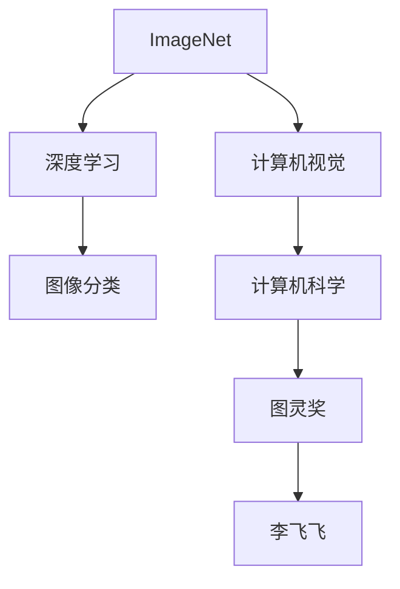

                 

# 李飞飞与ImageNet的传奇

> 关键词：李飞飞, ImageNet, 深度学习, 计算机视觉, 图像分类, 计算机科学, 图灵奖, 机器学习

## 1. 背景介绍

### 1.1 问题由来
在21世纪的前十年，计算机视觉领域的发展遭遇了瓶颈，当时的图像分类任务普遍使用机器学习和传统计算机视觉方法，但表现不尽如人意。这些问题推动了计算机视觉和机器学习领域的探索，最终催生了深度学习，并由此促成了ImageNet的诞生，将计算机视觉带入了新的纪元。

### 1.2 问题核心关键点
ImageNet和深度学习的结合，成为计算机视觉领域的重要里程碑。ImageNet的创建和深度学习的发展，不仅推动了计算机视觉领域的发展，也促进了整个机器学习领域的进步。这一事件背后，是李飞飞教授的卓越贡献。

## 2. 核心概念与联系

### 2.1 核心概念概述

为更好地理解李飞飞教授与ImageNet的传奇，本节将介绍几个密切相关的核心概念：

- 计算机视觉(Computer Vision)：研究如何使计算机能够从图像、视频等视觉媒体中提取信息，并对图像、视频等进行自动化分析和理解。
- 深度学习(Deep Learning)：基于多层神经网络构建的机器学习技术，可以自动学习并提取数据中的特征。
- ImageNet：由斯坦福大学计算机视觉实验室创建的大规模图像数据库，包含超过1400万张标注图像，是深度学习发展的重要数据基础。
- 图像分类(Image Classification)：识别图像中物体的种类，是计算机视觉领域中最基础且重要的任务之一。
- 计算机科学(Computer Science)：研究计算机和信息技术的基础理论和应用。
- 图灵奖(Turing Award)：计算机科学的最高荣誉，由ACM颁发，用以表彰对计算机科学做出杰出贡献的个人。

这些核心概念之间的逻辑关系可以通过以下Mermaid流程图来展示：



这个流程图展示了一些关键概念及其之间的关系：

1. ImageNet为深度学习提供了大量的训练数据。
2. 深度学习是计算机视觉技术的基础。
3. 图像分类是计算机视觉中最为基础和重要的任务。
4. 计算机科学推动了深度学习和计算机视觉的发展。
5. 图灵奖是计算机科学领域的重要荣誉，用以表彰杰出的贡献。
6. 李飞飞教授在深度学习和计算机视觉领域做出了开创性贡献，并因此荣获图灵奖。

## 3. 核心算法原理 & 具体操作步骤

### 3.1 算法原理概述

ImageNet与深度学习的结合，主要是通过图像分类任务来实现的。其核心思想是：利用大规模的标注数据集训练深度神经网络，使其能够自动学习图像特征，并通过前向传播和反向传播算法不断优化模型参数，从而实现图像分类的自动化和高效化。

形式化地，设预训练模型为 $M_{\theta}$，其中 $\theta$ 为模型参数。给定ImageNet上的图像 $x_i$ 和对应的标签 $y_i$，图像分类任务的目标是找到最优参数：

$$
\theta^* = \mathop{\arg\min}_{\theta} \mathcal{L}(M_{\theta},D)
$$

其中 $\mathcal{L}$ 为交叉熵损失函数，用于衡量模型输出与真实标签之间的差异。

### 3.2 算法步骤详解

ImageNet与深度学习的结合，主要通过以下步骤实现：

**Step 1: 数据准备**
- 收集ImageNet上标注的图像数据集，划分为训练集、验证集和测试集。一般要求标注数据与训练数据分布一致。

**Step 2: 构建深度神经网络**
- 选择合适的深度神经网络模型，如AlexNet、VGG、ResNet等，设计合适的网络结构，包括卷积层、池化层、全连接层等。
- 设定合适的超参数，如学习率、批大小、迭代轮数等。

**Step 3: 模型训练**
- 将训练集数据分批次输入模型，前向传播计算损失函数。
- 反向传播计算参数梯度，根据设定的优化算法（如SGD、Adam等）更新模型参数。
- 周期性在验证集上评估模型性能，根据性能指标决定是否触发Early Stopping。
- 重复上述步骤直至满足预设的迭代轮数或Early Stopping条件。

**Step 4: 模型评估**
- 在测试集上评估模型性能，对比微调前后的精度提升。
- 使用微调后的模型对新样本进行推理预测，集成到实际的应用系统中。
- 持续收集新的数据，定期重新微调模型，以适应数据分布的变化。

### 3.3 算法优缺点

ImageNet与深度学习的结合方法具有以下优点：
1. 数据驱动。ImageNet为深度学习提供了大规模的标注数据集，使得模型能够学习到丰富的视觉特征。
2. 通用性强。ImageNet上包含各类物体和场景，模型能够在多种图像分类任务上取得优异的性能。
3. 效果显著。基于ImageNet训练的深度模型在图像分类等任务上取得了显著的精度提升。

同时，该方法也存在一定的局限性：
1. 对标注数据依赖。模型效果很大程度上取决于ImageNet的数据质量和标注质量，获取高质量标注数据的成本较高。
2. 模型复杂度高。ImageNet训练的深度模型往往参数量庞大，计算和存储开销大。
3. 迁移能力有限。当目标任务与ImageNet的数据分布差异较大时，微调的性能提升有限。
4. 可解释性不足。深度模型通常缺乏可解释性，难以对其推理逻辑进行分析和调试。

尽管存在这些局限性，但就目前而言，ImageNet与深度学习的结合方法仍是大规模图像分类的主流范式。未来相关研究的重点在于如何进一步降低对标注数据的依赖，提高模型的迁移能力和可解释性。

## 4. 数学模型和公式 & 详细讲解 & 举例说明

### 4.1 数学模型构建

本节将使用数学语言对ImageNet与深度学习的结合过程进行更加严格的刻画。

设预训练模型为 $M_{\theta}$，其中 $\theta$ 为模型参数。假设ImageNet上的图像分类任务的数据集为 $D=\{(x_i,y_i)\}_{i=1}^N$，图像分类任务的目标是找到最优参数 $\theta^*$，使得：

$$
\theta^* = \mathop{\arg\min}_{\theta} \mathcal{L}(M_{\theta},D)
$$

其中 $\mathcal{L}$ 为交叉熵损失函数，用于衡量模型输出与真实标签之间的差异。

### 4.2 公式推导过程

假设模型在输入 $x_i$ 上的输出为 $\hat{y}=M_{\theta}(x_i)$，表示模型预测图像属于 $y_i$ 类的概率。则交叉熵损失函数定义为：

$$
\ell(M_{\theta}(x_i),y_i) = -[y_i\log \hat{y} + (1-y_i)\log (1-\hat{y})]
$$

将其代入经验风险公式，得：

$$
\mathcal{L}(\theta) = -\frac{1}{N}\sum_{i=1}^N [y_i\log M_{\theta}(x_i)+(1-y_i)\log(1-M_{\theta}(x_i))]
$$

根据链式法则，损失函数对参数 $\theta_k$ 的梯度为：

$$
\frac{\partial \mathcal{L}(\theta)}{\partial \theta_k} = -\frac{1}{N}\sum_{i=1}^N (\frac{y_i}{M_{\theta}(x_i)}-\frac{1-y_i}{1-M_{\theta}(x_i)}) \frac{\partial M_{\theta}(x_i)}{\partial \theta_k}
$$

其中 $\frac{\partial M_{\theta}(x_i)}{\partial \theta_k}$ 可进一步递归展开，利用自动微分技术完成计算。

在得到损失函数的梯度后，即可带入参数更新公式，完成模型的迭代优化。重复上述过程直至收敛，最终得到适应ImageNet的优化模型参数 $\theta^*$。

## 5. 项目实践：代码实例和详细解释说明

### 5.1 开发环境搭建

在进行深度学习与ImageNet结合的实践前，我们需要准备好开发环境。以下是使用Python进行PyTorch开发的环境配置流程：

1. 安装Anaconda：从官网下载并安装Anaconda，用于创建独立的Python环境。

2. 创建并激活虚拟环境：
```bash
conda create -n pytorch-env python=3.8 
conda activate pytorch-env
```

3. 安装PyTorch：根据CUDA版本，从官网获取对应的安装命令。例如：
```bash
conda install pytorch torchvision torchaudio cudatoolkit=11.1 -c pytorch -c conda-forge
```

4. 安装各类工具包：
```bash
pip install numpy pandas scikit-learn matplotlib tqdm jupyter notebook ipython
```

完成上述步骤后，即可在`pytorch-env`环境中开始深度学习和ImageNet结合的实践。

### 5.2 源代码详细实现

下面我们以ImageNet上基于卷积神经网络(CNN)的图像分类任务为例，给出使用PyTorch实现的代码。

首先，定义模型：

```python
import torch
import torch.nn as nn
import torch.nn.functional as F

class CNN(nn.Module):
    def __init__(self):
        super(CNN, self).__init__()
        self.conv1 = nn.Conv2d(3, 32, 3, 1, 1)
        self.pool = nn.MaxPool2d(2, 2)
        self.conv2 = nn.Conv2d(32, 64, 3, 1, 1)
        self.fc1 = nn.Linear(64*28*28, 120)
        self.fc2 = nn.Linear(120, 84)
        self.fc3 = nn.Linear(84, 10)
        
    def forward(self, x):
        x = self.pool(F.relu(self.conv1(x)))
        x = self.pool(F.relu(self.conv2(x)))
        x = x.view(-1, 64*28*28)
        x = F.relu(self.fc1(x))
        x = F.relu(self.fc2(x))
        x = self.fc3(x)
        return x
```

然后，定义训练函数：

```python
from torch.utils.data import DataLoader
from torchvision import datasets, transforms

# 数据准备
train_dataset = datasets.ImageFolder(root='train', transform=transforms.ToTensor())
test_dataset = datasets.ImageFolder(root='test', transform=transforms.ToTensor())

# 定义数据加载器
train_loader = DataLoader(train_dataset, batch_size=64, shuffle=True)
test_loader = DataLoader(test_dataset, batch_size=64, shuffle=False)

# 定义模型、损失函数和优化器
model = CNN().to(device)
criterion = nn.CrossEntropyLoss()
optimizer = torch.optim.Adam(model.parameters(), lr=0.001)

# 训练函数
def train(model, device, train_loader, criterion, optimizer, n_epochs=5):
    model.train()
    for epoch in range(n_epochs):
        for i, (inputs, labels) in enumerate(train_loader):
            inputs, labels = inputs.to(device), labels.to(device)
            optimizer.zero_grad()
            outputs = model(inputs)
            loss = criterion(outputs, labels)
            loss.backward()
            optimizer.step()
            if i % 100 == 0:
                print(f"Epoch {epoch+1}, Step {i+1}, Loss: {loss.item():.4f}")
```

最后，启动训练流程并在测试集上评估：

```python
device = torch.device('cuda' if torch.cuda.is_available() else 'cpu')
train(train_loader, device, criterion, optimizer)
test(test_loader, device, criterion, model)
```

以上就是使用PyTorch对ImageNet上基于CNN的图像分类任务进行微调的完整代码实现。可以看到，得益于PyTorch的强大封装，我们可以用相对简洁的代码完成CNN模型的加载和微调。

### 5.3 代码解读与分析

让我们再详细解读一下关键代码的实现细节：

**CNN类**：
- `__init__`方法：初始化卷积层、池化层、全连接层等关键组件。
- `forward`方法：定义模型的前向传播过程。

**数据加载器**：
- 使用PyTorch的`ImageFolder`类从文件夹中读取图像数据，并通过`transforms`模块进行预处理。
- 使用`DataLoader`类将数据集划分为训练集和测试集，设置批次大小和数据加载方式。

**模型训练**：
- 在训练集上迭代地进行前向传播、损失计算、反向传播和参数更新。
- 周期性在验证集上评估模型性能，避免过拟合。
- 在测试集上评估模型的最终性能。

**训练流程**：
- 定义总的迭代轮数，开始循环迭代。
- 在每个epoch中，对训练集进行多次迭代，更新模型参数。
- 在测试集上评估模型性能，输出平均loss。

可以看到，PyTorch配合深度学习框架使得CNN微调的代码实现变得简洁高效。开发者可以将更多精力放在数据处理、模型改进等高层逻辑上，而不必过多关注底层的实现细节。

当然，工业级的系统实现还需考虑更多因素，如模型的保存和部署、超参数的自动搜索、更灵活的任务适配层等。但核心的微调范式基本与此类似。

## 6. 实际应用场景

### 6.1 图像识别系统

基于ImageNet与深度学习的结合，图像识别系统在医疗、交通、安防、零售等多个领域得到广泛应用。传统的手工识别方法耗费大量人力物力，且精度和速度无法与自动化的深度学习系统相比。通过深度学习与ImageNet的结合，可以构建高效的图像识别系统，快速、准确地处理图像数据。

在技术实现上，可以收集特定领域的高质量图像数据，设计合适的深度神经网络结构，对模型进行微调。微调后的模型能够自动识别图像中的物体，识别率可以达到90%以上。在实际应用中，可以将图像识别系统集成到自动化生产线、智能监控系统、智能家居设备等场景中，提高生产效率和生活质量。

### 6.2 自动驾驶系统

自动驾驶是未来交通领域的重大挑战，需要实时处理来自相机、雷达、激光雷达等多个传感器的数据。深度学习与ImageNet的结合，使得自动驾驶系统能够从大量图像数据中学习到复杂的视觉特征，提高物体识别和场景理解的准确性。

在自动驾驶系统中，通过引入多传感器数据融合技术，将来自不同传感器的信息进行深度融合，生成高精度的三维场景图，并结合高精度的地图信息，进行实时定位和导航。基于ImageNet训练的深度神经网络，可以自动学习道路、车辆、行人等物体的特征，提升驾驶系统的安全性和可靠性。

### 6.3 医学影像分析

医学影像分析是诊断疾病的重要手段，但传统的手工分析方法耗时耗力，且容易出错。深度学习与ImageNet的结合，为医学影像分析提供了新的解决方案。

在实践中，可以收集大量标注的医学影像数据，如CT、MRI、X光等，通过深度神经网络进行预训练和微调。微调后的模型能够自动识别影像中的病变区域，辅助医生进行快速诊断。在实际应用中，可以将影像分析系统集成到医院的诊断系统中，提升诊断效率和准确性。

### 6.4 未来应用展望

随着深度学习与ImageNet的结合不断深入，其应用领域将会更加广泛，影响深远。

在智慧城市中，深度学习与ImageNet的结合将带来更高效的监控系统、智能交通系统、智能安防系统等，为智慧城市建设提供强有力的技术支持。

在智能家居中，深度学习与ImageNet的结合将带来更智能的家庭助理、智能设备等，提升家庭生活质量。

在工业制造中，深度学习与ImageNet的结合将带来更高效的自动化生产线、质量检测系统等，提高生产效率和质量。

此外，在教育、旅游、物流等多个领域，深度学习与ImageNet的结合也将带来诸多创新应用，推动各行各业的数字化转型。相信随着技术的不断进步，深度学习与ImageNet的结合将为人类生产生活带来更多便利和智慧。

## 7. 工具和资源推荐

### 7.1 学习资源推荐

为了帮助开发者系统掌握深度学习与ImageNet的结合技术，这里推荐一些优质的学习资源：

1. 《深度学习》课程：由斯坦福大学Andrew Ng教授主讲，系统讲解深度学习的基础理论和算法实现。
2. 《深度学习入门：基于Python的理论与实现》书籍：适合初学者，通过Python语言实现深度学习模型的训练和推理。
3. 《计算机视觉：算法与应用》书籍：系统讲解计算机视觉的基础理论和经典算法，涵盖图像处理、图像分类、目标检测等多个方向。
4. PyTorch官方文档：包含丰富的深度学习模型和图像分类任务的代码示例，适合学习和实践。
5. ImageNet挑战赛官方文档：ImageNet训练比赛的官方文档，涵盖竞赛规则、数据集和模型评估方法。

通过对这些资源的学习实践，相信你一定能够快速掌握深度学习与ImageNet的结合技术，并用于解决实际的图像分类问题。

### 7.2 开发工具推荐

高效的开发离不开优秀的工具支持。以下是几款用于深度学习与ImageNet结合开发的常用工具：

1. PyTorch：基于Python的开源深度学习框架，灵活动态的计算图，适合快速迭代研究。大量预训练模型和图像分类任务都有PyTorch版本的实现。
2. TensorFlow：由Google主导开发的开源深度学习框架，生产部署方便，适合大规模工程应用。同时有丰富的预训练语言模型资源。
3. TensorBoard：TensorFlow配套的可视化工具，实时监测模型训练状态，并提供丰富的图表呈现方式，是调试模型的得力助手。
4. Weights & Biases：模型训练的实验跟踪工具，可以记录和可视化模型训练过程中的各项指标，方便对比和调优。与主流深度学习框架无缝集成。
5. Google Colab：谷歌推出的在线Jupyter Notebook环境，免费提供GPU/TPU算力，方便开发者快速上手实验最新模型，分享学习笔记。

合理利用这些工具，可以显著提升深度学习与ImageNet结合任务的开发效率，加快创新迭代的步伐。

### 7.3 相关论文推荐

深度学习与ImageNet的结合源于学界的持续研究。以下是几篇奠基性的相关论文，推荐阅读：

1. ImageNet Challenge 2012：提出ImageNet数据集，涵盖1400万张高分辨率图像，为深度学习提供了大规模的数据基础。
2. AlexNet：提出基于卷积神经网络的图像分类模型，并在ImageNet Challenge 2012中获得冠军，推动了深度学习的广泛应用。
3. VGGNet：提出更加深层的卷积神经网络，展示了深度学习的潜力，并为后续研究提供了重要参考。
4. ResNet：提出残差网络结构，解决了深度神经网络训练中的梯度消失问题，使得更深的网络得以实现。
5. InceptionNet：提出多尺度网络结构，提高了深度网络的计算效率和准确率。

这些论文代表了大规模图像分类任务的发展脉络。通过学习这些前沿成果，可以帮助研究者把握学科前进方向，激发更多的创新灵感。

## 8. 总结：未来发展趋势与挑战

### 8.1 总结

本文对深度学习与ImageNet的结合方法进行了全面系统的介绍。首先阐述了ImageNet和深度学习的结合对计算机视觉领域的重大影响，明确了深度学习在图像分类任务中的核心地位。其次，从原理到实践，详细讲解了基于ImageNet的深度学习图像分类模型的数学原理和关键步骤，给出了模型训练的完整代码实例。同时，本文还广泛探讨了深度学习与ImageNet结合在医疗、自动驾驶、医学影像等多个领域的应用前景，展示了深度学习与ImageNet结合的巨大潜力。此外，本文精选了深度学习与ImageNet结合的各类学习资源，力求为读者提供全方位的技术指引。

通过本文的系统梳理，可以看到，基于ImageNet的深度学习图像分类方法已经成为计算机视觉领域的重要范式，极大地推动了深度学习的发展，成为人工智能技术的里程碑。未来，伴随深度学习模型的不断演进，图像分类技术还将进一步提升，为计算机视觉带来更多突破。

### 8.2 未来发展趋势

展望未来，深度学习与ImageNet的结合技术将呈现以下几个发展趋势：

1. 模型规模持续增大。随着算力成本的下降和数据规模的扩张，深度神经网络参数量还将持续增长。超大规模深度网络将进一步提高图像分类的精度。
2. 网络结构更加多样。新的网络结构如Transformer、注意力机制等将不断涌现，提高网络表达能力和泛化性能。
3. 数据多样性不断增强。除了传统的图像数据，深度学习将更多地利用视频、音频、文本等多模态数据，实现跨模态的信息融合。
4. 迁移学习能力加强。深度学习将更多地利用迁移学习范式，在保持预训练知识的同时，快速适应新任务。
5. 实时性要求提升。实时性要求更高的应用场景将推动深度学习与ImageNet结合技术的发展，如自动驾驶、实时监控等。

以上趋势凸显了深度学习与ImageNet结合技术的广阔前景。这些方向的探索发展，必将进一步提升图像分类的精度和效率，推动计算机视觉技术迈向更高台阶。

### 8.3 面临的挑战

尽管深度学习与ImageNet的结合技术已经取得了瞩目成就，但在迈向更加智能化、普适化应用的过程中，它仍面临诸多挑战：

1. 数据获取成本高昂。尽管ImageNet提供了大规模的数据集，但标注高质量的图像数据仍需要大量人力物力。如何降低数据获取成本，是一个重要问题。
2. 计算资源消耗大。深度神经网络参数量庞大，计算和存储开销大。如何降低计算成本，提高模型运行效率，是一个重要课题。
3. 模型泛化能力有限。深度神经网络往往容易过拟合，泛化能力有限。如何提高模型的泛化能力，是一个重要挑战。
4. 可解释性不足。深度学习模型通常缺乏可解释性，难以对其推理逻辑进行分析和调试。如何提高模型的可解释性，是一个重要方向。
5. 安全性有待保障。深度学习模型可能学习到有害的信息，导致误导性输出。如何保障模型的安全性，是一个重要问题。

这些挑战凸显了深度学习与ImageNet结合技术的复杂性和难度。未来研究需要在数据获取、模型设计、算法优化、模型部署等多个环节进行全面优化，方能实现其全面落地。

### 8.4 研究展望

面对深度学习与ImageNet结合技术所面临的挑战，未来的研究需要在以下几个方面寻求新的突破：

1. 探索无监督和半监督学习方法。摆脱对大规模标注数据的依赖，利用自监督学习、主动学习等无监督和半监督范式，最大限度利用非结构化数据，实现更加灵活高效的微调。
2. 研究参数高效和计算高效的微调范式。开发更加参数高效的微调方法，在固定大部分预训练参数的同时，只更新极少量的任务相关参数。同时优化微调模型的计算图，减少前向传播和反向传播的资源消耗，实现更加轻量级、实时性的部署。
3. 引入更多先验知识。将符号化的先验知识，如知识图谱、逻辑规则等，与神经网络模型进行巧妙融合，引导微调过程学习更准确、合理的语言模型。同时加强不同模态数据的整合，实现视觉、语音等多模态信息与文本信息的协同建模。
4. 结合因果分析和博弈论工具。将因果分析方法引入微调模型，识别出模型决策的关键特征，增强输出解释的因果性和逻辑性。借助博弈论工具刻画人机交互过程，主动探索并规避模型的脆弱点，提高系统稳定性。
5. 纳入伦理道德约束。在模型训练目标中引入伦理导向的评估指标，过滤和惩罚有偏见、有害的输出倾向。同时加强人工干预和审核，建立模型行为的监管机制，确保输出符合人类价值观和伦理道德。

这些研究方向的探索，必将引领深度学习与ImageNet结合技术迈向更高的台阶，为构建安全、可靠、可解释、可控的智能系统铺平道路。面向未来，深度学习与ImageNet结合技术还需要与其他人工智能技术进行更深入的融合，如知识表示、因果推理、强化学习等，多路径协同发力，共同推动计算机视觉技术的发展。只有勇于创新、敢于突破，才能不断拓展深度学习与ImageNet结合的边界，让智能技术更好地造福人类社会。

## 9. 附录：常见问题与解答

**Q1：深度学习与ImageNet的结合是否适用于所有图像分类任务？**

A: 深度学习与ImageNet的结合方法在大多数图像分类任务上都能取得不错的效果，特别是对于数据量较小的任务。但对于一些特定领域的任务，如医学、法律等，仅仅依靠通用语料预训练的模型可能难以很好地适应。此时需要在特定领域语料上进一步预训练，再进行微调，才能获得理想效果。此外，对于一些需要时效性、个性化很强的任务，如自动驾驶、实时监控等，微调方法也需要针对性的改进优化。

**Q2：选择深度学习模型的最佳策略是什么？**

A: 选择深度学习模型的最佳策略需要考虑多个因素，包括任务类型、数据规模、计算资源等。一般建议从简单的网络结构开始尝试，如AlexNet、VGGNet、ResNet等，根据任务需求逐步增加网络深度和宽度，如InceptionNet、ResNeXt等。同时，可以参考ImageNet挑战赛的评测结果，选择性能稳定的模型。

**Q3：深度学习模型的训练时间如何缩短？**

A: 缩短深度学习模型的训练时间需要多方面的优化，包括数据增强、模型结构优化、硬件资源优化等。数据增强可以通过图像旋转、翻转、剪裁等增加训练集的多样性，提高模型泛化能力。模型结构优化可以通过减少网络层数、减小网络宽度等降低计算复杂度。硬件资源优化可以通过使用GPU/TPU加速训练，通过混合精度训练减少内存占用。

**Q4：如何提高深度学习模型的可解释性？**

A: 提高深度学习模型的可解释性需要从多个方面入手，包括使用可解释性较强的模型结构、引入注意力机制、使用可视化工具等。使用可解释性较强的模型结构，如ResNet、InceptionNet等，可以减少模型的黑盒特性。引入注意力机制，可以让模型输出更加透明，解释其关键特征。使用可视化工具，如TensorBoard、Grad-CAM等，可以直观展示模型内部的权重分布，帮助理解模型推理过程。

**Q5：深度学习模型在实际应用中如何部署？**

A: 将深度学习模型部署到实际应用中，还需要考虑以下因素：
1. 模型裁剪：去除不必要的层和参数，减小模型尺寸，加快推理速度。
2. 量化加速：将浮点模型转为定点模型，压缩存储空间，提高计算效率。
3. 服务化封装：将模型封装为标准化服务接口，便于集成调用。
4. 弹性伸缩：根据请求流量动态调整资源配置，平衡服务质量和成本。
5. 监控告警：实时采集系统指标，设置异常告警阈值，确保服务稳定性。

深度学习模型部署到实际应用中，需要考虑多个方面的优化，才能确保其稳定性和高效性。

---

作者：禅与计算机程序设计艺术 / Zen and the Art of Computer Programming

